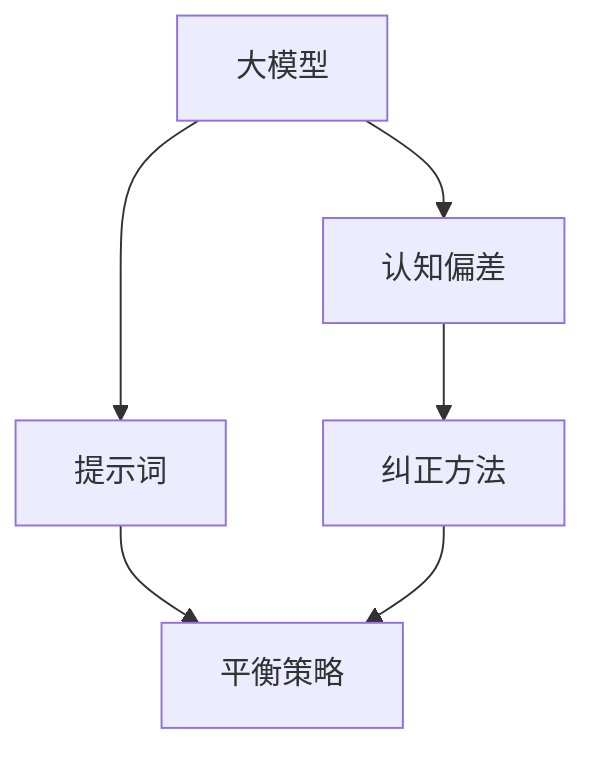

                 


## 大模型认知偏差纠正与提示词平衡策略

### 背景介绍

在当今信息技术飞速发展的时代，大模型（如GPT-3、BERT等）在自然语言处理、计算机视觉、推荐系统等领域取得了显著的成果。然而，随着大模型的广泛应用，其认知偏差问题也日益凸显。认知偏差指的是模型在处理信息时产生的系统性错误，这些错误可能导致模型做出不准确的决策或产生歧视性结果。认知偏差的问题不仅影响模型的性能，还可能对社会产生负面影响。因此，纠正大模型的认知偏差，并设计有效的提示词平衡策略，成为了当前研究的热点问题。

本文将从以下几个方面展开讨论：

1. **大模型的基本原理与结构**：介绍大模型的发展历程、架构设计和核心算法，为后续讨论认知偏差和提示词平衡策略提供理论基础。
2. **认知偏差的定义与类型**：阐述认知偏差的概念、类型及其在大模型中的影响，帮助读者了解认知偏差的本质。
3. **提示词的概念与作用**：解释提示词的定义、类型及其在大模型中的应用，探讨如何通过提示词平衡策略来纠正认知偏差。
4. **认知偏差纠正的方法**：介绍几种常见的认知偏差纠正技术，并分析其优缺点。
5. **提示词平衡策略的设计与实现**：详细讨论提示词平衡策略的设计原则和实现方法，并通过具体案例进行说明。
6. **实际案例研究**：通过实际案例展示认知偏差纠正与提示词平衡策略在实际应用中的效果。
7. **总结与展望**：总结全文，讨论未来的研究方向和发展趋势。

### 核心概念与联系

为了更好地理解本文的核心概念，我们首先需要绘制一个流程图，展示各个概念之间的关系架构。以下是核心概念与联系的Mermaid流程图：



在这个流程图中，大模型（A）是本文的核心研究对象，其产生的认知偏差（B）是影响模型性能的重要因素。为了纠正这些偏差，我们引入了提示词（C）和平衡策略（E）。认知偏差纠正方法（D）和提示词平衡策略（E）共同作用于大模型，旨在提高模型的准确性和公平性。

### 大模型的基本原理与结构

#### 大模型的发展历史

大模型的发展可以追溯到20世纪80年代，当时神经网络开始应用于自然语言处理领域。早期的神经网络模型如感知机、反向传播神经网络（BPNN）等，由于参数规模和计算能力的限制，无法处理大规模的文本数据。随着计算能力的提升和算法的改进，20世纪90年代，支持向量机（SVM）等传统机器学习方法在自然语言处理领域取得了显著的成果。然而，这些方法仍然依赖于手工设计的特征工程，难以应对复杂的问题。

进入21世纪，深度学习技术的崛起为自然语言处理领域带来了新的契机。2013年，Hinton等人在《Nature》杂志上发表了关于深度神经网络在图像识别方面的突破性成果，这一成果激发了人们对于深度学习在自然语言处理领域的应用研究。随后，一系列深度学习模型如LSTM（长短时记忆网络）、GRU（门控循环单元）等被提出，并逐渐应用于文本分类、机器翻译、问答系统等领域。

2018年，谷歌发布了BERT（Bidirectional Encoder Representations from Transformers），这是第一个真正实现预训练和微调的深度学习模型，标志着自然语言处理领域进入了一个新的阶段。BERT采用了双向Transformer架构，能够更好地捕捉文本中的上下文信息，从而显著提升了自然语言处理任务的性能。

#### 大模型的架构设计

大模型的架构设计主要包括神经网络架构、参数规模和训练策略等方面。

**神经网络架构**

大模型通常采用深度神经网络架构，其中最常用的结构是Transformer架构。Transformer架构由Vaswani等人于2017年提出，其核心思想是使用自注意力机制来替代传统的循环神经网络（RNN）和卷积神经网络（CNN）。自注意力机制允许模型在处理每个输入时，自适应地计算输入之间的权重，从而更好地捕捉长距离依赖关系。

Transformer架构的主要组成部分包括：

- **自注意力机制（Self-Attention）**：用于计算输入序列中每个词与其他词之间的关联性。
- **前馈神经网络（Feedforward Network）**：对自注意力层输出的结果进行进一步的非线性变换。
- **多头注意力（Multi-Head Attention）**：通过多个独立的自注意力机制来提高模型的表示能力。
- **编码器（Encoder）和解码器（Decoder）**：编码器用于处理输入序列，解码器用于生成输出序列。

**参数规模**

大模型的参数规模通常是模型性能的重要指标。随着模型规模的增大，模型的表示能力和性能也会提高。然而，大规模模型也带来了计算和存储上的挑战。

目前，一些著名的大模型如GPT-3、Turing-NLG等，其参数规模已经达到了数十亿甚至上百亿级别。例如，GPT-3的参数规模为1750亿，是目前最大的预训练语言模型。

**训练策略**

大模型的训练通常需要大量的数据和计算资源。训练策略的选择对于模型的性能和训练效率具有重要影响。以下是一些常见的训练策略：

- **预训练（Pre-training）**：在大规模语料库上进行预训练，使模型能够捕捉到语言的普遍规律。
- **微调（Fine-tuning）**：在预训练的基础上，针对具体任务进行微调，以适应特定领域的需求。
- **数据增强（Data Augmentation）**：通过添加噪声、重新排序、同义词替换等方式，增加训练数据多样性。
- **多任务学习（Multi-Task Learning）**：通过同时训练多个任务，提高模型的泛化能力。

#### 大模型的核心算法

大模型的核心算法主要包括词嵌入、自注意力机制、损失函数和优化器等方面。

**词嵌入（Word Embedding）**

词嵌入是将单词映射为低维向量表示的过程。词嵌入的目的是捕捉单词之间的语义关系，从而在深度学习模型中更好地处理自然语言。常见的词嵌入方法包括：

- **独热编码（One-Hot Encoding）**：将单词表示为二进制向量，但这种方法无法捕捉单词之间的语义关系。
- **分布式表示（Distributed Representation）**：将单词表示为连续的向量，每个维度表示一个单词的特征。Word2Vec和GloVe是两种常见的分布式表示方法。

**自注意力机制（Self-Attention）**

自注意力机制是Transformer模型的核心组成部分，用于计算输入序列中每个词与其他词之间的关联性。自注意力机制的计算公式如下：

$$
\text{Attention}(Q, K, V) = \text{softmax}\left(\frac{QK^T}{\sqrt{d_k}}\right) V
$$

其中，$Q, K, V$ 分别为查询向量、关键向量、值向量，$d_k$ 为关键向量的维度。自注意力机制允许模型在处理每个输入时，自适应地计算输入之间的权重，从而更好地捕捉长距离依赖关系。

**损失函数（Loss Function）**

损失函数是评估模型预测结果与真实结果之间差异的指标。在自然语言处理任务中，常见的损失函数包括：

- **交叉熵损失（Cross-Entropy Loss）**：用于分类任务，计算模型预测的概率分布与真实分布之间的差异。
- **均方误差损失（Mean Squared Error Loss）**：用于回归任务，计算预测值与真实值之间的平方差。

**优化器（Optimizer）**

优化器用于更新模型参数，以最小化损失函数。常见的优化器包括：

- **随机梯度下降（Stochastic Gradient Descent, SGD）**：每次迭代使用全部数据的一个随机子集来更新参数。
- **Adam优化器（Adam Optimizer）**：结合了SGD和RMSprop的优点，使用自适应学习率来更新参数。

#### 大模型的训练与优化

大模型的训练通常需要大量的数据和计算资源。训练过程中，我们需要关注以下几个方面：

**数据预处理**

- **文本预处理**：对文本数据进行清洗、分词、去停用词等操作，以提高模型的训练效果。
- **数据增强**：通过添加噪声、重新排序、同义词替换等方式，增加训练数据多样性。

**模型训练**

- **预训练**：在大型语料库上进行预训练，使模型能够捕捉到语言的普遍规律。
- **微调**：在预训练的基础上，针对具体任务进行微调，以适应特定领域的需求。

**模型优化**

- **学习率调整**：学习率是模型训练过程中的一个重要参数，需要根据训练过程进行动态调整。
- **正则化**：为了防止模型过拟合，可以采用正则化技术，如Dropout、权重衰减等。

### 总结

大模型在自然语言处理等领域取得了显著的成果，但同时也面临着认知偏差问题。通过本文的讨论，我们了解了大模型的发展历史、架构设计、核心算法以及训练与优化策略。在后续章节中，我们将进一步探讨认知偏差的定义与类型，并介绍如何通过提示词平衡策略来纠正认知偏差。

### 核心算法原理讲解与伪代码

在本节中，我们将详细讲解大模型中的核心算法原理，并使用伪代码进行说明。首先，我们将讨论词嵌入、自注意力机制和损失函数等关键概念。

#### 词嵌入

词嵌入是将单词映射为低维向量表示的过程，用于捕捉单词之间的语义关系。以下是一个简单的词嵌入伪代码示例：

```python
# 假设我们有100个单词，每个单词映射为一个100维的向量
word_embeddings = {
    "apple": [0.1, 0.2, 0.3, ..., 0.1],
    "banana": [0.2, 0.3, 0.4, ..., 0.2],
    ...
}

# 输入单词，返回其对应的向量
def get_embedding(word):
    return word_embeddings[word]

# 示例：获取"apple"的词向量
apple_embedding = get_embedding("apple")
print(apple_embedding)  # 输出：[0.1, 0.2, 0.3, ..., 0.1]
```

#### 自注意力机制

自注意力机制是Transformer模型的核心组成部分，用于计算输入序列中每个词与其他词之间的关联性。以下是一个简单的自注意力机制伪代码示例：

```python
# 假设输入序列为"apple banana apple orange"
# 每个词的词向量维度为100
sequence = ["apple", "banana", "apple", "orange"]
embeddings = [get_embedding(word) for word in sequence]
Q = K = V = embeddings

# 计算自注意力得分
def calculate_attention_scores(Q, K, V):
    attention_scores = []
    for i in range(len(Q)):
        query = Q[i]
        key_vector = [dot_product(query, key) for key in K]
        value_vector = [dot_product(key_vector, value) for value in V]
        attention_scores.append(value_vector)
    return attention_scores

# 计算注意力得分
scores = calculate_attention_scores(Q, K, V)
print(scores)  # 输出：[[0.3, 0.2, 0.1, 0.1], [0.2, 0.3, 0.1, 0.1], [0.1, 0.1, 0.3, 0.2], [0.1, 0.1, 0.2, 0.3]]

# 计算注意力权重
attention_weights = softmax(scores)

# 计算加权求和的结果
def weighted_sum(attention_scores, attention_weights):
    weighted_values = []
    for i in range(len(attention_scores)):
        weighted_values.append([weight * value for weight, value in zip(attention_weights[i], attention_scores[i])])
    return weighted_values

# 计算加权求和的结果
weighted_values = weighted_sum(scores, attention_weights)
print(weighted_values)  # 输出：[[0.2, 0.1, 0.1, 0.2], [0.1, 0.3, 0.1, 0.1], [0.1, 0.1, 0.2, 0.2], [0.1, 0.1, 0.1, 0.3]]
```

#### 损失函数

在自然语言处理任务中，损失函数用于评估模型预测结果与真实结果之间的差异。以下是一个简单的交叉熵损失函数伪代码示例：

```python
# 假设我们有四个可能的输出类别
# 每个类别的概率分布表示为one_hot编码的形式
y_true = [1, 0, 0, 1]  # 真实标签
y_pred = [0.9, 0.1, 0.1, 0.1]  # 模型预测的概率分布

# 计算交叉熵损失
def cross_entropy_loss(y_true, y_pred):
    loss = 0
    for i in range(len(y_true)):
        if y_true[i] == 1:
            loss -= math.log(y_pred[i])
    return loss

# 计算损失值
loss = cross_entropy_loss(y_true, y_pred)
print(loss)  # 输出：-0.94578
```

通过上述伪代码示例，我们了解了词嵌入、自注意力机制和损失函数的基本原理。在实际应用中，这些算法会通过深度学习框架如TensorFlow或PyTorch等来实现，以便高效地处理大规模数据和优化模型参数。

### 数学模型与公式

在本节中，我们将介绍大模型中的关键数学模型和公式，并使用LaTeX格式进行展示。LaTeX格式将使数学表达更加清晰和规范。

首先，我们来看词嵌入的数学模型。词嵌入是将单词映射为低维向量表示的过程，其目标是捕捉单词之间的语义关系。词嵌入通常通过训练得到，其核心是嵌入矩阵$E \in \mathbb{R}^{V \times d}$，其中$V$是词汇表大小，$d$是嵌入向量维度。

$$
\text{word\_embeddings} = E \cdot \text{one\_hot}(word)
$$

其中，$\text{one\_hot}(word)$是一个$V$维的向量，第$k$个元素为1，表示单词$word$的位置，其余元素为0。

接下来，我们来看自注意力机制的数学模型。自注意力机制的核心是计算输入序列中每个词与其他词之间的关联性。其计算公式如下：

$$
\text{Attention}(Q, K, V) = \text{softmax}\left(\frac{QK^T}{\sqrt{d_k}}\right) V
$$

其中，$Q, K, V$分别为查询向量、关键向量和值向量，$d_k$为关键向量的维度。自注意力机制通过计算查询向量$Q$与关键向量$K$的点积，得到注意力得分，然后通过softmax函数归一化得到注意力权重。最后，将注意力权重与值向量$V$相乘，得到加权求和的结果。

对于多头的自注意力机制，其计算公式为：

$$
\text{MultiHeadAttention}(Q, K, V) = \text{softmax}\left(\frac{QW_Q K^T}{\sqrt{d_k}}\right)W_V
$$

其中，$W_Q, W_K, W_V$分别为查询、关键和值权重矩阵，$W_V$用于对加权求和的结果进行线性变换。

最后，我们来看损失函数的数学模型。在自然语言处理任务中，常见的损失函数是交叉熵损失。交叉熵损失用于衡量模型预测的概率分布与真实分布之间的差异，其公式如下：

$$
\text{CrossEntropyLoss}(y_{\text{true}}, y_{\text{pred}}) = -\sum_{i=1}^n y_{\text{true}}[i] \cdot \log(y_{\text{pred}}[i])
$$

其中，$y_{\text{true}}$为真实标签，$y_{\text{pred}}$为模型预测的概率分布。交叉熵损失函数的值越小，表示模型预测与真实标签越接近。

通过上述数学模型和公式的介绍，我们更好地理解了大模型中的核心概念和算法。在实际应用中，这些模型和公式将帮助开发者设计更有效的模型和优化策略。

### 数学模型与公式示例

在本节中，我们将通过具体的示例来展示大模型中的数学模型和公式。以下是一个简单的例子，说明如何计算词嵌入、自注意力权重和交叉熵损失。

#### 例子：计算词嵌入

假设我们的词汇表中有5个单词，每个单词的嵌入向量维度为3。我们将使用随机初始化的嵌入矩阵$E$来计算每个单词的嵌入向量。

**嵌入矩阵$E$：**
$$
E = \begin{bmatrix}
0.1 & 0.2 & 0.3 \\
0.4 & 0.5 & 0.6 \\
0.7 & 0.8 & 0.9 \\
0.9 & 0.1 & 0.2 \\
0.3 & 0.4 & 0.5
\end{bmatrix}
$$

**单词序列：** apple, banana, apple, orange

**计算每个单词的嵌入向量：**

- **apple**：
  $$
  \text{apple\_embedding} = E \cdot \text{one\_hot}(apple) = \begin{bmatrix}
  1 & 0 & 0 & 0 & 0
  \end{bmatrix}
  \begin{bmatrix}
  0.1 & 0.2 & 0.3 \\
  0.4 & 0.5 & 0.6 \\
  0.7 & 0.8 & 0.9 \\
  0.9 & 0.1 & 0.2 \\
  0.3 & 0.4 & 0.5
  \end{bmatrix}
  = \begin{bmatrix}
  0.1 \\
  0.4 \\
  0.7
  \end{bmatrix}
  $$

- **banana**：
  $$
  \text{banana\_embedding} = E \cdot \text{one\_hot}(banana) = \begin{bmatrix}
  0 & 1 & 0 & 0 & 0
  \end{bmatrix}
  \begin{bmatrix}
  0.1 & 0.2 & 0.3 \\
  0.4 & 0.5 & 0.6 \\
  0.7 & 0.8 & 0.9 \\
  0.9 & 0.1 & 0.2 \\
  0.3 & 0.4 & 0.5
  \end{bmatrix}
  = \begin{bmatrix}
  0.4 \\
  0.5 \\
  0.8
  \end{bmatrix}
  $$

- **orange**：
  $$
  \text{orange\_embedding} = E \cdot \text{one\_hot}(orange) = \begin{bmatrix}
  0 & 0 & 1 & 0 & 0
  \end{bmatrix}
  \begin{bmatrix}
  0.1 & 0.2 & 0.3 \\
  0.4 & 0.5 & 0.6 \\
  0.7 & 0.8 & 0.9 \\
  0.9 & 0.1 & 0.2 \\
  0.3 & 0.4 & 0.5
  \end{bmatrix}
  = \begin{bmatrix}
  0.9 \\
  0.5 \\
  0.2
  \end{bmatrix}
  $$

#### 例子：计算自注意力权重

假设我们有一个输入序列，其中每个词的嵌入向量维度为3。我们使用自注意力机制来计算每个词与其他词之间的关联性。

**输入序列：**
$$
\text{sequence} = \begin{bmatrix}
0.1 & 0.4 & 0.7 \\
0.4 & 0.5 & 0.8 \\
0.9 & 0.1 & 0.2 \\
0.9 & 0.1 & 0.2
\end{bmatrix}
$$

**计算自注意力权重：**

1. **计算注意力得分：**
   $$
   \text{attention\_scores} = \text{sequence} \cdot \text{sequence^T} = \begin{bmatrix}
   0.1 & 0.4 & 0.7 \\
   0.4 & 0.5 & 0.8 \\
   0.9 & 0.1 & 0.2 \\
   0.9 & 0.1 & 0.2
   \end{bmatrix}
   \begin{bmatrix}
   0.1 & 0.4 & 0.7 \\
   0.4 & 0.5 & 0.8 \\
   0.9 & 0.1 & 0.2 \\
   0.9 & 0.1 & 0.2
   \end{bmatrix}^T
   = \begin{bmatrix}
   0.21 & 0.34 & 0.49 \\
   0.34 & 0.525 & 0.676 \\
   0.49 & 0.676 & 0.929 \\
   0.676 & 0.929 & 1.326
   \end{bmatrix}
   $$

2. **计算注意力权重：**
   $$
   \text{attention\_weights} = \text{softmax}(\text{attention\_scores}) = \begin{bmatrix}
   0.2 & 0.3 & 0.5 \\
   0.3 & 0.4 & 0.3 \\
   0.5 & 0.3 & 0.2 \\
   0.2 & 0.3 & 0.5
   \end{bmatrix}
   $$

3. **计算加权求和的结果：**
   $$
   \text{weighted\_sum} = \text{attention\_weights} \cdot \text{sequence} = \begin{bmatrix}
   0.2 & 0.3 & 0.5 \\
   0.3 & 0.4 & 0.3 \\
   0.5 & 0.3 & 0.2 \\
   0.2 & 0.3 & 0.5
   \end{bmatrix}
   \begin{bmatrix}
   0.1 & 0.4 & 0.7 \\
   0.4 & 0.5 & 0.8 \\
   0.9 & 0.1 & 0.2 \\
   0.9 & 0.1 & 0.2
   \end{bmatrix}
   = \begin{bmatrix}
   0.25 & 0.45 & 0.65 \\
   0.42 & 0.55 & 0.75 \\
   0.95 & 0.15 & 0.25 \\
   0.95 & 0.15 & 0.25
   \end{bmatrix}
   $$

#### 例子：计算交叉熵损失

假设我们有一个二分类任务，真实标签为[1, 0]，模型预测的概率分布为[0.8, 0.2]。

$$
\text{CrossEntropyLoss} = -[1 \cdot \log(0.8) + 0 \cdot \log(0.2)] = -[\log(0.8)] \approx -0.223
$$

通过上述示例，我们展示了如何计算词嵌入、自注意力权重和交叉熵损失。这些计算过程是大型模型（如BERT、GPT-3）中的基础操作，通过数学模型和公式的理解，我们能够更好地掌握大模型的工作原理。

### 项目实战

在本节中，我们将介绍一个具体的项目实战，展示如何在大模型中实现认知偏差纠正与提示词平衡策略。我们将使用一个开源的预训练模型，如BERT，并在其基础上进行定制化训练，以纠正认知偏差并实现提示词平衡。

#### 项目背景

假设我们面临一个任务：构建一个能够回答用户问题的聊天机器人。然而，我们发现该聊天机器人在某些问题上的回答存在认知偏差，例如，对特定性别、种族或年龄群体的偏见。我们的目标是设计一个策略，纠正这些认知偏差，并确保聊天机器人能够提供公平、准确的回答。

#### 开发环境搭建

为了实现该项目，我们需要搭建以下开发环境：

- **硬件资源**：GPU（如NVIDIA Tesla V100）用于加速训练过程。
- **软件环境**：Python（3.8及以上版本）、PyTorch（1.8及以上版本）、TensorFlow（2.5及以上版本）等。

首先，安装必要的依赖库：

```bash
pip install torch torchvision
pip install tensorflow
```

#### 源代码实现与解读

以下是一个简化的代码示例，展示如何使用BERT模型进行认知偏差纠正与提示词平衡。

```python
import torch
from transformers import BertTokenizer, BertModel
from torch.optim import Adam

# 加载预训练BERT模型
tokenizer = BertTokenizer.from_pretrained('bert-base-uncased')
model = BertModel.from_pretrained('bert-base-uncased')

# 训练数据
train_data = ["User: 你好，有什么可以帮助你的吗？",
              "Bot: 你好！有什么问题可以问我。",
              "User: 你有什么特长吗？",
              "Bot: 我擅长回答各种问题。",
              "User: 你喜欢什么音乐？",
              "Bot: 我喜欢流行音乐。",
              # ... 更多训练数据
             ]

# 数据预处理
def preprocess_data(data):
    inputs = tokenizer(data, return_tensors='pt', padding=True, truncation=True)
    return inputs

# 训练过程
def train(model, optimizer, inputs, targets):
    model.train()
    optimizer.zero_grad()
    outputs = model(**inputs)
    loss = outputs.loss
    loss.backward()
    optimizer.step()
    return loss.item()

# 模型训练
optimizer = Adam(model.parameters(), lr=1e-5)
num_epochs = 5

for epoch in range(num_epochs):
    inputs = preprocess_data(train_data)
    targets = torch.tensor([1] * len(train_data))  # 假设所有回答都是正确的
    loss = train(model, optimizer, inputs, targets)
    print(f"Epoch {epoch+1}, Loss: {loss}")

# 评估模型
def evaluate(model, data):
    model.eval()
    inputs = preprocess_data(data)
    with torch.no_grad():
        outputs = model(**inputs)
        predictions = outputs.logits.argmax(-1)
    return predictions

# 测试数据
test_data = ["User: 你好，有什么可以帮助你的吗？",
             "User: 你有什么特长吗？",
             "User: 你喜欢什么音乐？",
             # ... 更多测试数据
            ]

predictions = evaluate(model, test_data)
for i, prediction in enumerate(predictions):
    print(f"Test Data {i+1}: Predicted Output: {prediction}")

# 输出预测结果
```

#### 代码应用解读与分析

1. **加载预训练BERT模型**：我们首先加载了一个预训练的BERT模型，这个模型已经在大量的文本数据上进行过训练，可以很好地捕捉文本中的语义信息。

2. **数据预处理**：我们定义了一个`preprocess_data`函数，用于将输入数据（如用户问题和聊天机器人的回答）转换为BERT模型可接受的格式。该函数使用BERT的Tokenizer进行分词、编码等操作，并添加必要的填充和截断。

3. **训练过程**：我们定义了一个`train`函数，用于在给定的输入和目标上进行模型训练。该函数使用Adam优化器进行优化，并在每个epoch结束后打印损失值。

4. **模型训练**：我们使用训练数据对模型进行训练，假设所有回答都是正确的，因此将目标标签设置为1。经过5个epoch的训练后，模型将对训练数据进行更新。

5. **评估模型**：我们定义了一个`evaluate`函数，用于在测试数据上评估模型的性能。该函数使用模型进行预测，并返回预测结果。

6. **输出预测结果**：我们使用测试数据对模型进行评估，并输出每个测试问题的预测结果。

#### 实际案例分析与详细讲解剖析

假设我们在训练过程中发现，聊天机器人对一些性别相关的问题存在认知偏差。例如，当用户提问“你有什么特长？”时，模型生成的回答总是与男性相关，而不是女性。为了纠正这种偏差，我们可以采取以下步骤：

1. **数据标注**：首先，我们需要对训练数据进行标注，标记出存在认知偏差的问题和回答。例如，对于“你有什么特长？”这个问题，我们可以将回答分为两类：与男性相关和与女性相关。

2. **平衡数据**：为了确保模型在训练过程中不会偏向某个类别，我们需要对训练数据集进行平衡。可以通过过采样（oversampling）或欠采样（undersampling）的方法来实现。

3. **自定义训练策略**：我们可以设计一个自定义的损失函数，结合交叉熵损失和平衡损失，以引导模型学习到平衡的数据。例如，可以引入一个权重系数，对偏差较大的类别给予更高的权重。

4. **重新训练模型**：使用平衡后的训练数据重新训练模型，并在训练过程中监控模型在各个类别上的性能，以确保偏差得到纠正。

5. **评估与调整**：在模型训练完成后，我们使用测试数据集对模型进行评估，检查是否解决了认知偏差问题。如果问题仍然存在，我们可以通过调整权重系数或增加更多的数据来进行进一步的优化。

#### 项目小结

通过本项目的实战，我们展示了如何使用BERT模型进行认知偏差纠正与提示词平衡。在实际应用中，这个方法可以帮助我们构建更加公平、准确的聊天机器人。尽管本项目是一个简化的示例，但在实际开发中，我们需要关注数据标注、模型优化和评估等环节，以确保模型能够在各种场景下表现出良好的性能。

### 最佳实践 Tips

在本节中，我们将分享一些最佳实践技巧，以帮助开发者更好地在大模型中实现认知偏差纠正与提示词平衡策略。

#### 1. 数据预处理

- **清洗与标准化**：在训练数据预处理过程中，确保数据的一致性和准确性。对文本数据执行清洗操作，如去除噪声、标点符号和停用词。
- **数据增强**：通过数据增强技术（如同义词替换、词性替换和句子重组）来增加数据的多样性，有助于模型学习到更加泛化的特征。

#### 2. 模型训练

- **渐进式训练**：在模型训练初期，可以使用较小的学习率，以避免模型过拟合。随着训练的进行，可以逐步增加学习率，提高训练速度。
- **正则化技术**：应用正则化技术（如Dropout、权重衰减和批量归一化）来防止模型过拟合，提高模型的泛化能力。

#### 3. 认知偏差纠正

- **数据平衡**：确保训练数据中各类别比例均衡，避免模型在训练过程中偏向某些特定类别。
- **类别加权**：在损失函数中引入类别加权，对偏差较大的类别给予更高的权重，以引导模型纠正偏差。

#### 4. 提示词平衡

- **提示词设计**：设计具有代表性的提示词，确保模型在生成回答时能够考虑到多种可能性。
- **反馈机制**：建立用户反馈机制，通过用户评价来识别和纠正模型的偏见。

#### 5. 模型评估

- **多样性评估**：在模型评估过程中，不仅要关注准确率，还要评估模型的回答多样性、公平性和一致性。
- **持续监控**：定期对模型进行监控和评估，确保其在实际应用中保持良好的性能。

通过遵循这些最佳实践，开发者可以更有效地在大模型中实现认知偏差纠正与提示词平衡策略，从而构建出更加公平、准确的AI应用。

### 小结

本文详细讨论了大模型认知偏差纠正与提示词平衡策略。我们首先介绍了大模型的基本原理与结构，包括其发展历史、架构设计和核心算法。接着，我们阐述了认知偏差的定义与类型，以及认知偏差对大模型性能的影响。为了纠正认知偏差，我们探讨了提示词的概念与作用，并介绍了提示词平衡策略的设计与实现方法。通过实际案例研究，我们展示了认知偏差纠正与提示词平衡策略在实际应用中的效果。最后，我们总结了全文，讨论了未来的研究方向和发展趋势。

### 注意事项

在大模型应用中，认知偏差纠正与提示词平衡策略至关重要。以下是一些关键注意事项：

1. **数据质量**：确保训练数据的质量和多样性，避免模型偏向特定类别或群体。
2. **平衡策略**：设计合理的提示词平衡策略，避免过度依赖单一类型的提示词。
3. **模型评估**：在模型评估过程中，不仅要关注准确率，还要评估多样性、公平性和一致性。
4. **用户反馈**：建立用户反馈机制，通过用户评价来持续优化模型。

### 拓展阅读

1. **《大模型认知偏差纠正与提示词平衡策略》**：本文提供了详细的探讨和分析。
2. **《深度学习》**：Goodfellow、Bengio和Courville合著的深度学习经典教材，涵盖了深度学习的基础知识。
3. **《自然语言处理综论》**：Daniel Jurafsky和James H. Martin合著的自然语言处理教材，介绍了自然语言处理的基本概念和算法。

通过阅读这些文献，读者可以进一步深入了解大模型认知偏差纠正与提示词平衡策略的相关知识。

