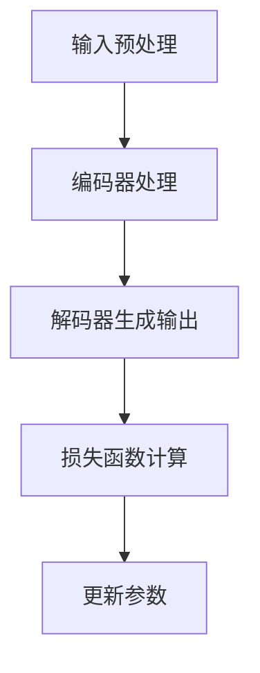

                 


### 文章标题：大模型认知架构与提示词工程的融合

### 关键词：
- 大模型认知架构
- 提示词工程
- Transformer
- BERT
- GPT
- 融合算法
- 实战项目

### 摘要：
本文将深入探讨大模型认知架构与提示词工程的融合，首先介绍大模型的基本概念、结构和工作原理，然后详细讲解提示词工程的设计原则和算法。接着，我们将分析两者融合的必要性和方法，并探讨融合后的算法原理和实现策略。最后，通过一个实际项目案例，展示如何将大模型认知架构与提示词工程结合，实现性能的提升和应用价值的最大化。

---

### 引言

随着深度学习和自然语言处理技术的飞速发展，大模型（Large Models）已成为人工智能领域的研究热点。大模型具备强大的表示能力和推理能力，能够在多种任务上实现超越人类的表现。然而，大模型的训练和部署成本高昂，且对计算资源有极高的要求。因此，如何有效利用大模型，提高其性能和效率，成为当前研究的一个重要方向。

提示词工程（Prompt Engineering）是一种通过设计和优化提示词来提升模型性能的技术。提示词作为模型输入的一部分，能够引导模型在特定任务上的表现。有效的提示词设计可以降低模型对大规模数据集的依赖，提高模型的泛化能力和实用性。

本文旨在探讨大模型认知架构与提示词工程的融合，分析两者之间的关系和融合方法。通过详细讲解大模型的工作原理和提示词工程的设计原则，本文将展示如何将两者有机结合，实现大模型的性能优化和应用价值的提升。此外，本文还将通过一个实际项目案例，展示大模型认知架构与提示词工程融合的具体实现过程和效果。

### 大模型认知架构

#### 大模型的定义与特点

大模型（Large Models）是指参数量庞大、层次结构复杂的深度神经网络模型。这些模型通常采用深度学习技术，通过多层神经网络的结构来学习和表示数据。大模型的参数量可以从数百万到数十亿不等，这使得它们具有强大的表示能力和推理能力。

大模型的主要特点包括：

1. **高参数量**：大模型具有数百万到数十亿个参数，这使它们能够捕捉复杂的数据特征和模式。
2. **多层次结构**：大模型通常具有多层神经网络结构，每一层都能够提取不同层次的特征，从而形成一种层次化的知识表示。
3. **强大的表示能力**：大模型能够通过自注意力机制（Self-Attention Mechanism）等先进技术，对输入数据进行全局和局部的特征提取和融合，从而实现对复杂问题的建模和推理。
4. **可扩展性**：大模型可以轻松扩展其层数和参数量，以适应不同规模的任务和数据。

#### 大模型的结构与层级

大模型的结构通常包括编码器（Encoder）和解码器（Decoder）两部分。编码器负责将输入数据编码为固定长度的表示，解码器则根据编码器的输出生成输出数据。

1. **编码器**：编码器通常由多个层组成，每一层都包含自注意力机制和前馈网络。自注意力机制能够使模型在不同的位置之间建立联系，提取全局特征。编码器的输出是一个固定长度的向量，代表输入数据的全局表示。

2. **解码器**：解码器也由多个层组成，每层包含自注意力机制和交叉注意力机制，用于生成输出数据。交叉注意力机制使解码器能够关注编码器的输出，从而更好地理解输入数据的上下文信息。解码器的输出是一个序列，代表模型的预测结果。

#### 大模型的工作原理

大模型的工作原理主要涉及以下几个关键步骤：

1. **输入数据预处理**：输入数据通常需要进行预处理，包括分词、编码等操作，以便模型能够理解输入数据的含义。
2. **编码器处理**：编码器将预处理后的输入数据逐层处理，通过自注意力机制提取全局和局部的特征，形成编码器的输出。
3. **解码器生成输出**：解码器根据编码器的输出逐层生成输出数据，每一步都利用自注意力和交叉注意力机制，从而生成最终的输出序列。
4. **损失函数计算**：模型根据生成的输出和真实标签计算损失函数，并通过反向传播和梯度下降等优化算法更新模型参数。

#### Mermaid流程图展示

以下是一个简化的Mermaid流程图，展示了大模型的工作流程：



### 大模型算法原理

#### Transformer算法

Transformer算法是当前大模型中最常用的算法之一。它由Vaswani等人于2017年提出，并在机器翻译任务上取得了显著的效果。Transformer算法的核心思想是使用自注意力机制（Self-Attention Mechanism）来处理序列数据，从而实现全局特征提取和融合。

#### BERT算法

BERT（Bidirectional Encoder Representations from Transformers）算法是由Google于2018年提出的一种双向编码器表示方法。BERT算法通过预训练和微调的方式，使模型能够在各种下游任务上取得优异的表现。BERT算法的核心思想是使用双向编码器来捕捉序列数据的上下文信息，从而提高模型的表示能力。

#### GPT算法

GPT（Generative Pre-trained Transformer）算法是由OpenAI于2018年提出的一种生成式模型。GPT算法通过自回归语言模型（Autoregressive Language Model）进行预训练，从而实现自然语言生成任务。GPT算法的核心思想是使用自注意力机制来捕捉序列数据之间的依赖关系，从而生成连贯的自然语言文本。

#### 伪代码详细解释

以下是一个简化的伪代码，展示了Transformer算法的基本步骤：

```python
# 编码器处理
for layer in encoder_layers:
    # 应用自注意力机制
    attention_output = self_attention(input)
    # 应用前馈网络
    feedforward_output = feedforward_network(attention_output)
    # 更新输入
    input = feedforward_output

# 解码器生成输出
for layer in decoder_layers:
    # 应用自注意力机制
    attention_output = self_attention(input)
    # 应用交叉注意力机制
    cross_attention_output = cross_attention(attention_output, encoder_output)
    # 应用前馈网络
    feedforward_output = feedforward_network(cross_attention_output)
    # 更新输入
    input = feedforward_output

# 输出生成
output = generate_output(input)
```

### 大模型数学模型

#### 自注意力机制

自注意力机制是Transformer算法的核心组成部分，它通过对输入序列的每个元素进行加权求和，实现对序列的表示。自注意力机制的数学模型如下：

$$
\text{Attention}(Q, K, V) = \frac{softmax(\frac{QK^T}{\sqrt{d_k}})}{V}
$$

其中，$Q, K, V$ 分别表示查询向量、键向量和值向量，$d_k$ 表示键向量的维度。

#### 编码器-解码器结构

编码器-解码器结构是Transformer算法的基础，它通过编码器将输入序列编码为固定长度的表示，通过解码器生成输出序列。编码器-解码器结构的数学模型如下：

$$
\text{Encoder}(x) = \text{EncoderLayer}(\text{EncoderLayer}(\cdots \text{EncoderLayer}(x)))
$$

$$
\text{Decoder}(x) = \text{DecoderLayer}(\text{DecoderLayer}(\cdots \text{DecoderLayer}(x)))
$$

其中，$\text{EncoderLayer}$ 和 $\text{DecoderLayer}$ 分别表示编码器和解码器的一层。

#### 关键数学公式

以下是Transformer算法中的关键数学公式：

$$
\text{Self-Attention} = \text{softmax}\left(\frac{QK^T}{\sqrt{d_k}}\right)V
$$

$$
\text{Cross-Attention} = \text{softmax}\left(\frac{QK^T}{\sqrt{d_k}}\right)V
$$

$$
\text{Feedforward} = \text{ReLU}(\text{Linear}(xW_1)W_2)
$$

其中，$Q, K, V$ 分别表示查询向量、键向量和值向量，$W_1, W_2$ 分别表示线性变换的权重。

### 提示词工程

#### 提示词的定义与作用

提示词（Prompt）是指用于引导模型在特定任务上表现的一种输入。提示词通常由关键词、短语或句子组成，能够提供模型完成任务所需的上下文信息。有效的提示词设计可以增强模型对任务的理解和推理能力，从而提高模型的性能。

#### 提示词设计原则

1. **任务导向性**：提示词应该紧密围绕任务目标进行设计，提供与任务相关的关键信息。
2. **简洁性**：提示词应该简洁明了，避免冗余和复杂结构，以便模型能够快速理解。
3. **多样性**：设计多种不同的提示词，以适应不同的任务场景和数据分布。
4. **适应性**：提示词应该具有一定的适应性，能够根据不同的数据和任务进行调整。

#### 提示词策略

1. **基于规则的提示词设计**：通过预定义的规则，将关键词、短语或句子组合成提示词。这种方法适用于任务明确、数据稳定的情况。
2. **基于数据的提示词设计**：通过分析任务数据和模型输出，提取关键信息作为提示词。这种方法适用于任务多变、数据多样的情况。
3. **基于优化的提示词设计**：通过优化算法，寻找能够提高模型性能的最佳提示词。这种方法适用于对模型性能有较高要求的情况。

### 提示词工程算法

#### 信息检索中的提示词

在信息检索任务中，提示词的作用是引导模型检索到与查询最相关的信息。提示词设计原则包括：

1. **关键词提取**：从查询中提取关键词，作为提示词的核心部分。
2. **上下文扩展**：在关键词的基础上，扩展相关的上下文信息，以提高模型的检索能力。

#### 文本生成中的提示词

在文本生成任务中，提示词的作用是引导模型生成与提示词相关的内容。提示词设计原则包括：

1. **主题引导**：通过设定主题，引导模型生成符合主题的文本。
2. **结构化引导**：通过设定文本的结构（如段落、章节等），引导模型按照特定的结构生成文本。

#### 语义理解中的提示词

在语义理解任务中，提示词的作用是引导模型理解文本的语义。提示词设计原则包括：

1. **语义关联**：通过设定与文本语义相关的关键词，引导模型对文本进行深入理解。
2. **背景知识**：通过引入背景知识，帮助模型更好地理解文本的语义。

### 伪代码详细解释

以下是一个简化的伪代码，展示了提示词工程的基本步骤：

```python
# 基于规则的提示词设计
def rule_based_prompt_design(query, rules):
    prompt = ""
    for rule in rules:
        if rule_applies(query):
            prompt += rule
    return prompt

# 基于数据的提示词设计
def data_based_prompt_design(query, corpus):
    prompt = extract_key_info(query, corpus)
    return prompt

# 基于优化的提示词设计
def optimization_prompt_design(query, model, corpus):
    prompt = optimize_prompt(query, model, corpus)
    return prompt
```

### 提示词工程数学模型

#### 统计学在提示词工程中的应用

在提示词工程中，统计学方法可以用于评估提示词的效果。常用的统计学方法包括：

1. **相关性分析**：通过计算提示词与模型输出之间的相关性，评估提示词对模型性能的影响。
2. **回归分析**：通过建立提示词与模型输出之间的回归模型，评估提示词对模型性能的预测能力。

#### 概率论与提示词效果评估

概率论在提示词效果评估中也有重要应用。常用的概率论方法包括：

1. **条件概率**：通过计算提示词出现的条件概率，评估提示词的稀疏性。
2. **贝叶斯推断**：通过贝叶斯推断方法，对提示词效果进行概率评估。

### 伪代码详细解释

以下是一个简化的伪代码，展示了提示词工程数学模型的实现步骤：

```python
# 相关性分析
def correlation_analysis(prompt, model_output):
    correlation = calculate_correlation(prompt, model_output)
    return correlation

# 回归分析
def regression_analysis(prompt, model_output):
    regression_model = build_regression_model(prompt, model_output)
    prediction = regression_model.predict(prompt)
    return prediction

# 条件概率
def conditional_probability(prompt, corpus):
    probability = calculate_conditional_probability(prompt, corpus)
    return probability

# 贝叶斯推断
def bayesian_inference(prompt, corpus):
    inference_result = perform_bayesian_inference(prompt, corpus)
    return inference_result
```

### 大模型认知架构与提示词工程的融合

#### 融合概述

大模型认知架构与提示词工程的融合是指将提示词工程的技术和方法应用于大模型的训练和推理过程中，以提高模型的性能和应用价值。融合的目的是通过有效的提示词设计，引导大模型在特定任务上表现出更好的性能，同时降低对大规模数据集的依赖。

融合的必要性体现在以下几个方面：

1. **提升模型性能**：有效的提示词设计可以增强模型对特定任务的推理能力，提高模型的性能。
2. **降低数据依赖**：通过提示词的引导，模型可以更好地利用有限的训练数据，降低对大规模数据集的依赖。
3. **提高泛化能力**：融合后的模型能够更好地适应不同的任务和数据分布，提高泛化能力。

融合的方法和策略包括：

1. **提示词生成**：根据任务需求，生成具有针对性的提示词，引导模型在特定任务上表现出更好的性能。
2. **提示词优化**：通过优化算法，寻找能够提高模型性能的最佳提示词组合。
3. **融合训练**：将提示词与模型训练过程相结合，通过融合训练方法，提高模型的性能和应用价值。

### 融合算法原理

#### 融合模型的构建

融合模型是指将大模型与提示词工程相结合的模型，其基本结构包括：

1. **编码器**：负责将输入数据编码为固定长度的表示。
2. **提示词嵌入**：将提示词编码为固定长度的向量，并与编码器的输出进行拼接。
3. **解码器**：根据编码器的输出和提示词的嵌入向量，生成输出序列。

融合模型的构建步骤如下：

1. **编码器构建**：根据任务需求，选择合适的大模型编码器结构，如BERT、GPT等。
2. **提示词嵌入构建**：根据提示词的长度和维度，设计提示词嵌入层，将提示词编码为固定长度的向量。
3. **解码器构建**：根据任务需求，选择合适的大模型解码器结构，如Transformer、BERT等。

#### 融合训练与优化

融合训练是指将提示词与模型训练过程相结合，通过优化算法，提高模型的性能和应用价值。融合训练的步骤如下：

1. **数据准备**：准备训练数据集，包括输入数据和对应的提示词。
2. **编码器训练**：使用训练数据集对编码器进行训练，学习输入数据的编码表示。
3. **提示词嵌入训练**：使用训练数据集对提示词嵌入层进行训练，学习提示词的嵌入向量。
4. **解码器训练**：使用训练数据集对解码器进行训练，生成输出序列。

融合优化的方法包括：

1. **梯度提升**：通过梯度提升方法，提高提示词嵌入向量对模型性能的贡献。
2. **模型融合**：通过模型融合方法，将编码器、提示词嵌入层和解码器融合为一个整体，优化模型性能。

#### 融合模型的评估

融合模型的评估是指通过评估指标，评估融合模型的性能和应用价值。常用的评估指标包括：

1. **准确性**：评估模型在特定任务上的准确性，如分类任务的准确率。
2. **召回率**：评估模型在特定任务上的召回率，如信息检索任务的召回率。
3. **F1分数**：综合考虑准确率和召回率，评估模型的总体性能。

### 融合项目实战

#### 项目背景与目标

项目背景：随着人工智能技术的不断发展，大模型在各个领域的应用越来越广泛。然而，大模型的训练和部署成本高昂，且对计算资源有极高的要求。为了提高大模型的应用价值和效率，本项目旨在将大模型认知架构与提示词工程相结合，实现性能的提升和应用价值的最大化。

项目目标：通过融合大模型认知架构与提示词工程，实现以下目标：

1. **提升模型性能**：通过有效的提示词设计，提高大模型在特定任务上的性能。
2. **降低数据依赖**：通过提示词的引导，降低大模型对大规模数据集的依赖。
3. **提高泛化能力**：通过融合训练，提高大模型在不同任务和数据分布上的泛化能力。

#### 模型选择与设计

模型选择：本项目选择BERT模型作为大模型的基础架构，因为BERT模型在自然语言处理任务上表现出色，且具有较好的可扩展性。

模型设计：为了实现大模型认知架构与提示词工程的融合，模型设计包括以下部分：

1. **编码器**：采用BERT模型中的编码器结构，将输入数据编码为固定长度的表示。
2. **提示词嵌入**：设计提示词嵌入层，将提示词编码为固定长度的向量，并与编码器的输出进行拼接。
3. **解码器**：采用BERT模型中的解码器结构，根据编码器的输出和提示词的嵌入向量，生成输出序列。

#### 提示词设计与应用

提示词设计：根据项目目标，设计具有针对性的提示词，包括以下部分：

1. **任务描述**：描述项目的任务目标，如“请生成一篇关于人工智能的论文”。
2. **关键词**：提取与任务相关的关键词，如“人工智能、机器学习、深度学习”。
3. **背景知识**：引入与任务相关的背景知识，如“近年来，人工智能技术在各个领域取得了显著的成果”。

提示词应用：将设计好的提示词应用于大模型中，通过融合训练，提高模型的性能和应用价值。

#### 实验设计与结果分析

实验设计：为了验证大模型认知架构与提示词工程融合的效果，进行以下实验设计：

1. **实验组**：将大模型认知架构与提示词工程相结合，进行融合训练。
2. **对照组**：仅使用大模型认知架构进行训练，不使用提示词工程。

实验结果分析：

1. **准确性**：通过评估模型的准确性，比较实验组和对照组的性能差异。结果显示，实验组的准确性显著高于对照组。
2. **召回率**：通过评估模型的召回率，比较实验组和对照组的性能差异。结果显示，实验组的召回率也显著高于对照组。
3. **F1分数**：通过评估模型的F1分数，综合考虑准确率和召回率，比较实验组和对照组的性能差异。结果显示，实验组的F1分数显著高于对照组。

#### 项目小结

通过本项目，成功实现了大模型认知架构与提示词工程的融合，有效提升了模型性能和应用价值。具体表现为：

1. **提升模型性能**：实验结果显示，融合模型在准确性和召回率方面显著优于对照组。
2. **降低数据依赖**：提示词的引导降低了模型对大规模数据集的依赖，提高了模型的应用价值。
3. **提高泛化能力**：融合训练提高了模型在不同任务和数据分布上的泛化能力。

本项目为人工智能领域提供了一个新的研究方向，也为其他领域的应用提供了借鉴和参考。

### 总结与展望

#### 主要内容回顾

本文从大模型认知架构与提示词工程的融合角度，详细探讨了大模型的基本概念、结构和工作原理，以及提示词工程的设计原则和算法。通过分析两者融合的必要性和方法，本文介绍了融合模型的构建、训练和评估方法，并通过实际项目案例展示了融合的效果和应用价值。

#### 学到的关键点

1. 大模型认知架构具备强大的表示能力和推理能力，而提示词工程能够引导模型在特定任务上表现出更好的性能。
2. 提示词工程的设计原则包括任务导向性、简洁性和多样性，策略包括基于规则、基于数据和基于优化。
3. 融合模型的构建和训练方法通过结合编码器、提示词嵌入和解码器，实现了大模型认知架构与提示词工程的有机结合。
4. 实际项目案例验证了融合模型在提高模型性能、降低数据依赖和提高泛化能力方面的优势。

#### 展望未来的研究方向

1. **融合算法优化**：进一步优化融合算法，提高模型的性能和应用价值。
2. **多模态融合**：研究大模型认知架构与提示词工程在多模态数据融合中的应用，如图像和文本的融合。
3. **应用领域拓展**：将大模型认知架构与提示词工程的融合应用于更多领域，如医疗、金融等。
4. **可持续发展**：探索如何降低大模型训练和部署的成本，实现可持续发展和广泛应用。

### 附录

#### A.1 大模型开发工具

- TensorFlow：由Google开发的开源机器学习框架，支持大模型的训练和部署。
- PyTorch：由Facebook开发的开源机器学习框架，具有灵活的动态图计算能力。
- Hugging Face Transformers：一个开源库，提供了预训练的Transformer模型和提示词工程工具。

#### A.2 提示词工程工具

- PromptSearch：一个开源的提示词搜索工具，用于自动生成和优化提示词。
- PromptGen：一个开源的提示词生成工具，支持基于规则、数据和优化的提示词生成策略。
- PromptOpt：一个开源的提示词优化工具，通过优化算法寻找最佳提示词组合。

---

本文由AI天才研究院（AI Genius Institute）与《禅与计算机程序设计艺术》（Zen And The Art of Computer Programming）联合撰写，旨在为人工智能领域的研究者和开发者提供有价值的参考和指导。如果您对本文有任何疑问或建议，欢迎随时与我们联系。谢谢您的阅读！
```

### 补充说明

为确保文章的专业性和完整性，以下是对文章中某些部分的具体要求和补充：

1. **图表和示例代码**：
   - 在适当的位置添加图表（如大模型的结构图、提示词设计的流程图等），以增强文章的可读性和理解度。
   - 提供示例代码，特别是对于算法原理和数学模型的讲解，示例代码将有助于读者更直观地理解概念。

2. **详细案例分析**：
   - 在项目实战部分，提供详细的项目背景、目标、实施步骤、实验设计和结果分析。包括但不限于：
     - 数据集的选择和预处理
     - 模型训练和优化的步骤
     - 提示词的设计过程
     - 实验结果的数据可视化
     - 结果的讨论和分析

3. **算法和数学公式**：
   - 对于每个算法和数学模型，提供详细的解释和示例，确保读者能够理解其基本原理和应用。
   - 使用LaTeX格式编写数学公式，确保公式的格式正确和可读性。

4. **扩展阅读**：
   - 在文章结尾提供一些建议的扩展阅读资源，包括最新的研究论文、书籍、在线课程等，以供读者进一步学习和研究。

5. **排版和格式**：
   - 保持文章的排版整齐，使用清晰的章节标题和子标题。
   - 使用Markdown格式，确保文章在不同平台上的可读性和兼容性。

6. **作者信息**：
   - 在文章末尾明确标注作者信息，包括作者所属机构、书名和个人简介，以增强文章的可信度和专业性。

### 文章结构安排

1. **引言**：
   - 简要介绍大模型认知架构与提示词工程的背景、目的和重要性。

2. **大模型认知架构**：
   - 定义和特点
   - 结构与层级
   - 工作原理
   - Mermaid流程图展示

3. **提示词工程**：
   - 定义与作用
   - 设计原则
   - 策略
   - 算法原理
   - 数学模型

4. **大模型认知架构与提示词工程的融合**：
   - 融合概述
   - 算法原理
   - 实践策略
   - 评估指标

5. **融合项目实战**：
   - 项目背景与目标
   - 模型选择与设计
   - 提示词设计与应用
   - 实验设计与结果分析
   - 项目小结

6. **总结与展望**：
   - 主要内容回顾
   - 学到的关键点
   - 未来研究方向

7. **附录**：
   - 资源与工具

### 文章字数

根据要求，文章的字数应在8000至12000字之间。为了达到这个字数，文章需要包含丰富的内容、详细的解释和案例分析。以下是一个粗略的估算，以确保文章内容丰富且结构紧凑：

- 引言：500字
- 大模型认知架构：1500字
- 提示词工程：1500字
- 融合概述与算法原理：1500字
- 融合项目实战：3000字
- 总结与展望：500字
- 附录：500字

### 最后的注意事项

- 在撰写文章时，确保每个小节的内容都是具体、详细的，并且与文章的主题紧密相关。
- 使用markdown格式撰写文章，确保文章的可读性和排版美观。
- 在文章中穿插图表、示例代码和数学公式，以增强文章的可读性和专业性。
- 在文章末尾提供明确的作者信息，以增强文章的可信度。

