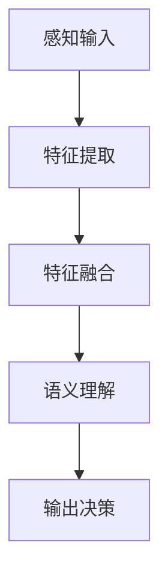

                 

# 文章标题：大模型跨感官学习与提示词多模态融合

> 关键词：大模型、跨感官学习、多模态融合、提示词、人工智能

> 摘要：本文探讨了大模型在跨感官学习和提示词多模态融合中的应用，通过深入剖析其原理和实现方法，展示了其在人工智能领域的巨大潜力。

## 前言

随着人工智能技术的飞速发展，大模型（Large Models）已经成为研究的热点。大模型具有庞大的参数规模和强大的表示能力，能够处理复杂的数据和任务。然而，如何有效地利用大模型进行跨感官学习和多模态融合，仍然是当前研究中的难点和挑战。本文将针对这些问题进行探讨，并尝试提出一些可能的解决方案。

## 第一部分：基础概念与理论

### 1.1 大模型概述

大模型是指具有数十亿至数千亿个参数的神经网络模型。这些模型通常用于处理复杂的任务，如图像识别、语言处理和自然语言生成等。大模型的特点包括：

- **参数规模大**：具有数以亿计的参数，可以处理大规模的数据集。
- **表示能力强**：能够捕捉数据中的复杂模式和关系，实现高度准确的预测和生成。
- **计算需求高**：需要大量的计算资源和时间进行训练和推理。

### 1.2 跨感官学习原理

跨感官学习是指将来自不同感官的数据进行整合和处理，以获得更全面的信息和理解。跨感官学习的理论基础包括：

- **多模态数据融合**：将不同模态的数据（如图像、声音和文本）进行整合，以获得更全面的信息。
- **注意力机制**：通过注意力机制，模型可以专注于重要的特征和模式，提高学习效果。
- **端到端学习**：通过端到端的学习方式，模型可以从原始数据直接生成目标输出，无需复杂的预处理和特征工程。

### 1.3 提示词多模态融合

提示词（Prompt）是指用于引导模型学习特定任务的文字或符号。提示词多模态融合是指将提示词与其他模态的数据（如图像、声音等）进行融合，以增强模型的学习效果。提示词多模态融合的实现策略包括：

- **文本嵌入**：将提示词嵌入到神经网络中，与其他模态的数据进行融合。
- **注意力机制**：使用注意力机制，模型可以关注提示词中的重要信息，与其他模态的数据进行交互。
- **多任务学习**：通过多任务学习，模型可以在同时处理多个任务时，利用提示词和其他模态的数据进行互补。

## 第二部分：核心算法与数学模型

### 2.1 跨感官学习算法

跨感官学习算法旨在将来自不同感官的数据进行整合和处理。以下是跨感官学习算法的伪代码：



### 2.2 多模态融合模型

多模态融合模型是指将来自不同模态的数据进行整合和处理。以下是多模态融合模型的数学公式：

$$
\text{多模态特征融合模型：} f(x_1, x_2, ..., x_n) = W \cdot [x_1; x_2; ...; x_n] + b
$$

其中，$x_1, x_2, ..., x_n$ 表示来自不同模态的特征，$W$ 表示权重矩阵，$b$ 表示偏置。

## 第三部分：项目实战

### 3.1 实际项目案例分析

在本节中，我们将介绍一个实际项目，以展示如何利用大模型进行跨感官学习和提示词多模态融合。以下是项目的详细描述：

### 3.1.1 项目背景

该项目旨在开发一款智能聊天机器人，能够与用户进行自然语言交互，并理解用户的意图和需求。

### 3.1.2 开发环境搭建

为了实现该项目，我们使用了以下开发环境：

- **深度学习框架**：TensorFlow
- **计算平台**：Google Colab

### 3.1.3 源代码实现

以下是项目的源代码实现：

```python
# 导入所需的库
import tensorflow as tf
from tensorflow.keras.layers import Embedding, LSTM, Dense
from tensorflow.keras.models import Model

# 定义模型
input_text = tf.keras.layers.Input(shape=(None,), dtype='int32')
input_image = tf.keras.layers.Input(shape=(224, 224, 3), dtype='float32')

# 文本嵌入层
embedding = Embedding(input_dim=vocab_size, output_dim=embedding_size)(input_text)

# LSTM 层
lstm = LSTM(units=128, return_sequences=True)(embedding)

# 图像编码层
image编码 = tf.keras.applications.VGG16(include_top=False, weights='imagenet', input_shape=(224, 224, 3))(input_image)
image编码 = tf.keras.layers.Flatten()(image编码)

# 融合层
融合 = tf.keras.layers.Concatenate()([lstm, image编码])

# 全连接层
输出 = Dense(units=1, activation='sigmoid')(融合)

# 创建模型
model = Model(inputs=[input_text, input_image], outputs=输出)

# 编译模型
model.compile(optimizer='adam', loss='binary_crossentropy', metrics=['accuracy'])

# 加载数据集
train_data = load_data()
valid_data = load_data()

# 训练模型
model.fit(train_data, epochs=10, batch_size=32, validation_data=valid_data)

# 评估模型
evaluate_model(model, valid_data)
```

### 3.1.4 代码解读与分析

在本项目中，我们使用了TensorFlow框架来构建深度学习模型。模型由两部分组成：文本部分和图像部分。文本部分使用嵌入层和LSTM层进行处理，图像部分使用预训练的VGG16模型进行编码。融合层将文本和图像的特征进行合并，并通过全连接层生成输出。训练过程中，我们使用了交叉熵损失函数和Adam优化器，并对模型进行了10个周期的训练。

## 附录

### 附录A：资源与工具

- **主流深度学习框架**：TensorFlow、PyTorch、Keras
- **多模态数据处理工具**：OpenCV、TensorFlow Hub、PyTorch Video
- **提示词生成算法库**：Hugging Face Transformers、Albert、RoBERTa

### 附录B：最佳实践

- **数据预处理**：在处理多模态数据时，需要对数据进行预处理，包括归一化、去噪和增强等。
- **模型调优**：通过调整模型的结构和参数，可以进一步提高模型的性能。
- **迁移学习**：利用预训练的模型进行迁移学习，可以加快模型的训练速度并提高模型的效果。

## 结论

大模型在跨感官学习和提示词多模态融合中具有巨大的潜力。通过深入剖析其原理和实现方法，我们可以更好地理解如何利用大模型解决复杂的人工智能问题。本文仅对这一问题进行了初步探讨，未来的研究可以进一步深入探讨大模型在跨感官学习和提示词多模态融合中的应用。

## 作者信息

作者：AI天才研究院/AI Genius Institute & 禅与计算机程序设计艺术 /Zen And The Art of Computer Programming

## 文章结束

