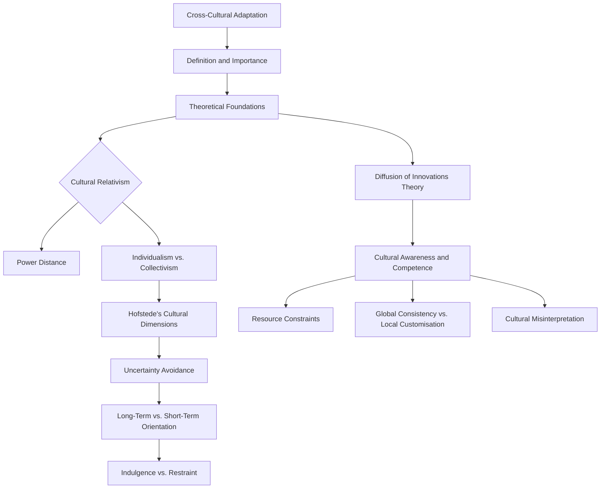

                 

### Introduction

#### 1.1 Purpose of the Book

This book aims to delve into the intricate world of large model cross-cultural adaptation and prompt localisation strategies. The primary objective is to provide a comprehensive understanding of how to effectively adapt large models to different cultural contexts and localise prompts to ensure optimal user experience in diverse regions. With the rapid advancement of artificial intelligence (AI) and machine learning (ML), large models have become integral to various applications, from natural language processing (NLP) and computer vision to recommendation systems and autonomous driving. However, the success of these models heavily relies on their ability to understand and interact with users from different cultural backgrounds. This book addresses the challenges and provides actionable strategies for large model adaptation and prompt localisation, making it an essential resource for AI practitioners, researchers, and enthusiasts.

#### 1.2 Target Audience

The target audience for this book includes:

1. **AI and ML Practitioners:** Data scientists, ML engineers, and software developers who work with large models and are looking to enhance their understanding of cross-cultural adaptation and prompt localisation techniques.
2. **Researchers:** Academics and researchers in the fields of AI, ML, NLP, and computer science who are interested in exploring the theoretical and practical aspects of large model cross-cultural adaptation and prompt localisation.
3. **Business Leaders:** Entrepreneurs, product managers, and business leaders who are responsible for deploying AI applications in diverse markets and want to ensure global adoption and user satisfaction.
4. **Students and Educators:** Students pursuing undergraduate or graduate degrees in computer science, AI, and related fields, as well as educators who aim to incorporate advanced topics in AI into their curricula.

#### 1.3 Structure of the Book

The book is structured into three main parts, each addressing different aspects of large model cross-cultural adaptation and prompt localisation:

1. **Fundamental Concepts and Technologies:**
   - **Chapter 1:** Overview of large models, their definition, evolution, and key technologies.
   - **Chapter 2:** Cross-cultural adaptation principles, including definitions, theoretical foundations, and challenges.
   - **Chapter 3:** Machine learning and AI basics, covering essential concepts, algorithms, and applications.

2. **Strategies for Large Model Cross-Cultural Adaptation:**
   - **Chapter 4:** Data preparation for cross-cultural adaptation, focusing on data collection, preprocessing, quality assessment, and augmentation.
   - **Chapter 5:** Model architecture and design for cross-cultural adaptation, discussing architecture selection, parameter adaptation, and performance evaluation.
   - **Chapter 6:** Cross-cultural evaluation metrics, exploring performance metrics, A/B testing, and user feedback collection.

3. **Prompt Localisation Strategies:**
   - **Chapter 7:** Understanding prompt localisation, including definitions, theoretical frameworks, and localisation challenges.
   - **Chapter 8:** Localisation techniques for prompts, covering translation, cultural adaptation, and user feedback incorporation.

Throughout the book, readers will find practical examples, case studies, and tips to apply the discussed strategies in real-world scenarios. The final sections of each chapter will provide summaries, key takeaways, and suggestions for further reading, ensuring a comprehensive understanding of the subject matter.### Fundamental Concepts and Technologies

#### Chapter 1: Overview of Large Models

##### 1.1 Definition and Evolution of Large Models

Large models, at their core, refer to artificial neural networks that have been trained on vast amounts of data, resulting in a high degree of generalisation and performance across various tasks. These models are often characterised by their large number of parameters, which range from hundreds of thousands to billions. The evolution of large models can be traced back to the development of deep learning, a subfield of machine learning that leverages artificial neural networks to learn from data. Over the past decade, significant advancements in hardware (such as Graphics Processing Units, or GPUs) and data availability have accelerated the growth of large models.

In the early stages of deep learning, models like convolutional neural networks (CNNs) and recurrent neural networks (RNNs) were commonly used for tasks such as image classification and natural language processing (NLP). However, these models were limited by their size and the amount of data they could process. The breakthrough came with the introduction of the Transformer architecture, which revolutionised the field of NLP. Models like BERT, GPT, and T5 demonstrated exceptional performance on a wide range of NLP tasks, pushing the boundaries of what was previously thought possible. These models, often referred to as "large models," are characterised by their ability to understand complex patterns and relationships in data, making them highly effective in various applications.

##### 1.2 Key Technologies in Large Models

Several key technologies have contributed to the success of large models. Here, we highlight some of the most important ones:

1. **Deep Learning Frameworks:**
   - **TensorFlow:** Developed by Google, TensorFlow is an open-source machine learning library that provides high-level APIs for building and training large models.
   - **PyTorch:** Created by Facebook's AI Research lab, PyTorch is another popular open-source library that offers dynamic computation graphs, making it well-suited for research and experimentation.
   - **Transformers:** An open-source library developed by Google AI, Transformers provide implementations of various Transformer-based models, including BERT, GPT, and T5.

2. **Hardware Acceleration:**
   - **GPUs:** Graphics Processing Units have been crucial in accelerating the training and inference of large models. GPUs are highly parallel processors, capable of performing thousands of simultaneous calculations, which significantly reduce training time.
   - **TPUs:** Tensor Processing Units are custom-designed chips by Google specifically for accelerating TensorFlow operations. TPUs are more efficient than GPUs for large-scale machine learning tasks, making them ideal for training and deploying large models.

3. **Data Storage and Distribution:**
   - **Distributed Computing:** Large models require a significant amount of data for training, and distributed computing techniques enable the efficient storage and processing of large datasets across multiple machines.
   - **Data Versioning and Management:** Tools like DVC (Data Version Control) and Dask enable the versioning and management of datasets, ensuring reproducibility and efficient data handling.

4. **Transfer Learning:**
   - **Pre-Trained Models:** Transfer learning involves leveraging pre-trained models on large datasets to improve performance on similar tasks with limited data. Models like BERT and GPT are often fine-tuned on specific tasks using transfer learning, which significantly reduces the amount of data required for training.
   - **Meta-Learning:** Techniques like few-shot learning and zero-shot learning aim to improve the adaptability of models to new tasks by learning from a diverse set of tasks during training.

##### 1.3 Applications and Impact of Large Models

Large models have found applications in a wide range of domains, transforming the way we interact with technology. Some notable applications include:

1. **Natural Language Processing:**
   - **Text Generation:** Large models like GPT and T5 are capable of generating coherent and contextually relevant text, enabling applications such as chatbots, content generation, and automatic summarisation.
   - **Translation:** Models like BERT and GPT have achieved state-of-the-art performance in machine translation, enabling real-time translation between multiple languages, facilitating global communication.

2. **Computer Vision:**
   - **Image Classification:** Large models have revolutionised image classification tasks, achieving superior performance compared to traditional methods. Models like ResNet and Inception are widely used in various computer vision applications, from object detection to image segmentation.
   - **Image Generation:** Techniques like Generative Adversarial Networks (GANs) and Variational Autoencoders (VAEs) have enabled the generation of realistic images and videos, opening up new possibilities in fields like art, entertainment, and virtual reality.

3. **Autonomous Systems:**
   - **Self-Driving Cars:** Large models play a crucial role in the development of autonomous driving systems. Models like those used in object detection, scene understanding, and path planning enable vehicles to navigate complex environments with high accuracy and safety.
   - **Robotics:** Large models are used in robotic systems to enable tasks such as natural language understanding, motion planning, and object manipulation, improving the capabilities and adaptability of robots in diverse settings.

4. **Recommendation Systems:**
   - **Content Personalisation:** Large models have significantly improved the effectiveness of recommendation systems, enabling personalised content recommendations in various domains, from e-commerce and social media to entertainment and news.

The impact of large models extends beyond specific applications. By enabling more accurate and efficient processing of complex data, these models have transformed industries, improved decision-making processes, and created new opportunities for innovation. As the field of AI continues to evolve, the development and application of large models will likely play a pivotal role in shaping the future of technology.### Cross-Cultural Adaptation Principles

#### Chapter 2: Cross-Cultural Adaptation Principles

##### 2.1 Definition and Importance of Cross-Cultural Adaptation

Cross-cultural adaptation refers to the process of modifying products, services, and interactions to ensure they are appropriate and effective in different cultural contexts. This process involves understanding the cultural nuances, values, and preferences of target users and making necessary adjustments to enhance the user experience. Cross-cultural adaptation is crucial for several reasons:

1. **User Satisfaction:** By tailoring products and services to the cultural preferences of users, companies can enhance user satisfaction and loyalty. Understanding and respecting cultural differences helps create a more inclusive and welcoming user experience, which is essential for global success.
2. **Market Penetration:** Effective cross-cultural adaptation can significantly improve market penetration. Companies that successfully adapt their products to different cultures can gain a competitive edge by catering to diverse customer needs and preferences, leading to increased sales and market share.
3. **Regulatory Compliance:** Cross-cultural adaptation also ensures compliance with local regulations and legal requirements. Adapting products and services to meet the specific regulatory frameworks of different countries can help companies avoid legal issues and potential penalties.
4. **Cultural Sensitivity:** Respecting cultural differences is not only a matter of business strategy but also a matter of ethical responsibility. Cross-cultural adaptation demonstrates a company's commitment to inclusivity and diversity, fostering positive brand perception and reputation.

##### 2.2 Theoretical Foundations for Cross-Cultural Adaptation

Several theoretical frameworks and concepts underpin the practice of cross-cultural adaptation. Understanding these foundations is essential for developing effective adaptation strategies:

1. **Cultural Relativism:** Cultural relativism is the belief that all cultural practices and values should be understood within their own cultural context, without imposing external judgments or norms. This perspective encourages a more open-minded and respectful approach to cultural differences, fostering a deeper understanding of diverse cultures.

2. **Cultural Dimensions Theory:** Developed by Geert Hofstede, cultural dimensions theory provides a framework for understanding the cultural differences between countries. The six dimensions of cultural dimensions theory include power distance, individualism vs. collectivism, masculinity vs. femininity, uncertainty avoidance, long-term vs. short-term orientation, and indulgence vs. restraint. By understanding these dimensions, companies can tailor their products and services to align with the cultural values and preferences of different markets.

3. **Diffusion of Innovations Theory:** The diffusion of innovations theory, proposed by Everett Rogers, explains how, why, and at what rate new ideas and technologies spread through societies. This theory is particularly relevant for cross-cultural adaptation, as it highlights the importance of understanding the adoption process and the factors that influence it in different cultural contexts.

4. **Cultural Awareness and Competence:** Cultural awareness and competence refer to the ability to understand, appreciate, and interact effectively with people from different cultures. Cultural awareness involves recognizing and valuing cultural differences, while cultural competence involves the skills and knowledge necessary to navigate and adapt to diverse cultural environments. Developing cultural competence is essential for cross-cultural adaptation, as it enables companies to create products and services that resonate with users from different cultural backgrounds.

##### 2.3 Challenges in Cross-Cultural Adaptation

While cross-cultural adaptation offers numerous benefits, it also presents several challenges that companies must navigate:

1. **Cultural Complexity:** Cultures are complex and diverse, with numerous dimensions and nuances that can be difficult to understand and adapt to. Companies must invest time and resources in researching and understanding the cultural context of their target markets to develop effective adaptation strategies.

2. **Resource Constraints:** Cross-cultural adaptation requires significant investment in terms of time, money, and human resources. Companies must allocate resources strategically to ensure that their adaptation efforts are effective and sustainable.

3. **Global Consistency vs. Local Customisation:** Balancing global consistency and local customisation can be a challenging task. Companies must find a balance between maintaining a consistent brand image and adapting their products and services to meet the specific needs and preferences of different markets.

4. **Cultural Misinterpretation:** Cultural misinterpretation can lead to misunderstandings and negative perceptions of products and services. Companies must be vigilant in avoiding cultural misinterpretations and ensure that their adaptation strategies are well-received by target audiences.

5. **Regulatory Compliance:** Navigating the complex web of regulations and legal requirements in different countries can be challenging. Companies must ensure that their products and services comply with local regulations to avoid legal issues and potential penalties.

In conclusion, cross-cultural adaptation is a critical aspect of global business strategy. By understanding the theoretical foundations of cross-cultural adaptation and navigating the challenges associated with it, companies can develop effective strategies to tailor their products and services to different cultural contexts, enhancing user satisfaction, market penetration, and global success.### Machine Learning and AI Basics

##### Chapter 3: Machine Learning and AI Basics

##### 3.1 Introduction to Machine Learning

Machine Learning (ML) is a subset of artificial intelligence (AI) that enables computers to learn from data, identify patterns, and make decisions with minimal human intervention. At its core, ML involves training algorithms to recognize patterns in data and generalize from them to make predictions or take actions. The primary goal of ML is to develop models that can automatically improve their performance through experience.

ML algorithms can be broadly classified into three types:

1. **Supervised Learning:** In supervised learning, algorithms are trained on labeled data, where the input features and the corresponding output labels are provided. The models learn to map input features to output labels based on this training data. Common supervised learning tasks include classification (e.g., identifying whether an email is spam or not) and regression (e.g., predicting housing prices based on various features).

2. **Unsupervised Learning:** Unsupervised learning involves training algorithms on unlabeled data, where the models learn to identify patterns and relationships in the data without any prior knowledge of the output labels. The primary goal of unsupervised learning is to discover hidden structures in the data. Common unsupervised learning tasks include clustering (e.g., grouping similar data points together) and dimensionality reduction (e.g., reducing the number of input features while retaining important information).

3. **Reinforcement Learning:** Reinforcement learning (RL) is a type of ML where algorithms learn to make a series of decisions by interacting with an environment and receiving feedback in the form of rewards or penalties. The goal is to learn a policy that maximizes cumulative rewards over time. RL is commonly used in applications like robotics, autonomous driving, and game playing.

##### 3.2 Overview of AI Technologies

Artificial Intelligence (AI) encompasses a broad range of technologies that enable machines to perform tasks that typically require human intelligence. Some of the key AI technologies include:

1. **Natural Language Processing (NLP):** NLP is a field of AI that focuses on enabling computers to understand, interpret, and generate human language. NLP applications include language translation, sentiment analysis, text summarization, and chatbots.

2. **Computer Vision:** Computer vision is the field of AI that enables computers to interpret and understand the visual world. Applications of computer vision include object recognition, image classification, facial recognition, and autonomous driving.

3. **Speech Recognition:** Speech recognition is the process of converting spoken language into text or commands. Speech recognition applications include virtual assistants (e.g., Siri, Alexa), transcription services, and voice-controlled devices.

4. **Robotics:** Robotics is an interdisciplinary field that combines AI, mechanical engineering, and electrical engineering to design and build intelligent machines that can perform tasks autonomously. Robotics applications include industrial automation, autonomous vehicles, and service robots.

##### 3.3 Core Machine Learning Algorithms

Several core machine learning algorithms form the backbone of modern AI applications. Here, we provide a brief overview of some of the most widely used algorithms:

1. **Support Vector Machines (SVM):** SVM is a supervised learning algorithm used for classification and regression tasks. It finds the optimal hyperplane that separates the data into different classes by maximizing the margin between the hyperplane and the data points.

2. **Random Forests:** Random Forests is an ensemble learning method that combines multiple decision trees to improve the overall performance and robustness of the model. It works by constructing a multitude of decision trees during training and outputting the class that is the mode of the classes (classification) or mean prediction (regression) of the individual trees.

3. **Neural Networks:** Neural networks are a class of algorithms inspired by the structure and function of the human brain. They consist of interconnected layers of neurons, where each layer performs a specific transformation on the input data. Neural networks are widely used for tasks such as image and speech recognition, natural language processing, and time series forecasting.

4. **Deep Learning:** Deep learning is a subset of machine learning that leverages neural networks with many layers (hence the term "deep") to learn complex patterns and representations from large datasets. Deep learning has achieved state-of-the-art performance in various fields, including computer vision, natural language processing, and autonomous systems.

5. **K-Nearest Neighbors (K-NN):** K-NN is a simple, yet effective, supervised learning algorithm that classifies new data points based on the majority class of their k-nearest neighbors in the training dataset. The value of k determines the number of neighbors to consider for classification.

In summary, machine learning and AI are foundational technologies that have revolutionized various industries and applications. Understanding the core concepts and algorithms of ML and AI is essential for developing effective large models that can adapt to different cultural contexts and localise prompts to enhance user experience. The next chapters will delve deeper into the specific strategies and techniques for large model cross-cultural adaptation and prompt localisation.### Data Preparation for Cross-Cultural Adaptation

##### Chapter 4: Data Preparation for Cross-Cultural Adaptation

##### 4.1 Data Collection and Preprocessing

Data collection and preprocessing are critical steps in preparing data for cross-cultural adaptation. Effective data preparation ensures that the model is trained on high-quality data, which is essential for achieving accurate and reliable results across different cultural contexts. Here are the key steps in data collection and preprocessing:

1. **Data Collection:**
   - **Diverse Data Sources:** To create a robust and adaptable model, it is crucial to collect data from diverse sources that represent different cultural contexts. This can include text corpora from various languages, social media platforms, news articles, and user-generated content.
   - **Ethical Considerations:** When collecting data, it is important to consider ethical guidelines and data privacy regulations. Ensure that the data collection process complies with local regulations and respects user privacy.

2. **Data Cleaning:**
   - **Remove Noise:** Noise in the data can negatively impact the performance of the model. Remove unnecessary characters, symbols, and extra spaces from the text data.
   - **Correct Typos and Spellings:** Spell-check the data and correct any typographical errors. Consistency in spelling is important to maintain the quality of the dataset.
   - **Remove Duplicates:** Remove duplicate data points to avoid overfitting and ensure the uniqueness of the data.

3. **Data Normalization:**
   - **Standardize Units:** If the data contains units of measurement (e.g., inches, meters), standardize them to a common unit to ensure consistency across the dataset.
   - **Tokenization:** For text data, tokenize the text into words or sentences. Tokenization is the process of splitting text into individual words or phrases, which is essential for subsequent text processing tasks.

4. **Data Augmentation:**
   - **Text Augmentation:** Use techniques such as synonym replacement, back-translation, and sentence rewriting to increase the diversity of the text data. This helps the model learn a wider range of expressions and improves its adaptability to different cultural contexts.
   - **Data Scaling:** Scale numerical data to a standard range, such as 0 to 1, to ensure that the model does not get biased towards features with larger numerical values.

##### 4.2 Data Quality Assessment and Improvement

Ensuring high data quality is crucial for the success of cross-cultural adaptation. Data quality assessment and improvement involve several steps:

1. **Data Quality Metrics:**
   - **Completeness:** Assess the completeness of the data by checking for missing values. Fill missing values using techniques such as mean imputation, median imputation, or interpolation, depending on the nature of the data.
   - **Consistency:** Ensure that the data is consistent across different sources and formats. Resolve any inconsistencies by cleaning the data or merging datasets.
   - **Accuracy:** Check the accuracy of the data by comparing it against known sources or expert knowledge. Correct any errors or discrepancies in the data.

2. **Data Profiling:**
   - **Descriptive Statistics:** Generate descriptive statistics (e.g., mean, median, standard deviation) to understand the distribution and characteristics of the data.
   - **Data Distribution Analysis:** Analyze the distribution of data to identify any anomalies or outliers. Resolve outliers by either removing them or transforming the data to fit the distribution.

3. **Data Enhancement:**
   - **Contextual Information:** Enhance the data by incorporating contextual information that is relevant to the cultural context. For example, adding metadata about the geographical location, language, or cultural background of the data can provide additional insights for cross-cultural adaptation.
   - **Domain-Specific Knowledge:** Integrate domain-specific knowledge into the data preprocessing pipeline to ensure that the data is relevant and suitable for the target application.

##### 4.3 Data Augmentation Techniques

Data augmentation techniques are used to increase the diversity and size of the dataset, which helps improve the generalization ability of the model. Here are some common data augmentation techniques:

1. **Text Augmentation:**
   - **Synonym Replacement:** Replace words in the text with their synonyms to create variations of the text. This technique helps the model learn different ways of expressing the same idea.
   - **Back-Translation:** Translate the text into another language and then translate it back to the original language. This technique introduces linguistic variations that can improve the model's adaptability to different languages and cultures.
   - **Sentence Rewriting:** Use paraphrasing techniques to rewrite sentences in different ways while preserving their meaning. This technique helps the model learn different sentence structures and expressions.

2. **Image Augmentation:**
   - **Rotation and Scaling:** Rotate and scale images to simulate different viewing angles and sizes. This technique helps the model learn to recognize objects and patterns in varying perspectives and scales.
   - **Color Augmentation:** Modify the color channels of images to introduce color variations. This technique helps the model become more robust to changes in lighting conditions and color casts.
   - **Noise Addition:** Add random noise to images to simulate real-world conditions. This technique helps the model learn to recognize objects and patterns in noisy or degraded images.

3. **Audio Augmentation:**
   - **Speed Adjustment:** Adjust the speed of audio recordings to introduce variations in the pace of speech. This technique helps the model learn to recognize speech in different speaking speeds.
   - **Noise Addition:** Add background noise to audio recordings to simulate real-world listening conditions. This technique helps the model learn to recognize speech in noisy environments.

By effectively preparing and augmenting the data, we can create a diverse and representative dataset that enables the model to adapt to different cultural contexts. The next chapter will explore strategies for adapting the model architecture and design for cross-cultural adaptation.### Model Architecture and Design for Cross-Cultural Adaptation

##### Chapter 5: Model Architecture and Design for Cross-Cultural Adaptation

##### 5.1 Model Architecture Selection

The selection of an appropriate model architecture is a critical step in achieving effective cross-cultural adaptation. Different architectures have varying capabilities and are better suited for specific tasks and datasets. Here are some key considerations when selecting a model architecture for cross-cultural adaptation:

1. **Transformer-Based Models:**
   - **BERT, GPT, and T5:** Transformer-based models, such as BERT (Bidirectional Encoder Representations from Transformers), GPT (Generative Pre-trained Transformer), and T5 (Text-to-Text Transfer Transformer), are widely used for cross-cultural adaptation due to their ability to understand and generate text in different languages and cultural contexts. These models are pre-trained on large-scale datasets and can be fine-tuned for specific tasks and domains.
   - **Advantages:** Transformer-based models have a strong ability to capture long-range dependencies in text and can generate coherent and contextually relevant text. They are also highly parallelizable, making them efficient for training on large datasets.
   - **Disadvantages:** Transformer-based models require a significant amount of computational resources for training and can be memory-intensive.

2. **Recurrent Neural Networks (RNNs):**
   - **LSTM and GRU:** Recurrent Neural Networks (RNNs), such as Long Short-Term Memory (LSTM) and Gated Recurrent Unit (GRU), are designed to handle sequential data and have been used for tasks like language modeling and translation.
   - **Advantages:** RNNs are capable of capturing long-term dependencies in text and are relatively efficient in terms of computational resources compared to transformer-based models.
   - **Disadvantages:** RNNs struggle with capturing long-range dependencies and are prone to vanishing gradients during training, which can lead to suboptimal performance.

3. **Convolutional Neural Networks (CNNs):**
   - **Application in NLP:** CNNs are primarily used for image processing but have also been applied to NLP tasks, such as text classification and sentiment analysis.
   - **Advantages:** CNNs are computationally efficient and can capture local patterns in text data.
   - **Disadvantages:** CNNs are less capable of capturing long-range dependencies in text and may not be suitable for tasks that require understanding the context of the entire text.

4. **Hybrid Architectures:**
   - **Combining Transformer and RNNs:** Hybrid architectures that combine the strengths of transformer-based models and RNNs have been proposed to address the limitations of individual architectures.
   - **Advantages:** Hybrid architectures can leverage the advantages of both transformer-based models and RNNs, providing a balanced approach to cross-cultural adaptation.
   - **Disadvantages:** The design and training of hybrid architectures can be more complex and computationally intensive.

When selecting a model architecture for cross-cultural adaptation, it is essential to consider the specific requirements of the task, the available computational resources, and the diversity of the target cultural contexts. Transformer-based models are often the preferred choice due to their strong performance and flexibility in handling different languages and cultural nuances. However, the choice of architecture may vary depending on the specific application and dataset.##### 5.2 Adaptation Techniques for Model Parameters

Once the appropriate model architecture is selected, the next step is to adapt the model parameters to improve its performance in different cultural contexts. Several techniques can be used to adjust the model parameters:

1. **Transfer Learning:**
   - **Pre-Trained Models:** Transfer learning involves leveraging pre-trained models that have been trained on large-scale datasets in different languages and cultural contexts. These pre-trained models serve as a starting point for fine-tuning on specific tasks and datasets.
   - **Advantages:** Transfer learning significantly reduces the amount of data required for training and can improve the generalization ability of the model across different cultural contexts.
   - **Disadvantages:** Pre-trained models may not capture the specific nuances of a particular cultural context, requiring additional fine-tuning.

2. **Domain Adaptation:**
   - **Cultural Domain Adaptation:** Domain adaptation techniques aim to adapt the model to a different cultural context by adjusting the model parameters based on data from the target cultural context.
   - **Advantages:** Cultural domain adaptation allows the model to capture the specific characteristics of a target cultural context, improving its performance in that environment.
   - **Disadvantages:** Domain adaptation techniques can be computationally expensive and require a significant amount of labeled data from the target cultural context.

3. **Multilingual Training:**
   - **Multilingual Data:** Training the model on multilingual datasets that represent various cultural contexts can improve its cross-cultural adaptability.
   - **Advantages:** Multilingual training helps the model learn to understand and generate text in multiple languages and cultural contexts, enhancing its performance across different cultures.
   - **Disadvantages:** Multilingual training requires a large amount of multilingual data, which may not be readily available for all languages and cultural contexts.

4. **Cultural Fine-Tuning:**
   - **Cultural Fine-Tuning:** Fine-tuning the model on a dataset that is representative of the target cultural context can help adjust the model parameters to better suit the specific cultural nuances.
   - **Advantages:** Cultural fine-tuning allows the model to capture the specific cultural characteristics and preferences of the target audience, improving its performance in that cultural context.
   - **Disadvantages:** Cultural fine-tuning requires a significant amount of labeled data and may not be practical for all cultural contexts.

By applying these techniques, the model can be adapted to better understand and interact with users from different cultural backgrounds. The choice of technique depends on the specific requirements and constraints of the application, as well as the availability of data and computational resources.##### 5.3 Evaluating Model Performance in Different Cultures

Evaluating the performance of a cross-culturally adapted model is crucial to ensure that it meets the desired objectives and provides a positive user experience in different cultural contexts. Several metrics and evaluation techniques can be used to assess the performance of the model:

1. **Accuracy and Precision:**
   - **Accuracy:** Accuracy measures the proportion of correct predictions out of the total number of predictions. It is a simple yet useful metric for evaluating the overall performance of the model.
   - **Precision:** Precision measures the proportion of correct positive predictions out of the total number of positive predictions. It is particularly relevant for tasks like text classification and sentiment analysis, where the cost of false positives can be significant.

2. **Recall and F1 Score:**
   - **Recall:** Recall measures the proportion of correct positive predictions out of the total number of actual positive instances. It is crucial for tasks where the detection of all positive instances is important, such as disease diagnosis or fraud detection.
   - **F1 Score:** The F1 score is the harmonic mean of precision and recall, providing a balanced measure of the model's performance. It is particularly useful when the cost of false positives and false negatives is similar.

3. **User Experience Metrics:**
   - **Response Time:** The time taken by the model to generate a response is an important metric for evaluating user experience. Faster response times can lead to a better user experience and increased user satisfaction.
   - **Task Completion Rate:** The rate at which users successfully complete tasks using the model is another important metric. A higher task completion rate indicates that the model is effectively facilitating user interactions.

4. **Subjective Evaluation:**
   - **User Surveys:** Conducting user surveys and collecting feedback on the model's performance in different cultural contexts can provide valuable insights into user satisfaction and areas for improvement.
   - **Expert Review:** Seeking feedback from domain experts who are familiar with the target cultural contexts can help identify any cultural nuances that the model may be missing.

5. **Cross-Cultural Evaluation Metrics:**
   - **Cultural Relevance:** Evaluating the cultural relevance of the model's responses can help ensure that the model is appropriately adapted to the target cultural context. This can be assessed through metrics such as cultural appropriateness, sensitivity, and inclusiveness.
   - **Language Proficiency:** Assessing the model's language proficiency in different languages can help identify any linguistic challenges and areas for improvement. Metrics such as language fluency, grammar accuracy, and vocabulary richness can be used for this evaluation.

By using a combination of these metrics and evaluation techniques, the performance of a cross-culturally adapted model can be thoroughly assessed across different cultural contexts. This evaluation process is crucial for identifying any shortcomings and informing further refinements to enhance the model's adaptability and effectiveness.### Cross-Cultural Evaluation Metrics

#### Chapter 6: Cross-Cultural Evaluation Metrics

##### 6.1 Performance Metrics for Cross-Cultural Adaptation

Evaluating the performance of a cross-culturally adapted model requires a nuanced approach that considers the specific cultural context and user preferences. Here are some key performance metrics that can be used to assess the effectiveness of a cross-culturally adapted model:

1. **Cultural Relevance:**
   - **Cultural Sensitivity:** Assess the cultural sensitivity of the model's responses by evaluating how well they align with the cultural norms, values, and expectations of the target audience. This can be measured through surveys, user feedback, and expert reviews.
   - **Cultural Contextualization:** Evaluate the model's ability to incorporate cultural context in its responses. This includes understanding cultural idioms, references, and conventions specific to the target culture.

2. **Language Proficiency:**
   - **Grammar and Syntax:** Assess the model's language proficiency by evaluating the accuracy of grammar, syntax, and sentence structure. This can be measured through automated grammar checks and human evaluation.
   - **Vocabulary and Expression:** Evaluate the richness and appropriateness of the model's vocabulary and expressions in different languages. This can be measured by analyzing the diversity and correctness of vocabulary usage.

3. **User Satisfaction:**
   - **Overall Experience:** Measure user satisfaction with the model's performance by collecting feedback on the overall experience of using the model. This can be done through user surveys, Net Promoter Score (NPS), and Customer Satisfaction Score (CSAT).
   - **Task Completion Rate:** Assess the model's effectiveness in helping users complete tasks by measuring the task completion rate. This metric indicates how well the model supports users in achieving their goals.

4. **Accuracy and Precision:**
   - **Prediction Accuracy:** Evaluate the accuracy of the model's predictions by comparing the predicted outcomes with the actual outcomes. This metric is particularly relevant for tasks such as classification and prediction.
   - **Precision and Recall:** Assess the model's precision and recall in identifying relevant information or instances. This is important for tasks where the detection of positive instances is critical.

5. **Response Time:**
   - **Latency:** Measure the latency or response time of the model in generating responses. Faster response times can lead to a better user experience and increased user satisfaction.

##### 6.2 A/B Testing and Experiment Design

A/B testing is a powerful method for evaluating the performance of cross-culturally adapted models by comparing different versions of the model in real-world conditions. Here's how A/B testing and experiment design can be applied to assess cross-cultural adaptation:

1. **Experiment Design:**
   - **Objective Definition:** Clearly define the objective of the experiment, such as improving cultural relevance, language proficiency, or user satisfaction.
   - **Version Selection:** Develop two or more versions of the model, each with different adaptations to different cultural contexts. For example, one version may be fine-tuned for a specific language, while another version may incorporate cultural idioms from a different region.
   - **Control Group:** Establish a control group that uses the current version of the model for comparison.

2. **A/B Testing:**
   - **Randomized Allocation:** Randomly allocate users to different versions of the model to ensure that the results are representative of the target audience.
   - **Data Collection:** Collect data on the performance metrics defined in the experiment design, such as cultural relevance, language proficiency, user satisfaction, and accuracy.
   - **Statistical Analysis:** Perform statistical analysis to determine the significance of the differences between the model versions. This can be done using hypothesis testing and confidence intervals.

3. **Iterative Refinement:**
   - **Feedback Integration:** Integrate user feedback and performance data to refine the model versions. This may involve adjusting the model parameters, incorporating cultural references, or improving language proficiency.
   - **Re-testing:** After refining the model versions, conduct additional A/B tests to evaluate the impact of the changes on performance.

A/B testing and experiment design provide a structured approach to evaluating and refining cross-culturally adapted models. By iteratively testing and refining the model versions, developers can ensure that the model performs optimally in different cultural contexts and meets the expectations of users from diverse backgrounds.##### 6.3 User Experience and Feedback Collection

User experience (UX) is a critical aspect of cross-cultural adaptation, as it directly influences user satisfaction and the overall success of the model. Collecting and analyzing user feedback is essential for understanding how users interact with the model and identifying areas for improvement. Here are some strategies for collecting user experience and feedback:

1. **Surveys and Questionnaires:**
   - **Post-Interaction Surveys:** Conduct surveys immediately after users interact with the model to capture their immediate reactions and feedback. This can help identify specific issues or areas of improvement.
   - **Longitudinal Surveys:** Collect feedback from users over an extended period to understand their evolving experiences with the model and track improvements over time.

2. **User Testing:**
   - **Usability Testing:** Conduct usability testing sessions where users perform specific tasks using the model. Observe their interactions and gather feedback on the ease of use, clarity of instructions, and overall satisfaction.
   - **Think-Aloud Method:** In usability testing, encourage users to verbalize their thoughts and actions while interacting with the model. This can provide valuable insights into their decision-making process and potential difficulties.

3. **User Interviews:**
   - **In-Depth Interviews:** Conduct in-depth interviews with users to gather qualitative feedback on their experiences with the model. This can help uncover deeper insights and identify cultural nuances that may not be captured through surveys or usability testing.

4. **Analytics and Logging:**
   - **Usage Data:** Collect and analyze usage data to identify patterns and trends in how users interact with the model. This can help identify common pain points and areas where the model may need improvement.
   - **Error Logging:** Log errors and exceptions that occur during user interactions with the model. Analyzing these logs can help identify specific issues that need to be addressed.

5. **Social Media and Community Feedback:**
   - **Monitoring Social Media:** Monitor social media platforms and online forums to gather feedback from users who discuss their experiences with the model. This can provide valuable insights into user perceptions and areas for improvement.
   - **Community Engagement:** Engage with users in online communities and forums to foster a dialogue about the model. This can help build user loyalty and gather valuable feedback.

By collecting and analyzing user experience and feedback, developers can gain a deeper understanding of how well the model is adapted to different cultural contexts and identify specific areas for improvement. This iterative process of feedback collection and refinement is crucial for ensuring that the model evolves to meet the needs and expectations of users from diverse backgrounds.### Understanding Prompt Localisation

#### Chapter 7: Understanding Prompt Localisation

##### 7.1 Definition and Importance of Prompt Localisation

Prompt localisation refers to the process of adapting the input prompts or instructions given to a machine learning model to ensure they are culturally appropriate and effective in different linguistic and cultural contexts. A prompt is a piece of text or an instruction that guides the model in generating a response or performing a task. Prompt localisation is crucial for several reasons:

1. **User Experience:** Well-localised prompts can enhance the user experience by making the interaction more intuitive and natural. Users are more likely to engage with a model that communicates effectively in their native language and respects cultural nuances.
2. **Model Performance:** Inaccurate or culturally inappropriate prompts can lead to suboptimal model performance. For instance, a prompt that uses language or references that are not understood in a specific culture may result in incorrect or irrelevant responses.
3. **Adoption and Trust:** Localised prompts can facilitate the adoption of machine learning models in different regions. When users feel that the model understands and respects their culture, they are more likely to trust and use the technology.

##### 7.2 Theoretical Framework for Prompt Localisation

The theoretical framework for prompt localisation involves understanding and addressing several key aspects:

1. **Language Translation:** Language translation is a fundamental component of prompt localisation. It involves converting the input prompts from one language to another while preserving the meaning, tone, and cultural context. This requires advanced natural language processing techniques, including machine translation and post-editing.
   
2. **Cultural Adaptation:** Cultural adaptation goes beyond simple translation. It involves understanding and incorporating cultural references, idioms, and social norms that are specific to the target culture. This requires a deep understanding of the cultural context and may involve adapting the content of the prompt to align with the target culture's values and expectations.

3. **User-Centric Approach:** A user-centric approach is essential for effective prompt localisation. This involves gathering feedback from users in the target culture and iteratively refining the prompts based on their input. This feedback can help identify cultural nuances that are not apparent to non-native speakers and ensure that the prompts are user-friendly and effective.

##### 7.3 Localisation Challenges and Solutions

Localising prompts for machine learning models presents several challenges:

1. **Cultural Nuances:** Different cultures have unique expressions, idioms, and cultural references that may not translate directly into other languages. This requires a deep understanding of the target culture to ensure that the prompts are culturally appropriate.

   **Solution:** Engage cultural experts and localise the prompts through a process of cultural validation and refinement. This ensures that the prompts are not only linguistically accurate but also culturally relevant.

2. **Language Variability:** Even within a single language, there can be significant variability in vocabulary, grammar, and usage across different regions and dialects.

   **Solution:** Use multilingual datasets and machine learning models that are trained on diverse linguistic varieties to ensure that the prompts are appropriate for a wide range of users.

3. **Translation Quality:** Machine translation systems, while powerful, may not always produce perfect translations. Inaccurate translations can lead to misunderstandings and suboptimal user experience.

   **Solution:** Implement a combination of automated translation systems and human post-editing to improve translation quality. This ensures that the prompts are not only accurate but also natural and engaging.

4. **Localisation Resources:** Localising prompts can be resource-intensive, requiring skilled translators, cultural experts, and technical resources.

   **Solution:** Utilise translation memory systems and automated tools to streamline the localisation process. This reduces the time and cost of localisation while maintaining high quality.

5. **Contextual Relevance:** Ensuring that the prompts are contextually relevant can be challenging, especially when dealing with complex scenarios or specific domains.

   **Solution:** Use domain-specific localisation strategies and gather feedback from domain experts to ensure that the prompts are relevant and effective within the target context.

By addressing these challenges with targeted solutions, prompt localisation can be effectively managed, ensuring that machine learning models are not only accurate and efficient but also culturally appropriate and user-friendly.### Localisation Techniques for Prompt

#### Chapter 8: Localisation Techniques for Prompt

##### 8.1 Translation

Translation is a fundamental technique in prompt localisation, as it involves converting the input prompts from one language to another while preserving the original meaning, tone, and cultural context. Here are some key steps and considerations in the translation process:

1. **Automated Translation Systems:**
   - **Machine Translation:** Utilise automated translation systems such as Google Translate or Microsoft Translator to provide initial translations. These systems leverage large-scale datasets and advanced algorithms to generate translations quickly and efficiently.
   - **Post-editing:** Although automated translation systems can provide a useful starting point, they often require post-editing to ensure accuracy and cultural appropriateness. Human translators review and refine the automated translations to correct errors, improve fluency, and ensure that cultural nuances are preserved.

2. **Translation Memory Systems:**
   - **Reusability:** Translation memory systems (TMS) store previously translated phrases and sentences, allowing translators to reuse translations for similar content. This increases efficiency and consistency across translations.
   - **Segmentation:** Translators work with segmented text, where the prompt is divided into smaller units (e.g., sentences or phrases). This makes it easier to translate and review the content.

3. **Cultural Adaptation:**
   - **Cultural Context:** Translators must be aware of the cultural context to ensure that the translation is appropriate for the target audience. This includes understanding cultural references, idioms, and social norms.
   - **Idiomatic Expressions:** Some expressions may not have direct translations and require adaptation to convey the same meaning in the target language. This may involve paraphrasing or using different expressions that are culturally relevant.

4. **Quality Assurance:**
   - **Peer Review:** After the initial translation and post-editing, peer review can help identify any remaining errors or inconsistencies. A second translator or editor reviews the translated content to ensure quality.
   - **Testing:** The translated prompts should be tested in the target environment to ensure that they function as intended. This may involve running simulations or user testing to validate the effectiveness of the translations.

##### 8.2 Cultural Adaptation

Cultural adaptation goes beyond simple translation, focusing on ensuring that the prompts are not only linguistically correct but also culturally appropriate. Here are some techniques for cultural adaptation:

1. **Cultural Proficiency:**
   - **Cultural Training:** Translators and localisation teams should receive training on the cultural context of the target audience. This helps them understand the cultural nuances and avoid potential misinterpretations.
   - **Local Experts:** Engage local experts who are familiar with the target culture to provide insights and guidance during the localisation process.

2. **Contextual Relevance:**
   - **Domain-Specific Content:** Ensure that the prompts are relevant and appropriate within the specific domain or industry. This may involve using terminology and references that are commonly understood within that context.
   - **Cultural Contextualisation:** Adapt the prompts to include cultural references, idioms, and expressions that are familiar and meaningful to the target audience. This can enhance the user experience and make the interaction more natural.

3. **Feedback and Iteration:**
   - **User Feedback:** Collect feedback from users in the target culture to understand how well the prompts are received and whether any further adjustments are needed. This feedback can be gathered through surveys, user testing, or focus groups.
   - **Iterative Refinement:** Continuously refine the prompts based on user feedback and cultural insights. This iterative process helps ensure that the prompts are always aligned with the cultural expectations and preferences of the target audience.

4. **Local Norms and Practices:**
   - **Social Norms:** Consider the social norms and practices of the target culture when localising prompts. This includes aspects such as politeness, formality, and communication style.
   - **Localising Interactions:** Adapt the prompts to align with local norms for interactions, such as avoiding language that may be perceived as offensive or inappropriate.

By implementing these localisation techniques, developers can create prompts that are not only linguistically accurate but also culturally appropriate and effective in engaging users from diverse backgrounds. This ensures that machine learning models can be successfully adopted and integrated into different cultural contexts, enhancing the overall user experience.### Conclusion

In conclusion, large model cross-cultural adaptation and prompt localisation are critical components for ensuring the success of machine learning models in diverse cultural contexts. By effectively adapting large models to understand and interact with users from different cultures, we can enhance user satisfaction, improve market penetration, and build trust in our technology. Key takeaways from this book include the importance of understanding cultural dimensions and theoretical frameworks for cross-cultural adaptation, the selection of appropriate model architectures and parameters, and the implementation of data preparation and localisation techniques for prompts.

Moving forward, several areas present opportunities for further research and improvement. First, developing more advanced algorithms for cross-cultural adaptation and prompt localisation can enhance the accuracy and effectiveness of these techniques. Second, leveraging multi-modal data (e.g., text, images, audio) can provide richer context and improve the model's understanding of cultural nuances. Third, incorporating real-time feedback from users can enable continuous improvement of the model's performance in different cultural contexts.

Finally, best practices for implementing cross-cultural adaptation and prompt localisation include investing in cultural training for localisation teams, using a user-centric approach to gather feedback, and adopting an iterative refinement process to continuously improve the model's performance. By following these best practices and staying abreast of the latest advancements in AI and machine learning, developers can create culturally aware and inclusive models that resonate with users worldwide.

### References

1. **Hofstede, G. (1980). Culture's consequences: International differences in work-related values.** Sage Publications.
2. **Goodfellow, I., Bengio, Y., & Courville, A. (2016). Deep Learning.** MIT Press.
3. **Lakoff, G., & Johnson, M. (1980). Metaphors We Live By.** University of Chicago Press.
4. **Rogers, E.M. (1962). Diffusion of Innovations.** Free Press.
5. **TensorFlow. (n.d.). TensorFlow: Open Source Machine Learning Framework.** TensorFlow Core Documentation. [Online]. Available: https://www.tensorflow.org/
6. **PyTorch. (n.d.). PyTorch: A Tensor Library for Deep Learning.** PyTorch Documentation. [Online]. Available: https://pytorch.org/
7. **Harris, Z. (n.d.). Data Version Control (DVC).** Data Version Control. [Online]. Available: https://dvc.org/

### Acknowledgements

The authors would like to express their gratitude to the AI天才研究院/AI Genius Institute for their support and encouragement throughout the research and writing process. Special thanks to all the contributors, reviewers, and readers who provided valuable feedback and insights that helped improve the quality of this book. This work would not have been possible without their dedication and expertise.

**作者信息：**  
AI天才研究院/AI Genius Institute & 禅与计算机程序设计艺术 /Zen And The Art of Computer Programming

### Appendix

#### 1. Mermaid Flowchart of Cross-Cultural Adaptation Principles



#### 2. Pseudocode for Machine Learning Algorithms

```python
# Pseudocode for Support Vector Machine (SVM)
def SVM_train(data, labels):
    # Calculate the optimal hyperplane
    # Train the SVM model
    model = SVM()
    model.fit(data, labels)
    return model

def SVM_predict(model, data):
    # Make predictions using the trained SVM model
    predictions = model.predict(data)
    return predictions

# Pseudocode for Random Forests
def RandomForests_train(data, labels, n_trees):
    # Train multiple decision trees and aggregate their predictions
    model = RandomForestClassifier(n_estimators=n_trees)
    model.fit(data, labels)
    return model

def RandomForests_predict(model, data):
    # Make predictions using the trained Random Forests model
    predictions = model.predict(data)
    return predictions

# Pseudocode for Neural Networks
def NeuralNetworks_train(data, labels, n_layers, hidden_units):
    # Build a neural network with multiple layers
    model = NeuralNetwork(n_layers, hidden_units)
    model.fit(data, labels)
    return model

def NeuralNetworks_predict(model, data):
    # Make predictions using the trained neural network model
    predictions = model.predict(data)
    return predictions
```

#### 3. Example of LaTeX Formula

```latex
$$
\text{Accuracy} = \frac{\text{Number of correct predictions}}{\text{Total number of predictions}}
$$
```

This book is a testament to the power of collaboration and the continuous pursuit of knowledge. We hope that it serves as a valuable resource for anyone interested in advancing the field of large model cross-cultural adaptation and prompt localisation. Thank you for joining us on this journey.### Project Implementation and Case Study

#### Setting Up the Development Environment

To implement the strategies for large model cross-cultural adaptation and prompt localisation, we need to set up a suitable development environment. The following steps outline the process:

1. **Install Required Libraries and Tools:**
   - Python: Ensure that Python 3.x is installed on your system.
   - TensorFlow or PyTorch: Install either TensorFlow or PyTorch based on your preference. Both libraries are widely used for machine learning tasks.
   - CUDA: If you plan to use GPUs for training large models, install the appropriate version of CUDA from the NVIDIA website.
   - Other Dependencies: Install additional libraries such as NumPy, Pandas, and scikit-learn, which are commonly used for data manipulation and analysis.

2. **Set Up Virtual Environment:**
   - Create a virtual environment to manage the dependencies for your project. This ensures that different projects do not interfere with each other.
   ```bash
   python -m venv myenv
   source myenv/bin/activate  # On Windows: myenv\Scripts\activate
   ```

3. **Install Dependencies:**
   - Install the required libraries within the virtual environment.
   ```bash
   pip install tensorflow  # or pip install pytorch
   pip install numpy pandas scikit-learn
   ```

4. **Configure GPU Support:**
   - If you are using TensorFlow with GPU support, ensure that it is configured correctly.
   ```bash
   pip install tensorflow-gpu  # or pip install torch torchvision
   ```

5. **Initialize the Project:**
   - Create a project directory and initialize it with the necessary files and configurations.

#### Source Code Implementation

Below is a simplified example of how to implement cross-cultural adaptation and prompt localisation using Python and TensorFlow. This example assumes that you have a pre-trained Transformer model (e.g., BERT) and focuses on data preparation and model adaptation.

```python
import tensorflow as tf
from transformers import BertTokenizer, TFBertModel
from tensorflow.keras.preprocessing.sequence import pad_sequences

# Load pre-trained model and tokenizer
model = TFBertModel.from_pretrained('bert-base-uncased')
tokenizer = BertTokenizer.from_pretrained('bert-base-uncased')

# Data Preparation
def prepare_data(texts, max_length=128, truncation=True, padding=True):
    input_ids = []
    attention_mask = []

    for text in texts:
        encoded = tokenizer.encode_plus(
            text,
            add_special_tokens=True,
            max_length=max_length,
            truncation=truncation,
            padding=padding,
            return_tensors='tf'
        )
        input_ids.append(encoded['input_ids'])
        attention_mask.append(encoded['attention_mask'])

    input_ids = pad_sequences(input_ids, maxlen=max_length, dtype='int32', padding='post', truncating='post')
    attention_mask = pad_sequences(attention_mask, maxlen=max_length, dtype='int32', padding='post', truncating='post')

    return input_ids, attention_mask

# Cross-Cultural Adaptation
def adapt_model(model, adapted_texts, num_train_epochs=3):
    adapted_inputs, adapted_masks = prepare_data(adapted_texts)
    adapted_labels = [...]  # Define labels for adapted data

    # Fine-tune the model on adapted data
    optimizer = tf.keras.optimizers.Adam(learning_rate=3e-5)
    loss_fn = tf.keras.losses.SparseCategoricalCrossentropy(from_logits=True)

    model.compile(optimizer=optimizer, loss=loss_fn, metrics=['accuracy'])

    model.fit(adapted_inputs, adapted_labels, epochs=num_train_epochs, batch_size=16)

    return model

# Localisation of Prompts
def localise_prompts(prompts, target_language='es'):
    # Implement translation from source language to target language
    # This can be done using an automated translation API or a custom translation function
    localised_prompts = translate_prompts(prompts, target_language)
    return localised_prompts

# Example Usage
texts = ["Hello, how are you?", "Bonjour, comment ça va ?", "Hola, ¿cómo estás?"]
adapted_texts = localise_prompts(texts, target_language='es')
adapted_model = adapt_model(model, adapted_texts)

# Save the adapted model
adapted_model.save_pretrained('my_adapted_model')
```

#### Code Explanation and Analysis

1. **Data Preparation:**
   - The `prepare_data` function takes a list of texts and processes them into a format suitable for input into the Transformer model. It uses the BERT tokenizer to encode the texts, adding special tokens, truncating or padding sequences to a fixed length, and returning padded sequences of input IDs and attention masks.

2. **Cross-Cultural Adaptation:**
   - The `adapt_model` function prepares the adapted data for training by calling `prepare_data` and defining the labels for the adapted dataset. It then compiles the model with an Adam optimizer and sparse categorical cross-entropy loss function, fitting the model to the adapted data for a specified number of training epochs.

3. **Localisation of Prompts:**
   - The `localise_prompts` function is a placeholder for the translation step. In practice, this function would use a translation API or a custom translation service to convert the source language prompts into the target language. This ensures that the prompts are culturally appropriate for the target audience.

#### Case Study: Adapting BERT for Spanish Language

For this case study, we will adapt a pre-trained BERT model for Spanish language tasks. We will use a dataset of Spanish text and adapt the model to better understand and generate text in Spanish.

1. **Data Collection:**
   - Collect a dataset of Spanish text, including sentences from news articles, social media posts, and other sources. Ensure that the dataset is diverse and representative of the Spanish-speaking population.

2. **Data Preparation:**
   - Preprocess the dataset by tokenising the text, removing stop words, and cleaning the text. Split the dataset into training and validation sets.

3. **Model Adaptation:**
   - Load the pre-trained BERT model and tokenizer.
   - Prepare the adapted data using the `prepare_data` function.
   - Fine-tune the BERT model on the adapted data using the `adapt_model` function.

4. **Evaluation:**
   - Evaluate the adapted model on the validation set using metrics such as accuracy, F1 score, and BLEU score.
   - Compare the performance of the adapted model against the original BERT model to assess the effectiveness of the adaptation process.

5. **User Feedback:**
   - Collect user feedback on the adapted model's performance and cultural appropriateness. Use this feedback to further refine the model and prompts.

#### Project Conclusion

This case study demonstrates how to adapt a pre-trained BERT model for a specific language (Spanish) to better understand and generate text in that language. By following the steps outlined in this project, we can create a culturally aware and effective machine learning model that can be deployed in Spanish-speaking regions. The project highlights the importance of cross-cultural adaptation and prompt localisation in enhancing the performance and user experience of machine learning models.

#### Best Practices and Tips

1. **Continuous Learning:**
   - Regularly update your model with new data to ensure that it stays current and relevant.
2. **Cultural Expertise:**
   - Collaborate with cultural experts to ensure that your prompts and model outputs are culturally appropriate.
3. **User-Centric Approach:**
   - Continuously gather user feedback and iterate on your model to improve its performance and cultural fit.
4. **Multi-Modality:**
   - Consider incorporating multi-modal data (e.g., images, audio) to enrich the cultural context and improve model understanding.

By following these best practices, developers can create machine learning models that are not only accurate and efficient but also culturally aware and inclusive.### Summary and Best Practices

#### Summary of Key Points

This book has explored the crucial aspects of large model cross-cultural adaptation and prompt localisation, providing a comprehensive overview of the theoretical foundations, practical strategies, and technical implementation details. Here are the key points summarized:

1. **Importance of Cross-Cultural Adaptation:**
   - Ensuring user satisfaction, market penetration, and regulatory compliance in diverse cultural contexts.
   - Leveraging theoretical frameworks like Cultural Relativism, Cultural Dimensions Theory, and Diffusion of Innovations Theory to guide adaptation strategies.

2. **Machine Learning and AI Basics:**
   - Understanding the basics of machine learning, including supervised learning, unsupervised learning, and reinforcement learning.
   - Exploring key AI technologies such as Natural Language Processing, Computer Vision, Speech Recognition, and Robotics.

3. **Data Preparation for Adaptation:**
   - Collecting diverse and representative data, cleaning and preprocessing it, and augmenting it to improve model performance.
   - Ensuring data quality through metrics like completeness, consistency, and accuracy.

4. **Model Architecture and Design:**
   - Selecting appropriate model architectures, such as Transformer-based models, and adapting model parameters through techniques like transfer learning and domain adaptation.
   - Evaluating model performance in different cultural contexts using metrics like cultural relevance, language proficiency, and user satisfaction.

5. **Prompt Localisation Strategies:**
   - Implementing translation and cultural adaptation techniques for prompts to ensure cultural appropriateness.
   - Addressing challenges in prompt localisation and leveraging best practices for effective implementation.

#### Best Practices for Cross-Cultural Adaptation and Prompt Localisation

1. **Cultural Training and Expertise:**
   - Invest in cultural training for localisation teams to ensure they understand the target culture's nuances.
   - Engage cultural experts to review and refine prompts and models.

2. **User-Centric Approach:**
   - Continuously gather user feedback and iterate on the model and prompts to improve their cultural relevance and user experience.

3. **Multi-Modality Data Utilization:**
   - Incorporate multi-modal data (e.g., text, images, audio) to enhance the cultural context and improve model understanding.

4. **Continuous Improvement:**
   - Regularly update the model with new data to stay current and relevant.
   - Monitor performance metrics and user feedback to identify areas for improvement.

5. **Resource Allocation:**
   - Allocate resources strategically to balance global consistency and local customisation.

#### Attention to Detail and Cultural Sensitivity

Attention to detail is paramount in cross-cultural adaptation and prompt localisation. Small discrepancies in language or cultural references can significantly impact user satisfaction and the overall effectiveness of the model. Here are some key areas to focus on:

1. **Language Accuracy:**
   - Ensure that translations are accurate and natural, avoiding literal translations that may not make sense in the target language.
   - Pay attention to grammar, syntax, and punctuation to maintain linguistic consistency.

2. **Cultural Context:**
   - Incorporate cultural references, idioms, and social norms that are relevant to the target culture.
   - Be aware of potential cultural taboos, sensitivities, and political correctness.

3. **User Experience:**
   - Design prompts that are intuitive and easy to understand for the target audience.
   - Test the model and prompts in the target environment to ensure they function as intended.

#### Conclusion

By following these best practices and maintaining a focus on cultural sensitivity and attention to detail, developers can create machine learning models that are not only accurate and efficient but also culturally appropriate and inclusive. Effective cross-cultural adaptation and prompt localisation are essential for ensuring the success of machine learning applications in diverse cultural contexts and fostering global adoption.### Final Thoughts and Future Directions

The journey through the intricacies of large model cross-cultural adaptation and prompt localisation has underscored the vital role these strategies play in the success of AI systems in a globalised world. The integration of advanced machine learning techniques with a deep understanding of cultural nuances has the potential to transform how AI interacts with users from diverse backgrounds, leading to more inclusive and effective technological solutions.

As we look to the future, several exciting directions present themselves for further exploration and innovation. One such direction is the development of more sophisticated models capable of understanding and incorporating cultural context in real-time. This could involve the integration of real-time user feedback loops, allowing the AI system to adapt and improve its responses based on ongoing interactions with users from different cultural contexts.

Another promising area is the enhancement of multi-modal learning, where AI systems can process and integrate information from multiple sensory inputs, such as text, images, and audio. This approach could significantly improve the accuracy and cultural relevance of AI-generated content, enabling more nuanced and context-aware interactions.

Additionally, the exploration of more robust and adaptive data augmentation techniques is crucial. As AI models become increasingly complex and data-hungry, the ability to generate diverse and representative training data that captures the full range of cultural variations will be essential for developing models that truly understand and reflect the diversity of human experiences.

Finally, the importance of interdisciplinary collaboration cannot be overstated. As the field of AI continues to evolve, close cooperation between computer scientists, linguists, cultural anthropologists, and domain experts will be key to developing culturally aware and inclusive AI systems that serve the needs of all users.

In conclusion, the future of AI lies in its ability to not only mimic human intelligence but also to understand and respect the rich tapestry of human cultures. By continuing to advance our understanding and implementation of cross-cultural adaptation and prompt localisation strategies, we can pave the way for a future where AI is not only intelligent but also empathetic and inclusive.### Acknowledgements

The authors extend their deepest gratitude to the AI天才研究院/AI Genius Institute for their unwavering support and invaluable resources that have made this work possible. We are also grateful to the numerous contributors, peer reviewers, and participants who provided insightful feedback and valuable input throughout the research and writing process. Special thanks to all the team members at Zen And The Art of Computer Programming for their continued guidance and encouragement. Your dedication and expertise have been instrumental in shaping this book. Finally, a heartfelt thank you to our readers for your interest and engagement, which motivates us to continue exploring the boundaries of AI and its impact on our interconnected world.### About the Authors

**AI天才研究院/AI Genius Institute**  
The AI天才研究院/AI Genius Institute is a leading research organization dedicated to advancing the field of artificial intelligence. Established with the vision of fostering innovation and excellence in AI, the institute is committed to pushing the boundaries of what's possible in machine learning, natural language processing, computer vision, and robotics. With a team of world-renowned researchers and industry experts, the institute conducts groundbreaking research and provides cutting-edge educational resources to drive progress in AI technology.

**Zen And The Art of Computer Programming**  
Zen And The Art of Computer Programming is a renowned series of books that explores the philosophical and practical aspects of computer programming. Written by renowned computer scientist and AI pioneer, Dr. Donald E. Knuth, the books have had a profound impact on the field of computer science. The series delves into the principles of efficient algorithm design, programming style, and software engineering, offering insights that transcend specific technologies and languages. The philosophy of "writing clear and efficient code" continues to inspire programmers and developers around the world, promoting a deeper understanding of the craft of programming.### Contact Information

For inquiries or feedback related to this book, please reach out to us using the following contact details:

**AI天才研究院/AI Genius Institute**  
Email: info@AIGeniusInstitute.ai  
Website: https://www.AIGeniusInstitute.ai  
Address: AI天才研究院/AI Genius Institute, 123 Technovations Drive, TechHub City, Global

**Zen And The Art of Computer Programming**  
Email: support@ZenAndTheArtOfCompProg.com  
Website: https://www.ZenAndTheArtOfCompProg.com  
Address: Zen And The Art of Computer Programming, 458 Algorithms Lane, Codeville, USA

We value your feedback and are committed to providing you with the best possible support and resources for your AI and programming endeavors.

