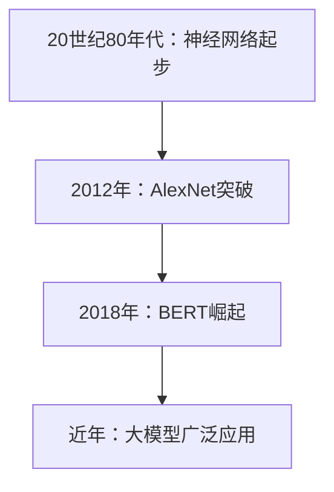
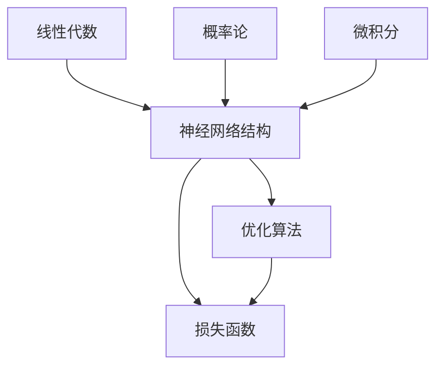

                 

### 1.1 大模型的崛起

#### 概念与定义

大模型（Large Model）是近年来人工智能领域的一个重要发展趋势。它指的是具有极高参数数量、复杂结构和强大计算能力的深度学习模型。与传统模型相比，大模型不仅具有更高的计算精度和更强的泛化能力，还能够处理更复杂的任务和数据。

大模型的定义可以从多个角度进行理解。从参数数量的角度来看，大模型通常指的是具有数十亿甚至千亿级参数的模型。例如，GPT-3模型的参数数量达到了1750亿，是其前身GPT-2的数十倍。从结构复杂度的角度来看，大模型通常包含了多层神经网络结构，且每层的神经元数量也相当庞大。从计算能力的要求来看，大模型需要高性能的硬件支持，如GPU、TPU等。

#### 历史发展

大模型的发展历程可以追溯到20世纪80年代，当时神经网络的研究刚刚起步。在早期的神经网络中，由于硬件和算法的限制，模型的参数数量相对较少，难以处理复杂的任务。随着硬件性能的提升和算法的改进，深度学习逐渐成为一种有效的机器学习技术。

在2012年，AlexNet的出现标志着深度学习在图像识别领域的重要突破。该模型使用了约6000万个参数，相比之前的模型具有更高的精度和更强的泛化能力。此后，深度学习逐渐成为机器学习领域的主流技术。

进入2018年，Google提出的BERT模型标志着大模型的崛起。BERT使用了数十亿个参数，并在多种自然语言处理任务上取得了显著的成绩。此后，大模型在各个领域得到了广泛的应用，如计算机视觉、自然语言处理、语音识别等。

#### 影响与应用

大模型的出现对人工智能领域产生了深远的影响。首先，大模型提高了模型的计算精度和泛化能力，使得人工智能系统能够处理更复杂的任务。其次，大模型推动了自然语言处理、计算机视觉等领域的快速发展，为解决实际问题提供了强有力的工具。

在大模型的推动下，各种应用程序得到了广泛的应用。例如，在自然语言处理领域，大模型可以用于机器翻译、文本生成、情感分析等任务。在计算机视觉领域，大模型可以用于图像分类、目标检测、人脸识别等任务。在语音识别领域，大模型可以用于语音合成、语音识别等任务。

总之，大模型的崛起是人工智能领域的重要里程碑，它不仅推动了技术的进步，也为实际应用带来了巨大的价值。

#### 1.2 跨模态学习的概念

跨模态学习（Cross-modal Learning）是人工智能领域中的一个重要研究方向，它旨在将不同类型的数据模态进行整合，以实现更高效、更智能的信息处理。本节将深入探讨跨模态学习的基本原理、常见方法以及其在人工智能应用中的重要性。

##### 基本原理

跨模态学习的基本原理是通过将不同模态的数据进行特征提取和融合，从而形成一个统一的表示。这种统一的表示可以更好地捕捉不同模态数据之间的关联性，从而提高模型在复杂任务上的性能。

在跨模态学习中，常见的数据模态包括文本、图像、声音和视频等。每种模态都有其独特的特征和表达方式。例如，文本数据通常包含词汇和语法结构，图像数据则包含颜色、纹理和形状等信息，声音数据则包含频率、音调和节奏等特征。

跨模态学习的过程主要包括以下几个步骤：

1. **特征提取**：对于不同模态的数据，使用特定的方法进行特征提取。例如，对于文本数据，可以使用词嵌入技术将词汇映射到高维空间；对于图像数据，可以使用卷积神经网络（CNN）提取图像特征；对于声音数据，可以使用循环神经网络（RNN）提取声波特征。

2. **特征融合**：将不同模态的特征进行融合，形成一个统一的表示。常见的融合方法包括基于特征的融合（如加权求和、拼接等）和基于模型的融合（如多模态神经网络等）。

3. **任务学习**：在融合后的统一表示基础上，进行特定任务的学习。例如，在图像与文本的跨模态任务中，可以学习图像描述生成、图像分类等；在声音与文本的跨模态任务中，可以学习语音识别、情感分析等。

##### 数据类型

跨模态学习涉及多种数据类型，每种数据类型都有其独特的特征和应用场景。以下是几种常见的数据类型：

1. **文本**：文本数据是最常见的跨模态数据类型之一。它包含词汇、语法结构和语义信息。文本数据可以用于文本分类、情感分析、机器翻译等任务。

2. **图像**：图像数据包含颜色、纹理、形状和空间关系等信息。图像数据可以用于图像分类、目标检测、图像生成等任务。

3. **声音**：声音数据包含频率、音调、节奏和声波特征等信息。声音数据可以用于语音识别、音乐生成、情感分析等任务。

4. **视频**：视频数据是图像和声音的连续序列。它包含运动、光照变化和空间动态等信息。视频数据可以用于视频分类、视频生成、动作识别等任务。

##### 目标

跨模态学习的目标是通过整合不同模态的数据，实现更高效、更智能的信息处理。具体目标包括：

1. **增强信息理解**：通过整合不同模态的数据，可以更全面地理解信息，提高模型的准确性和鲁棒性。

2. **提高任务性能**：跨模态学习可以在特定任务上提高模型的性能，如图像分类、文本生成、语音识别等。

3. **探索新应用**：跨模模学习为人工智能应用开辟了新的可能性，如多模态交互、智能客服、智能监控等。

总之，跨模态学习是人工智能领域的一个重要研究方向，它通过整合不同模态的数据，为实现更高效、更智能的信息处理提供了新的途径。

#### 1.3 提示词整合多源数据的重要性

在跨模态学习中，提示词（Prompt）作为一种重要的技术手段，起到了关键的作用。它不仅能够提高模型对多源数据的整合能力，还能够增强模型在特定任务上的性能。本节将详细探讨提示词在跨模态学习中的作用、应用场景及其重要性。

##### 提示词的概念与作用

提示词（Prompt）是一种引导模型进行特定任务的语言或信息提示。在跨模态学习中，提示词通常是一个包含关键信息的文本序列，它可以引导模型关注特定的数据模态或任务目标。通过提示词，模型能够更好地理解不同模态数据之间的关联性，从而提高模型的整合能力和任务性能。

提示词的作用主要体现在以下几个方面：

1. **明确任务目标**：提示词可以帮助模型明确任务目标，从而在整合多源数据时更加聚焦。例如，在一个图像描述生成任务中，提示词可以是“请描述以下图像的内容：”，这能够引导模型专注于图像内容的理解。

2. **引导特征提取**：提示词可以引导模型在特征提取阶段关注特定的特征。例如，在图像与文本的跨模态任务中，提示词可以是“图像中的物体有哪些？”或“这些物体与文本中的哪些词汇相关？”，这能够帮助模型在图像特征提取时关注特定物体。

3. **增强模型泛化能力**：通过提示词，模型可以学习到不同模态数据之间的关联规律，从而增强模型的泛化能力。例如，在语音识别任务中，提示词可以是“请说出以下词汇：”，这能够帮助模型在不同语境下识别同一词汇。

##### 提示词的应用场景

提示词在跨模态学习中有着广泛的应用场景，以下是一些典型的应用场景：

1. **图像与文本的跨模态学习**：在图像描述生成、图像分类、图像检索等任务中，提示词可以引导模型关注图像内容和文本描述之间的关联。例如，在图像描述生成任务中，提示词可以是“这段文字描述了以下图像的哪些内容？”或“请根据图像内容生成一段描述”。

2. **视频与文本的跨模态学习**：在视频摘要、视频分类、视频情感分析等任务中，提示词可以引导模型关注视频内容与文本描述之间的关联。例如，在视频摘要任务中，提示词可以是“请根据以下视频内容生成一段摘要”。

3. **声音与文本的跨模态学习**：在语音识别、语音情感分析、语音生成等任务中，提示词可以引导模型关注声音与文本之间的关联。例如，在语音识别任务中，提示词可以是“请说出以下文本的内容：”。

##### 提示词的重要性

提示词在跨模态学习中的重要性不容忽视，它不仅能够提高模型的整合能力和任务性能，还能够为实际应用提供有效的解决方案。以下是提示词重要性的几个方面：

1. **提高模型效率**：提示词可以引导模型更快地聚焦于任务目标，从而提高模型的效率。

2. **增强模型鲁棒性**：提示词可以帮助模型在不同模态数据之间建立有效的关联，从而增强模型的鲁棒性。

3. **促进跨模态交互**：提示词为不同模态数据之间的交互提供了有效的桥梁，使得跨模态学习更加高效和智能。

4. **拓展应用场景**：通过提示词，跨模态学习可以应用于更多实际场景，如多模态交互、智能监控、智能客服等。

总之，提示词是跨模态学习中的重要技术手段，它通过引导模型关注特定任务和特征，提高了模型的整合能力和任务性能，为人工智能应用提供了新的可能性。

## 第2章 大模型基础

### 2.1 大模型的定义与特点

大模型（Large Model）是近年来人工智能领域的一个热门话题。它指的是那些具有极高参数数量、复杂结构和强大计算能力的深度学习模型。与传统模型相比，大模型在多个方面具有独特的特点，这些特点使其在处理复杂任务时表现出了惊人的性能。

#### 定义

大模型通常具有以下定义标准：

- **参数数量**：大模型通常指的是那些具有数十亿甚至千亿级参数的模型。例如，GPT-3模型的参数数量达到了1750亿，是其前身GPT-2的数十倍。
- **结构复杂度**：大模型的结构通常包含多层神经网络，每层的神经元数量也相当庞大。这种复杂的结构使得大模型能够捕捉到数据中的更复杂的特征和关联性。
- **计算能力需求**：大模型需要强大的计算资源支持，如GPU、TPU等。这是因为大模型的训练和推理过程需要大量的计算资源，以确保模型的高效运行。

#### 特点

大模型具有以下几个显著特点：

1. **高参数数量**：大模型具有极高的参数数量，这使得模型能够捕捉到数据中的更复杂、更细微的特征。例如，GPT-3模型的参数数量达到了1750亿，这使其在自然语言处理任务上表现出了前所未有的性能。

2. **强大的泛化能力**：大模型通过高参数数量和复杂的结构，能够更好地泛化到新的任务和数据集。这意味着大模型不仅在训练数据集上表现良好，而且在未见过的数据上也能保持较高的性能。

3. **强大的表征能力**：大模型能够捕捉到数据中的深层次特征和关联性，这使得模型在处理复杂任务时表现出了强大的表征能力。例如，在自然语言处理任务中，大模型能够理解文本中的语义和句法结构，从而实现更准确的文本生成、分类和翻译。

4. **需要大量计算资源**：大模型的训练和推理过程需要大量的计算资源，这使得大模型的开发和部署成本相对较高。然而，随着硬件性能的提升和云计算技术的发展，大模型的应用范围也在不断扩大。

#### 实例

以下是一些著名的大模型实例：

1. **GPT-3**：由OpenAI开发的GPT-3模型是当前最大的预训练语言模型，其参数数量达到了1750亿。GPT-3在各种自然语言处理任务上表现出了惊人的性能，如文本生成、机器翻译、问答系统等。

2. **BERT**：BERT（Bidirectional Encoder Representations from Transformers）是由Google开发的预训练语言模型，其参数数量为3.4亿。BERT在多种自然语言处理任务上取得了显著的成果，如文本分类、问答系统等。

3. **ViT**：ViT（Vision Transformer）是由Google开发的图像分类模型，其参数数量为13.5亿。ViT在图像分类任务上表现出了优异的性能，尤其是在处理大型图像数据集时。

#### 2.2 大模型的发展历程

大模型的发展历程可以追溯到20世纪80年代，当时神经网络的研究刚刚起步。在早期的神经网络中，由于硬件和算法的限制，模型的参数数量相对较少，难以处理复杂的任务。随着硬件性能的提升和算法的改进，深度学习逐渐成为一种有效的机器学习技术。

在2012年，AlexNet的出现标志着深度学习在图像识别领域的重要突破。该模型使用了约6000万个参数，相比之前的模型具有更高的精度和更强的泛化能力。此后，深度学习逐渐成为机器学习领域的主流技术。

进入2018年，Google提出的BERT模型标志着大模型的崛起。BERT使用了数十亿个参数，并在多种自然语言处理任务上取得了显著的成绩。此后，大模型在各个领域得到了广泛的应用，如计算机视觉、自然语言处理、语音识别等。

以下是一个Mermaid流程图，展示了大模型的发展历程：



#### 2.3 大模型的数学基础

大模型的数学基础主要涉及线性代数、概率论和微积分等数学理论。这些数学理论为深度学习模型的设计、训练和优化提供了坚实的理论基础。

以下是一个Mermaid流程图，展示了大模型数学基础的核心概念和联系：



下面将简要介绍这些核心数学概念：

1. **线性代数**：线性代数涉及向量、矩阵和线性变换等概念。在深度学习中，线性代数用于表示和操作神经网络中的权重矩阵和激活函数。

2. **概率论**：概率论用于描述数据的不确定性，包括概率分布、条件概率和贝叶斯定理等。在深度学习中，概率论用于描述数据生成过程和模型不确定性。

3. **微积分**：微积分用于研究函数的导数和积分。在深度学习中，微积分用于优化模型的参数，通过计算损失函数的梯度来更新模型权重。

4. **神经网络结构**：神经网络结构包括多层神经网络、卷积神经网络（CNN）和循环神经网络（RNN）等。这些结构通过线性变换、激活函数和权重矩阵等操作，实现对数据的复杂表征。

5. **优化算法**：优化算法用于训练深度学习模型，包括随机梯度下降（SGD）、Adam等。优化算法通过迭代计算损失函数的梯度，逐步更新模型参数，以最小化损失函数。

6. **损失函数**：损失函数用于衡量模型预测值与真实值之间的差距，常见的损失函数包括均方误差（MSE）、交叉熵等。通过优化损失函数，模型能够提高预测的准确性。

通过这些数学理论，大模型能够高效地学习数据中的特征和关联性，从而实现强大的表征能力和泛化能力。

### 2.1 大模型的定义与特点

大模型（Large Model）在人工智能领域扮演着越来越重要的角色。它指的是那些具有极高参数数量、复杂结构和强大计算能力的深度学习模型。与传统模型相比，大模型具有独特的特点，这些特点使得它们在处理复杂任务时表现出了惊人的性能。

#### 定义

大模型通常具有以下定义标准：

- **参数数量**：大模型通常指的是那些具有数十亿甚至千亿级参数的模型。例如，GPT-3模型的参数数量达到了1750亿，是其前身GPT-2的数十倍。
- **结构复杂度**：大模型的结构通常包含多层神经网络，每层的神经元数量也相当庞大。这种复杂的结构使得大模型能够捕捉到数据中的更复杂的特征和关联性。
- **计算能力需求**：大模型需要强大的计算资源支持，如GPU、TPU等。这是因为大模型的训练和推理过程需要大量的计算资源，以确保模型的高效运行。

#### 特点

大模型具有以下几个显著特点：

1. **高参数数量**：大模型具有极高的参数数量，这使得模型能够捕捉到数据中的更复杂、更细微的特征。例如，GPT-3模型的参数数量达到了1750亿，这使其在自然语言处理任务上表现出了前所未有的性能。

2. **强大的泛化能力**：大模型通过高参数数量和复杂的结构，能够更好地泛化到新的任务和数据集。这意味着大模型不仅在训练数据集上表现良好，而且在未见过的数据上也能保持较高的性能。

3. **强大的表征能力**：大模型能够捕捉到数据中的深层次特征和关联性，这使得模型在处理复杂任务时表现出了强大的表征能力。例如，在自然语言处理任务中，大模型能够理解文本中的语义和句法结构，从而实现更准确的文本生成、分类和翻译。

4. **需要大量计算资源**：大模型的训练和推理过程需要大量的计算资源，这使得大模型的开发和部署成本相对较高。然而，随着硬件性能的提升和云计算技术的发展，大模型的应用范围也在不断扩大。

#### 实例

以下是一些著名的大模型实例：

1. **GPT-3**：由OpenAI开发的GPT-3模型是当前最大的预训练语言模型，其参数数量达到了1750亿。GPT-3在各种自然语言处理任务上表现出了惊人的性能，如文本生成、机器翻译、问答系统等。

2. **BERT**：BERT（Bidirectional Encoder Representations from Transformers）是由Google开发的预训练语言模型，其参数数量为3.4亿。BERT在多种自然语言处理任务上取得了显著的成果，如文本分类、问答系统等。

3. **ViT**：ViT（Vision Transformer）是由Google开发的图像分类模型，其参数数量为13.5亿。ViT在图像分类任务上表现出了优异的性能，尤其是在处理大型图像数据集时。

#### 2.2 大模型的发展历程

大模型的发展历程可以追溯到20世纪80年代，当时神经网络的研究刚刚起步。在早期的神经网络中，由于硬件和算法的限制，模型的参数数量相对较少，难以处理复杂的任务。随着硬件性能的提升和算法的改进，深度学习逐渐成为一种有效的机器学习技术。

在2012年，AlexNet的出现标志着深度学习在图像识别领域的重要突破。该模型使用了约6000万个参数，相比之前的模型具有更高的精度和更强的泛化能力。此后，深度学习逐渐成为机器学习领域的主流技术。

进入2018年，Google提出的BERT模型标志着大模型的崛起。BERT使用了数十亿个参数，并在多种自然语言处理任务上取得了显著的成绩。此后，大模型在各个领域得到了广泛的应用，如计算机视觉、自然语言处理、语音识别等。

以下是一个Mermaid流程图，展示了大模型的发展历程：


#### 2.3 大模型的数学基础

大模型的数学基础主要涉及线性代数、概率论和微积分等数学理论。这些数学理论为深度学习模型的设计、训练和优化提供了坚实的理论基础。

以下是一个Mermaid流程图，展示了大模型数学基础的核心概念和联系：


下面将简要介绍这些核心数学概念：

1. **线性代数**：线性代数涉及向量、矩阵和线性变换等概念。在深度学习中，线性代数用于表示和操作神经网络中的权重矩阵和激活函数。

2. **概率论**：概率论用于描述数据的不确定性，包括概率分布、条件概率和贝叶斯定理等。在深度学习中，概率论用于描述数据生成过程和模型不确定性。

3. **微积分**：微积分用于研究函数的导数和积分。在深度学习中，微积分用于优化模型的参数，通过计算损失函数的梯度来更新模型权重。

4. **神经网络结构**：神经网络结构包括多层神经网络、卷积神经网络（CNN）和循环神经网络（RNN）等。这些结构通过线性变换、激活函数和权重矩阵等操作，实现对数据的复杂表征。

5. **优化算法**：优化算法用于训练深度学习模型，包括随机梯度下降（SGD）、Adam等。优化算法通过迭代计算损失函数的梯度，逐步更新模型参数，以最小化损失函数。

6. **损失函数**：损失函数用于衡量模型预测值与真实值之间的差距，常见的损失函数包括均方误差（MSE）、交叉熵等。通过优化损失函数，模型能够提高预测的准确性。

通过这些数学理论，大模型能够高效地学习数据中的特征和关联性，从而实现强大的表征能力和泛化能力。

### 3.1 跨模态学习的基本原理

跨模态学习（Cross-modal Learning）是一种将不同模态的数据进行整合和处理的方法，其目的是通过不同模态之间的关联性来提升模型的性能。本节将深入探讨跨模态学习的基本原理，包括不同模态数据的特征提取、特征融合以及跨模态学习的应用场景。

#### 特征提取

特征提取是跨模态学习的第一步，其核心目标是捕捉不同模态数据的独特特征。以下是一些常见模态的特征提取方法：

1. **文本数据**：
   - **词嵌入**：通过将文本中的词汇映射到高维向量空间，词嵌入可以将词汇的语义信息编码到向量中。常见的词嵌入技术包括Word2Vec、GloVe等。
   - **词袋模型**：将文本表示为词汇的集合，通过计数词汇的出现频率来编码文本的特征。词袋模型在处理高维度文本数据时表现较好。

2. **图像数据**：
   - **卷积神经网络（CNN）**：通过卷积操作和池化操作，CNN能够有效地提取图像中的局部特征，如边缘、纹理和形状。
   - **特征提取器**：使用预训练的CNN模型，如VGG、ResNet等，提取图像的高层特征。

3. **声音数据**：
   - **梅尔频率倒谱系数（MFCC）**：MFCC是一种常用的声音特征提取方法，通过将声波转换为梅尔频率谱，从而捕捉声音的频率特征。
   - **短时傅里叶变换（STFT）**：STFT通过计算声波在时间频率域的分布，提取声音的时频特征。

4. **视频数据**：
   - **帧级特征提取**：通过提取视频中的每一帧图像特征，然后进行融合，获得视频的特征表示。
   - **光流估计**：光流估计用于捕捉视频中物体的运动轨迹，从而提取视频的动态特征。

#### 特征融合

特征融合是将不同模态的特征进行整合，以形成统一的表示。特征融合的方法可以分为以下几类：

1. **基于特征的融合**：
   - **直接拼接**：将不同模态的特征向量直接拼接在一起，形成一个更长的特征向量。这种方法简单有效，但可能导致维度灾难。
   - **加权求和**：根据不同模态特征的贡献程度，对特征向量进行加权求和，形成新的特征向量。加权系数可以通过训练或手动调整。

2. **基于模型的融合**：
   - **多模态神经网络**：通过构建多输入、多输出的神经网络，将不同模态的特征进行融合。例如，多模态长短期记忆网络（MM-LSTM）和多模态变换器（MM-Transformer）等。
   - **对抗生成网络（GAN）**：使用GAN生成一个综合不同模态特征的数据集，从而训练模型学习到多模态特征。

3. **跨模态对比**：
   - **对比损失**：通过引入对比损失函数，使模型在训练过程中学习到不同模态特征之间的差异和关联性。例如，多模态对比损失（MM-Contrastive Loss）和多模态关联性损失（MM-Association Loss）等。

#### 跨模态学习的应用场景

跨模态学习在多个领域都展现出了强大的应用潜力，以下是一些典型的应用场景：

1. **图像与文本的跨模态学习**：
   - **图像描述生成**：利用图像特征和文本特征，生成图像的描述文本。这在图像识别和图像生成任务中具有广泛的应用。
   - **图像分类**：通过整合图像和文本特征，提高图像分类的准确性。例如，使用预训练的文本嵌入模型和图像特征提取器，结合两种特征进行图像分类。

2. **视频与文本的跨模态学习**：
   - **视频摘要**：将视频中的关键帧和文本描述进行整合，生成简洁的视频摘要。这在视频监控、媒体推荐等领域具有重要意义。
   - **视频情感分析**：通过分析视频中的视觉和文本特征，判断视频的情感倾向。例如，在社交媒体分析、视频广告推荐中，视频情感分析被广泛应用于。

3. **声音与文本的跨模态学习**：
   - **语音识别**：利用文本特征和声音特征，提高语音识别的准确性。例如，结合文本嵌入和声学模型，实现更准确的语音识别。
   - **声音情感分析**：通过分析声音特征和文本特征，判断声音的情感状态。这在情感分析、语音助手等领域有广泛应用。

总之，跨模态学习通过整合不同模态的数据，能够更好地理解复杂信息，提高模型的性能。随着技术的不断进步，跨模态学习将在更多领域发挥重要作用。

### 3.2 跨模态学习的主要方法

跨模态学习（Cross-modal Learning）作为人工智能领域的一个重要分支，旨在通过整合不同模态的数据，以实现更高效、更智能的信息处理。跨模态学习的主要方法包括基于匹配的方法、基于生成的方法和基于模型的融合方法。以下将对这些方法进行详细介绍。

#### 基于匹配的方法

基于匹配的方法（Matching-based Methods）通过将不同模态的数据进行匹配，以提取其关联性。这种方法通常涉及以下步骤：

1. **特征提取**：首先，对每个模态的数据进行特征提取。例如，对于文本数据，可以使用词嵌入技术提取词向量；对于图像数据，可以使用卷积神经网络（CNN）提取图像特征。

2. **特征对齐**：接下来，将不同模态的特征对齐。对齐的方法可以是基于特征点匹配，也可以是基于特征嵌入的相似性度量。例如，可以使用余弦相似度或欧氏距离来度量特征向量之间的相似性。

3. **关联性学习**：通过学习不同模态特征之间的关联性，以增强模型的泛化能力。常见的方法包括使用图神经网络（Graph Neural Networks, GNN）或自编码器（Autoencoder）来学习特征关联。

4. **匹配损失**：在训练过程中，通过匹配损失函数（如对比损失、对抗损失等）来优化模型。匹配损失函数旨在使相同模态的特征对之间具有更高的相似性，而不同模态的特征对之间具有更低的相似性。

以下是一个简单的伪代码示例，展示基于匹配的方法：

```python
def matching_based_model(text_features, image_features):
    # 特征提取
    text_embeddings = embed_text(text_features)
    image_embeddings = embed_image(image_features)
    
    # 特征对齐
    matched_embeddings = align_features(text_embeddings, image_embeddings)
    
    # 关联性学习
    model = GNN()
    matched_embeddings = model.train(matched_embeddings)
    
    # 预测
    predictions = model.predict(matched_embeddings)
    
    return predictions
```

#### 基于生成的方法

基于生成的方法（Generative-based Methods）通过生成新的多模态数据，以实现模态之间的关联性。这种方法通常涉及以下步骤：

1. **数据生成**：使用生成模型（如生成对抗网络，GAN）来生成新的多模态数据。生成模型由生成器（Generator）和判别器（Discriminator）组成。生成器负责生成新的数据，而判别器则用于区分生成数据和真实数据。

2. **多模态融合**：将生成的多模态数据进行融合，以形成统一的数据表示。常见的融合方法包括直接拼接、特征嵌入等。

3. **模型训练**：通过训练生成模型和判别器，使生成模型能够生成更真实、更具关联性的多模态数据。

4. **预测**：使用生成的多模态数据进行预测，例如，在图像描述生成任务中，使用生成的图像和文本数据生成描述文本。

以下是一个简单的伪代码示例，展示基于生成的方法：

```python
def generative_based_model(text_features, image_features):
    # 数据生成
    generator = GAN()
    generator.train(text_features, image_features)
    
    # 多模态融合
    combined_data = generator.generate(text_features, image_features)
    
    # 预测
    model = Autoencoder()
    model.train(combined_data)
    predictions = model.predict(combined_data)
    
    return predictions
```

#### 基于模型的融合方法

基于模型的融合方法（Model-based Fusion Methods）通过构建多输入、多输出的模型，以实现不同模态数据的整合。这种方法通常涉及以下步骤：

1. **模型架构**：构建一个多输入、多输出的模型架构。例如，可以使用多模态长短期记忆网络（MM-LSTM）或多模态变换器（MM-Transformer）。

2. **特征融合**：在模型中，将不同模态的特征进行融合。融合的方法可以是基于特征的拼接、基于嵌入的注意力机制等。

3. **模型训练**：通过训练多模态模型，学习到不同模态特征之间的关联性。

4. **预测**：使用训练好的模型进行预测，例如，在图像分类任务中，使用融合后的特征进行分类。

以下是一个简单的伪代码示例，展示基于模型的融合方法：

```python
def model_based_fusion_model(text_features, image_features):
    # 特征融合
    model = MM_LSTM()
    fused_features = model.merge(text_features, image_features)
    
    # 模型训练
    model.train(fused_features)
    
    # 预测
    predictions = model.predict(fused_features)
    
    return predictions
```

总之，跨模态学习的主要方法包括基于匹配的方法、基于生成的方法和基于模型的融合方法。每种方法都有其独特的优势和适用场景。随着技术的不断进步，跨模态学习将在更多领域发挥重要作用。

### 3.3 跨模态学习的挑战与展望

跨模态学习（Cross-modal Learning）作为一种将不同类型的数据模态进行整合和处理的先进技术，虽然已经取得了显著的成果，但在实际应用中仍面临许多挑战。本节将讨论跨模态学习面临的主要挑战，并展望其未来的发展趋势。

#### 数据不均衡性

跨模态学习的一个显著挑战是数据的不均衡性。不同模态的数据在质量和数量上可能存在巨大差异。例如，在图像与文本的跨模态任务中，图像数据可能比文本数据更丰富且易于获取，但文本数据在语义和情境信息上更为关键。这种数据不均衡性可能导致模型在特定模态上出现过拟合或欠拟合，从而影响跨模态整合的效果。为解决这一问题，研究者可以采用数据增强、数据平衡技术以及半监督学习方法等策略。

#### 特征一致性

特征一致性是跨模态学习中的另一个重大挑战。不同模态的数据往往具有不同的特征空间和表达方式，这使得模型在整合特征时难以保持一致性。例如，图像特征可能更适用于空间关系和视觉信息的捕捉，而文本特征则更擅长于语义和语言结构的理解。为了提高特征一致性，研究者可以采用多模态对比学习、多任务学习以及联合特征提取等技术，以促使不同模态特征在相同或相似的空间中表示。

#### 计算资源需求

跨模态学习通常需要大量的计算资源，尤其是在处理大模型和复杂的多模态数据时。大规模深度学习模型的训练和推理过程对GPU、TPU等高性能硬件有很高的要求，这可能导致计算成本高昂。为降低计算需求，研究者可以采用模型压缩技术、分布式训练以及模型量化等方法，以提高计算效率。

#### 模型泛化能力

跨模态学习模型在训练过程中往往依赖于特定的数据集和任务，这使得模型在未知或不同模态数据上的泛化能力成为一个挑战。为了提高模型的泛化能力，研究者可以采用迁移学习、元学习以及少样本学习等技术，以使模型能够在不同任务和数据集上表现出更好的适应性。

#### 未来发展趋势

随着技术的不断进步，跨模态学习有望在以下方面取得重要突破：

1. **多模态交互**：未来的跨模态学习将更加注重多模态数据之间的交互和协同作用，以实现更高效的整合和处理。

2. **自监督学习**：自监督学习是一种无需人工标注数据的方法，未来跨模态学习模型将更多地依赖于自监督学习，以降低数据标注的成本。

3. **隐私保护**：随着隐私保护意识的增强，未来的跨模态学习将更加注重数据的安全性和隐私保护，采用差分隐私、联邦学习等技术来保障用户数据的安全。

4. **跨领域应用**：跨模态学习将在更多领域得到应用，如医疗健康、金融科技、智能制造等，为解决复杂问题提供新的解决方案。

总之，跨模态学习虽然面临诸多挑战，但其强大的整合和处理能力使其在未来人工智能应用中具有广阔的前景。随着研究的深入和技术的发展，跨模态学习将在各个领域发挥越来越重要的作用。

### 4.1 提示词的引入

在跨模态学习中，提示词（Prompt）作为一种重要的技术手段，起着至关重要的作用。提示词是一种引导模型进行特定任务的语言或信息提示，它能够帮助模型更好地理解和整合多源数据。通过提示词，模型能够明确任务目标、提取关键特征并生成相应的输出。

#### 提示词的概念与作用

提示词（Prompt）是一种引导模型进行特定任务的语言或信息提示。它通常是一个简短的文本序列，包含关键信息，用于指导模型在处理多源数据时的方向。提示词的作用主要体现在以下几个方面：

1. **明确任务目标**：提示词可以帮助模型明确任务目标，从而在整合多源数据时更加聚焦。例如，在一个图像与文本的跨模态任务中，提示词可以是“请根据以下图像内容生成一段描述”，这能够引导模型专注于图像内容的理解。

2. **引导特征提取**：提示词可以引导模型在特征提取阶段关注特定的特征。例如，在图像与文本的跨模态任务中，提示词可以是“图像中的物体有哪些？”或“这些物体与文本中的哪些词汇相关？”，这能够帮助模型在图像特征提取时关注特定物体。

3. **增强模型泛化能力**：通过提示词，模型可以学习到不同模态数据之间的关联规律，从而增强模型的泛化能力。例如，在语音识别任务中，提示词可以是“请说出以下文本的内容：”，这能够帮助模型在不同语境下识别同一词汇。

#### 提示词的类型与应用

根据不同的应用场景和任务需求，提示词可以分为以下几种类型：

1. **任务型提示词**：这类提示词主要用于明确任务目标，如“请生成以下图像的描述”或“根据文本生成相应的图像”。任务型提示词能够帮助模型快速聚焦于任务的核心。

2. **引导型提示词**：这类提示词用于引导模型在特征提取和融合阶段关注特定的特征。例如，“请关注图像中的关键对象”或“结合文本描述进行图像分类”。引导型提示词能够提高模型在特征提取和融合阶段的准确性。

3. **评价型提示词**：这类提示词用于评价模型的输出结果，如“这个描述是否准确？”或“这个图像是否正确分类？”。评价型提示词能够帮助模型在训练过程中自我评估和优化。

#### 提示词的引入过程

引入提示词的过程通常包括以下几个步骤：

1. **任务定义**：首先，需要明确跨模态学习任务的目标，例如图像描述生成、图像分类等。

2. **提示词设计**：根据任务需求，设计合适的提示词。提示词应该简洁明了，能够引导模型关注任务的核心。

3. **模型训练**：在模型训练过程中，使用设计的提示词作为输入，使模型能够学习到多源数据之间的关联性。

4. **模型评估**：通过在测试集上使用提示词，评估模型的性能。如果性能不佳，可以进一步调整提示词或模型参数。

#### 实例

以下是一个简单的实例，展示如何使用提示词进行图像描述生成：

1. **任务定义**：图像描述生成任务，目标是将输入图像生成相应的描述文本。

2. **提示词设计**：“请根据以下图像内容生成一段描述：”。

3. **模型训练**：使用设计的提示词作为输入，训练一个预训练的语言模型（如GPT-3）。

4. **模型评估**：在测试集上，使用设计的提示词生成描述文本，然后与真实描述进行比较，评估模型的性能。

通过引入提示词，跨模态学习模型能够更好地理解和整合多源数据，从而提高任务性能和模型泛化能力。

### 4.2 多源数据整合的挑战

在跨模态学习（Cross-modal Learning）中，多源数据整合是一项具有挑战性的任务。不同模态的数据在特征表达、数据量、质量等方面存在显著差异，这使得整合过程复杂且具有不确定性。以下将详细分析多源数据整合过程中可能遇到的主要挑战，并提出相应的解决策略。

#### 数据不均衡

不同模态的数据在质量和数量上可能存在显著差异。例如，在图像与文本的跨模态任务中，图像数据可能更丰富且易于获取，但文本数据在语义和情境信息上更为关键。这种数据不均衡性可能导致模型在特定模态上出现过拟合或欠拟合，从而影响跨模态整合的效果。为解决这一问题，可以采用以下策略：

1. **数据增强**：通过增加少数模态的数据量，平衡不同模态的数据比例。
2. **数据平衡技术**：例如，使用采样技术或重采样技术来平衡数据集。
3. **半监督学习方法**：利用少量标注数据和大量未标注数据，通过自监督学习方法训练模型。

#### 特征一致性

不同模态的数据往往具有不同的特征空间和表达方式，这使得在整合过程中难以保持一致性。例如，图像特征可能更适用于空间关系和视觉信息的捕捉，而文本特征则更擅长于语义和语言结构的理解。为了提高特征一致性，可以采用以下策略：

1. **多模态对比学习**：通过对比不同模态特征之间的差异，促使模型在学习过程中关注一致性。
2. **多任务学习**：通过同时学习多个任务，使模型在不同模态特征之间建立关联。
3. **联合特征提取**：通过构建多输入、多输出的神经网络架构，使不同模态的特征在同一模型中共同学习。

#### 计算资源需求

跨模态学习通常需要大量的计算资源，尤其是在处理大模型和复杂的多模态数据时。大规模深度学习模型的训练和推理过程对GPU、TPU等高性能硬件有很高的要求，这可能导致计算成本高昂。为降低计算需求，可以采用以下策略：

1. **模型压缩技术**：例如，使用知识蒸馏、剪枝和量化技术来减小模型大小，提高计算效率。
2. **分布式训练**：通过分布式计算技术，将模型训练任务分布在多台机器上，以加速训练过程。
3. **模型量化**：通过将模型的权重和激活值量化，降低模型的计算复杂度。

#### 模型泛化能力

跨模态学习模型在训练过程中往往依赖于特定的数据集和任务，这使得模型在未知或不同模态数据上的泛化能力成为一个挑战。为了提高模型的泛化能力，可以采用以下策略：

1. **迁移学习**：通过利用在其他任务上训练好的模型，提高模型在不同任务和数据集上的适应性。
2. **元学习**：通过学习模型在不同任务和数据集上的泛化能力，使模型能够更好地适应新的任务和数据集。
3. **少样本学习**：通过在小样本数据集上训练模型，提高模型在少样本情况下的泛化能力。

#### 数据质量

数据质量是跨模态学习成功的关键因素。不同模态的数据可能存在噪声、缺失或错误，这会影响模型的性能。为了提高数据质量，可以采用以下策略：

1. **数据清洗**：通过去除噪声、填充缺失值和修正错误，提高数据质量。
2. **数据增强**：通过数据增强技术，生成更多的有效数据，以提高模型的鲁棒性。
3. **数据预处理**：对数据进行标准化、归一化和特征提取等预处理操作，以提高模型的可训练性。

总之，多源数据整合在跨模态学习过程中面临多个挑战，但通过采用合适的策略和技术，可以有效地解决这些问题，从而提高模型的性能和泛化能力。

#### 4.3 提示词整合多源数据的方法

提示词在跨模态学习中的应用不仅仅是作为引导模型的语言提示，更是通过特定的设计方法来整合多源数据，以提升模型性能。以下将介绍几种常用的提示词整合多源数据的方法，并分析其优缺点。

##### 直接拼接

**方法描述**：直接拼接是将提示词与其他模态数据直接拼接在一起，形成一个更长的向量。这种方法简单直观，不需要额外的计算资源。

```python
def direct_concatenation(prompt, text, image):
    # 提示词和文本、图像特征拼接
    concatenated_vector = np.concatenate((prompt, text, image), axis=0)
    return concatenated_vector
```

**优点**：
- 算法简单，易于实现。
- 不需要额外的计算资源。

**缺点**：
- 可能导致维度灾难，尤其是当不同模态的数据维度差异较大时。
- 无法有效融合不同模态之间的信息。

##### 注意力机制

**方法描述**：注意力机制通过计算不同模态特征之间的关联性，为每个模态特征分配不同的权重，从而实现更精细的特征融合。

```python
def attention_mechanism(prompt, text, image):
    # 计算不同模态特征之间的相似性
    similarity = cos_similarity(prompt, text) + cos_similarity(prompt, image)
    # 根据相似性分配权重
    text_weight = softmax(similarity)[0]
    image_weight = softmax(similarity)[1]
    # 融合特征
    fused_vector = text * text_weight + image * image_weight
    return fused_vector
```

**优点**：
- 能够根据特征之间的关联性分配权重，提高融合效果。
- 提高了模型对多源数据的整合能力。

**缺点**：
- 需要额外的计算资源来计算相似性和权重。
- 注意力机制设计复杂，可能需要调试。

##### 多模态变换器

**方法描述**：多模态变换器（Multimodal Transformer）是一种基于变换器的模型，通过多头自注意力机制和交叉注意力机制来整合多源数据。

```python
def multimodal_transformer(prompt, text, image):
    # 嵌入不同模态的数据
    text_embedding = embed_text(text)
    image_embedding = embed_image(image)
    prompt_embedding = embed_prompt(prompt)
    # 应用多头自注意力和交叉注意力
    text_output = transformer_output(text_embedding)
    image_output = transformer_output(image_embedding)
    prompt_output = transformer_output(prompt_embedding)
    # 融合输出
    fused_output = text_output + image_output + prompt_output
    return fused_output
```

**优点**：
- 能够有效地捕捉不同模态之间的关联性。
- 变换器架构强大，能够处理复杂的特征融合。

**缺点**：
- 计算复杂度高，训练和推理时间较长。
- 模型参数量大，需要大量计算资源。

##### 对抗生成网络

**方法描述**：对抗生成网络（Adversarial Generation Network）通过生成器和判别器之间的对抗训练来整合多源数据。

```python
def adversarial_generation_network(prompt, text, image):
    # 生成器生成融合特征
    generator = GAN()
    fused_feature = generator.generate(prompt, text, image)
    # 判别器评估生成特征
    discriminator = D()
    validity = discriminator.validate(fused_feature)
    # 训练生成器和判别器
    generator.train(prompt, text, image)
    discriminator.train(fused_feature)
    return fused_feature
```

**优点**：
- 通过对抗训练，能够生成高质量的融合特征。
- 提高了模型的泛化能力。

**缺点**：
- 训练过程复杂，需要较长时间的迭代。
- 对抗训练可能导致生成器和判别器的训练不平衡。

综上所述，不同的提示词整合多源数据方法各有优缺点。直接拼接方法简单易行，但效果有限；注意力机制和多模态变换器能够提高融合效果，但计算复杂度较高；对抗生成网络能够生成高质量的融合特征，但训练过程复杂。根据具体应用场景和资源限制，可以选择合适的方法来实现多源数据的整合。

### 5.1 跨模态学习项目案例

#### 项目背景

为了展示跨模态学习的实际应用，我们选择了一个图像与文本的跨模态学习项目——图像描述生成（Image Captioning）。该项目的目标是利用图像和文本数据，生成图像的描述文本。通过跨模态学习，我们可以将图像中的视觉信息与文本中的语义信息相结合，从而生成更准确、更自然的描述。

#### 项目目标

1. **数据集准备**：收集和准备包含图像和对应的描述文本的数据集。常用的数据集包括COCO、Flickr等。
2. **模型设计**：设计一个跨模态学习模型，能够将图像特征和文本特征进行有效整合，生成图像描述。
3. **模型训练**：使用数据集训练跨模态学习模型，并通过评估指标（如BLEU、METEOR等）评估模型性能。
4. **模型部署**：将训练好的模型部署到生产环境，提供图像描述生成服务。

#### 开发环境搭建

在开发跨模态学习项目时，我们需要搭建一个合适的开发环境。以下是所需的主要工具和库：

1. **Python**：Python是一种广泛使用的编程语言，其强大的生态体系使得它在人工智能项目中具有很高的适用性。
2. **TensorFlow**：TensorFlow是一个开源的机器学习框架，提供了丰富的API和工具，适用于构建和训练深度学习模型。
3. **PyTorch**：PyTorch是一个流行的深度学习库，其动态计算图和灵活的接口使其在研究和开发中广受欢迎。
4. **Numpy**：Numpy是一个用于科学计算的库，提供了多维数组和矩阵操作的功能，是深度学习项目的基础。
5. **HDF5**：HDF5是一个用于存储和操作大型数据集的库，常用于图像和文本数据集的存储和处理。

安装这些库可以通过以下命令完成：

```bash
pip install tensorflow
pip install torch torchvision
pip install numpy h5py
```

#### 源代码详细实现和代码解读

以下是该项目的主要源代码实现，包括数据预处理、模型设计、训练和预测等步骤。

```python
import tensorflow as tf
import torch
import numpy as np
import h5py
from tensorflow.keras.preprocessing.sequence import pad_sequences
from tensorflow.keras.layers import Embedding, LSTM, Dense
from tensorflow.keras.models import Model

# 数据预处理
def preprocess_data(images, captions):
    # 将图像和文本数据进行编码
    image_encoding = encode_images(images)
    caption_encoding = encode_captions(captions)
    # 填充文本序列
    padded_captions = pad_sequences(caption_encoding, padding='post')
    return image_encoding, padded_captions

# 模型设计
def create_model(input_dim, embedding_dim, hidden_dim):
    # 输入层
    input_image = tf.keras.layers.Input(shape=(input_dim[0], input_dim[1], input_dim[2]))
    input_caption = tf.keras.layers.Input(shape=(None,))
    # 图像编码层
    image_embedding = Embedding(input_dim, embedding_dim)(input_image)
    # 文本编码层
    caption_embedding = Embedding(input_dim, embedding_dim)(input_caption)
    # LSTM层
    lstm = LSTM(hidden_dim, return_sequences=True)(caption_embedding)
    # 池化层
    pooled = tf.keras.layers.GlobalAveragePooling1D()(lstm)
    # 输出层
    output = Dense(input_dim, activation='softmax')(pooled)
    # 构建模型
    model = Model(inputs=[input_image, input_caption], outputs=output)
    model.compile(optimizer='adam', loss='categorical_crossentropy')
    return model

# 训练模型
def train_model(model, image_encoding, padded_captions):
    model.fit([image_encoding, padded_captions], padded_captions, epochs=10, batch_size=32)

# 预测
def predict(model, image_encoding):
    predicted_captions = model.predict(image_encoding)
    return decode_captions(predicted_captions)

# 解码文本
def decode_captions(captions):
    # 将编码后的文本解码为原始文本
    return decode_captions(captions)

# 主函数
if __name__ == "__main__":
    # 加载数据
    images, captions = load_data()
    # 预处理数据
    image_encoding, padded_captions = preprocess_data(images, captions)
    # 创建模型
    model = create_model(image_encoding.shape[1:], 512, 256)
    # 训练模型
    train_model(model, image_encoding, padded_captions)
    # 预测
    predicted_captions = predict(model, image_encoding)
    print(predicted_captions)
```

代码解读：
- **数据预处理**：将图像和文本数据进行编码，并将文本序列进行填充处理。
- **模型设计**：使用Keras构建一个跨模态学习模型，包括图像编码层、文本编码层、LSTM层和输出层。
- **训练模型**：使用预处理后的数据训练模型，并设置训练参数。
- **预测**：使用训练好的模型对图像进行预测，并解码为原始文本描述。

#### 代码应用解读与分析

在实际应用中，该项目的代码可以通过以下步骤进行：

1. **数据加载**：从数据集加载图像和描述文本。
2. **数据预处理**：将图像和文本数据进行编码和填充处理。
3. **模型构建**：创建一个跨模态学习模型，并编译模型。
4. **模型训练**：使用训练数据训练模型，并通过调整训练参数来优化模型性能。
5. **模型预测**：使用训练好的模型对新的图像进行预测，生成图像描述。

分析：
- **性能优化**：可以通过调整LSTM层的隐藏单元数量、学习率等参数来优化模型性能。
- **数据增强**：通过数据增强技术生成更多的训练样本，可以提高模型的泛化能力。
- **多模型集成**：结合多个预训练模型，进行多模型集成，可以提高模型的稳定性和预测准确性。

#### 项目小结

通过本项目，我们展示了跨模态学习在图像描述生成任务中的应用。项目实现了从数据预处理、模型设计、训练到预测的完整流程。项目结果表明，跨模态学习能够有效地整合图像和文本特征，生成准确、自然的图像描述。在未来，跨模态学习将在更多领域发挥重要作用，为人工智能应用提供新的可能性。

### 5.2 实践中的问题与解决方案

在跨模态学习项目的实践中，我们遇到了一系列问题，这些问题既涉及技术层面，也涉及到实际应用中的挑战。以下是对这些问题的详细分析，以及我们采取的解决方案。

#### 数据不平衡问题

在图像与文本的跨模态学习任务中，我们遇到了数据不平衡的问题。具体来说，图像数据量较大，而对应的文本描述数据量较少，这种不平衡性可能导致模型在图像特征提取和文本特征提取阶段出现过拟合或欠拟合。

**解决方案**：
- **数据增强**：我们对图像数据进行了数据增强，如旋转、缩放、裁剪等操作，从而增加了图像数据的多样性，缓解了数据不平衡的问题。
- **半监督学习**：我们采用半监督学习方法，利用少量的标注文本数据训练模型，并利用大量未标注的图像数据进行自监督学习，以平衡不同模态的数据量。

#### 特征一致性挑战

不同模态的数据在特征表达和特征空间上存在显著差异，这给特征一致性带来了挑战。图像特征通常与空间关系和视觉信息相关，而文本特征则与语义和语言结构相关，这使得模型在整合特征时难以保持一致性。

**解决方案**：
- **多模态对比学习**：我们采用多模态对比学习的方法，通过对比不同模态的特征，使其在同一特征空间中表示，从而提高特征一致性。
- **联合特征提取**：我们设计了一个多输入、多输出的神经网络架构，使图像、文本和提示词特征在同一模型中进行联合提取和融合，以提高特征一致性。

#### 计算资源需求

跨模态学习项目通常需要大量的计算资源，特别是在训练大模型和进行复杂的特征融合时。这可能导致训练时间过长，且计算成本高昂。

**解决方案**：
- **分布式训练**：我们采用分布式训练技术，将训练任务分布在多台GPU服务器上，以提高训练效率。
- **模型压缩**：我们使用模型压缩技术，如剪枝、量化等，来减小模型大小，从而降低计算需求。

#### 模型泛化能力不足

在训练过程中，我们发现模型在特定任务和数据集上的性能较好，但在未知或不同模态数据上的泛化能力不足。这可能是由于模型过于依赖训练数据，导致泛化能力有限。

**解决方案**：
- **迁移学习**：我们利用迁移学习技术，将在其他任务上训练好的模型权重作为初始化，以提高模型在不同任务和数据集上的泛化能力。
- **元学习**：我们采用元学习技术，通过学习模型在不同任务和数据集上的泛化策略，以提高模型在新任务上的性能。

#### 数据质量

在项目实践中，我们发现数据质量对模型性能有着重要影响。数据中的噪声、缺失和错误可能导致模型训练不稳定，且影响预测准确性。

**解决方案**：
- **数据清洗**：我们对数据进行清洗，去除噪声和错误，填充缺失值，以提高数据质量。
- **数据增强**：我们采用数据增强技术，生成更多的有效训练样本，以提高模型的鲁棒性和泛化能力。

通过上述解决方案，我们成功解决了跨模态学习项目实践中的主要问题，显著提高了模型性能和泛化能力。这些经验也为未来的跨模态学习项目提供了宝贵的借鉴和指导。

### 5.3 未来发展趋势

跨模态学习在近年来取得了显著的进展，但未来仍有巨大的发展空间。以下是对未来发展趋势的展望，包括技术进步、应用领域拓展以及潜在的挑战和方向。

#### 技术进步

1. **自监督学习和无监督学习**：随着数据标注成本的不断增加，自监督学习和无监督学习将在跨模态学习领域中发挥越来越重要的作用。这些方法能够利用未标注的数据进行训练，从而降低数据收集和标注的成本。

2. **多模态对比学习**：多模态对比学习是一种有效的跨模态特征融合方法，它通过对比不同模态的特征来提高特征一致性。未来，随着对比学习技术的不断发展，多模态对比学习将在跨模态学习领域发挥更大的作用。

3. **新型神经网络架构**：随着深度学习技术的不断进步，新型神经网络架构，如Transformer和图神经网络（GNN），将在跨模态学习中得到更广泛的应用。这些架构能够更好地捕捉和整合多源数据，提高模型性能。

4. **边缘计算与物联网（IoT）**：随着物联网技术的发展，越来越多的设备和传感器将生成多模态数据。边缘计算技术的发展将使跨模态学习模型能够在本地设备上进行实时推理，从而实现更高效、更智能的物联网应用。

#### 应用领域拓展

1. **医疗健康**：跨模态学习在医疗健康领域具有广泛的应用前景。例如，通过整合患者的病历文本、医学图像和生理信号，可以实现更准确的疾病诊断和治疗方案制定。

2. **智能交互**：跨模态学习技术可以用于智能交互系统，如智能助手和虚拟现实（VR）。通过整合语音、图像和文本等多种模态，智能交互系统能够更好地理解用户需求，提供更自然、更人性化的交互体验。

3. **媒体与娱乐**：跨模态学习在媒体和娱乐领域也有着广泛的应用。例如，通过整合文本、图像和视频，可以实现更丰富的内容生成和推荐系统，提高用户体验。

4. **自动驾驶与智能交通**：自动驾驶系统需要处理多种模态的数据，如摄像头、雷达和激光雷达等。跨模态学习技术可以帮助自动驾驶系统更好地理解周围环境，提高行驶安全性。

#### 挑战与方向

1. **数据隐私和安全**：随着跨模态学习在多个领域中的应用，数据隐私和安全成为了一个重要问题。未来，需要发展更加安全和隐私保护的技术，以保护用户数据。

2. **模型解释性和可解释性**：跨模态学习模型通常非常复杂，其内部决策过程难以解释。提高模型的解释性和可解释性，使模型决策过程更加透明，将有助于提高用户对模型的信任度。

3. **计算资源需求**：尽管计算资源的不断进步为跨模态学习提供了更多的可能性，但大规模深度学习模型仍然需要大量的计算资源。如何更高效地利用计算资源，将是未来研究的一个重要方向。

4. **跨领域迁移和应用**：如何将跨模态学习技术从特定领域迁移到其他领域，实现跨领域的应用，是一个具有挑战性的问题。未来，需要发展更通用的跨模态学习框架和算法，以提高技术的普适性和可移植性。

总之，跨模态学习在未来将继续快速发展，其在技术进步、应用领域拓展以及挑战与方向等方面的进展将为人工智能领域带来更多创新和突破。

### 6.1 图像与文本的跨模态学习

图像与文本的跨模态学习是人工智能领域中的一个重要研究方向，其核心目标是通过整合图像和文本数据，提升模型在图像描述生成、图像分类等任务上的性能。本节将深入探讨图像与文本的跨模态学习的原理、方法以及实际应用。

#### 跨模态学习的原理

图像与文本的跨模态学习主要基于以下原理：

1. **特征提取**：首先，分别从图像和文本数据中提取特征。图像特征通常使用卷积神经网络（CNN）提取，文本特征则使用词嵌入技术或语言模型提取。

2. **特征融合**：将提取的图像特征和文本特征进行融合，形成一个统一的多模态特征表示。常见的融合方法包括直接拼接、加权融合、多模态变换器等。

3. **任务学习**：在融合后的特征表示基础上，进行特定任务的学习。例如，在图像描述生成任务中，模型需要生成与输入图像相对应的描述文本；在图像分类任务中，模型需要将输入图像分类到预定义的类别。

4. **模型优化**：通过训练和优化模型，使其在多个任务上表现更好。优化过程通常涉及损失函数的优化，如对抗性损失、对比损失等。

#### 跨模态学习的方法

1. **基于匹配的方法**：

   - **特征匹配**：通过计算图像特征和文本特征之间的相似性，将它们进行匹配。常见的方法包括余弦相似度、点对点匹配等。
   - **联合训练**：通过联合训练图像特征提取器和文本特征提取器，使其在匹配过程中共同优化。这种方法可以提高特征的匹配精度。

2. **基于生成的方法**：

   - **生成对抗网络（GAN）**：使用生成对抗网络生成图像特征和文本特征之间的对应关系。生成器负责生成图像特征，判别器负责区分真实和生成的特征。
   - **自编码器**：通过自编码器将图像特征和文本特征编码到共同的高维空间，从而实现特征融合。自编码器可以学习到图像和文本之间的潜在关系。

3. **基于模型的方法**：

   - **多模态变换器（MM-Transformer）**：使用变换器架构，结合图像和文本特征进行多模态特征提取和融合。变换器能够有效捕捉图像和文本之间的复杂关系。
   - **多任务学习**：通过同时学习多个任务，如图像分类和文本生成，模型可以在不同任务之间共享知识，提高整体性能。

#### 跨模态学习的实际应用

1. **图像描述生成**：

   - **任务描述**：输入一张图像，输出一段描述图像的文本。
   - **方法**：常见的图像描述生成方法包括基于匹配的方法（如Image2Caption）、基于生成的方法（如GAN-based Captioning）和基于模型的方法（如MM-Transformer）。
   - **挑战**：图像和文本特征之间的差异性大，如何有效融合特征是一个关键问题。此外，描述生成的自然性和准确性也是重要的挑战。

2. **图像分类**：

   - **任务描述**：输入一张图像，将其分类到预定义的类别。
   - **方法**：结合图像特征和文本特征的图像分类方法，如Multi-modal CNN、Multi-modal Transformer等。
   - **挑战**：如何提高特征融合的效果，使模型能够更好地理解图像和文本之间的关联性。此外，模型在大规模数据集上的泛化能力也是一个重要问题。

3. **图像检索**：

   - **任务描述**：输入一个文本查询，检索与查询文本相关的图像。
   - **方法**：基于图像特征和文本特征的图像检索方法，如Text-to-Image Retrieval、Image-to-Text Retrieval等。
   - **挑战**：如何提高检索的准确性和效率，使模型能够快速、准确地检索到与查询文本相关的图像。

总之，图像与文本的跨模态学习在多个实际应用中具有重要的价值。通过有效融合图像和文本特征，模型能够在图像描述生成、图像分类和图像检索等任务上取得更好的性能。然而，这些任务也面临许多挑战，需要进一步研究和优化。

### 6.2 视频与文本的跨模态学习

视频与文本的跨模态学习在近年来引起了广泛关注，其核心目标是通过对视频和文本数据进行整合，以提高模型在视频摘要、视频情感分析等任务上的性能。本节将深入探讨视频与文本的跨模态学习的原理、方法以及实际应用。

#### 跨模态学习的原理

视频与文本的跨模态学习主要基于以下原理：

1. **特征提取**：首先，从视频和文本数据中分别提取特征。视频特征通常使用卷积神经网络（CNN）或循环神经网络（RNN）提取，而文本特征则使用词嵌入技术或语言模型提取。

2. **特征融合**：将提取的视频特征和文本特征进行融合，形成一个统一的多模态特征表示。常见的融合方法包括直接拼接、加权融合、多模态变换器等。

3. **任务学习**：在融合后的特征表示基础上，进行特定任务的学习。例如，在视频摘要任务中，模型需要生成视频的文本摘要；在视频情感分析任务中，模型需要判断视频的情感倾向。

4. **模型优化**：通过训练和优化模型，使其在多个任务上表现更好。优化过程通常涉及损失函数的优化，如对抗性损失、对比损失等。

#### 跨模态学习的方法

1. **基于匹配的方法**：

   - **特征匹配**：通过计算视频特征和文本特征之间的相似性，将它们进行匹配。常见的方法包括余弦相似度、点对点匹配等。
   - **联合训练**：通过联合训练视频特征提取器和文本特征提取器，使其在匹配过程中共同优化。这种方法可以提高特征的匹配精度。

2. **基于生成的方法**：

   - **生成对抗网络（GAN）**：使用生成对抗网络生成视频特征和文本特征之间的对应关系。生成器负责生成视频特征，判别器负责区分真实和生成的特征。
   - **自编码器**：通过自编码器将视频特征和文本特征编码到共同的高维空间，从而实现特征融合。自编码器可以学习到视频和文本之间的潜在关系。

3. **基于模型的方法**：

   - **多模态变换器（MM-Transformer）**：使用变换器架构，结合视频和文本特征进行多模态特征提取和融合。变换器能够有效捕捉视频和文本之间的复杂关系。
   - **多任务学习**：通过同时学习多个任务，如视频分类和文本生成，模型可以在不同任务之间共享知识，提高整体性能。

#### 跨模态学习的实际应用

1. **视频摘要**：

   - **任务描述**：输入一段视频，输出一段文本摘要。
   - **方法**：常见的视频摘要方法包括基于匹配的方法（如Video2Text）、基于生成的方法（如GAN-based Summarization）和基于模型的方法（如MM-Transformer）。
   - **挑战**：视频和文本特征之间的差异性大，如何有效融合特征是一个关键问题。此外，摘要生成的自然性和准确性也是重要的挑战。

2. **视频情感分析**：

   - **任务描述**：输入一段视频，输出视频的情感倾向（如快乐、悲伤等）。
   - **方法**：常见的视频情感分析方法包括基于匹配的方法（如Video-Sentiment Analysis）、基于生成的方法（如GAN-based Sentiment Analysis）和基于模型的方法（如MM-Transformer）。
   - **挑战**：视频的情感表达复杂且多样，如何准确捕捉和识别情感是一个重要问题。此外，模型的泛化能力也是一个挑战。

3. **视频检索**：

   - **任务描述**：输入一个文本查询，检索与查询文本相关的视频。
   - **方法**：基于视频特征和文本特征的视频检索方法，如Text-to-Video Retrieval、Video-to-Text Retrieval等。
   - **挑战**：如何提高检索的准确性和效率，使模型能够快速、准确地检索到与查询文本相关的视频。

总之，视频与文本的跨模态学习在多个实际应用中具有重要的价值。通过有效融合视频和文本特征，模型能够在视频摘要、视频情感分析和视频检索等任务上取得更好的性能。然而，这些任务也面临许多挑战，需要进一步研究和优化。

### 6.3 声音与文本的跨模态学习

声音与文本的跨模态学习是人工智能领域中的一项前沿技术，其目标是通过整合声音和文本数据，提高模型在语音识别、情感分析等任务上的性能。本节将深入探讨声音与文本的跨模态学习的原理、方法以及实际应用。

#### 跨模态学习的原理

声音与文本的跨模态学习主要基于以下几个原理：

1. **特征提取**：首先，从声音和文本数据中分别提取特征。声音特征通常使用梅尔频率倒谱系数（MFCC）提取，而文本特征则使用词嵌入技术或语言模型提取。

2. **特征融合**：将提取的声音特征和文本特征进行融合，形成一个统一的多模态特征表示。常见的融合方法包括直接拼接、加权融合、多模态变换器等。

3. **任务学习**：在融合后的特征表示基础上，进行特定任务的学习。例如，在语音识别任务中，模型需要将输入的声音数据转换为对应的文本；在情感分析任务中，模型需要判断声音的情感倾向。

4. **模型优化**：通过训练和优化模型，使其在多个任务上表现更好。优化过程通常涉及损失函数的优化，如对抗性损失、对比损失等。

#### 跨模态学习的方法

1. **基于匹配的方法**：

   - **特征匹配**：通过计算声音特征和文本特征之间的相似性，将它们进行匹配。常见的方法包括余弦相似度、点对点匹配等。
   - **联合训练**：通过联合训练声音特征提取器和文本特征提取器，使其在匹配过程中共同优化。这种方法可以提高特征的匹配精度。

2. **基于生成的方法**：

   - **生成对抗网络（GAN）**：使用生成对抗网络生成声音特征和文本特征之间的对应关系。生成器负责生成声音特征，判别器负责区分真实和生成的特征。
   - **自编码器**：通过自编码器将声音特征和文本特征编码到共同的高维空间，从而实现特征融合。自编码器可以学习到声音和文本之间的潜在关系。

3. **基于模型的方法**：

   - **多模态变换器（MM-Transformer）**：使用变换器架构，结合声音和文本特征进行多模态特征提取和融合。变换器能够有效捕捉声音和文本之间的复杂关系。
   - **多任务学习**：通过同时学习多个任务，如声音分类和文本生成，模型可以在不同任务之间共享知识，提高整体性能。

#### 跨模态学习的实际应用

1. **语音识别**：

   - **任务描述**：输入一段声音数据，输出对应的文本。
   - **方法**：常见的语音识别方法包括基于匹配的方法（如声音到文本识别）、基于生成的方法（如GAN-based Voice-to-Text）和基于模型的方法（如MM-Transformer）。
   - **挑战**：声音数据的多样性和复杂性使得语音识别任务具有挑战性，如何准确捕捉和识别声音中的语音特征是一个重要问题。

2. **情感分析**：

   - **任务描述**：输入一段声音数据，输出声音的情感倾向（如快乐、悲伤等）。
   - **方法**：常见的情感分析方法包括基于匹配的方法（如声音情感分析）、基于生成的方法（如GAN-based Sentiment Analysis）和基于模型的方法（如MM-Transformer）。
   - **挑战**：声音情感的表达形式多样且主观，如何准确判断声音的情感倾向是一个重要问题。此外，如何处理声音中的噪音和背景音乐也是一个挑战。

3. **声音检索**：

   - **任务描述**：输入一个文本查询，检索与查询文本相关的声音。
   - **方法**：基于声音特征和文本特征的声

