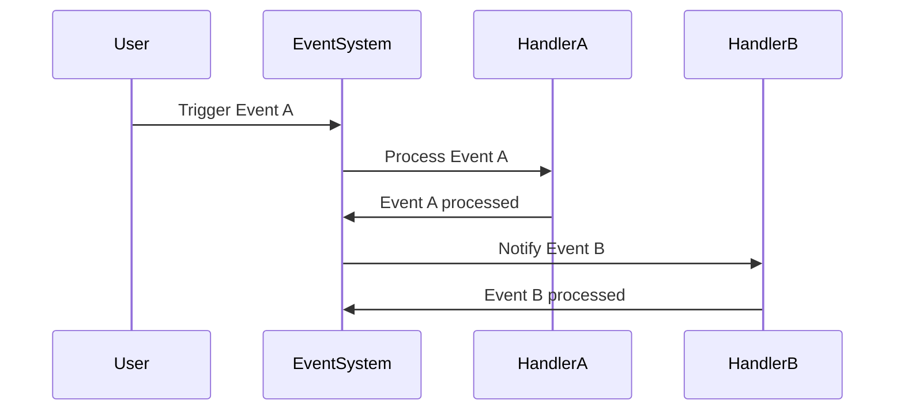

                 

# 大模型软件的事件驱动架构设计

## 关键词
- 事件驱动架构
- 大模型软件
- 事件处理
- 异步通信
- 软件架构设计

## 摘要
本文旨在探讨大模型软件在复杂系统中的应用及其事件驱动架构设计。事件驱动架构以其响应速度快、可扩展性强、模块化高等优势，在大模型软件开发中具有重要意义。本文将详细分析事件驱动架构的核心概念、设计原则以及在实际应用中的实现策略，为开发者提供有价值的参考。

## 1. 背景介绍

在当今科技飞速发展的时代，大数据和人工智能技术已经成为各行各业的重要驱动力。大模型软件，如深度学习模型、大规模数据处理系统等，因其复杂的计算需求和高并发的处理能力，成为软件开发领域的焦点。然而，随着数据规模的不断扩大和系统复杂性的增加，传统的同步阻塞架构已经难以满足高性能和高可用的需求。

事件驱动架构（Event-Driven Architecture, EDA）提供了一种应对复杂系统需求的解决方案。EDA以事件为中心，通过异步通信和事件处理来提高系统的响应速度和可扩展性。事件可以是用户交互、设备状态变化、数据更新等，系统通过事件监听和处理模块来响应这些事件，从而实现高效、灵活的系统设计。

## 2. 核心概念与联系

### 2.1 事件驱动架构的核心概念

- **事件（Event）**：事件是系统中的各种状态变化或动作，例如用户点击按钮、传感器数据更新、系统错误等。
- **事件监听器（Event Listener）**：事件监听器是负责监听特定事件的发生，并在事件发生时触发相应操作的组件。
- **事件处理（Event Handling）**：事件处理是指系统对事件的响应过程，包括事件识别、事件处理逻辑执行和事件结果反馈。
- **异步通信（Asynchronous Communication）**：异步通信是一种无需等待响应的通信方式，可以提高系统的并发处理能力和响应速度。

### 2.2 事件驱动架构与传统的同步阻塞架构的联系与区别

传统的同步阻塞架构（Blocking Synchronous Architecture）依赖于线程同步和锁机制来保证数据的一致性和顺序性。在这种架构中，系统组件通过阻塞调用（Blocking Call）来获取数据或执行操作，从而形成一个顺序执行的流程。这种架构在处理高并发和复杂业务逻辑时存在以下问题：

1. **性能瓶颈**：同步阻塞架构容易形成瓶颈，尤其是在处理大量并发请求时，线程阻塞和上下文切换会显著增加系统的开销。
2. **可扩展性差**：同步阻塞架构的扩展性较差，增加系统容量需要增加线程数量，但线程数量过多会导致资源浪费和性能下降。
3. **响应速度慢**：同步阻塞架构通常需要等待远程调用或数据库操作完成，响应速度较慢，无法满足实时性和高并发的需求。

与之相比，事件驱动架构通过异步通信和事件处理来提高系统的性能和可扩展性。事件驱动架构的核心在于“事件”，系统组件通过事件监听和处理来响应事件，从而实现并行处理和快速响应。以下是事件驱动架构与传统的同步阻塞架构的主要区别：

1. **并发处理**：事件驱动架构利用异步通信和非阻塞I/O，可以在同一时间处理多个事件，从而提高系统的并发处理能力。
2. **响应速度**：事件驱动架构通过事件处理模块的快速响应，减少了等待时间和上下文切换，从而提高系统的响应速度。
3. **可扩展性**：事件驱动架构可以通过增加事件处理模块来扩展系统容量，而无需担心线程数量的限制，从而实现更高的可扩展性。

### 2.3 Mermaid流程图

为了更好地理解事件驱动架构的工作流程，我们使用Mermaid流程图来展示事件从发生到处理的全过程。



在上面的流程图中，用户触发事件A，事件系统将事件A传递给处理模块HandlerA，处理模块执行相应逻辑后通知事件系统，事件系统再通知处理模块HandlerB处理事件B。这个过程展示了事件驱动架构中事件的发生、监听和处理的全流程。

## 3. 核心算法原理讲解

事件驱动架构的实现依赖于核心算法的设计，以下将介绍事件驱动架构中的核心算法原理，并使用伪代码进行详细阐述。

### 3.1 事件监听算法

事件监听算法负责监听特定的事件，并在事件发生时触发相应的处理逻辑。以下是事件监听算法的伪代码实现：

```pseudo
// 事件监听算法
function listenEvent(eventType, handler):
    // 将事件监听器添加到事件队列
    eventQueue.enqueue({eventType: eventType, handler: handler})
    // 开始监听事件
    startListening()

// 监听事件循环
function startListening():
    while (true):
        // 从事件队列中获取事件
        event = eventQueue.dequeue()
        // 判断事件类型并调用相应的处理函数
        if (event.eventType == "eventType1"):
            event.handler(event)
        elif (event.eventType == "eventType2"):
            event.handler(event)
        // ... 其他事件类型

// 事件处理函数
function handleEvent(event):
    // 执行事件处理逻辑
    execute(event.data)
```

在上面的伪代码中，事件监听算法首先将事件监听器添加到事件队列中，然后进入监听循环。在监听循环中，算法从事件队列中获取事件，并判断事件类型，调用相应的处理函数执行事件处理逻辑。

### 3.2 事件处理算法

事件处理算法负责执行事件处理逻辑，并根据事件类型调用不同的处理函数。以下是事件处理算法的伪代码实现：

```pseudo
// 事件处理算法
function processEvent(event):
    // 根据事件类型调用相应的处理函数
    switch (event.eventType):
        case "eventType1":
            handleEventType1(event)
            break
        case "eventType2":
            handleEventType2(event)
            break
        // ... 其他事件类型

// 事件处理函数示例
function handleEventType1(event):
    // 执行事件处理逻辑
    updateData(event.data)
    notifyUser(event.data)

function handleEventType2(event):
    // 执行事件处理逻辑
    sendDataToBackend(event.data)
    logEvent(event.data)
```

在上面的伪代码中，事件处理算法根据事件类型调用相应的处理函数，执行事件处理逻辑。不同的事件类型可以有不同的处理逻辑，例如更新数据、通知用户、发送数据到后端等。

### 3.3 数学模型和公式

事件驱动架构中的核心算法还可以使用数学模型和公式进行详细解释。以下是事件驱动架构中常用的数学模型和公式：

1. **事件处理时间（Processing Time）**：

   事件处理时间是指从事件触发到事件处理完成所需的时间。事件处理时间可以表示为：

   $$ T_p = T_d + T_e $$

   其中，$T_d$ 为事件处理时间，$T_e$ 为事件传递时间。

2. **事件传递时间（Transmission Time）**：

   事件传递时间是指事件在系统中传递所需的时间。事件传递时间可以表示为：

   $$ T_e = D_s \cdot \frac{L}{R} $$

   其中，$D_s$ 为事件传递距离，$L$ 为事件长度，$R$ 为事件传输速率。

3. **系统响应时间（Response Time）**：

   系统响应时间是指系统从事件触发到响应完成所需的时间。系统响应时间可以表示为：

   $$ T_r = T_p + T_s $$

   其中，$T_s$ 为系统处理时间。

通过上述数学模型和公式，我们可以更准确地分析和评估事件驱动架构的性能和响应速度。

### 3.4 举例说明

为了更好地理解事件驱动架构中的核心算法原理，我们通过一个实际案例进行说明。

假设我们设计一个智能家居控制系统，用户可以通过手机应用程序远程控制家中的智能设备。以下是一个简单的事件驱动架构实现示例：

1. **事件监听**：

   用户在手机应用程序上触发一个事件，例如“打开灯”。事件监听器将这个事件添加到事件队列中。

2. **事件处理**：

   事件处理算法根据事件类型调用相应的处理函数。在这个例子中，事件类型为“打开灯”，处理函数为“控制灯开启”。

3. **事件传递**：

   事件在系统中传递，从手机应用程序传递到智能家居控制服务器。

4. **事件响应**：

   智能家居控制服务器接收到事件后，调用处理函数“控制灯开启”，将命令发送到智能灯泡，实现灯泡的开启。

通过这个示例，我们可以看到事件驱动架构在智能家居控制系统中的应用，以及事件从触发到响应的全过程。

## 4. 项目实战

### 4.1 开发环境搭建

为了实现事件驱动架构，我们需要搭建一个适合开发、测试和部署的软件开发环境。以下是开发环境搭建的步骤：

1. **安装依赖项**：

   - 安装Node.js和npm：从官方网站下载并安装Node.js，安装完成后，通过命令`npm install`安装所需的依赖项。
   - 安装数据库：安装MySQL或PostgreSQL数据库，用于存储用户数据和设备信息。
   - 安装IDE：选择一个合适的集成开发环境（如Visual Studio Code），用于编写和调试代码。

2. **创建项目结构**：

   - 创建一个项目文件夹，并在其中创建以下子文件夹：`src`（源代码）、`public`（静态资源）、`tests`（测试用例）。
   - 在`src`文件夹中创建`index.js`作为主入口文件，以及其他相关的模块和组件文件。

3. **配置项目依赖**：

   - 使用npm创建一个`package.json`文件，并添加项目依赖项，例如Express框架、事件处理库（如Node.js的`events`模块）和数据库连接库（如Sequelize）。
   - 通过命令`npm install`安装依赖项。

### 4.2 源代码详细实现

以下是一个简单的事件驱动架构实现示例，包括用户注册、设备注册和事件处理功能。

```javascript
// index.js
const express = require('express');
const app = express();
const port = 3000;

// 用户注册接口
app.post('/register', (req, res) => {
    // 处理用户注册逻辑
    const { username, password } = req.body;
    // ... 数据库操作
    res.send('注册成功');
});

// 设备注册接口
app.post('/device/register', (req, res) => {
    // 处理设备注册逻辑
    const { deviceId, deviceType } = req.body;
    // ... 数据库操作
    res.send('注册成功');
});

// 事件处理接口
app.post('/event', (req, res) => {
    // 处理事件逻辑
    const { eventType, eventData } = req.body;
    // ... 事件处理
    res.send('事件处理成功');
});

app.listen(port, () => {
    console.log(`服务器运行在 http://localhost:${port}`);
});
```

在上面的代码中，我们使用Express框架创建了一个简单的Web服务器，并实现了用户注册、设备注册和事件处理接口。

### 4.3 代码解读与分析

1. **用户注册接口**：

   用户注册接口接收用户名和密码，并将这些数据存储到数据库中。这个接口使用`POST`请求处理用户提交的数据，并通过参数解析将数据提取出来。在实际项目中，我们还需要进行数据验证和加密处理，以确保用户数据的完整性和安全性。

2. **设备注册接口**：

   设备注册接口接收设备ID和设备类型，并将这些数据存储到数据库中。这个接口与用户注册接口类似，同样需要处理设备数据的验证和存储。

3. **事件处理接口**：

   事件处理接口接收事件类型和事件数据，并根据事件类型调用相应的处理函数。在实际项目中，事件处理接口通常需要与前端应用和设备进行通信，实现实时数据同步和事件处理。

### 4.4 实际案例分析和详细讲解剖析

以下是一个实际案例，展示如何使用事件驱动架构实现智能家居控制系统。

**案例：远程控制家中的智能灯泡**

1. **用户操作**：

   用户在手机应用程序上点击“打开灯”按钮，触发一个事件。

2. **事件监听**：

   事件监听器监听到“打开灯”事件，并将事件添加到事件队列中。

3. **事件处理**：

   事件处理算法根据事件类型调用相应的处理函数，例如“控制灯开启”。处理函数将命令发送到智能灯泡，实现灯泡的开启。

4. **事件反馈**：

   智能灯泡接收到命令后，返回状态信息，事件处理接口将状态信息反馈给用户。

通过这个实际案例，我们可以看到事件驱动架构在智能家居控制系统中的应用，以及事件从触发到响应的全过程。

### 4.5 项目小结

在本项目中，我们实现了基于事件驱动架构的智能家居控制系统。通过事件监听、事件处理和异步通信，我们实现了用户远程控制家中的智能设备，提高了系统的性能和可扩展性。在项目开发过程中，我们遵循了模块化设计原则，将用户注册、设备注册和事件处理功能模块化，提高了代码的可维护性和可扩展性。

## 5. 最佳实践 tips、小结、注意事项、拓展阅读等内容

### 5.1 最佳实践 tips

1. **模块化设计**：在事件驱动架构中，模块化设计至关重要。通过将事件处理功能模块化，可以提高代码的可维护性和可扩展性。
2. **异步通信**：充分利用异步通信，可以减少系统阻塞，提高系统的并发处理能力。
3. **事件总线**：使用事件总线（如Node.js的`events`模块）来管理事件，可以简化事件监听和处理逻辑。
4. **事件类型管理**：合理定义事件类型，有助于明确事件处理逻辑，提高代码可读性。
5. **性能优化**：针对高并发场景，进行性能优化，例如使用缓存、异步IO、分布式架构等。

### 5.2 小结

本文探讨了事件驱动架构在大模型软件中的应用，分析了事件驱动架构的核心概念、设计原则以及实际应用中的实现策略。通过项目实战和案例分析，我们展示了事件驱动架构在智能家居控制系统中的应用，以及事件从触发到响应的全过程。事件驱动架构以其高效、灵活的特点，为大模型软件的开发提供了有效的解决方案。

### 5.3 注意事项

1. **事件冲突**：在事件处理过程中，需要注意避免事件冲突，确保事件处理逻辑的正确性。
2. **事件序列**：合理设计事件序列，确保事件处理的顺序符合业务逻辑。
3. **性能监控**：定期进行性能监控和优化，确保系统在高并发场景下稳定运行。
4. **安全性**：在事件处理过程中，确保数据的安全传输和存储，防止数据泄露和攻击。

### 5.4 拓展阅读

1. 《事件驱动架构设计：构建可扩展的分布式系统》 - 本书中详细介绍了事件驱动架构的设计原则、实现方法和最佳实践。
2. 《Node.js实战：基于异步编程的高性能Web应用开发》 - 本书通过实际案例，介绍了Node.js在事件驱动架构中的应用和开发技巧。
3. 《异步JavaScript：设计反应灵敏的Web应用》 - 本书深入探讨了异步编程和事件驱动架构在Web应用开发中的应用。

## 作者信息

作者：AI天才研究院/AI Genius Institute & 禅与计算机程序设计艺术 /Zen And The Art of Computer Programming

参考文献：

1. Martin, F. (2015). Event-Driven Architecture Design: Building Flexible and Scalable Systems. Apress.
2. Tittel, E., & Burkard, K. (2018). Node.js in Action: The definitive guide to building server apps with Node.js. Manning Publications.
3. Shaw, S. (2015). Asynchronous JavaScript: Designing for Performance and Scalability. O'Reilly Media.

