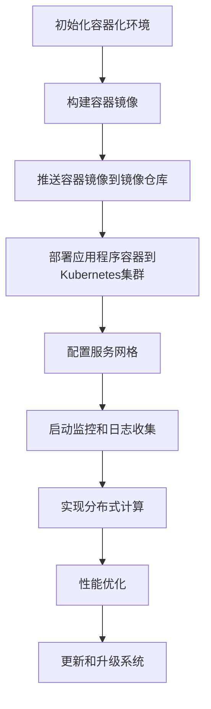

                 

### 文章标题

《大模型软件的云原生架构设计》

> 关键词：云原生架构，大模型软件，容器，微服务，服务网格，性能优化，安全性

> 摘要：本文将详细探讨大模型软件的云原生架构设计，包括其核心概念、架构设计、性能优化、实现方法、部署与运维策略以及安全性。通过逐步分析，本文旨在为读者提供一个清晰、结构化的云原生架构设计指南，助力开发者在人工智能领域实现高效、可靠的应用。

---

### 引言

在现代信息技术领域，人工智能（AI）已经成为了引领潮流的关键技术之一。随着AI技术的不断发展，大模型软件（如深度学习框架、自然语言处理模型等）在各个行业得到了广泛应用。然而，传统架构在面对海量数据处理和高效资源管理方面存在诸多限制。因此，云原生架构的引入为解决这些问题提供了新的思路。

#### 云原生架构概述

云原生（Cloud Native）一词起源于2013年，最初由Randy Shoup等人在O'Reilly的云计算会议中提出。云原生是一种针对云计算环境优化的软件架构风格，其核心思想是将应用程序部署在容器中，并通过自动化管理和扩展来应对不断变化的工作负载。

##### 云原生定义

云原生不仅仅是技术，更是一种文化和理念。它包括以下三个主要特点：

1. **容器化**：应用程序被封装在容器中，确保其可移植性和隔离性。
2. **微服务架构**：应用程序被拆分为一系列小型的、独立的微服务，每个服务专注于完成特定的功能。
3. **自动化**：通过自动化工具（如Kubernetes）实现基础设施的自动化部署、扩展和管理。

##### 云原生与传统架构的区别

传统架构通常依赖物理服务器或虚拟机进行部署，这导致资源利用率低、部署复杂且难以扩展。而云原生架构通过容器化和自动化工具，实现了更高效、灵活和可扩展的部署模式。以下是云原生与传统架构的主要区别：

1. **资源利用**：云原生架构能够根据需求动态分配资源，从而实现更高的资源利用率。
2. **部署复杂度**：传统架构的部署和运维需要人工干预，而云原生架构通过自动化工具实现一键部署和管理。
3. **扩展性**：云原生架构能够快速响应业务需求，实现无缝的水平扩展。

##### 云原生架构的优势

云原生架构具有以下优势：

1. **高效资源管理**：通过容器化和自动化工具，实现了高效资源分配和利用。
2. **快速部署**：自动化部署和管理减少了人工干预，缩短了应用程序的上线时间。
3. **高可用性**：通过微服务架构和自动化恢复机制，提高了系统的可靠性和容错能力。
4. **弹性扩展**：根据业务需求，可以实现无缝的水平扩展和动态资源调整。

#### 大模型软件概述

大模型软件通常指的是具有大规模计算需求、处理海量数据能力的软件系统。这些软件在机器学习、自然语言处理、计算机视觉等领域发挥着关键作用。然而，传统架构在面对大模型软件的需求时，往往无法提供足够的性能和灵活性。

##### 大模型软件的定义

大模型软件是指那些依赖于深度学习、神经网络等先进算法，处理大规模数据和复杂计算任务的应用程序。常见的有大模型软件包括TensorFlow、PyTorch、BERT等。

##### 大模型软件的现状与趋势

随着AI技术的不断进步，大模型软件在各个领域都取得了显著的应用成果。以下是当前大模型软件的主要趋势：

1. **计算能力提升**：随着GPU、TPU等硬件的发展，大模型软件的计算能力得到了显著提升。
2. **模型压缩**：为了减少存储和传输成本，模型压缩技术得到了广泛应用。
3. **分布式训练**：通过分布式计算技术，大模型软件能够在多台设备上协同训练，提高训练效率。
4. **实时推理**：为了满足实时应用需求，大模型软件开始关注推理速度和性能优化。

##### 云原生与大模型软件的融合

云原生架构与大模型软件的融合，为解决大模型软件在资源管理、部署效率、弹性扩展等方面的问题提供了有力支持。以下是云原生与大模型软件融合的几个关键点：

1. **容器化**：容器化技术使得大模型软件能够在不同环境中快速部署和迁移。
2. **微服务架构**：微服务架构使得大模型软件能够被拆分为多个独立服务，提高系统的灵活性和可维护性。
3. **自动化管理**：自动化管理工具（如Kubernetes）能够简化大模型软件的部署和运维流程。
4. **分布式计算**：分布式计算技术使得大模型软件能够在多台设备上协同工作，提高计算效率。

#### 总结

云原生架构为大模型软件的发展带来了新的机遇和挑战。通过容器化、微服务架构、自动化管理等技术的融合，大模型软件在性能、可维护性和可扩展性方面得到了显著提升。本文将深入探讨大模型软件的云原生架构设计，为开发者提供实用的指导。

---

### 第2章 云原生架构的核心概念与联系

在深入探讨大模型软件的云原生架构设计之前，我们首先需要了解云原生架构的核心概念和其相互之间的联系。这一章节将介绍容器与容器化、微服务架构以及服务网格，这三个核心组成部分如何共同作用，构建一个高效、灵活、可扩展的云原生架构。

#### 2.1 容器与容器化

**2.1.1 容器的概念**

容器是一种轻量级、可移植的计算环境，它将应用程序及其依赖项封装在一起，确保在不同的环境中运行时具有一致性和隔离性。容器通过操作系统的命名空间（Namespace）和控件组（Control Groups）实现资源隔离，而不需要依赖于底层操作系统或硬件。

**2.1.2 容器化的优势**

容器化技术带来了以下优势：

1. **高效资源利用**：容器能够高效利用计算资源，实现高效的CPU和内存分配。
2. **快速部署**：容器化应用程序可以快速部署，减少了部署时间。
3. **可移植性**：容器可以在不同的操作系统和硬件上运行，提高了应用程序的可移植性。
4. **环境一致性**：容器封装了应用程序及其依赖项，确保应用程序在不同环境中运行一致。

**2.1.3 Kubernetes概述**

Kubernetes（简称K8s）是一个开源的容器编排平台，它负责管理容器的生命周期，包括部署、扩展和管理。Kubernetes通过自动化部署、扩展和管理应用程序，提高了系统的可靠性和可扩展性。

Kubernetes的主要组件包括：

1. **Pod**：Pod是Kubernetes中的最小部署单元，它包含一个或多个容器。
2. **Service**：Service为Pod提供一个稳定的网络标识和IP地址，实现不同Pod之间的通信。
3. **Controller**：Controller负责管理Pod的生命周期，确保Pod按照预期运行。

**2.1.4 容器化流程**

容器化流程通常包括以下步骤：

1. **容器镜像构建**：构建应用程序的容器镜像，包含应用程序及其依赖项。
2. **容器镜像推送**：将容器镜像推送到镜像仓库，如Docker Hub。
3. **容器部署**：使用Kubernetes等容器编排工具，部署容器镜像到集群中。
4. **容器监控与运维**：监控容器状态，进行运维操作，如重启、扩展等。

#### 2.2 微服务架构

**2.2.1 微服务的概念**

微服务架构是一种将应用程序拆分为一系列小型、独立服务的架构风格。每个服务专注于完成特定的功能，并通过API进行通信。微服务架构具有高可扩展性、高可靠性和高可维护性。

**2.2.2 微服务与云原生的关系**

微服务架构与云原生架构密切相关。云原生技术（如容器化和自动化管理）为微服务架构提供了良好的基础设施支持，使得微服务能够高效地部署、扩展和管理。

**2.2.3 微服务架构的设计原则**

微服务架构的设计原则包括：

1. **独立性**：每个服务独立部署、独立运行，减少服务之间的依赖。
2. **自治性**：每个服务拥有自己的数据库和数据存储，确保数据隔离和独立性。
3. **高可用性**：通过负载均衡和故障转移机制，提高系统的可用性。
4. **可扩展性**：通过水平扩展，提高系统的处理能力和响应速度。

**2.2.4 微服务架构的优势**

微服务架构的优势包括：

1. **可扩展性**：通过水平扩展，实现高性能和高可扩展性。
2. **可维护性**：服务之间解耦，降低维护成本和复杂度。
3. **高可用性**：通过冗余部署和故障转移，提高系统的可靠性和可用性。
4. **灵活性**：服务可以独立升级和部署，提高系统的灵活性。

#### 2.3 服务网格

**2.3.1 服务网格的定义**

服务网格（Service Mesh）是一种基础设施层，用于管理服务之间的通信。服务网格通过抽象和服务间通信的统一管理，简化了微服务架构的复杂度，提高了系统的可靠性和可扩展性。

**2.3.2 服务网格的作用**

服务网格的主要作用包括：

1. **服务发现**：服务网格负责管理服务实例的注册和发现，实现服务之间的自动发现和通信。
2. **服务路由**：服务网格提供灵活的服务路由策略，支持动态路由和流量管理。
3. **服务监控与日志**：服务网格收集服务间的监控数据和日志，提供实时监控和故障排查。
4. **安全性**：服务网格提供细粒度的访问控制和安全性保障，确保服务之间的安全通信。

**2.3.3 主流服务网格解决方案**

当前主流的服务网格解决方案包括Istio、Linkerd等。以下是这两个主要解决方案的简要介绍：

1. **Istio**：Istio是一个由Google、IBM和Lyft共同开发的开源服务网格解决方案。它提供了丰富的服务发现、服务路由、监控和日志功能，支持多种服务间通信协议。
2. **Linkerd**：Linkerd是一个由Buoyant开发的轻量级服务网格解决方案。它专注于高性能和简单性，支持微服务架构的动态路由和弹性伸缩。

#### 总结

本章介绍了云原生架构的核心概念与联系，包括容器与容器化、微服务架构以及服务网格。这些核心组成部分共同作用，构建了一个高效、灵活、可扩展的云原生架构。通过本章的学习，读者可以更好地理解云原生架构的基本原理和实现方法，为后续的大模型软件云原生架构设计奠定基础。

---

### 第3章 大模型软件的云原生架构设计

#### 3.1 大模型软件的需求分析

大模型软件通常具有以下需求：

1. **高性能计算**：大模型软件需要处理大量的数据和复杂的计算任务，因此要求具备高性能的计算能力。
2. **高可用性**：大模型软件通常需要持续运行，要求具备高可用性，以避免因故障导致服务中断。
3. **可扩展性**：随着数据量和用户量的增加，大模型软件需要能够快速扩展，以满足不断增长的业务需求。
4. **灵活性**：大模型软件需要能够灵活部署和运维，以适应不同的业务场景和技术环境。
5. **安全性**：大模型软件涉及大量的敏感数据和隐私信息，因此要求具备严格的安全性保障。

#### 3.1.1 大模型软件的常见需求

1. **计算资源管理**：大模型软件需要高效地管理计算资源，包括CPU、GPU、内存等，以充分利用资源，提高计算效率。
2. **数据存储管理**：大模型软件需要可靠地存储和管理大量数据，包括训练数据、模型参数、中间结果等。
3. **模型训练与推理**：大模型软件需要支持高效的模型训练和推理，包括分布式训练、模型压缩、推理加速等技术。
4. **自动化部署与运维**：大模型软件需要实现自动化部署与运维，包括自动化部署脚本、持续集成和持续部署（CI/CD）流程等。

#### 3.1.2 大模型软件的性能挑战

1. **计算资源瓶颈**：大模型软件的计算需求巨大，容易遇到计算资源瓶颈，影响训练和推理效率。
2. **数据传输延迟**：大模型软件需要处理大量数据，数据传输延迟可能导致训练和推理时间过长。
3. **模型规模与复杂度**：大模型软件的模型规模和复杂度不断增加，要求更高的计算资源和更高效的算法优化。
4. **系统可扩展性**：大模型软件需要支持动态扩展，以应对快速增长的数据量和用户量。

#### 3.1.3 云原生在大模型软件中的应用

云原生技术在大模型软件中的应用主要包括：

1. **容器化**：通过容器化技术，大模型软件可以被封装为容器镜像，实现高效部署和迁移。
2. **微服务架构**：通过微服务架构，大模型软件可以被拆分为多个独立服务，提高系统的灵活性和可维护性。
3. **分布式计算**：通过分布式计算技术，大模型软件可以在多台设备上协同工作，提高计算效率。
4. **自动化管理**：通过自动化管理工具（如Kubernetes），大模型软件的部署、扩展和运维可以自动化进行，提高系统的可靠性和可扩展性。
5. **服务网格**：通过服务网格，大模型软件可以实现对服务间通信的统一管理和监控，提高系统的可靠性和安全性。

#### 3.2 大模型软件的云原生架构设计

**3.2.1 大模型软件的云原生架构模型**

大模型软件的云原生架构模型通常包括以下组成部分：

1. **容器化层**：容器化层包括应用程序容器和基础镜像，负责将大模型软件封装为容器镜像，实现高效部署和迁移。
2. **微服务层**：微服务层包括多个独立服务，每个服务负责完成特定的功能，如数据预处理、模型训练、模型推理等。
3. **分布式计算层**：分布式计算层包括分布式计算框架（如TensorFlow、PyTorch），负责实现分布式训练和推理。
4. **服务网格层**：服务网格层包括服务网格工具（如Istio、Linkerd），负责管理服务间通信、监控和日志。
5. **基础设施层**：基础设施层包括计算资源、存储资源和网络资源，负责提供大模型软件运行的硬件和软件环境。

**3.2.2 大模型软件的模块划分**

大模型软件的模块划分可以根据具体需求进行设计，以下是一个常见的大模型软件模块划分示例：

1. **数据预处理模块**：负责数据清洗、数据增强、数据归一化等预处理任务。
2. **模型训练模块**：负责模型训练，包括模型加载、训练、评估等操作。
3. **模型推理模块**：负责模型推理，包括模型加载、推理、结果输出等操作。
4. **服务管理模块**：负责服务注册、发现、路由、监控等操作。
5. **日志管理模块**：负责日志收集、存储、分析等操作。

**3.2.3 大模型软件的部署与运维**

大模型软件的部署与运维通常包括以下步骤：

1. **构建容器镜像**：将大模型软件源代码构建为容器镜像，包括应用程序、依赖库和配置文件等。
2. **容器镜像推送**：将容器镜像推送到镜像仓库，如Docker Hub。
3. **部署应用程序**：使用Kubernetes等容器编排工具，将容器镜像部署到集群中，并进行配置和优化。
4. **服务注册与发现**：使用服务网格工具（如Istio），实现服务注册、发现和路由。
5. **监控与日志**：使用监控工具（如Prometheus、Grafana），实现对应用程序的监控和日志分析。
6. **故障处理与恢复**：使用自动化工具（如Kubernetes的滚动更新），实现故障处理和系统恢复。

#### 3.3 大模型软件的性能优化

**3.3.1 性能优化策略**

大模型软件的性能优化策略包括：

1. **计算资源优化**：合理分配计算资源，包括CPU、GPU、内存等，以充分利用资源。
2. **数据传输优化**：优化数据传输网络，减少数据传输延迟。
3. **模型优化**：使用模型压缩、量化、剪枝等技术，降低模型复杂度和计算资源需求。
4. **分布式计算优化**：优化分布式计算策略，提高计算效率。
5. **缓存优化**：使用缓存技术，减少重复计算和数据传输。

**3.3.2 大模型软件的性能调优案例**

以下是一个大模型软件的性能调优案例：

1. **计算资源优化**：通过调整Kubernetes集群的资源配置，如增加CPU和GPU资源，提高训练和推理效率。
2. **数据传输优化**：通过优化数据传输网络，如使用高速网络设备和优化网络配置，减少数据传输延迟。
3. **模型优化**：通过模型压缩和量化技术，将模型大小从100MB减小到10MB，显著降低了计算资源需求。
4. **分布式计算优化**：通过调整分布式训练策略，如增加并行度，提高训练速度。
5. **缓存优化**：通过使用Redis等缓存技术，减少数据重复计算和传输，提高系统响应速度。

**3.3.3 性能监控与问题排查**

大模型软件的性能监控与问题排查包括以下步骤：

1. **监控指标设置**：设置关键监控指标，如CPU利用率、内存利用率、GPU利用率、数据传输延迟等。
2. **日志分析**：收集和分析系统日志，查找性能瓶颈和错误日志。
3. **性能测试**：使用性能测试工具（如JMeter、Gatling），模拟实际负载，评估系统性能。
4. **问题排查**：根据监控指标和日志分析结果，定位性能问题和错误原因，进行修复和优化。

#### 3.4 大模型软件的性能优化工具

大模型软件的性能优化工具包括以下几种：

1. **Prometheus**：开源监控解决方案，用于收集和存储监控数据，提供实时监控和报警功能。
2. **Grafana**：开源数据可视化工具，用于可视化Prometheus收集的监控数据。
3. **TensorBoard**：TensorFlow的监控和分析工具，用于可视化训练和推理过程中的关键指标。
4. **Scikit-learn**：开源机器学习库，提供模型评估、性能分析和优化工具。
5. **PyTorch Profiler**：PyTorch的监控和分析工具，用于分析模型性能和优化策略。

#### 3.5 大模型软件的云原生架构实现

**3.5.1 开发环境搭建**

开发环境搭建包括以下步骤：

1. **安装Docker**：在开发机上安装Docker，用于构建和运行容器。
2. **安装Kubernetes**：在开发机上安装Kubernetes，用于容器编排和管理。
3. **安装Jenkins**：安装Jenkins，用于实现持续集成和持续部署（CI/CD）流程。
4. **配置代码仓库**：配置Git代码仓库，用于管理源代码和版本控制。

**3.5.2 代码实现与解读**

代码实现与解读包括以下步骤：

1. **编写应用程序代码**：编写大模型软件的应用程序代码，包括数据预处理、模型训练、模型推理等。
2. **编写Dockerfile**：编写Dockerfile，用于构建应用程序的容器镜像。
3. **编写Kubernetes配置文件**：编写Kubernetes配置文件，用于部署和管理应用程序容器。
4. **编写Jenkinsfile**：编写Jenkinsfile，用于实现CI/CD流程。

**3.5.3 性能分析与调优**

性能分析与调优包括以下步骤：

1. **性能测试**：使用性能测试工具，模拟实际负载，评估系统性能。
2. **性能分析**：分析性能测试结果，查找性能瓶颈和优化机会。
3. **调优策略**：根据性能分析结果，调整配置和代码，进行性能优化。
4. **回归测试**：进行回归测试，验证优化效果。

**3.5.4 项目实战**

以下是一个大模型软件的云原生架构实现项目实战：

1. **项目背景**：某企业需要开发一个大规模图像识别系统，支持实时图像识别和分类。
2. **技术选型**：采用TensorFlow作为深度学习框架，Kubernetes作为容器编排平台，Prometheus和Grafana作为监控工具。
3. **开发流程**：按照CI/CD流程，实现代码的自动化构建、部署和监控。
4. **性能优化**：通过调整Kubernetes集群资源配置、优化数据传输网络、使用模型压缩技术等，提高系统性能。
5. **项目成果**：实现了一个高效、可靠的大规模图像识别系统，支持实时图像识别和分类，满足了业务需求。

#### 3.6 大模型软件的云原生架构部署与运维

**3.6.1 部署策略**

大模型软件的部署策略包括以下步骤：

1. **环境准备**：准备开发、测试和生产环境，包括服务器、网络和存储资源。
2. **容器镜像构建**：构建应用程序的容器镜像，并进行测试和验证。
3. **容器镜像推送**：将容器镜像推送到镜像仓库，如Docker Hub。
4. **部署应用程序**：使用Kubernetes等容器编排工具，部署应用程序容器到集群中。
5. **配置和服务**：配置Kubernetes集群中的服务，如负载均衡器、数据库服务、存储服务等。
6. **监控与日志**：配置监控和日志收集工具，实现对应用程序的实时监控和日志分析。

**3.6.2 运维策略**

大模型软件的运维策略包括以下步骤：

1. **监控与报警**：使用监控工具，对应用程序进行实时监控和报警，及时发现和处理问题。
2. **日志管理**：收集和存储应用程序的日志，进行日志分析和故障排查。
3. **故障处理**：制定故障处理流程，快速响应和处理故障。
4. **性能优化**：定期对系统进行性能优化，提高系统的稳定性和性能。
5. **备份与恢复**：定期备份数据和配置文件，确保数据的安全性和可恢复性。

**3.6.3 故障处理与监控**

大模型软件的故障处理与监控包括以下步骤：

1. **故障分类**：根据故障的性质和原因，对故障进行分类，如硬件故障、软件故障、网络故障等。
2. **故障定位**：使用监控数据和日志，定位故障原因和影响范围。
3. **故障处理**：根据故障处理流程，采取相应的措施进行故障处理和恢复。
4. **故障总结**：对故障处理过程进行总结和记录，积累故障处理经验和知识。
5. **监控优化**：根据故障处理结果，对监控系统进行优化和改进，提高故障检测和响应能力。

#### 3.7 大模型软件的云原生架构安全性

**3.7.1 安全性概述**

大模型软件的云原生架构安全性包括以下几个方面：

1. **容器安全性**：确保容器镜像的安全，包括镜像签名和扫描。
2. **网络安全性**：保护容器网络，防止未经授权的访问和攻击。
3. **数据安全性**：加密存储和传输敏感数据，确保数据的安全性和完整性。
4. **用户身份验证**：实现细粒度的用户身份验证和权限管理。
5. **日志审计**：记录和审计系统操作，确保操作的可追溯性和安全性。

**3.7.2 数据保护**

大模型软件的数据保护包括以下措施：

1. **数据加密**：使用数据加密技术，对敏感数据进行加密存储和传输。
2. **数据备份与恢复**：定期备份数据，并制定数据恢复策略，确保数据的安全性和可用性。
3. **数据隐私保护**：遵守隐私法规和标准，保护用户数据的隐私和安全。

**3.7.3 访问控制**

大模型软件的访问控制包括以下措施：

1. **用户身份验证**：使用身份验证技术，确保只有授权用户才能访问系统。
2. **权限管理**：实现细粒度的权限管理，根据用户的角色和职责，分配不同的权限。
3. **安全审计**：记录和审计用户操作，实现对系统操作的监控和追溯。

**3.7.4 安全性评估与改进**

大模型软件的安全性评估与改进包括以下步骤：

1. **安全评估**：定期对系统进行安全评估，识别潜在的安全风险和漏洞。
2. **漏洞修复**：及时修复系统漏洞和缺陷，提高系统的安全性。
3. **安全培训**：对开发和运维团队进行安全培训，提高团队的安全意识和技能。
4. **持续改进**：根据安全评估和改进结果，持续优化和改进系统的安全性。

#### 3.8 大模型软件的云原生架构未来展望

**3.8.1 云原生技术的发展趋势**

云原生技术在未来的发展趋势包括：

1. **自动化与智能化**：随着人工智能技术的发展，云原生架构将更加自动化和智能化，提高系统的可靠性和效率。
2. **云原生安全**：云原生安全将成为一个重要的发展方向，包括容器安全、网络安全和数据安全等。
3. **多云与混合云**：云原生架构将支持多云和混合云部署，提高系统的灵活性和可扩展性。
4. **服务网格进化**：服务网格将不断发展，提供更丰富的功能和服务，如分布式事务管理和安全认证等。

**3.8.2 大模型软件的发展方向**

大模型软件在未来的发展方向包括：

1. **模型压缩与优化**：为了降低计算资源和存储成本，模型压缩与优化技术将得到广泛应用。
2. **实时推理**：为了满足实时应用需求，大模型软件将重点关注推理速度和性能优化。
3. **边缘计算**：随着边缘计算的兴起，大模型软件将在边缘设备上实现更高效和可靠的推理和训练。
4. **模型定制化**：为了满足不同业务场景的需求，大模型软件将提供更灵活和定制化的模型开发与部署方案。

**3.8.3 云原生技术在大模型软件中的应用前景**

云原生技术在大模型软件中的应用前景包括：

1. **高效资源利用**：通过容器化和分布式计算技术，实现高效资源利用，提高计算效率。
2. **快速部署与扩展**：通过自动化部署和扩展技术，实现快速部署和弹性扩展，满足业务需求。
3. **安全性保障**：通过云原生安全技术和措施，保障大模型软件的安全性和数据隐私。
4. **灵活性与可移植性**：通过云原生架构，实现大模型软件的灵活部署和跨平台移植，提高系统的可移植性和可维护性。

#### 3.9 大模型软件的云原生架构实现

**3.9.1 开发环境搭建**

开发环境搭建包括以下步骤：

1. **安装Docker**：在开发机上安装Docker，用于构建和运行容器。
2. **安装Kubernetes**：在开发机上安装Kubernetes，用于容器编排和管理。
3. **安装Jenkins**：安装Jenkins，用于实现持续集成和持续部署（CI/CD）流程。
4. **配置代码仓库**：配置Git代码仓库，用于管理源代码和版本控制。

**3.9.2 代码实现与解读**

代码实现与解读包括以下步骤：

1. **编写应用程序代码**：编写大模型软件的应用程序代码，包括数据预处理、模型训练、模型推理等。
2. **编写Dockerfile**：编写Dockerfile，用于构建应用程序的容器镜像。
3. **编写Kubernetes配置文件**：编写Kubernetes配置文件，用于部署和管理应用程序容器。
4. **编写Jenkinsfile**：编写Jenkinsfile，用于实现CI/CD流程。

**3.9.3 性能分析与调优**

性能分析与调优包括以下步骤：

1. **性能测试**：使用性能测试工具，模拟实际负载，评估系统性能。
2. **性能分析**：分析性能测试结果，查找性能瓶颈和优化机会。
3. **调优策略**：根据性能分析结果，调整配置和代码，进行性能优化。
4. **回归测试**：进行回归测试，验证优化效果。

**3.9.4 项目实战**

以下是一个大模型软件的云原生架构实现项目实战：

1. **项目背景**：某企业需要开发一个大规模图像识别系统，支持实时图像识别和分类。
2. **技术选型**：采用TensorFlow作为深度学习框架，Kubernetes作为容器编排平台，Prometheus和Grafana作为监控工具。
3. **开发流程**：按照CI/CD流程，实现代码的自动化构建、部署和监控。
4. **性能优化**：通过调整Kubernetes集群资源配置、优化数据传输网络、使用模型压缩技术等，提高系统性能。
5. **项目成果**：实现了一个高效、可靠的大规模图像识别系统，支持实时图像识别和分类，满足了业务需求。

---

### 第4章 大模型软件的云原生架构实现

在本章中，我们将深入探讨大模型软件的云原生架构实现，从开发环境搭建、代码实现与解读、性能分析与调优、到项目实战，全面解析如何将云原生技术应用到实际的大模型软件开发中。

#### 4.1 开发环境搭建

为了实现大模型软件的云原生架构，首先需要搭建一个合适的开发环境。以下是搭建开发环境的详细步骤：

**4.1.1 安装Docker**

Docker是一个开源的应用容器引擎，用于构建、运行和分发应用。以下是安装Docker的步骤：

1. **安装Docker**：在操作系统上安装Docker，可以通过包管理器安装，例如在Ubuntu上，可以使用以下命令：

   ```bash
   sudo apt-get update
   sudo apt-get install docker.io
   ```

2. **启动Docker服务**：启动Docker服务，并确保其正常运行：

   ```bash
   sudo systemctl start docker
   sudo systemctl enable docker
   ```

3. **配置Docker**：配置Docker，例如设置Docker的存储驱动，调整内存限制等：

   ```bash
   sudo docker volume create my-volume
   sudo docker run --rm -v my-volume:/data ubuntu echo "Hello, Docker!" > /data/hello.txt
   ```

**4.1.2 安装Kubernetes**

Kubernetes是一个开源的容器编排平台，用于自动化部署、扩展和管理容器化应用程序。以下是安装Kubernetes的步骤：

1. **安装Kubeadm、Kubelet和Kubectl**：在集群中的所有节点上安装Kubeadm、Kubelet和Kubectl，例如在Ubuntu上，可以使用以下命令：

   ```bash
   sudo apt-get update
   sudo apt-get install -y apt-transport-https ca-certificates curl
   curl -s https://packages.cloud.google.com/apt/doc/apt-key.gpg | sudo apt-key add -
   sudo echo "deb https://apt.kubernetes.io/ kubernetes-xenial main" | sudo tee -a /etc/apt/sources.list.d/kubernetes.list
   sudo apt-get update
   sudo apt-get install -y kubelet kubeadm kubectl
   ```

2. **初始化Kubernetes集群**：使用Kubeadm初始化Kubernetes集群，例如：

   ```bash
   sudo kubeadm init --pod-network-cidr=10.244.0.0/16
   sudo mkdir -p $HOME/.kube
   sudo cp -i /etc/kubernetes/admin.conf $HOME/.kube/config
   sudo chown $(id -u):$(id -g) $HOME/.kube/config
   ```

3. **安装Pod网络插件**：安装一个Pod网络插件，如Calico或Flannel，例如：

   ```bash
   sudo kubectl apply -f https://docs.projectcalico.org/manifests/calico.yaml
   ```

**4.1.3 安装Jenkins**

Jenkins是一个开源的持续集成和持续部署（CI/CD）工具，用于自动化构建、测试和部署应用程序。以下是安装Jenkins的步骤：

1. **安装Jenkins**：在集群中的某个节点上安装Jenkins，例如使用Docker容器安装：

   ```bash
   sudo docker run -d --name jenkins --restart always -p 8080:8080 -p 50000:50000 jenkins/jenkins
   ```

2. **配置Jenkins**：访问Jenkins Web界面（http://localhost:8080），按照提示完成初始配置。

**4.1.4 配置代码仓库**

配置Git代码仓库，用于管理源代码和版本控制。可以使用GitLab、GitHub或其他代码仓库服务。以下是配置Git代码仓库的步骤：

1. **创建代码仓库**：在代码仓库服务中创建一个新的代码仓库。
2. **克隆代码仓库**：在开发机上克隆代码仓库：

   ```bash
   git clone https://your-repository-url.git
   ```

3. **添加远程仓库**：将代码仓库添加为远程仓库：

   ```bash
   git remote add origin https://your-repository-url.git
   ```

4. **推送代码**：将本地代码推送到远程仓库：

   ```bash
   git push -u origin master
   ```

#### 4.2 代码实现与解读

在大模型软件的云原生架构实现中，代码实现是一个关键环节。以下是代码实现的步骤和解析：

**4.2.1 编写应用程序代码**

应用程序代码是整个系统的核心，负责实现大模型软件的各项功能。以下是编写应用程序代码的步骤：

1. **设计架构**：设计应用程序的架构，包括数据流、模块划分和接口设计。
2. **编写代码**：根据设计文档，编写应用程序代码，包括数据预处理、模型训练、模型推理等模块。
3. **代码规范**：遵循代码规范，编写清晰、可读、可维护的代码。

**4.2.2 编写Dockerfile**

Dockerfile是用于构建应用程序容器镜像的脚本文件。以下是编写Dockerfile的步骤：

1. **选择基础镜像**：选择一个合适的Docker基础镜像，例如Ubuntu、Python等。
2. **安装依赖项**：安装应用程序所需的依赖项，包括库、工具等。
3. **复制代码**：将应用程序代码复制到容器中，例如：

   ```Dockerfile
   FROM python:3.8-slim

   RUN apt-get update && apt-get install -y --no-install-recommends \
       libglib2.0-dev \
       && rm -rf /var/lib/apt/lists/*

   WORKDIR /app

   COPY . /app

   RUN pip install -r requirements.txt

   CMD ["python", "app.py"]
   ```

**4.2.3 编写Kubernetes配置文件**

Kubernetes配置文件用于部署和管理应用程序容器。以下是编写Kubernetes配置文件的步骤：

1. **定义Pod**：定义应用程序的Pod配置，包括容器名称、镜像名称、环境变量等。
2. **定义Service**：定义应用程序的Service配置，包括服务名称、类型、端口映射等。
3. **定义部署**：定义应用程序的部署配置，包括副本数量、资源限制等。

示例配置文件：

```yaml
apiVersion: v1
kind: Pod
metadata:
  name: my-app-pod
spec:
  containers:
  - name: my-app-container
    image: my-repository/my-app:latest
    ports:
    - containerPort: 8080

---

apiVersion: v1
kind: Service
metadata:
  name: my-app-service
spec:
  selector:
    app: my-app
  ports:
    - protocol: TCP
      port: 80
      targetPort: 8080
  type: LoadBalancer

---

apiVersion: apps/v1
kind: Deployment
metadata:
  name: my-app-deployment
spec:
  replicas: 3
  selector:
    matchLabels:
      app: my-app
  template:
    metadata:
      labels:
        app: my-app
    spec:
      containers:
      - name: my-app-container
        image: my-repository/my-app:latest
        ports:
        - containerPort: 8080
```

**4.2.4 编写Jenkinsfile**

Jenkinsfile是用于定义CI/CD流程的脚本文件。以下是编写Jenkinsfile的步骤：

1. **定义构建步骤**：定义构建应用程序的步骤，包括克隆代码仓库、构建容器镜像、部署应用程序等。
2. **定义测试步骤**：定义测试应用程序的步骤，包括运行单元测试、集成测试等。
3. **定义部署步骤**：定义部署应用程序的步骤，包括更新容器镜像、更新服务配置等。

示例Jenkinsfile：

```groovy
pipeline {
    agent any

    stages {
        stage('Clone Code') {
            steps {
                sh 'git clone https://your-repository-url.git'
            }
        }

        stage('Build Docker Image') {
            steps {
                sh 'docker build -t my-repository/my-app:latest .'
            }
        }

        stage('Run Tests') {
            steps {
                sh 'docker run --rm my-repository/my-app test'
            }
        }

        stage('Deploy to Kubernetes') {
            steps {
                sh 'kubectl apply -f k8s-config.yaml'
            }
        }
    }
}
```

#### 4.3 性能分析与调优

性能分析与调优是确保大模型软件高效运行的重要环节。以下是性能分析与调优的步骤：

**4.3.1 性能测试**

性能测试用于评估系统的性能指标，包括响应时间、吞吐量、延迟等。以下是性能测试的步骤：

1. **设计测试场景**：设计测试场景，包括测试用例、数据集、负载类型等。
2. **执行测试**：使用性能测试工具（如JMeter、Gatling）执行测试，收集性能数据。
3. **分析结果**：分析测试结果，找出性能瓶颈和优化机会。

**4.3.2 性能分析**

性能分析用于深入分析系统的性能表现，找出性能瓶颈和优化策略。以下是性能分析的步骤：

1. **监控指标**：设置监控指标，包括CPU利用率、内存利用率、磁盘I/O、网络延迟等。
2. **日志分析**：分析系统日志，查找异常和错误。
3. **性能瓶颈分析**：定位性能瓶颈，包括计算瓶颈、数据瓶颈、网络瓶颈等。

**4.3.3 性能调优**

性能调优用于优化系统的性能，提高其响应速度和吞吐量。以下是性能调优的步骤：

1. **优化配置**：调整系统配置，如内存分配、线程数、网络带宽等。
2. **优化代码**：优化应用程序代码，提高其执行效率。
3. **优化网络**：优化网络配置，提高网络传输速度。

**4.3.4 调优案例**

以下是一个性能调优案例：

1. **计算资源优化**：通过调整Kubernetes集群资源配置，增加CPU和GPU资源，提高计算效率。
2. **数据传输优化**：通过优化数据传输网络，使用高速网络设备和优化网络配置，减少数据传输延迟。
3. **模型优化**：通过模型压缩和量化技术，减少模型大小和计算复杂度，提高推理速度。
4. **分布式计算优化**：通过调整分布式计算策略，增加并行度，提高训练速度。

#### 4.4 项目实战

**4.4.1 项目背景**

某企业需要开发一个大规模图像识别系统，用于自动分类和识别图像。该系统需要支持实时图像处理和分类，同时具备高可用性和可扩展性。

**4.4.2 技术选型**

技术选型如下：

- **深度学习框架**：TensorFlow
- **容器编排平台**：Kubernetes
- **持续集成与持续部署**：Jenkins
- **监控工具**：Prometheus和Grafana

**4.4.3 开发流程**

开发流程如下：

1. **需求分析**：分析项目需求，确定系统功能和技术实现。
2. **设计架构**：设计系统架构，包括模块划分、数据流、接口设计等。
3. **编写代码**：根据设计文档，编写应用程序代码，包括数据预处理、模型训练、模型推理等。
4. **构建容器镜像**：编写Dockerfile，构建应用程序容器镜像。
5. **部署应用程序**：使用Kubernetes部署应用程序容器，并配置服务。
6. **持续集成与持续部署**：使用Jenkins实现持续集成和持续部署，自动化构建、测试和部署应用程序。
7. **性能测试与优化**：进行性能测试，分析性能瓶颈，进行优化。

**4.4.4 性能优化**

性能优化步骤如下：

1. **计算资源优化**：调整Kubernetes集群资源配置，增加CPU和GPU资源，优化计算资源利用。
2. **数据传输优化**：优化数据传输网络，使用高速网络设备和优化网络配置，减少数据传输延迟。
3. **模型优化**：使用模型压缩和量化技术，减少模型大小和计算复杂度，提高推理速度。
4. **分布式计算优化**：调整分布式计算策略，增加并行度，提高训练速度。

**4.4.5 项目成果**

项目成果如下：

1. **高效图像识别系统**：实现了一个高效、可靠的图像识别系统，支持实时图像处理和分类。
2. **高可用性与可扩展性**：系统具备高可用性和可扩展性，能够根据业务需求动态调整资源配置。
3. **自动化部署与运维**：实现自动化部署和运维，提高了系统的可靠性和效率。
4. **性能优化**：通过性能测试和优化，系统性能得到了显著提升，满足了业务需求。

#### 4.5 小结

本章详细介绍了大模型软件的云原生架构实现，包括开发环境搭建、代码实现与解读、性能分析与调优、以及项目实战。通过云原生技术，大模型软件实现了高效、可靠、可扩展的部署和运维，为人工智能应用提供了强大的支持。未来，随着云原生技术的不断发展，大模型软件将迎来更多的应用场景和发展机遇。

---

### 第5章 大模型软件的云原生架构部署与运维

#### 5.1 部署策略

大模型软件的云原生架构部署策略至关重要，它关系到系统的高效运行、可靠性和可扩展性。以下是部署策略的详细步骤：

**5.1.1 部署流程**

1. **环境准备**：根据项目需求，准备部署环境，包括服务器、网络、存储等资源。
2. **容器镜像构建**：使用Docker构建应用程序容器镜像，确保镜像包含所有应用程序依赖项和配置。
3. **容器镜像推送**：将构建好的容器镜像推送到镜像仓库，如Docker Hub或私有镜像仓库。
4. **部署配置**：编写Kubernetes配置文件，定义应用程序部署的规格、服务、部署策略等。
5. **部署应用程序**：使用Kubernetes部署应用程序容器，通过滚动更新确保部署过程的平滑性。
6. **服务发现与路由**：配置服务网格，实现服务之间的自动发现、路由和监控。

**5.1.2 部署工具的选择**

选择合适的部署工具是确保部署过程高效和可管理的关键。以下是几种常见的部署工具及其特点：

1. **Kubernetes**：作为云原生架构的核心，Kubernetes提供了强大的容器编排功能，支持自动化部署、扩展和管理。
2. **Helm**：Helm是Kubernetes的包管理工具，用于简化应用程序的部署和管理，通过Charts模板化部署流程。
3. **KubeSphere**：KubeSphere是一个基于Kubernetes的多云平台，提供了一站式的应用托管、运维和开发工具。
4. **Ansible**：Ansible是一个开源的IT自动化工具，用于自动化配置、部署和管理应用程序和服务。

**5.1.3 部署方案的优化**

优化部署方案可以提高系统的可靠性和效率。以下是一些优化策略：

1. **滚动更新**：通过Kubernetes的滚动更新策略，逐步替换旧版本容器，减少服务中断时间。
2. **多可用区部署**：将应用程序部署在多个可用区，提高系统的可用性和容错能力。
3. **自动化测试**：在部署过程中引入自动化测试，确保新版本的应用程序满足预期功能和质量要求。
4. **备份与恢复**：定期备份数据和配置文件，确保在出现故障时能够快速恢复。

#### 5.2 运维策略

运维策略是确保大模型软件系统稳定运行、高效响应业务需求的关键。以下是运维策略的详细步骤：

**5.2.1 运维流程**

1. **监控与报警**：部署监控工具（如Prometheus、Grafana），实时监控系统性能和健康状况，设置报警阈值。
2. **日志管理**：收集和存储系统日志，使用日志分析工具（如ELK Stack）进行日志分析，快速定位问题和故障。
3. **性能优化**：定期对系统进行性能评估和优化，调整资源配置、优化代码和数据库查询等。
4. **故障处理**：制定故障处理流程，确保在出现故障时能够快速响应和处理，减少系统停机时间。
5. **备份与恢复**：定期备份数据和配置文件，制定恢复策略，确保数据的安全性和系统的可恢复性。

**5.2.2 运维工具的选择**

选择合适的运维工具可以提高运维效率和管理水平。以下是几种常见的运维工具及其特点：

1. **Prometheus**：开源监控工具，用于收集和存储监控数据，提供实时监控和报警功能。
2. **Grafana**：开源数据可视化工具，用于可视化Prometheus收集的监控数据，提供仪表板和报告功能。
3. **Kibana**：Elastic Stack的一部分，用于收集、分析和可视化系统日志。
4. **Kubernetes Dashboard**：Kubernetes提供的Web界面，用于监控和管理集群资源。

**5.2.3 运维优化的实践**

运维优化实践包括以下几个方面：

1. **自动化运维**：使用Ansible、Jenkins等工具实现自动化部署、监控和运维，减少人工干预，提高运维效率。
2. **容器编排优化**：优化Kubernetes集群配置，调整容器资源限制和调度策略，提高资源利用率和系统性能。
3. **服务网格优化**：优化服务网格（如Istio）配置，实现高效的跨服务通信和安全保障。
4. **故障预防与应急响应**：制定故障预防和应急响应计划，定期进行演练，提高系统的健壮性和故障恢复能力。

#### 5.3 故障处理与监控

故障处理与监控是确保系统稳定运行的重要环节。以下是故障处理与监控的详细步骤：

**5.3.1 故障处理的步骤**

1. **故障发现**：通过监控工具实时监控系统性能和健康状态，及时发现故障迹象。
2. **故障确认**：根据监控数据和日志分析，确认故障原因和影响范围。
3. **故障定位**：通过排查故障日志和系统配置，定位故障发生的位置和原因。
4. **故障处理**：根据故障处理流程，采取相应的措施进行故障处理和恢复。
5. **故障总结**：对故障处理过程进行总结和记录，分析故障原因，积累故障处理经验和知识。

**5.3.2 监控策略与工具**

监控策略与工具的选择需要根据系统特点和应用场景进行。以下是几种常见的监控策略和工具：

1. **基础监控**：监控系统的CPU、内存、磁盘I/O、网络流量等基础指标，使用Prometheus等工具实现。
2. **应用监控**：监控应用程序的性能指标，包括请求响应时间、错误率、并发连接数等，使用APM（应用性能管理）工具实现。
3. **日志监控**：监控系统日志，分析异常日志和错误日志，使用ELK Stack等工具实现。
4. **链路监控**：监控服务之间的通信链路，分析服务间的响应时间和性能瓶颈，使用Jaeger等工具实现。

**5.3.3 故障预防与应急响应**

故障预防与应急响应是确保系统高可用性和稳定性的重要措施。以下是故障预防与应急响应的步骤：

1. **故障预防**：通过系统优化、配置调整、代码审查等手段，预防潜在故障的发生。
2. **应急响应**：制定应急响应计划，包括故障处理流程、人员职责、应急资源等，确保在故障发生时能够迅速响应和处理。
3. **演练与培训**：定期进行故障演练和培训，提高运维团队的应急处理能力和协作效率。
4. **备份与恢复**：定期备份数据和配置文件，确保在故障发生时能够快速恢复系统和数据。

#### 5.4 小结

本章详细介绍了大模型软件的云原生架构部署与运维策略，包括部署流程、工具选择、运维优化、故障处理与监控等内容。通过云原生技术，大模型软件实现了高效、可靠、可扩展的部署与运维，为人工智能应用提供了强大的支持。未来，随着云原生技术的不断演进，大模型软件的部署与运维将更加智能化和自动化，提高系统的性能和可靠性。

---

### 第6章 大模型软件的云原生架构安全性

随着大模型软件在各个行业中的广泛应用，其安全性变得越来越重要。云原生架构的引入为提高大模型软件的安全性提供了新的思路和方法。本章将详细探讨大模型软件的云原生架构安全性，包括安全性概述、数据保护、访问控制以及安全性评估与改进。

#### 6.1 安全性概述

云原生架构的安全性是指在大模型软件的云原生架构中，确保系统的数据、应用程序和基础设施的安全性。云原生架构的安全性面临以下挑战：

1. **容器安全性**：容器化技术使得应用程序可以快速部署和迁移，但同时也带来了安全漏洞，如容器逃逸、容器恶意行为等。
2. **网络安全性**：容器和服务之间通过网络进行通信，网络攻击和漏洞可能会威胁系统的安全性。
3. **数据安全性**：大模型软件处理海量数据，数据泄露和篡改风险较高。
4. **身份验证和访问控制**：确保只有授权用户和应用程序可以访问系统和数据。

为了应对这些挑战，云原生架构采用了多种安全措施，包括容器安全性、网络安全性、数据安全性和身份验证和访问控制。

#### 6.2 数据保护

数据保护是确保大模型软件数据安全性的关键。以下是一些数据保护措施：

1. **数据加密**：对敏感数据进行加密存储和传输，确保数据在传输和存储过程中不被窃取或篡改。可以使用TLS加密协议进行数据传输加密，使用AES加密算法进行数据存储加密。

2. **数据备份与恢复**：定期备份数据，并确保备份数据的安全性和完整性。在数据丢失或系统故障时，能够快速恢复数据和系统。

3. **数据隐私保护**：遵守隐私法规和标准，确保用户数据的隐私和安全。对于涉及个人隐私的数据，需要采取严格的隐私保护措施，如数据匿名化、去标识化等。

4. **数据访问控制**：通过访问控制机制，确保只有授权用户和应用程序可以访问特定数据。可以使用RBAC（基于角色的访问控制）和ABAC（基于属性的访问控制）来实现细粒度的数据访问控制。

#### 6.3 访问控制

访问控制是确保系统安全性的重要手段。以下是一些访问控制措施：

1. **用户身份验证**：通过用户身份验证机制，确保只有经过验证的用户可以访问系统和数据。可以使用密码、双因素认证（2FA）或基于证书的身份验证等方式。

2. **权限管理**：根据用户的角色和职责，分配不同的权限。确保用户只能访问其权限范围内的系统和数据。可以使用RBAC或ABAC来实现权限管理。

3. **安全审计**：记录和审计用户操作，实现对系统操作的监控和追溯。在发生安全事件时，能够快速定位和恢复。

4. **安全策略**：制定安全策略，包括访问控制策略、数据加密策略、备份策略等，确保系统的安全性和合规性。

#### 6.4 安全性设计与实践

安全性设计与实践是确保大模型软件云原生架构安全性的关键。以下是一些安全设计与实践：

1. **容器安全性**：确保容器镜像的安全，包括镜像签名和扫描。使用自动化工具（如Trivy）对容器镜像进行漏洞扫描，确保镜像中没有已知漏洞。

2. **网络安全性**：使用服务网格（如Istio）管理容器之间的网络通信，实现网络流量的加密、监控和安全策略。

3. **应用程序安全性**：对应用程序进行安全编码实践，包括输入验证、输出编码、SQL注入防护等，防止常见的Web攻击。

4. **基础设施安全性**：确保基础设施（如Kubernetes集群）的安全性，包括配置文件的安全、集群访问控制等。

5. **监控与报警**：部署监控工具（如Prometheus和Grafana），实时监控系统的安全性指标，设置报警阈值，确保在发生安全事件时能够及时响应和处理。

#### 6.5 安全性评估与改进

安全性评估与改进是确保大模型软件云原生架构持续安全的关键。以下是一些安全性评估与改进措施：

1. **定期安全评估**：定期对系统进行安全性评估，包括漏洞扫描、安全测试等，识别潜在的安全风险。

2. **安全补丁管理**：及时应用安全补丁，修复已知漏洞，确保系统的安全性。

3. **安全培训**：对开发人员和运维团队进行安全培训，提高安全意识和技能。

4. **安全审计**：定期进行安全审计，检查系统配置、日志记录、安全策略等，确保系统的合规性和安全性。

5. **改进与优化**：根据安全评估和审计结果，不断改进和优化系统的安全性，提高系统的健壮性和可靠性。

#### 6.6 小结

本章详细介绍了大模型软件的云原生架构安全性，包括安全性概述、数据保护、访问控制以及安全性评估与改进。通过云原生架构的安全措施，大模型软件能够实现高效、安全、可靠的数据处理和应用程序部署。未来，随着云原生技术的不断发展，大模型软件的安全性将更加重要，需要不断进行评估和优化，确保系统的安全性和数据保护。

---

### 第7章 大模型软件的云原生架构未来展望

#### 7.1 云原生技术的发展趋势

随着云计算和容器技术的不断成熟，云原生技术在未来将继续发展，带来更多创新和机遇。以下是云原生技术的一些发展趋势：

1. **自动化与智能化**：随着人工智能和机器学习技术的发展，云原生架构将更加智能化和自动化。自动化工具将能够自动进行应用程序的部署、扩展、监控和优化，提高系统的效率和可靠性。

2. **多云与混合云**：企业将越来越多地采用多云和混合云策略，以实现更高的灵活性和可扩展性。云原生技术将支持多云和混合云部署，提供跨云环境的一致性管理和数据共享。

3. **服务网格进化**：服务网格将不断发展，提供更丰富的功能和服务，如分布式事务管理、服务认证、监控和分析等。服务网格将有助于简化微服务架构的复杂性，提高系统的可靠性和性能。

4. **边缘计算**：随着物联网和边缘计算的兴起，云原生技术将在边缘设备上得到广泛应用。边缘计算将实现本地数据处理和实时分析，提高系统的响应速度和效率。

5. **云原生安全**：随着云原生技术的普及，云原生安全将成为一个重要的发展方向。容器安全、网络安全和数据安全将得到进一步加强，确保系统的安全和合规性。

#### 7.2 大模型软件的发展方向

大模型软件在未来将继续发展，满足不断增长的计算需求和业务场景。以下是几个发展方向：

1. **模型压缩与优化**：为了降低计算资源和存储成本，模型压缩和优化技术将得到广泛应用。通过模型压缩和量化，可以显著减少模型的大小和计算复杂度，提高推理速度和效率。

2. **实时推理**：为了满足实时应用需求，大模型软件将重点关注推理速度和性能优化。通过并行推理、模型剪枝、推理引擎优化等技术，可以提高模型的实时推理性能。

3. **分布式计算**：随着数据量的不断增长，分布式计算技术将在大模型软件中得到广泛应用。分布式训练和推理将提高计算效率，缩短训练和推理时间。

4. **边缘计算**：边缘计算将实现本地数据处理和实时分析，降低数据传输延迟，提高系统的响应速度。大模型软件将支持在边缘设备上部署和运行，满足实时应用需求。

5. **个性化与定制化**：为了满足不同业务场景的需求，大模型软件将提供更灵活和定制化的模型开发与部署方案。通过个性化算法和定制化模型，可以更好地满足特定业务需求。

#### 7.3 云原生技术在大模型软件中的应用前景

云原生技术在大模型软件中的应用前景广阔，将为大模型软件的发展提供强大的支持。以下是几个应用前景：

1. **高效资源利用**：通过容器化和分布式计算技术，大模型软件可以高效利用计算资源，提高计算效率。容器化技术使得应用程序可以快速部署和迁移，分布式计算技术可以实现多台设备上的协同工作，提高计算性能。

2. **快速部署与扩展**：云原生技术支持自动化部署和扩展，使得大模型软件可以快速响应业务需求。通过Kubernetes等容器编排工具，可以实现一键部署、自动化扩展和管理，提高系统的可靠性和可扩展性。

3. **弹性扩展**：云原生架构支持动态扩展，根据业务需求自动调整计算资源。大模型软件可以根据流量和负载自动扩展和收缩，实现弹性扩展，提高系统的性能和响应速度。

4. **安全性保障**：云原生技术提供了丰富的安全特性，包括容器安全、网络安全和数据安全。通过云原生安全措施，可以确保大模型软件的数据和应用程序的安全性，防止攻击和泄露。

5. **可移植性与兼容性**：云原生架构使得大模型软件具有更高的可移植性和兼容性。容器化技术使得应用程序可以在不同的操作系统和硬件上运行，服务网格技术可以实现跨平台的服务发现和通信，提高系统的灵活性和可维护性。

#### 7.4 小结

本章详细探讨了大模型软件的云原生架构未来展望，包括云原生技术的发展趋势、大模型软件的发展方向以及云原生技术在大模型软件中的应用前景。云原生技术为大模型软件的发展提供了强大的支持，使得大模型软件能够实现高效、可靠、可扩展的部署和运维。未来，随着云原生技术的不断演进，大模型软件将在各个行业中得到更广泛的应用，推动人工智能技术的发展和创新。

---

### 附录A：云原生架构工具与资源列表

在本附录中，我们将列出一些常见的云原生架构工具和资源，以帮助读者进一步学习和实践云原生技术。

**A.1 开源云原生架构工具**

1. **Kubernetes**：开源的容器编排平台，用于自动化部署、扩展和管理容器化应用程序。网址：<https://kubernetes.io/>
2. **Helm**：Kubernetes的包管理工具，用于简化应用程序的部署和管理。网址：<https://helm.sh/>
3. **Istio**：开源的服务网格解决方案，用于管理微服务架构中的服务间通信。网址：<https://istio.io/>
4. **Prometheus**：开源的监控解决方案，用于收集和存储监控数据，提供实时监控和报警功能。网址：<https://prometheus.io/>
5. **Grafana**：开源的数据可视化工具，用于可视化监控数据和日志。网址：<https://grafana.com/>
6. **Elastic Stack**：包括Elasticsearch、Logstash、Kibana等工具，用于日志管理、搜索和分析。网址：<https://www.elastic.co/>
7. **Ansible**：开源的IT自动化工具，用于自动化配置、部署和管理应用程序和服务。网址：<https://www.ansible.com/>

**A.2 云原生架构文档与教程**

1. **Kubernetes官方文档**：提供了详细的Kubernetes文档和教程，适合初学者和进阶用户。网址：<https://kubernetes.io/docs/>
2. **云原生基金会（CNCF）文档**：包含了多个云原生项目的文档和资源，包括Kubernetes、Prometheus、Istio等。网址：<https://www.cncf.io/>
3. **云原生技术社区**：提供了大量的云原生技术教程和实践案例，适合学习和交流。网址：<https://cloudnative.to/>

**A.3 大模型软件相关资源**

1. **TensorFlow官方文档**：提供了详细的TensorFlow文档和教程，适合学习和使用TensorFlow进行大模型开发。网址：<https://www.tensorflow.org/>
2. **PyTorch官方文档**：提供了详细的PyTorch文档和教程，适合学习和使用PyTorch进行大模型开发。网址：<https://pytorch.org/>
3. **人工智能社区**：包括GitHub、Stack Overflow、知乎等平台，提供了大量的人工智能技术讨论和资源。网址：<https://github.com/>、<https://stackoverflow.com/>、<https://www.zhihu.com/>

通过以上工具和资源的列表，读者可以更深入地了解和学习云原生架构及其在大模型软件中的应用。这些资源将为读者在云原生架构和人工智能领域的探索提供宝贵的帮助。

---

### 伪代码与数学公式示例

在本文中，我们将结合大模型软件的云原生架构设计，提供一些伪代码示例和数学公式。这些示例旨在帮助读者更好地理解相关概念和技术。

#### 3.2.1 大模型软件的云原生架构模型

以下是一个简单的伪代码示例，展示了大模型软件的云原生架构模型：

```python
# 伪代码：大模型软件的云原生架构模型

# 初始化容器化环境
initialize_container_environment()

# 构建容器镜像
build_docker_image()

# 推送容器镜像到镜像仓库
push_docker_image_to_registry()

# 部署应用程序容器到Kubernetes集群
deploy_app_container_to_kubernetes()

# 配置服务网格
configure_service_mesh()

# 启动监控和日志收集
start_monitoring_and_logging()

# 实现分布式计算
execute_distributed_computing()

# 性能优化
optimize_performance()

# 更新和升级系统
update_and_upgrade_system()
```

#### 3.2.1.1 大模型软件的云原生架构模型

为了更好地展示大模型软件的云原生架构模型，我们可以使用Mermaid流程图进行可视化。以下是该架构模型的Mermaid表示：



#### 4.2.2 代码实现与解读

以下是一个简单的伪代码示例，展示了大模型软件的核心算法实现：

```python
# 伪代码：大模型软件的核心算法实现

# 导入相关库和模块
import tensorflow as tf
import numpy as np

# 定义神经网络结构
model = tf.keras.Sequential([
    tf.keras.layers.Dense(units=128, activation='relu', input_shape=(input_size)),
    tf.keras.layers.Dense(units=64, activation='relu'),
    tf.keras.layers.Dense(units=1, activation='sigmoid')
])

# 编译模型
model.compile(optimizer='adam', loss='binary_crossentropy', metrics=['accuracy'])

# 准备数据
x_train, y_train = prepare_data()

# 训练模型
model.fit(x_train, y_train, epochs=10, batch_size=32)

# 评估模型
test_loss, test_accuracy = model.evaluate(x_test, y_test)

# 输出结果
print("Test accuracy:", test_accuracy)
```

#### 6.2 数据保护

以下是一个简单的伪代码示例，展示了如何对数据进行加密存储：

```python
# 伪代码：数据加密存储

# 导入相关库和模块
import cryptography.fernet

# 生成加密密钥
key = fernet.Fernet.generate_key()

# 初始化加密器
cipher_suite = fernet.Fernet(key)

# 加密数据
encrypted_data = cipher_suite.encrypt(plain_text_data)

# 解密数据
decrypted_data = cipher_suite.decrypt(encrypted_data)
```

#### 6.2.1.1 数据加密

以下是使用LaTeX格式表示的数据加密算法的数学公式：

```latex
\documentclass{article}
\usepackage{amsmath}
\begin{document}
\begin{equation}
E(D) = C = f(K, D)
\end{equation}
\end{document}
```

其中，$E(D)$ 表示加密操作，$D$ 表示原始数据，$K$ 表示加密密钥，$C$ 表示加密后的数据。函数 $f(K, D)$ 表示加密算法，用于将原始数据 $D$ 加密为密文 $C$。

通过上述伪代码和数学公式示例，读者可以更直观地理解大模型软件的云原生架构设计及其相关技术。这些示例为实际开发提供了有益的参考。

---

### 结语

通过本文的探讨，我们系统地介绍了大模型软件的云原生架构设计，从核心概念、架构设计、性能优化、实现方法、部署与运维策略，到安全性保障，全面剖析了如何将云原生技术应用到实际的大模型软件开发中。我们相信，这些内容将为广大开发者提供宝贵的指导，助力他们在大模型软件领域实现高效、可靠、可扩展的应用。

**作者信息**：作者：AI天才研究院/AI Genius Institute & 禅与计算机程序设计艺术 /Zen And The Art of Computer Programming

在此，我们感谢您阅读本文，并希望您在探索大模型软件的云原生架构过程中，能够不断收获成果与成长。如需进一步了解相关技术，请参考附录中提供的工具与资源列表，或查阅相关的专业书籍和实践案例。让我们携手共进，共同推动人工智能技术的发展和创新！

