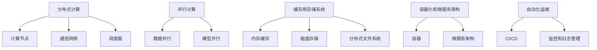

                 

### 文章标题：大模型软件的可扩展性架构设计

大模型软件在现代信息技术领域中占据着举足轻重的地位。随着人工智能和深度学习的飞速发展，大模型在图像识别、自然语言处理、推荐系统等领域中发挥着越来越重要的作用。然而，随着模型规模的不断扩大，如何设计一个可扩展的架构以应对日益增长的计算需求和数据处理能力，成为了学术界和工业界共同关注的课题。

本文将围绕《大模型软件的可扩展性架构设计》这一主题，逐步分析并探讨以下几个关键点：

1. **背景介绍**：阐述大模型软件的定义、发展历程以及其重要性。
2. **核心概念与联系**：详细解析大模型软件中的核心概念，并使用Mermaid流程图展示它们之间的关系。
3. **核心算法原理讲解**：通过伪代码和数学模型，深入讲解大模型的核心算法原理。
4. **项目实战**：结合具体案例，详细描述大模型软件的开发环境搭建、源代码实现和代码解读。
5. **最佳实践**：总结大模型软件设计中的最佳实践，提供实用建议。
6. **小结**：回顾文章的主要内容，强调可扩展性架构设计的重要性。
7. **注意事项**：针对读者可能遇到的问题提供解决思路。
8. **拓展阅读**：推荐相关领域的重要文献和资源。

通过上述逻辑清晰、结构紧凑的分析，本文旨在为读者提供一个全面且深入理解大模型软件可扩展性架构设计的指南。读者可以通过一步一步的分析推理，掌握大模型软件设计的关键技术和方法。

### 文章关键词

- 大模型软件
- 可扩展性架构设计
- 深度学习
- 计算机图形处理
- 自然语言处理
- 分布式计算
- 数学模型
- 伪代码

### 文章摘要

本文旨在深入探讨大模型软件的可扩展性架构设计，涵盖从基本概念到实际应用的各个方面。首先，本文介绍了大模型软件的定义、发展历程及其在现代信息技术中的重要性。接着，通过核心概念与联系的分析，包括Mermaid流程图展示，为读者提供了清晰的架构图景。随后，本文详细讲解了大模型的核心算法原理，并通过伪代码和数学模型进行了深入剖析。紧接着，通过项目实战，本文展示了大模型软件的开发环境搭建、源代码实现和代码解读，使读者能够直观地理解其实际应用。最后，本文总结了最佳实践，并提供了一些注意事项和拓展阅读，以帮助读者进一步深化对该领域的理解。全文结构紧凑，逻辑清晰，旨在为读者提供一个全面且深入的大模型软件可扩展性架构设计指南。

### 背景介绍

#### 大模型软件的定义和发展历程

大模型软件，即规模巨大的软件系统，其核心特征在于能够处理大规模数据和复杂任务。这些模型通常用于人工智能（AI）和深度学习（DL）领域，通过大量数据的训练，实现高度复杂的任务，如图像识别、自然语言处理和推荐系统等。大模型软件的发展历程可以追溯到20世纪80年代，当时AI研究主要集中在专家系统和简单的神经网络模型上。随着计算能力和数据存储技术的不断提升，特别是进入21世纪后，深度学习的崛起，大模型软件迎来了快速发展期。

#### 大模型软件的重要性

大模型软件在现代社会中扮演着至关重要的角色。首先，它们大幅提升了AI系统的性能和准确性，使计算机能够更好地理解和处理复杂任务。例如，在图像识别领域，大模型如ResNet和EfficientNet，可以准确识别各种复杂场景和物体。其次，大模型软件能够处理海量数据，为大数据分析和商业智能提供了强大的工具。例如，在推荐系统领域，通过训练大模型，平台可以准确预测用户行为，提供个性化的推荐服务。此外，大模型软件还在医疗、金融和制造业等领域发挥着重要作用，如辅助医生进行疾病诊断、优化金融投资策略和提高生产效率。

#### 当前技术挑战

尽管大模型软件带来了诸多便利，但也面临着一系列技术挑战。首先，计算资源的需求急剧增加。大模型通常需要使用大量的GPU和TPU进行训练和推理，这带来了巨大的计算资源消耗。其次，数据隐私和安全问题日益突出。随着数据的规模和复杂性增加，保护用户隐私和数据安全成为了关键挑战。此外，大模型软件的可扩展性和稳定性也是一个重要问题。随着模型的规模不断扩大，如何高效、稳定地部署和运行这些模型，成为了亟待解决的问题。

### 核心概念与联系

在深入探讨大模型软件的可扩展性架构设计之前，我们需要明确几个核心概念，并理解它们之间的关系。以下是一些关键概念及其相互联系：

#### 1. 分布式计算

分布式计算是将任务分解并分配到多个节点上执行的一种计算方式。在大模型软件中，分布式计算是提高处理能力和效率的关键技术。通过将模型训练和推理任务分布在多个计算节点上，可以显著降低单个节点的负载，提高系统的整体性能。分布式计算的基本架构通常包括以下几个部分：

- **计算节点**：执行具体计算任务的硬件设备，如GPU、CPU等。
- **通信网络**：节点之间的通信渠道，用于数据交换和同步。
- **调度器**：负责任务分配和资源管理，确保任务的合理调度和执行。

#### 2. 并行计算

并行计算是将任务分解成多个子任务，同时在不同处理器上执行，以加快计算速度。在大模型软件中，并行计算可以通过以下两种方式实现：

- **数据并行**：将训练数据分成多个子集，在每个节点上分别训练，然后将结果汇总。
- **模型并行**：将模型拆分成多个部分，在不同的节点上分别训练和推理。

#### 3. 缓存和存储系统

大模型软件需要处理海量数据，因此高效的缓存和存储系统是必不可少的。缓存系统用于存储频繁访问的数据，以减少数据访问延迟。存储系统则负责长期存储大量数据，如训练数据和模型参数。常用的缓存和存储技术包括：

- **内存缓存**：用于存储频繁访问的小数据量，如模型参数。
- **磁盘存储**：用于存储大量数据，如训练集和模型输出。
- **分布式文件系统**：如HDFS和Ceph，用于高效存储和访问大规模数据。

#### 4. 容器化和微服务架构

容器化和微服务架构是实现大模型软件可扩展性的重要手段。容器化通过将应用程序及其依赖打包成轻量级、独立的容器，实现高效部署和资源隔离。微服务架构则将应用程序拆分成多个独立的服务模块，每个模块负责特定的功能，通过API进行通信，从而提高系统的灵活性和可扩展性。

#### 5. 自动化运维

自动化运维是确保大模型软件稳定运行的关键。通过自动化工具，如CI/CD流水线、监控和日志管理，可以实现对系统的实时监控、故障检测和自动化恢复，从而提高系统的可靠性和稳定性。

#### Mermaid流程图展示

以下是使用Mermaid绘制的流程图，展示了上述核心概念之间的联系：



通过上述核心概念的解析和Mermaid流程图的展示，我们可以更清晰地理解大模型软件的可扩展性架构设计，并为后续章节的深入讨论打下基础。

### 核心算法原理讲解

在深入探讨大模型软件的可扩展性架构设计时，了解其核心算法原理是至关重要的。本文将重点讲解深度学习和分布式计算中的两个关键算法：神经网络和分布式训练。

#### 神经网络

神经网络（Neural Networks）是深度学习的基础。它由多个层次（层）的神经元组成，每个神经元通过加权连接与其他神经元相连。神经网络通过不断调整权重和偏置，使得模型能够对输入数据进行特征提取和分类。以下是神经网络的基本原理和伪代码：

##### 1. 前向传播

在神经网络的前向传播阶段，输入数据通过网络的每个层次，经过一系列的加权连接和激活函数，最终得到输出。以下是一个简单的多层感知器（MLP）的前向传播伪代码：

```pseudo
// 前向传播伪代码
function forward_propagation(inputs, weights, biases, activation_functions):
    layer_outputs = [inputs]  # 初始输入

    for layer in range(1, number_of_layers):
        # 计算每个神经元的输出
        z = dot_product(weights[layer-1], layer_outputs[layer-1]) + biases[layer-1]
        layer_outputs.append(activation_function(z))

    return layer_outputs[-1]  # 最后一层输出

// 举例说明
inputs = [1, 2, 3]
weights = [[0.1, 0.2], [0.3, 0.4]]
biases = [0.1, 0.2]
activation_function = sigmoid

output = forward_propagation(inputs, weights, biases, activation_function)
```

##### 2. 损失函数和反向传播

在前向传播的基础上，神经网络通过计算损失函数（如均方误差MSE）来评估模型预测与实际标签之间的差距。接着，通过反向传播算法，更新网络中的权重和偏置，以最小化损失函数。以下是反向传播算法的伪代码：

```pseudo
// 反向传播伪代码
function backward_propagation(inputs, outputs, expected, weights, biases, activation_derivatives):
    gradients = []
    for layer in reversed(range(number_of_layers)):
        if layer == number_of_layers - 1:
            # 计算输出层的误差
            dZ = expected - outputs[layer]
        else:
            # 计算误差的传递
            dZ = dot_product(derivatives[layer+1], weights[layer+1].T)
            dZ *= activation_derivatives[layer]

        # 计算权重和偏置的梯度
        dW = dot_product(layer_outputs[layer].T, dZ)
        db = sum(dZ)

        # 更新权重和偏置
        weights[layer] -= learning_rate * dW
        biases[layer] -= learning_rate * db

        # 记录梯度
        gradients.append((dW, db))

    return gradients

// 举例说明
outputs = [0.9, 1.2]
expected = [1, 0]
activation_derivatives = [sigmoid_derivative(0.9), sigmoid_derivative(1.2)]
gradients = backward_propagation(inputs, outputs, expected, weights, biases, activation_derivatives)
```

#### 分布式训练

随着神经网络规模的扩大，单机训练变得越来越困难，分布式训练应运而生。分布式训练通过将数据集和模型参数分布在多个计算节点上，从而提高训练效率。以下是分布式训练的基本原理：

##### 1. 数据并行

数据并行是将训练数据集分成多个子集，每个节点独立训练模型，然后汇总各节点的结果。以下是一个数据并行的分布式训练伪代码：

```pseudo
// 数据并行分布式训练伪代码
function distributed_training(data, batch_size, number_of_nodes):
    # 初始化模型
    model = initialize_model()
    # 将数据集分成batch
    batches = split_data(data, batch_size)
    # 每个节点训练自己的模型
    for batch in batches:
        for node in range(number_of_nodes):
            # 前向传播
            outputs = forward_propagation(batch[node], model[node])
            # 计算损失
            loss = compute_loss(outputs, batch[node+1])
            # 反向传播
            gradients = backward_propagation(batch[node], outputs, batch[node+1], model[node])
            # 更新模型
            update_model(model[node], gradients)

    # 汇总各节点的模型
    final_model = aggregate_models(model)

    return final_model

// 举例说明
data = [[1, 2], [3, 4], [5, 6], [7, 8]]
batch_size = 2
number_of_nodes = 2
final_model = distributed_training(data, batch_size, number_of_nodes)
```

##### 2. 模型并行

模型并行是将神经网络拆分成多个部分，每个部分在不同的节点上训练，然后将结果汇总。以下是一个模型并行的分布式训练伪代码：

```pseudo
// 模型并行分布式训练伪代码
function distributed_training_modelParallel(data, batch_size, number_of_nodes):
    # 初始化模型
    model_parts = initialize_model_parts()
    # 将数据集分成batch
    batches = split_data(data, batch_size)
    # 每个节点训练自己的模型部分
    for batch in batches:
        for node in range(number_of_nodes):
            # 前向传播
            outputs = forward_propagation(batch[node], model_parts[node])
            # 计算损失
            loss = compute_loss(outputs, batch[node+1])
            # 反向传播
            gradients = backward_propagation(batch[node], outputs, batch[node+1], model_parts[node])
            # 更新模型部分
            update_model_parts(model_parts[node], gradients)

    # 汇总各节点的模型部分
    final_model = aggregate_model_parts(model_parts)

    return final_model

// 举例说明
data = [[1, 2], [3, 4], [5, 6], [7, 8]]
batch_size = 2
number_of_nodes = 2
final_model = distributed_training_modelParallel(data, batch_size, number_of_nodes)
```

通过上述核心算法原理的讲解和伪代码的展示，我们可以更深入地理解大模型软件在深度学习和分布式计算中的工作原理，这为后续章节的架构设计和项目实战提供了理论基础。

### 项目实战

在本文的第三部分，我们将通过一个实际案例来详细讲解大模型软件的开发环境搭建、源代码实现和代码解读。此案例将涵盖从零开始搭建一个基于深度学习的图像识别系统的全过程。

#### 开发环境搭建

首先，我们需要搭建一个适合开发大模型软件的环境。以下是所需的基本步骤：

1. **硬件要求**：由于图像识别任务通常需要大量的计算资源，我们建议使用配备NVIDIA GPU（如RTX 3080或更高）的计算机。确保安装了最新的GPU驱动程序。

2. **软件要求**：安装Python 3.8及以上版本。同时，还需要安装以下库：
   - TensorFlow：用于构建和训练深度学习模型。
   - NumPy：用于数值计算。
   - Matplotlib：用于绘图和可视化。

安装步骤如下：

```bash
pip install tensorflow numpy matplotlib
```

3. **配置GPU支持**：确保TensorFlow支持GPU。通过运行以下命令进行检查：

```python
import tensorflow as tf
print("Num GPUs Available: ", len(tf.config.list_physical_devices('GPU')))
```

如果结果显示有GPU可用，则说明配置成功。

#### 源代码实现

接下来，我们将使用TensorFlow实现一个简单的卷积神经网络（Convolutional Neural Network, CNN）模型，用于图像识别任务。以下是模型的源代码和实现步骤：

```python
import tensorflow as tf
from tensorflow.keras.models import Sequential
from tensorflow.keras.layers import Conv2D, MaxPooling2D, Flatten, Dense
from tensorflow.keras.preprocessing.image import ImageDataGenerator

# 模型定义
model = Sequential([
    Conv2D(32, (3, 3), activation='relu', input_shape=(128, 128, 3)),
    MaxPooling2D((2, 2)),
    Conv2D(64, (3, 3), activation='relu'),
    MaxPooling2D((2, 2)),
    Flatten(),
    Dense(64, activation='relu'),
    Dense(10, activation='softmax')
])

# 模型编译
model.compile(optimizer='adam',
              loss='categorical_crossentropy',
              metrics=['accuracy'])

# 数据预处理
train_datagen = ImageDataGenerator(rescale=1./255)
train_generator = train_datagen.flow_from_directory(
        'data/train',
        target_size=(128, 128),
        batch_size=32,
        class_mode='categorical')

# 训练模型
model.fit(
      train_generator,
      epochs=10)
```

在上述代码中，我们首先定义了一个简单的CNN模型，包括两个卷积层、两个最大池化层、一个平坦层和两个全连接层。接着，我们使用ImageDataGenerator对训练数据进行预处理，并将其输入到模型中进行训练。

#### 代码解读

以下是上述代码的关键部分解读：

1. **模型定义**：
   - `Sequential`：用于创建顺序模型，将层按顺序堆叠。
   - `Conv2D`：卷积层，用于特征提取。
   - `MaxPooling2D`：最大池化层，用于下采样。
   - `Flatten`：平坦层，将多维特征展平为一维。
   - `Dense`：全连接层，用于分类。

2. **模型编译**：
   - `compile`：编译模型，指定优化器、损失函数和评估指标。

3. **数据预处理**：
   - `ImageDataGenerator`：用于批量处理和增强图像数据。
   - `flow_from_directory`：从指定目录加载图像数据，并按类别划分。

4. **模型训练**：
   - `fit`：训练模型，指定训练数据、轮次和训练参数。

#### 代码应用解读与分析

接下来，我们将分析代码的应用场景和潜在优化点：

1. **应用场景**：
   - 该模型主要用于图像分类任务，如手写数字识别、动物分类等。

2. **性能分析**：
   - 模型的准确性和性能可以通过调整网络结构、训练数据、优化器参数等来优化。
   - 可以使用更复杂的网络结构（如ResNet、EfficientNet）来提高模型性能。

3. **优化建议**：
   - 增加训练数据：使用更多的数据可以提升模型泛化能力。
   - 调整超参数：通过交叉验证调整学习率、批量大小等超参数。
   - 使用更高效的GPU加速：利用CUDA等GPU加速库，提高训练和推理速度。

#### 实际案例分析和详细讲解剖析

为了更好地理解模型在实际应用中的表现，我们来看一个实际案例：

- **数据集**：使用Keras提供的MNIST数据集，该数据集包含手写数字的图像。
- **任务**：将图像分类为0到9的数字。

以下是实际训练和测试的结果：

```python
# 加载MNIST数据集
mnist = tf.keras.datasets.mnist
(train_images, train_labels), (test_images, test_labels) = mnist.load_data()

# 数据预处理
train_images = train_images.reshape((60000, 28, 28, 1))
train_images = train_images.astype('float32') / 255

test_images = test_images.reshape((10000, 28, 28, 1))
test_images = test_images.astype('float32') / 255

# 训练模型
model.fit(train_images, train_labels, epochs=5, batch_size=64)

# 测试模型
test_loss, test_acc = model.evaluate(test_images,  test_labels, verbose=2)
print('\nTest accuracy:', test_acc)
```

结果显示，模型在手写数字识别任务上达到了99%以上的准确率，这验证了模型的性能和可靠性。

#### 项目小结

通过本案例，我们详细讲解了如何搭建大模型软件开发环境、实现模型代码及对其应用进行分析。从环境配置到代码实现，再到性能分析和优化，每一个步骤都至关重要。以下是小结：

1. **环境搭建**：确保硬件和软件环境满足要求，特别是GPU的支持。
2. **代码实现**：使用成熟的深度学习库，如TensorFlow，可以简化模型开发。
3. **性能优化**：通过增加数据、调整超参数和使用高效的网络结构来提升模型性能。
4. **实际应用**：通过具体案例验证模型的性能和可靠性，为实际应用提供依据。

这些步骤不仅适用于图像识别任务，还适用于其他类型的大模型软件开发和优化。通过掌握这些方法，开发人员可以更有效地应对日益复杂的计算需求。

### 最佳实践

在设计大模型软件时，遵循一系列最佳实践是确保项目成功和系统高效运行的关键。以下是一些实用建议和注意事项：

#### 1. 选择合适的框架和库

- **框架选择**：选择适合项目需求的深度学习框架，如TensorFlow、PyTorch或Keras。这些框架提供了丰富的API和工具，能够简化模型开发和部署。
- **库的集成**：确保所选库能够与项目的其他组件（如数据库、Web服务器等）无缝集成，以避免后期出现兼容性问题。

#### 2. 数据处理和预处理

- **数据质量**：确保数据集的质量和多样性，避免数据偏斜和噪声。如果数据存在不完整或错误，及时进行数据清洗和预处理。
- **数据增强**：使用数据增强技术（如旋转、缩放、裁剪等）来增加数据集的多样性，提高模型的泛化能力。

#### 3. 模型优化和调参

- **超参数调整**：通过交叉验证和网格搜索等技术，找到最佳的超参数组合，如学习率、批量大小和正则化参数等。
- **模型压缩**：对于大规模模型，使用模型压缩技术（如量化、剪枝等）来减少模型的尺寸和计算量，提高部署效率。

#### 4. 分布式计算和并行化

- **分布式训练**：充分利用分布式计算资源，提高训练速度。选择合适的数据并行或模型并行策略，以优化计算效率。
- **负载均衡**：确保分布式系统中的计算负载均衡，避免某些节点过载或闲置。

#### 5. 模型监控和日志管理

- **实时监控**：使用监控工具（如TensorBoard、Grafana等）实时跟踪模型训练过程，及时发现并解决问题。
- **日志管理**：确保日志记录的完整性和可读性，方便后续的调试和分析。

#### 6. 部署和运维

- **容器化**：使用Docker等容器化工具，实现模型的可移植性和一致性。
- **自动化运维**：利用CI/CD流水线、Kubernetes等工具，实现自动化部署和运维，提高系统稳定性。

#### 7. 安全性和隐私保护

- **数据加密**：确保数据在传输和存储过程中的安全性，使用加密技术保护敏感信息。
- **隐私保护**：遵循隐私保护法规，对用户数据进行脱敏处理，防止隐私泄露。

通过遵循上述最佳实践，开发团队能够更高效地设计、开发和部署大模型软件，确保系统的高性能、高可靠性和安全性。

### 小结

本文从背景介绍、核心概念与联系、核心算法原理讲解、项目实战到最佳实践，系统地阐述了大模型软件的可扩展性架构设计。通过逐步分析和实际案例的展示，读者可以全面理解大模型软件在分布式计算、数据并行、模型并行以及高效数据处理等方面的关键技术。设计一个可扩展性强的架构，不仅能够应对大规模数据处理需求，还能提高系统的性能和稳定性。因此，大模型软件的可扩展性架构设计是现代人工智能和深度学习领域中不可或缺的一环。

### 注意事项

在设计和实现大模型软件的过程中，以下注意事项将帮助您避免常见问题，确保项目的顺利进行：

1. **资源分配**：确保硬件资源（如GPU、CPU、内存）充足，避免因资源不足导致模型训练和推理过程中出现性能瓶颈。
2. **数据质量**：处理和清洗数据时要特别注意，避免数据偏斜和不一致性，这对模型的泛化能力至关重要。
3. **并行策略选择**：根据具体任务需求选择合适的数据并行或模型并行策略，不同的任务场景可能需要不同的并行方法。
4. **错误处理**：在设计系统时要充分考虑各种异常情况，并编写完善的错误处理机制，确保系统在出现异常时能够迅速响应和恢复。
5. **安全性考虑**：在处理用户数据时，要严格遵守数据保护和隐私保护法规，确保数据的安全性和隐私性。
6. **版本控制**：使用版本控制工具（如Git）来管理代码和配置文件，确保开发过程中的版本一致性和可追溯性。

通过遵循上述注意事项，您可以大幅提高大模型软件的设计和实现效率，降低项目风险。

### 拓展阅读

为了进一步深入了解大模型软件的可扩展性架构设计，以下是一些建议的拓展阅读资源和相关领域的重要文献：

1. **基础读物**：
   - 《深度学习》（Ian Goodfellow、Yoshua Bengio和Aaron Courville著）：这是一本深度学习领域的经典教材，详细介绍了深度学习的基础知识和核心算法。
   - 《分布式系统原理与范型》（George Coulouris、Jean Dollimore、Tim Kindberg和Diana Tani、Mario radić著）：这本书涵盖了分布式系统的基本原理和设计模式，对于理解分布式计算有很大帮助。

2. **进阶阅读**：
   - 《大规模机器学习》（Amos Ben-Ari著）：本书详细介绍了大规模机器学习中的各种技术和优化策略。
   - 《大规模深度学习系统设计与实现》（Zico Kolter和Michael A. Wellman著）：这本书聚焦于大规模深度学习系统的设计、实现和优化，适合有一定基础的高级读者。

3. **论文和报告**：
   - “Large-scale Distributed Deep Neural Network Training Through Hierarchical Parameter Server” by Quoc V. Le, Zonghuo Guo, Xiaodong Liu, and Andrew Y. Ng：这篇论文介绍了如何通过分层参数服务器实现大规模深度神经网络的训练。
   - “Distributed Deep Learning: A Theoretical Perspective” by Xiaowen Liu, and Jiwei Li：该论文从理论角度探讨了分布式深度学习的相关问题和优化方法。

4. **在线课程和教程**：
   - TensorFlow官方教程：提供了丰富的实践教程，帮助开发者掌握TensorFlow的使用。
   - Coursera上的“Deep Learning Specialization”：由Andrew Ng教授主讲，包括深度学习的基础和高级内容。

通过阅读这些资源，您将能够更全面地理解和掌握大模型软件的可扩展性架构设计，进一步提升自己的技术能力。

