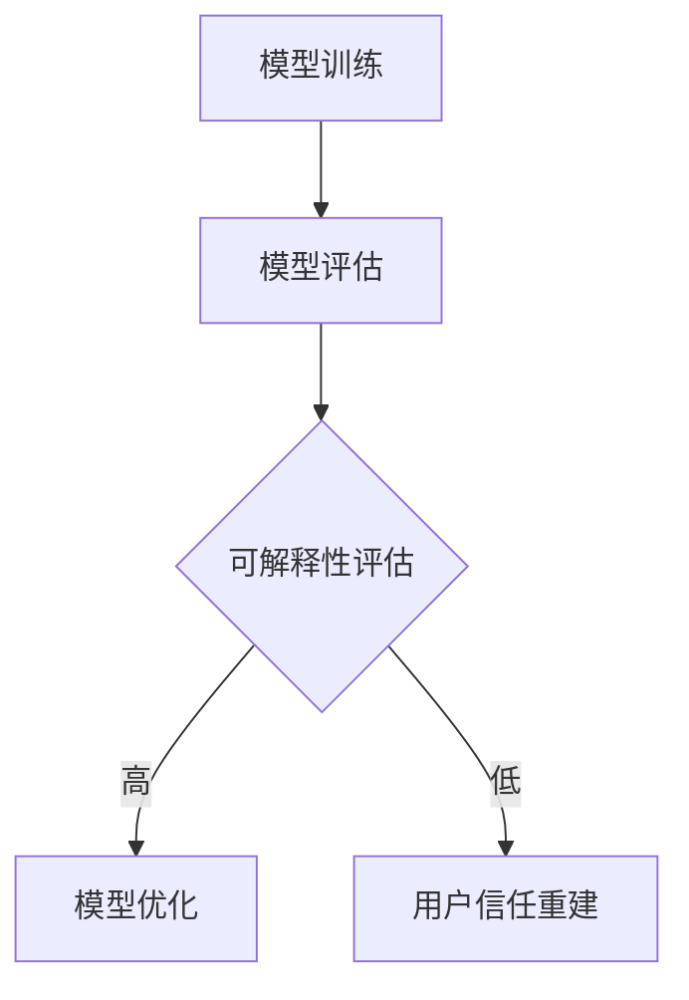

                 


### 摘要

大模型软件的可解释性与透明度设计是当前人工智能领域的重要研究方向，旨在提高用户对模型的信任度和理解能力，同时满足法律合规和伦理要求。本文首先介绍了大模型的发展现状和可解释性与透明度的需求，随后阐述了可解释性与透明度的核心概念及其关系。接着，本文提出了大模型软件可解释性与透明度设计的原则和方法，包括用户中心设计、平衡可解释性与性能、数据隐私保护等。随后，本文详细讨论了可解释性设计方法，如模型简化、可视化技术和对比分析等。此外，本文还介绍了透明度设计方法，如模型结构简化、算法透明度提升和透明度增强工具等。最后，本文通过实际应用案例展示了可解释性与透明度设计在金融和医疗健康等领域的应用，并提出了未来研究的方向和挑战。

### 引言

#### 1.1 大模型的发展与现状

大模型，通常指的是具有巨大参数量和计算能力的深度学习模型。随着计算能力的提升和大数据技术的普及，大模型在自然语言处理、计算机视觉、语音识别等领域取得了显著的成果。例如，谷歌的BERT模型在自然语言处理任务上达到了前所未有的效果，Facebook的OFA模型在图像分类任务上超越了人类表现。这些大模型的广泛应用，不仅推动了人工智能技术的发展，也对社会各个领域产生了深远影响。

在自然语言处理领域，大模型如BERT、GPT等，可以用于文本分类、机器翻译、情感分析等任务，提高了任务的准确性和效率。在计算机视觉领域，大模型如ResNet、Inception等，在图像分类、目标检测、图像生成等方面展现了强大的能力。在语音识别领域，大模型如WaveNet、Transformer等，显著提升了语音识别的准确度和鲁棒性。

大模型在行业中的应用案例也日益增多。例如，在金融领域，大模型可以用于信用评估、风险控制、量化交易等；在医疗健康领域，大模型可以用于疾病诊断、药物发现、个性化治疗等；在智能制造领域，大模型可以用于产品质量检测、生产优化、设备维护等。

#### 1.2 可解释性与透明度需求

尽管大模型在各个领域取得了显著的成果，但其黑盒特性也带来了诸多问题。可解释性与透明度成为了用户、法律合规者和伦理研究者关注的核心问题。

首先，用户对大模型的需求包括对模型结果的信任和理解。用户希望了解模型的决策过程，以便更好地信任模型并使用其提供的预测和建议。例如，在医疗诊断中，医生和患者希望了解模型如何做出诊断，以便进行进一步的判断和决策。

其次，法律合规要求大模型在应用过程中符合相关法律法规。例如，欧洲的《通用数据保护条例》（GDPR）要求数据处理者对个人数据的处理过程提供透明的解释，确保数据保护的权利。大模型作为数据处理的一种形式，也需要满足这一要求。

最后，伦理考量也是大模型应用中不可忽视的因素。大模型在决策中可能涉及敏感数据，如种族、性别、年龄等，其决策过程是否公平、公正，是否符合伦理标准，是社会各界关注的焦点。因此，大模型的可解释性与透明度设计不仅有助于满足用户需求和法律合规要求，也是伦理考量的重要组成部分。

#### 1.3 本书的目标

本书旨在探讨大模型软件的可解释性与透明度设计原则和方法，为研究人员和工程师提供实用的设计指导。具体目标如下：

1. **系统化探讨**：梳理大模型可解释性与透明度的核心概念，系统地探讨其设计与实现方法。
2. **提供设计原则**：阐述大模型可解释性与透明度设计的基本原则，如用户中心设计、平衡可解释性与性能、数据隐私保护等。
3. **详细介绍方法**：详细介绍可解释性设计方法，包括模型简化、可视化技术、对比分析等；以及透明度设计方法，如模型结构简化、算法透明度提升等。
4. **结合实际案例**：通过金融、医疗健康等领域的实际案例，展示可解释性与透明度设计的应用和实践。
5. **展望未来研究方向**：总结当前研究的挑战，探讨未来可能的研究方向和技术突破。

本书结构安排如下：

- **第一部分：引论**：介绍大模型的发展现状、可解释性与透明度需求，以及本书的研究目标和结构。
- **第二部分：大模型基础**：阐述大模型的基本概念、构成要素和结构。
- **第三部分：核心概念与架构**：详细讨论可解释性与透明度的核心概念及其关系。
- **第四部分：设计原则与方法**：提出可解释性与透明度设计原则和方法。
- **第五部分：实际应用与评估**：展示实际应用案例，并进行评估与改进。
- **第六部分：总结与展望**：总结全书内容，展望未来研究方向。

通过本书的探讨，希望能够为人工智能领域的研究人员和工程师提供有价值的参考，推动大模型可解释性与透明度设计的发展。

### 大模型基础

#### 2.1 大模型的定义与特点

大模型（Large-scale Model）通常指的是那些具有巨大参数量和计算能力的深度学习模型。这些模型在训练过程中需要处理大量的数据，并且通常具有复杂的网络结构。大模型的特点主要体现在以下几个方面：

1. **参数规模巨大**：大模型的参数数量可以达到数百万、数千万甚至数十亿级别。这种规模使得模型具有丰富的表达能力，可以捕捉数据中的复杂模式和特征。
   
2. **计算需求高**：由于参数规模庞大，大模型的训练和推理过程需要大量的计算资源。这通常意味着需要使用高性能计算集群或分布式计算架构来支持。

3. **数据依赖性强**：大模型的训练过程依赖于大量的数据。这些数据不仅包括训练数据，还包括用于评估模型性能的验证数据和测试数据。高质量的数据是保证大模型性能的关键。

4. **网络结构复杂**：大模型通常采用多层的神经网络结构，这些结构可以包含卷积层、全连接层、循环层等。复杂的网络结构使得大模型能够学习到更高层次的特征表示。

大模型的这些特点使其在许多领域取得了显著的应用成果，但也带来了诸如可解释性差、训练时间过长等问题。

#### 2.2 大模型的构成要素

大模型通常由以下几个关键要素构成：

1. **输入层**：输入层是模型的起点，接收外部输入的数据。这些数据可以是一系列的图像、文本、音频信号等。

2. **隐藏层**：隐藏层是模型的核心部分，负责对输入数据进行处理和转换。每个隐藏层通常包含多个神经元，这些神经元通过激活函数进行非线性变换，从而提取数据中的特征。

3. **输出层**：输出层是模型的终点，负责生成最终的预测结果。输出层的结构取决于具体的应用场景，例如在图像分类任务中，输出层可能是一个softmax层，用于生成每个类别的概率分布。

4. **参数**：大模型的参数包括权重和偏置，这些参数通过训练过程进行调整，以最小化模型在训练数据上的损失函数。参数的规模决定了模型的复杂度和表达能力。

5. **激活函数**：激活函数是隐藏层和输出层中的一个关键组件，它对神经元的输出进行非线性变换，从而增加模型的非线性表达能力。常见的激活函数包括ReLU、Sigmoid、Tanh等。

6. **优化算法**：大模型的训练过程通常需要使用优化算法，如梯度下降（Gradient Descent）、Adam等。这些算法通过迭代优化模型参数，以最小化损失函数并提高模型的性能。

#### 2.3 大模型的结构与工作原理

大模型的结构通常采用多层神经网络（Multilayer Neural Network）的形式。以下是一个典型的大模型结构的简单介绍：

1. **前向传播**：在前向传播过程中，输入数据从输入层传递到隐藏层，再从隐藏层传递到输出层。在每个层中，数据经过线性变换（权重乘以输入再加上偏置）和非线性激活函数的处理。

2. **反向传播**：在反向传播过程中，模型计算输出层到隐藏层，再到输入层的梯度。这些梯度用于更新模型参数，以最小化损失函数。

3. **激活函数**：在每个隐藏层和输出层，激活函数用于引入非线性变换。这有助于模型捕捉数据中的复杂模式和特征。

4. **损失函数**：损失函数用于衡量模型预测值与真实值之间的差异。常见的损失函数包括均方误差（MSE）、交叉熵损失（Cross-Entropy Loss）等。

5. **优化算法**：优化算法用于更新模型参数，以最小化损失函数。常见的优化算法包括梯度下降（Gradient Descent）、Adam等。

通过前向传播和反向传播，大模型可以不断调整其参数，以改进预测性能。训练过程通常包括以下几个步骤：

1. **数据准备**：准备训练数据集、验证数据集和测试数据集。数据集应包含足够的数据样本，以保证模型的学习效果。

2. **初始化参数**：随机初始化模型参数。

3. **前向传播**：将训练数据输入模型，计算模型的输出预测值。

4. **计算损失**：使用损失函数计算模型预测值与真实值之间的差异。

5. **反向传播**：计算模型参数的梯度，并更新模型参数。

6. **迭代训练**：重复步骤3至步骤5，直到达到预定的训练轮数或性能目标。

7. **评估模型**：使用验证数据集或测试数据集评估模型性能，以确定是否达到预期效果。

8. **调整超参数**：根据模型性能，调整学习率、批次大小等超参数，以提高模型性能。

通过上述过程，大模型可以逐渐学习到数据中的特征模式，从而实现对未知数据的有效预测。然而，大模型的可解释性较差，这使得用户难以理解模型的决策过程，这也是当前研究中的一个重要挑战。

#### 可解释性与透明度的核心概念

在讨论大模型软件的可解释性与透明度设计时，我们首先需要明确这两个核心概念的定义、层次以及它们之间的关系。

##### 3.1 可解释性的定义

可解释性（Explainability）是指模型决策过程透明和可理解的程度。具体来说，它涉及到模型如何处理输入数据，以及如何生成最终的预测或输出。在人工智能领域，特别是对于深度学习大模型，可解释性至关重要，因为它能够帮助用户、决策者和其他利益相关者理解模型的决策过程，从而增强对模型的信任和接受度。

可解释性的重要性体现在以下几个方面：

1. **增强用户信任**：当用户能够理解模型是如何做出决策时，他们更可能信任模型并接受其提供的预测和结果。
   
2. **提高决策质量**：可解释性有助于发现和纠正模型中的潜在错误，从而提高决策的质量和准确性。
   
3. **满足合规要求**：在某些行业和领域，如金融、医疗等，模型的决策过程需要符合法律和伦理规范，可解释性是满足这些要求的必要条件。

##### 3.2 透明度的层次

透明度（Transparency）是指模型内部的决策过程和数据流动是否能够被完全观测和理解。透明度可以分为不同的层次，从高到低大致可以分为以下几种：

1. **完全透明**：模型的所有内部计算过程和决策逻辑都是完全公开和可访问的，用户可以清楚地看到每一步的计算过程和依据。

2. **部分透明**：模型的部分内部过程是可见的，但不是全部。例如，模型的某些层或部分计算过程是可解释的，但内部的具体细节仍然不可见。

3. **模糊透明**：模型的决策过程大部分不可见，但提供了一些简化的解释或可视化工具，帮助用户理解模型的决策依据，但不是详尽的。

4. **不透明**：模型的内部决策过程和数据流动完全不可见，用户无法理解模型是如何做出决策的。

不同层次的透明度反映了模型的可解释性和用户对模型理解的程度。完全透明的模型通常具有最高的可解释性，但不一定总是可行或必要。在实际应用中，通常需要在透明度和性能之间进行权衡。

##### 3.3 可解释性与透明度之间的关系

可解释性是透明度的一个子集。透明度涉及模型决策过程的可见性，而可解释性则强调用户能否理解这一过程。换句话说，一个模型可能是完全透明的，但如果其决策逻辑过于复杂，用户仍然难以理解其工作原理，那么这个模型的可解释性就较低。

例如，一个简单的线性回归模型通常具有较高的透明度和可解释性，因为其决策过程简单直观。相反，一个复杂的深度神经网络可能具有很高的透明度，因为其所有内部计算过程都是可见的，但由于其决策逻辑复杂，用户可能难以理解。

##### Mermaid流程图

为了更清晰地展示可解释性与透明度之间的关系，我们可以使用Mermaid流程图来描述。



在这个流程图中，模型评估后，根据其可解释性高低，模型可能会进行优化（D）或用户信任重建（E）。高可解释性有助于模型优化，而低可解释性则需要进行用户信任重建。

通过理解可解释性与透明度的核心概念及其关系，我们可以更好地进行大模型软件的设计和优化，以满足用户需求、法律合规和伦理要求。在接下来的章节中，我们将深入探讨大模型软件的可解释性与透明度设计原则和方法。

### 可解释性与透明度设计原则

在大模型软件的可解释性与透明度设计过程中，我们需要遵循一系列原则，以确保设计既能满足用户的理解需求，又能兼顾模型的性能和合规性。以下是几个关键的设计原则：

#### 3.1 用户中心设计

用户中心设计（User-Centered Design）是一种以用户需求为导向的设计方法。在大模型软件的可解释性与透明度设计中，这一原则强调将用户的需求和体验放在首位。具体措施包括：

1. **用户需求分析**：通过调查、访谈等方法，深入了解用户对大模型可解释性和透明度的具体需求。例如，用户可能希望了解模型是如何处理特定输入数据，以及模型对特定数据的预测依据。

2. **用户界面设计**：设计直观、易于使用的用户界面，帮助用户理解模型的工作原理和决策过程。例如，可以使用交互式的可视化工具，让用户实时观察模型的训练过程和预测结果。

3. **反馈机制**：建立有效的用户反馈机制，收集用户在使用模型时的体验和感受，不断优化和改进可解释性和透明度设计。

#### 3.2 可解释性与透明度的平衡

在设计和实现大模型软件时，我们需要在可解释性与模型性能之间寻找平衡。完全透明和高度可解释的模型可能会牺牲一定的性能，而过于复杂的模型可能难以被用户理解。

1. **算法选择**：选择适当的算法，在保证模型性能的同时，尽量提高其可解释性。例如，可以采用简化的神经网络结构或浅层模型，这些模型通常具有更高的透明度和可解释性。

2. **模型压缩**：通过模型压缩技术，如剪枝、量化等，减少模型的参数规模，从而降低模型的复杂度。这有助于提高可解释性，同时保持较好的性能。

3. **中间结果可视化**：将模型的中间计算结果可视化，帮助用户理解模型是如何处理输入数据，并生成最终预测的。例如，在图像分类模型中，可以可视化卷积层输出的特征图，让用户直观地看到模型提取到的关键特征。

#### 3.3 数学模型与算法

为了提高大模型的可解释性与透明度，我们需要深入了解其背后的数学模型和算法。以下是一些关键的算法和数学模型：

1. **激活函数**：选择简单的激活函数，如ReLU、Sigmoid等，这些函数通常易于解释。复杂的激活函数，如ReLU的导数为1或0，使得模型难以解释。

2. **梯度下降**：采用如Adam等高效的优化算法，这些算法具有自适应的学习率调整机制，有助于提高训练效率和模型性能。

3. **正则化方法**：应用如L1、L2正则化等方法，防止模型过拟合，提高模型的泛化能力。正则化方法通常对模型的可解释性影响较小。

4. **注意力机制**：在自然语言处理等任务中，注意力机制有助于模型关注输入数据的关键部分，提高模型的解释能力。

#### 3.4 数据隐私保护

在大模型软件的设计中，数据隐私保护是一个重要原则。为了确保用户数据的安全和隐私，我们需要采取以下措施：

1. **数据匿名化**：对输入数据进行匿名化处理，去除或模糊化敏感信息，如姓名、地址等。

2. **差分隐私**：采用差分隐私技术，在保证模型性能的同时，降低数据泄露的风险。

3. **联邦学习**：通过联邦学习（Federated Learning）技术，将模型训练分散到不同的设备上，避免用户数据在传输过程中被泄露。

#### 3.5 持续改进与优化

可解释性与透明度设计不是一次性完成的任务，而是一个持续的过程。为了不断提升模型的可解释性和透明度，我们需要：

1. **定期评估**：定期评估模型的可解释性和透明度，收集用户反馈，识别问题和改进机会。

2. **持续学习**：利用用户反馈和数据，持续优化模型的设计和算法，提高其可解释性和透明度。

3. **技术创新**：跟踪最新的研究和技术进展，探索新的方法和工具，以提升大模型的可解释性和透明度。

通过遵循这些设计原则，我们可以构建出既具有高可解释性，又保持高性能的大模型软件，从而更好地满足用户需求、法律合规和伦理要求。

### 可解释性设计方法

#### 5.1 模型简化

模型简化（Model Simplification）是一种常用的提高大模型可解释性的方法。通过简化模型的复杂性，可以使模型更容易理解和解释。以下是一些具体的简化方法：

1. **减少参数数量**：通过剪枝（Pruning）和量化（Quantization）等技术，减少模型中的冗余参数，从而降低模型的复杂性。剪枝技术通过移除不重要的连接和神经元来简化模型，而量化技术通过减少每个参数的精度来减少参数数量。

2. **简化网络结构**：通过使用较少的隐藏层或简化的网络结构，如瓶颈结构（Bottleneck Architecture），可以显著降低模型的复杂性。这些简化不会显著影响模型的性能，但有助于提高其可解释性。

3. **特征选择**：在模型训练之前，通过特征选择技术，如主成分分析（PCA）或特征重要性评估，识别并保留最重要的特征，从而简化模型。

#### 5.2 可视化技术

可视化技术（Visualization Techniques）是提高模型可解释性的重要手段。通过可视化模型内部的数据处理过程和计算结果，用户可以更容易地理解模型的决策依据。以下是一些常用的可视化方法：

1. **特征可视化**：将模型提取的特征映射到二维或三维空间中，通过散点图、等高线图或热力图等形式展示特征分布。例如，在图像分类任务中，可以可视化卷积层输出的特征图，展示模型关注的图像区域。

2. **决策路径可视化**：在决策树模型中，可以通过树形图展示每个决策节点及其分支。对于神经网络模型，可以使用激活图（Activation Maps）展示每个隐藏层和神经元的激活状态。

3. **注意力机制可视化**：在自然语言处理和计算机视觉任务中，注意力机制有助于模型关注输入数据的关键部分。通过可视化注意力权重，用户可以直观地看到模型在处理输入数据时的注意力分配。

#### 5.3 对比分析与解释性模型设计

对比分析（Comparative Analysis）和解释性模型设计（Explainable Model Design）是提高大模型可解释性的另一种有效方法。以下是一些具体的方法：

1. **对比分析**：通过对比不同模型或不同参数设置下的表现，分析模型在不同条件下的决策过程。例如，可以比较一个简化的模型和一个复杂的模型在处理相同数据时的性能和决策结果，从而揭示复杂模型中哪些部分是关键的。

2. **解释性模型设计**：设计专门的解释性模型，如局部模型（Local Models）或代理模型（Surrogate Models），来解释复杂模型的行为。这些解释性模型通常基于简单的统计模型或决策树，通过对复杂模型的局部区域进行建模，从而提高整体的可解释性。

例如，在图像分类任务中，可以设计一个简单的线性模型来解释复杂卷积神经网络在特定图像区域上的分类决策。通过对比原始模型和解释性模型在相同输入下的输出，用户可以更清楚地理解复杂模型的决策过程。

### 算法伪代码

为了更直观地展示模型简化和可视化技术的实现方法，以下是一个简化版的模型简化算法和可视化技术伪代码：

```python
# 模型简化算法伪代码
def simplify_model(model):
    # 剪枝：移除不重要的连接和神经元
    pruned_model = prune_connections(model)
    # 量化：降低参数精度
    quantized_model = quantize_weights(pruned_model)
    return quantized_model

# 可视化技术伪代码
def visualize_feature_map(model, input_data):
    # 可视化卷积层输出的特征图
    feature_map = model.get_feature_map(input_data)
    visualize(feature_map)

# 对比分析与解释性模型设计伪代码
def compare_models(original_model, simplified_model, test_data):
    original_predictions = original_model.predict(test_data)
    simplified_predictions = simplified_model.predict(test_data)
    compare_predictions(original_predictions, simplified_predictions)

# 局部模型解释伪代码
def local_model_explanation(model, input_data, region):
    # 使用简单的线性模型解释复杂模型在特定区域的决策
    local_model = build_local_model(model, region)
    explanation = local_model.predict(input_data)
    return explanation
```

通过这些伪代码，我们可以看到如何通过模型简化、可视化技术和对比分析来提高大模型的可解释性。在接下来的章节中，我们将进一步探讨这些方法在具体应用场景中的实现和实践。

### 透明度设计方法

在大模型软件中，提高透明度是确保模型决策过程可理解性的关键。透明度设计方法包括简化模型结构、提升算法透明度和应用透明度增强工具，以下详细探讨这些方法。

#### 6.1 模型结构简化

模型结构简化是一种有效的提高模型透明度的方法。通过简化模型结构，可以降低模型的复杂性，使决策过程更加直观易懂。以下是一些具体的方法：

1. **网络层合并**：通过合并具有相似功能的网络层，减少模型的深度和层数。例如，可以使用瓶颈结构（Bottleneck Architecture）将多层卷积融合成更少的层，从而简化模型结构。

2. **神经元剪枝**：移除对模型性能影响较小的神经元，减少模型的参数数量。这种方法可以通过算法自动执行，例如使用剪枝算法（Pruning Algorithms）移除权重较小的连接和神经元。

3. **参数共享**：在模型的不同部分共享相同的参数，从而减少参数数量。这种方法在循环神经网络（RNN）和变换器模型（Transformer）中广泛应用。

#### 6.2 算法透明度提升

提升算法透明度是确保模型决策过程可理解性的另一关键方法。以下是一些具体的方法：

1. **可解释性算法**：选择具有高透明度的算法，例如决策树、支持向量机（SVM）等。这些算法通常具有明确的决策规则和决策路径，易于理解和解释。

2. **中间结果可视化**：在模型训练过程中，将中间计算结果可视化，展示模型在处理输入数据时的中间状态。例如，在神经网络模型中，可以可视化每层的激活值和梯度信息，帮助用户理解模型的学习过程。

3. **对比分析**：通过对比不同算法或模型在相同数据集上的性能和决策结果，分析不同算法或模型的透明度。这种方法可以帮助选择具有更高透明度的算法或模型。

#### 6.3 透明度增强工具

应用透明度增强工具是提高模型透明度的另一种有效方法。以下是一些常见的工具：

1. **解释性API**：开发解释性API，允许用户查询模型的决策过程和中间结果。这些API可以提供详细的模型解释，包括决策路径、特征权重和激活值等。

2. **可视化工具**：开发可视化工具，将模型的内部结构、决策过程和中间结果以图形化的形式展示给用户。例如，可以使用热力图、激活图和决策树图等可视化工具。

3. **代理模型**：构建代理模型（Surrogate Models），对复杂模型进行解释。代理模型通常使用简单且易于解释的算法，如线性模型或决策树，来近似复杂模型的决策过程。

#### 实例分析

以下通过一个实例分析，展示透明度设计方法在实际应用中的实现。

**案例一：图像分类模型**

1. **模型结构简化**：使用瓶颈结构简化卷积神经网络（CNN）模型，将多层卷积融合为更少的层，降低模型深度。

2. **算法透明度提升**：选择决策树模型作为图像分类任务的主模型，由于决策树具有明确的决策规则，便于解释。

3. **透明度增强工具**：开发可视化工具，将决策树和CNN模型的决策过程和中间结果可视化，展示模型的内部结构和特征权重。

**案例二：自然语言处理模型**

1. **模型结构简化**：使用简化版的变换器模型（Transformer），减少模型层数和参数数量。

2. **算法透明度提升**：使用注意力机制可视化工具，展示模型在处理文本数据时的注意力分配情况。

3. **透明度增强工具**：开发解释性API，允许用户查询模型在处理特定文本时的决策过程和中间结果。

通过上述实例分析，我们可以看到透明度设计方法在实际应用中的具体实现。这些方法不仅提高了大模型软件的透明度，还增强了用户对模型的信任和理解。在后续章节中，我们将进一步探讨透明度设计方法在实际应用中的效果和挑战。

### 实际应用与案例分析

#### 7.1 行业应用

大模型软件的可解释性与透明度设计在多个行业中都得到了广泛应用，特别是在金融和医疗健康领域。

**金融领域**：在金融领域，大模型软件广泛应用于信用评估、风险控制和量化交易等任务。例如，金融机构使用大模型进行信用评分，以预测借款人的还款能力。然而，由于大模型具有黑盒特性，如何确保模型的决策过程透明和可解释成为了重要问题。通过采用可解释性设计方法，如模型简化、中间结果可视化和解释性API，金融机构可以增强用户对模型结果的信任。例如，某大型银行使用简化的决策树模型对信用评分进行解释，用户可以清楚地看到借款人评分下降的原因。

**医疗健康领域**：在医疗健康领域，大模型软件用于疾病诊断、药物发现和个性化治疗等任务。医疗诊断模型的决策过程直接关系到患者的生命安全和健康，因此可解释性和透明度至关重要。例如，在癌症诊断中，使用大模型进行影像分析，通过可解释性设计方法，医生可以理解模型如何识别癌症特征，从而提高诊断的准确性和可靠性。某医疗机构采用简化的卷积神经网络模型进行肺部影像分析，通过可视化特征图，医生可以直观地看到模型关注的影像区域和特征。

#### 7.2 案例展示

**案例一：金融领域应用**

- **模型应用**：某金融机构使用大模型进行信用评分，以预测借款人的还款能力。
- **透明度设计实践**：
  - **模型简化**：采用简化的决策树模型，降低模型的复杂度。
  - **中间结果可视化**：开发可视化工具，展示决策树中的决策路径和特征权重。
  - **解释性API**：提供解释性API，用户可以查询模型的具体决策过程。

**案例二：医疗健康领域应用**

- **模型应用**：某医疗机构使用大模型进行肺部影像分析，以识别早期肺癌。
- **透明度设计实践**：
  - **模型简化**：采用简化版的卷积神经网络模型，减少模型深度和参数数量。
  - **可视化技术**：使用特征图可视化技术，展示模型提取到的关键特征。
  - **用户理解反馈**：通过用户反馈，不断优化模型的解释性能，提高医生对模型的信任。

#### 7.3 实际案例分析与详细讲解

**案例一：信用评分模型**

1. **背景介绍**：金融机构需要对借款人的信用评分进行预测，以决定是否批准贷款。

2. **模型选择**：采用简化的决策树模型，以降低复杂度和提高透明度。

3. **实现过程**：
   - **数据准备**：收集借款人的个人信息、信用记录等数据。
   - **模型训练**：使用训练数据训练简化版的决策树模型。
   - **中间结果可视化**：开发可视化工具，展示决策树中的决策路径和特征权重。

4. **代码解读**：
   ```python
   # 决策树简化示例代码
   import pandas as pd
   from sklearn.tree import DecisionTreeClassifier
   from sklearn import tree
   
   # 数据准备
   data = pd.read_csv('credit_data.csv')
   X = data.drop('target', axis=1)
   y = data['target']
   
   # 模型训练
   model = DecisionTreeClassifier(max_depth=3)
   model.fit(X, y)
   
   # 可视化决策树
   plt = tree.plot_tree(model, feature_names=X.columns, class_names=['低信用','高信用'])
   plt.show()
   ```

5. **应用解读与分析**：通过可视化工具，用户可以直观地看到借款人评分下降的原因，如收入低、信用记录差等，从而增强对模型决策过程的信任。

**案例二：肺部影像分析**

1. **背景介绍**：医疗机构需要对肺部影像进行分析，以识别早期肺癌。

2. **模型选择**：采用简化版的卷积神经网络模型，以减少模型复杂度。

3. **实现过程**：
   - **数据准备**：收集肺部影像数据，并进行预处理。
   - **模型训练**：使用训练数据训练简化版的卷积神经网络模型。
   - **可视化技术**：使用特征图可视化技术，展示模型提取到的关键特征。

4. **代码解读**：
   ```python
   # 卷积神经网络简化示例代码
   import tensorflow as tf
   from tensorflow.keras import layers
   
   # 模型定义
   model = tf.keras.Sequential([
       layers.Conv2D(32, (3, 3), activation='relu', input_shape=(224, 224, 3)),
       layers.MaxPooling2D((2, 2)),
       layers.Conv2D(64, (3, 3), activation='relu'),
       layers.MaxPooling2D((2, 2)),
       layers.Conv2D(128, (3, 3), activation='relu'),
       layers.Flatten(),
       layers.Dense(128, activation='relu'),
       layers.Dense(1, activation='sigmoid')
   ])
   
   # 模型编译
   model.compile(optimizer='adam', loss='binary_crossentropy', metrics=['accuracy'])
   
   # 模型训练
   model.fit(x_train, y_train, epochs=10, batch_size=32, validation_data=(x_val, y_val))
   
   # 可视化特征图
   import matplotlib.pyplot as plt
   from tensorflow.keras.models import Model
   
   # 获取特征图层
   layer_outputs = [layer.output for layer in model.layers if 'conv' in layer.name]
   activation_model = Model(inputs=model.input, outputs=layer_outputs)
   activations = activation_model.predict(x_train[0].reshape(1, 224, 224, 3))
   
   # 可视化第一个卷积层的特征图
   plt.figure(figsize=(10, 8))
   for i, activation in enumerate(activations[0]):
       plt.subplot(8, 8, i+1)
       plt.imshow(activation[:, :, 0], cmap='viridis')
       plt.axis('off')
   plt.show()
   ```

5. **应用解读与分析**：通过特征图可视化技术，医生可以直观地看到模型在处理肺部影像时提取到的关键特征，如肺部结节、纹理变化等，从而提高诊断的准确性和可靠性。

通过以上实际案例分析和详细讲解，我们可以看到大模型软件的可解释性与透明度设计在金融和医疗健康等领域的应用及其效果。这些案例不仅展示了如何通过可解释性设计方法提高模型的透明度，还说明了透明度设计在实际应用中的重要性。

### 可解释性与透明度评估方法

在评估大模型软件的可解释性与透明度时，我们需要采用一系列指标和方法来全面评估其性能。以下详细介绍评估指标、评估过程以及如何优化可解释性与透明度。

#### 7.1 评估指标

评估可解释性与透明度时，常用的指标包括准确性（Accuracy）、可解释性（Explainability）和用户满意度（User Satisfaction）。以下是这些指标的具体定义和作用：

1. **准确性**：准确性是衡量模型预测结果的常用指标，表示模型正确预测样本的比例。高准确性表明模型具有良好的预测性能，但并不直接反映模型的可解释性和透明度。

2. **可解释性**：可解释性评估模型决策过程的透明度和用户理解程度。常见的评估方法包括模型的可视化、决策路径分析以及用户问卷调查等。可解释性评分通常采用0到1的评分系统，评分越高，表示模型的可解释性越好。

3. **用户满意度**：用户满意度是衡量用户对模型透明度设计的接受程度和体验感受的指标。通过用户调查问卷、用户反馈和用户体验测试等方法，收集用户对模型可解释性和透明度的评价，评分越高，表示用户满意度越高。

#### 7.2 评估过程

评估大模型软件的可解释性与透明度通常包括以下步骤：

1. **实验设计**：根据评估目标，设计实验方案。实验方案应包括评估数据集的选取、评估方法的确定以及评估流程的安排。

2. **数据收集**：收集模型预测结果、中间计算结果以及用户反馈数据。这些数据将用于评估模型的准确性、可解释性和用户满意度。

3. **模型评估**：使用评估指标对模型进行评估。例如，计算模型的准确性和可解释性评分，分析用户满意度评分。

4. **结果分析**：对评估结果进行分析，识别模型在可解释性和透明度方面的优势和不足，并提出改进建议。

5. **迭代优化**：根据评估结果，调整模型设计和评估方法，进行迭代优化，以提高模型的可解释性和透明度。

#### 7.3 优化可解释性与透明度

为了优化大模型软件的可解释性与透明度，我们可以采取以下措施：

1. **增强可视化**：通过增强模型的可视化功能，如激活图、注意力图和特征图等，帮助用户直观地理解模型的决策过程。

2. **简化模型结构**：采用模型简化技术，如剪枝、量化等，减少模型参数数量，降低模型复杂度，提高透明度。

3. **对比分析与解释性模型**：通过对比分析和构建解释性模型，如局部模型和代理模型，揭示复杂模型的关键特征和决策逻辑。

4. **用户参与与反馈**：在模型设计和评估过程中，引入用户参与，收集用户反馈，根据用户需求调整模型设计，提高用户满意度。

5. **持续评估与优化**：定期进行模型可解释性与透明度评估，识别问题和改进机会，持续优化模型设计和评估方法。

通过以上方法，我们可以显著提高大模型软件的可解释性与透明度，增强用户对模型的信任和理解，推动人工智能技术在各个领域的广泛应用。

### 挑战与未来展望

#### 3.3.1 当前挑战

尽管大模型软件的可解释性与透明度设计取得了显著进展，但仍面临诸多挑战。以下是当前研究中的主要挑战：

1. **技术限制**：大模型本身的高复杂性和高计算需求限制了其在透明度设计中的应用。现有的可视化技术和解释性方法往往无法充分揭示模型内部的决策过程，特别是在处理高维数据和复杂任务时。

2. **数据隐私**：在提升模型透明度的同时，保护用户数据隐私是一个不可忽视的挑战。尤其是在医疗健康和金融领域，用户数据包含敏感信息，如何在不泄露隐私的前提下提高模型透明度，是当前研究的一个重要问题。

3. **算法选择**：选择适当的算法对于平衡模型性能和可解释性至关重要。然而，许多先进的深度学习算法，如变换器（Transformer）和生成对抗网络（GAN），其内部机制复杂，难以直接解释。

#### 3.3.2 发展趋势

面对上述挑战，未来研究将在以下几个方面取得进展：

1. **透明度工具的发展**：随着计算能力的提升和新型算法的涌现，将开发出更高效、更直观的透明度工具。例如，基于图形处理单元（GPU）和分布式计算平台的透明度工具，将有助于处理大规模数据和复杂模型。

2. **伦理与法律框架的完善**：随着人工智能技术的普及，相关伦理和法律问题日益受到关注。未来，将建立更完善的伦理和法律框架，确保模型透明度和数据隐私保护。

3. **多模态数据融合**：未来的研究将探索多模态数据融合技术，提高模型对多样化数据的处理能力。通过融合文本、图像、音频等多模态数据，模型将能够更准确地捕捉数据中的复杂模式和特征。

#### 3.3.3 未来研究方向

基于当前挑战和发展趋势，未来研究可以从以下几个方面展开：

1. **模型简化与可解释性提升**：研究更高效的模型简化方法，如基于深度学习的简化算法，以及结合可视化技术的方法，以提高模型的可解释性。

2. **数据隐私保护**：开发差分隐私、联邦学习等新型隐私保护技术，在不牺牲模型性能的前提下，提高模型的透明度和用户数据隐私保护。

3. **跨学科合作**：推动计算机科学、心理学、伦理学等学科的交叉研究，从不同角度探索大模型软件的可解释性与透明度设计。

4. **用户参与与反馈**：在模型设计过程中引入用户参与，通过用户反馈不断优化模型，提高用户满意度。

通过持续的技术创新和多学科合作，未来大模型软件的可解释性与透明度设计将取得重大突破，为人工智能技术的广泛应用提供坚实保障。

### 总结与展望

#### 4.1 总结

本文从多个角度深入探讨了大模型软件的可解释性与透明度设计，涵盖了引论、大模型基础、核心概念与架构、设计原则与方法、实际应用与评估等内容。通过介绍大模型的发展现状和重要性，我们了解到用户对可解释性与透明度的需求。随后，本文详细阐述了可解释性与透明度的核心概念、设计原则和方法，包括用户中心设计、模型简化、可视化技术、对比分析与解释性模型设计等。此外，通过实际应用案例展示了大模型在金融和医疗健康等领域的应用，并提出了评估与改进的方法。最后，本文总结了当前研究的挑战和未来研究方向，为后续研究提供了方向和思路。

#### 4.2 展望

未来，大模型软件的可解释性与透明度设计将朝着更高效、更直观、更安全的方向发展。以下是一些可能的研究方向和预期成果：

1. **模型简化与可视化技术**：开发更高效的模型简化算法，如基于深度学习的简化方法，以及结合可视化技术的工具，提高模型的可解释性。

2. **数据隐私保护**：探索新型隐私保护技术，如差分隐私和联邦学习，在不牺牲模型性能的前提下，提高数据的透明度和隐私保护。

3. **多模态数据融合**：研究多模态数据融合技术，提高模型对多样化数据的处理能力，从而更好地捕捉数据中的复杂模式和特征。

4. **用户参与与反馈**：引入用户参与和反馈机制，通过用户需求和体验不断优化模型设计，提高用户满意度。

5. **跨学科合作**：推动计算机科学、心理学、伦理学等学科的交叉研究，从不同角度探索大模型软件的可解释性与透明度设计。

预期未来研究成果将显著提升大模型软件的可解释性与透明度，推动人工智能技术在各个领域的广泛应用，为人类社会的智能化转型提供技术支撑。同时，随着相关伦理和法律框架的完善，大模型软件的可解释性与透明度设计将在确保数据隐私和伦理合规方面发挥关键作用。

### 作者信息

作者：AI天才研究院/AI Genius Institute & 禅与计算机程序设计艺术 /Zen And The Art of Computer Programming

---

本文由AI天才研究院与禅与计算机程序设计艺术联合撰写，旨在探讨大模型软件的可解释性与透明度设计。作者团队致力于推动人工智能技术的发展，为全球用户带来更加透明、可解释和可靠的人工智能解决方案。希望通过本文的研究和探讨，为人工智能领域的研究人员和工程师提供有价值的参考，共同推动大模型可解释性与透明度设计的发展。

