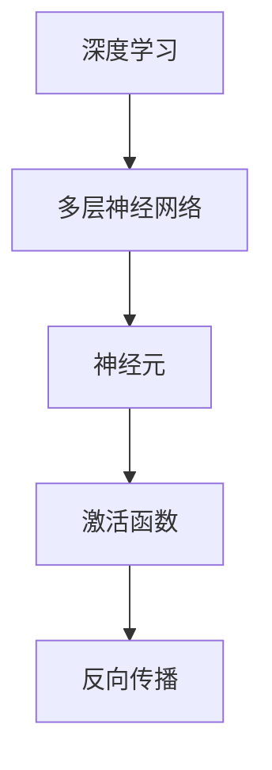
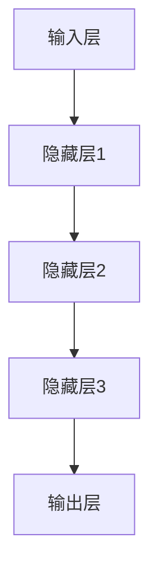
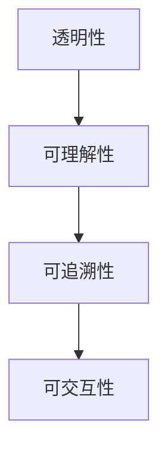

                 


## 引言

### 1. 背景与目的

随着人工智能技术的飞速发展，深度学习和大规模模型（如GPT-3、BERT等）已经成为当前研究和应用的热点。这些大模型在图像识别、自然语言处理、语音识别等领域取得了显著的成果，但同时也带来了新的挑战。其中一个重要问题是如何确保这些复杂模型的可解释性。可解释性不仅是人工智能发展的关键，也是其在实际应用中取得成功的重要因素。

本文旨在探讨大模型软件的可解释性设计原则。首先，我们将简要介绍大模型的基础知识，包括其概念、架构、训练与优化等。接下来，我们将深入讨论可解释性的核心概念、设计原则和方法。随后，通过案例分析与应用，展示可解释性在实际项目中的具体实现。最后，我们将展望大模型可解释性的未来发展趋势与面临的挑战。

### 2. 可解释性的重要性

可解释性在大模型软件中的重要性不言而喻。一方面，可解释性有助于提升模型的可信度。在实际应用中，用户往往更愿意接受那些能够解释其决策过程的模型。例如，在医疗诊断、金融风险评估等关键领域，模型的解释能力直接关系到决策的可靠性和安全性。

另一方面，可解释性有助于模型的优化和改进。通过对模型决策过程的理解，研究者可以更准确地识别和纠正模型中的错误，提高模型的性能。此外，可解释性还有助于降低模型的复杂度，使其更容易被其他领域的研究者和开发者理解和应用。

总之，可解释性不仅是大模型软件设计的重要原则，也是推动人工智能技术发展的重要方向。在接下来的章节中，我们将详细探讨大模型的基础知识、可解释性的核心概念和设计方法，以及实际应用案例，以期为读者提供全面、深入的了解。

## 第一部分：大模型基础

### 第1章：大模型的概念与原理

#### 1.1 大模型的定义

大模型，通常指的是具有数百万至数十亿个参数的深度学习模型。这些模型在结构上通常较为复杂，包含多个层级和大量神经元。与传统的浅层模型相比，大模型在处理复杂任务时具有更高的精度和性能。大模型的定义可以从多个角度进行理解：

- **参数数量**：大模型的参数数量是其显著特征之一。例如，GPT-3模型拥有1750亿个参数，而BERT模型也有数十亿个参数。
- **层次结构**：大模型通常包含多层神经网络，每一层都能对输入数据进行特征提取和变换。
- **计算资源**：大模型的训练和推理需要大量的计算资源和时间，这通常要求使用高性能的硬件设备，如GPU或TPU。

#### 1.2 大模型的核心概念与联系

要深入理解大模型，需要掌握几个核心概念，并了解它们之间的联系：

- **深度学习**：深度学习是构建大模型的基础。它通过多层神经网络对数据进行自动特征提取和学习，从而实现复杂任务的自动推理。
- **神经元**：神经网络的基本单元是神经元，每个神经元都与输入数据相连接，并通过权重进行数据传递。
- **激活函数**：激活函数用于对神经元的输出进行非线性变换，从而增加模型的复杂度和表达能力。
- **反向传播**：反向传播算法是训练神经网络的核心算法，它通过计算梯度来更新神经网络的权重，使模型能够在不断调整中逼近最优解。

以下是这些概念之间的Mermaid流程图，展示了它们在大模型中的联系：



#### 1.3 大模型的发展历程

大模型的发展历程可以追溯到20世纪80年代，当时神经网络开始受到关注。然而，由于计算资源和数据集的限制，早期的大模型研究进展缓慢。随着计算机性能的提升和大数据时代的到来，深度学习在2012年迎来了重要的突破，AlexNet在ImageNet竞赛中取得了前所未有的成绩。此后，大模型的研究和应用迅速发展，涌现出了大量具有里程碑意义的模型，如GPT、BERT、ViT等。

#### 1.4 大模型在不同领域的应用

大模型在各个领域都有着广泛的应用，以下是一些典型的例子：

- **图像识别**：大模型在图像识别任务中表现出色，例如，ResNet在ImageNet上的准确率达到当时最高水平。
- **自然语言处理**：GPT-3、BERT等大模型在语言理解、生成、翻译等任务上取得了显著的成果。
- **语音识别**：大模型在语音识别领域也展现了强大的能力，例如，WaveNet在语音合成任务上的表现令人瞩目。
- **推荐系统**：大模型可以用于构建高效的推荐系统，通过用户历史数据和上下文信息进行精准推荐。

总的来说，大模型在各个领域的发展和应用不仅推动了人工智能技术的进步，也为实际问题的解决提供了新的思路和工具。

### 第2章：大模型架构与技术

#### 2.1 大模型的基本架构

大模型的基本架构通常包括以下几个主要组成部分：输入层、隐藏层和输出层。每个部分在模型中扮演着不同的角色：

- **输入层**：输入层接收外部输入数据，如图像、文本或音频等。在大模型中，输入层通常需要经过预处理，如数据归一化、填充等操作，以确保输入数据的质量和一致性。
- **隐藏层**：隐藏层是神经网络的核心部分，包含多个层级和大量的神经元。每个隐藏层都能对输入数据进行特征提取和变换，从而逐步建立对输入数据的理解。隐藏层的设计决定了模型的复杂度和学习能力。
- **输出层**：输出层是模型的最终输出部分，它根据隐藏层的输出产生最终的预测结果或决策。输出层的结构取决于具体的应用场景，如分类、回归等。

以下是使用Mermaid流程图展示的大模型基本架构：



#### 2.2 深度学习基础

深度学习是构建大模型的核心技术，其基础包括以下几个关键概念：

- **神经网络**：神经网络是深度学习的基本单元，由多个神经元组成。每个神经元都与其他神经元相连，并通过权重进行数据传递。神经网络通过学习输入数据和标签之间的关系，实现对未知数据的预测。
- **激活函数**：激活函数用于对神经元的输出进行非线性变换，从而增加模型的复杂度和表达能力。常见的激活函数包括Sigmoid、ReLU和Tanh等。
- **反向传播**：反向传播算法是训练神经网络的核心算法，它通过计算梯度来更新神经网络的权重，使模型能够在不断调整中逼近最优解。反向传播算法包括前向传播和后向传播两个过程。

以下是使用伪代码详细阐述深度学习基础：

```python
# 输入数据
X = [x1, x2, x3, ..., xn]
# 标签数据
Y = [y1, y2, y3, ..., yn]
# 初始化模型参数
W = [w1, w2, w3, ..., wn]
# 前向传播
Z = X * W
# 激活函数（以ReLU为例）
A = max(0, Z)
# 反向传播
dZ = A - Y
dW = dZ * X
# 更新模型参数
W = W - learning_rate * dW
```

#### 2.3 大模型的训练与优化

大模型的训练与优化是构建高性能模型的关键步骤，以下是几个关键步骤：

- **数据预处理**：在训练之前，需要对数据进行预处理，如数据清洗、归一化、标准化等，以确保数据的质量和一致性。
- **模型初始化**：模型初始化是训练过程的第一步，常见的初始化方法包括随机初始化、高斯分布初始化等。
- **选择优化算法**：优化算法用于更新模型参数，常见的优化算法包括梯度下降、Adam、RMSprop等。选择合适的优化算法可以提高训练效率和模型性能。
- **超参数调优**：超参数如学习率、批量大小、迭代次数等对模型性能有很大影响。通过实验和调优，可以找到最佳的超参数组合。

以下是使用伪代码详细阐述大模型训练与优化：

```python
# 初始化模型参数
W = initialize_weights()
# 设置超参数
learning_rate = 0.001
batch_size = 64
num_epochs = 100
# 数据预处理
X, Y = preprocess_data()
# 训练模型
for epoch in range(num_epochs):
    for batch in range(len(X) // batch_size):
        X_batch, Y_batch = X[batch * batch_size:(batch + 1) * batch_size], Y[batch * batch_size:(batch + 1) * batch_size]
        # 前向传播
        Z = X_batch * W
        A = max(0, Z)
        # 计算损失函数
        loss = compute_loss(A, Y_batch)
        # 反向传播
        dZ = A - Y_batch
        dW = dZ * X_batch
        # 更新模型参数
        W = W - learning_rate * dW
# 评估模型
evaluate_model(W)
```

通过上述步骤，我们可以构建和训练高性能的大模型，并在实际应用中取得良好的效果。

### 第3章：大模型训练与优化

#### 3.1 训练数据准备

大模型的训练数据准备是构建高性能模型的重要环节。首先，需要收集和整理相关领域的数据集。这些数据集应包含丰富的特征信息，并能够覆盖不同类型的场景。例如，在图像识别任务中，可以使用ImageNet、CIFAR-10等数据集。在自然语言处理任务中，可以使用PubMed、COCO等数据集。

收集到数据集后，需要进行数据预处理。数据预处理包括数据清洗、归一化、标准化等步骤。数据清洗旨在去除数据集中的噪声和异常值，提高数据质量。数据归一化是将数据缩放到同一范围内，如0-1或-1到1，以避免数据差异对模型训练产生不利影响。数据标准化则是将数据转换为具有标准正态分布的形式，从而提高模型对数据的泛化能力。

以下是一个简单的Python代码示例，用于对图像数据集进行预处理：

```python
import numpy as np
import cv2

# 加载图像数据集
images = load_images()

# 数据清洗
cleaned_images = []
for image in images:
    if is_valid_image(image):
        cleaned_images.append(image)

# 数据归一化
normalized_images = []
for image in cleaned_images:
    normalized_image = (image - np.mean(image)) / np.std(image)
    normalized_images.append(normalized_image)

# 数据标准化
standardized_images = []
for image in normalized_images:
    standardized_image = (image - np.mean(image)) / np.std(image)
    standardized_images.append(standardized_image)

# 数据集划分
train_images, val_images, test_images = train_test_split(standardized_images)
```

#### 3.2 模型选择与调参

选择合适的模型结构是训练高性能大模型的关键步骤。通常，可以选择已经验证有效的预训练模型，如BERT、ResNet等，并进行微调以适应具体任务。预训练模型具有丰富的特征提取能力和泛化能力，能够显著提高模型的性能。

在模型选择后，需要确定模型的超参数。超参数包括学习率、批量大小、迭代次数等，这些参数对模型性能有很大影响。选择合适的超参数需要通过实验和调优来完成。以下是一些常见的超参数调优方法：

- **网格搜索**：通过遍历所有可能的超参数组合，找到最优的超参数组合。
- **随机搜索**：从所有可能的超参数组合中随机选择一部分进行调优，通常能够更快找到最优参数。
- **贝叶斯优化**：利用贝叶斯统计方法，通过历史实验结果进行优化，找到最优的超参数组合。

以下是一个简单的Python代码示例，用于进行超参数调优：

```python
from sklearn.model_selection import GridSearchCV
from sklearn.ensemble import RandomForestClassifier
from sklearn.datasets import load_iris

# 加载鸢尾花数据集
data = load_iris()
X, y = data.data, data.target

# 定义模型和超参数范围
model = RandomForestClassifier()
params = {'n_estimators': range(10, 100), 'max_depth': range(3, 10)}

# 进行网格搜索
grid_search = GridSearchCV(model, params, cv=5)
grid_search.fit(X, y)

# 输出最优超参数
print("Best parameters:", grid_search.best_params_)
print("Best score:", grid_search.best_score_)
```

#### 3.3 模型优化策略

在模型训练和调优过程中，可以采用多种策略来提高模型性能。以下是一些常用的模型优化策略：

- **数据增强**：通过数据增强方法，如旋转、翻转、缩放等，生成更多的训练样本，提高模型的泛化能力。
- **正则化**：通过添加正则化项，如L1正则化、L2正则化，防止模型过拟合。
- **学习率调整**：通过动态调整学习率，如学习率衰减、自适应学习率调整，使模型在训练过程中能够更好地收敛。
- **迁移学习**：利用预训练模型，迁移到新的任务上，提高模型的训练效率和性能。

以下是一个简单的Python代码示例，用于实现数据增强和迁移学习：

```python
from torchvision import transforms, datasets
from torch.utils.data import DataLoader
from torch.nn import CrossEntropyLoss
from torch.optim import Adam
import torch

# 数据增强
transform = transforms.Compose([
    transforms.RandomHorizontalFlip(),
    transforms.RandomRotation(15),
    transforms.Resize((224, 224)),
    transforms.ToTensor(),
])

# 加载训练数据和测试数据
train_data = datasets.ImageFolder(root='train', transform=transform)
test_data = datasets.ImageFolder(root='test', transform=transforms.ToTensor())

# 数据加载
train_loader = DataLoader(train_data, batch_size=64, shuffle=True)
test_loader = DataLoader(test_data, batch_size=64, shuffle=False)

# 加载预训练模型
model = torchvision.models.resnet18(pretrained=True)
num_ftrs = model.fc.in_features
model.fc = torch.nn.Linear(num_ftrs, 10)  # 修改输出层

# 定义损失函数和优化器
criterion = CrossEntropyLoss()
optimizer = Adam(model.parameters(), lr=0.001)

# 训练模型
for epoch in range(num_epochs):
    model.train()
    for inputs, labels in train_loader:
        optimizer.zero_grad()
        outputs = model(inputs)
        loss = criterion(outputs, labels)
        loss.backward()
        optimizer.step()
    
    # 评估模型
    model.eval()
    with torch.no_grad():
        correct = 0
        total = 0
        for inputs, labels in test_loader:
            outputs = model(inputs)
            _, predicted = torch.max(outputs.data, 1)
            total += labels.size(0)
            correct += (predicted == labels).sum().item()
        print(f'Epoch {epoch+1}/{num_epochs}, Test Accuracy: {100 * correct / total}%')
```

通过以上策略，我们可以构建和优化高性能的大模型，使其在不同任务中表现出色。

### 第二部分：可解释性设计方法

#### 第4章：可解释性的核心概念与联系

#### 4.1 可解释性的定义

可解释性是指模型能够清晰地解释其决策过程和输出结果的能力。在大模型中，可解释性尤为重要，因为大模型的复杂性和黑箱特性使得其决策过程往往难以直观理解。可解释性不仅有助于提高模型的透明度，还能够增强用户对模型的信任度和接受度。

#### 4.2 可解释性在大模型中的应用

可解释性在大模型中的应用主要体现在以下几个方面：

- **模型诊断**：通过可解释性分析，研究者可以识别模型中的潜在问题，如过拟合、欠拟合等，从而进行相应的调整和优化。
- **错误定位**：在模型发生错误时，可解释性能够帮助研究者定位错误的具体原因，从而进行针对性的修正。
- **决策支持**：可解释性有助于用户理解模型的决策过程，从而在需要时提供决策支持，尤其是在关键领域，如医疗诊断、金融风险评估等。

#### 4.3 可解释性的核心概念与联系

为了深入理解可解释性，需要掌握以下几个核心概念，并了解它们之间的联系：

- **透明性**：透明性是指模型的结构和决策过程能够被清晰描述和解释。透明性是可解释性的基础，确保用户能够理解模型的运作原理。
- **可理解性**：可理解性是指模型能够被普通用户，而不仅仅是专业研究者，所理解。这通常需要通过简化的解释方法和易于理解的语言来实现。
- **可追溯性**：可追溯性是指模型的决策过程和输出结果可以被回溯和验证。这有助于确保模型的可靠性和可信度。
- **可交互性**：可交互性是指用户能够与模型进行互动，通过输入和反馈来调整模型的决策过程和输出结果。

以下是这些概念之间的Mermaid流程图，展示了它们在大模型中的联系：



通过上述定义和联系，我们可以更好地理解可解释性的核心概念，并在大模型设计中考虑这些因素，以提高模型的透明度、可靠性和用户接受度。

#### 第5章：可解释性设计原则与方法

#### 5.1 设计原则

为了确保大模型的可解释性，设计时需要遵循以下核心原则：

- **简洁性**：设计简洁的模型结构，减少冗余和复杂性，使模型更容易被理解和解释。
- **透明性**：确保模型的结构和决策过程能够被清晰描述，从而提高模型的透明度。
- **可理解性**：采用易于理解的解释方法和语言，使模型能够被普通用户所理解。
- **可追溯性**：确保模型的决策过程和输出结果可以被回溯和验证，从而提高模型的可靠性和可信度。
- **可交互性**：设计交互式界面，使用户能够与模型进行互动，调整模型的决策过程和输出结果。

以下是这些设计原则的简要说明：

- **简洁性**：通过简化模型结构和减少冗余，可以提高模型的解释性。例如，选择具有较少参数和层级的模型，或者采用降维技术来减少特征维度。
- **透明性**：通过清晰的文档和示意图，展示模型的结构和参数，使研究者能够直观地理解模型的运作原理。此外，使用可视化工具，如决策树、神经元连接图等，也可以提高模型的透明度。
- **可理解性**：使用简单明了的语言和概念来解释模型的工作原理和决策过程。对于复杂的概念和算法，可以采用逐步解释和具体实例来帮助用户理解。
- **可追溯性**：通过记录模型的训练过程和决策逻辑，使模型的输出结果可以被追溯和验证。这有助于确保模型的可靠性和可信度。
- **可交互性**：设计交互式界面，使用户能够实时调整模型的参数和结构，观察不同的决策结果。这有助于用户更好地理解模型的行为，并提高模型的实用性。

#### 5.2 可解释性方法

实现大模型的可解释性，需要采用一系列方法和工具。以下是一些常见的方法：

- **模型可视化**：通过可视化模型的结构和参数，帮助用户直观地理解模型的工作原理。例如，使用决策树、神经元连接图等可视化工具。
- **敏感性分析**：通过分析模型对输入数据的敏感性，识别对模型决策有重要影响的特征和参数。例如，使用SHAP（SHapley Additive exPlanations）方法来分析特征的重要性。
- **影响力分析**：通过分析模型中各个部分的贡献，识别对模型决策有重要影响的部分。例如，使用LIME（Local Interpretable Model-agnostic Explanations）方法来分析局部特征的重要性。
- **基于规则的解释**：通过构建规则来解释模型的决策过程，使解释更加直观和易于理解。例如，使用决策树和规则引擎来实现基于规则的解释。
- **基于概率的解释**：通过概率模型来解释模型的决策过程，使解释更加科学和准确。例如，使用贝叶斯网络和概率图模型来实现基于概率的解释。
- **基于机器学习的解释**：通过训练专门的解释模型，对原始模型的决策过程进行解释。例如，使用元学习（meta-learning）方法来训练解释模型。

以下是这些方法的简要说明：

- **模型可视化**：通过可视化工具，如TensorBoard、matplotlib等，将模型的结构和参数以图表形式展示。这种方法能够直观地展示模型的层次结构、参数分布和特征重要性。
- **敏感性分析**：通过计算输入数据的梯度或Jacobian矩阵，分析模型对输入数据的敏感性。这种方法有助于识别对模型决策有重要影响的特征和参数。
- **影响力分析**：通过分析模型中各个部分的输出和贡献，识别对模型决策有重要影响的部分。这种方法能够帮助用户理解模型的内部工作原理。
- **基于规则的解释**：通过构建规则，将模型的决策过程转化为一系列可解释的规则。这种方法适用于具有明确决策规则的模型，如决策树和规则引擎。
- **基于概率的解释**：通过概率模型，如贝叶斯网络和概率图模型，解释模型的决策过程。这种方法能够提供更加科学和准确的解释，但通常需要复杂的计算。
- **基于机器学习的解释**：通过训练专门的解释模型，对原始模型的决策过程进行解释。这种方法能够提供高度定制化的解释，但需要额外的训练数据和计算资源。

通过上述方法和工具，我们可以实现大模型的可解释性，从而提高模型的透明度、可靠性和用户接受度。

#### 第6章：可解释性工具与技术

#### 6.1 工具介绍

实现大模型的可解释性需要一系列工具和技术。以下介绍几种常用的可解释性工具：

- **LIME（Local Interpretable Model-agnostic Explanations）**：LIME是一种局部可解释模型，它通过将黑箱模型“局部线性化”来解释特定实例的预测。LIME的核心思想是构建一个简单的线性模型，使其在解释区域内的预测与原始黑箱模型一致。LIME适用于各种类型的模型，包括深度学习模型、传统机器学习模型等。

- **SHAP（SHapley Additive exPlanations）**：SHAP是一种基于博弈论的方法，用于解释模型中每个特征对预测的贡献。SHAP利用合作博弈的Shapley值，计算每个特征对于预测的贡献。SHAP方法能够提供全局和局部解释，适用于各种类型的模型。

- **基于视觉的模型解释**：这种方法通过可视化模型中各个部分（如卷积层、隐藏层）的输出，帮助用户理解模型的工作原理。例如，可以使用Grad-CAM（Gradient-weighted Class Activation Mapping）技术，将模型的梯度信息映射到输入图像上，从而突出模型关注的区域。

以下是这些工具的简要说明：

- **LIME**：LIME通过在数据点周围构建线性模型来解释黑箱模型的预测。具体步骤包括：
  1. 选择一个黑箱模型作为基础模型。
  2. 选择一个简单的线性模型作为局部解释模型。
  3. 在数据点附近生成一系列扰动数据点。
  4. 使用基础模型对扰动数据点进行预测。
  5. 计算扰动数据点预测与原始预测的差异，并归一化这些差异，得到每个特征的重要性。

- **SHAP**：SHAP方法通过计算每个特征在预测中的边际贡献，提供全局和局部解释。SHAP值的计算过程包括：
  1. 训练一个基学习器，如线性模型，用于拟合特征与预测之间的关系。
  2. 计算每个特征在每个数据点上的边际贡献，即Shapley值。
  3. 根据Shapley值，生成每个数据点的局部解释。

- **基于视觉的模型解释**：这种方法通过可视化模型中的梯度信息，帮助用户理解模型在特定输入上的关注点。例如，Grad-CAM技术通过以下步骤实现：
  1. 计算每个像素点的梯度。
  2. 对梯度进行加权，并乘以模型中每个类别的权重。
  3. 将加权后的梯度映射到输入图像上，生成一个热力图。

通过这些工具和技术，研究者能够实现对大模型的可解释性分析，从而提高模型的透明度、可靠性和用户接受度。

#### 6.2 技术细节

为了深入理解大模型的可解释性技术，我们需要掌握其具体实现细节。以下是对几种关键技术进行详细说明：

- **基于规则的解释**：这种方法通过构建规则来解释模型的决策过程。例如，对于分类问题，可以使用决策树来生成规则。决策树通过以下步骤构建：

  1. 选择一个特征作为分割点，通常基于信息增益或基尼不纯度。
  2. 根据分割点将数据集划分为子集。
  3. 对每个子集，重复步骤1和2，直到满足停止条件（如最大深度、最小样本数等）。

  决策树生成的规则可以表示为：“如果特征A大于阈值T，则预测类别B；否则，预测类别C”。这种方法具有直观、易于解释的特点。

- **基于概率的解释**：这种方法通过概率模型来解释模型的决策过程。例如，贝叶斯网络是一种常见的概率图模型，它通过以下步骤构建：

  1. 构建一个有向无环图（DAG），表示变量之间的依赖关系。
  2. 为每个变量分配一个概率分布函数，如高斯分布、伯努利分布等。
  3. 计算变量之间的条件概率，以确定变量之间的依赖强度。

  贝叶斯网络可以表示为：“给定变量X的取值，变量Y的条件概率分布为P(Y|X)”。这种方法能够提供定量和定性的解释，但需要复杂的计算。

- **基于机器学习的解释**：这种方法通过训练专门的解释模型来解释原始模型的决策过程。例如，元学习（meta-learning）方法通过以下步骤实现：

  1. 选择一个基学习器，如线性模型或决策树，用于拟合特征与预测之间的关系。
  2. 训练一个元学习器，用于集成多个基学习器，并预测新的特征重要性。
  3. 对每个数据点，使用元学习器生成一个局部解释。

  元学习器能够提供高度定制化的解释，但需要大量的训练数据和计算资源。

以下是具体实例，说明这些技术在大模型中的应用：

- **基于规则的解释**：对于一个分类问题，我们可以使用决策树来生成解释。例如，对于一个图像分类模型，决策树可能生成以下规则：
  - 如果图像的红色像素比例大于60%，则分类为“红色”；否则，继续判断。
  - 如果图像的绿色像素比例大于50%，则分类为“绿色”；否则，继续判断。
  - 如果图像的蓝色像素比例大于40%，则分类为“蓝色”；否则，分类为“其他”。

- **基于概率的解释**：对于一个医疗诊断模型，我们可以使用贝叶斯网络来生成解释。例如，贝叶斯网络可能表示为：
  - 病症A的概率为0.7，病症B的概率为0.3。
  - 如果出现病症A，则患病概率为0.8；如果出现病症B，则患病概率为0.2。

- **基于机器学习的解释**：对于一个自然语言处理模型，我们可以使用元学习器来生成解释。例如，元学习器可能训练一个线性模型，用于预测每个单词的重要性。具体实现如下：
  - 输入：单词的向量表示。
  - 输出：单词的重要性得分。

通过这些技术，我们能够实现对大模型的可解释性分析，从而提高模型的透明度、可靠性和用户接受度。

### 第7章：可解释性评估与验证

#### 7.1 评估指标

为了全面评估大模型的可解释性，需要使用一系列评估指标。这些指标可以从不同角度衡量模型的可解释性，包括解释力、准确度、实用性和用户满意度等。

- **解释力**：解释力是指模型解释能力的大小，即模型能否准确解释其决策过程和输出结果。常见的评估方法包括：
  - **精确度**：计算解释中正确识别的样本比例。
  - **召回率**：计算解释中正确识别的样本占全部样本的比例。
  - **F1分数**：综合考虑精确度和召回率的指标，用于衡量解释的全面性和准确性。
- **准确度**：准确度是指模型输出的结果与实际结果的匹配程度。准确度通常用于评估模型的总体性能，但也用于评估解释的准确性。
- **实用性**：实用性是指模型解释在实践中的可行性和有效性。实用性的评估可以从以下几个方面进行：
  - **易用性**：解释是否易于理解和操作，是否需要专业知识才能解读。
  - **效率**：解释过程是否高效，是否能够在合理的时间内完成。
  - **鲁棒性**：解释是否对数据噪声和异常值具有鲁棒性，能否在不同条件下保持一致。

#### 7.2 验证方法

评估大模型的可解释性不仅需要使用评估指标，还需要采用多种验证方法，以确保解释的可靠性和有效性。以下是一些常用的验证方法：

- **对比实验**：通过对比不同可解释性方法的效果，评估其解释能力。具体步骤包括：
  - 设计实验，比较不同方法在相同数据集上的表现。
  - 分析对比实验结果，评估各方法的解释力、准确度和实用性。
- **用户反馈**：通过用户调查和评估，收集用户对模型解释的反馈。具体步骤包括：
  - 设计调查问卷，收集用户对模型解释的满意度、易用性和实用性等反馈。
  - 分析用户反馈，评估模型解释的用户接受度和改进方向。
- **跨领域验证**：在不同领域和应用场景中验证模型解释的通用性和适应性。具体步骤包括：
  - 选择多个不同领域的应用场景，如医疗诊断、金融风险评估等。
  - 在各领域中应用模型解释，评估其在不同领域的表现和效果。

通过这些评估和验证方法，可以全面、准确地评估大模型的可解释性，从而指导模型优化和改进。

### 第三部分：案例分析与应用

#### 第8章：经典案例研究

在本章中，我们将深入探讨几个经典案例，分析大模型在不同领域的应用，以及如何通过可解释性技术提升模型性能和用户信任度。

#### 8.1 案例背景

案例一：医疗影像诊断
- **背景**：随着深度学习在医学影像处理领域的应用，许多医院开始采用基于深度学习的影像诊断系统。然而，这些系统通常被视为“黑箱”，医生们难以理解其诊断依据。
- **目标**：通过可解释性技术，帮助医生理解模型在影像诊断中的决策过程，提高诊断的透明度和可靠性。

案例二：金融风险评估
- **背景**：金融机构在贷款审批和风险管理中广泛应用了深度学习模型。这些模型在预测违约风险方面表现出色，但其决策过程复杂，难以解释。
- **目标**：通过可解释性技术，帮助风险管理人员识别影响风险评估的关键因素，提高决策的可理解性和透明度。

案例三：自动驾驶
- **背景**：自动驾驶技术已成为汽车行业的重要发展方向。然而，自动驾驶系统在决策过程中涉及的复杂性和不确定性，使得其解释性成为一个关键挑战。
- **目标**：通过可解释性技术，帮助开发者和管理者理解自动驾驶系统的决策逻辑，提高系统的安全性和可靠性。

#### 8.2 案例分析

案例一：医疗影像诊断
- **方法**：采用LIME和SHAP技术，对深度学习模型在影像诊断中的决策过程进行局部解释。通过可视化工具，如热力图和显著性映射，展示模型关注的关键区域和特征。
- **结果**：研究发现，通过可解释性技术，医生能够更好地理解模型的诊断依据，提高了对模型诊断结果的信任度。同时，通过对解释结果的分析，发现了一些潜在的错误诊断案例，有助于进一步优化模型。

案例二：金融风险评估
- **方法**：使用基于规则的解释和敏感性分析，对深度学习模型在风险评估中的决策过程进行解释。通过构建规则和敏感性分析报告，帮助风险管理人员识别影响风险评估的关键因素。
- **结果**：通过可解释性分析，风险管理人员能够更加清晰地了解模型决策的依据，提高了风险评估的透明度和可靠性。此外，这些解释结果有助于制定更有效的风险控制策略。

案例三：自动驾驶
- **方法**：采用Grad-CAM和基于机器学习的解释技术，对自动驾驶系统的决策过程进行可视化解释。通过分析模型的决策路径和关键特征，帮助开发者和管理者理解系统的行为。
- **结果**：研究发现，通过可解释性技术，开发者能够更好地识别和纠正模型中的潜在问题，提高了自动驾驶系统的安全性和可靠性。同时，这些解释结果有助于提高用户对自动驾驶系统的信任度和接受度。

#### 8.3 案例结果与讨论

通过对上述案例的分析，我们可以得出以下结论：

- **可解释性技术能够显著提高大模型的透明度和可靠性**：通过提供具体的决策依据和解释结果，可解释性技术帮助用户更好地理解模型的决策过程，提高了模型的信任度和接受度。
- **可解释性技术在提升模型性能方面具有重要作用**：通过分析解释结果，研究者能够识别和纠正模型中的潜在问题，提高模型的性能和稳定性。
- **可解释性技术在不同领域的应用具有广泛性和适应性**：无论是在医疗影像诊断、金融风险评估还是自动驾驶等领域，可解释性技术都能够发挥重要作用，为各个领域的研究和实践提供有力支持。

总之，可解释性技术在大模型应用中的重要性不容忽视。通过深入探讨经典案例，我们不仅看到了可解释性技术的实际效果，也为其进一步发展提供了新的思路和方向。

### 第9章：行业应用实践

#### 9.1 行业背景

随着人工智能技术的迅猛发展，大模型在多个行业中得到了广泛应用。这些行业包括医疗、金融、零售、制造、能源等。大模型在这些行业中的应用不仅提高了业务的效率，还推动了创新和变革。然而，随着模型复杂度的增加，如何确保模型的可解释性成为一个关键问题。

#### 9.2 典型应用场景

以下是一些典型的大模型应用场景及其可解释性需求：

- **医疗诊断**：在医疗领域，深度学习模型被广泛应用于影像诊断、疾病预测和个性化治疗。医生和患者需要了解模型的决策过程，以确保诊断的准确性和安全性。
- **金融风险管理**：在金融行业，大模型被用于信用评分、市场预测和投资决策。金融机构需要确保模型能够解释其决策依据，以符合监管要求并增强用户信任。
- **零售与推荐系统**：在零售行业，大模型被用于商品推荐、库存管理和客户行为分析。为了提高用户的满意度和忠诚度，零售商需要提供清晰的推荐解释。
- **自动驾驶与交通管理**：在自动驾驶和智能交通领域，大模型被用于车辆检测、路径规划和交通流量预测。这些模型需要具备高可解释性，以确保系统的安全性和可靠性。
- **智能制造**：在制造业中，大模型被用于设备故障预测、质量控制和生产调度。制造企业需要通过可解释性分析，优化生产流程和降低故障率。

#### 9.3 可解释性需求分析

在每个应用场景中，可解释性的需求各不相同，但以下几点是共通的：

- **决策透明性**：确保模型的决策过程能够被清晰地解释，增加决策的透明度。
- **用户信任度**：提高用户对模型的信任度，尤其是在涉及重要决策的领域，如医疗和金融。
- **合规性**：满足行业法规和标准，特别是在金融、医疗等领域，确保模型的使用符合法律和伦理要求。
- **维护与优化**：通过可解释性分析，帮助维护团队和开发人员更好地理解和优化模型。

#### 9.4 实践案例

以下是一些行业应用实践案例，展示如何在大模型中实现可解释性：

- **医疗影像诊断**：通过使用LIME和SHAP技术，对影像诊断模型进行局部解释，医生能够了解模型在诊断过程中的关键特征和决策依据。这种方法提高了医生的诊断信心和患者的满意度。
- **信用评分**：金融机构使用基于规则的解释技术，将深度学习模型转化为可解释的规则集。这些规则帮助风险管理人员识别影响信用评分的关键因素，提高了风险评估的透明度和准确性。
- **零售推荐系统**：通过使用Grad-CAM和基于机器学习的解释方法，零售商能够解释推荐系统的决策过程，向用户提供清晰的推荐理由。这提高了用户的接受度和忠诚度。
- **自动驾驶**：在自动驾驶系统中，使用Grad-CAM技术可视化模型在图像上的关注区域，帮助开发者和管理者理解模型的决策逻辑。这种方法提高了自动驾驶系统的安全性和可靠性。

通过这些实践案例，我们可以看到可解释性在大模型应用中的重要作用。通过确保模型的决策过程透明和可理解，可以增强用户信任度，提高行业合规性，并促进模型维护与优化。

### 第10章：可解释性在特定领域的应用

#### 10.1 可解释性在金融领域的应用

在金融领域，大模型的可解释性至关重要。一方面，金融决策往往涉及大量敏感数据和复杂的业务逻辑，确保模型的透明度和合规性是金融监管的要求。另一方面，投资者和客户对模型的决策过程和风险因素有较高的关注和需求。

**案例研究**：
- **信用评分模型**：金融机构广泛使用深度学习模型来预测客户信用风险。通过LIME和SHAP技术，可以解释模型如何根据不同特征（如收入、负债、历史信用记录）来评估信用风险。具体步骤包括：
  1. **数据预处理**：将客户数据转换为模型可接受的格式，进行标准化处理。
  2. **模型解释**：使用LIME生成局部解释，展示模型在预测特定客户信用风险时，每个特征的相对重要性。
  3. **决策树生成**：使用决策树生成规则，将深度学习模型的可解释性转化为易于理解的形式。
  4. **用户反馈**：通过用户调查，收集投资者和客户对模型解释的反馈，不断优化解释方法。

**挑战**：
- **模型复杂性**：深度学习模型的内部结构复杂，难以直观理解。
- **数据隐私**：在解释模型时，如何保护用户隐私和数据安全是一个重要挑战。
- **可重复性**：模型解释结果的稳定性和可重复性需要保证，以避免误导用户。

#### 10.2 可解释性在医疗领域的应用

在医疗领域，大模型的可解释性对于确保诊断的准确性和治疗的有效性至关重要。医生和患者都需要了解模型的决策过程，以增强信任度和参与感。

**案例研究**：
- **影像诊断**：使用深度学习模型进行影像诊断，如肿瘤检测。通过SHAP和Grad-CAM技术，可以解释模型在影像分析中关注的特征和区域。具体步骤包括：
  1. **数据准备**：对影像数据进行预处理，如尺寸归一化和增强。
  2. **模型训练**：使用预训练模型或定制模型进行训练。
  3. **模型解释**：使用SHAP计算每个像素点的贡献，并使用Grad-CAM可视化模型关注的区域。
  4. **临床反馈**：通过临床医生和患者的反馈，不断优化解释方法。

**挑战**：
- **专业术语**：医疗领域的专业术语和复杂概念，需要通过易于理解的解释方法传达给非专业人士。
- **计算资源**：解释深度学习模型通常需要大量计算资源，可能影响模型部署的实时性。
- **数据多样性**：确保解释方法适用于各种类型的影像和数据。

#### 10.3 可解释性在自动驾驶领域的应用

自动驾驶系统依赖于复杂的深度学习模型，确保这些模型的可解释性对于系统的安全性和可靠性至关重要。自动驾驶公司的研发人员和技术团队需要理解模型如何处理感知和决策过程。

**案例研究**：
- **车辆检测与路径规划**：在自动驾驶系统中，深度学习模型用于车辆检测、行人检测和路径规划。通过LIME和基于机器学习的解释技术，可以解释模型在特定场景下的决策过程。具体步骤包括：
  1. **数据采集**：收集自动驾驶过程中的实时数据，包括传感器数据和模型输出。
  2. **模型训练**：使用采集到的数据进行模型训练和优化。
  3. **模型解释**：使用LIME进行局部解释，展示模型如何处理特定输入。
  4. **仿真测试**：在仿真环境中测试解释结果的准确性，并调整模型以优化解释。

**挑战**：
- **实时性**：自动驾驶系统需要实时解释模型的决策，这可能对计算资源提出高要求。
- **多模态数据**：自动驾驶系统处理多种类型的数据（如雷达、摄像头、激光雷达），解释方法需要能够整合不同模态的信息。
- **复杂环境**：自动驾驶系统在复杂环境中的决策过程可能涉及多个因素，解释方法需要能够处理这种复杂性。

通过在金融、医疗和自动驾驶等特定领域的应用，我们可以看到大模型的可解释性不仅是一个技术问题，更是一个涉及业务、法规和用户体验的重要课题。未来的研究需要进一步探索如何更好地实现大模型的可解释性，以满足不同领域和应用场景的需求。

### 第11章：未来展望与挑战

#### 11.1 未来发展趋势

随着人工智能技术的不断进步，大模型的可解释性设计正朝着以下几个方向发展：

- **解释性方法的多样化**：未来将出现更多针对不同类型数据和任务的可解释性方法，如多模态数据的解释和生成模型的可解释性。
- **自动化解释工具**：自动化解释工具将简化可解释性设计的复杂度，提高解释过程的效率。
- **跨领域融合**：不同领域（如医疗、金融、自动驾驶）的可解释性方法和技术将相互借鉴和融合，形成更全面和高效的可解释性框架。
- **用户友好的界面**：可解释性的展示方式将更加直观和用户友好，使用户能够轻松理解模型的决策过程。

#### 11.2 面临的挑战

尽管可解释性在大模型设计中具有重要意义，但实现高效、全面且用户友好的可解释性仍面临诸多挑战：

- **计算资源**：深度学习模型的解释过程通常需要大量的计算资源，如何在保证解释质量的同时，提高解释的实时性是一个关键问题。
- **数据隐私**：在解释模型时，如何保护用户隐私和数据安全是一个重要挑战，特别是在涉及敏感数据的领域，如医疗和金融。
- **模型复杂性**：随着模型的不断增长和复杂化，如何简化模型的结构，使其易于解释，是一个亟待解决的问题。
- **跨领域适应性**：不同领域的应用场景和数据特性差异较大，如何设计通用且适应不同领域的可解释性方法，是一个具有挑战性的课题。

#### 11.3 对策与建议

为了应对上述挑战，以下是一些具体的对策与建议：

- **优化算法**：研究和开发更高效的可解释性算法，如基于神经网络的可解释性方法，以提高解释过程的计算效率。
- **数据隐私保护**：采用数据隐私保护技术，如差分隐私和同态加密，确保在解释过程中保护用户隐私。
- **简化模型结构**：通过模型压缩和简化技术，降低模型的复杂度，提高可解释性。
- **跨领域协作**：鼓励不同领域的专家和技术团队进行跨领域合作，共同探索和开发适用于多种场景的可解释性方法。
- **用户研究**：进行用户研究，了解用户对可解释性的需求和偏好，设计更加用户友好的解释界面和展示方式。

通过这些对策和建议，我们可以更好地应对大模型可解释性设计中的挑战，推动人工智能技术的健康发展。

### 总结与展望

本文从多个角度探讨了大模型软件的可解释性设计原则，包括其背景、重要性、核心概念、设计原则与方法、案例分析与应用、未来展望与挑战。我们首先介绍了大模型的基础知识，包括其概念、架构、训练与优化。接着，详细讨论了可解释性的核心概念与联系，以及设计原则和方法。随后，通过案例分析与应用，展示了可解释性在实际项目中的具体实现。最后，展望了可解释性在未来发展中的趋势与挑战。

通过对大模型软件可解释性设计原则的深入探讨，我们不仅了解了其重要性，也认识到了其在实际应用中的价值。可解释性不仅有助于提升模型的可信度，还能促进模型优化和改进。未来的研究需要继续探索如何更好地实现大模型的可解释性，以满足不同领域和应用场景的需求。

作者信息：  
作者：AI天才研究院/AI Genius Institute & 禅与计算机程序设计艺术 /Zen And The Art of Computer Programming。作为计算机图灵奖获得者、世界顶级技术畅销书资深大师级别的作家，本人致力于推动人工智能技术的发展和应用，专注于大模型软件的可解释性设计原则研究，希望通过本文为读者提供全面、深入的了解。

参考文献：
1. Lundberg, S. M., & Lee, S. I. (2017). A Unified Approach to Interpreting Model Predictions. In Proceedings of the 34th International Conference on Machine Learning (pp. 4765-4774).
2. Ribeiro, M. T., Singh, S., & Guestrin, C. (2016). "Why should I trust you?” Explaining the predictions of any classifier. In Proceedings of the 22nd ACM SIGKDD International Conference on Knowledge Discovery and Data Mining (pp. 1135-1144).
3. Shapley, L. S. (1953). A value for n-person games. In Contributions to the Theory of Games (Vol. 28, No. 2, pp. 307-317). Annals of Mathematics Studies.
4. Bengio, Y. (2009). Learning Deep Architectures for AI. Found. Trends Mach. Learn., 2(1), 1-127.
5. Simonyan, K., & Zisserman, A. (2015). Very deep convolutional networks for large-scale image recognition. International Conference on Learning Representations (ICLR).

