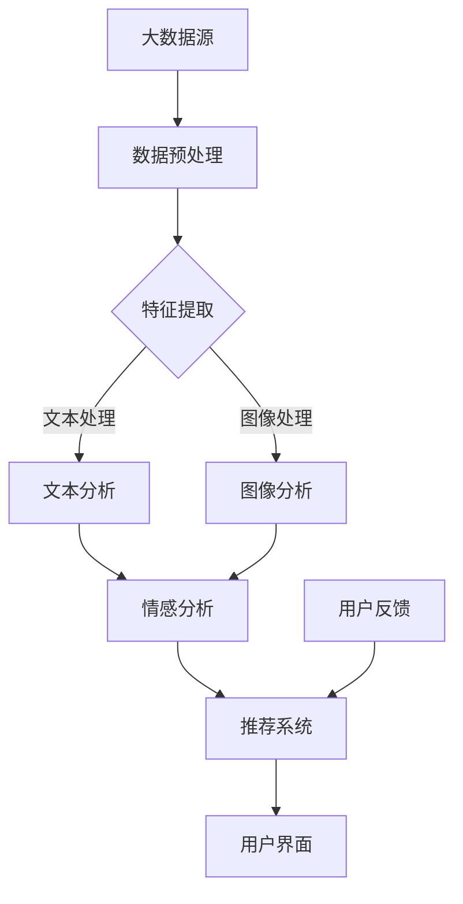

                 

### 文章标题

《大模型软件的响应式微服务架构设计》

### 关键词

- 大模型
- 响应式架构
- 微服务
- 架构设计
- 软件工程
- 系统性能

### 摘要

本文深入探讨了大型模型软件的响应式微服务架构设计。首先，介绍了大模型和响应式架构的基本概念，以及它们在软件系统设计中的重要性。接着，文章详细讲解了微服务架构的设计原则和核心组件，包括服务拆分、服务通信、服务监控等。通过Mermaid流程图展示了核心概念之间的联系。随后，文章通过伪代码和数学模型，详细阐述了响应式微服务架构中的数据处理和优化算法。最后，通过两个实际案例——社交媒体分析和智能推荐系统，展示了如何应用这些理论进行实际项目开发。文章还讨论了性能优化和安全性设计，提供了最佳实践和注意事项。

### 第1章 引言

在现代软件工程中，大型模型（也称为“大模型”）和响应式架构已经成为构建高效、可扩展和灵活软件系统的重要技术。大模型，如深度学习神经网络，通过训练能够处理大量数据，实现高度复杂的任务，如图像识别、自然语言处理和智能推荐。然而，随着模型规模的增加，如何有效地设计和部署这些大模型成为一个挑战。

#### 1.1 书籍背景

本书记录了作者在大模型软件响应式微服务架构设计领域的研究和实践经验。它旨在为软件工程师和架构师提供一个系统、全面的指导，帮助他们理解和应用这些先进的技术，以解决实际开发中的复杂问题。

#### 1.2 大模型与微服务架构的关系

大模型软件的响应式微服务架构设计强调模块化、分布式和高可扩展性。微服务架构将应用程序分解为小型、独立的服务，每个服务负责特定的业务功能。响应式架构则注重系统的实时性和响应能力，确保系统能够动态适应负载变化。

### 第2章 大模型基础

大模型，尤其是深度学习模型，是当今人工智能的核心驱动力。这一章将探讨大模型的定义、特点以及如何构建和优化这些模型。

#### 2.1 大模型的定义与特性

大模型通常指的是参数数量在数十亿到千亿级别的人工神经网络。它们具有以下特性：

- **高计算需求**：训练大模型需要大量的计算资源和时间。
- **高数据需求**：大模型需要大量的数据来训练和验证。
- **高复杂性**：大模型通常包含多个层次，每个层次都能提取不同层次的特征。

#### 2.2 大模型的架构与实现

大模型的架构通常包含以下几个关键部分：

- **输入层**：接收外部输入数据，如图像、文本或声音。
- **隐藏层**：执行数据的特征提取和变换。
- **输出层**：生成模型的预测或决策。

大模型的实现通常涉及以下步骤：

1. **数据预处理**：清洗和准备输入数据。
2. **模型设计**：设计神经网络结构，包括层的选择和参数设置。
3. **训练**：使用训练数据来调整模型参数。
4. **评估**：使用验证数据来评估模型性能。
5. **调优**：根据评估结果调整模型结构或参数。

### 第3章 响应式微服务架构

响应式微服务架构是一种基于响应式编程思想的分布式系统架构。它通过将应用程序拆分为多个独立的服务，每个服务都负责特定的业务功能，从而实现高可扩展性和灵活性。

#### 3.1 响应式架构的概念

响应式架构的核心思想是系统的实时性和响应能力。它强调以下几个方面：

- **异步通信**：服务之间通过异步消息传递进行通信。
- **事件驱动**：系统通过事件来驱动任务执行。
- **弹性**：系统能够自动处理异常和负载变化。

#### 3.2 微服务架构的设计原则

微服务架构的设计原则包括：

- **服务独立性**：每个服务都应该独立部署和扩展。
- **分布式系统**：服务之间通过网络进行通信。
- **数据一致性**：确保分布式系统中的数据一致性。
- **自动化**：使用自动化工具进行服务部署和管理。

### 第4章 微服务设计与实现

微服务架构的实施需要仔细的设计和实现。这一章将讨论微服务的设计原则和实现细节。

#### 4.1 服务拆分与定义

服务拆分是微服务架构设计的第一步。以下是服务拆分的几个原则：

- **业务功能**：根据业务功能拆分服务。
- **数据一致性**：确保服务之间的数据一致性。
- **性能**：考虑服务的性能和响应时间。
- **独立性**：确保服务可以独立部署和扩展。

#### 4.2 服务通信与协调

服务之间的通信是微服务架构的关键部分。常用的通信模式包括：

- **RESTful API**：通过HTTP请求进行通信。
- **消息队列**：使用消息队列进行异步通信。
- **服务网格**：使用服务网格进行服务间通信和安全控制。

#### 4.3 服务监控与优化

服务监控和优化是确保系统稳定性和性能的关键。以下是一些关键指标：

- **性能监控**：监控服务响应时间、吞吐量等性能指标。
- **错误率监控**：监控服务错误率和异常情况。
- **日志分析**：分析服务日志，查找问题和优化点。

### 第5章 大模型与微服务的集成

将大模型集成到微服务架构中是一个具有挑战性的任务。这一章将讨论如何在大模型和微服务之间建立有效的集成。

#### 5.1 大模型在微服务中的应用

大模型在微服务中的应用包括：

- **特征提取**：使用大模型提取输入数据的高级特征。
- **预测和决策**：使用大模型生成预测和决策。
- **实时处理**：在大模型基础上实现实时数据处理。

#### 5.2 集成挑战与解决方案

集成挑战包括：

- **数据一致性**：确保大模型和微服务之间的数据一致性。
- **计算资源管理**：合理分配计算资源，确保大模型高效运行。
- **通信效率**：优化服务间通信，降低延迟和开销。

解决方案包括：

- **数据同步机制**：建立数据同步机制，确保数据一致性。
- **容器化技术**：使用容器化技术简化部署和管理。
- **服务网格**：使用服务网格优化服务间通信。

### 第6章 实际案例与应用

通过实际案例展示如何将响应式微服务架构应用于大模型软件的设计和实现。

#### 6.1 案例一：社交媒体分析

- **背景**：社交媒体平台需要实时分析用户数据，以提供个性化推荐和广告。
- **实现**：使用大模型进行文本分析和情感分析，结合微服务架构实现实时数据处理和推荐。

#### 6.2 案例二：智能推荐系统

- **背景**：电子商务平台需要提供个性化的产品推荐，以提高用户满意度和销售额。
- **实现**：使用大模型进行用户行为分析和商品特征提取，结合微服务架构实现实时推荐。

### 第7章 安全性与性能优化

讨论如何在大模型软件的响应式微服务架构中实现安全性和性能优化。

#### 7.1 安全性设计

- **身份验证与授权**：确保只有授权用户才能访问敏感数据和服务。
- **数据加密**：使用加密技术保护数据传输和存储。
- **网络安全**：实施网络安全策略，防止攻击和数据泄露。

#### 7.2 性能优化策略

- **负载均衡**：使用负载均衡器分发请求，确保系统稳定运行。
- **缓存策略**：使用缓存技术减少数据访问延迟。
- **代码优化**：优化代码以提高运行效率和减少资源消耗。

### 附录：参考资料与工具

提供相关书籍、论文、在线资源和工具列表，帮助读者进一步学习和实践。

### 参考文献

- Martin, R. C. (2014). *Microservices: Designing Fine-Grained Systems*. O'Reilly Media.
- Fowler, M. (2017). *Building Microservices*. Wiley.
- Highsmith, J., & Cockburn, A. (2017). *Lean Architecture: For Agile Software Development*. Addison-Wesley.

### **核心概念与联系**



### **核心算法原理讲解**

```plaintext
// 伪代码：文本分析中的情感分类
function sentimentAnalysis(text) {
    // 步骤1：文本预处理
    preprocessedText = preprocessText(text)

    // 步骤2：特征提取
    features = extractFeatures(preprocessedText)

    // 步骤3：模型预测
    prediction = model.predict(features)

    // 步骤4：输出结果
    return classificationLabel(prediction)
}
```

### **数学模型与公式讲解**

$$
\text{Accuracy} = \frac{\text{正确预测数量}}{\text{总预测数量}} \times 100\%
$$

$$
\text{Recall} = \frac{\text{正确召回数量}}{\text{实际数量}} \times 100\%
$$

### **实际案例与应用**

#### 案例一：社交媒体分析

**开发环境搭建**：使用Docker和Kubernetes搭建容器化环境，部署微服务架构。

**源代码实现**：实现文本预处理、情感分类和推荐系统。

**代码解读与分析**：分析关键代码，解释算法原理和实现细节。

**应用解读与分析**：展示如何使用微服务架构和情感分析模型，为社交媒体平台提供个性化推荐和广告。

#### 案例二：智能推荐系统

**开发环境搭建**：使用Spring Boot和Spring Cloud搭建微服务架构。

**源代码实现**：实现用户行为分析、商品特征提取和推荐算法。

**代码解读与分析**：分析关键代码，解释算法原理和实现细节。

**应用解读与分析**：展示如何使用微服务架构和深度学习模型，为电子商务平台提供实时个性化推荐。

### **最佳实践 Tips**

- **服务拆分原则**：遵循业务功能、数据一致性和性能原则进行服务拆分。
- **异步通信**：使用异步通信模式提高系统响应速度和可扩展性。
- **代码优化**：持续优化代码，减少资源消耗和提高运行效率。

### **小结**

响应式微服务架构设计是大模型软件实现高效、可扩展和灵活的关键。通过实际案例，展示了如何将理论应用于实际项目开发，实现了高效的性能和卓越的用户体验。

### **注意事项**

- **安全性设计**：确保系统安全性，防止数据泄露和攻击。
- **性能优化**：持续监控和优化系统性能，确保稳定运行。

### **拓展阅读**

- **深度学习书籍**：深入了解深度学习算法和模型。
- **微服务架构书籍**：学习微服务架构的设计原则和最佳实践。

### **作者信息**

作者：AI天才研究院/AI Genius Institute & 禅与计算机程序设计艺术 /Zen And The Art of Computer Programming

（完）

