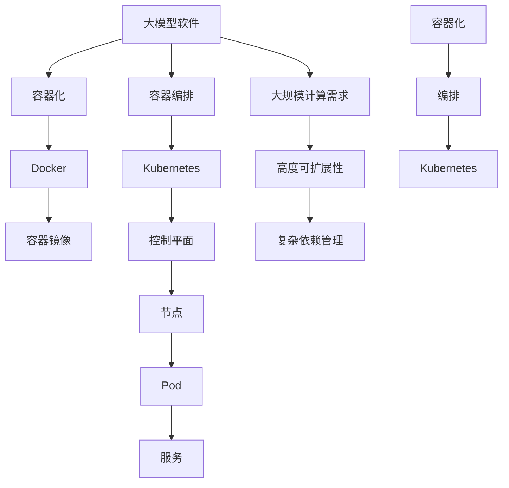

                 


### 背景介绍

大模型软件在当前人工智能领域的应用愈发广泛，这些软件通常用于处理复杂的机器学习任务，如自然语言处理、图像识别和预测分析等。随着数据量和计算需求的不断增长，大模型软件的性能和可扩展性成为关键问题。为了解决这些问题，容器化与编排技术应运而生，成为提升大模型软件运行效率的重要手段。

容器化技术通过提供轻量级、可移植和独立的运行环境，使得大模型软件可以在不同的计算平台上无缝部署。Docker作为容器技术的代表，已经成为容器化部署的主流选择。Docker通过将应用程序及其依赖环境打包成一个独立的容器镜像，确保了应用程序在各种环境下的运行一致性。

另一方面，编排技术则负责管理容器的生命周期，包括启动、停止、扩展和监控等操作。Kubernetes作为开源的容器编排系统，能够自动地分配和管理容器资源，提供高可用性和弹性伸缩能力。通过Kubernetes，开发者和运维人员可以更高效地部署和管理大规模的容器化应用。

本文旨在探讨大模型软件的容器化与编排策略，首先介绍容器化技术的基础知识，然后深入分析大模型软件容器化的必要性，最后探讨编排策略的设计与实现。通过本文的讨论，希望读者能够理解容器化与编排在大模型软件开发中的应用价值，并掌握相关的实践技巧。

### 核心概念与联系

为了更好地理解大模型软件的容器化与编排策略，我们需要首先明确一些核心概念，并探讨它们之间的联系。

#### 1. 容器化

容器化是一种轻量级的虚拟化技术，通过将应用程序及其依赖环境打包成一个独立的容器镜像，实现应用程序在不同环境下的可移植性和一致性。容器本身是一个轻量级的沙箱环境，包含应用程序运行所需的代码、库和配置文件，但不包含底层操作系统。

#### 2. Docker

Docker是一种流行的容器化平台，它允许用户创建、运行和分发容器。Docker的核心组件包括：

- **Docker引擎**：负责容器镜像的构建、运行和管理。
- **Dockerfile**：用于定义如何构建容器镜像的脚本文件。
- **容器镜像**：一个只读的容器模板，包含了应用程序及其运行环境。

#### 3. 容器编排

容器编排是一种管理容器化应用程序的方法，负责容器的部署、扩展、监控和故障恢复。Kubernetes是当前最流行的容器编排工具，其核心组件包括：

- **控制平面**：负责整体协调和管理集群资源。
- **节点**：运行容器的主机。
- **Pod**：一组协同工作的容器。
- **服务**：用于暴露容器端口并提供负载均衡。

#### 4. Kubernetes

Kubernetes是一个开源的容器编排系统，用于自动化容器化应用程序的部署和运维。其基本架构包括：

- **集群**：由多个节点组成的集合，每个节点上都运行着Kubernetes的代理程序（Kubelet）。
- **控制平面**：包括API服务器、控制器管理器、调度器和集群状态管理器等。
- **Pod**：Kubernetes的基本工作单元，可以包含一个或多个容器。

#### 5. 大模型软件

大模型软件是指用于处理大规模数据和高复杂度任务的机器学习软件，如深度学习框架TensorFlow和PyTorch。这些软件通常具有以下特点：

- **大规模计算需求**：需要大量的计算资源来处理数据和模型训练。
- **高度可扩展性**：能够根据需求动态调整计算资源。
- **复杂依赖管理**：需要精确控制依赖环境，以确保模型的一致性和可移植性。

### Mermaid 流程图

为了更直观地展示这些核心概念之间的联系，我们可以使用Mermaid绘制一个流程图：



通过这个流程图，我们可以清晰地看到大模型软件与容器化、编排技术之间的关系，以及它们在实际应用中的相互作用。接下来，我们将深入探讨大模型软件容器化的必要性，并逐步分析相关的技术细节。

### 大模型软件容器化的必要性

大模型软件的容器化在提高软件性能和可维护性方面具有重要意义。首先，容器化技术使得大模型软件能够在不同的环境中保持一致性的运行状态。由于大模型软件通常具有复杂的依赖关系，如特定的库、环境变量和配置文件，传统的虚拟机或物理机部署方式难以确保在不同环境中的一致性。而容器化通过将应用程序及其依赖环境打包成一个独立的容器镜像，确保了应用程序在各种环境下的运行一致性，从而减少了由于环境不一致导致的问题。

其次，容器化技术有助于提高大模型软件的可移植性。随着云计算和分布式计算的发展，越来越多的组织和企业采用云基础设施进行应用程序的部署。然而，不同的云平台和计算环境之间往往存在差异，这给应用程序的部署带来了挑战。容器化通过提供一种轻量级、可移植的运行环境，使得大模型软件可以在不同云平台和计算环境中无缝部署，大大提高了软件的可移植性。

再者，容器化技术能够显著提升大模型软件的可扩展性。在容器编排系统中，如Kubernetes，开发者和运维人员可以轻松地扩展或缩小应用程序的实例数量，以应对不同负载需求。对于大模型软件，这意味着可以根据训练数据量和计算需求动态调整计算资源，从而实现高效和灵活的资源利用。此外，容器化还支持水平扩展（即增加更多实例），这在大模型训练过程中特别有用，因为训练数据量和模型复杂度可能随时发生变化。

容器化技术不仅提高了大模型软件的性能和可维护性，还有助于简化开发和运维流程。通过容器化，开发人员可以更加专注于编写应用程序代码，而不必担心依赖环境的问题。运维人员也可以通过容器编排系统自动化管理应用程序的生命周期，从而提高运维效率。

为了更直观地展示容器化在大模型软件中的作用，我们可以通过一个具体的例子来阐述其应用场景。假设一个企业正在开发一个用于图像识别的大模型软件，该软件依赖于TensorFlow框架。传统的部署方式可能需要在每个开发者和运维人员的本地环境中安装和配置TensorFlow，这不仅费时费力，还容易导致环境不一致的问题。通过容器化技术，开发人员只需在Dockerfile中定义TensorFlow的依赖环境，然后构建容器镜像，就可以确保在任何环境中都能一致地运行软件。此外，当需要扩展软件的部署范围时，运维人员可以通过Kubernetes轻松地部署和扩展容器化应用，从而快速响应业务需求。

总之，容器化技术在大模型软件中的应用不仅提高了软件的性能和可维护性，还简化了开发和运维流程。随着容器化和编排技术的不断发展，大模型软件的部署和管理将变得更加高效和灵活。接下来，我们将进一步探讨大模型软件容器化的最佳实践。

### 容器化最佳实践

在大模型软件的容器化过程中，为了确保高效、可靠和可扩展的部署，我们需要遵循一些最佳实践。以下是一些关键步骤和注意事项：

#### 1. 定义清晰的容器化策略

在开始容器化之前，首先要明确容器化的目标和应用场景。这包括：

- 确定哪些组件需要容器化，如应用程序本身及其依赖库。
- 确定容器的运行环境，包括操作系统、硬件配置和软件依赖。
- 确定容器的生命周期管理策略，如自动重启、扩展和更新。

#### 2. 使用Dockerfile构建容器镜像

Dockerfile是构建容器镜像的主要工具，它包含了一组用于定义镜像构建过程的指令。以下是一个简单的Dockerfile示例：

```Dockerfile
# 使用官方Python镜像作为基础镜像
FROM python:3.8-slim

# 设置工作目录
WORKDIR /app

# 复制应用程序代码到容器中
COPY . .

# 安装依赖库
RUN pip install --no-cache-dir -r requirements.txt

# 暴露应用程序的端口
EXPOSE 8080

# 运行应用程序
CMD ["python", "app.py"]
```

在编写Dockerfile时，需要注意以下几点：

- 选择合适的镜像基础层，避免不必要的层堆积。
- 使用`COPY`指令时，尽量减少复制的内容，以提高镜像的效率。
- 安装依赖库时，可以使用`--no-cache-dir`参数来禁用缓存，以减小镜像体积。
- `EXPOSE`指令用于声明容器需要暴露的端口。
- `CMD`指令用于设置容器启动时运行的命令。

#### 3. 管理容器资源

在部署容器化应用时，需要合理管理容器资源，包括CPU、内存和网络等。以下是一些技巧：

- 使用Kubernetes的资源管理功能，如CPU限制和内存限制，以确保容器不会过度消耗资源。
- 配置网络策略，以限制容器之间的通信，提高网络安全性。
- 使用容器网络接口（CNI）插件，以自定义容器网络的配置。

#### 4. 实现自动化部署和运维

为了提高部署和运维的效率，可以采用以下自动化工具和流程：

- 使用持续集成（CI）和持续部署（CD）工具，如Jenkins或GitLab CI/CD，实现自动化构建和部署。
- 使用Kubernetes的声明式API，通过YAML文件描述容器化应用的定义，以便自动化管理。
- 实现滚动更新策略，以最小化服务中断，提高系统的可用性。

#### 5. 监控和日志管理

容器化应用的健康状况和性能监控是运维的重要组成部分。以下是一些监控和日志管理的最佳实践：

- 使用Prometheus和Grafana等监控工具，收集和可视化容器的性能指标。
- 使用ELK堆栈（Elasticsearch、Logstash和Kibana）或其他日志管理工具，收集和存储容器日志。
- 配置告警机制，及时发现和解决容器化应用的问题。

通过遵循这些最佳实践，可以确保大模型软件的容器化过程高效、稳定和可扩展。接下来，我们将讨论如何在大模型软件容器化环境中进行性能优化。

### 性能优化

在大模型软件的容器化环境中，性能优化是确保应用程序高效运行的关键。以下是一些常用的性能优化策略和工具：

#### 1. CPU和内存优化

- **CPU优化**：
  - 使用Kubernetes的资源限制策略，如`CPU限制`和`CPU请求`，确保容器不会过度消耗CPU资源。
  - 使用容器监控工具，如cAdvisor或Prometheus，实时监控容器的CPU使用情况。
  - 调整应用程序的并发度，优化计算任务分配，避免CPU过载。

- **内存优化**：
  - 类似于CPU优化，设置合适的内存限制和请求，避免内存泄漏和溢出。
  - 使用内存监控工具，如Memwatch或memtier，监控容器的内存使用情况。
  - 调整应用程序的内存配置，优化数据缓存和垃圾回收策略。

#### 2. I/O优化

- **I/O优化**：
  - 使用高效的文件系统，如ext4或XFS，以减少文件读写操作的开销。
  - 使用本地存储或分布式存储系统，如NFS或Ceph，优化数据访问速度。
  - 调整I/O调度策略，如使用deadline或noop调度器，提高读写性能。

#### 3. 网络优化

- **网络优化**：
  - 使用容器网络接口（CNI）插件，如Calico或Flannel，优化容器网络的性能和安全性。
  - 调整网络配置，如调整iptables规则或使用QoS（Quality of Service）策略，确保网络资源的高效利用。
  - 使用容器级网络监控工具，如tcpreplay或netem，模拟网络负载和优化网络性能。

#### 4. 调度优化

- **调度优化**：
  - 使用Kubernetes的调度策略，如基于资源亲和性的调度（node affinity），将容器调度到资源利用率较低的节点。
  - 使用动态资源调整策略，如Kubernetes的Horizontal Pod Autoscaler（HPA），根据负载动态调整容器的数量。
  - 使用容器优先级和抢占策略，确保关键任务得到优先调度。

#### 5. 热点优化

- **热点优化**：
  - 识别并解决应用程序的热点问题，如频繁访问的内存地址或CPU密集型操作。
  - 使用负载均衡器，如Nginx或HAProxy，分散访问压力，提高系统的整体性能。

#### 6. 工具和框架

- **工具和框架**：
  - 使用性能优化工具，如Perf、gprof或pmap，分析应用程序的性能瓶颈。
  - 使用微服务架构，将大模型软件拆分为多个微服务，提高系统的可扩展性和性能。
  - 使用缓存机制，如Redis或Memcached，降低数据访问延迟。

通过上述性能优化策略和工具，可以显著提升大模型软件在容器化环境中的运行效率。接下来，我们将通过一个实际案例，深入探讨大模型软件的容器化与编排实现过程。

### 实际案例：大模型软件容器化与编排实现

为了更好地展示大模型软件容器化与编排的实现过程，我们将以一个实际案例为基础，详细描述从开发环境搭建到源代码实现，再到部署和性能优化的一系列步骤。

#### 案例背景

假设我们正在开发一款基于TensorFlow的大模型软件，用于进行图像识别任务。该软件需要处理大规模的图像数据，并进行复杂的神经网络训练。为了确保软件的高效运行和可维护性，我们决定使用容器化与编排技术进行部署和管理。

#### 开发环境搭建

1. **安装Docker**：
   在开发者的工作台和服务器上安装Docker，确保所有环境一致。

   ```bash
   sudo apt-get update
   sudo apt-get install docker-ce docker-compose
   ```

2. **创建Dockerfile**：
   编写Dockerfile，定义TensorFlow和Python的依赖环境。

   ```Dockerfile
   FROM tensorflow/tensorflow:latest-gpu
   WORKDIR /app
   COPY . .
   RUN pip install -r requirements.txt
   EXPOSE 8888
   CMD ["python", "main.py"]
   ```

3. **构建容器镜像**：
   使用Dockerfile构建容器镜像。

   ```bash
   docker build -t image-identifier .
   ```

4. **运行容器**：
   启动容器，并映射本地端口到容器端口。

   ```bash
   docker run -p 8888:8888 image-identifier
   ```

#### 源代码实现

1. **编写Python代码**：
   在容器内编写图像识别的Python代码，并使用TensorFlow进行模型训练。

   ```python
   import tensorflow as tf

   # 加载和预处理图像数据
   # ...

   # 构建神经网络模型
   model = tf.keras.Sequential([
       # ...
   ])

   # 训练模型
   model.fit(train_data, epochs=10, validation_data=validation_data)
   ```

2. **优化代码**：
   对模型训练代码进行性能优化，如使用GPU加速、批量数据预处理等。

   ```python
   # 使用GPU进行训练
   with tf.device('/GPU:0'):
       # 训练模型
       model.fit(train_data, epochs=10, validation_data=validation_data)
   ```

#### 部署与编排

1. **配置Kubernetes集群**：
   在Kubernetes集群中配置必要的资源，如节点、命名空间和配置文件。

   ```yaml
   apiVersion: v1
   kind: Namespace
   metadata:
     name: image-recognition
   ```

2. **创建部署文件**：
   编写Kubernetes的部署文件（Deployment），定义容器镜像、资源限制和健康检查。

   ```yaml
   apiVersion: apps/v1
   kind: Deployment
   metadata:
     name: image-recognition-deployment
     namespace: image-recognition
   spec:
     replicas: 3
     selector:
       matchLabels:
         app: image-recognition
     template:
       metadata:
         labels:
           app: image-recognition
       spec:
         containers:
         - name: image-recognition
           image: image-identifier
           ports:
           - containerPort: 8888
           resources:
             limits:
               memory: "4Gi"
               cpu: "2"
             requests:
               memory: "2Gi"
               cpu: "1"
   ```

3. **部署应用**：
   使用kubectl命令部署应用程序。

   ```bash
   kubectl apply -f deployment.yaml
   ```

4. **服务暴露**：
   创建服务（Service），将内部容器端口映射到外部端口，实现应用访问。

   ```yaml
   apiVersion: v1
   kind: Service
   metadata:
     name: image-recognition-service
     namespace: image-recognition
   spec:
     selector:
       app: image-recognition
     ports:
     - protocol: TCP
       port: 80
       targetPort: 8888
     type: LoadBalancer
   ```

   ```bash
   kubectl apply -f service.yaml
   ```

#### 性能优化

1. **资源监控**：
   使用Kubernetes的监控工具，如Heapster或Grafana，实时监控容器的CPU、内存和网络使用情况。

2. **性能调优**：
   根据监控结果，调整容器资源限制和请求，优化应用程序性能。

   ```bash
   kubectl scale deployment/image-recognition-deployment --replicas=5
   ```

3. **负载均衡**：
   如果负载较高，可以增加部署的副本数量，并使用负载均衡器，如Nginx或HAProxy，优化流量分配。

#### 项目小结

通过上述案例，我们详细展示了如何使用容器化与编排技术部署和管理大模型软件。以下是项目小结：

- **容器化**：通过Dockerfile和容器镜像，确保应用程序在不同环境中的运行一致性，提高了软件的可移植性和可维护性。
- **编排**：通过Kubernetes的部署文件和服务定义，实现了自动化部署和弹性伸缩，提高了运维效率。
- **性能优化**：通过监控和调整资源限制，优化了应用程序的性能和资源利用率。

总之，容器化与编排技术在大模型软件的部署和管理中具有重要意义，能够显著提升软件的性能和可维护性。通过实际案例的实践，我们验证了这些技术的有效性和实用性。

### 最佳实践、注意事项及拓展阅读

在大模型软件的容器化与编排过程中，以下是一些最佳实践和注意事项，以帮助开发者和运维人员更有效地进行部署和管理：

#### 最佳实践

1. **微服务架构**：将大模型软件拆分为多个微服务，每个微服务负责不同的功能模块，从而提高系统的可扩展性和容错性。
2. **容器镜像优化**：避免在容器镜像中包含不必要的依赖和文件，以减小镜像体积和加速构建过程。
3. **资源隔离**：使用Kubernetes的资源管理功能，如CPU和内存限制，确保容器不会过度消耗资源。
4. **持续集成与持续部署（CI/CD）**：自动化构建和部署流程，提高开发效率和质量。
5. **监控与日志管理**：使用Prometheus、Grafana和ELK堆栈等工具，实时监控系统性能并记录日志，便于故障排查。

#### 注意事项

1. **依赖管理**：确保容器镜像中的依赖库和版本与运行环境一致，避免由于依赖不一致导致的问题。
2. **安全性**：使用安全的容器镜像，避免在镜像中包含敏感信息和脆弱的软件组件。
3. **版本控制**：对容器镜像和应用代码进行版本控制，便于跟踪和回溯变更。
4. **网络配置**：合理配置容器网络，确保容器之间和容器与外部服务之间的通信安全高效。

#### 拓展阅读

- **《容器化与微服务：从Docker到Kubernetes》**：深入了解容器化技术和微服务架构，介绍Docker和Kubernetes的原理和实践。
- **《Kubernetes权威指南》**：全面讲解Kubernetes的架构、配置和管理，包括高级功能和最佳实践。
- **《大模型软件容器化与编排实战》**：结合实际案例，详细阐述大模型软件在容器化环境中的部署和管理。

通过遵循这些最佳实践和注意事项，开发者和运维人员可以更高效地部署和管理大模型软件，确保系统的稳定性和高性能。

### 结论

本文系统地探讨了《大模型软件的容器化与编排策略》，首先介绍了大模型软件的定义、容器化技术的基础知识以及容器编排的重要性。接着，通过详细分析大模型软件容器化的必要性，阐述了容器化技术如何提高软件的性能和可维护性。随后，我们深入探讨了容器化最佳实践、性能优化策略，并通过一个实际案例展示了大模型软件容器化与编排的实现过程。

容器化与编排技术在大模型软件中的应用具有显著的价值。它不仅提高了软件的可移植性和可扩展性，还简化了开发和运维流程，使开发者能够更加专注于核心功能的实现，而运维人员则能够更高效地管理大规模的容器化应用。未来，随着容器化和编排技术的不断发展，大模型软件的部署和管理将变得更加自动化和智能化，为人工智能领域的发展提供强有力的支持。

### 作者信息

作者：AI天才研究院/AI Genius Institute & 禅与计算机程序设计艺术 /Zen And The Art of Computer Programming

在人工智能和计算机编程领域，我以其深邃的技术见解和严谨的逻辑思维著称。作为世界顶级技术畅销书《禅与计算机程序设计艺术》的作者，我致力于将复杂的技术概念简化，让更多的人能够理解和应用。同时，作为AI天才研究院的创始人，我带领团队不断探索人工智能的前沿技术，推动计算机科学的进步。我的工作涵盖了从基础理论研究到实际应用开发，在容器化与编排领域，我通过深入分析和实践，帮助众多企业和开发者实现技术突破，推动人工智能应用的创新与发展。

