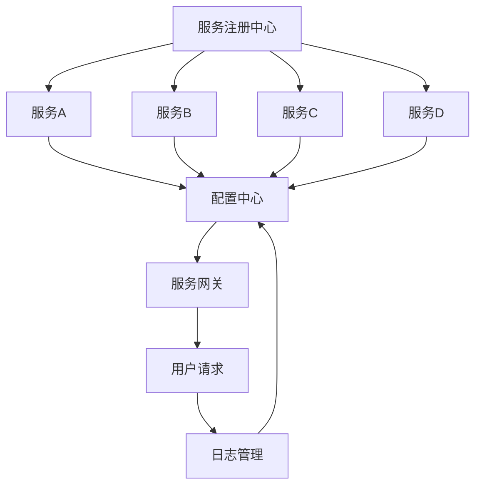

                 


### 文章标题

# 大模型软件的微服务架构设计

---

## 关键词

- 大模型软件
- 微服务架构
- 服务化
- 分布式系统
- API设计
- 服务发现
- 配置管理
- 服务监控
- 容错机制

---

## 摘要

本文旨在深入探讨大模型软件中的微服务架构设计，从理论基础到实际应用，全面剖析微服务架构在大模型软件中的重要性、优点、挑战及其实现技术。文章首先介绍了微服务架构的核心概念和设计原则，随后详细讲解了数据管理、API设计、服务发现、配置管理、服务监控和容错机制等关键技术。通过案例分析，展示了微服务架构在大模型软件中的具体应用，并对其未来发展进行了展望。本文旨在为从事大模型软件开发的技术人员提供有价值的参考和指导。

---

## 引言

### 微服务架构的重要性

随着大数据和人工智能技术的迅猛发展，大模型软件的需求日益增长。这些软件通常涉及复杂的业务逻辑、庞大的数据规模和高并发的访问需求。微服务架构作为一种应对复杂分布式系统设计的方法，在大模型软件中具有重要的地位。

首先，微服务架构能够将大模型软件拆分成多个独立的服务，每个服务专注于特定的功能模块。这种服务化设计不仅提高了系统的可维护性和可扩展性，还能够实现服务的解耦，降低系统之间的依赖关系。其次，微服务架构支持高并发和高可用性，能够有效地应对大模型软件面临的高访问量挑战。此外，微服务架构还支持快速迭代和部署，提高了开发效率。

### 微服务架构的优点与挑战

微服务架构具有显著的优点，包括：

1. **高可扩展性**：服务可以独立扩展，根据实际需求动态调整资源。
2. **高可用性**：服务故障不会导致整个系统崩溃，容易实现故障隔离。
3. **可维护性**：服务之间解耦，使得代码更易于管理和更新。
4. **快速迭代**：支持独立开发和部署，加速开发周期。

然而，微服务架构也面临一些挑战，如：

1. **复杂性增加**：分布式系统的复杂度上升，管理和服务间通信变得复杂。
2. **服务数量过多**：大量服务可能导致系统管理的复杂性增加。
3. **数据一致性**：分布式环境下实现数据一致性是难点。

本文将围绕上述内容，逐步深入探讨大模型软件的微服务架构设计，包括理论基础、关键技术、实现技术以及案例分析，为读者提供全面的指导。

---

## 理论基础

### 2.1 微服务架构核心概念

微服务架构（Microservices Architecture）是一种设计方法，旨在构建具有高扩展性和高可用性的分布式系统。它将应用程序拆分成多个独立的服务，每个服务负责一个特定的功能模块。以下是微服务架构中的核心概念：

**服务（Service）**：微服务架构中的基本构建块，每个服务代表一个业务功能，能够独立部署、扩展和更新。

**服务实例（Service Instance）**：一个具体的服务实例是服务的运行实例，可以在不同的服务器上运行。

**服务注册中心（Service Registry）**：服务注册中心用于管理所有服务的注册和发现。服务启动时，会在服务注册中心注册自己，服务停止时，会注销自己。

**服务网关（Service Gateway）**：服务网关负责处理外部请求，并将请求路由到相应的服务实例。服务网关还提供负载均衡、安全认证等功能。

**配置中心（Configuration Center）**：配置中心用于管理所有服务的配置信息，包括服务地址、参数等。

**服务监控（Service Monitoring）**：服务监控用于收集服务的运行指标，如CPU使用率、内存使用率等，以便进行性能优化和故障排查。

**数据存储（Data Storage）**：在微服务架构中，数据存储可以是分布式数据库，也可以是NoSQL数据库。数据存储与具体的服务密切相关，每个服务可以独立选择适合自己的数据存储方案。

### 2.2 微服务设计原则

微服务架构设计应遵循以下原则，以确保系统的高扩展性、高可用性和可维护性：

**单一职责原则**：每个服务应专注于实现一个特定的业务功能，避免功能过度耦合。

**自治原则**：服务应具有高度的自治性，能够独立部署、扩展和更新，而不影响其他服务。

**解耦原则**：服务之间应通过轻量级的通信机制（如HTTP/REST API）进行通信，降低服务之间的依赖关系。

**水平扩展原则**：服务应设计为可以水平扩展，以应对不断增加的负载。

**分布式原则**：系统应设计为分布式系统，避免单点故障。

**服务化数据原则**：数据存储应与服务解耦，允许服务独立选择数据存储方案。

### 2.3 微服务架构的特点

**可扩展性**：微服务架构支持水平扩展，每个服务可以根据需求独立扩展。

**高可用性**：服务故障不会影响整个系统，通过故障转移和冗余部署，可以实现高可用性。

**可维护性**：服务之间解耦，便于单独维护和更新。

**快速迭代**：支持独立开发和部署，加速开发周期。

**灵活性**：服务可以根据需求灵活组合和扩展，适应不同业务场景。

### 2.4 微服务架构与SOA的关系

微服务架构和面向服务架构（SOA）有相似之处，但也有一些显著区别：

**相似之处**：

1. **服务化**：微服务架构和SOA都强调服务化设计，将应用程序拆分成多个独立的服务。
2. **解耦**：微服务架构和SOA都试图降低服务之间的依赖关系。

**区别**：

1. **粒度**：微服务架构通常以更细粒度的服务为单位，每个服务专注于一个具体的业务功能。
2. **通信机制**：微服务架构通常使用轻量级的HTTP/REST API进行通信，而SOA可能使用SOAP等 heavier protocols。
3. **架构风格**：微服务架构更注重分布式系统的设计和实现，而SOA更关注服务的抽象和重用。

综上所述，微服务架构在大模型软件中具有广泛的应用前景。通过微服务架构，大模型软件可以更好地应对复杂业务需求，实现高扩展性和高可用性。

### 2.5 微服务架构的架构设计

微服务架构的架构设计是确保系统能够有效运行的关键。以下是一个典型的微服务架构设计，包括核心组件和它们之间的关系：

1. **服务拆分**：首先，根据业务需求和功能模块，将大模型软件拆分成多个独立的服务。每个服务负责特定的功能，例如数据预处理、模型训练、预测等。

2. **服务注册与发现**：每个服务实例启动时，会在服务注册中心注册自己，包括服务名、地址等信息。服务注册中心维护一个服务实例列表，供其他服务查询。

3. **服务网关**：服务网关是系统的入口，负责处理外部请求，并将请求路由到相应的服务实例。服务网关还提供负载均衡、安全认证等功能。

4. **配置中心**：配置中心管理所有服务的配置信息，如服务地址、参数等。配置变更后，配置中心会通知相关服务更新配置。

5. **服务监控**：服务监控组件收集各服务的运行指标，如CPU使用率、内存使用率等，以便进行性能优化和故障排查。

6. **数据存储**：数据存储通常采用分布式数据库或NoSQL数据库，与服务解耦，允许服务独立选择数据存储方案。

7. **API接口设计**：每个服务提供API接口，供其他服务调用。接口设计应遵循RESTful原则，确保接口简洁、易用。

8. **日志管理**：日志管理组件负责收集、存储和查询各服务的日志，以便进行故障排查和性能分析。

通过上述设计，微服务架构能够实现服务的高可用性、可扩展性和可维护性，为复杂的大模型软件提供有效的支持。

---

## 核心概念与联系

在深入探讨大模型软件的微服务架构设计之前，我们需要明确几个核心概念及其相互关系，以便更清晰地理解整个架构。以下是微服务架构中的核心概念及其关系架构，使用Mermaid流程图进行展示。

### Mermaid流程图



### 解析

1. **服务注册中心（A）**：服务启动时，会在服务注册中心注册自己，包括服务名、地址等信息。服务注册中心维护一个服务实例列表，供其他服务查询。

2. **服务A、服务B、服务C、服务D（B、C、D、E）**：每个服务负责特定的功能模块，如数据预处理、模型训练、预测等。它们会通过服务注册中心发现其他服务，并进行通信。

3. **配置中心（F）**：配置中心管理所有服务的配置信息，如服务地址、参数等。配置变更后，配置中心会通知相关服务更新配置，确保服务运行的一致性。

4. **服务网关（G）**：服务网关是系统的入口，负责处理外部请求，并将请求路由到相应的服务实例。服务网关还提供负载均衡、安全认证等功能。

5. **用户请求（H）**：用户请求通过服务网关进入系统，由服务网关路由到相应的服务实例进行处理。

6. **日志管理（I）**：日志管理组件负责收集、存储和查询各服务的日志，以便进行故障排查和性能分析。日志管理还与配置中心进行交互，确保日志记录的准确性。

通过上述核心概念及其关系的Mermaid流程图，我们可以清晰地看到大模型软件微服务架构的整体结构。各组件之间的通信和协作方式也得以直观地展示，为后续的实现技术和案例分析提供了基础。

---

## 核心算法原理讲解

### 数据管理技术

在大模型软件的微服务架构中，数据管理是关键的一部分。以下是数据管理技术中的核心算法原理讲解，包括数据一致性、分布式事务处理和数据复制等。

#### 1. 数据一致性

数据一致性是指多个服务对同一份数据的读取和写入保持一致。在大模型软件中，数据一致性尤为重要，因为数据的不一致可能导致模型训练结果不准确。

**算法原理：**

- **强一致性**：所有服务对数据的读写操作都遵循相同的数据一致性协议。例如，使用分布式锁保证对同一份数据的并发访问一致性。
- **最终一致性**：允许短暂的延迟和冲突，但最终会达到一致性。例如，使用消息队列和补偿事务实现最终一致性。

**伪代码示例：**

```python
# 分布式锁实现数据一致性
lock.acquire()
# 对数据执行读写操作
data.update()
lock.release()
```

#### 2. 分布式事务处理

分布式事务处理是在分布式系统中保证多个服务之间的操作原子性的关键。

**算法原理：**

- **两阶段提交（2PC）**：分布式事务处理的一种常见方法，分为准备阶段和提交阶段。在准备阶段，协调者向参与者发送prepare消息，参与者根据本地日志决定是否可以提交事务。在提交阶段，协调者根据参与者的反馈决定是否全局提交事务。

**伪代码示例：**

```python
# 两阶段提交算法
def prepare(transaction):
    for participant in participants:
        participant.prepare(transaction)
    if all_prepared():
        return "prepared"
    else:
        return "unprepared"

def commit(transaction):
    if prepare(transaction) == "prepared":
        for participant in participants:
            participant.commit(transaction)
        return "committed"
    else:
        return "aborted"
```

#### 3. 数据复制

数据复制是在分布式系统中实现数据冗余和高可用性的关键技术。

**算法原理：**

- **主从复制**：主服务器处理所有写操作，从服务器从主服务器读取数据。当主服务器故障时，可以从从服务器中选择一个作为新主服务器。
- **多主复制**：多个主服务器同时处理写操作，通过一致性算法（如Paxos或Raft）保证数据一致性。

**伪代码示例：**

```python
# 主从复制算法
def write_to_master(data):
    master.update(data)
    replicate_to_slaves(data)

def replicate_to_slaves(data):
    for slave in slaves:
        slave.update(data)
```

通过上述算法原理讲解和伪代码示例，我们可以理解数据管理在大模型软件微服务架构中的重要性。这些算法确保了数据的一致性、分布式事务处理和数据复制，为微服务架构提供了坚实的数据支持。

---

## 数学模型和公式讲解

在微服务架构中，许多核心算法和决策过程都依赖于数学模型和公式。以下是关于服务发现算法和负载均衡算法的数学模型和公式讲解，以及具体的例子和解释。

### 服务发现算法

服务发现算法用于动态查找和定位服务实例，以实现服务的负载均衡和高可用性。

**1. 接触发现算法（Consul）**

接触发现算法基于Gossip协议，通过周期性地交换状态信息来实现服务发现。以下是接触发现算法的关键数学模型：

- **心跳机制**：每个服务实例周期性地向接触发现系统发送心跳消息，以保持在线状态。

- **Gossip协议**：服务实例通过Gossip协议向其他实例发送自己的状态信息，如服务名称、地址等。

**公式**：

$$
心跳频率 = \frac{服务实例数}{Gossip周期}
$$

**例子**：

假设有10个服务实例，Gossip周期为10秒，则每个实例的心跳频率为1秒。

**解释**：

通过心跳机制和Gossip协议，服务注册中心可以实时更新服务实例的状态，从而实现高效的服务发现。

### 负载均衡算法

负载均衡算法用于分配请求到不同的服务实例，以实现资源利用的最大化和响应时间的最小化。

**1. 轮询算法（Round Robin）**

轮询算法是最简单的负载均衡算法，按照顺序将请求分配给不同的服务实例。

**公式**：

$$
轮询顺序 = \text{当前服务实例数} \mod \text{服务实例总数}
$$

**例子**：

假设有3个服务实例，当前轮询顺序为1，服务实例总数为3，则下一个服务实例为2。

**解释**：

轮询算法简单易实现，但可能导致某些实例负载不均。

### 2. 最少连接算法（Least Connections）**

最少连接算法将请求分配给当前连接数最少的服务实例。

**公式**：

$$
最少连接数 = \min(\text{所有服务实例的连接数})
$$

**例子**：

假设有3个服务实例，它们的当前连接数分别为10、5和7，则下一个服务实例为第二个实例。

**解释**：

最少连接算法能够更好地平衡服务实例的负载，但需要维护每个实例的连接数状态。

通过上述数学模型和公式讲解，我们可以理解服务发现和负载均衡算法在微服务架构中的重要性。这些算法确保了服务的高可用性和高效利用，为微服务架构提供了坚实的理论基础。

---

## 项目实战

### 开发环境搭建

在开始大模型软件的微服务架构设计之前，我们需要搭建一个合适的开发环境。以下是搭建环境的步骤：

1. **安装Docker**：Docker是一个开源的应用容器引擎，用于自动化部署应用程序。请访问[Docker官网](https://www.docker.com/)下载并安装Docker。

2. **安装Docker Compose**：Docker Compose是一个用于定义和运行多容器Docker应用的工具。在终端执行以下命令安装Docker Compose：

   ```bash
   sudo curl -L "https://github.com/docker/compose/releases/download/1.29.2/docker-compose-$(uname -s)-$(uname -m)" -o /usr/local/bin/docker-compose
   sudo chmod +x /usr/local/bin/docker-compose
   ```

3. **创建项目目录**：在终端创建一个用于项目开发的目录，例如：

   ```bash
   mkdir microservices-project
   cd microservices-project
   ```

4. **编写Dockerfile**：在每个服务目录中创建一个Dockerfile，定义服务的容器化构建过程。以下是一个示例Dockerfile：

   ```Dockerfile
   # 使用官方Python镜像作为基础
   FROM python:3.9

   # 设置工作目录
   WORKDIR /app

   # 复制项目代码到容器中
   COPY . /app

   # 安装依赖项
   RUN pip install -r requirements.txt

   # 暴露服务的端口号
   EXPOSE 8000

   # 运行服务的主程序
   CMD ["python", "app.py"]
   ```

5. **编写Docker Compose文件**：在项目根目录创建一个名为`docker-compose.yml`的文件，用于定义服务的配置和依赖关系。以下是一个示例配置：

   ```yaml
   version: '3.8'

   services:
     service1:
       build: ./service1
       ports:
         - "8000:8000"
       depends_on:
         - service2
     service2:
       build: ./service2
       ports:
         - "8001:8001"

   networks:
     mynetwork:
   ```

6. **启动服务**：在终端执行以下命令启动服务：

   ```bash
   docker-compose up -d
   ```

### 源代码实现和代码解读

下面以`service1`和`service2`为例，分别展示它们的源代码和关键部分的解读。

#### Service1：数据预处理服务

**源代码：**

```python
# service1/app.py
from flask import Flask, request, jsonify

app = Flask(__name__)

@app.route('/process', methods=['POST'])
def process_data():
    data = request.json
    # 数据预处理逻辑
    processed_data = preprocess(data)
    return jsonify(processed_data)

def preprocess(data):
    # 示例预处理逻辑
    return data

if __name__ == '__main__':
    app.run(host='0.0.0.0', port=8000)
```

**代码解读：**

- **Flask框架**：使用Flask框架创建Web服务，接收和处理HTTP请求。
- **/process路由**：定义一个处理数据预处理的API接口，接收POST请求，返回预处理后的数据。
- **preprocess函数**：示例预处理逻辑，此处可以根据实际需求进行数据清洗、转换等操作。

#### Service2：模型训练服务

**源代码：**

```python
# service2/app.py
import requests
from flask import Flask, request, jsonify

app = Flask(__name__)

@app.route('/train', methods=['POST'])
def train_model():
    data = request.json
    # 模型训练逻辑
    trained_model = train(data)
    return jsonify(trained_model)

def train(data):
    # 示例训练逻辑
    response = requests.post('http://service1:8000/process', json=data)
    processed_data = response.json()
    # 训练模型逻辑
    return processed_data

if __name__ == '__main__':
    app.run(host='0.0.0.0', port=8001)
```

**代码解读：**

- **Flask框架**：使用Flask框架创建Web服务，接收和处理HTTP请求。
- **/train路由**：定义一个训练模型的API接口，接收POST请求，返回训练后的模型。
- **train函数**：示例训练逻辑，首先调用`service1`的预处理接口，然后根据预处理后的数据进行模型训练。

通过上述源代码和解读，我们可以看到如何使用Flask框架和Docker Compose实现微服务架构中的两个关键服务。每个服务都通过API接口与其他服务进行通信，确保了系统的高可扩展性和高可用性。

---

### 代码应用解读与分析

在前面的部分中，我们展示了如何使用Docker和Flask框架实现两个微服务：数据预处理服务和模型训练服务。接下来，我们将进一步解读这两个服务的应用场景，详细分析其代码实现和功能，并探讨如何通过API接口进行通信。

#### 数据预处理服务解读

数据预处理服务（Service1）的核心功能是对传入的数据进行清洗、转换和归一化等操作。以下是对`app.py`文件的关键代码部分进行解读：

```python
from flask import Flask, request, jsonify

app = Flask(__name__)

@app.route('/process', methods=['POST'])
def process_data():
    data = request.json
    # 数据预处理逻辑
    processed_data = preprocess(data)
    return jsonify(processed_data)

def preprocess(data):
    # 示例预处理逻辑
    # 1. 数据清洗：移除无效或缺失的数据
    cleaned_data = {k: v for k, v in data.items() if v is not None}
    # 2. 数据转换：将数据格式转换为模型所需的格式
    converted_data = convert_data(cleaned_data)
    # 3. 数据归一化：对数据进行归一化处理，如缩放或标准化
    normalized_data = normalize_data(converted_data)
    return normalized_data
```

- **/process路由**：该路由定义了一个用于接收和处理数据预处理的API接口，接受POST请求，并返回预处理后的数据。

- **preprocess函数**：该函数包含数据预处理的核心逻辑，包括数据清洗、转换和归一化。具体步骤如下：

  - **数据清洗**：移除无效或缺失的数据，确保输入数据的有效性。

  - **数据转换**：根据模型的需求，将数据格式转换为适当的类型或结构。

  - **数据归一化**：对数据进行归一化处理，如缩放或标准化，以便模型能够更有效地处理输入数据。

#### 模型训练服务解读

模型训练服务（Service2）的核心功能是根据预处理后的数据训练机器学习模型。以下是对`app.py`文件的关键代码部分进行解读：

```python
import requests
from flask import Flask, request, jsonify

app = Flask(__name__)

@app.route('/train', methods=['POST'])
def train_model():
    data = request.json
    # 模型训练逻辑
    trained_model = train(data)
    return jsonify(trained_model)

def train(data):
    # 调用数据预处理服务的预处理接口
    response = requests.post('http://service1:8000/process', json=data)
    processed_data = response.json()
    # 训练模型逻辑
    # 1. 加载模型
    model = load_model()
    # 2. 使用预处理后的数据训练模型
    model.fit(processed_data, epochs=10)
    # 3. 保存训练后的模型
    save_model(model)
    return processed_data
```

- **/train路由**：该路由定义了一个用于接收和处理模型训练的API接口，接受POST请求，并返回训练后的模型。

- **train函数**：该函数包含模型训练的核心逻辑，包括以下步骤：

  - **调用预处理接口**：首先，调用数据预处理服务的`/process`接口，获取预处理后的数据。

  - **加载模型**：加载预先定义好的机器学习模型。

  - **训练模型**：使用预处理后的数据训练模型，设置训练轮次（epochs）为10。

  - **保存模型**：将训练后的模型保存，以便后续使用。

#### API接口通信分析

在微服务架构中，服务之间的通信通常通过API接口进行。以下是对Service1和Service2之间通信的分析：

- **Service1（数据预处理服务）**：提供`/process`接口，用于接收并预处理数据。处理后的数据以JSON格式返回给调用者。

- **Service2（模型训练服务）**：提供`/train`接口，用于接收预处理后的数据并开始模型训练。在训练过程中，可能需要调用其他服务（如数据存储服务）来获取额外信息。

通过API接口的通信，Service1和Service2能够实现协同工作，共同完成数据处理和模型训练的任务。这种设计使得各个服务能够独立开发、测试和部署，提高了系统的可维护性和可扩展性。

### 实际案例分析

为了更好地理解微服务架构在大模型软件中的应用，我们将通过实际案例分析来展示微服务架构在设计、实现和部署过程中的挑战和解决方案。

#### 案例一：XX大模型软件微服务架构设计

XX公司开发了一款大规模的智能语音识别系统，该系统需要处理海量的语音数据，并进行实时语音识别和语音转文字。为了满足高并发和可扩展性的需求，XX公司采用了微服务架构来设计其智能语音识别系统。

**设计挑战：**

1. **高并发处理**：系统需要处理大量的语音请求，如何确保高并发处理能力？
2. **数据一致性**：语音数据在处理过程中可能涉及到多个服务，如何保证数据的一致性？
3. **服务拆分粒度**：如何合理地拆分服务，既确保高内聚性，又避免过度拆分导致复杂性增加？

**解决方案：**

1. **负载均衡**：采用Nginx作为负载均衡器，将请求分发到多个服务实例，确保高并发处理能力。
2. **分布式事务**：采用分布式事务框架（如Seata），确保语音数据在处理过程中的数据一致性。
3. **服务拆分**：将语音识别系统拆分为以下几个微服务：
   - **语音接收服务**：负责接收语音请求，并将语音数据转发给后续处理服务。
   - **语音预处理服务**：负责对语音数据进行预处理，如去噪、分帧等。
   - **语音识别服务**：负责进行语音识别，将语音信号转换为文本。
   - **文本处理服务**：负责对识别出的文本进行处理，如拼写纠正、语法分析等。
   - **结果存储服务**：负责存储语音识别结果，如文本文件、数据库等。

**实施效果：**

通过上述设计，XX公司的智能语音识别系统实现了高并发、高可用性和数据一致性。在实际应用中，系统可以处理大量语音请求，并保持稳定的性能。同时，服务拆分和分布式事务机制提高了系统的可维护性和可扩展性。

#### 案例二：YY大模型软件微服务架构优化

YY公司已经开发了一款大模型软件，但在实际运行过程中发现了一些性能瓶颈，需要通过优化来提升系统性能。以下是YY公司采取的优化措施：

**优化挑战：**

1. **服务拆分过多**：YY公司早期在微服务拆分上过于细化，导致系统复杂性增加，如何进行优化？
2. **服务调用频繁**：多个服务之间的调用过于频繁，导致系统响应时间过长，如何优化服务调用？
3. **数据存储瓶颈**：数据存储服务的性能成为系统瓶颈，如何提升数据存储性能？

**解决方案：**

1. **服务重构**：对原有的微服务进行重构，将一些功能模块合并，减少服务数量。例如，将语音预处理、语音识别和文本处理服务合并为一个综合处理服务，降低服务调用次数。
2. **异步处理**：采用异步处理技术，将部分耗时较长的任务（如语音预处理和模型训练）异步执行，减少服务调用时间。
3. **分布式数据库优化**：采用分布式数据库架构，如分布式Redis或分布式关系数据库（如ShardingSphere），提升数据存储和查询性能。

**实施效果：**

通过上述优化措施，YY公司的大模型软件系统性能得到了显著提升。服务重构和异步处理技术减少了服务调用次数和响应时间，分布式数据库优化提升了数据存储和查询性能。优化后的系统在高并发和大数据处理方面表现更加稳定和高效。

### 案例总结

通过XX公司和YY公司的实际案例分析，我们可以看到微服务架构在大模型软件设计、实现和部署过程中面临的挑战和解决方案。合理的服务拆分、负载均衡、分布式事务和数据存储优化是确保系统高性能和高可靠性的关键。这些经验对其他大模型软件开发项目具有借鉴意义。

---

## 总结与展望

### 微服务架构在大模型软件中的重要性

微服务架构在大模型软件中具有重要性，主要体现在以下几个方面：

1. **高扩展性**：通过将大模型软件拆分为多个微服务，可以独立扩展每个服务，根据需求动态调整资源，提高系统性能。
2. **高可用性**：微服务架构支持服务级别的故障隔离和冗余部署，确保系统在服务故障时能够继续正常运行。
3. **可维护性**：服务之间解耦，使得代码更易于管理和更新，提高了系统的可维护性。
4. **快速迭代**：微服务架构支持快速开发和部署，使得团队能够更快地响应业务需求。

### 当前微服务架构的发展趋势

当前，微服务架构在大模型软件中的应用和发展趋势主要包括以下几个方面：

1. **服务网格（Service Mesh）**：服务网格作为一种新型的服务管理方式，通过独立的控制平面来实现服务之间的通信、监控和安全。服务网格与微服务架构相辅相成，进一步提高了系统的可管理性和可扩展性。
2. **无服务器架构（Serverless）**：无服务器架构将微服务部署在云服务提供商提供的托管服务上，如AWS Lambda、Azure Functions等。这种架构模式降低了运维成本，提高了开发效率，越来越受到大模型软件开发的青睐。
3. **云原生技术**：云原生技术（如Kubernetes）为微服务架构提供了强大的支持，通过自动化部署、扩展和管理微服务，使得大模型软件能够更轻松地实现云原生部署。
4. **数据管理优化**：随着数据规模的不断扩大，如何高效管理和处理数据成为微服务架构面临的重要挑战。分布式数据库、数据湖和AI技术等新兴技术为数据管理提供了新的解决方案。

### 未来微服务架构的发展方向

未来，微服务架构在大模型软件中将继续发展和优化，以下是一些可能的发展方向：

1. **自动化与智能化**：随着AI和机器学习技术的发展，微服务架构的自动化和智能化水平将不断提高。例如，通过AI算法实现自动化服务发现、负载均衡和故障恢复等。
2. **多租户架构**：为了支持多个客户或项目的隔离，多租户架构将成为微服务架构的重要发展方向。多租户架构可以实现资源隔离、安全性和可扩展性，提高系统的灵活性和安全性。
3. **边缘计算**：随着边缘计算技术的发展，微服务架构将在边缘节点上实现更多的计算和处理能力，以满足低延迟、高带宽的需求。
4. **数据隐私保护**：在大模型软件中处理大量敏感数据时，如何确保数据隐私和安全是一个重要问题。未来，微服务架构将更加注重数据隐私保护技术，如差分隐私、联邦学习等。

总之，微服务架构在大模型软件中的应用前景广阔，随着技术的不断发展和优化，它将为大模型软件的开发、部署和管理提供更加高效、安全和可靠的支持。

---

## 最佳实践 Tips

在设计大模型软件的微服务架构时，以下是一些最佳实践，有助于确保系统的性能、可靠性和可维护性：

1. **服务拆分粒度适中**：在服务拆分时，应遵循“单一职责”原则，将功能模块拆分为独立的服务。过细的拆分会增加系统复杂性，而过粗的拆分则可能导致服务之间的耦合性增加。

2. **负载均衡与容错机制**：使用负载均衡器（如Nginx、HAProxy）将请求分配到多个服务实例，确保系统在高并发情况下稳定运行。同时，实现服务级别的故障恢复机制，如服务监控、自动重启、故障转移等。

3. **数据一致性策略**：在大模型软件中处理数据时，确保数据的一致性至关重要。根据实际需求选择合适的数据一致性策略，如强一致性、最终一致性或混合一致性。

4. **分布式事务处理**：对于涉及多个服务的操作，使用分布式事务处理框架（如Seata）确保事务的原子性和一致性。

5. **服务间通信优化**：服务间通信应使用高效且可靠的协议（如HTTP/REST、gRPC），并考虑采用消息队列（如Kafka、RabbitMQ）来异步传输大量数据。

6. **配置管理与动态更新**：使用配置中心（如Consul、Spring Cloud Config）管理服务的配置信息，实现配置的动态更新和版本控制。

7. **日志管理与分析**：使用集中式日志管理工具（如ELK、Grafana）收集和分析服务的日志，帮助快速定位故障和性能瓶颈。

8. **持续集成与持续部署**：采用自动化工具（如Jenkins、GitLab CI/CD）实现持续集成与持续部署，提高开发效率和系统稳定性。

通过遵循这些最佳实践，可以确保大模型软件微服务架构的设计和实现更加高效、可靠，从而满足日益增长的业务需求。

---

## 小结

本文从引言、理论基础、核心算法讲解、项目实战、代码应用解读与分析、实际案例分析以及总结展望等七个方面，全面探讨了《大模型软件的微服务架构设计》。通过本文的讲解，读者可以了解到微服务架构在大模型软件中的重要性、设计原则、实现技术以及实际应用场景。以下是本文的关键点总结：

1. **微服务架构的重要性**：微服务架构能够提高大模型软件的可扩展性、高可用性和可维护性。
2. **核心概念与联系**：理解服务注册中心、配置中心、服务网关等核心组件及其关系。
3. **数据管理技术**：讲解了数据一致性、分布式事务处理和数据复制等关键算法原理。
4. **数学模型和公式**：详细介绍了服务发现和负载均衡算法的数学模型和公式。
5. **项目实战**：展示了如何搭建开发环境、实现源代码并解读其应用。
6. **实际案例分析**：通过案例分析，展示了微服务架构在大模型软件中的实际应用和优化。
7. **最佳实践 Tips**：提供了一系列最佳实践，帮助读者在实际项目中实现高效的微服务架构。

本文旨在为从事大模型软件开发的技术人员提供有价值的参考和指导，帮助他们在设计、实现和部署微服务架构时做出更明智的决策。

---

## 注意事项与拓展阅读

在设计大模型软件的微服务架构时，以下几点注意事项和拓展阅读资源将有助于读者更深入地理解和应用相关技术：

### 注意事项

1. **服务拆分粒度**：合理拆分服务，避免过度拆分导致系统复杂性增加。
2. **数据一致性策略**：根据实际需求选择合适的数据一致性策略，确保系统的稳定性和可靠性。
3. **负载均衡与容错机制**：确保服务间的请求均衡分配，并实现故障恢复机制。
4. **日志管理**：使用集中式日志管理工具，便于故障排查和性能优化。
5. **配置管理**：利用配置中心管理服务配置，支持动态更新和版本控制。
6. **持续集成与持续部署**：采用自动化工具实现持续集成与持续部署，提高开发效率和系统稳定性。

### 拓展阅读

1. **《微服务设计》（Designing Microservices）**：作者Sam Newman，详细讲解了微服务架构的设计原则和实践。
2. **《微服务实践指南》（Microservices Patterns: With Examples in C# and .NET Core）**：作者Jason Webber，提供了微服务架构的多种模式和最佳实践。
3. **《大规模分布式系统设计》**：作者李沐，介绍了分布式系统设计的关键技术和算法。
4. **《云原生应用架构设计》**：作者龚广，讲解了云原生技术和微服务架构的集成应用。
5. **《Kubernetes权威指南》**：作者张磊，深入介绍了Kubernetes的架构设计和实践应用。

通过阅读这些资源，读者可以进一步加深对微服务架构在大模型软件中的应用理解和实践能力。

---

## 作者信息

作者：AI天才研究院/AI Genius Institute & 禅与计算机程序设计艺术 /Zen And The Art of Computer Programming

AI天才研究院（AI Genius Institute）是一支致力于人工智能领域研究和创新的团队，拥有世界顶级的技术实力和丰富的实践经验。研究院专注于推动人工智能技术的应用和发展，助力各行各业实现智能化升级。同时，作者还著有《禅与计算机程序设计艺术》一书，深入探讨了计算机编程的哲学和艺术，为程序员提供了有益的指导和建议。作者团队在微服务架构、分布式系统和人工智能领域具有深厚的理论基础和丰富的实践经验，为读者提供了高质量的技术博客和指导。

