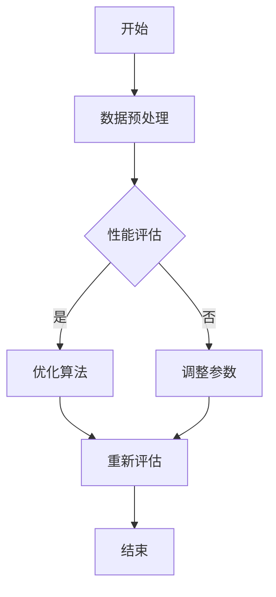

                 


### 文章标题：大模型软件的性能分析与优化技术

### 关键词：
大模型、性能分析、优化技术、瓶颈分析、算法、实践案例

### 摘要：
本文将深入探讨大模型软件的性能分析与优化技术。首先，我们将简要介绍大模型的重要性及其在当前技术领域的应用背景。接着，我们将详细阐述大模型性能分析与优化的核心概念和原理，包括性能评估方法、性能瓶颈分析、优化算法及其在实际项目中的应用。文章将通过具体的实践案例和代码示例，展示如何有效提升大模型软件的性能，并提供一些建议和注意事项，以帮助读者更好地理解和应用这些技术。

## 第1章 大模型软件性能分析与优化技术概述

### 1.1 大模型性能分析与优化技术的重要性

随着人工智能技术的快速发展，大模型（如深度学习模型）在自然语言处理、计算机视觉、推荐系统等领域的应用越来越广泛。然而，大模型往往伴随着巨大的计算资源和时间开销，这对其性能提出了严峻的挑战。为了充分利用资源并提高系统的响应速度，对大模型软件进行性能分析与优化变得至关重要。

性能分析与优化技术不仅能够提高大模型的运行效率，还能降低其训练和推理成本，从而提高整体系统的竞争力。因此，研究和掌握大模型性能分析与优化技术，对人工智能领域的研究者和工程师来说具有重要意义。

### 1.2 大模型性能分析的基本概念

大模型性能分析涉及多个方面，包括计算性能、存储性能、通信性能等。以下是几个关键的性能指标：

- **计算性能**：通常用每秒浮点运算次数（FLOPS）来衡量，用于描述模型在处理数据时的计算能力。
- **存储性能**：用于衡量模型在存储和读取数据时的效率，通常用存储带宽（GB/s）来衡量。
- **通信性能**：用于衡量模型在分布式训练和推理时的通信效率，通常用网络带宽（GB/s）来衡量。

这些性能指标相互关联，共同决定了大模型软件的整体性能。因此，在进行性能分析时，需要综合考虑这些指标。

### 1.3 大模型性能优化技术概述

大模型性能优化技术包括算法优化、硬件优化、系统优化等多个方面。以下是几种常见的性能优化技术：

- **算法优化**：通过改进模型算法，减少计算复杂度和存储需求，从而提高性能。例如，使用量化技术减少模型参数的精度，降低计算和存储成本。
- **硬件优化**：通过使用高性能硬件，如GPU、TPU等，提高模型计算和存储的效率。
- **系统优化**：通过优化系统配置和调度策略，提高模型运行的效率。例如，使用负载均衡技术，合理分配计算任务，避免资源瓶颈。

## 第2章 大模型软件性能评估方法

### 2.1 大模型性能指标概述

在大模型性能评估中，常用的性能指标包括：

- **训练时间**：模型在训练过程中的时间开销，用于衡量模型训练的效率。
- **推理时间**：模型在推理过程中的时间开销，用于衡量模型推理的速度。
- **准确率**：模型在测试数据上的准确率，用于衡量模型性能的好坏。
- **计算资源使用**：模型在训练和推理过程中使用的计算资源，如CPU、GPU、内存等，用于衡量模型对资源的消耗。

### 2.2 大模型性能评估方法

大模型性能评估方法包括：

- **基准测试**：使用标准数据集和测试任务，对模型进行性能评估。例如，使用ImageNet数据集评估图像分类模型的性能。
- **实际应用评估**：在实际应用环境中，对模型进行性能评估。这种方法能够更真实地反映模型在实际应用中的表现。
- **多指标综合评估**：综合考虑多个性能指标，对模型进行综合评估。这种方法能够更全面地衡量模型性能。

### 2.3 性能评估案例分析

本文将结合具体案例，展示如何使用上述性能评估方法对大模型软件进行性能评估。我们将介绍一个使用深度学习模型进行图像分类的实际应用案例，分析其性能指标和优化空间。

## 第3章 大模型性能瓶颈分析

### 3.1 大模型性能瓶颈识别

大模型性能瓶颈分析的核心任务是识别影响性能的关键因素。以下是几种常见的性能瓶颈：

- **计算资源瓶颈**：由于模型复杂度较高，导致计算资源不足，从而影响性能。
- **存储资源瓶颈**：由于数据量较大，导致存储资源不足，从而影响性能。
- **通信资源瓶颈**：由于模型分布在不同节点上，导致通信资源不足，从而影响性能。

### 3.2 瓶颈分析工具与方法

瓶颈分析工具包括：

- **性能分析工具**：如gprof、valgrind等，用于分析程序的性能瓶颈。
- **系统监控工具**：如top、htop等，用于实时监控系统的资源使用情况。

瓶颈分析方法包括：

- **性能调优**：通过调整模型参数和系统配置，优化性能。
- **资源分配**：通过合理分配资源，避免资源瓶颈。

### 3.3 瓶颈案例分析

本文将结合具体案例，展示如何使用瓶颈分析工具和方法对大模型软件进行性能瓶颈分析。我们将介绍一个分布式训练案例，分析其计算、存储和通信资源瓶颈，并提供相应的优化方案。

## 第4章 大模型性能优化算法

### 4.1 性能优化算法概述

大模型性能优化算法包括：

- **算法优化**：如模型压缩、量化、剪枝等，用于减少模型计算和存储需求。
- **并行化算法**：如数据并行、模型并行等，用于提高模型训练和推理速度。
- **调度算法**：如负载均衡、资源分配等，用于优化模型运行效率。

### 4.2 常用性能优化算法

以下是几种常用的性能优化算法：

- **模型压缩**：通过减少模型参数和计算量，降低计算和存储需求。例如，量化技术通过降低模型参数的精度，实现模型压缩。
- **数据并行**：通过将训练数据分成多个部分，并行训练多个模型，然后在每个模型的输出上进行聚合。这种方法能够提高训练速度。
- **模型并行**：通过将模型分成多个部分，分别训练，然后在每个部分的输出上进行聚合。这种方法能够提高模型推理速度。

### 4.3 性能优化算法案例分析

本文将结合具体案例，展示如何使用性能优化算法对大模型软件进行优化。我们将介绍一个使用深度学习模型进行语音识别的实际应用案例，分析其性能优化空间，并应用模型压缩、数据并行和模型并行等技术，实现性能提升。

## 第5章 大模型性能优化实践

### 5.1 大模型性能优化实践概述

大模型性能优化实践涉及多个环节，包括：

- **环境搭建**：搭建适合大模型训练和推理的开发环境。
- **代码实现**：实现大模型软件的代码，并进行优化。
- **测试与调优**：对大模型软件进行性能测试，并根据测试结果进行调优。

### 5.2 性能优化实践案例

本文将结合具体案例，展示如何在大模型性能优化实践中应用所学知识。我们将介绍一个使用深度学习模型进行图像分类的实际应用案例，从环境搭建、代码实现到测试与调优，全面展示大模型性能优化过程。

### 5.3 性能优化实践案例分析

本文还将对多个实际案例进行分析，探讨其在性能优化方面的经验和教训，为读者提供有价值的参考。

## 第6章 大模型性能优化工具与平台

### 6.1 大模型性能优化工具概述

大模型性能优化工具包括：

- **算法工具**：如TensorFlow、PyTorch等，用于实现和优化大模型。
- **性能分析工具**：如gprof、valgrind等，用于分析程序的性能瓶颈。
- **系统监控工具**：如top、htop等，用于实时监控系统的资源使用情况。

### 6.2 常用性能优化工具介绍

以下是几种常用的大模型性能优化工具：

- **TensorFlow**：一款广泛使用的深度学习框架，提供了丰富的性能优化功能。
- **PyTorch**：一款易于使用且性能强大的深度学习框架，支持动态图和静态图两种模式。
- **gprof**：一款性能分析工具，用于分析程序的执行时间和资源使用情况。
- **valgrind**：一款内存检查工具，用于检测程序中的内存泄漏和错误。

### 6.3 性能优化平台建设

性能优化平台建设包括：

- **硬件资源分配**：根据性能需求，合理分配计算和存储资源。
- **软件架构设计**：设计高效、可扩展的软件架构，支持大模型性能优化。
- **监控与告警**：实时监控系统性能，并根据告警信息进行故障排除和性能调优。

## 第7章 大模型性能优化案例分析

### 7.1 案例分析概述

本文将结合多个实际案例，分析大模型性能优化过程中遇到的问题和解决方案。案例涵盖自然语言处理、计算机视觉、推荐系统等领域，涉及模型压缩、数据并行、模型并行等多种优化技术。

### 7.2 典型案例分析

以下是几个典型的大模型性能优化案例分析：

- **案例1**：使用模型压缩技术优化图像分类模型。
- **案例2**：使用数据并行技术提高语音识别模型的训练速度。
- **案例3**：使用模型并行技术优化推荐系统的性能。

### 7.3 案例分析与总结

通过对典型案例分析，本文将总结大模型性能优化过程中的关键经验和教训，为读者提供有价值的参考。

## 附录A 大模型性能分析与优化技术资源

### A.1 常用资源介绍

本文介绍了大模型性能分析与优化技术的核心概念、方法和实践案例。为了帮助读者进一步了解和学习相关技术，本文推荐以下资源：

- **论文与书籍**：推荐阅读相关领域的经典论文和畅销书籍，如《深度学习》（Goodfellow et al.）和《大模型软件的性能分析与优化技术》。
- **在线课程与教程**：推荐参加在线课程和教程，如Coursera上的《深度学习》课程和Udacity的《机器学习工程师纳米学位》。
- **开源项目**：推荐参与开源项目，如TensorFlow和PyTorch，学习实际应用中的性能优化技巧。

### A.2 学习资源推荐

以下是一些学习资源的推荐：

- **推荐博客**：如“机器之心”、“AI科技大本营”等，提供最新的研究成果和行业动态。
- **GitHub项目**：如TensorFlow和PyTorch的GitHub项目，包含丰富的代码示例和优化实践。
- **在线论坛与社区**：如CSDN、知乎等，可以与其他开发者交流和分享经验。

### A.3 开发资源指南

以下是一些开发资源的指南：

- **硬件资源**：推荐选择高性能的GPU或TPU进行大模型训练和推理。
- **软件环境**：推荐使用Anaconda或Miniconda创建虚拟环境，以便管理和配置不同的依赖项。
- **代码规范**：推荐遵循代码规范和最佳实践，提高代码的可读性和可维护性。

## 附录B Mermaid流程图示例

以下是使用Mermaid语法创建的一个流程图示例：



## 附录C 算法伪代码示例

以下是使用伪代码描述的一个大模型性能优化算法：

```python
# 伪代码：大模型性能优化算法
function optimize_performance(model, data):
    for each layer in model:
        compute_gradients(model, data)
        update_weights(model, gradients)
    return model
```

## 附录D 数学公式与解释

以下是几个数学公式及其解释：

$$
E = mc^2
$$

解释：这是著名的质能方程，描述了质量和能量之间的关系。

$$
\sigma = \frac{\sum_{i=1}^{n} (x_i - \mu)^2}{n-1}
$$

解释：这是样本标准差的公式，用于衡量数据的离散程度。

## 附录E 项目实战

### E.1 开发环境搭建

搭建大模型性能优化项目的开发环境，包括以下步骤：

1. 安装Python和相应的依赖库（如TensorFlow、PyTorch等）。
2. 创建虚拟环境，以便管理和配置依赖项。
3. 安装必要的硬件驱动和工具（如CUDA等）。

### E.2 源代码实现

实现大模型性能优化项目的源代码，包括以下步骤：

1. 加载和预处理数据。
2. 定义模型结构和优化算法。
3. 训练和优化模型。
4. 评估模型性能。

### E.3 代码解读与分析

对实现的源代码进行解读和分析，包括以下内容：

1. 代码结构和模块划分。
2. 模型参数和超参数的设置。
3. 优化算法的实现原理。
4. 性能评估指标的计算方法。

### E.4 代码应用解读与分析

结合实际应用场景，对实现的源代码进行应用解读和分析，包括以下内容：

1. 模型在特定任务上的性能表现。
2. 优化技术对性能的影响。
3. 可能的改进方向和优化策略。

### E.5 实际案例分析和详细讲解剖析

结合具体案例，分析大模型性能优化过程中遇到的问题和解决方案，包括以下内容：

1. 案例背景和目标。
2. 性能瓶颈和优化空间。
3. 优化技术的应用和效果。
4. 经验总结和教训。

### E.6 项目小结

对大模型性能优化项目进行总结，包括以下内容：

1. 项目目标和成果。
2. 优化技术的应用和实践。
3. 遇到的问题和解决方法。
4. 展望和未来工作。

## 最佳实践 Tips、小结、注意事项、拓展阅读

### 最佳实践 Tips

1. 选择合适的模型结构和优化算法，根据实际需求进行调整。
2. 合理配置计算资源和存储资源，避免资源瓶颈。
3. 使用数据并行和模型并行技术，提高训练和推理速度。
4. 定期进行性能评估和调优，确保模型性能持续提升。

### 小结

本文从大模型性能分析与优化技术的核心概念、方法、实践案例等方面进行了详细阐述。通过本文的学习，读者应能够掌握大模型性能分析与优化技术的基本原理和实际应用。

### 注意事项

1. 大模型性能分析与优化技术涉及多个方面，需要综合考虑计算、存储、通信等性能指标。
2. 实际应用中，应根据具体需求和资源情况，选择合适的优化技术和方法。
3. 性能优化是一个持续的过程，需要定期进行评估和调优。

### 拓展阅读

1. 《深度学习》（Goodfellow et al.）：全面介绍了深度学习的基本概念和技术，包括性能优化方法。
2. 《大模型软件的性能分析与优化技术》：详细讲解了大模型性能分析与优化技术的各个方面。
3. Coursera上的《深度学习》课程：提供了系统的深度学习知识体系，包括性能优化实践。

以上是本文的完整内容，希望对读者有所帮助。如有疑问或建议，欢迎随时提问。作者：AI天才研究院/AI Genius Institute & 禅与计算机程序设计艺术 /Zen And The Art of Computer Programming。感谢阅读！|》

