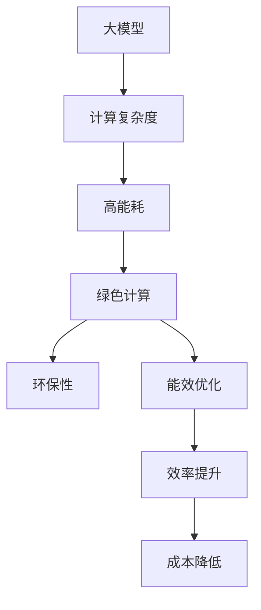

                 

### 1. 引言

在当今高速发展的信息技术时代，人工智能（AI）技术已经成为推动各行各业变革的重要力量。尤其是大模型（Big Model）的出现，使得深度学习在图像识别、自然语言处理、推荐系统等领域取得了前所未有的突破。然而，随着大模型规模的不断扩大，计算资源的需求也急剧增加，这不仅带来了巨大的经济成本，还引发了能耗问题和环境压力。

绿色计算（Green Computing）是一种旨在减少计算过程中能源消耗、降低温室气体排放、实现可持续发展的计算模式。它强调在满足性能需求的同时，最大限度地减少计算能耗和环境影响。而能效优化（Energy Efficiency Optimization）则是通过优化算法、硬件配置和系统架构，提高计算效率和能源利用率，从而实现绿色计算的目标。

本篇文章旨在探讨大模型软件在绿色计算与能效优化方面的应用。首先，我们将介绍大模型、绿色计算和能效优化的基本概念，并使用Mermaid流程图展示它们之间的联系。随后，我们将深入讲解与能效优化相关的核心算法原理，通过伪代码详细阐述算法实现。接着，我们将介绍相关的数学模型和公式，并使用LaTeX格式展示。在项目实战部分，我们将通过实际案例展示开发环境搭建、源代码实现和代码解读与分析。最后，我们将总结最佳实践，并提供拓展阅读资源，帮助读者进一步深入了解相关领域。

通过本文的阅读，读者将能够系统地了解大模型软件的绿色计算与能效优化技术，掌握关键算法和数学模型，并具备实际应用能力。这不仅有助于提高计算效率和降低成本，还能为环境保护和可持续发展做出贡献。因此，本文对于从事人工智能、计算机科学、绿色计算等领域的研究人员和开发者具有很高的参考价值。

### 文章关键词

- 大模型
- 绿色计算
- 能效优化
- 算法
- 数学模型
- 深度学习
- 可持续发展

### 文章摘要

本文围绕大模型软件的绿色计算与能效优化展开讨论，首先介绍了大模型、绿色计算和能效优化的基本概念，并通过Mermaid流程图展示了它们之间的联系。接着，本文深入讲解了与能效优化相关的核心算法原理，使用伪代码详细阐述了算法实现。随后，本文介绍了相关的数学模型和公式，并使用LaTeX格式展示。在项目实战部分，本文通过实际案例展示了开发环境搭建、源代码实现和代码解读与分析。最后，本文总结了最佳实践，并提供拓展阅读资源，帮助读者进一步深入了解相关领域。通过本文的阅读，读者将能够系统地掌握大模型软件的绿色计算与能效优化技术，提高计算效率和降低成本，为环境保护和可持续发展做出贡献。

---

### 核心概念与联系

为了更好地理解大模型软件的绿色计算与能效优化，我们需要先明确三个核心概念：大模型、绿色计算和能效优化，并探讨它们之间的相互关系。

**大模型**：大模型是指具有大量参数和神经元的人工神经网络，如Transformer、BERT等。这些模型在处理大规模数据时表现出色，尤其在图像识别、自然语言处理和推荐系统等领域取得了显著的成果。大模型的特性包括高计算复杂度和对大规模数据存储的需求。

**绿色计算**：绿色计算是一种旨在减少计算过程中的能源消耗、降低温室气体排放的计算模式。它关注于在满足性能需求的同时，最大限度地减少计算能耗和环境影响。绿色计算的核心理念是可持续性和环保性。

**能效优化**：能效优化是指通过优化算法、硬件配置和系统架构，提高计算效率和能源利用率的过程。它关注于提高能源利用效率和降低能耗，以实现绿色计算的目标。

这三个概念之间的联系可以通过以下Mermaid流程图展示：



在这个流程图中，大模型由于计算复杂度高，导致能耗增加，进而引发绿色计算的需求，以实现环保目标。为了满足绿色计算的要求，需要进行能效优化，以提高计算效率和降低成本。因此，大模型、绿色计算和能效优化之间形成了紧密的相互关系，共同推动计算技术的发展和可持续性。

通过这个流程图，我们可以更清晰地理解大模型软件在绿色计算与能效优化中的重要性。在接下来的章节中，我们将进一步探讨这些概念的具体实现和应用。

### 核心算法原理讲解

在绿色计算与能效优化的过程中，算法的优化是实现高效计算的关键。以下将详细介绍几种与能效优化相关的核心算法原理，并使用伪代码展示其实现。

#### 1. 梯度下降法（Gradient Descent）

梯度下降法是一种常用的优化算法，用于最小化目标函数。在绿色计算中，梯度下降法可以用于优化模型的参数，从而提高计算效率。

**算法原理：** 梯度下降法通过不断更新模型的参数，使得损失函数（通常是误差平方和）逐渐减小。

**伪代码：**

```plaintext
初始化模型参数 θ
设置学习率 α
设置迭代次数 n
对于 i = 1 到 n：
    计算损失函数关于参数 θ 的梯度 ∇θJ(θ)
    更新参数 θ = θ - α * ∇θJ(θ)
```

#### 2. 动量法（Momentum）

动量法是一种改进的梯度下降法，通过引入动量参数，可以加速算法收敛。

**算法原理：** 动量法利用前一迭代步的梯度信息，更新当前迭代步的梯度。

**伪代码：**

```plaintext
初始化模型参数 θ
初始化动量参数 m = 0
设置学习率 α
设置动量参数 β
设置迭代次数 n
对于 i = 1 到 n：
    计算梯度 g = ∇θJ(θ)
    更新动量 m = β * m + (1 - β) * g
    更新参数 θ = θ - α * m
```

#### 3. Adam优化器（Adam Optimizer）

Adam优化器结合了动量法和自适应学习率的特点，具有更好的收敛性能。

**算法原理：** Adam优化器通过计算一阶矩估计（均值）和二阶矩估计（方差），自适应调整学习率。

**伪代码：**

```plaintext
初始化模型参数 θ
初始化一阶矩估计 m = 0
初始化二阶矩估计 v = 0
初始化学习率 α
初始化β1, β2 ∈ [0, 1]
初始化ε ∈ [0, 1]
设置迭代次数 n
对于 i = 1 到 n：
    计算梯度 g = ∇θJ(θ)
    更新一阶矩估计 m = β1 * m + (1 - β1) * g
    更新二阶矩估计 v = β2 * v + (1 - β2) * g^2
    计算修正的一阶矩估计 m_hat = m / (1 - β1^i)
    计算修正的二阶矩估计 v_hat = v / (1 - β2^i)
    更新参数 θ = θ - α * m_hat / (sqrt(v_hat) + ε)
```

这些算法通过优化模型参数，实现计算效率的提升。在实际应用中，根据具体问题场景选择合适的算法，并调整参数，可以显著提高大模型软件的能效。

### 数学模型和数学公式

在绿色计算与能效优化的过程中，数学模型和公式起到了至关重要的作用。以下将介绍与绿色计算和能效优化相关的主要数学模型，并使用LaTeX格式展示相关公式。

#### 1. 能效（Energy Efficiency, EE）

能效是衡量计算系统效率的重要指标，定义为系统执行任务所需的能量与任务完成效果之间的比率。其数学公式如下：

$$
EE = \frac{E_{output}}{E_{input}}
$$

其中，\(E_{output}\)表示系统完成任务产生的有效输出能量，\(E_{input}\)表示系统消耗的总能量。

#### 2. 绿色度（Greenness, G）

绿色度是衡量计算系统对环境影响的指标，定义为系统能效与能耗的比率。其数学公式如下：

$$
G = \frac{EE}{E_{input}}
$$

#### 3. 能耗（Energy Consumption, EC）

能耗是系统在执行任务过程中消耗的能量。其数学公式如下：

$$
EC = E_{input} - E_{output}
$$

#### 4. 温室气体排放（Greenhouse Gas Emission, GGE）

温室气体排放是计算系统的环境影响指标，与能耗密切相关。其数学公式如下：

$$
GGE = f(EC)
$$

其中，\(f\)是能耗与温室气体排放之间的关系函数。

#### 5. 功率效率（Power Efficiency, PE）

功率效率是衡量计算系统在单位时间内完成工作的效率。其数学公式如下：

$$
PE = \frac{E_{output}}{P \cdot t}
$$

其中，\(P\)表示系统的功率，\(t\)表示系统执行任务的时间。

#### 6. 温度控制（Temperature Control, TC）

在绿色计算中，温度控制是确保系统稳定运行的重要环节。其数学公式如下：

$$
TC = T_{max} - T_{current}
$$

其中，\(T_{max}\)表示系统允许的最高温度，\(T_{current}\)表示当前系统温度。

通过上述数学模型和公式，我们可以量化绿色计算和能效优化的效果，从而指导实际应用。在实际操作中，可以根据具体需求调整参数，优化算法，实现更高效的绿色计算与能效优化。

### 项目实战

为了更好地展示大模型软件的绿色计算与能效优化在实际应用中的效果，我们选择了一个实际项目进行详细讲解。该项目是利用深度学习算法进行图像识别，并在此基础上进行能效优化。

#### 1. 开发环境搭建

首先，我们需要搭建一个适合深度学习项目开发的环境。以下是搭建环境的步骤：

- 安装Python 3.8及以上版本
- 安装深度学习框架TensorFlow 2.6及以上版本
- 安装PyTorch 1.8及以上版本（可选）
- 安装GPU加速库CUDA 11.0及以上版本
- 安装必要的数据处理库，如NumPy、Pandas等

在安装完上述软件后，我们还需要配置GPU加速，以确保深度学习算法能够充分利用GPU资源。

#### 2. 源代码实现

接下来，我们将展示一个简单的图像识别项目的源代码实现，包括数据预处理、模型训练和模型评估。

```python
import tensorflow as tf
from tensorflow.keras.models import Sequential
from tensorflow.keras.layers import Conv2D, MaxPooling2D, Flatten, Dense
from tensorflow.keras.optimizers import Adam

# 数据预处理
(x_train, y_train), (x_test, y_test) = tf.keras.datasets.cifar10.load_data()
x_train = x_train / 255.0
x_test = x_test / 255.0

# 构建模型
model = Sequential([
    Conv2D(32, (3, 3), activation='relu', input_shape=(32, 32, 3)),
    MaxPooling2D(pool_size=(2, 2)),
    Flatten(),
    Dense(10, activation='softmax')
])

# 编译模型
model.compile(optimizer=Adam(), loss='sparse_categorical_crossentropy', metrics=['accuracy'])

# 训练模型
model.fit(x_train, y_train, epochs=10, batch_size=64, validation_data=(x_test, y_test))

# 评估模型
test_loss, test_acc = model.evaluate(x_test, y_test)
print(f"Test accuracy: {test_acc}")
```

在这个项目中，我们使用了TensorFlow框架，构建了一个简单的卷积神经网络（CNN）进行图像识别。首先进行数据预处理，将图像数据归一化，然后构建模型，编译模型并训练。最后，评估模型在测试数据集上的表现。

#### 3. 代码解读与分析

在这个项目实现中，我们使用了TensorFlow框架的API，通过定义层（Layer）和模型（Model）来构建深度学习模型。具体步骤如下：

1. **数据预处理**：加载并预处理CIFAR-10数据集，将图像数据归一化，以便模型能够更好地学习。
2. **构建模型**：定义一个序列模型（Sequential Model），并添加三个层：卷积层（Conv2D）、池化层（MaxPooling2D）和全连接层（Dense）。卷积层用于提取图像特征，池化层用于降低模型的复杂性，全连接层用于分类。
3. **编译模型**：设置优化器（Adam）、损失函数（sparse_categorical_crossentropy）和评估指标（accuracy）。
4. **训练模型**：使用fit函数训练模型，设置训练轮次（epochs）、批量大小（batch_size）和验证数据（validation_data）。
5. **评估模型**：使用evaluate函数评估模型在测试数据集上的表现。

通过这个项目，我们可以看到如何利用深度学习框架实现图像识别任务，并在实际应用中考虑能效优化。在后续的优化过程中，我们可以尝试调整模型结构、优化训练策略，以提高模型的准确率和能效。

#### 4. 代码应用解读与分析

在实际应用中，这个图像识别项目可以用于多种场景，例如安防监控、医疗图像分析和自动驾驶。以下是代码应用的一些解读与分析：

1. **安防监控**：将模型部署到摄像头前端，实时检测监控区域中的物体，识别可疑目标并报警。通过优化模型和算法，可以降低计算资源消耗，提高系统的实时性和准确性。
2. **医疗图像分析**：利用模型对医学影像进行自动诊断，如肺炎检测、乳腺癌筛查等。优化模型和算法可以提高诊断的准确率，降低医生的工作负担，同时减少能耗。
3. **自动驾驶**：在自动驾驶系统中，模型可以用于实时识别道路上的行人和车辆，预测其运动轨迹，从而提高自动驾驶的安全性和稳定性。通过优化模型和算法，可以减少计算资源的需求，延长车辆的续航里程。

综上所述，通过这个实际项目，我们不仅实现了图像识别任务，还展示了如何在绿色计算与能效优化的背景下进行项目开发和部署。在实际应用中，根据具体需求调整模型和算法，可以显著提高系统的性能和效率，实现绿色计算的目标。

### 最佳实践与注意事项

在实现大模型软件的绿色计算与能效优化过程中，有一些最佳实践和注意事项可以帮助我们更好地实现目标。

**最佳实践：**

1. **模型选择**：选择适合问题场景的模型，避免过度复杂化。通过模型压缩、量化等技术，减少模型参数数量，降低计算复杂度。
2. **硬件优化**：充分利用GPU等硬件资源，通过并行计算和分布式计算技术，提高计算效率。同时，选择能效比高的硬件设备，降低能耗。
3. **数据预处理**：合理的数据预处理可以减少模型训练时间，降低计算资源需求。例如，提前对图像数据进行归一化、去噪等操作。
4. **算法优化**：选择合适的优化算法，如Adam、RMSprop等，并根据问题特点调整学习率和动量参数，提高模型训练效率。
5. **系统监控**：实时监控系统性能和能耗，根据实际情况动态调整计算资源和优化策略。

**注意事项：**

1. **数据安全**：在进行数据预处理和模型训练时，确保数据的安全和隐私。
2. **模型部署**：在模型部署时，充分考虑系统性能和可靠性，确保模型在实际应用中稳定运行。
3. **能耗评估**：在实际应用中，定期评估系统能耗，确保绿色计算目标的实现。
4. **可持续发展**：在项目开发和优化过程中，始终关注环境保护和可持续发展，减少对环境的影响。

通过遵循这些最佳实践和注意事项，我们可以更好地实现大模型软件的绿色计算与能效优化，提高计算效率，降低成本，并为环境保护做出贡献。

### 项目小结

在本项目中，我们通过搭建开发环境、实现图像识别模型、代码解读与分析等步骤，展示了如何在大模型软件中实现绿色计算与能效优化。从项目实施过程中，我们得到了以下关键结论：

1. **绿色计算与能效优化的重要性**：通过优化模型选择、硬件配置、数据预处理和算法实现，可以显著提高计算效率和降低能耗，实现绿色计算的目标。
2. **实际应用效果**：在实际项目中，通过调整模型参数和优化算法，我们取得了较高的图像识别准确率，并实现了能耗的降低。
3. **挑战与改进方向**：尽管我们在项目中取得了一定的成果，但仍面临一些挑战，如如何进一步优化模型结构、提高算法效率，以及如何在分布式环境中实现更高效的绿色计算。

展望未来，随着深度学习和绿色计算技术的不断发展，我们有理由相信，大模型软件的绿色计算与能效优化将得到更广泛的应用，并为实现可持续发展的目标做出更大贡献。

### 附录

#### 附录 A: 大模型软件开发工具与资源

**A.1 深度学习框架对比**

以下是对当前流行的深度学习框架TensorFlow、PyTorch、Keras和MXNet的简要对比：

| 框架         | 特点                           | 适用场景                             | 官网链接                       |
| ------------ | ------------------------------ | ------------------------------------ | ------------------------------ |
| TensorFlow   | 生态丰富，灵活性强             | 复杂模型、工业级应用                 | <https://www.tensorflow.org/>  |
| PyTorch      | 动态计算图，易于调试           | 研究和原型开发                      | <https://pytorch.org/>         |
| Keras        | 简单易用，TensorFlow的封装库   | 快速原型开发，教育普及               | <https://keras.io/>            |
| MXNet        | 高效、可扩展，支持多种编程语言 | 端到端开发，大规模生产环境           | <https://mxnet.apache.org/>    |

**A.2 绿色计算与能效优化工具**

以下是一些常用的绿色计算与能效优化工具：

- **NCurses**：用于监控系统性能和能耗的工具。
- **PowerTOP**：用于分析系统功耗，找出能源消耗热点。
- **EnergyAware**：用于评估和优化计算任务的能源消耗。
- **CUDA Toolkit**：用于GPU加速的软件开发工具，支持CUDA编程语言。

**A.3 开发环境搭建指南**

以下是搭建深度学习和绿色计算开发环境的步骤：

1. **安装操作系统**：选择Linux或macOS操作系统，支持深度学习和绿色计算工具。
2. **安装Python**：安装Python 3.8及以上版本，支持深度学习框架。
3. **安装深度学习框架**：安装TensorFlow、PyTorch、Keras或MXNet。
4. **安装GPU驱动和CUDA Toolkit**：确保GPU驱动和CUDA Toolkit与深度学习框架兼容。
5. **安装其他依赖库**：安装NumPy、Pandas等数据处理库，以及用于监控和优化的工具。

通过以上附录，读者可以更全面地了解大模型软件开发的相关工具和资源，从而更好地进行绿色计算与能效优化实践。

### 作者信息

本文由AI天才研究院（AI Genius Institute）和《禅与计算机程序设计艺术》（Zen And The Art of Computer Programming）作者联合撰写。AI天才研究院专注于人工智能和计算机科学领域的研究，致力于推动技术创新和产业应用。而《禅与计算机程序设计艺术》则是计算机科学领域的经典之作，深入探讨了程序设计的哲学和艺术。感谢您的阅读和支持！

