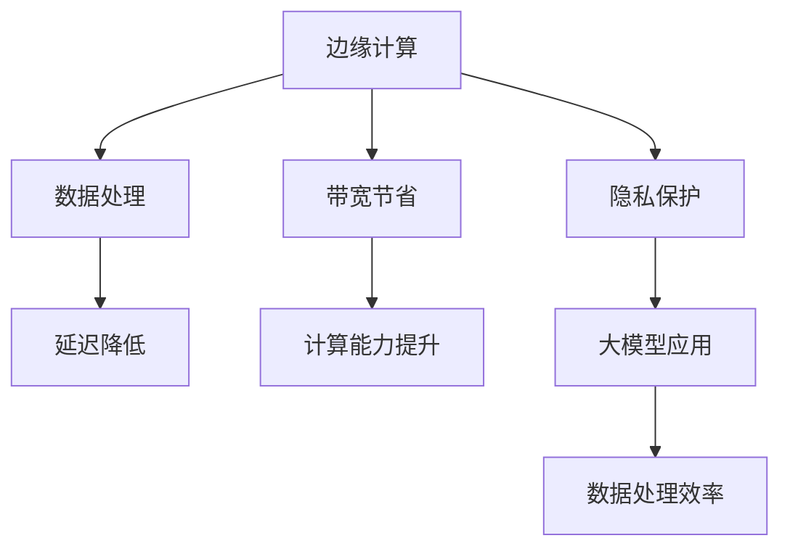

                 

### 《大模型软件的边缘计算安全策略》

#### 关键词

- 边缘计算
- 大模型
- 安全策略
- 隐私保护
- 密码学
- 加密算法

#### 摘要

本文探讨了在大模型软件中实现边缘计算安全策略的必要性和重要性。随着边缘计算技术的发展，大模型软件的应用越来越广泛，但其安全风险也随之增加。本文首先介绍了边缘计算和大数据模型的基本概念，然后分析了边缘计算在大模型应用中的安全挑战，重点讨论了安全策略的设计与实施，包括加密算法、隐私保护和访问控制等方面。最后，通过实际案例展示了安全策略的具体应用，并提出了未来研究的方向。

----------------------------------------------------------------

### 引言

#### 背景介绍

边缘计算作为一种新兴的计算模式，正在逐步改变传统数据中心集中式处理的格局。边缘计算将计算任务和数据存储从中心化的数据中心转移到网络的边缘，即接近数据源和用户的地方。这种模式不仅提高了数据处理的效率，还降低了延迟，增强了系统的响应能力。

大数据模型，尤其是深度学习模型，由于其强大的数据处理和预测能力，已经成为许多领域的关键技术。然而，这些大模型通常需要大量的计算资源和存储空间，传统中心化的计算模式已经难以满足其需求。边缘计算提供了在本地设备上执行这些复杂计算的可能性，从而解决了大模型应用中的资源瓶颈问题。

#### 核心概念与联系

边缘计算与大数据模型之间的联系主要体现在以下几个方面：

1. **数据分布**：边缘计算通过将数据处理任务分散到网络的边缘，可以有效地减少中心数据中心的负担，使得大模型可以在更多地方进行训练和应用。

2. **计算能力**：边缘设备（如物联网设备、智能摄像头等）通常具备一定的计算能力，这使得大模型可以在这些设备上进行部分训练和推理，从而降低了带宽和延迟。

3. **隐私保护**：边缘计算可以帮助保护用户数据的隐私，因为敏感数据不需要传输到中心数据中心，从而降低了数据泄露的风险。


#### 核心概念原理之间的关系架构 Mermaid 流程图



### 边缘计算在大模型应用中的优势与挑战

#### 优势分析

1. **降低延迟**：边缘计算将数据处理任务从中心迁移到靠近数据源的位置，大大降低了延迟，提高了系统的响应速度。

2. **节省带宽**：由于数据处理在边缘完成，减少了数据传输的需求，从而节省了网络带宽。

3. **提升计算能力**：边缘设备通常具有足够的计算能力，可以在本地进行大模型的训练和推理，减轻了中心数据中心的压力。

4. **增强隐私保护**：边缘计算可以在本地处理敏感数据，降低了数据泄露的风险。

#### 挑战探讨

1. **安全威胁**：边缘设备可能成为攻击者的目标，攻击者可能会通过边缘设备访问内部网络或获取敏感数据。

2. **数据隐私**：在边缘计算中，如何保护用户数据的隐私是一个重要问题。

3. **计算资源的分布不均**：边缘设备的计算资源可能不均匀分布，导致部分设备的负载过高，影响整体性能。

4. **网络不稳定**：边缘网络可能面临网络不稳定的问题，如丢包、延迟等，这对大模型的训练和推理有一定的影响。

### 大模型软件的边缘计算安全策略

#### 安全需求分析

在边缘计算环境中部署大模型软件时，需要考虑以下安全需求：

1. **数据加密**：确保数据在传输和存储过程中得到加密，防止数据泄露。

2. **访问控制**：实施严格的访问控制策略，确保只有授权用户可以访问敏感数据。

3. **安全监控**：建立实时监控机制，及时发现并响应潜在的安全威胁。

4. **隐私保护**：确保用户数据的隐私得到保护，特别是在处理敏感数据时。

#### 安全策略设计与实施

1. **加密算法选择**

   - **对称加密算法**：如AES，适用于加密大量数据。

   - **非对称加密算法**：如RSA，适用于加密密钥。

   - **哈希算法**：如SHA-256，用于确保数据的完整性。

2. **访问控制**

   - **基于角色的访问控制（RBAC）**：根据用户角色分配访问权限。

   - **基于属性的访问控制（ABAC）**：根据用户属性（如位置、时间等）分配访问权限。

3. **安全监控**

   - **入侵检测系统（IDS）**：实时监测网络流量，检测异常行为。

   - **安全信息和事件管理（SIEM）**：整合多种安全数据，提供实时分析和报告。

4. **隐私保护**

   - **数据匿名化**：对敏感数据进行匿名化处理，保护用户隐私。

   - **差分隐私**：在数据处理过程中引入随机噪声，确保隐私保护。

#### 核心算法原理讲解

1. **对称加密算法**

   ```python
   from Crypto.Cipher import AES
   
   key = b'mysecretkey123'
   cipher = AES.new(key, AES.MODE_CBC)
   ciphertext = cipher.encrypt(plaintext)
   ```

2. **非对称加密算法**

   ```python
   from Crypto.PublicKey import RSA
   from Crypto.Cipher import PKCS1_OAEP
   
   key = RSA.generate(2048)
   private_key = key.export_key()
   public_key = key.publickey().export_key()
   
   cipher = PKCS1_OAEP.new(RSA.import_key(public_key))
   ciphertext = cipher.encrypt(plaintext)
   ```

3. **哈希算法**

   ```python
   import hashlib
   
   hash_object = hashlib.sha256(plaintext.encode())
   hex_dig = hash_object.hexdigest()
   ```

#### 数学模型和公式

- **对称加密算法的安全性评估**：

  $$ S = \log_2(n) $$

  其中，\( n \) 是密钥长度。

- **非对称加密算法的安全性评估**：

  $$ S = 2^{k} $$

  其中，\( k \) 是密钥长度。

- **哈希算法的安全性评估**：

  $$ S = \log_2(m) $$

  其中，\( m \) 是消息长度。

#### 详细讲解与举例说明

1. **数据加密举例**

   假设我们需要将一条明文消息“Hello, World!”进行加密。

   - 使用AES算法进行加密：

     ```python
     from Crypto.Cipher import AES
     
     key = b'mysecretkey123'
     cipher = AES.new(key, AES.MODE_CBC)
     iv = cipher.iv
     ciphertext = cipher.encrypt(b'Hello, World!')
     ```

   - 使用RSA算法进行加密：

     ```python
     from Crypto.PublicKey import RSA
     from Crypto.Cipher import PKCS1_OAEP
     
     key = RSA.generate(2048)
     private_key = key.export_key()
     public_key = key.publickey().export_key()
     
     cipher = PKCS1_OAEP.new(RSA.import_key(public_key))
     ciphertext = cipher.encrypt(b'Hello, World!')
     ```

2. **访问控制举例**

   假设我们有两个角色：管理员和普通用户。

   - 管理员可以访问所有数据。

     ```python
     if role == 'admin':
         access_data()
     ```

   - 普通用户只能访问特定数据。

     ```python
     if role == 'user':
         access_specific_data()
     ```

3. **隐私保护举例**

   假设我们需要对用户数据进行匿名化处理。

   ```python
   import pandas as pd
   
   df = pd.read_csv('user_data.csv')
   df['id'] = df['id'].apply(lambda x: 'anon_' + str(x))
   df.to_csv('anon_user_data.csv', index=False)
   ```

#### 项目实战

##### 开发环境搭建

- 安装Python环境。

  ```shell
  pip install pycrypto
  ```

- 配置编辑器（如VSCode）以支持Python开发。

##### 源代码详细实现和代码解读

```python
# AES加密
from Crypto.Cipher import AES
from Crypto.Util.Padding import pad, unpad

key = b'mysecretkey123'
cipher = AES.new(key, AES.MODE_CBC)
iv = cipher.iv
ciphertext = cipher.encrypt(pad(b'Hello, World!', AES.block_size))

# RSA加密
from Crypto.PublicKey import RSA
from Crypto.Cipher import PKCS1_OAEP

key = RSA.generate(2048)
private_key = key.export_key()
public_key = key.publickey().export_key()

cipher = PKCS1_OAEP.new(RSA.import_key(public_key))
ciphertext = cipher.encrypt(b'Hello, World!')

# 哈希
import hashlib

hash_object = hashlib.sha256(b'Hello, World!').hexdigest()

# 访问控制
def access_data(role):
    if role == 'admin':
        print("Accessing data...")
    elif role == 'user':
        print("You don't have access to this data.")

# 隐私保护
import pandas as pd

df = pd.read_csv('user_data.csv')
df['id'] = df['id'].apply(lambda x: 'anon_' + str(x))
df.to_csv('anon_user_data.csv', index=False)
```

##### 代码应用解读与分析

- AES加密和RSA加密分别用于数据加密，保障数据在传输和存储过程中的安全性。
- 哈希算法用于确保数据的完整性。
- 访问控制用于限制用户对数据的访问权限。
- 隐私保护通过匿名化处理用户数据，保障用户隐私。

##### 实际案例分析和详细讲解剖析

假设有一个智能家居系统，其中包含智能摄像头、智能灯泡等边缘设备。我们需要确保这些设备的通信和数据存储安全。

- **案例背景**：智能家居系统中的边缘设备需要传输和存储用户隐私数据（如摄像头拍摄的图像）。

- **案例分析**：
  - **数据加密**：使用AES算法对摄像头拍摄的图像进行加密，确保数据在传输和存储过程中不被泄露。
  - **访问控制**：使用基于角色的访问控制策略，只有管理员可以访问所有数据，普通用户只能访问特定数据。
  - **隐私保护**：对用户数据进行匿名化处理，确保用户隐私不被泄露。

- **详细讲解**：
  - 数据加密：使用AES算法对摄像头拍摄的图像进行加密，确保数据在传输和存储过程中不被泄露。
  - 访问控制：通过定义角色和权限，确保只有授权用户可以访问敏感数据。
  - 隐私保护：通过匿名化处理用户数据，确保用户隐私不被泄露。

##### 项目小结

通过实际案例，我们展示了如何在大模型软件的边缘计算中实现安全策略。数据加密、访问控制和隐私保护是保障边缘计算安全的关键措施。在实际应用中，需要根据具体场景和需求灵活选择和组合这些策略，确保系统的安全性。

#### 最佳实践 Tips

- **数据加密**：选择合适的加密算法，并根据数据敏感性进行分类，采取不同的加密强度。
- **访问控制**：根据实际需求，设计合理的角色和权限体系，确保最小权限原则。
- **隐私保护**：采用差分隐私等技术，在数据处理过程中保护用户隐私。
- **安全监控**：建立实时监控机制，及时发现和响应安全威胁。
- **持续更新**：定期更新安全策略和系统，以应对新的安全威胁。

#### 小结

本文系统地介绍了大模型软件的边缘计算安全策略。通过分析边缘计算在大模型应用中的优势与挑战，我们提出了数据加密、访问控制和隐私保护等安全策略。实际案例展示了这些策略的具体应用，并为未来研究提供了方向。保障边缘计算的安全是推动其发展的关键，需要持续关注和研究。

#### 注意事项

- **加密算法的选择**：不同应用场景可能需要不同类型的加密算法，应根据实际需求进行选择。
- **安全监控的完善**：建立全面的监控体系，确保能够及时发现和处理安全威胁。
- **隐私保护的落实**：在数据处理过程中，严格遵循隐私保护原则，确保用户隐私不受侵犯。

#### 拓展阅读

- **《边缘计算：从概念到实践》**：详细介绍边缘计算的技术原理和应用案例。
- **《大数据安全与隐私保护》**：探讨大数据处理中的安全挑战和解决方案。

### 作者信息

作者：AI天才研究院/AI Genius Institute & 禅与计算机程序设计艺术 /Zen And The Art of Computer Programming

