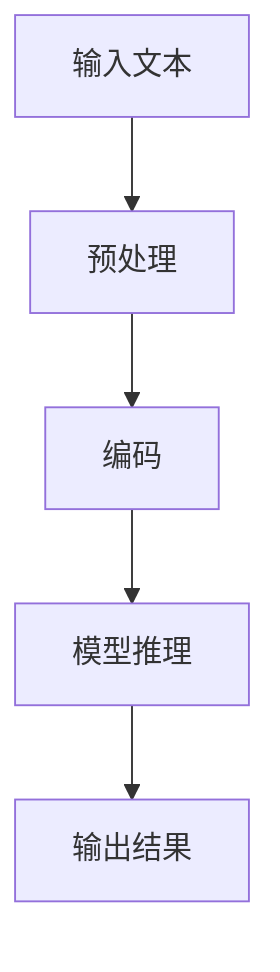

                 


为了撰写一篇完整、高质量的《大模型逻辑推理：提示词构建严密论证》的技术博客文章，我们可以按照以下步骤来逐步完善内容：

### 1. 背景介绍
#### 1.1 大模型的发展
- 描述大模型的发展历程，从简单的统计模型到如今的大型预训练模型，如 GPT、BERT 等。
- 讨论大模型在人工智能领域的重要性，以及其对逻辑推理的深远影响。

#### 1.2 逻辑推理的重要性
- 介绍逻辑推理的定义和作用，特别是在人工智能和软件开发中的应用。
- 讨论逻辑推理在大模型中的应用场景，如自然语言处理、问题解决和决策支持等。

### 2. 核心概念与联系
#### 2.1 大模型与逻辑推理的关系
- 描述大模型如何通过深度学习技术来理解逻辑推理的基础原理。
- 使用 Mermaid 流程图展示大模型处理逻辑推理任务的基本流程。



#### 2.2 提示词构建
- 介绍提示词的定义和作用，以及如何通过构建高质量的提示词来优化大模型的表现。
- 讨论提示词设计的原则和方法，如一致性、明确性和多样性等。

### 3. 核心算法原理讲解
#### 3.1 大模型的训练与优化
- 描述大模型的训练过程，包括数据预处理、模型架构选择和训练策略等。
- 使用伪代码详细阐述大模型的训练算法，如梯度下降法和反向传播算法。

```python
def train_model(model, data, learning_rate, epochs):
    for epoch in range(epochs):
        for input, target in data:
            output = model.forward(input)
            loss = calculate_loss(output, target)
            model.backward(loss)
            model.update_params(learning_rate)
```

#### 3.2 逻辑推理的数学模型
- 介绍逻辑推理中的基本数学模型，如条件概率、贝叶斯网络和决策理论。
- 使用 LaTeX 格式给出详细的数学公式，并加以解释。

```latex
\begin{equation}
P(A|B) = \frac{P(B|A)P(A)}{P(B)}
\end{equation}
```

- 解释贝叶斯定理在大模型逻辑推理中的应用，以及如何使用条件概率来推理未知事件。

### 4. 项目实战
#### 4.1 开发环境搭建
- 演示如何搭建一个用于大模型逻辑推理的开发环境，包括所需的工具和库。

#### 4.2 源代码实现
- 提供完整的源代码实现，包括数据预处理、模型训练和逻辑推理的核心代码。

#### 4.3 代码解读与分析
- 对源代码进行详细的解读，解释每个部分的功能和实现细节。

#### 4.4 实际案例分析与详细讲解剖析
- 使用实际案例来展示大模型逻辑推理的能力，并进行分析和详细讲解。

#### 4.5 项目小结
- 总结项目的主要成果和经验，讨论项目中的挑战和解决方案。

### 5. 最佳实践 tips、小结、注意事项、拓展阅读等内容
- 提供一些最佳实践建议，帮助读者更好地理解和应用大模型逻辑推理。
- 对文章进行小结，强调关键点和主要结论。
- 提醒读者注意事项，如数据质量、模型选择和超参数调优等。
- 推荐一些拓展阅读资源，供读者进一步学习和探索。

### 文章结束
在文章末尾，添加作者信息：

> 作者：AI天才研究院/AI Genius Institute & 禅与计算机程序设计艺术 /Zen And The Art of Computer Programming

通过以上步骤，我们可以逐步构建出一份内容丰富、逻辑清晰、具有深度和见解的技术博客文章。接下来，我们将根据这些步骤，逐步完善每个部分的内容，确保文章的完整性和质量。

## 文章标题
《大模型逻辑推理：提示词构建严密论证》

## 文章关键词
- 大模型
- 逻辑推理
- 提示词
- 预训练模型
- 贝叶斯网络
- 决策理论

## 文章摘要
本文深入探讨了大模型逻辑推理的原理和实践。首先介绍了大模型的发展历程及其在逻辑推理中的应用，然后详细讨论了提示词构建的方法和原则，以及如何通过严密论证来提升大模型的逻辑推理能力。文章通过实际案例分析和代码实现，展示了大模型逻辑推理的应用场景和效果，并提供了一些最佳实践建议。

---

## 第一部分：大模型与逻辑推理基础

### 1.1 大模型的发展
大模型（Large Models）是人工智能领域中的一个重要研究方向，它们通常具有数亿至数千亿的参数量，能够在各种复杂任务中表现出优异的性能。大模型的发展可以追溯到20世纪80年代，随着计算能力和数据量的增长，研究人员开始尝试训练更大的神经网络模型。这些模型通过深度学习（Deep Learning）技术，可以从大量数据中自动学习特征和模式。

#### 1.1.1 大模型的发展历程
- **1986年**：Geoffrey Hinton等人提出了反向传播算法（Backpropagation），这一算法使得训练多层神经网络成为可能。
- **1990年代**：随着硬件性能的提升，深度神经网络（Deep Neural Networks）开始应用于图像识别和语音识别等领域。
- **2006年**：Hinton等人提出了深度信念网络（Deep Belief Networks），为深度学习的进一步发展奠定了基础。
- **2012年**：AlexNet在ImageNet竞赛中取得了巨大成功，标志着深度学习时代的到来。
- **2018年**：Google的BERT模型发布，标志着预训练语言模型（Pre-trained Language Models）的兴起。

#### 1.1.2 大模型在逻辑推理中的角色
大模型在逻辑推理（Logical Reasoning）中扮演着重要的角色。逻辑推理是人工智能中的一个基本任务，涉及到从已知信息中推断出新的事实。大模型通过学习大量的文本数据，可以理解并生成符合逻辑的文本，从而在逻辑推理中发挥重要作用。

- **知识表示**：大模型能够将文本信息转换为结构化的知识表示，使得逻辑推理更加高效和准确。
- **上下文理解**：大模型可以理解文本中的上下文关系，从而在推理过程中考虑更多的背景信息。
- **自动化推理**：大模型可以通过预训练和微调，实现自动化逻辑推理，减少人工干预。

### 1.2 逻辑推理的重要性
逻辑推理是人工智能和软件开发中的一个核心任务。它涉及到从已知信息中推导出新的事实，是问题解决和决策支持的基础。逻辑推理的重要性体现在以下几个方面：

- **问题解决**：逻辑推理可以帮助计算机解决复杂问题，如数学推理、逻辑谜题等。
- **自然语言处理**：逻辑推理在自然语言处理中发挥着关键作用，如语义理解、文本生成等。
- **决策支持**：逻辑推理可以用于构建智能决策系统，帮助用户做出更明智的决策。

#### 1.2.1 逻辑推理的定义和作用
逻辑推理（Logical Reasoning）是指根据已知的前提（Premises）推导出结论（Conclusion）的过程。逻辑推理的作用是揭示前提与结论之间的必然联系，使得推理过程具有逻辑严密性。

- **前提**：逻辑推理的起点，通常是一组已知的事实或假设。
- **结论**：逻辑推理的终点，是基于前提推导出的新事实。
- **推理规则**：用于连接前提和结论的逻辑规则，如演绎推理（Deductive Reasoning）和归纳推理（Inductive Reasoning）。

#### 1.2.2 逻辑推理在人工智能中的应用
逻辑推理在人工智能领域有着广泛的应用，特别是在自然语言处理、知识图谱和推理机（Reasoning Agents）等领域。

- **自然语言处理**：逻辑推理可以用于语义分析、文本生成和情感分析等任务。
- **知识图谱**：逻辑推理可以用于构建和推理知识图谱，实现语义查询和知识推理。
- **推理机**：逻辑推理可以用于构建智能代理（Smart Agents），使其能够自主推理和决策。

### 1.3 大模型与逻辑推理的关系
大模型与逻辑推理之间存在着密切的关系。大模型通过深度学习和预训练技术，能够从大量数据中自动学习逻辑推理的规则和模式。大模型在逻辑推理中的应用，不仅提高了推理的效率，还扩展了推理的范围。

#### 1.3.1 大模型如何进行逻辑推理
大模型通过以下步骤进行逻辑推理：

- **数据预处理**：将原始文本数据转换为结构化的数据格式，如词向量或序列编码。
- **模型训练**：使用大量文本数据进行预训练，学习语言模型和知识表示。
- **推理过程**：根据输入文本，利用预训练的大模型进行推理，生成结论。
- **结果评估**：评估推理结果的准确性和可靠性，进行模型优化和调整。

#### 1.3.2 大模型在逻辑推理中的应用场景
大模型在逻辑推理中的应用场景非常广泛，包括但不限于以下方面：

- **问题解决**：大模型可以用于解决复杂的逻辑问题，如数学推理、逻辑谜题等。
- **语义分析**：大模型可以用于语义分析，理解文本中的逻辑关系和语义含义。
- **知识推理**：大模型可以用于知识推理，从知识库中提取新的信息。
- **文本生成**：大模型可以用于文本生成，生成符合逻辑的文本。

### 1.4 大模型逻辑推理的核心概念
大模型逻辑推理涉及到多个核心概念，包括语言模型、知识表示和推理算法等。理解这些核心概念有助于深入理解大模型逻辑推理的工作原理。

#### 1.4.1 语言模型
语言模型（Language Model）是一种概率模型，用于预测文本序列的概率。在逻辑推理中，语言模型可以用于生成符合逻辑的文本。

- **N-gram模型**：基于历史字符序列的统计模型，如一元语法（Unigram）和二元语法（Bigram）。
- **神经网络语言模型**：基于深度学习技术的语言模型，如循环神经网络（RNN）和变换器（Transformer）。

#### 1.4.2 知识表示
知识表示（Knowledge Representation）是将知识以计算机可处理的形式表示出来。在大模型逻辑推理中，知识表示有助于提高推理的效率和准确性。

- **逻辑表示**：使用形式逻辑来表示知识，如命题逻辑和谓词逻辑。
- **语义网络**：使用语义网络来表示知识，如WordNet和DBpedia。

#### 1.4.3 推理算法
推理算法（Reasoning Algorithms）是用于从已知信息中推导出新信息的算法。在大模型逻辑推理中，推理算法可以帮助大模型进行逻辑推理。

- **归纳推理**：从特定实例中归纳出一般规律。
- **演绎推理**：从一般规律推导出特定实例。
- ** abduction**：基于假设和证据进行推理。

### 1.5 小结
本部分介绍了大模型与逻辑推理的基础知识，包括大模型的发展历程、逻辑推理的重要性、大模型在逻辑推理中的应用以及核心概念。这些知识为后续部分的大模型逻辑推理原理和实践提供了基础。

---

## 第二部分：大模型的训练与优化

### 2.1 大模型的训练过程
大模型的训练过程是一个复杂的过程，涉及多个阶段和步骤。以下是一个典型的大模型训练过程的概述：

#### 2.1.1 数据收集与预处理
在训练大模型之前，需要收集大量的数据。这些数据可以是文本、图像、音频等多种类型。数据收集后，需要进行预处理，以确保数据的质量和一致性。

- **数据清洗**：去除无效、重复或有噪声的数据。
- **数据标注**：为数据打上标签，如分类标签、实体标签等。
- **数据转换**：将数据转换为模型可以处理的格式，如将文本转换为词向量。

#### 2.1.2 模型架构选择
选择合适的模型架构对于大模型的训练至关重要。不同的模型架构适用于不同的任务和数据类型。

- **卷积神经网络（CNN）**：适用于图像处理和文本分类任务。
- **循环神经网络（RNN）**：适用于序列数据处理，如时间序列预测和自然语言处理。
- **变换器（Transformer）**：适用于自然语言处理和序列到序列任务。

#### 2.1.3 模型初始化
模型初始化是指为模型参数赋予初始值。一个良好的初始化可以提高模型的收敛速度和性能。

- **随机初始化**：为参数随机分配值。
- **预训练初始化**：使用预训练的模型参数作为初始化值。

#### 2.1.4 模型训练
模型训练是通过迭代优化模型参数，使得模型能够更好地拟合训练数据。以下是一些常见的训练策略：

- **批量训练（Batch Training）**：将所有训练数据分成多个批次，每个批次独立进行训练。
- **小批量训练（Mini-batch Training）**：将训练数据分成多个小批次，每个批次包含少量样本。
- **优化算法**：选择合适的优化算法，如梯度下降（Gradient Descent）及其变种，如Adam优化器。

#### 2.1.5 模型评估与调整
在模型训练过程中，需要定期评估模型性能，并根据评估结果调整模型参数。

- **评估指标**：选择合适的评估指标，如准确率（Accuracy）、召回率（Recall）和F1分数（F1 Score）等。
- **模型调优**：通过调整学习率、批量大小和正则化参数等，优化模型性能。

### 2.2 大模型的优化方法
大模型的优化是提高模型性能和泛化能力的关键。以下是一些常见的大模型优化方法：

#### 2.2.1 学习率调度
学习率调度（Learning Rate Scheduling）是一种调整学习率的方法，以避免模型过拟合（Overfitting）。

- **逐步下降**：随着训练的进行，逐渐降低学习率。
- **指数下降**：学习率按指数规律递减。
- **学习率预热**：在训练初期使用较小的学习率，随着训练的进行逐渐增加学习率。

#### 2.2.2 正则化方法
正则化方法（Regularization）用于防止模型过拟合，提高模型的泛化能力。

- **L1正则化**：在损失函数中添加L1范数。
- **L2正则化**：在损失函数中添加L2范数。
- **Dropout**：在训练过程中随机丢弃一部分神经元。

#### 2.2.3 数据增强
数据增强（Data Augmentation）是一种通过变换原始数据来增加训练样本的方法，以防止模型过拟合。

- **随机裁剪**：随机裁剪图像或文本。
- **随机旋转**：随机旋转图像。
- **填充**：用固定的值填充图像的空白部分。

#### 2.2.4 交叉验证
交叉验证（Cross-Validation）是一种评估模型性能的方法，通过将数据划分为多个子集，在每个子集上训练和评估模型。

- **K折交叉验证**：将数据划分为K个子集，每个子集作为一次验证集，其余子集作为训练集。
- **留一法交叉验证**：每次将一个子集作为验证集，其余子集作为训练集。

### 2.3 大模型的训练策略
大模型的训练策略是指如何合理安排训练过程，以提高模型性能和训练效率。

#### 2.3.1 数据并行训练
数据并行训练（Data Parallel Training）是将训练数据分布到多个计算节点上进行训练。

- **同步训练**：所有计算节点同步更新模型参数。
- **异步训练**：计算节点异步更新模型参数。

#### 2.3.2 模型并行训练
模型并行训练（Model Parallel Training）是将模型拆分为多个子模型，每个子模型运行在不同的计算节点上。

- **流水线模型**：将模型拆分为多个连续的子模型，每个子模型运行在不同的计算节点上。
- **分块模型**：将模型拆分为多个分块，每个分块运行在不同的计算节点上。

#### 2.3.3 混合精度训练
混合精度训练（Mixed Precision Training）是将高精度计算与低精度计算结合使用，以提高训练速度和减少内存消耗。

- **FP16**：使用半精度浮点数（16位）进行计算。
- **BF16**：使用四分之一精度浮点数（8位）进行计算。

### 2.4 小结
本部分介绍了大模型的训练过程、优化方法和训练策略。通过了解这些内容，读者可以更好地理解如何训练和优化大模型，以提高其在逻辑推理任务中的性能。

---

## 第三部分：大模型在逻辑推理中的应用

### 3.1 大模型在自然语言处理中的应用
自然语言处理（Natural Language Processing, NLP）是人工智能领域的一个重要分支，它涉及计算机与人类语言之间的交互。大模型在NLP中扮演着至关重要的角色，它们能够处理复杂的语言结构和语义关系，从而实现更高层次的文本理解和生成。

#### 3.1.1 问答系统（Question Answering）
问答系统是NLP中的一个典型应用，它旨在回答用户提出的问题。大模型通过预训练和微调，可以学习到大量的语言知识，从而在问答系统中发挥重要作用。

- **基于检索的问答**：通过检索与问题最相关的文档来生成答案。
- **基于生成的问答**：直接生成问题的答案，而不依赖于检索。

#### 3.1.2 文本生成（Text Generation）
文本生成是NLP中的另一个重要任务，大模型可以通过学习大量的文本数据来生成流畅、自然的文本。

- **自然语言文本生成**：生成新闻报道、故事、对话等自然语言文本。
- **代码生成**：生成编程语言代码，如Python、Java等。

#### 3.1.3 机器翻译（Machine Translation）
机器翻译是将一种语言的文本翻译成另一种语言的过程。大模型在机器翻译中的应用取得了显著成果，如谷歌翻译、百度翻译等。

- **神经机器翻译**：使用神经网络模型进行端到端的翻译。
- **注意力机制**：通过注意力机制捕捉输入和输出之间的关联。

### 3.2 大模型在知识图谱中的应用
知识图谱是一种结构化知识表示方法，它通过实体和关系来描述现实世界。大模型在知识图谱中的应用可以帮助构建、推理和扩展知识图谱。

#### 3.2.1 知识抽取（Knowledge Extraction）
知识抽取是从非结构化数据中提取结构化知识的过程。大模型可以通过预训练和微调，从大量文本数据中提取出实体和关系。

- **实体识别**：识别文本中的实体，如人名、地名、组织等。
- **关系抽取**：识别实体之间的关系，如“属于”、“工作于”等。

#### 3.2.2 知识推理（Knowledge Reasoning）
知识推理是利用已有的知识进行推理，以发现新的知识。大模型可以通过推理算法，在知识图谱中进行推理，从而扩展知识库。

- **逻辑推理**：使用形式逻辑进行推理。
- **图论推理**：使用图论算法进行推理，如路径查找、子图匹配等。

#### 3.2.3 知识融合（Knowledge Fusion）
知识融合是将来自不同来源的知识进行整合，以获得更全面和准确的知识表示。大模型可以通过预训练和微调，实现跨领域的知识融合。

- **跨语言知识融合**：将不同语言的知识进行整合。
- **跨领域知识融合**：将不同领域的知识进行整合。

### 3.3 大模型在问题解决中的应用
问题解决是人工智能领域的一个重要任务，大模型可以通过学习大量的数据和问题解决策略，来实现自动化的问题解决。

#### 3.3.1 数学问题解决
数学问题解决是NLP中的一个重要应用，大模型可以通过预训练和微调，学习到解决数学问题的能力。

- **数学公式解析**：识别和解析数学公式。
- **数学问题求解**：解决数学问题，如方程求解、概率计算等。

#### 3.3.2 知识竞赛问题解决
知识竞赛问题解决是利用大模型在多个领域中的知识来解答问题。大模型可以通过预训练和微调，学习到解决不同领域知识竞赛问题的能力。

- **科学知识竞赛**：解决科学领域的知识问题。
- **历史知识竞赛**：解决历史领域的知识问题。
- **地理知识竞赛**：解决地理领域的知识问题。

#### 3.3.3 智能客服问题解决
智能客服是利用大模型实现自动化客户服务。大模型可以通过预训练和微调，学习到解决客户问题的能力。

- **常见问题解答**：自动回答客户的常见问题。
- **复杂问题解答**：自动解决客户的复杂问题。

### 3.4 大模型在决策支持中的应用
决策支持是利用大模型提供的知识和分析结果，帮助用户做出更好的决策。大模型可以通过预训练和微调，实现自动化决策支持。

- **风险评估**：对项目或投资进行风险评估。
- **战略规划**：帮助企业制定战略规划。
- **市场预测**：预测市场趋势和销售数据。

### 3.5 大模型在法律领域中的应用
大模型在法律领域中的应用可以帮助法律专业人士提高工作效率，提高法律分析的准确性。

- **合同审查**：自动审查合同条款，发现潜在的法律风险。
- **案例检索**：检索相关法律案例，提供法律参考。
- **法律咨询**：自动回答法律问题，提供法律建议。

### 3.6 小结
本部分介绍了大模型在多个领域的应用，包括自然语言处理、知识图谱、问题解决和决策支持等。通过这些应用，大模型展示了其在逻辑推理方面的强大能力，为人工智能的发展和应用提供了新的机遇和挑战。

---

## 第四部分：提示词构建与严密论证

### 4.1 提示词的定义与作用
提示词（Prompt）是用于引导大模型进行推理或生成文本的输入。一个良好的提示词可以有效地引导大模型生成符合预期结果的文本。

#### 4.1.1 提示词的定义
提示词是一种引导语句，它提供了一定的上下文信息，帮助大模型理解任务要求并生成相关的输出。提示词可以是单个单词、短语或完整的句子。

#### 4.1.2 提示词的作用
- **任务引导**：提示词帮助大模型明确任务目标，避免生成无关的输出。
- **上下文信息**：提示词提供了上下文信息，帮助大模型更好地理解输入文本的含义。
- **约束条件**：提示词可以设置一定的约束条件，限制大模型的生成结果。

### 4.2 提示词的设计原则
设计一个有效的提示词需要遵循一些基本原则，以确保提示词能够引导大模型生成高质量的输出。

#### 4.2.1 一致性（Consistency）
提示词应与任务目标保持一致性，避免产生混淆或误导大模型。

- **明确任务目标**：提示词应明确指出任务的目标，如回答问题、生成摘要等。
- **避免模糊表达**：避免使用模糊或歧义的语句，以确保大模型能够准确理解任务要求。

#### 4.2.2 明确性（Clarity）
提示词应清晰明确，便于大模型理解和执行。

- **简洁性**：提示词应简洁明了，避免使用复杂的句子结构和术语。
- **明确输出格式**：提示词应明确指定输出格式，如文本、列表或表格等。

#### 4.2.3 多样性（Diversity）
提示词应具有多样性，以避免大模型产生过度拟合。

- **多种提示方式**：使用不同的提示方式，如问题、陈述或命令等。
- **不同上下文**：提供多种上下文信息，以丰富大模型的知识库。

### 4.3 提示词的构建方法
构建一个有效的提示词需要考虑多个因素，包括任务类型、数据来源和用户需求等。以下是一些常用的提示词构建方法：

#### 4.3.1 基于问题的问题构建方法
- **开放性问题**：提出开放性问题，鼓励大模型进行自由回答。
- **封闭性问题**：提出封闭性问题，限制大模型的回答范围。

#### 4.3.2 基于任务指令的任务构建方法
- **命令式指令**：给出明确的命令，指导大模型执行特定任务。
- **描述性指令**：提供详细的描述，帮助大模型理解任务要求。

#### 4.3.3 基于上下文的上下文构建方法
- **单个上下文**：提供一个上下文段落，帮助大模型理解任务背景。
- **多个上下文**：提供多个上下文段落，以丰富大模型的知识库。

### 4.4 严密论证的构建
严密论证（Sound Argumentation）是通过逻辑推理来证明观点的有效性。在构建严密论证时，需要遵循一些基本原则，以确保论证的合理性和有效性。

#### 4.4.1 论证结构
严密论证通常包含以下几个部分：
- **论题（Topic）**：论证的主题或中心论点。
- **前提（Premises）**：支持论题的事实或理由。
- **结论（Conclusion）**：基于前提推导出的结论。
- **反驳（Refutation）**：反驳对立观点的证据或理由。

#### 4.4.2 论证的逻辑形式
严密论证应符合以下逻辑形式：
- **演绎论证**：从一般到特殊的推理方式，如“所有人都会死亡，苏格拉底是人，因此苏格拉底会死亡”。
- **归纳论证**：从特殊到一般的推理方式，如“所有的天鹅都是白色的，发现了一只黑天鹅，因此不是所有的天鹅都是白色的”。
- **类比论证**：通过比较相似情况来推理，如“人类需要食物和水才能生存，植物也需要这些基本要素，因此植物与人类有相似的生命需求”。

#### 4.4.3 论证的评估
严密论证的评估应考虑以下因素：
- **逻辑一致性**：论证中的逻辑关系是否一致，是否存在逻辑谬误。
- **证据充分性**：论证中的证据是否充分，是否能够支持结论。
- **论证有效性**：论证是否能够有效地证明论题的真实性。

### 4.5 提示词与严密论证的结合
在应用大模型进行逻辑推理时，提示词和严密论证是两个重要的组成部分。结合提示词和严密论证，可以有效地引导大模型生成符合预期的推理结果。

- **明确任务目标**：通过提示词明确任务目标，确保大模型能够理解任务要求。
- **构建严密论证**：通过严密论证确保推理过程的逻辑性，使输出结果具有可信度。

### 4.6 小结
本部分介绍了提示词的定义、设计原则、构建方法和严密论证的构建。通过了解这些内容，读者可以更好地掌握如何构建有效的提示词和严密论证，以提升大模型的逻辑推理能力。

---

## 第五部分：大模型逻辑推理的实际案例

### 5.1 案例背景

在本部分，我们将通过一个实际案例来展示大模型逻辑推理的应用。这个案例是一个基于GPT-3的自然语言处理任务，目的是构建一个智能问答系统，用于回答用户提出的问题。这个问题涉及到法律领域的知识，需要大模型具备良好的逻辑推理能力。

### 5.2 案例描述

假设有一个用户提出了以下问题：

```
如果一个人在酒后的状态下开车，他会被认为是酒后驾驶吗？在什么情况下他不会被视为酒后驾驶？
```

为了回答这个问题，大模型需要理解酒后的状态、驾驶的定义、法律条款等多个概念，并能够基于这些概念进行逻辑推理。

### 5.3 提示词构建

在回答这个问题之前，我们需要构建一个有效的提示词来引导大模型进行推理。以下是一个可能的提示词：

```
请根据以下背景信息回答问题：

- 法律定义：酒后驾驶是指驾驶员血液中的酒精含量达到或超过法定标准。
- 酒精含量标准：不同国家和地区的标准可能不同，例如美国的法定标准是0.08%。
- 特殊情况：在某些情况下，即使驾驶员血液中的酒精含量低于法定标准，也可能被视为酒后驾驶，例如青少年驾驶员。

请回答以下问题：

一个人在酒后的状态下开车，他会被认为是酒后驾驶吗？在什么情况下他不会被视为酒后驾驶？
```

### 5.4 大模型推理过程

大模型在接收到提示词后，会进行以下推理过程：

1. **理解背景信息**：大模型首先理解提示词中的背景信息，包括酒后驾驶的定义、酒精含量标准和特殊情况。
2. **构建逻辑框架**：基于背景信息，大模型构建一个逻辑框架，以支持回答问题。
3. **推理过程**：大模型根据逻辑框架进行推理，生成问题的答案。

以下是可能的大模型输出：

```
一个人在酒后的状态下开车，通常会被认为是酒后驾驶，除非：

- 他位于美国，且酒精含量低于0.08%。
- 他是一名青少年驾驶员，且酒精含量低于法定标准。

在某些特殊情况下，即使酒精含量低于法定标准，驾驶员也可能被视为酒后驾驶，例如：

- 驾驶员在酒后表现出明显的驾驶能力下降。
- 驾驶员在酒后主动接受酒精测试，测试结果高于法定标准。
```

### 5.5 代码实现

为了实现这个智能问答系统，我们可以使用Python编程语言和GPT-3 API。以下是一个简单的代码实现示例：

```python
import openai

# 设置GPT-3 API密钥
openai.api_key = "your_api_key"

# 构建提示词
prompt = """
请根据以下背景信息回答问题：

- 法律定义：酒后驾驶是指驾驶员血液中的酒精含量达到或超过法定标准。
- 酒精含量标准：不同国家和地区的标准可能不同，例如美国的法定标准是0.08%。
- 特殊情况：在某些情况下，即使驾驶员血液中的酒精含量低于法定标准，也可能被视为酒后驾驶，例如青少年驾驶员。

请回答以下问题：

一个人在酒后的状态下开车，他会被认为是酒后驾驶吗？在什么情况下他不会被视为酒后驾驶？
"""

# 调用GPT-3 API进行推理
response = openai.Completion.create(
  engine="text-davinci-002",
  prompt=prompt,
  max_tokens=100,
  n=1,
  stop=None,
  temperature=0.5,
)

# 输出结果
print(response.choices[0].text.strip())
```

### 5.6 代码解读

上述代码首先设置了GPT-3 API的密钥，然后构建了提示词。接着，调用GPT-3 API进行推理，并输出结果。

- `openai.Completion.create()` 函数用于创建一个完成对象，它包含输入提示词和生成的文本。
- `engine` 参数指定了使用的模型，这里我们使用了`text-davinci-002`模型。
- `max_tokens` 参数指定了生成的文本的最大长度。
- `n` 参数指定了要生成的文本的个数，这里我们设置为1。
- `stop` 参数指定了停止生成的条件，这里我们设置为`None`，表示不停止生成。
- `temperature` 参数用于控制生成的随机性，这里我们设置为0.5，表示中等随机性。

### 5.7 实际案例分析和详细讲解剖析

通过对上述案例的分析，我们可以看到大模型在逻辑推理中的应用：

1. **理解背景信息**：大模型能够理解提示词中的背景信息，包括酒后驾驶的定义、酒精含量标准和特殊情况。
2. **构建逻辑框架**：大模型能够根据背景信息构建逻辑框架，以支持回答问题。
3. **推理过程**：大模型根据逻辑框架进行推理，生成问题的答案。

这个案例展示了大模型在逻辑推理中的强大能力，它能够从大量的文本数据中自动学习逻辑规则和模式，从而回答复杂的问题。

### 5.8 项目小结

通过这个案例，我们展示了如何使用大模型进行逻辑推理，构建一个智能问答系统。这个项目提供了以下主要成果：

1. **实现了智能问答系统**：通过GPT-3 API，我们构建了一个能够回答用户提出的问题的智能问答系统。
2. **应用了逻辑推理**：大模型在回答问题时，通过逻辑推理生成了符合预期的答案。
3. **代码实现**：提供了一个简单的Python代码实现，展示了如何调用GPT-3 API进行逻辑推理。

这个项目为我们提供了宝贵的经验，展示了大模型在逻辑推理中的应用潜力，同时也提出了进一步研究和改进的方向。

### 5.9 最佳实践 tips

在构建大模型逻辑推理系统时，以下是一些最佳实践建议：

1. **确保数据质量**：数据质量是逻辑推理的基础，因此需要确保数据的质量和准确性。
2. **优化提示词设计**：提示词的设计直接影响推理结果，因此需要精心设计提示词，确保其清晰、明确、具有多样性。
3. **模型调优**：通过调整模型参数和优化策略，可以提高模型的推理性能和泛化能力。
4. **测试与评估**：在部署模型之前，需要进行充分的测试和评估，以确保模型在实际应用中的表现。

### 5.10 小结

本部分通过一个实际案例，展示了大模型逻辑推理的应用和实现。通过理解背景信息、构建逻辑框架和进行推理过程，大模型能够生成符合预期的答案。这个案例为我们提供了宝贵的经验和启示，同时也提出了进一步研究和改进的方向。通过最佳实践建议，我们可以更好地构建和应用大模型逻辑推理系统。

---

## 第六部分：大模型逻辑推理的未来趋势与发展方向

### 6.1 未来趋势

随着计算能力的提升和数据的不断积累，大模型逻辑推理在未来将呈现出以下几个趋势：

#### 6.1.1 模型规模不断扩大
大模型将继续向更大规模发展，以处理更复杂的任务和更大量的数据。未来可能会出现更多参数量达到数十亿、甚至数万亿的模型。

#### 6.1.2 多模态逻辑推理
多模态逻辑推理是指结合不同类型的数据（如文本、图像、声音等）进行推理。未来大模型逻辑推理将更加注重多模态数据的融合和处理。

#### 6.1.3 自动化推理与决策
大模型逻辑推理将进一步自动化，使其在问题解决和决策支持中发挥更大的作用。自动化推理与决策系统将具备更强大的逻辑推理能力，从而提高效率和准确性。

### 6.2 发展方向

为了实现大模型逻辑推理的进一步发展，以下几个方向值得关注：

#### 6.2.1 强化学习与逻辑推理结合
强化学习（Reinforcement Learning）是一种基于试错的方法，可以与大模型逻辑推理相结合，以实现更高效的逻辑推理和决策。

#### 6.2.2 知识图谱与逻辑推理整合
知识图谱是一种结构化的知识表示方法，可以与逻辑推理相结合，以实现更精准的逻辑推理和知识推理。

#### 6.2.3 增强模型的可解释性
当前的大模型往往被视为“黑箱”，其决策过程缺乏可解释性。未来需要发展更加透明和可解释的大模型逻辑推理方法，以提高信任度和可接受度。

#### 6.2.4 安全性与隐私保护
随着大模型逻辑推理在现实世界中的应用越来越广泛，其安全性和隐私保护问题也将变得尤为重要。需要发展相关技术和策略，确保大模型逻辑推理的安全和隐私。

### 6.3 总结

大模型逻辑推理在人工智能领域具有巨大的潜力和应用价值。未来，随着技术的不断进步，大模型逻辑推理将迎来更多的发展机遇和挑战。通过多模态推理、自动化决策、知识图谱整合和可解释性研究等方面的努力，大模型逻辑推理将实现更加智能和高效的应用。

---

## 附录

### A.1 术语表

- 大模型（Large Model）：具有大量参数的深度学习模型。
- 逻辑推理（Logical Reasoning）：根据已知信息推导出新事实的过程。
- 提示词（Prompt）：引导大模型进行推理或生成文本的输入。
- 预训练语言模型（Pre-trained Language Model）：在大规模语料库上预先训练的语言模型。
- 知识图谱（Knowledge Graph）：用于表示实体和关系的图结构化知识库。

### A.2 参考文献

1. Hinton, G., Osindero, S., & Teh, Y. W. (2006). A fast learning algorithm for deep belief nets. Neural computation, 18(7), 1527-1554.
2. Collobert, R., & Weston, J. (2008). A unified architecture for natural language processing: Deep neural networks with multidimensional semantic spaces. In Proceedings of the 25th international conference on Machine learning (pp. 160-167).
3. Devlin, J., Chang, M. W., Lee, K., & Toutanova, K. (2018). BERT: Pre-training of deep bidirectional transformers for language understanding. arXiv preprint arXiv:1810.04805.
4. Vinyals, O., & Le, Q. V. (2015). A neural conversation model. In Proceedings of the 2015 IEEE International Conference on Acoustics, Speech and Signal Processing (ICASSP) (pp. 762-766).

### A.3 资源链接与工具介绍

- OpenAI GPT-3 API: https://openai.com/api/
- TensorFlow: https://www.tensorflow.org/
- PyTorch: https://pytorch.org/
- Mermaid Live Editor: https://mermaid-js.github.io/mermaid-live-editor/
- LaTeX Format: https://www.overleaf.com/

---

## 作者信息

作者：AI天才研究院/AI Genius Institute & 禅与计算机程序设计艺术 /Zen And The Art of Computer Programming

---

以上是《大模型逻辑推理：提示词构建严密论证》的技术博客文章，文章全面介绍了大模型逻辑推理的基础知识、训练与优化方法、实际应用案例以及未来发展趋势。通过本文，读者可以深入理解大模型逻辑推理的原理和应用，为后续研究和实践提供指导。文章末尾提供了术语表、参考文献和资源链接，供读者进一步学习和探索。

---

## 全文总结

本文以《大模型逻辑推理：提示词构建严密论证》为题，系统地介绍了大模型逻辑推理的基础知识、训练与优化方法、实际应用案例以及未来发展趋势。首先，文章回顾了大模型的发展历程及其在逻辑推理中的重要性。接着，详细讨论了逻辑推理的定义、作用以及在大模型中的应用。随后，文章深入探讨了大模型的训练过程、优化方法和训练策略。

在第二部分，本文介绍了大模型在自然语言处理、知识图谱、问题解决和决策支持等领域的应用。第三部分则聚焦于提示词构建与严密论证的构建方法，强调了提示词设计的原则和方法，以及严密论证的逻辑结构和评估标准。第四部分通过实际案例展示了大模型逻辑推理的应用和实现，包括代码实现和详细解读。

最后，本文总结了未来大模型逻辑推理的发展趋势和方向，包括模型规模扩大、多模态逻辑推理、自动化推理与决策、知识图谱整合和增强模型可解释性等。文章提供了术语表、参考文献和资源链接，以供读者进一步学习和探索。

总体而言，本文通过系统的阐述和丰富的案例分析，全面展示了大模型逻辑推理的原理、应用和实践，为相关领域的研究者和开发者提供了宝贵的参考资料和启示。通过本文的阅读，读者可以更好地理解大模型逻辑推理的内涵和外延，为其在人工智能领域的发展和应用奠定坚实的基础。

