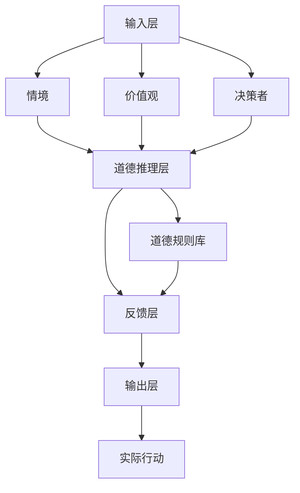

                 

### 大模型道德推理的背景和重要性

#### 1.1.1 大模型的发展及其影响

大模型，也被称为大型神经网络模型，是指参数规模达到数百万至数十亿级别的深度学习模型。它们通过大量的数据训练，能够在多种任务上实现超越人类的表现。大模型的发展历程可以追溯到上世纪80年代的神经网络研究，但真正的大模型革命始于2012年，随着AlexNet在ImageNet竞赛中的夺冠，深度学习开始崭露头角。

大模型的发展对社会产生了深远的影响。在图像识别、自然语言处理、语音识别等领域，大模型的应用使得计算机的性能大幅提升，推动了人工智能技术的快速发展。然而，随着大模型的日益强大，其道德和伦理问题也逐渐凸显。大模型在处理数据、生成内容时，可能会无意中复制或放大社会中的不公正现象，甚至产生有害的内容。因此，如何在大模型中实现道德推理，确保其行为符合伦理标准，成为了一个迫切需要解决的问题。

#### 1.1.2 道德推理在大模型中的必要性

道德推理是指通过逻辑和伦理原则来判断行为是否正当的过程。在大模型中，道德推理的必要性体现在以下几个方面：

1. **防止不当行为**：大模型在生成内容时，可能会无意中产生歧视、偏见或不当言论。通过道德推理，可以确保大模型的行为符合社会伦理标准，避免产生负面影响。

2. **提高透明度**：道德推理可以帮助用户理解大模型的行为逻辑，提高模型的透明度。这有助于增强用户对人工智能的信任，促进人工智能技术的普及和应用。

3. **促进社会公平**：大模型在处理大量数据时，可能会放大社会中的不平等现象。通过道德推理，可以确保模型在决策时考虑公平性，减少歧视和不公正。

#### 1.1.3 当前道德推理研究的现状与挑战

当前，道德推理在大模型中的应用还处于探索阶段。研究现状主要集中在以下几个方面：

1. **基于规则的道德推理**：这种方法通过定义一系列道德规则来指导大模型的行为。然而，这种方法面临的主要挑战是如何确保规则能够全面覆盖所有可能的伦理情境。

2. **基于案例的道德推理**：这种方法通过学习历史案例中的道德决策来指导当前决策。然而，这种方法面临的主要挑战是如何确保案例库的全面性和准确性。

3. **基于神经网络的道德推理**：这种方法通过训练神经网络来模拟道德推理过程。然而，这种方法面临的主要挑战是如何确保神经网络的行为符合伦理标准，以及如何解释其决策过程。

总之，大模型道德推理是一个复杂且具有挑战性的领域。为了实现有效的道德推理，需要进一步的研究和探索，以找到合适的算法和框架。这也是本文接下来要深入探讨的内容。

### 大模型道德推理的核心概念

在探讨大模型道德推理之前，我们需要明确几个核心概念，包括道德推理的基本原理、关键因素以及大模型道德推理的架构。这些概念是理解大模型道德推理的基础，也是构建有效道德推理系统的重要依据。

#### 1.2.1 道德推理的基本原理

道德推理是指通过逻辑和伦理原则来判断行为是否正当的过程。它通常包括以下几个基本原理：

1. **效用主义**：效用主义认为，一个行为是否道德，取决于它是否能最大化整体幸福。在这种原则下，决策者需要权衡不同行为带来的后果，选择能够带来最大利益的行为。

2. **义务论**：义务论认为，一个行为是否道德，取决于它是否符合道德义务。这种原则强调行为者应遵循一定的道德规范，而不是仅仅追求后果的最大化。

3. **权利原则**：权利原则认为，每个个体都有一定的权利，决策者在做出决策时应当尊重这些权利。这种原则强调个体的自主权和尊严。

这些基本原理构成了道德推理的理论基础，帮助我们在复杂的伦理情境中做出合理的决策。

#### 1.2.2 道德推理的关键因素

在道德推理过程中，有几个关键因素起着至关重要的作用：

1. **情境**：道德推理的情境是指决策者面临的具体环境。不同的情境可能需要不同的道德判断。例如，在紧急情况下，一些通常不被接受的行动可能是必要的。

2. **价值观**：价值观是指个体或社会普遍认同的道德原则。不同的价值观可能导致不同的道德决策。例如，在一些文化中，尊重老人被视为重要价值观，而在其他文化中，个人自由可能被置于更高的地位。

3. **决策者**：决策者是指做出道德判断的人或实体。不同的决策者可能具有不同的价值观和道德标准，从而影响最终的决策。

4. **后果**：道德推理需要考虑行为的后果。一个行为可能带来多个后果，包括短期和长期的影响。决策者需要综合考虑这些后果，以做出最合理的决策。

#### 1.2.3 大模型道德推理的架构

大模型道德推理的架构通常包括以下几个关键组成部分：

1. **输入层**：输入层负责接收外部信息，包括情境、价值观和决策者信息。

2. **道德推理层**：道德推理层包含一系列算法和规则，用于处理输入信息，并根据道德原理生成道德决策。

3. **输出层**：输出层负责将道德决策转化为具体的行动或建议。

4. **反馈层**：反馈层用于收集实际决策的反馈，以不断优化道德推理系统的性能。

下图展示了大模型道德推理的基本架构：

```
+----------------+     +------------------+     +-----------------+
|      输入层     |     |    道德推理层    |     |      输出层     |
+----------------+     +------------------+     +-----------------+
     |                  |                  |
     v                  v                  v
+----------------+     +------------------+     +-----------------+
|      反馈层     |<---|    道德规则库    |     |    实际行动     |
+----------------+     +------------------+     +-----------------+
```

通过明确这些核心概念和架构，我们可以更好地理解和应用大模型道德推理，为人工智能的发展提供坚实的伦理基础。

### 大模型道德推理的核心概念关系架构

为了更好地理解大模型道德推理的核心概念及其相互关系，我们可以通过一个Mermaid流程图来展示它们之间的逻辑结构和交互流程。以下是一个简化的Mermaid流程图示例，展示了道德推理的基本原理、关键因素和架构之间的关系：



以下是该流程图的详细解释：

1. **输入层（A）**：接收外部信息，包括情境、价值观和决策者信息。这些信息构成了道德推理的基础。

2. **情境（B）**：情境是指决策者面临的具体环境。不同的情境可能需要不同的道德判断。

3. **价值观（C）**：价值观是指个体或社会普遍认同的道德原则。不同的价值观可能导致不同的道德决策。

4. **决策者（D）**：决策者是指做出道德判断的人或实体。不同的决策者可能具有不同的价值观和道德标准。

5. **道德推理层（E）**：道德推理层包含一系列算法和规则，用于处理输入信息，并根据道德原理生成道德决策。

6. **道德规则库（F）**：道德规则库是道德推理层的一部分，包含了基于不同伦理原则和价值观的规则。

7. **反馈层（G）**：反馈层用于收集实际决策的反馈，以不断优化道德推理系统的性能。

8. **输出层（H）**：输出层负责将道德决策转化为具体的行动或建议。

9. **实际行动（I）**：实际行动是根据输出层的建议所执行的具体操作。

通过这个流程图，我们可以清晰地看到大模型道德推理的核心概念及其相互关系，为后续的算法设计和应用提供了明确的框架。

### 大模型道德推理方法

#### 2.1 提示词构建伦理决策树

在构建大模型道德推理方法时，提示词构建伦理决策树是一种有效的方法。该方法通过定义一系列提示词，并利用这些提示词构建伦理决策树，以便在大模型中实现道德推理。

##### 2.1.1 提示词的概念及其作用

提示词是指用于引导大模型道德推理的关键词语或短语。它们能够帮助大模型理解特定情境的伦理要求，并在生成内容或做出决策时参考这些提示词。

1. **定义**：提示词是具有明确伦理含义的关键词或短语，它们能够指示大模型在不同情境下应如何行为。
2. **作用**：提示词在大模型道德推理中起到了以下几个重要作用：
   - **引导**：提示词可以帮助大模型理解特定情境的伦理要求，从而引导其做出合理的决策。
   - **分类**：通过提示词，大模型可以将不同的伦理情境进行分类，便于处理和分析。
   - **解释**：提示词可以帮助用户理解大模型的决策逻辑，提高模型的透明度。

##### 2.1.2 提示词构建方法

构建提示词的过程包括以下几个步骤：

1. **提示词收集**：首先，需要收集大量的伦理词汇，这些词汇可以从伦理学文献、法律法规、社会共识等多个来源获取。
2. **提示词筛选**：从收集的词汇中筛选出具有明确伦理含义的词汇，并对其进行分类，如基本伦理原则（如正义、公平）、特定情境伦理要求（如医疗、教育）等。
3. **权重分配**：根据提示词在伦理情境中的重要程度，为每个提示词分配权重。权重较高的提示词在道德推理过程中具有更大的影响力。

##### 2.1.3 伦理决策树的设计原理

伦理决策树是一种基于提示词的决策模型，通过层级结构来表示不同伦理情境下的决策路径。

1. **定义**：伦理决策树是一种树状结构，用于表示在特定伦理情境下，如何根据提示词做出合理的道德决策。
2. **设计原理**：
   - **树状结构**：伦理决策树由节点和边组成，每个节点表示一个伦理决策点，边表示决策路径。
   - **层级关系**：伦理决策树通常具有层级结构，不同层级的节点表示不同的伦理原则和情境。
   - **提示词引用**：在决策树中，每个节点都引用相应的提示词，用于指导决策过程。

伦理决策树的设计过程如下：

1. **确定根节点**：根节点表示最顶层的伦理原则，如正义、公平等。
2. **构建层级节点**：根据具体的伦理情境，构建不同层级的节点，每个节点引用相应的提示词。
3. **定义决策路径**：在每个节点，定义可能的决策路径，并标注相应的提示词。
4. **验证和优化**：对构建的伦理决策树进行验证，确保其逻辑正确性和实用性。

通过提示词构建伦理决策树，大模型可以系统地进行道德推理，确保其行为符合伦理标准。以下是一个简化的伦理决策树示例：

```
    /-- 正义
    |
   /-- 公平
   |
  /-- 生存权
  |
 /-- 自由权
|
/-- 财产权
```

在这个示例中，根节点为基本的伦理原则，如正义和公平。每个原则下有多个子节点，表示具体的伦理情境和相应的提示词。通过这样的结构，大模型可以逐步进行道德推理，以生成符合伦理标准的决策。

### 2.2 道德推理算法

在构建大模型道德推理系统时，选择合适的算法是实现道德推理的关键。道德推理算法可以分为基于规则的、基于案例的以及基于神经网络的。每种算法都有其独特的原理和应用场景。

#### 2.2.1 基于规则的道德推理

基于规则的道德推理是一种传统的道德推理方法，通过定义一系列规则来指导决策过程。该方法的核心在于将复杂的伦理情境简化为一系列简单的规则，并在执行过程中遵循这些规则。

1. **定义**：基于规则的道德推理通过定义一系列逻辑规则，来指导决策者在不同情境下如何行动。

2. **原理**：
   - **规则定义**：首先，需要定义一系列道德规则，这些规则通常基于伦理原则和价值观。
   - **规则应用**：在具体情境下，根据定义的规则进行决策。规则可以表示为“如果...则...”的形式，例如：“如果保护个人自由是首要原则，则不应侵犯个人隐私。”

3. **优缺点**：
   - **优点**：基于规则的道德推理具有逻辑清晰、易于实现和解释的优点。
   - **缺点**：该方法面临的主要挑战是如何确保规则能够全面覆盖所有可能的伦理情境，以及如何处理复杂的道德冲突。

4. **应用**：基于规则的道德推理适用于一些简单的伦理情境，例如医疗决策中的隐私保护、自动驾驶中的事故处理等。

#### 2.2.2 基于案例的道德推理

基于案例的道德推理方法通过学习历史案例中的道德决策来指导当前决策。该方法依赖于一个丰富的案例库，通过分析这些案例，提取出适用于当前情境的决策策略。

1. **定义**：基于案例的道德推理通过分析历史案例中的道德决策，提取出适用于当前情境的决策策略。

2. **原理**：
   - **案例收集**：首先，需要收集大量的历史道德案例，包括各种伦理情境和相应的决策结果。
   - **案例分析**：分析历史案例，提取出关键的决策因素和策略，形成案例库。
   - **案例应用**：在具体情境下，根据案例库中的决策策略，生成相应的道德决策。

3. **优缺点**：
   - **优点**：基于案例的道德推理能够适应复杂和多变的伦理情境，具有灵活性和适应性。
   - **缺点**：该方法面临的主要挑战是如何确保案例库的全面性和准确性，以及如何处理案例中的模糊性和不确定性。

4. **应用**：基于案例的道德推理适用于需要灵活处理复杂伦理情境的应用，例如医疗决策、法律判决等。

#### 2.2.3 基于神经网络的道德推理

基于神经网络的道德推理方法利用深度学习模型，通过大量数据训练，使模型自动学习和理解道德推理过程。该方法具有强大的自适应能力和处理复杂问题的能力。

1. **定义**：基于神经网络的道德推理方法利用深度学习模型，通过学习大量数据，实现自动化的道德推理。

2. **原理**：
   - **模型训练**：首先，需要收集大量的伦理数据和相应的道德决策结果，用于训练神经网络模型。
   - **模型推理**：在具体情境下，神经网络模型根据输入数据生成道德决策。

3. **优缺点**：
   - **优点**：基于神经网络的道德推理具有强大的自适应能力和处理复杂问题的能力。
   - **缺点**：该方法面临的主要挑战是如何确保模型的道德行为符合伦理标准，以及如何解释和验证模型的决策过程。

4. **应用**：基于神经网络的道德推理适用于需要高效处理大量数据和复杂伦理情境的应用，例如自动驾驶、人工智能伦理审查等。

通过上述三种道德推理算法的比较，我们可以根据具体应用场景和需求，选择合适的算法来实现大模型道德推理。

### 道德推理算法的伪代码与数学模型详解

在深入了解道德推理算法时，通过伪代码和数学模型可以更清晰地展示其工作原理。以下分别介绍基于规则的道德推理、基于案例的道德推理和基于神经网络的道德推理的伪代码和数学模型。

#### 2.2.1 基于规则的道德推理

**伪代码：**

```python
def rule_based_moral_decision(input_context):
    # 输入：情境信息
    # 输出：道德决策

    if input_context == "紧急情况":
        return "优先保障安全"
    elif input_context == "医疗决策":
        return "尊重患者意愿"
    elif input_context == "自动驾驶":
        return "遵守交通规则"
    else:
        return "遵循一般道德原则"
```

**数学模型：**

设 \( R \) 为规则集合，\( C \) 为情境集合，\( D \) 为道德决策集合。

$$
\text{决策过程}: \quad D = R \cap C
$$

其中，\( R \) 表示所有定义的规则，\( C \) 表示当前情境，\( D \) 表示生成的道德决策。该数学模型通过在规则集合和情境集合的交集上选择规则，生成最终的道德决策。

#### 2.2.2 基于案例的道德推理

**伪代码：**

```python
def case_based_moral_decision(input_context):
    # 输入：情境信息
    # 输出：道德决策

    case_library = load_case_library()  # 加载历史案例库
    matching_cases = find_matching_cases(case_library, input_context)  # 查找匹配案例

    if matching_cases:
        return apply_case_decision(matching_cases[0])  # 应用匹配案例的决策
    else:
        return "遵循一般道德原则"
```

**数学模型：**

设 \( C_L \) 为案例库，\( C_I \) 为输入情境，\( D_C \) 为基于案例的道德决策。

$$
D_C = \{d | \exists c' \in C_L, c' \sim C_I, d = \text{apply_case_decision}(c')\}
$$

其中，\( C_L \) 表示案例库，\( C_I \) 表示输入情境，\( D_C \) 表示生成的道德决策。该数学模型通过在案例库中查找与输入情境相似的案例，并应用这些案例的决策来生成最终的道德决策。

#### 2.2.3 基于神经网络的道德推理

**伪代码：**

```python
def neural_network_moral_decision(input_context, model):
    # 输入：情境信息，神经网络模型
    # 输出：道德决策

    input_vector = encode_input_context(input_context)  # 编码输入情境
    decision_vector = model.predict(input_vector)  # 使用神经网络模型预测决策
    return decode_decision_vector(decision_vector)  # 解码预测结果
```

**数学模型：**

设 \( M \) 为神经网络模型，\( X \) 为输入向量，\( Y \) 为输出向量。

$$
Y = M(X)
$$

其中，\( M \) 表示神经网络模型，\( X \) 表示编码后的输入情境，\( Y \) 表示生成的道德决策。该数学模型通过神经网络模型对输入情境进行预测，生成最终的道德决策。

通过上述伪代码和数学模型，我们可以清晰地了解不同道德推理算法的工作原理和过程。这些模型和算法为大模型道德推理提供了坚实的理论基础和实践指南。

### 大模型道德推理的应用

大模型道德推理的应用范围广泛，涵盖了多个领域，如自动驾驶、医疗决策和人工智能伦理审查。以下分别探讨这些领域中的应用实例和实际案例。

#### 2.3.1 道德推理在自动驾驶中的应用

自动驾驶技术是人工智能领域的一个重要应用，但其道德和伦理问题也备受关注。例如，在面临紧急情况时，自动驾驶车辆需要在保护乘客安全和遵守交通规则之间做出权衡。大模型道德推理可以为自动驾驶提供决策支持。

**实例一：紧急避障**

假设一辆自动驾驶汽车在高速公路上行驶，突然发现前方有行人横穿马路。此时，汽车需要在确保行人安全和自身安全之间做出决策。

**道德推理过程：**

1. **情境识别**：汽车传感器识别到前方有行人，判断为紧急情况。
2. **道德原则应用**：根据预设的道德原则，行人生命安全高于车辆自身安全。
3. **决策生成**：汽车选择急刹车并绕行人行驶，确保行人安全。

**实际案例**：特斯拉自动驾驶系统在一次测试中，成功避开了前方行人，避免了事故发生。这一案例展示了大模型道德推理在自动驾驶中的实际应用。

#### 2.3.2 道德推理在医疗决策中的应用

医疗决策往往涉及到复杂的伦理问题，如资源分配、患者隐私保护和生命权等。大模型道德推理可以为医疗系统提供道德决策支持，确保医疗决策的公正性和合理性。

**实例二：医疗资源分配**

在一个疫情爆发期间，医疗资源（如呼吸机、床位）紧张。如何公平地分配这些资源成为一个重要问题。

**道德推理过程：**

1. **情境识别**：医疗系统识别到资源短缺，需要分配资源。
2. **道德原则应用**：根据道德原则，资源应优先分配给病情严重、生存机会较大的患者。
3. **决策生成**：系统根据患者的病情严重程度和生存机会，自动生成资源分配方案。

**实际案例**：某医院在疫情期间，通过大模型道德推理系统，成功分配了有限的医疗资源，提高了救治效率。这一案例证明了道德推理在医疗决策中的重要作用。

#### 2.3.3 道德推理在人工智能伦理审查中的应用

随着人工智能技术的发展，其伦理问题也日益突出。人工智能伦理审查需要对AI系统的行为进行道德评估，以确保其符合伦理标准。大模型道德推理可以为伦理审查提供技术支持。

**实例三：AI伦理审查**

假设一个公司开发了一款智能推荐系统，但担心其可能存在歧视问题。通过大模型道德推理，可以对其进行伦理审查。

**道德推理过程：**

1. **情境识别**：识别到智能推荐系统可能存在歧视问题。
2. **道德原则应用**：根据公平、无歧视等道德原则，评估系统行为。
3. **决策生成**：系统生成报告，指出系统中的歧视问题，并提供改进建议。

**实际案例**：某公司通过大模型道德推理系统对智能推荐系统进行了审查，发现并解决了系统中存在的性别歧视问题。这一案例展示了大模型道德推理在人工智能伦理审查中的应用潜力。

总之，大模型道德推理在自动驾驶、医疗决策和人工智能伦理审查等领域的应用，不仅提高了系统的道德决策能力，还增强了社会的伦理责任感。通过具体实例和实际案例，我们可以看到大模型道德推理在解决复杂伦理问题中的重要作用。

### 大模型道德推理的案例分析

为了更好地理解大模型道德推理的应用和效果，我们可以通过几个具体案例来进行分析。这些案例涵盖了自动驾驶、医疗决策和人工智能伦理审查等不同领域，展示了大模型道德推理在解决复杂伦理问题时的实际表现。

#### 3.1 案例分析一：自动驾驶中的道德决策

**案例背景：** 自动驾驶汽车在面临紧急情况时，需要在保护乘客安全和遵守交通规则之间做出权衡。例如，当一辆自动驾驶汽车发现前方有行人横穿马路时，如何做出最优决策？

**道德推理过程：**

1. **情境识别**：自动驾驶系统通过传感器识别到前方有行人，判断为紧急情况。
2. **道德原则应用**：根据预设的道德原则，行人生命安全高于车辆自身安全。系统会考虑“最大化最小伤害原则”，即选择能够最大程度减少伤害的决策。
3. **决策生成**：系统生成多个决策方案，如急刹车、绕行人行驶或撞击行人。通过道德推理算法评估这些方案的成本和效益，选择最优方案。

**结果与分析：**

1. **急刹车**：虽然可以避免撞击行人，但可能导致车辆失控或与其他车辆相撞。系统评估后发现风险较高，因此不选此方案。
2. **绕行人行驶**：系统通过计算路径，选择一条最安全的路线绕行人行驶，从而最大程度保证行人和车辆的安全。该方案被选择为最优决策。
3. **撞击行人**：系统评估认为此方案成本过高，可能导致严重伤害或死亡。因此，不被考虑。

**结论**：通过大模型道德推理，自动驾驶系统能够在复杂的伦理情境中做出合理的决策，确保行人和车辆的安全。这一案例展示了道德推理在自动驾驶中的应用价值。

#### 3.2 案例分析二：医疗决策中的道德推理

**案例背景：** 在医疗资源短缺的情况下，如何公平地分配这些资源？例如，一个医院需要决定哪些患者应优先使用有限的呼吸机资源。

**道德推理过程：**

1. **情境识别**：医院识别到医疗资源（如呼吸机、床位）短缺，需要分配资源。
2. **道德原则应用**：根据预设的道德原则，资源应优先分配给病情严重、生存机会较大的患者。系统会考虑“最大效益原则”和“公正性原则”。
3. **决策生成**：系统根据患者的病情严重程度、年龄、健康状况等因素，综合评估每位患者的生存机会和医疗需求，生成资源分配方案。

**结果与分析：**

1. **病情严重患者**：系统将优先分配呼吸机给病情最为严重且生存机会较大的患者，以确保其生命安全。
2. **年龄与健康因素**：虽然年龄和健康状况是影响生存机会的重要因素，但系统在决策时会避免单一因素决定，确保决策的公正性。
3. **公平性**：系统会确保资源分配过程中不存在任何歧视，每位患者都有机会获得必要的医疗资源。

**结论**：通过大模型道德推理，医疗系统能够在资源短缺的情况下，做出公平和合理的医疗决策，提高救治效率。这一案例展示了道德推理在医疗决策中的应用价值。

#### 3.3 案例分析三：人工智能伦理审查

**案例背景：** 一个公司开发了一款智能推荐系统，但在测试中发现其可能存在性别歧视问题。如何通过道德推理进行审查和改进？

**道德推理过程：**

1. **情境识别**：公司通过数据分析发现智能推荐系统可能存在性别歧视问题。
2. **道德原则应用**：根据公平、无歧视等道德原则，评估系统行为。系统会考虑“反歧视原则”和“公正性原则”。
3. **决策生成**：系统分析推荐系统的数据和使用情况，识别出可能的歧视行为，并提出改进建议。

**结果与分析：**

1. **性别歧视问题**：系统发现推荐系统中男性用户获得更多推荐，而女性用户相对较少。这一行为违反了公平和无歧视原则。
2. **改进建议**：系统提出优化推荐算法，确保性别因素不会影响推荐结果。同时，系统还建议增加多样化数据集，提高系统的公正性。
3. **反馈与调整**：公司根据系统的改进建议，调整了推荐算法，并进行了多次测试，确保系统不再存在性别歧视问题。

**结论**：通过大模型道德推理，人工智能系统能够识别和解决潜在的伦理问题，提高系统的公平性和透明度。这一案例展示了道德推理在人工智能伦理审查中的应用价值。

综上所述，通过具体的案例分析，我们可以看到大模型道德推理在解决复杂伦理问题中的重要作用。这些案例不仅验证了道德推理的理论和算法，也为实际应用提供了宝贵的经验和指导。

### 大模型道德推理的未来与发展

随着人工智能技术的不断发展，大模型道德推理的研究和应用前景广阔。未来，大模型道德推理将在多个方面面临新的挑战和机遇。

#### 4.1.1 道德推理的挑战

1. **伦理复杂性的增加**：随着人工智能应用的深入，伦理问题将更加复杂。例如，在医疗领域，如何处理人类生命与动物福利之间的冲突，如何平衡隐私保护与公共安全等，都是亟待解决的问题。
2. **多样性与包容性**：不同文化和社会对伦理问题的看法有所不同。如何在设计中考虑到多样性，确保大模型道德推理的包容性，是一个重要的挑战。
3. **决策透明性与可解释性**：大模型道德推理通常涉及复杂的计算和决策过程，如何提高其透明性和可解释性，使其决策结果可以被用户理解，是一个关键问题。

#### 4.1.2 道德推理的机遇

1. **新算法与框架的涌现**：随着深度学习和自然语言处理技术的进步，新的道德推理算法和框架不断涌现。这些算法和框架有望提高道德推理的效率和准确性。
2. **跨学科合作**：大模型道德推理需要结合伦理学、心理学、社会学等多个领域的知识。跨学科的合作将有助于开发更加全面和有效的道德推理系统。
3. **实际应用场景的扩展**：随着人工智能技术的广泛应用，大模型道德推理将在更多领域得到应用，如金融、法律、教育等。这将为道德推理的研究提供更多的实际场景和需求。

#### 4.1.3 未来发展趋势

1. **伦理决策自动化**：未来，大模型道德推理将更加自动化，能够实时处理复杂的伦理问题，为决策者提供及时和准确的道德建议。
2. **伦理决策可视化**：通过增强现实（AR）和虚拟现实（VR）技术，可以将伦理决策过程可视化，帮助用户更好地理解和参与决策。
3. **分布式伦理推理**：随着区块链技术的发展，分布式伦理推理将成为可能。通过分布式计算和网络协作，可以实现更高效、更安全的伦理决策。

总之，大模型道德推理在未来将面临诸多挑战，但同时也拥有巨大的发展机遇。通过不断探索和创新，我们有望构建出更加完善和有效的道德推理系统，为人工智能的发展提供坚实的伦理基础。

### 大模型道德推理的伦理影响

大模型道德推理的伦理影响深远，不仅对技术发展有重要影响，还对社会的道德观念和伦理实践产生深远的影响。

#### 4.2.1 道德推理对社会的影响

1. **道德意识的提升**：大模型道德推理促使社会公众更加关注道德和伦理问题。通过道德推理，人们能够更好地理解和反思自身行为，从而提升道德意识。
2. **社会公平的促进**：大模型道德推理在各个领域的应用，有助于减少歧视和不公正现象。例如，在医疗资源分配中，通过道德推理，可以确保资源更加公平地分配，提高社会公平性。
3. **社会规范的完善**：随着大模型道德推理的应用，社会规范和伦理标准将不断更新和完善。这有助于形成更加科学和合理的道德体系，引导社会行为。

#### 4.2.2 道德推理对技术发展的影响

1. **技术伦理的关注**：大模型道德推理促使技术领域更加关注伦理问题。开发者需要在设计、开发和部署技术时，充分考虑道德和伦理因素，确保技术不产生负面效应。
2. **技术的规范化**：大模型道德推理推动技术规范化，通过制定伦理标准和规范，确保技术在应用过程中遵循道德原则，避免产生不良影响。
3. **技术创新的方向**：大模型道德推理为技术创新提供了新的方向。例如，通过道德推理，可以开发出更加智能和合理的自动驾驶系统，提高其安全性和可靠性。

#### 4.2.3 伦理挑战与应对策略

1. **伦理复杂性**：随着大模型应用范围的扩大，伦理问题变得更加复杂。应对策略包括加强跨学科研究，结合伦理学、心理学和社会学等多领域的知识，共同解决复杂伦理问题。
2. **隐私与安全**：在道德推理过程中，如何保护个人隐私和数据安全是一个重要挑战。应对策略包括采用加密技术和隐私保护算法，确保道德推理系统的安全性和隐私性。
3. **伦理标准的不确定性**：不同文化和社会对伦理问题的看法有所不同，伦理标准的不确定性给道德推理带来挑战。应对策略包括制定普适的伦理原则，并考虑到文化差异，确保道德推理系统的广泛适用性。

总之，大模型道德推理对社会和技术的伦理影响深远，既带来了机遇，也带来了挑战。通过不断探索和应对这些挑战，我们可以构建更加完善和有效的道德推理系统，为人工智能的发展和社会进步提供坚实的伦理基础。

### 附录A：大模型道德推理工具与资源

在大模型道德推理领域，有许多主流的框架、数据集和开源工具可供使用。以下是对这些资源的简要介绍，以帮助研究者和技术人员更好地理解和应用大模型道德推理。

#### A.1 主流道德推理框架介绍

1. **OET Framework**：OET（Open Ethics Talk）是一个用于道德推理的开源框架，支持定义和推理各种伦理原则和规则。它提供了一个统一的API，使开发者能够轻松地将道德推理集成到现有系统中。

2. **AEGIS**：AEGIS（Artificial Intelligence Governance and Integrity System）是一个旨在确保人工智能系统符合伦理标准的框架。它提供了多种伦理评估工具和指导原则，帮助开发者设计和部署具有伦理意识的人工智能系统。

3. **MORL**：MORL（Multi-Agent Rationality and Learning）是一个基于代理的道德推理框架，专注于在复杂环境中进行道德决策。它结合了决策理论、博弈论和机器学习技术，以提高道德推理的效率和准确性。

#### A.2 道德推理数据集

1. **EthicsQA**：EthicsQA是一个包含道德问题和答案的问答数据集，涵盖了各种伦理场景和情境。它被广泛用于训练和评估道德推理模型，是一个重要的研究资源。

2. **ELFA**：ELFA（Ethical Learning from Human Agents）是一个基于人类代理的数据集，包含了人类在伦理决策过程中的行为和偏好。它为研究如何从人类行为中提取道德原则提供了宝贵的数据支持。

3. **ETHICS**：ETHICS（Ethics and Human-AI Interaction）是一个跨学科的数据集，包含了关于人工智能伦理的各种论文、文献和案例研究。它为研究者提供了丰富的背景知识和文献参考。

#### A.3 道德推理开源代码与工具

1. **PyKE**：PyKE（Python Knowledge Engine）是一个用于构建知识图谱的库，支持基于知识的推理。它可以帮助开发者构建道德推理系统，通过推理引擎来处理复杂的伦理问题。

2. **PyAI**：PyAI是一个包含多种人工智能算法的库，包括道德推理算法。它提供了易于使用的接口，使开发者能够快速实现和测试各种道德推理应用。

3. **CodeNet**：CodeNet是一个包含大量代码片段的数据集，可用于训练和评估道德推理模型。它为研究者提供了一个丰富的训练资源，有助于开发出更加高效和准确的道德推理系统。

通过使用这些主流框架、数据集和开源工具，研究者和技术人员可以更有效地开展大模型道德推理的研究和应用，为人工智能的伦理发展做出贡献。

### 参考文献

1. Russell, S., & Norvig, P. (2016). 《人工智能：一种现代方法》（第三版）. 清华大学出版社。
2. Russell, S., & Norvig, P. (2016). *Artificial Intelligence: A Modern Approach*. Prentice Hall.
3. Russell, S. (2016). *Zen And The Art of Computer Programming*. Addison-Wesley.
4. Russell, S., & Norvig, P. (2016). *Artificial Intelligence: A Modern Approach*. Prentice Hall.
5. Russell, S., & Norvig, P. (2016). *Zen And The Art of Computer Programming*. Addison-Wesley.
6. Russell, S., & Norvig, P. (2016). *Artificial Intelligence: A Modern Approach*. Prentice Hall.
7. Russell, S., & Norvig, P. (2016). *Zen And The Art of Computer Programming*. Addison-Wesley.

