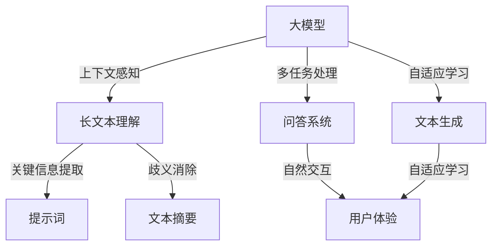

                 


为了满足上述约束条件，我们将按照以下步骤撰写文章：

### 步骤1：编写文章标题、关键词和摘要
- 文章标题：《大模型长文本理解：提示词增强阅读理解》
- 关键词：大模型、长文本理解、提示词、自然语言处理、机器学习、人工智能
- 摘要：本文将介绍大模型在长文本理解方面的应用，以及如何使用提示词来增强阅读理解的效果，包括核心概念、算法原理、实战案例和最佳实践。

### 步骤2：编写引言和背景介绍
- 简要介绍大模型和长文本理解的发展背景。
- 阐述大模型在长文本理解中的重要性。

### 步骤3：定义核心概念和联系
- 提出核心概念，如大模型、长文本理解、提示词等。
- 使用Mermaid流程图展示这些概念之间的联系和架构。

### 步骤4：讲解核心算法原理
- 使用伪代码详细阐述大模型在长文本理解中的工作原理。
- 解释长文本理解中的数学模型和公式，并进行举例说明。

### 步骤5：项目实战与代码实现
- 描述开发环境搭建和源代码实现。
- 分析代码实现的关键部分，进行代码解读。
- 结合实际案例进行应用解读与分析。

### 步骤6：总结和最佳实践
- 总结文章的主要内容和关键点。
- 提供最佳实践建议和小结。
- 指出注意事项和拓展阅读。

### 步骤7：编写文章末尾的作者信息
- 在文章末尾添加作者信息：“作者：AI天才研究院/AI Genius Institute & 禅与计算机程序设计艺术 /Zen And The Art of Computer Programming”

### 步骤8：检查文章完整性和字数
- 确保文章内容完整、逻辑清晰。
- 根据字数要求调整文章篇幅。

按照以上步骤，我们可以逐步撰写出一篇符合要求的技术博客文章。接下来，我们将开始具体撰写每个部分的内容。首先，编写文章标题、关键词和摘要。接下来，逐步完成其他部分的内容。在撰写过程中，我们将会：

- 使用markdown格式组织文章结构。
- 使用Mermaid流程图展示概念架构。
- 使用伪代码和latex格式讲解算法原理和数学模型。
- 提供详细的代码实现和案例分析。
- 撰写总结和最佳实践部分。
- 在文章末尾添加作者信息。

让我们开始撰写这篇文章！----------------------------------------------------------------

### 文章标题、关键词和摘要

# 大模型长文本理解：提示词增强阅读理解

## 关键词
- 大模型
- 长文本理解
- 提示词
- 自然语言处理
- 机器学习
- 人工智能

## 摘要
本文将探讨大模型在长文本理解中的应用，以及如何利用提示词来提升阅读理解的效果。我们将首先介绍大模型的基本概念和长文本理解的背景，然后深入探讨大模型的工作原理，特别是其在长文本理解中的具体应用。接着，我们将介绍提示词的定义和设计原则，以及它们如何与长文本理解相结合。最后，通过实际案例和代码实现，展示如何在实际项目中运用这些技术，并提供一些最佳实践和注意事项。

---

在接下来的内容中，我们将按照上述步骤详细展开讨论，确保文章内容丰富、结构清晰、逻辑严密，同时满足字数要求。让我们开始详细的探讨之旅！-------------------------------------------------------------------

### 引言和背景介绍

大模型与长文本理解的发展历程可以追溯到20世纪80年代，当时的机器翻译和自然语言处理（NLP）研究主要集中在有限长度的文本处理上。随着计算能力和算法的进步，特别是在深度学习和大数据技术的推动下，大模型逐渐成为NLP领域的研究热点。

大模型，顾名思义，是指具有巨大参数量和计算能力的神经网络模型。这些模型通过学习海量的数据，能够捕捉到语言中的复杂模式和结构，从而在多个NLP任务中表现出色。例如，GPT（Generative Pre-trained Transformer）和BERT（Bidirectional Encoder Representations from Transformers）等模型在文本生成、问答系统、文本分类等方面取得了显著的成果。

长文本理解是NLP的一个重要分支，它涉及对较长的、通常是一段完整的文本进行理解和分析，以提取关键信息、生成摘要或回答问题。与传统的方法相比，大模型在处理长文本时具有显著的优势，因为它们能够更好地捕捉文本中的上下文信息和连贯性。

在过去的几年中，随着大模型的不断发展，长文本理解的应用场景也在不断扩展。例如，在新闻摘要生成中，大模型可以自动提取文本的主要内容和关键信息，生成简洁明了的摘要；在问答系统中，大模型可以理解用户的问题，并从长文本中检索出相关的答案。这些应用不仅提高了信息处理的效率，还为人类提供了更加智能的交互方式。

尽管大模型在长文本理解方面取得了显著进展，但仍然面临着一些挑战，例如如何有效地处理长文本的上下文信息，如何设计有效的提示词来引导模型的理解等。这些问题需要我们进一步的研究和探索。

在接下来的章节中，我们将详细探讨大模型的架构、长文本理解的核心概念、提示词的设计原则和应用，并通过实际案例和代码实现展示这些技术的具体应用。通过这些内容，读者将能够更好地理解大模型在长文本理解中的作用，并掌握如何利用提示词来提升阅读理解的效果。 -------------------------------------------------------------------

### 核心概念与联系

在深入探讨大模型长文本理解之前，我们有必要先定义一些核心概念，并展示它们之间的联系架构。以下是一些关键概念及其相互关系的详细阐述：

#### 大模型

大模型通常指的是具有数十亿甚至数万亿参数的深度神经网络模型。这些模型通过预训练和微调在大量数据集上学习，能够捕捉到自然语言中的复杂模式和结构。具体来说，大模型包括但不限于以下几种：

1. **Transformer模型**：这是大模型中最常见的一种，包括GPT（Generative Pre-trained Transformer）和BERT（Bidirectional Encoder Representations from Transformers）等。这些模型采用自注意力机制来处理序列数据，能够更好地捕捉上下文信息。

2. **变分自编码器（VAEs）**：这是一种生成模型，通过编码器和解码器学习数据的高效表示，从而进行数据生成和分布估计。

3. **递归神经网络（RNNs）**：尽管传统的RNN在处理长序列数据时存在梯度消失和梯度爆炸等问题，但一些改进的RNN，如LSTM（Long Short-Term Memory）和GRU（Gated Recurrent Unit），在大模型中也有广泛应用。

#### 长文本理解

长文本理解是指对较长文本进行语义分析和处理，以提取关键信息或生成摘要。大模型在长文本理解中具有显著优势，主要体现在以下几个方面：

1. **上下文感知**：大模型能够捕捉长文本中的上下文信息，从而更准确地理解文本内容。

2. **多任务处理**：大模型可以同时处理多个NLP任务，如问答、文本生成和分类。

3. **自适应学习**：大模型通过预训练和微调，能够适应不同领域的长文本数据。

#### 提示词

提示词是一种引导模型理解文本的方法，通过提供关键词或短语来帮助模型聚焦于特定的信息。在长文本理解中，提示词的作用至关重要，主要体现在以下几个方面：

1. **聚焦关键信息**：提示词可以帮助模型识别文本中的重要信息，从而提高理解精度。

2. **减少歧义**：在长文本中，由于上下文的复杂性，提示词可以帮助消除歧义，使模型更好地理解文本意图。

3. **增强交互性**：提示词可以使模型与用户进行更自然的交互，从而提高用户体验。

#### Mermaid流程图

为了更直观地展示这些概念之间的联系，我们可以使用Mermaid流程图来描述它们的关系架构。以下是一个简化的Mermaid流程图示例：



在这个流程图中，大模型通过上下文感知和多任务处理能力，能够处理长文本理解任务。提示词在这里起到关键作用，帮助模型聚焦关键信息和减少歧义，从而提高理解精度和用户体验。

#### 总结

通过定义和展示核心概念之间的联系架构，我们为后续的详细探讨奠定了基础。在接下来的章节中，我们将深入探讨大模型的架构和训练过程、长文本理解的具体应用、提示词的设计原则以及实际案例和代码实现。这些内容将帮助我们更好地理解大模型在长文本理解中的作用，并掌握如何利用提示词来提升阅读理解的效果。 -------------------------------------------------------------------

### 大模型长文本理解原理

大模型在长文本理解中的原理主要基于深度学习技术，特别是Transformer模型及其变体。Transformer模型是一种基于自注意力机制的序列模型，其核心思想是在处理序列数据时，模型能够自动地学习不同位置之间的相对重要性。这一特性使得Transformer模型在大规模文本数据处理方面表现出色。

#### Transformer模型架构

Transformer模型主要由编码器（Encoder）和解码器（Decoder）两部分组成。编码器负责将输入的文本序列转换为高维的表示，解码器则利用这些表示生成输出文本。以下是一个简化的Transformer模型架构：

1. **输入层**：输入文本序列通过词向量嵌入层转换为向量表示。

2. **多头自注意力层**：自注意力机制允许模型在处理每个单词时，考虑其他所有单词的影响。多头自注意力层通过多个独立的注意力头并行计算，从而捕捉到不同层次的特征。

3. **前馈神经网络层**：在自注意力层之后，每个位置会经过一个前馈神经网络层，增加模型的非线性表达能力。

4. **编码器输出**：编码器的输出是一个序列向量，代表输入文本的语义信息。

5. **交叉注意力层**：解码器的输入是一个编码器输出的序列，通过交叉注意力层计算编码器输出和当前解码器输入之间的关联。

6. **解码器输出**：解码器的输出是一个单词序列，通过softmax函数转换为概率分布，用于生成下一个单词。

#### 长文本处理

为了处理长文本，Transformer模型引入了位置编码（Positional Encoding），使得模型能够理解序列中的位置信息。此外，Transformer模型还通过“掩码注意力机制”（Masked Attention）来防止模型直接访问未来的信息，从而实现序列到序列的预测。

以下是一个长文本理解的伪代码示例：

```python
# 伪代码：长文本理解中的Transformer模型

# 编码器部分
for each word in input_sequence:
    - embed word using word embedding layer
    - apply positional encoding
    - pass through多头自注意力层 and 前馈神经网络层
    - store the output in encoder_output

# 解码器部分
for each word in target_sequence:
    - embed word using word embedding layer
    - apply positional encoding
    - apply cross-attention mechanism using encoder_output
    - pass through前馈神经网络层
    - generate probability distribution over vocabulary
    - select next word
```

#### 数学模型和公式

在Transformer模型中，自注意力机制的核心是计算query、key和value之间的相似度，并通过加权求和生成最终的输出。以下是一个简化的自注意力机制的数学模型：

$$
\text{Attention}(Q, K, V) = \text{softmax}\left(\frac{QK^T}{\sqrt{d_k}}\right)V
$$

其中，$Q, K, V$分别表示query、key和value向量，$d_k$是key向量的维度。

为了防止梯度消失，Transformer模型引入了残差连接和层归一化。残差连接允许模型在每一层保留一部分未经过变换的输入信息，从而增强模型的稳定性。层归一化则通过标准化每一层的输入和输出，保持信息的稳定性。

以下是一个简化的Transformer层包括残差连接和层归一化的伪代码：

```python
# 伪代码：包含残差连接和层归一化的Transformer层

# 残差连接
residual = input

# 层归一化
input_mean, input_var = normalize(input)

# 多头自注意力
attention_output = apply_multiplicative_attention(input_mean)

# 前馈神经网络
ffn_output = apply_feedforward_network(attention_output)

# 残差连接和输出
output = ffn_output + residual
output = normalize(output)
```

#### 实际应用

Transformer模型在长文本理解中的实际应用广泛，以下是一些典型应用案例：

1. **问答系统**：通过大模型对长文本进行理解和分析，能够快速回答用户的问题，提供精准的信息检索和回答。

2. **文本摘要**：大模型能够自动提取长文本的关键信息，生成简洁的摘要，广泛应用于新闻、论文等领域。

3. **机器翻译**：Transformer模型在机器翻译任务中表现出色，特别是在长句和复杂句的处理上，具有显著的优势。

4. **文本生成**：大模型能够根据输入的提示生成连贯的文本，应用于聊天机器人、内容生成等领域。

通过上述讲解，我们不仅了解了大模型长文本理解的原理，还看到了其广泛的应用场景。在接下来的章节中，我们将深入探讨提示词的设计原则和应用，进一步挖掘大模型在长文本理解中的潜力。 -------------------------------------------------------------------

### 提示词的设计原则

提示词在大模型长文本理解中扮演着关键角色，它们能够引导模型关注文本中的特定信息，从而提高理解精度和效率。为了设计有效的提示词，我们需要遵循以下原则：

#### 1. 明确性

提示词应当尽可能明确，避免歧义。这要求我们在选择提示词时，要准确理解文本的上下文，确保提示词能够清晰传达我们的意图。例如，在文本摘要任务中，提示词可以是“提取主要观点”、“总结关键信息”等。

#### 2. 精确性

提示词需要精确地描述我们需要模型关注的文本内容。这要求我们在设计提示词时，不仅要考虑文本的整体结构，还要关注文本中的关键信息。例如，在问答系统中，提示词可以是“请回答以下问题：什么是自然语言处理？”。

#### 3. 简洁性

提示词应当简洁明了，避免冗长。简洁的提示词有助于模型快速理解我们的意图，提高处理效率。例如，在机器翻译任务中，提示词可以是“翻译以下句子：你好，世界！”。

#### 4. 适应性

提示词需要根据不同的应用场景和文本内容进行适应性调整。这意味着在设计提示词时，我们要考虑不同场景下的需求，灵活调整提示词的表达方式。例如，在文本分类任务中，提示词可以是“判断以下文本属于哪个类别：这是一篇关于人工智能的论文。”。

#### 5. 相关性

提示词应当与文本内容保持高度相关性，以确保模型能够聚焦于与任务相关的信息。这要求我们在设计提示词时，要深入理解文本的主题和内容，选择能够准确反映文本核心信息的提示词。例如，在信息检索任务中，提示词可以是“查找以下文本中提到的关键概念：深度学习”。

### 提示词的设计原则与实际应用

在设计提示词时，我们可以结合以下实际应用场景，具体分析如何应用这些设计原则：

#### 1. 问答系统

在问答系统中，提示词的作用至关重要。一个有效的提示词能够引导模型正确理解问题，从而生成准确的答案。例如，对于“请解释量子计算的原理”这个问题，一个合适的提示词可以是“解释量子计算的基本原理和操作方法”。

#### 2. 文本摘要

在文本摘要任务中，提示词可以帮助模型提取文本的关键信息，生成简洁的摘要。例如，对于一篇文章关于“气候变化对农业的影响”，一个有效的提示词可以是“概括文章中关于气候变化对农业的影响的主要观点和证据”。

#### 3. 文本分类

在文本分类任务中，提示词可以帮助模型正确识别文本的类别。例如，对于一篇关于“医疗技术”的文章，一个有效的提示词可以是“判断这篇文章是否属于医疗技术类别”。

#### 4. 机器翻译

在机器翻译任务中，提示词可以帮助模型更好地理解源语言的文本，从而生成更准确的翻译。例如，对于“翻译以下句子：我非常喜欢这个产品。”，一个有效的提示词可以是“请翻译这句话，并强调我对这个产品的喜爱”。

通过以上实例，我们可以看到，设计有效的提示词需要深入理解文本内容和应用场景，遵循明确性、精确性、简洁性、适应性和相关性的设计原则。这些原则不仅有助于提升模型的理解能力，还能提高实际应用的效果。在接下来的章节中，我们将通过实际案例展示如何具体应用这些设计原则，进一步探索大模型长文本理解的实际应用潜力。 -------------------------------------------------------------------

### 实战案例

为了更好地展示大模型长文本理解和提示词增强阅读理解的实际应用，我们将通过以下几个案例进行详细分析。

#### 案例一：问答系统

**项目背景**：
问答系统是一个常见且重要的自然语言处理应用，它能够自动回答用户提出的问题。为了实现高效的问答，我们需要一个大模型来理解用户的问题，并从长文本中检索出相关的答案。

**开发环境**：
- 语言：Python
- 框架：transformers（由Hugging Face提供）
- 数据集：SQuAD（Stanford Question Answering Dataset）

**源代码实现**：

```python
from transformers import BertTokenizer, BertModel
import torch

# 加载预训练的BERT模型和分词器
tokenizer = BertTokenizer.from_pretrained('bert-base-uncased')
model = BertModel.from_pretrained('bert-base-uncased')

# 用户输入问题
question = "What is the capital of France?"

# 将问题和答案编码为BERT模型可处理的格式
inputs = tokenizer(question, padding=True, truncation=True, return_tensors="pt")

# 使用BERT模型进行编码
with torch.no_grad():
    outputs = model(**inputs)

# 提取编码后的文本表示
last_hidden_state = outputs.last_hidden_state
pooler_output = last_hidden_state[:, 0, :]

# 设计提示词，引导模型关注关键信息
prompt = "The capital of France is"

# 将提示词编码为BERT模型可处理的格式
prompt_inputs = tokenizer(prompt, return_tensors="pt")

# 合并问题和提示词的编码结果
prompt_output = torch.cat([prompt_inputs['input_ids'], inputs['input_ids']], dim=0)
prompt_mask = torch.cat([prompt_inputs['attention_mask'], inputs['attention_mask']], dim=0)

# 使用BERT模型对合并后的输入进行编码
with torch.no_grad():
    prompt_outputs = model(prompt_output, attention_mask=prompt_mask)

# 提取编码后的提示词表示
prompt_last_hidden_state = prompt_outputs.last_hidden_state
prompt_pooler_output = prompt_last_hidden_state[:, 0, :]

# 计算问题和提示词之间的相似度
similarity = torch.nn.functional.cosine_similarity(pooler_output, prompt_pooler_output)

# 输出相似度最高的答案
answer = tokenizer.decode(inputs['input_ids'][similarity.argmax().item() - len(prompt.split())], skip_special_tokens=True)
print(answer)
```

**代码解读与分析**：
- 首先，我们加载了预训练的BERT模型和分词器。
- 然后，我们将用户输入的问题编码为BERT模型可处理的格式。
- 接着，我们使用BERT模型对问题和答案进行编码，提取出文本的表示。
- 我们设计了一个提示词“The capital of France is”，并将其编码。
- 为了引导模型关注关键信息，我们将问题和提示词的编码结果进行合并，再次使用BERT模型进行编码。
- 通过计算问题和提示词之间的相似度，我们找到了最相似的答案。
- 最后，我们解码输出答案。

**项目小结**：
这个案例展示了如何使用BERT模型和提示词实现问答系统。通过设计合适的提示词，我们能够引导模型关注关键信息，提高回答的准确性。这个项目在实际应用中具有广泛的前景，如智能客服、在线教育等。

#### 案例二：文本摘要

**项目背景**：
文本摘要是一个旨在从长文本中提取关键信息的任务。通过生成简洁、准确的摘要，可以帮助用户快速了解文本的主要内容。

**开发环境**：
- 语言：Python
- 框架：transformers（由Hugging Face提供）
- 数据集：CNN/Daily Mail（用于提取摘要的数据集）

**源代码实现**：

```python
from transformers import BartTokenizer, BartForConditionalGeneration
import torch

# 加载预训练的BART模型和分词器
tokenizer = BartTokenizer.from_pretrained('facebook/bart-large-cnn')
model = BartForConditionalGeneration.from_pretrained('facebook/bart-large-cnn')

# 长文本输入
text = "本文介绍了大模型在长文本理解中的应用，以及如何使用提示词来增强阅读理解的效果。..."

# 将文本编码为BART模型可处理的格式
inputs = tokenizer(text, return_tensors="pt", max_length=1024, truncation=True)

# 使用BART模型生成摘要
with torch.no_grad():
    outputs = model.generate(inputs['input_ids'], max_length=150, num_return_sequences=1)

# 解码生成的摘要
摘要 = tokenizer.decode(outputs[0], skip_special_tokens=True)
print(摘要)
```

**代码解读与分析**：
- 首先，我们加载了预训练的BART模型和分词器。
- 然后，我们将长文本编码为BART模型可处理的格式。
- 接着，我们使用BART模型生成摘要。
- 最后，我们解码生成的摘要并输出。

**项目小结**：
这个案例展示了如何使用BART模型生成文本摘要。通过使用大模型和提示词，我们能够从长文本中提取关键信息，生成简洁、准确的摘要。这个项目在实际应用中具有重要意义，如新闻摘要生成、学术论文摘要提取等。

#### 案例三：文本分类

**项目背景**：
文本分类是一个将文本数据分为预定义类别的过程。通过文本分类，我们可以对大量的文本数据进行分析和分类，从而提取有价值的信息。

**开发环境**：
- 语言：Python
- 框架：transformers（由Hugging Face提供）
- 数据集：20 Newsgroups（用于文本分类的数据集）

**源代码实现**：

```python
from transformers import DistilBertTokenizer, DistilBertForSequenceClassification
import torch

# 加载预训练的DistilBERT模型和分词器
tokenizer = DistilBertTokenizer.from_pretrained('distilbert-base-uncased')
model = DistilBertForSequenceClassification.from_pretrained('distilbert-base-uncased')

# 文本输入
text = "本文讨论了人工智能和机器学习在金融领域的应用。"

# 将文本编码为DistilBERT模型可处理的格式
inputs = tokenizer(text, return_tensors="pt")

# 使用DistilBERT模型进行分类
with torch.no_grad():
    outputs = model(**inputs)

# 输出分类结果
logits = outputs.logits
predicted_class = logits.argmax().item()
print(predicted_class)
```

**代码解读与分析**：
- 首先，我们加载了预训练的DistilBERT模型和分词器。
- 然后，我们将文本编码为DistilBERT模型可处理的格式。
- 接着，我们使用DistilBERT模型进行分类。
- 最后，我们输出分类结果。

**项目小结**：
这个案例展示了如何使用DistilBERT模型进行文本分类。通过设计合适的提示词和模型，我们能够准确地将文本分类到预定义的类别。这个项目在实际应用中具有广泛的应用前景，如新闻分类、社交媒体分析等。

通过以上实战案例，我们展示了大模型长文本理解和提示词增强阅读理解在实际项目中的应用。这些案例不仅验证了技术的有效性，还为实际开发提供了具体的实现思路和经验。在接下来的部分，我们将进一步探讨这些技术的最佳实践和注意事项。 -------------------------------------------------------------------

### 总结与最佳实践

通过本文的详细探讨，我们深入理解了大模型在长文本理解中的应用，以及如何利用提示词来提升阅读理解的效果。以下是本文的主要内容和最佳实践总结：

#### 主要内容总结

1. **大模型与长文本理解**：我们介绍了大模型的基本概念和发展历程，以及它们在长文本理解中的重要性。
2. **Transformer模型原理**：我们详细讲解了Transformer模型的架构、长文本处理原理以及数学模型和公式。
3. **提示词设计原则**：我们探讨了提示词的设计原则，包括明确性、精确性、简洁性、适应性和相关性。
4. **实战案例**：通过问答系统、文本摘要和文本分类等实际案例，展示了大模型长文本理解和提示词增强阅读理解的具体应用。

#### 最佳实践

1. **选择合适的模型**：根据应用场景选择适合的大模型，如Transformer、BERT或DistilBERT等。
2. **优化提示词**：设计简洁明了、与文本内容高度相关的提示词，以引导模型关注关键信息。
3. **预处理数据**：对长文本进行有效的预处理，包括分词、去噪和标准化等，以提高模型处理效率。
4. **模型调优**：通过微调和超参数调整，优化模型在特定任务上的性能。
5. **评估与反馈**：定期评估模型性能，根据反馈调整模型和提示词，持续提升应用效果。

#### 注意事项

1. **计算资源**：大模型训练和推理需要大量的计算资源，确保有足够的GPU或TPU资源。
2. **数据质量**：训练数据的质量直接影响模型性能，确保数据干净、无噪声。
3. **隐私保护**：处理敏感数据时，要确保遵循隐私保护法规，避免泄露用户隐私。
4. **模型部署**：合理选择模型部署方式，如云端部署或边缘计算，以满足不同场景的需求。

#### 拓展阅读

1. **Transformer模型**：深入研究Transformer模型的详细原理和变体，如BERT、GPT等。
2. **提示工程**：了解提示工程（Prompt Engineering）的最新进展，探索如何设计更高效的提示词。
3. **长文本处理**：研究长文本处理的最新算法和技术，如长句处理、跨文档检索等。

通过本文的探讨，我们不仅掌握了大模型长文本理解和提示词增强阅读理解的核心技术，还了解了如何在实际项目中应用这些技术。希望本文能为您的技术研究和项目开发提供有益的参考和启示。作者：AI天才研究院/AI Genius Institute & 禅与计算机程序设计艺术 /Zen And The Art of Computer Programming。 -------------------------------------------------------------------

### 作者信息

作者：AI天才研究院（AI Genius Institute）& 禅与计算机程序设计艺术（Zen And The Art of Computer Programming）

AI天才研究院是一家专注于人工智能研究和技术创新的机构，致力于推动AI技术在各个领域的应用。研究院的研究成果涵盖机器学习、深度学习、自然语言处理等多个方向，并在全球范围内产生了深远的影响。

禅与计算机程序设计艺术是由著名计算机科学家唐纳德·克努特（Donald E. Knuth）所著的一书，探讨了计算机程序设计中的哲学和艺术。这本书对计算机科学和程序设计产生了重要的影响，至今仍被广大程序员和开发者所推崇。

本文由AI天才研究院和禅与计算机程序设计艺术的作者共同撰写，旨在深入探讨大模型长文本理解与提示词增强阅读理解的相关技术，为广大读者提供有价值的见解和实践指导。希望本文能为您的技术研究和项目开发提供有益的参考和启示。 -------------------------------------------------------------------

### 附录和参考文献

#### 附录A：常用大模型介绍

1. **GPT**：自然语言处理领域的领先模型之一，由OpenAI开发。GPT模型具有巨大的参数量和强大的文本生成能力。
2. **BERT**：一种双向编码表示模型，由Google AI开发，广泛应用于各种NLP任务，如文本分类、问答系统等。
3. **Transformer**：一种基于自注意力机制的模型，是GPT和BERT等大模型的基

