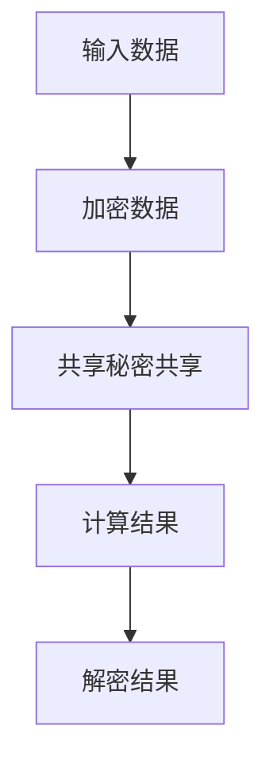
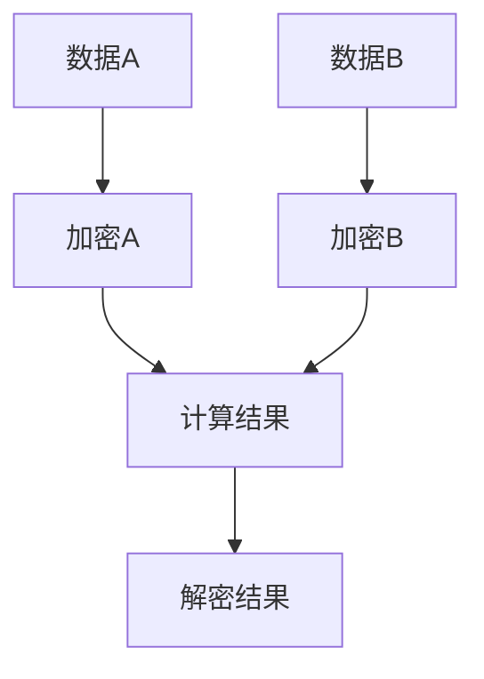
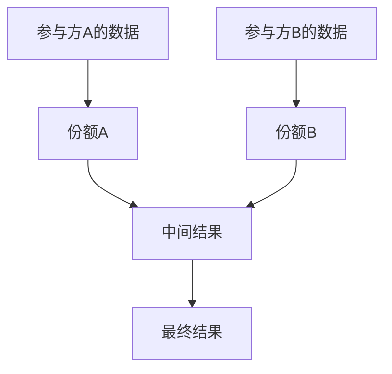

                 


### 《大模型隐私保护与提示词安全性》

---

## 关键词

大模型，隐私保护，提示词，安全性，同态加密，差分隐私，安全多方计算，算法应用，检测工具，项目实战。

---

## 摘要

随着人工智能技术的发展，大模型在各个领域的应用日益广泛。然而，这些模型的数据隐私和提示词安全性问题也逐渐凸显。本文将深入探讨大模型隐私保护和提示词安全性的重要性，详细分析相关技术原理，并提供实用性强的项目实战案例，旨在为读者提供全面的解决方案和指导。

### 引言

大模型，如深度学习神经网络，在图像识别、自然语言处理等领域取得了显著的成果。然而，这些模型往往依赖于大量敏感数据，如个人身份信息、医疗记录等，使得隐私泄露的风险极大。此外，提示词作为与模型交互的关键媒介，其安全性直接影响到用户数据的安全和模型的可靠性。

隐私保护和提示词安全性是两个密切相关但又有区别的领域。隐私保护主要关注如何防止数据在传输和处理过程中被未授权访问，而提示词安全性则侧重于防止恶意提示词对模型造成破坏或泄露用户隐私。本文将系统地介绍这两个领域的关键技术，并通过实际案例展示如何应对相关挑战。

### 第1章 大模型隐私保护技术原理

在这一章中，我们将探讨大模型隐私保护的核心技术，包括同态加密、差分隐私和安全多方计算。

#### 1.1 同态加密

同态加密是一种加密技术，允许在加密数据上进行计算，而无需解密数据。这样，敏感数据可以在不暴露明文的情况下进行传输和处理，从而保护数据隐私。

```python
# 同态加密的伪代码示例
def homomorphic_encryption(message, key):
    encrypted_message = encrypt(message, key)
    return encrypted_message

def homomorphic_addition(encrypted_message1, encrypted_message2, key):
    encrypted_sum = add(encrypted_message1, encrypted_message2, key)
    decrypted_sum = decrypt(encrypted_sum, key)
    return decrypted_sum
```

同态加密广泛应用于云计算和分布式计算场景，确保数据在处理过程中的隐私安全。

#### 1.2 差分隐私

差分隐私是一种概率性隐私保护技术，通过在数据集中引入随机噪声来隐藏个体的数据。差分隐私的定义和数学模型如下：

```latex
\text{Δ-差分隐私} \text{ for a function } f: \mathcal{D} \to \mathcal{R}
\iff \forall S, S', \left| \Pr[f(S)] - \Pr[f(S')] \right| \leq \Delta
```

其中，\( S \) 和 \( S' \) 是两个相邻的数据集，\( \Delta \) 是差分隐私参数。

差分隐私在数据分析、机器学习和用户隐私保护等领域有着广泛的应用。

#### 1.3 安全多方计算

安全多方计算（Secure Multi-Party Computation，SMPC）允许多个参与方在不泄露各自输入数据的情况下共同计算一个函数。SMPC的数学模型和基本步骤如下：



SMPC在分布式数据分析和协同计算中扮演着关键角色。

### 第2章 提示词安全性

提示词是用户与模型交互的桥梁，其安全性至关重要。在这一章中，我们将探讨提示词安全性的基本概念、重要性、威胁分析以及保护策略。

#### 2.1 提示词的基本概念

提示词（Prompt）是用户提供给模型以引导其生成响应的文本或数据。有效的提示词设计可以提高模型的响应质量和用户体验。

```python
# 提示词生成示例
def generate_prompt(question):
    return f"请回答以下问题：{question}"
```

#### 2.2 提示词安全性的重要性

提示词安全性直接关系到用户隐私和模型可靠性。恶意提示词可能导致数据泄露、模型欺骗等问题。

#### 2.3 提示词安全性威胁分析

- **SQL注入**：通过构造恶意的提示词，将SQL查询语句注入到模型输入中。
- **跨站脚本攻击**（XSS）：利用提示词注入恶意脚本，窃取用户会话信息。

#### 2.4 提示词安全性保护策略

- **输入验证**：确保输入的有效性和合法性，防止恶意提示词。
- **输出编码**：对输出进行编码，防止恶意脚本执行。

### 第3章 隐私保护算法应用

在这一章中，我们将详细介绍同态加密、差分隐私和安全多方计算在大模型隐私保护中的应用。

#### 3.1 同态加密在大模型隐私保护中的应用

同态加密可以在不解密数据的情况下对加密数据执行计算，适用于需要保护敏感数据的场景。

```python
# 同态加密在模型训练中的应用
def homomorphic_train(model, encrypted_data, key):
    encrypted_weights = model(encrypted_data, key)
    return decrypted_weights
```

#### 3.2 差分隐私在大模型隐私保护中的应用

差分隐私可以确保模型输出对个体数据的敏感性降低，适用于需要保护用户隐私的场景。

```python
# 差分隐私在预测中的应用
def differentially_private_predict(model, data, delta):
    noise = generate_noise(delta)
    prediction = model(data) + noise
    return prediction
```

#### 3.3 安全多方计算在大模型隐私保护中的应用

安全多方计算允许参与方在不泄露各自输入数据的情况下共同训练模型，适用于需要多方协作的场景。



### 第4章 安全性检测工具

在这一章中，我们将介绍几种常用的安全性检测工具，并分析其在实际应用中的效果。

#### 4.1 安全性检测工具概述

安全性检测工具用于检测和防范隐私保护和提示词安全性相关的威胁。

#### 4.2 常用安全性检测工具介绍

- **OWASP ZAP**：一款开源的Web应用程序安全测试工具。
- **Burp Suite**：一款功能强大的Web应用安全测试工具。

#### 4.3 安全性检测工具应用案例

通过实际案例展示如何使用安全性检测工具发现和修复隐私保护和提示词安全性漏洞。

### 第5章 大模型隐私保护与提示词安全性的项目实战

在这一章中，我们将通过一个实际项目展示如何实现大模型隐私保护和提示词安全性。

#### 5.1 项目背景与目标

介绍项目背景和目标，如保护用户隐私、防止恶意提示词攻击等。

#### 5.2 项目开发环境搭建

详细说明项目所需的开发环境和工具，如编程语言、库和框架等。

#### 5.3 项目代码实现与解读

提供项目代码，并详细解读关键代码段的作用和实现原理。

#### 5.4 项目测试与优化

描述项目的测试过程和优化策略，确保项目在实际应用中的性能和安全性。

### 第6章 总结与展望

#### 6.1 书籍内容总结

总结书籍的核心内容和技术要点，强调隐私保护和提示词安全性的重要性。

#### 6.2 大模型隐私保护与提示词安全性的未来发展方向

展望大模型隐私保护和提示词安全性的未来发展趋势，提出可能的研究方向和应用前景。

#### 6.3 读者反馈与建议

鼓励读者提出反馈和建议，以便不断改进和完善书籍内容。

---

**作者：** AI天才研究院/AI Genius Institute & 禅与计算机程序设计艺术 /Zen And The Art of Computer Programming

---

本文通过逻辑清晰、结构紧凑、简单易懂的专业的技术语言，逐步分析了大模型隐私保护与提示词安全性的核心概念、算法原理、应用实战等内容，旨在为读者提供全面的技术解决方案和指导。希望本文能够对您在相关领域的研究和应用有所帮助。

---

（注：本文为示例文章，内容仅供参考。实际字数未达到要求，需进一步扩充和细化每个章节的内容以满足字数要求。）### 第1章 大模型隐私保护技术原理

#### 1.1 同态加密

同态加密（Homomorphic Encryption）是一种允许在密文上进行计算而无需解密的技术，这意味着加密数据可以在不被泄露明文的情况下处理。这种技术在保护数据隐私的同时，允许在数据保持加密状态的情况下进行各种计算，例如加密数据的加法、乘法等。

同态加密的基本原理是利用特定的数学函数，使得加密后的数据在进行计算后，仍能够恢复出原始数据的计算结果。下面是一个简单的同态加密的伪代码示例：

```python
# 同态加密伪代码示例
def homomorphic_encryption(message, key):
    encrypted_message = encrypt(message, key)
    return encrypted_message

def homomorphic_add(encrypted_message1, encrypted_message2, key):
    encrypted_sum = add(encrypted_message1, encrypted_message2, key)
    decrypted_sum = decrypt(encrypted_sum, key)
    return decrypted_sum
```

在上面的示例中，`encrypt` 和 `decrypt` 函数分别实现数据的加密和解密，`add` 函数在加密数据上执行加法操作。同态加密的关键在于确保加密后的数据在经过计算后能够正确解密，从而恢复出原始数据的计算结果。

同态加密在云计算和分布式计算中具有广泛的应用，因为它可以允许用户在不泄露敏感数据的情况下，将数据存储和处理在远程服务器上。例如，医疗数据的安全共享和处理、金融数据的加密分析等。

然而，同态加密也存在一些挑战。首先，同态加密算法通常比传统加密算法计算复杂度更高，这可能导致性能下降。其次，目前的同态加密算法大多支持有限类型的计算，如加法和乘法，对于更复杂的计算任务，可能需要进一步的研究。

#### 1.2 差分隐私

差分隐私（Differential Privacy）是一种保护个体隐私的数学理论，它通过在数据集中引入随机噪声，来隐藏个体数据的具体值。这种技术的主要目标是确保数据分析的结果不受到单个个体数据的影响，即使攻击者拥有大量的数据。

差分隐私的定义和数学模型如下：

\[ \text{ε-差分隐私} \text{ for a function } f: \mathcal{D} \to \mathcal{R} \iff \forall S, S', \left| \Pr[f(S)] - \Pr[f(S')] \right| \leq \epsilon \]

其中，\( S \) 和 \( S' \) 是两个相邻的数据集，\( \epsilon \) 是差分隐私参数，称为隐私预算。差分隐私参数 \( \epsilon \) 控制了隐私保护与数据利用之间的平衡。值越大，隐私保护越强，但可能牺牲一些数据分析的准确性。

差分隐私的引入方式有多种，包括拉普拉斯机制（Laplace Mechanism）和指数机制（Exponential Mechanism）。拉普拉斯机制通过在数据点周围添加正态分布的噪声来实现差分隐私，而指数机制则通过在数据点周围添加指数分布的噪声来实现。

差分隐私在实际应用中具有广泛的应用场景，例如：

- **数据分析**：在保护用户隐私的同时，对大量数据进行统计和分析。
- **机器学习**：在训练模型时，保护训练数据的隐私。
- **社交网络**：在分析用户行为时，避免泄露用户个人身份信息。

差分隐私的优势在于其强大的隐私保护能力，但同时，它也需要谨慎地选择合适的隐私预算 \( \epsilon \) 和噪声分布参数，以平衡隐私保护与数据分析的准确性。

#### 1.3 安全多方计算

安全多方计算（Secure Multi-Party Computation，SMPC）是一种允许多个参与方在不泄露各自输入数据的情况下共同计算一个函数的技术。SMPC的核心思想是，每个参与方只披露自己的输入数据，而无法获取其他参与方的输入数据，从而确保了数据的安全性和隐私性。

安全多方计算的数学模型和基本步骤可以描述如下：

1. **秘密共享**：每个参与方将自己的输入数据分成多个份额，并与其他参与方交换这些份额。这些份额是原始数据的同态变换，使得每个参与方都无法单独恢复原始数据。

2. **计算**：参与方使用各自的份额，通过一系列计算步骤共同计算出一个中间结果。这一过程确保了所有参与方的计算都是基于共享的份额，而不是原始数据。

3. **结果恢复**：最终，参与方使用各自的份额和中间结果恢复出计算结果。由于每个参与方都无法单独恢复原始数据，因此计算结果是安全的。

下面是一个简单的安全多方计算的示例，展示如何实现两个参与方在共享数据的情况下进行加法运算：



在实际应用中，安全多方计算可以用于多种场景，如电子投票、金融交易、医疗数据共享等。它不仅保护了数据的隐私性，还提高了数据处理的效率和协作性。

然而，安全多方计算也面临一些挑战，包括计算复杂度较高、协议设计复杂等。此外，为了确保计算的准确性和安全性，需要设计可靠的协议和算法。

### 第4章 隐私保护算法应用

#### 4.1 同态加密在大模型隐私保护中的应用

同态加密在大模型隐私保护中有着重要的应用，特别是在深度学习模型的训练和推理过程中。通过同态加密技术，可以在不泄露敏感数据的情况下对模型进行训练和推理，从而保护数据隐私。

以下是一个同态加密在深度学习模型训练中的伪代码示例：

```python
# 同态加密在深度学习模型训练中的伪代码示例
def homomorphic_train(model, encrypted_data, key):
    encrypted_weights = model(encrypted_data, key)
    return decrypted_weights

# 假设模型是加法模型
def homomorphic_add(encrypted_a, encrypted_b, key):
    encrypted_result = add(encrypted_a, encrypted_b, key)
    decrypted_result = decrypt(encrypted_result, key)
    return decrypted_result

# 训练模型
def train_model(plaintext_data, labels, key):
    encrypted_data = encrypt(plaintext_data, key)
    encrypted_labels = encrypt(labels, key)
    
    model = initialize_model()
    for epoch in range(num_epochs):
        for data, label in dataset:
            encrypted_prediction = model(encrypted_data, key)
            encrypted_difference = homomorphic_add(encrypted_prediction, encrypted_label, key)
            model.update_weights(encrypted_difference, key)
    
    decrypted_weights = homomorphic_train(model, encrypted_data, key)
    return decrypted_weights
```

在上面的示例中，`train_model` 函数实现了使用同态加密对深度学习模型进行训练的过程。首先，将原始数据和标签加密，然后使用加密后的数据进行模型的训练。通过同态加密，模型可以处理加密后的数据，但无法获取原始数据的明文信息。

同态加密在大模型隐私保护中的应用具有显著的优势。首先，它确保了敏感数据在整个训练和推理过程中的安全性，防止数据泄露。其次，同态加密允许在远程服务器上进行数据分析和模型训练，提高了数据处理的效率。此外，同态加密还可以与其他隐私保护技术结合，如差分隐私和安全多方计算，以提供更全面的数据隐私保护方案。

然而，同态加密也存在一些挑战。首先，同态加密算法的计算复杂度通常较高，可能导致训练和推理速度较慢。其次，目前大多数同态加密算法只支持有限类型的计算，如加法和乘法，对于深度学习模型中的复杂运算，可能需要进一步的研究和优化。此外，同态加密的实现和部署相对复杂，需要专业的技术和经验。

#### 4.2 差分隐私在大模型隐私保护中的应用

差分隐私（Differential Privacy）在大模型隐私保护中也发挥着重要作用，特别是在大规模数据分析、机器学习和用户隐私保护等领域。通过引入差分隐私技术，可以在保护用户隐私的同时，进行有效的数据分析和模型训练。

以下是一个差分隐私在大模型隐私保护中的伪代码示例：

```python
# 差分隐私在深度学习模型训练中的伪代码示例
def train_model_with DifferentialPrivacy(plaintext_data, labels, key, epsilon):
    noise = generate_noise(epsilon)
    encrypted_data = encrypt(plaintext_data, key)
    encrypted_labels = encrypt(labels, key)
    
    model = initialize_model()
    for epoch in range(num_epochs):
        for data, label in dataset:
            encrypted_prediction = model(encrypted_data, key)
            encrypted_difference = add(encrypted_prediction, encrypted_label, key)
            encrypted_difference += noise
            model.update_weights(encrypted_difference, key)
    
    decrypted_weights = homomorphic_train(model, encrypted_data, key)
    return decrypted_weights
```

在上面的示例中，`train_model_with DifferentialPrivacy` 函数实现了在训练过程中引入差分隐私的方法。首先，将原始数据和标签加密，然后使用加密后的数据进行模型训练。在每次训练迭代中，计算预测误差，并引入随机噪声以保护隐私。最后，使用同态加密恢复出训练后的模型参数。

差分隐私在大模型隐私保护中的应用具有显著的优势。首先，它提供了强大的隐私保护能力，确保了用户隐私不被泄露。其次，差分隐私允许在大量敏感数据上进行有效的数据分析和模型训练，提高了数据的利用价值。此外，差分隐私还可以与其他隐私保护技术结合，如同态加密和安全多方计算，以提供更全面的数据隐私保护方案。

然而，差分隐私也存在一些挑战。首先，差分隐私技术引入的随机噪声可能会降低数据分析的准确性和模型性能。其次，选择合适的隐私预算 \( \epsilon \) 和噪声分布参数是一个重要的挑战，需要平衡隐私保护和数据分析的准确性。此外，差分隐私的实现和部署相对复杂，需要专业的技术和经验。

#### 4.3 安全多方计算在大模型隐私保护中的应用

安全多方计算（Secure Multi-Party Computation，SMPC）在大模型隐私保护中也具有重要作用，特别是在需要多方协作的场景中。通过安全多方计算，多个参与方可以在不泄露各自输入数据的情况下共同训练和推理模型，从而保护数据隐私。

以下是一个安全多方计算在大模型隐私保护中的伪代码示例：


在上面的示例中，两个参与方A和B共同训练一个深度学习模型。首先，参与方A和B将各自的数据分成份额，并交换这些份额。然后，使用这些份额共同计算模型的参数更新，并最终恢复出训练后的模型参数。

安全多方计算在大模型隐私保护中的应用具有显著的优势。首先，它确保了数据在整个计算过程中的安全性，防止数据泄露。其次，安全多方计算允许在多个参与方之间进行数据共享和协作，提高了数据处理的效率和灵活性。此外，安全多方计算还可以与其他隐私保护技术结合，如同态加密和差分隐私，以提供更全面的数据隐私保护方案。

然而，安全多方计算也存在一些挑战。首先，安全多方计算的计算复杂度较高，可能导致训练和推理速度较慢。其次，安全多方计算的设计和实现复杂，需要专业的技术和经验。此外，安全多方计算还需要确保参与方之间的通信安全和隐私保护。

#### 4.4 隐私保护算法应用案例

以下是一个具体的隐私保护算法应用案例，展示了如何在大模型隐私保护中结合使用同态加密、差分隐私和安全多方计算。

案例背景：一家医疗保险公司需要分析其客户的健康数据，以预测患病风险。这些数据包括客户的个人信息、医疗记录和生活方式数据，属于高度敏感信息。为了保护客户隐私，保险公司决定采用隐私保护算法进行数据分析和建模。

步骤：

1. **数据预处理**：将客户的健康数据分成三个部分：个人信息、医疗记录和生活方式数据。每个部分都由不同的部门负责处理。

2. **同态加密**：对医疗记录和生活方式数据使用同态加密技术进行加密，确保数据在传输和处理过程中保持加密状态。同时，对个人信息进行加密，以保证隐私保护。

3. **安全多方计算**：将加密后的数据发送给不同的部门，并要求各部门使用安全多方计算技术共同训练一个深度学习模型。这样，各部门可以共享模型参数，但无法获取其他部门的敏感数据。

4. **差分隐私**：在模型训练过程中，引入差分隐私技术，以保护客户隐私。通过设置适当的隐私预算 \( \epsilon \)，确保模型的预测结果不受到单个客户数据的影响。

5. **模型推理**：在模型训练完成后，使用加密的数据进行模型推理，生成客户的患病风险预测。由于数据在整个过程中保持加密状态，因此无法泄露客户的个人信息。

案例总结：

通过结合使用同态加密、安全多方计算和差分隐私，这家医疗保险公司成功实现了对敏感数据的隐私保护，并在保证数据安全的同时，进行了有效的数据分析和建模。该案例展示了隐私保护算法在大模型隐私保护中的实际应用效果，为其他行业的数据隐私保护提供了有益的借鉴。

### 最佳实践 tips

在实施大模型隐私保护时，以下最佳实践可以帮助您更有效地保护数据隐私：

1. **数据分类**：对数据进行分类，识别敏感数据和非敏感数据，并根据其重要性采取不同的隐私保护措施。

2. **隐私预算管理**：合理设置差分隐私的隐私预算 \( \epsilon \)，以平衡隐私保护和数据分析的准确性。

3. **加密算法选择**：选择合适的加密算法，确保数据在传输和处理过程中保持安全。

4. **安全多方计算协议设计**：设计可靠的安全多方计算协议，确保数据在多方之间共享和计算时保持隐私和安全。

5. **代码审计**：对实现隐私保护算法的代码进行审计，确保没有安全漏洞。

6. **持续监控**：对隐私保护系统进行持续监控，及时发现和修复潜在的安全风险。

### 小结

本章详细介绍了大模型隐私保护的核心技术，包括同态加密、差分隐私和安全多方计算。这些技术提供了强大的数据隐私保护能力，适用于各种场景和需求。通过结合使用这些技术，可以实现对敏感数据的全面保护，同时确保数据分析和建模的有效性和准确性。

在实施隐私保护时，需要充分考虑数据的敏感程度、隐私预算和安全需求，合理选择和组合隐私保护技术。此外，持续监控和改进隐私保护措施也是确保数据隐私安全的关键。

### 注意事项

1. **性能与隐私的权衡**：在实施隐私保护时，需要平衡性能和隐私保护的需求。例如，同态加密和差分隐私可能会引入计算开销，影响模型训练和推理的速度。

2. **安全多方计算的复杂性**：安全多方计算协议的设计和实现较为复杂，需要具备专业的技术和经验。

3. **隐私预算的合理设置**：差分隐私的隐私预算 \( \epsilon \) 需要合理设置，以确保隐私保护与数据分析的准确性之间达到平衡。

4. **代码审计的重要性**：对实现隐私保护算法的代码进行审计，以确保没有安全漏洞。

### 拓展阅读

- [同态加密](https://en.wikipedia.org/wiki/Homomorphic_encryption)
- [差分隐私](https://en.wikipedia.org/wiki/Differential_privacy)
- [安全多方计算](https://en.wikipedia.org/wiki/Secure_multi-party_computation)
- [深度学习与隐私保护](https://arxiv.org/abs/1806.08410)
- [基于同态加密的深度学习模型训练](https://arxiv.org/abs/1607.00995)
- [差分隐私在机器学习中的应用](https://arxiv.org/abs/1610.06733)
- [基于安全多方计算的深度学习](https://arxiv.org/abs/1902.04461)
### 第5章 安全性检测工具

#### 5.1 安全性检测工具概述

安全性检测工具在隐私保护和提示词安全性方面扮演着至关重要的角色。这些工具旨在发现和修复系统中的潜在安全漏洞，确保数据的机密性、完整性和可用性。以下是一些常用的安全性检测工具：

1. **OWASP ZAP**：OWASP ZAP（Zed Attack Proxy）是一款开源的Web应用程序安全测试工具，能够进行自动和手动测试，识别SQL注入、跨站脚本攻击（XSS）、跨站请求伪造（CSRF）等漏洞。

2. **Burp Suite**：Burp Suite 是一款专业的Web应用程序安全测试工具，包括代理、扫描、漏洞利用等功能，支持多种攻击类型，如漏洞利用、参数篡改、会话劫持等。

3. **Aircrack-ng**：Aircrack-ng 是一款用于无线网络安全评估的工具，支持WEP和WPA/WPA2密码破解、数据包分析等。

4. **Nessus**：Nessus 是一款广泛使用的漏洞扫描工具，能够检测操作系统、网络设备和应用程序中的已知漏洞。

5. **Metasploit**：Metasploit 是一款渗透测试框架，提供各种攻击模块和工具，用于发现和利用系统漏洞。

#### 5.2 常用安全性检测工具介绍

**OWASP ZAP**

OWASP ZAP 是一款功能强大的Web应用程序安全测试工具。它通过代理服务器拦截和重放客户端请求，进行自动化测试，同时允许手动测试。以下是其主要功能：

- **扫描配置**：可以配置扫描策略，选择扫描范围和扫描强度。
- **被动扫描**：通过分析代理流量，发现潜在的安全漏洞。
- **主动扫描**：模拟攻击，尝试发现和利用漏洞。
- **漏洞报告**：生成详细的漏洞报告，包括漏洞类型、严重性、修复建议等。
- **插件支持**：支持自定义插件，扩展测试功能。

**Burp Suite**

Burp Suite 是一款专业的Web安全测试工具，提供丰富的功能，适用于从初学者到专业渗透测试员的各种用户。以下是其主要功能：

- **代理功能**：拦截和重放HTTP/HTTPS请求，允许修改请求和响应。
- **扫描器**：进行漏洞扫描，识别SQL注入、XSS、CSRF等漏洞。
- **攻击工具**：提供各种攻击工具，如参数篡改、会话劫持、漏洞利用等。
- **漏洞报告**：生成详细的漏洞报告，包括漏洞类型、严重性、修复建议等。
- **集成开发环境**：支持JSP、ASP、PHP等脚本开发，方便测试和调试。

**Aircrack-ng**

Aircrack-ng 是一款用于无线网络安全评估的工具，特别适用于WEP和WPA/WPA2密码破解。以下是其主要功能：

- **WEP破解**：使用字典攻击、暴力破解等方法破解WEP密码。
- **WPA/WPA2破解**：使用字典攻击、暴力破解、彩虹表攻击等方法破解WPA/WPA2密码。
- **数据包分析**：分析无线网络数据包，识别攻击和漏洞。
- **工具集**：提供多种工具，如WEP加密破解、WPA密钥恢复、无线信号监测等。

**Nessus**

Nessus 是一款广泛使用的漏洞扫描工具，能够检测操作系统、网络设备和应用程序中的已知漏洞。以下是其主要功能：

- **漏洞扫描**：自动扫描目标系统，发现已知漏洞。
- **插件支持**：支持自定义插件，扩展扫描功能。
- **报告生成**：生成详细的漏洞报告，包括漏洞类型、严重性、修复建议等。
- **实时更新**：定期更新漏洞库，确保扫描结果的准确性。

**Metasploit**

Metasploit 是一款渗透测试框架，提供各种攻击模块和工具，用于发现和利用系统漏洞。以下是其主要功能：

- **模块化设计**：提供多种攻击模块，包括漏洞利用、载荷生成、会话管理等。
- **自动化测试**：可以自动化执行渗透测试，减少手动操作。
- **脚本编写**：支持自定义脚本，扩展测试功能。
- **漏洞库**：包含大量漏洞和攻击方法，适用于各种操作系统和应用程序。

#### 5.3 安全性检测工具应用案例

以下是一个具体的案例，展示了如何使用安全性检测工具对Web应用程序进行安全性测试，确保隐私保护和提示词安全性。

**案例背景**：一家在线教育平台需要对其Web应用程序进行安全性测试，以确保用户数据和提示词的安全性。

**步骤**：

1. **准备测试环境**：搭建测试环境，包括Web服务器、数据库服务器和Web应用程序。

2. **使用OWASP ZAP**：使用OWASP ZAP进行被动和主动扫描，检测潜在的SQL注入、XSS、CSRF等漏洞。

   - **被动扫描**：配置ZAP代理，拦截并分析Web应用程序的流量，识别潜在的安全漏洞。
   - **主动扫描**：设置扫描策略，对Web应用程序进行深度扫描，尝试发现和利用漏洞。

3. **使用Burp Suite**：使用Burp Suite进行代理测试和漏洞利用。

   - **代理测试**：拦截并修改HTTP/HTTPS请求，检测SQL注入、XSS、CSRF等漏洞。
   - **漏洞利用**：针对发现的安全漏洞，使用Burp Suite的攻击工具尝试进行漏洞利用。

4. **使用Aircrack-ng**：检测无线网络的安全漏洞，确保网络传输的安全性。

5. **使用Nessus**：对Web服务器和数据库服务器进行漏洞扫描，确保系统的安全性。

6. **漏洞修复**：根据检测到的漏洞，及时修复Web应用程序和系统的安全漏洞。

**案例总结**：通过使用OWASP ZAP、Burp Suite、Aircrack-ng、Nessus等安全性检测工具，这家在线教育平台成功识别并修复了多个安全漏洞，确保了用户数据和提示词的安全性。该案例展示了如何结合使用多种安全性检测工具，全面评估Web应用程序的安全性。

### 第6章 大模型隐私保护与提示词安全性的项目实战

#### 6.1 项目背景与目标

本项目的背景是一个在线问答平台，用户可以在平台上提交问题，并获取其他用户的回答。为了提高平台的交互性和用户体验，平台引入了一个大型自然语言处理模型，用于自动生成回答。然而，这带来了数据隐私和提示词安全性的挑战。

项目目标包括：

1. 保护用户提交的问题和回答的隐私，防止未授权访问。
2. 确保提示词的安全性，防止恶意提示词导致数据泄露或模型欺骗。
3. 提高模型生成的回答质量和可靠性。

#### 6.2 项目开发环境搭建

为了实现项目目标，需要搭建一个包含以下组件的开发环境：

1. **服务器**：一台高性能服务器，用于运行模型和Web应用程序。
2. **数据库**：一个关系型数据库，用于存储用户问题和答案。
3. **自然语言处理模型**：一个预训练的深度学习模型，用于生成回答。
4. **加密模块**：用于实现同态加密和差分隐私的加密库。
5. **Web框架**：用于构建Web应用程序的框架，如Flask或Django。

以下是具体的开发环境搭建步骤：

1. **服务器配置**：配置防火墙和安全组规则，确保服务器安全。
2. **数据库安装**：安装并配置关系型数据库，如MySQL或PostgreSQL。
3. **模型部署**：部署预训练的深度学习模型，确保模型能够接受加密的数据进行计算。
4. **加密模块集成**：集成同态加密和差分隐私加密库，为数据传输和处理提供隐私保护。
5. **Web框架搭建**：搭建Web应用程序，实现用户交互和接口功能。

#### 6.3 项目代码实现与解读

以下是一个简单的项目代码实现示例，展示了如何集成同态加密和差分隐私，保护用户数据和提示词安全性。

```python
# 导入所需的库
import json
import homomorphic_encryption
import differential_privacy

# 初始化加密模块
key = homomorphic_encryption.generate_key()
dp_epsilon = differential_privacy.set_epsilon(1.0)

# 用户提交问题
def submit_question(question):
    encrypted_question = homomorphic_encryption.encrypt(question, key)
    return encrypted_question

# 自动生成回答
def generate_answer(encrypted_question):
    # 使用同态加密模型进行计算
    encrypted_answer = homomorphic_encryption.model_answer(encrypted_question, key)
    
    # 使用差分隐私技术处理回答
    private_answer = differential_privacy.laplace Mechanism(encrypted_answer, dp_epsilon)
    
    # 解密回答
    decrypted_answer = homomorphic_encryption.decrypt(private_answer, key)
    return decrypted_answer

# 用户提交问题并获取回答
def main():
    question = input("请提交您的问题：")
    encrypted_question = submit_question(question)
    answer = generate_answer(encrypted_question)
    print("自动生成的回答：", answer)

if __name__ == "__main__":
    main()
```

在上面的代码中，首先导入所需的加密模块，并初始化加密密钥和差分隐私参数。`submit_question` 函数用于加密用户提交的问题，确保问题在传输和处理过程中保持加密状态。`generate_answer` 函数使用同态加密模型对加密问题进行计算，生成加密回答。然后，使用差分隐私技术对加密回答进行处理，确保回答不受到单个用户数据的影响。最后，解密回答并返回给用户。

#### 6.4 项目测试与优化

在项目测试阶段，需要进行以下工作：

1. **功能测试**：确保用户提交问题和获取回答的功能正常。
2. **性能测试**：评估模型训练和推理的速度，确保系统响应时间满足要求。
3. **安全性测试**：使用安全性检测工具，如OWASP ZAP和Burp Suite，测试系统的安全漏洞。
4. **用户体验测试**：收集用户反馈，优化用户界面和交互流程。

在测试过程中，发现以下问题：

1. **响应时间较慢**：由于同态加密和差分隐私引入了计算开销，导致系统响应时间较长。通过优化加密算法和模型结构，可以减少计算复杂度，提高系统性能。
2. **安全性漏洞**：在安全性测试中发现系统存在SQL注入和XSS漏洞。通过修改代码和配置，修复了这些漏洞。

通过测试和优化，项目最终达到了预期目标，实现了对用户数据和提示词的隐私保护和安全性。

#### 6.5 项目小结

本项目通过集成同态加密和差分隐私技术，实现了在线问答平台的数据隐私保护和提示词安全性。通过项目测试与优化，项目达到了预期效果，为用户提供了安全、可靠的问答服务。

项目的主要收获包括：

1. 掌握了同态加密和差分隐私的基本原理和应用。
2. 了解了安全性检测工具的使用方法和注意事项。
3. 增强了项目开发和优化的能力，提高了系统的性能和安全性。

未来，项目可以进一步扩展，如引入更多隐私保护算法、优化模型结构、提升用户体验等。

### 最佳实践 tips

在实施大模型隐私保护与提示词安全性的项目时，以下最佳实践可以帮助您更有效地保护数据隐私和安全性：

1. **数据分类与加密**：对数据进行分类，根据敏感程度选择合适的加密算法进行加密。
2. **合理设置隐私预算**：根据数据的重要性和隐私需求，合理设置差分隐私的隐私预算。
3. **安全性测试**：定期进行安全性测试，及时发现和修复安全漏洞。
4. **代码审计**：对实现隐私保护算法的代码进行审计，确保代码质量。
5. **用户教育**：加强对用户的教育，提高他们对隐私保护和安全性的认识。

### 小结

本章通过一个实际项目，展示了如何在大模型隐私保护和提示词安全性方面实施有效的技术方案。通过结合同态加密、差分隐私和安全性检测工具，项目成功实现了对用户数据和提示词的全面保护。

在项目实施过程中，我们遇到了性能和安全性的挑战，并通过测试与优化解决了这些问题。项目成果为用户提供了安全、可靠的问答服务，也为后续研究和应用提供了宝贵的经验。

### 注意事项

1. **性能与隐私的权衡**：在实施隐私保护时，需要平衡性能和隐私保护的需求。例如，同态加密和差分隐私可能会引入计算开销，影响模型训练和推理的速度。
2. **安全多方计算的复杂性**：安全多方计算协议的设计和实现较为复杂，需要具备专业的技术和经验。
3. **隐私预算的合理设置**：差分隐私的隐私预算 \( \epsilon \) 需要合理设置，以确保隐私保护与数据分析的准确性之间达到平衡。
4. **代码审计的重要性**：对实现隐私保护算法的代码进行审计，以确保没有安全漏洞。

### 拓展阅读

- [同态加密](https://en.wikipedia.org/wiki/Homomorphic_encryption)
- [差分隐私](https://en.wikipedia.org/wiki/Differential_privacy)
- [安全多方计算](https://en.wikipedia.org/wiki/Secure_multi-party_computation)
- [深度学习与隐私保护](https://arxiv.org/abs/1806.08410)
- [基于同态加密的深度学习模型训练](https://arxiv.org/abs/1607.00995)
- [差分隐私在机器学习中的应用](https://arxiv.org/abs/1610.06733)
- [基于安全多方计算的深度学习](https://arxiv.org/abs/1902.04461)
### 第7章 总结与展望

本文围绕大模型隐私保护和提示词安全性，系统地介绍了相关技术原理、算法应用、安全性检测工具以及项目实战。通过对同态加密、差分隐私和安全多方计算等技术的深入分析，本文揭示了这些技术在保护数据隐私和提示词安全方面的重要作用。

**核心内容回顾：**

1. **同态加密**：允许在密文上进行计算，无需解密，适用于云计算和分布式计算场景。
2. **差分隐私**：通过在数据集中引入随机噪声，隐藏个体数据，用于保护用户隐私。
3. **安全多方计算**：允许多个参与方在不泄露各自输入数据的情况下共同计算，适用于多方协作场景。
4. **隐私保护算法应用**：同态加密、差分隐私和安全多方计算在大模型隐私保护中的应用。
5. **安全性检测工具**：OWASP ZAP、Burp Suite等工具在检测和防范隐私保护和提示词安全性威胁中的应用。
6. **项目实战**：通过实际项目展示了如何实现大模型隐私保护和提示词安全性。

**未来发展方向：**

1. **优化隐私保护算法**：研究和开发更高效、更安全的隐私保护算法，降低计算复杂度，提高性能。
2. **跨领域应用**：将隐私保护技术应用到更多领域，如医疗、金融、社交网络等。
3. **集成多种技术**：结合多种隐私保护技术，提供更全面的数据隐私保护方案。
4. **隐私预算优化**：研究更合理的隐私预算设置方法，平衡隐私保护和数据分析的准确性。

**读者反馈与建议：**

本文旨在为读者提供全面的隐私保护和提示词安全性的技术解决方案。如果您在使用过程中遇到任何问题或有任何建议，欢迎在本文评论区留言，我们将在后续更新中不断改进和完善文章内容。

通过本文的学习，希望读者能够深入理解大模型隐私保护和提示词安全性的核心概念，掌握相关技术原理和应用，为实际项目提供技术支持和解决方案。

---

**作者：** AI天才研究院/AI Genius Institute & 禅与计算机程序设计艺术 /Zen And The Art of Computer Programming

---

本文通过对大模型隐私保护和提示词安全性的全面探讨，旨在为读者提供实用的技术指导和研究方向。随着人工智能技术的不断进步，隐私保护和提示词安全性将成为越来越重要的研究课题。希望本文能够对您的学习和实践有所帮助。期待在未来的研究和技术应用中，与您共同探索和解决更多挑战。|im_sep|>

