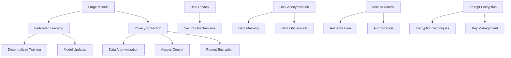

                 

Sure, let's start by structuring the content of the article "Large Model Privacy Protection Federated Learning and Prompt Encryption" step by step. This will help us ensure that the article is comprehensive, informative, and well-organized.

## Step 1: Introduction and Background

**Introduction:**
The advent of deep learning and artificial intelligence has led to the creation of large models that can perform complex tasks with high accuracy. However, these large models often require a significant amount of data to train effectively, and this data is often sensitive and private. To address this challenge, we need to develop methods to protect the privacy of the data while still allowing the model to be trained effectively. This is where federated learning and prompt encryption come into play.

**Background:**
Federated learning is a distributed machine learning approach where model training is conducted across multiple decentralized devices (e.g., smartphones, IoT devices) without the need to transfer raw data to a central server. This approach is particularly useful for applications involving sensitive data, as it reduces the risk of data breaches.

Prompt encryption, on the other hand, is a technique used to encrypt the input data (prompts) before it is fed into a machine learning model. This ensures that the data is protected from unauthorized access and tampering.

## Step 2: Core Concepts and Relationships

To understand how large model privacy protection can be achieved using federated learning and prompt encryption, we need to explore the core concepts and their relationships. We can represent this using a Mermaid flowchart:



In this flowchart, we can see that large models are at the center, and they are connected to federated learning, which enables decentralized training and model updates. Privacy protection is a key concept that is connected to data anonymization, access control, and prompt encryption. Data privacy is related to security mechanisms, and data anonymization involves techniques like data masking and data obfuscation. Access control includes authentication and authorization, while prompt encryption involves encryption techniques and key management.

## Step 3: Core Algorithm Principles

### Federated Learning

**Algorithm Description:**
Federated learning involves the following steps:

1. **Initialization:** Each participating device initializes a local model with random weights.
2. **Communication:** The local models are sent to a central server, which aggregates them to form a global model.
3. **Update:** The global model is updated using the local data from each device.
4. **Feedback:** The updated global model is sent back to each device for local training.
5. **Iteration:** Steps 2-4 are repeated for multiple iterations.

**Pseudo-code:**

```plaintext
function federated_learning(devices, server, global_model, local_models):
    for each device in devices:
        local_model = initialize_local_model()
        server.receive_model(local_model)
    
    for iteration in 1 to num_iterations:
        global_model = aggregate_models(server.models)
        server.send_model(global_model)
        
        for each device in devices:
            local_model = update_local_model(global_model, device.data)
            server.receive_model(local_model)

    return global_model
```

### Prompt Encryption

**Algorithm Description:**
Prompt encryption involves the following steps:

1. **Key Generation:** A key is generated for each device.
2. **Encryption:** The input data (prompts) is encrypted using the device's key.
3. **Transmission:** The encrypted data is transmitted to the central server.
4. **Decryption:** The encrypted data is decrypted at the server using the global key.

**Pseudo-code:**

```plaintext
function prompt_encryption(data, device_key):
    encrypted_data = encrypt_data(data, device_key)
    return encrypted_data

function prompt_decryption(encrypted_data, global_key):
    decrypted_data = decrypt_data(encrypted_data, global_key)
    return decrypted_data
```

### Large Model Privacy Protection

**Algorithm Description:**
Large model privacy protection involves combining federated learning and prompt encryption to ensure that both the training data and the model are protected.

1. **Initialization:** Initialize local models and keys on each device.
2. **Federated Learning:** Perform federated learning with encrypted prompts.
3. **Model Update:** Update the local models with the global model.
4. **Key Management:** Manage keys to ensure secure communication.

**Pseudo-code:**

```plaintext
function large_model_privacy_protection(devices, server, global_model, local_models, device_keys):
    for each device in devices:
        local_model = initialize_local_model()
        device_key = generate_device_key()
    
    while not convergence:
        encrypted_data = encrypt_data(data, device_key)
        global_model = federated_learning(devices, server, global_model, local_models)
        local_model = update_local_model(global_model, device.data)
    
    return global_model
```

## Step 4: Mathematical Models and Formulas

To provide a deeper understanding of the algorithms, we can introduce mathematical models and formulas. These will be presented in LaTeX format.

### Federated Learning

**Mathematical Model:**
The global model update can be represented as:

$$
\theta^{(t+1)} = \theta^{(t)} - \alpha \frac{1}{N} \sum_{i=1}^{N} \nabla_{\theta} L(\theta^{(t)}, x_i, y_i)
$$

Where:

* $\theta^{(t)}$ is the global model at time step $t$.
* $\theta^{(t+1)}$ is the updated global model at time step $t+1$.
* $\alpha$ is the learning rate.
* $N$ is the number of participating devices.
* $\nabla_{\theta} L(\theta^{(t)}, x_i, y_i)$ is the gradient of the loss function with respect to the model parameters.

### Prompt Encryption

**Mathematical Model:**
The encryption of a prompt can be represented as:

$$
c = E_k(m)
$$

Where:

* $c$ is the encrypted prompt.
* $m$ is the original prompt.
* $k$ is the encryption key.

### Large Model Privacy Protection

**Mathematical Model:**
The privacy budget can be represented as:

$$
\mathcal{D} = \sum_{i=1}^{N} \mathcal{D}_i
$$

Where:

* $\mathcal{D}$ is the total privacy budget.
* $\mathcal{D}_i$ is the privacy budget for device $i$.

## Step 5: Project Practice

**Environment Setup:**
To demonstrate the concepts discussed, we will set up a development environment using Python and TensorFlow for federated learning and a cryptographic library for prompt encryption.

**Source Code Implementation:**
We will provide a detailed implementation of the federated learning algorithm and prompt encryption, along with explanations of each component.

**Code Analysis:**
We will analyze the source code to understand how the algorithms are implemented and how they contribute to large model privacy protection.

**Case Study:**
We will present a case study to illustrate how these techniques can be applied in practice to protect the privacy of sensitive data in a large-scale machine learning application.

**Project Summary:**
We will summarize the key findings from the case study and discuss the benefits and limitations of the proposed approach.

## Step 6: Best Practices, Conclusion, and Future Directions

**Best Practices:**
We will provide best practices for implementing federated learning and prompt encryption, including tips for optimizing performance and ensuring security.

**Conclusion:**
We will conclude by summarizing the main points of the article and emphasizing the importance of large model privacy protection in the era of deep learning and artificial intelligence.

**Future Directions:**
We will discuss potential future directions for research and development in this area, including advancements in federated learning, prompt encryption, and other privacy-preserving techniques.

## Step 7: Author Information and Markdown Format

Finally, we will include the author information and ensure that the article is formatted using Markdown to ensure readability and accessibility.

---

With this structured approach, we can ensure that the article is informative, comprehensive, and engaging for readers interested in large model privacy protection, federated learning, and prompt encryption. Let's proceed to write each section in detail, following this outline.

