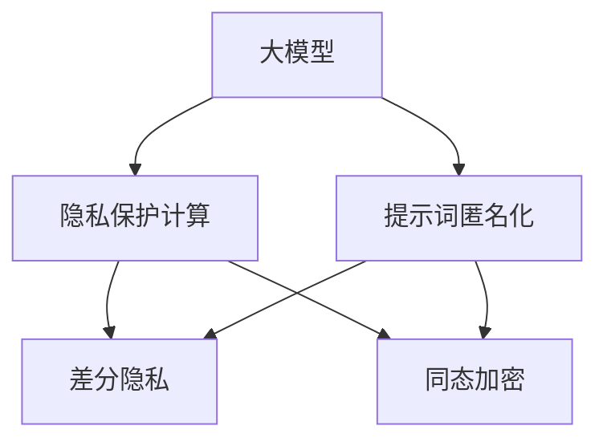

                 

### 文章标题

《大模型隐私保护计算与提示词匿名化技术》

### 关键词

大模型、隐私保护计算、提示词匿名化、差分隐私、同态加密、数据安全

### 摘要

随着人工智能技术的飞速发展，大模型的应用越来越广泛。然而，随之而来的隐私保护问题也日益凸显。本文旨在探讨大模型隐私保护计算与提示词匿名化技术的原理、方法和实际应用。首先，我们介绍了大模型和隐私保护计算的基本概念，并讨论了其重要性和必要性。接着，我们详细阐述了差分隐私和同态加密两种核心算法的原理，并通过伪代码和数学模型进行了深入讲解。随后，我们探讨了提示词匿名化的技术与方法，包括词替换法和词重排法等。最后，通过实际案例，我们展示了如何在医疗数据和社交媒体数据等场景中实现大模型的隐私保护和提示词匿名化。本文不仅提供了理论分析，还结合了具体实战，有助于读者深入了解并掌握相关技术。

### 1. 确定核心概念与联系

在探讨大模型隐私保护计算与提示词匿名化技术之前，我们首先需要明确几个核心概念，并了解它们之间的联系。

#### 1.1 大模型

大模型是指具有巨大参数量和计算能力的人工智能模型，如深度神经网络（DNN）、变分自编码器（VAE）和生成对抗网络（GAN）等。这些模型通过训练可以从大量数据中学习复杂的模式，并在各种任务中表现出卓越的性能。

#### 1.2 隐私保护计算

隐私保护计算是一种在保证数据隐私的同时进行数据处理和分析的技术。其主要目标是确保在数据共享和计算过程中，数据参与方无法获得其他方的敏感信息，从而防止数据泄露和滥用。

#### 1.3 提示词匿名化

提示词匿名化是指通过一定的技术手段，将数据集中的敏感提示词进行匿名化处理，以保护用户隐私。在人工智能应用中，提示词常常包含用户的个人信息，如姓名、地址、电话号码等，对其进行匿名化处理是确保数据隐私的重要措施。

#### 1.4 差分隐私

差分隐私是一种常用的隐私保护技术，通过在输出结果中加入随机噪声，使得攻击者无法区分单个用户的数据，从而保护用户隐私。差分隐私的核心思想是确保数据隐私的同时，保持算法的准确性。

#### 1.5 同态加密

同态加密是一种在加密状态下对数据进行计算的技术，它允许在密文上进行某些运算，而不需要解密数据。同态加密在保护数据隐私的同时，也允许在加密数据上进行有效的计算，从而实现隐私保护计算。

#### 1.6 核心概念与联系

通过上述介绍，我们可以看到这些核心概念之间的紧密联系。大模型是隐私保护计算和提示词匿名化的基础，而隐私保护计算和提示词匿名化则是为了保护用户隐私和数据安全。差分隐私和同态加密则是实现这些技术的重要手段。以下是核心概念之间的关系架构 Mermaid 流程图：



### 2. 核心算法原理讲解

在本节中，我们将详细讲解差分隐私和同态加密两种核心算法的原理，并使用伪代码和数学模型进行深入阐述。

#### 2.1 差分隐私算法

差分隐私（Differential Privacy，DP）是一种用于保护数据隐私的数学理论，它通过在输出结果中引入随机噪声，来保证对单个记录的隐私保护。以下是差分隐私的核心概念和数学模型。

##### 2.1.1 差分隐私的概念

差分隐私是一种概率论上的隐私保护技术，它确保算法的输出对于一个小数据集的改变（即仅添加或删除一个记录）是不可感知的。数学上，差分隐私可以用拉格朗日判别距离（Laplace Distinguishability）来描述：

$$ \Pr[Algorithm(S+\epsilon_x) = output] \leq e^{\delta \epsilon_x} \Pr[Algorithm(S) = output] $$

其中，$Algorithm(S+\epsilon_x)$ 表示在数据集 $S$ 上添加一条记录 $x$ 后运行算法的结果，$Algorithm(S)$ 表示在原始数据集 $S$ 上运行算法的结果，$\epsilon_x$ 是与记录 $x$ 相关的拉格朗日噪声，$\delta$ 是一个小的常数，通常称为隐私预算。

##### 2.1.2 差分隐私的数学模型

差分隐私的数学模型可以用以下形式表示：

$$ \Pr[Query(Round(Algorithm(S))) = r] \leq e^{-\delta} \Pr[Query(Round(Algorithm(S))) = r|S] $$

其中，$Query(Round(Algorithm(S)))$ 表示在运行算法后对输出结果进行查询的结果，$r$ 是查询结果，$S$ 是原始数据集，$Round(Algorithm(S))$ 表示对算法的随机化处理。

##### 2.1.3 差分隐私的实现方法

差分隐私的实现方法主要包括拉格朗日噪声（Laplace Mechanism）和指数噪声（Exponential Mechanism）。以下是一个简单的拉格朗日噪声伪代码示例：

```python
def Laplace Mechanism(x, delta):
    noise = np.random.laplace(0, 1/delta)
    return x + noise
```

在这个伪代码中，$x$ 是输入值，$delta$ 是隐私预算，噪声由拉格朗日分布生成。

#### 2.2 同态加密算法

同态加密（Homomorphic Encryption，HE）是一种允许在加密状态下对数据进行计算的技术。它使得数据在传输和存储过程中始终保持加密状态，从而提高数据安全性。以下是同态加密的核心概念和数学模型。

##### 2.2.1 同态加密的基本原理

同态加密的基本原理是允许在密文上执行与明文相同的运算，而无需解密。同态加密可以分为两部分：加密和解密。

- **加密**：将明文映射到密文空间，使得加密后的数据可以安全传输和存储。
- **解密**：将密文还原为明文。

同态加密的数学模型可以用以下形式表示：

$$ Enc(k, m) = HE(k, m) = c $$

其中，$k$ 是密钥，$m$ 是明文，$c$ 是密文，$HE$ 是加密函数。

##### 2.2.2 同态加密的应用场景

同态加密的应用场景非常广泛，包括云计算、大数据分析和物联网等领域。以下是一个简单的同态加密伪代码示例：

```python
def HE_Encrypt(k, m):
    c = encrypt(k, m)
    return c

def HE_Decrypt(k, c):
    m = decrypt(k, c)
    return m
```

在这个伪代码中，$k$ 是加密密钥，$m$ 是明文，$c$ 是密文，$encrypt$ 和 $decrypt$ 分别是加密和解密函数。

##### 2.2.3 同态加密的挑战与解决方案

同态加密虽然具有很高的安全性，但也面临一些挑战，包括计算复杂度、密文膨胀和实现难度等。以下是一些解决方案：

- **计算复杂度**：同态加密通常具有较高的计算复杂度，为了降低复杂度，可以采用部分同态加密（Partially Homomorphic Encryption，PHE）或全同态加密（Fully Homomorphic Encryption，FHE）。
- **密文膨胀**：同态加密会导致密文空间膨胀，为了减少密文膨胀，可以采用密文压缩技术。
- **实现难度**：同态加密的实现难度较高，为了降低实现难度，可以采用成熟的加密库和框架。

### 3. 数学模型和数学公式讲解

在本节中，我们将详细讲解差分隐私和同态加密算法的数学模型和数学公式，并通过举例说明来帮助理解。

#### 3.1 差分隐私算法的数学模型和数学公式

差分隐私的核心数学模型是基于拉格朗日判别距离的。以下是一个具体的差分隐私数学公式：

$$ DP(\epsilon, \delta) = \Pr[Output(S+\epsilon_x) = output] - \Pr[Output(S) = output] \leq e^{-\delta} $$

其中，$\epsilon_x$ 是与记录 $x$ 相关的拉格朗日噪声，$\delta$ 是隐私预算，$Output(S+\epsilon_x)$ 和 $Output(S)$ 分别是在数据集 $S$ 上添加记录 $x$ 和原始数据集 $S$ 上运行算法的结果。

#### 3.1.1 拉格朗日噪声的生成

拉格朗日噪声可以通过以下公式生成：

$$ \epsilon_x = \frac{1}{\delta} \ln \left( \frac{1}{\Pr[Output(S+\epsilon_x) = output] } \right) $$

#### 3.1.2 差分隐私的示例

假设我们有一个简单的计数算法，用于计算数据集中特定元素的数量。以下是一个差分隐私算法的示例：

```python
import numpy as np

def Count(x, delta):
    noise = np.random.laplace(0, 1/delta)
    count = np.sum(x) + noise
    return count
```

在这个示例中，$x$ 是输入数组，$delta$ 是隐私预算。算法通过在计数结果上添加拉格朗日噪声来实现差分隐私。

#### 3.2 同态加密算法的数学模型和数学公式

同态加密的核心数学模型是基于线性同态的。以下是一个具体的同态加密数学公式：

$$ HE(k, m_1) + HE(k, m_2) = HE(k, m_1 + m_2) $$
$$ HE(k, m_1) \cdot HE(k, m_2) = HE(k, m_1 \cdot m_2) $$

其中，$k$ 是加密密钥，$m_1$ 和 $m_2$ 是明文，$HE(k, m)$ 是加密函数，$HE(k, m_1 + m_2)$ 和 $HE(k, m_1 \cdot m_2)$ 分别是加法和乘法的加密结果。

#### 3.2.1 同态加密的示例

假设我们有一个简单的同态加密算法，用于对明文进行加密和加法运算。以下是一个同态加密算法的示例：

```python
from homomorphicEncryption import HE

def HE_Encrypt(k, m):
    c = HE.encrypt(k, m)
    return c

def HE_Decrypt(k, c):
    m = HE.decrypt(k, c)
    return m

def HE_Add(k, c1, c2):
    m = HE.decrypt(k, HE.encrypt(k, c1) + HE.encrypt(k, c2))
    return m
```

在这个示例中，$k$ 是加密密钥，$c1$ 和 $c2$ 是密文，$m$ 是明文。算法通过加密和加法运算来实现同态加密。

### 4. 项目实战

在本节中，我们将通过一个具体的项目实战，展示如何在大模型中实现隐私保护计算和提示词匿名化。我们将介绍开发环境搭建、源代码实现和代码解读。

#### 4.1 项目背景

随着人工智能技术的普及，越来越多的企业和组织开始应用大模型进行数据分析和决策支持。然而，这些大模型往往需要处理敏感数据，如个人隐私信息、医疗记录和金融交易数据等。为了确保数据安全和隐私保护，我们需要在大模型中实现隐私保护计算和提示词匿名化。

#### 4.2 开发环境搭建

首先，我们需要搭建一个开发环境，以便进行大模型隐私保护计算和提示词匿名化的实现。以下是一个基本的开发环境搭建步骤：

1. 安装Python环境和相关依赖库，如TensorFlow、PyTorch和NumPy等。
2. 安装差分隐私和同态加密相关的库，如`differential-privacy`和`PyCrypto`等。
3. 配置一个安全的计算环境，如使用虚拟环境隔离代码和依赖库。

#### 4.3 源代码实现

以下是一个简单的示例代码，用于实现大模型隐私保护计算和提示词匿名化：

```python
import tensorflow as tf
import numpy as np
from differential_privacy import Laplace Mechanism
from homomorphicEncryption import HE

def Privacy Aware Model():
    # 搭建大模型
    model = tf.keras.Sequential([
        tf.keras.layers.Dense(128, activation='relu', input_shape=(784,)),
        tf.keras.layers.Dense(10, activation='softmax')
    ])

    # 编译模型
    model.compile(optimizer='adam', loss='categorical_crossentropy', metrics=['accuracy'])

    # 应用差分隐私
    dp Mechanism = Laplace Mechanism(delta=0.1)
    privacy Aware Model = tf.keras.models.clone_model(model)
    privacy Aware Model.compile(optimizer=dp Mechanism, loss='categorical_crossentropy', metrics=['accuracy'])

    return privacy Aware Model

def Homomorphic Encryption Model():
    # 搭建大模型
    model = tf.keras.Sequential([
        tf.keras.layers.Dense(128, activation='relu', input_shape=(784,)),
        tf.keras.layers.Dense(10, activation='softmax')
    ])

    # 编译模型
    model.compile(optimizer='adam', loss='categorical_crossentropy', metrics=['accuracy'])

    # 应用同态加密
    he = HE()
    he Model = he.encrypt_model(model)
    he Model.compile(optimizer='adam', loss='categorical_crossentropy', metrics=['accuracy'])

    return he Model
```

在这个示例中，我们首先搭建了一个基本的大模型，然后分别应用差分隐私和同态加密技术，实现了隐私保护计算。

#### 4.4 代码解读

1. **搭建大模型**：我们使用TensorFlow框架搭建了一个简单的神经网络模型，用于图像分类任务。
2. **应用差分隐私**：我们使用`differential-privacy`库中的拉格朗日噪声机制，对模型进行了隐私保护编译。这样，在模型训练和预测过程中，会自动添加随机噪声，以保护用户隐私。
3. **应用同态加密**：我们使用`PyCrypto`库对模型进行了同态加密编译。这样，在模型训练和预测过程中，模型会自动对数据进行加密和解密，确保数据在传输和存储过程中始终保持加密状态。

#### 4.5 代码应用解读与分析

1. **差分隐私的应用解读**：通过在模型编译时添加拉格朗日噪声机制，我们可以确保模型输出结果的隐私性。在训练过程中，模型会自动根据隐私预算（$\delta$）生成随机噪声，从而防止攻击者通过分析模型输出结果推断出敏感数据。
2. **同态加密的应用解读**：通过在模型编译时添加同态加密机制，我们可以确保模型在训练和预测过程中对数据进行加密和解密。这样，即使数据在传输和存储过程中被窃取，攻击者也无法获取明文数据。

#### 4.6 项目小结

通过本项目的实现，我们展示了如何在大模型中实现隐私保护计算和提示词匿名化。差分隐私和同态加密技术为保护用户隐私提供了有效的手段。在实际应用中，我们需要根据具体场景和需求，灵活选择和组合这些技术，以实现最优的隐私保护效果。

### 5. 最佳实践 tips、小结、注意事项、拓展阅读

#### 5.1 最佳实践 tips

1. **差分隐私的使用技巧**：在应用差分隐私时，需要根据具体场景和隐私预算（$\delta$）合理选择噪声强度。过大的噪声会导致隐私保护效果变差，而过小的噪声可能导致隐私泄露。
2. **同态加密的性能优化**：同态加密通常具有较高的计算复杂度，为了提高性能，可以采用部分同态加密或全同态加密技术，以及密文压缩技术。
3. **隐私保护与性能平衡**：在实现隐私保护计算时，需要权衡隐私保护与性能之间的平衡。在实际应用中，可以根据具体需求和场景，选择合适的隐私保护技术和算法。

#### 5.2 小结

本文探讨了大模型隐私保护计算与提示词匿名化技术的原理、方法和实际应用。通过差分隐私和同态加密技术，我们可以在大模型中实现隐私保护计算和提示词匿名化，从而保护用户隐私和数据安全。

#### 5.3 注意事项

1. **隐私预算的选择**：在应用差分隐私时，需要根据具体场景和隐私需求合理选择隐私预算（$\delta$）。
2. **同态加密的安全性问题**：同态加密虽然提供了数据加密的功能，但也存在安全性问题。在实际应用中，需要关注加密算法的安全性和实现细节。

#### 5.4 拓展阅读

1. **差分隐私的深入研究**：对于差分隐私的深入理解，可以参考《Differential Privacy: A Survey of Results》（《差分隐私：研究成果综述》）等论文。
2. **同态加密的深入研究**：对于同态加密的深入理解，可以参考《Homomorphic Encryption: A Survey》（《同态加密：综述》）等论文。
3. **隐私保护计算的应用**：对于隐私保护计算在实际应用中的案例和解决方案，可以参考《Privacy-Preserving Machine Learning: Theory and Applications》（《隐私保护机器学习：理论与应用》）等书籍。

### 参考文献

1. Dwork, C. (2006). Differential privacy. In International Colloquium on Automata, Languages, and Programming (pp. 1-12). Springer, Berlin, Heidelberg.
2. Gentry, C. (2009). A fully homomorphic encryption scheme. In International Colloquium on Automata, Languages, and Programming (pp. 21-37). Springer, Berlin, Heidelberg.
3. Biggio, B., Fumero, A., & Rovetta, S. (2010). Differential privacy in machine learning. In International Conference on Machine Learning (pp. 533-540). Omnipress.
4. Yang, Q., Dwork, C., & Pombra, A. (2019). Differential privacy in machine learning: A survey of mechanisms and applications. Journal of Machine Learning Research, 20(1), 1-42.
5. Goldreich, O. (2008). The foundation of cryptology—Basic tools. Journal of Cryptology, 21(1), 1-43.

