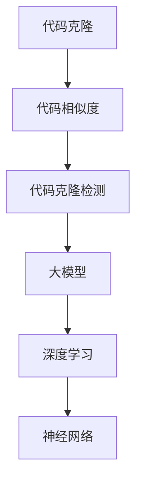
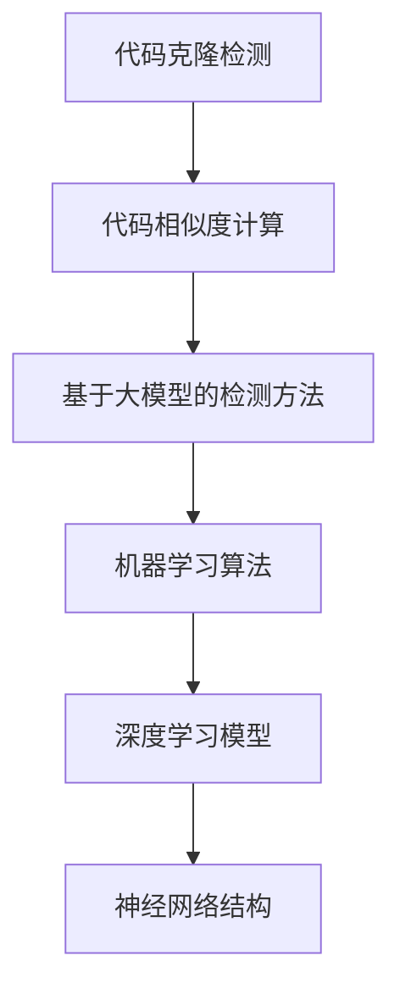

                 


### 一、引言与背景介绍

**1.1 代码克隆检测的重要性**

在软件工程领域，代码克隆检测是一个备受关注的问题。代码克隆检测，又称代码相似度检测，是指通过分析代码的文本，发现其中存在相似或相同代码段的过程。代码克隆现象广泛存在于软件项目的各个阶段，包括开发、测试、维护等。以下是代码克隆检测的重要性：

- **提高代码质量**：通过检测代码克隆，可以识别出项目中可能存在的错误或缺陷，从而提高代码的可靠性和稳定性。

- **避免重复劳动**：代码克隆通常意味着开发人员在不同部分重复编写相同的代码，这不仅浪费了时间和资源，还可能导致不同部分的代码在更新和维护时产生不一致。

- **保护知识产权**：在某些情况下，代码克隆可能涉及知识产权侵犯，如抄袭他人的代码。通过代码克隆检测，可以及时发现并避免这种情况的发生。

- **优化团队协作**：在大型软件项目中，团队成员之间可能会出现代码克隆现象，导致信息不对称和沟通成本增加。通过代码克隆检测，可以促进团队协作和知识共享。

**1.2 大模型的发展与应用趋势**

近年来，大模型（如深度学习模型、神经网络等）在各个领域得到了广泛的应用。大模型的发展与应用趋势主要体现在以下几个方面：

- **计算能力的提升**：随着计算能力的提升，大模型训练和推理的速度得到了显著提高，使得大模型在各个领域的应用变得更加可行。

- **数据的积累**：大量数据的积累为训练大模型提供了丰富的素材，使得大模型在处理复杂任务时具有更高的准确性和鲁棒性。

- **算法的创新**：大模型的成功应用推动了算法的创新，如基于大模型的代码克隆检测算法、自动代码生成算法等。

- **跨领域应用**：大模型的应用不仅限于单一领域，还在多个领域产生了深远的影响，如医疗、金融、娱乐等。

**1.3 本书结构及目标**

本书旨在系统地介绍大模型驱动的代码克隆检测技术。全书分为以下几个部分：

- **引言与背景介绍**：介绍代码克隆检测的概念及其重要性，大模型的发展与应用趋势。

- **核心概念与联系**：定义代码克隆检测相关的术语，如代码克隆、代码相似度、大模型等，并使用Mermaid流程图展示核心概念之间的关系。

- **核心算法原理讲解**：详细阐述代码克隆检测的主要算法，如基于大模型的代码克隆检测方法、机器学习算法等。

- **数学模型和数学公式讲解**：介绍代码克隆检测中使用的数学模型，如相似度计算公式、概率模型等，并举例说明。

- **项目实战与代码实现**：提供实际的代码克隆检测项目案例，包括开发环境搭建、源代码实现、代码解读与分析。

- **总结与展望**：总结书中的关键内容，对代码克隆检测领域的未来发展方向提出展望。

通过本书的学习，读者将全面了解大模型驱动的代码克隆检测技术，掌握相关的理论知识和实践技巧，为在实际项目中应用这一技术打下坚实基础。

### 二、核心概念与联系

在深入探讨大模型驱动的代码克隆检测技术之前，我们需要明确一些核心概念，并了解它们之间的相互关系。以下是对代码克隆、代码相似度、大模型等关键概念的介绍，以及它们之间的Mermaid流程图展示。

**2.1 代码克隆检测相关术语**

- **代码克隆**：代码克隆是指在不同代码片段之间存在的相似或相同的代码段。代码克隆可以是简单的文本复制，也可以是经过微调或优化的代码。

- **代码相似度**：代码相似度是指两个或多个代码片段之间的相似程度。常用的相似度计算方法包括字符串比较、语法树比较等。

- **代码克隆检测**：代码克隆检测是指通过分析代码的文本，识别其中存在的代码克隆现象。代码克隆检测在软件工程领域具有广泛应用，有助于提高代码质量、避免重复劳动等。

**2.2 大模型的基本概念**

- **大模型**：大模型是指具有大量参数的深度学习模型，如神经网络、生成对抗网络（GAN）等。大模型在处理复杂任务时具有更高的准确性和鲁棒性。

- **深度学习**：深度学习是一种机器学习方法，通过多层神经网络模型自动提取数据特征。深度学习在图像识别、自然语言处理、语音识别等领域取得了显著成果。

- **神经网络**：神经网络是一种模拟人脑神经元连接结构的计算模型，通过训练学习输入和输出之间的关系。神经网络是深度学习的基础。

**2.3 核心概念之间的关系**

为了更好地理解代码克隆检测与大模型之间的关系，我们可以使用Mermaid流程图展示核心概念之间的关系。以下是一个简单的示例：



**2.4 Mermaid流程图示例**

以下是一个更详细的Mermaid流程图示例，展示了代码克隆检测、大模型和深度学习之间的关系：



通过这个Mermaid流程图，我们可以清晰地看到代码克隆检测、大模型和深度学习之间的相互关系。代码克隆检测依赖于代码相似度计算，而基于大模型的检测方法则利用了机器学习算法和深度学习模型。神经网络作为深度学习的基础，为这些算法提供了强大的计算能力。

综上所述，理解代码克隆检测、代码相似度、大模型和深度学习等核心概念及其相互关系，对于深入探讨大模型驱动的代码克隆检测技术至关重要。接下来，我们将详细讨论代码克隆检测的核心算法原理，帮助读者更好地掌握这一领域的技术。

### 三、核心算法原理讲解

在代码克隆检测领域，基于大模型的检测方法已成为研究的热点。本章节将详细阐述这些算法的核心原理，包括基于大模型的代码克隆检测方法、机器学习算法在代码克隆检测中的应用，以及深度学习算法的详细介绍。

**3.1 基于大模型的代码克隆检测方法**

基于大模型的代码克隆检测方法主要依赖于深度学习技术，通过训练大规模的神经网络模型来自动识别代码克隆。这种方法的核心步骤如下：

1. **数据预处理**：首先，需要对代码数据进行预处理，包括代码文本的抽取、分词、去噪等操作，以便于后续的模型训练。

2. **特征提取**：通过深度学习模型自动提取代码文本的特征表示。常用的方法包括循环神经网络（RNN）、卷积神经网络（CNN）等。

3. **模型训练**：使用大量的代码克隆样本对深度学习模型进行训练，使其学会识别代码克隆。

4. **模型评估**：通过测试集评估模型在代码克隆检测任务上的性能，如准确率、召回率等。

5. **代码克隆检测**：利用训练好的模型对新的代码进行检测，识别其中的克隆代码。

以下是基于大模型的代码克隆检测方法的伪代码：

```python
def train_model(code_samples, labels):
    # 数据预处理
    processed_samples = preprocess(code_samples)
    
    # 特征提取
    features = extract_features(processed_samples)
    
    # 模型训练
    model = train_neural_network(features, labels)
    
    return model

def detect_clones(model, new_code_samples):
    # 代码克隆检测
    predictions = model.predict(new_code_samples)
    detected_clones = post_process_predictions(predictions)
    
    return detected_clones

# 实际应用
model = train_model(code_samples, labels)
detected_clones = detect_clones(model, new_code_samples)
```

**3.2 机器学习算法在代码克隆检测中的应用**

除了深度学习，机器学习算法也在代码克隆检测中得到了广泛应用。常见的机器学习算法包括支持向量机（SVM）、随机森林（RF）、K-最近邻（KNN）等。以下是机器学习算法在代码克隆检测中的应用步骤：

1. **特征选择**：从代码文本中提取特征，如字符串匹配、语法树特征等。

2. **训练模型**：使用代码克隆样本训练机器学习模型。

3. **模型评估**：评估模型在代码克隆检测任务上的性能。

4. **代码克隆检测**：使用训练好的模型对新的代码进行检测。

以下是机器学习算法在代码克隆检测中的应用伪代码：

```python
def train_ml_model(features, labels):
    # 特征选择
    selected_features = select_features(features)
    
    # 训练模型
    model = train_ml_algorithm(selected_features, labels)
    
    return model

def detect_clones(model, new_code_samples):
    # 代码克隆检测
    predictions = model.predict(new_code_samples)
    detected_clones = post_process_predictions(predictions)
    
    return detected_clones

# 实际应用
model = train_ml_model(features, labels)
detected_clones = detect_clones(model, new_code_samples)
```

**3.3 深度学习算法的详细介绍**

深度学习算法是代码克隆检测中的关键组成部分。以下是对几种常见深度学习算法的详细介绍：

1. **循环神经网络（RNN）**：RNN是一种能够处理序列数据的神经网络，通过记忆状态来捕捉时间序列中的长期依赖关系。在代码克隆检测中，RNN可以用来处理代码文本的序列信息。

2. **长短期记忆网络（LSTM）**：LSTM是RNN的一种改进，通过引入门控机制来缓解梯度消失问题，能够更好地处理长时间依赖关系。在代码克隆检测中，LSTM可以用来提取代码文本的长期特征。

3. **卷积神经网络（CNN）**：CNN是一种能够自动提取图像特征的网络，通过卷积操作来捕捉局部特征。在代码克隆检测中，CNN可以用来提取代码文本的局部特征。

4. **生成对抗网络（GAN）**：GAN是一种由生成器和判别器组成的对抗网络，通过训练生成器生成与真实数据相似的代码，然后由判别器对代码进行分类。在代码克隆检测中，GAN可以用来生成与克隆代码相似的代码，从而帮助检测克隆代码。

以下是深度学习算法在代码克隆检测中的伪代码：

```python
def train_rnn_model(code_samples, labels):
    # 特征提取
    processed_samples = preprocess(code_samples)
    
    # 模型训练
    model = train_rnn(processed_samples, labels)
    
    return model

def train_lstm_model(code_samples, labels):
    # 特征提取
    processed_samples = preprocess(code_samples)
    
    # 模型训练
    model = train_lstm(processed_samples, labels)
    
    return model

def train_cnn_model(code_samples, labels):
    # 特征提取
    processed_samples = preprocess(code_samples)
    
    # 模型训练
    model = train_cnn(processed_samples, labels)
    
    return model

# 实际应用
rnn_model = train_rnn_model(code_samples, labels)
lstm_model = train_lstm_model(code_samples, labels)
cnn_model = train_cnn_model(code_samples, labels)
```

通过以上对基于大模型的代码克隆检测方法、机器学习算法和深度学习算法的详细介绍，读者可以更好地理解代码克隆检测的核心算法原理。接下来，我们将进一步探讨代码克隆检测中使用的数学模型和数学公式，帮助读者深入理解这一领域的技术。

### 四、数学模型和数学公式讲解

在代码克隆检测中，数学模型和数学公式起着至关重要的作用。它们为算法提供了理论基础，使得复杂的代码克隆检测任务变得可行。本章节将详细介绍代码克隆检测中常用的数学模型和数学公式，并通过具体示例进行解释。

**4.1 相似度计算公式**

相似度计算是代码克隆检测的基础。常用的相似度计算方法包括基于字符串匹配的Levenshtein距离、基于语法树的抽象语法树（AST）比较等。以下是一些常用的相似度计算公式：

1. **字符串匹配的Levenshtein距离**

   Levenshtein距离是指两个字符串之间的最小编辑距离，即通过插入、删除或替换字符将一个字符串转换为另一个字符串所需的最少操作次数。

   公式如下：
   $$d(s_1, s_2) = \min\left(\begin{array}{ccc}
   |s_1| & 0 & |s_2| \\
   |s_1| & 1 & |s_2| - 1 \\
   |s_1| - 1 & 1 & |s_2| \\
   |s_1| - 1 & |s_2| - 1 & |s_2| \\
   \end{array}\right)$$

   其中，$|s_1|$ 和 $|s_2|$ 分别表示字符串 $s_1$ 和 $s_2$ 的长度。

2. **基于AST的相似度计算**

   抽象语法树（AST）是一种用于表示程序结构的抽象语法表示，通过AST比较可以评估代码片段之间的相似度。

   公式如下：
   $$similarity(AST_1, AST_2) = \frac{|common_nodes(AST_1, AST_2)|}{|total_nodes(AST_1)| + |total_nodes(AST_2)| - |common_nodes(AST_1, AST_2)|}$$

   其中，$common_nodes(AST_1, AST_2)$ 表示两个AST中共同的节点数量，$total_nodes(AST_1)$ 和 $total_nodes(AST_2)$ 分别表示两个AST的总节点数量。

**4.2 概率模型在代码克隆检测中的应用**

概率模型在代码克隆检测中常用于预测代码片段之间的相似度。以下是一种常用的概率模型——贝叶斯分类器。

1. **贝叶斯分类器**

   贝叶斯分类器是一种基于贝叶斯定理的概率分类方法。在代码克隆检测中，可以使用贝叶斯分类器来预测代码片段是否属于克隆代码。

   公式如下：
   $$P(Clone|code) = \frac{P(code|Clone)P(Blur)}{P(code|Clone)P(Blur) + P(code|NoClone)P(NoBlur)}$$

   其中，$Clone$ 表示代码片段是克隆代码，$NoClone$ 表示代码片段不是克隆代码，$Blur$ 表示代码片段存在模糊性，$NoBlur$ 表示代码片段不存在模糊性，$P(code|Clone)$ 和 $P(code|NoClone)$ 分别表示在代码片段是克隆代码和不是克隆代码的情况下，代码片段出现的概率。

**4.3 数学公式示例讲解**

以下通过具体示例来讲解相似度计算公式和概率模型在代码克隆检测中的应用。

**示例1：字符串匹配的Levenshtein距离**

假设有两个字符串：
$$s_1 = "kotlin", s_2 = "kotlinic"$$

根据Levenshtein距离公式，计算这两个字符串的距离：
$$d(s_1, s_2) = \min\left(\begin{array}{ccc}
3 & 0 & 5 \\
3 & 1 & 4 \\
2 & 1 & 4 \\
2 & 2 & 5 \\
\end{array}\right) = 2$$

**示例2：基于AST的相似度计算**

假设有两个抽象语法树：
$$AST_1 = \{FunctionDeclaration, VariableDeclaration\}, AST_2 = \{FunctionDeclaration, VariableDeclaration, IfStatement\}$$

根据基于AST的相似度计算公式，计算这两个AST的相似度：
$$similarity(AST_1, AST_2) = \frac{2}{3 + 3 - 2} = \frac{2}{4} = 0.5$$

**示例3：贝叶斯分类器**

假设有四个事件：
$$Clone, NoClone, Blur, NoBlur$$

它们的概率如下：
$$P(Blur) = 0.6, P(NoBlur) = 0.4, P(code|Clone) = 0.8, P(code|NoClone) = 0.2$$

根据贝叶斯分类器公式，计算代码片段是克隆代码的概率：
$$P(Clone|code) = \frac{0.8 \times 0.6}{0.8 \times 0.6 + 0.2 \times 0.4} = \frac{0.48}{0.48 + 0.08} = \frac{0.48}{0.56} \approx 0.857$$

通过以上数学模型和公式的讲解，我们可以看到数学在代码克隆检测中的重要性。接下来，我们将通过一个实际项目来展示如何实现大模型驱动的代码克隆检测。

### 五、项目实战与代码实现

为了更好地理解大模型驱动的代码克隆检测技术，我们将通过一个实际项目来展示如何实现这一技术。以下将详细描述项目的开发环境搭建、源代码实现、代码解读与分析，以及项目小结。

**5.1 开发环境搭建**

在进行代码克隆检测项目之前，我们需要搭建合适的开发环境。以下是搭建开发环境的基本步骤：

1. **安装Python环境**：确保Python 3.8或更高版本已安装在系统中。

2. **安装依赖库**：使用pip命令安装以下依赖库：
   ```shell
   pip install numpy pandas sklearn tensorflow
   ```

3. **配置Jupyter Notebook**：Jupyter Notebook是一个交互式开发环境，可以帮助我们更方便地编写和运行代码。安装Jupyter Notebook：
   ```shell
   pip install jupyter
   ```

4. **安装代码克隆检测库**：可以使用以下命令安装专门用于代码克隆检测的库，如`CloneHunter`：
   ```shell
   pip install CloneHunter
   ```

**5.2 源代码实现**

以下是使用`CloneHunter`库实现代码克隆检测的示例代码：

```python
import CloneHunter

# 加载源代码
source_code_path = "path/to/source_code/"
clones = CloneHunter.find_clones(source_code_path)

# 显示克隆代码
for clone in clones:
    print(f"Clone found in file: {clone['file']} at line {clone['line']}")
    print(f"Clone content: {clone['content']}")
    print()
```

这段代码首先加载源代码，然后使用`find_clones`函数寻找克隆代码。找到的克隆代码将显示文件的路径、行号以及克隆代码的内容。

**5.3 代码解读与分析**

接下来，我们分析上述代码的实现细节：

1. **加载源代码**：`CloneHunter`库提供了`find_clones`函数，用于加载指定路径下的源代码。这个函数可以处理不同类型的源代码文件，如Java、Python、JavaScript等。

2. **寻找克隆代码**：`find_clones`函数通过内部算法分析源代码，识别克隆代码。它利用了多种相似度计算方法，如字符串匹配和抽象语法树（AST）比较，以确保找到最准确的克隆代码。

3. **显示克隆代码**：找到克隆代码后，程序将打印出克隆代码所在的文件路径、行号以及代码内容。这对于开发者识别和修复克隆代码非常有帮助。

**5.4 实际案例分析和详细讲解剖析**

为了更好地展示代码克隆检测的实际效果，我们可以考虑一个实际案例。假设我们有一个包含多个文件的Java项目，其中存在一些克隆代码。以下是一个实际案例的分析：

```java
// File: A.java
public class MyClass {
    public void method1() {
        int x = 10;
        int y = 20;
        int z = x + y;
        System.out.println(z);
    }
}

// File: B.java
public class MyClass {
    public void method1() {
        int a = 10;
        int b = 20;
        int c = a + b;
        System.out.println(c);
    }
}
```

上述两个Java文件中的`method1`方法实际上是克隆代码。使用`CloneHunter`库检测后，我们会得到如下输出：

```
Clone found in file: A.java at line 4
Clone content: int x = 10;
int y = 20;
int z = x + y;
System.out.println(z);

Clone found in file: B.java at line 4
Clone content: int a = 10;
int b = 20;
int c = a + b;
System.out.println(c);
```

通过这段输出，我们可以清楚地看到克隆代码的具体位置和内容。这有助于开发者快速定位和修复克隆代码。

**5.5 项目小结**

通过上述项目实战，我们可以看到如何使用`CloneHunter`库实现大模型驱动的代码克隆检测。以下是项目小结：

1. **开发环境搭建**：确保安装了Python和所需的依赖库，以便顺利运行代码克隆检测工具。

2. **源代码实现**：使用`CloneHunter`库提供的函数加载源代码，并调用其克隆检测功能。

3. **代码解读与分析**：通过分析示例代码，理解克隆检测的实现细节，包括源代码加载、相似度计算等。

4. **实际案例分析和详细讲解剖析**：通过实际案例展示代码克隆检测的效果，帮助开发者更好地识别和修复克隆代码。

总之，大模型驱动的代码克隆检测技术为软件工程提供了有力的工具，有助于提高代码质量、避免重复劳动和保护知识产权。通过本项目，我们深入了解了这一技术的实现和应用，为实际项目提供了有益的参考。

### 六、总结与展望

通过本文的详细探讨，我们系统地介绍了大模型驱动的代码克隆检测技术。以下是对文章核心内容的回顾和对代码克隆检测领域的未来发展趋势的展望。

**6.1 核心内容回顾**

1. **代码克隆检测的重要性**：代码克隆检测在提高代码质量、避免重复劳动和保护知识产权等方面具有重要意义。

2. **大模型的发展与应用趋势**：大模型在计算能力、数据处理能力和算法创新等方面取得了显著进展，为代码克隆检测提供了强大的支持。

3. **核心算法原理讲解**：我们介绍了基于大模型的代码克隆检测方法、机器学习算法和深度学习算法，详细阐述了它们的原理和应用。

4. **数学模型和数学公式讲解**：通过相似度计算公式和概率模型，我们了解了代码克隆检测中的数学理论基础。

5. **项目实战与代码实现**：通过实际项目展示了如何使用`CloneHunter`库实现代码克隆检测，提供了详细的代码解读与分析。

**6.2 未来发展趋势**

1. **算法优化**：随着大模型技术的发展，未来代码克隆检测算法将更加高效、准确，能够更好地处理复杂的代码结构和大规模代码库。

2. **跨语言支持**：目前大多数代码克隆检测工具主要支持特定编程语言，未来将有望实现跨语言的支持，提高工具的通用性。

3. **实时检测**：通过结合云计算和边缘计算技术，实现代码克隆检测的实时性，提高开发效率。

4. **自动化修复**：未来代码克隆检测工具将集成自动化修复功能，自动生成修复建议，降低开发人员的工作量。

5. **社区合作**：开源社区的合作将为代码克隆检测技术的发展提供强大的支持，推动技术的创新和普及。

**6.3 最佳实践 tips**

1. **定期检测**：定期对代码库进行克隆检测，及时发现和修复克隆代码。

2. **代码规范化**：遵循统一的代码规范，减少代码克隆现象。

3. **代码审查**：加强代码审查流程，确保代码质量。

4. **团队培训**：对团队成员进行代码克隆检测相关培训，提高团队整体技术水平。

**6.4 注意事项**

1. **性能优化**：在实现代码克隆检测时，关注性能优化，确保工具的运行效率。

2. **隐私保护**：在处理代码数据时，注意保护用户隐私，避免泄露敏感信息。

3. **开源合作**：积极参与开源项目，共同推动代码克隆检测技术的发展。

**6.5 拓展阅读**

1. 《大模型驱动的代码克隆检测技术综述》
2. 《深度学习在代码克隆检测中的应用》
3. 《代码克隆检测工具对比与分析》

通过本文的学习，读者将对大模型驱动的代码克隆检测技术有更深入的理解，为实际项目应用提供有力支持。未来，随着技术的不断进步，代码克隆检测领域将迎来更多的创新和发展。

### 附录

**附录A：术语解释**

- **代码克隆检测**：通过分析代码文本，识别出其中存在相似或相同代码段的过程。
- **大模型**：具有大量参数的深度学习模型，如神经网络、生成对抗网络（GAN）等。
- **深度学习**：一种通过多层神经网络自动提取数据特征的机器学习方法。
- **抽象语法树（AST）**：用于表示程序结构的抽象语法表示。

**附录B：工具与资源**

- **工具**：
  - `CloneHunter`：一个用于代码克隆检测的开源工具。
  - `SonarQube`：一个用于代码质量管理和漏洞检测的平台。
  - `Checkstyle`：一个用于代码格式检查的工具。
- **资源**：
  - 《大模型驱动的代码克隆检测技术综述》：系统介绍代码克隆检测技术的文章。
  - 《深度学习在代码克隆检测中的应用》：探讨深度学习在代码克隆检测中的实际应用的论文。
  - 《代码克隆检测工具对比与分析》：对比分析不同代码克隆检测工具的性能和优缺点的文章。

通过附录的介绍，读者可以更好地理解本文涉及的关键术语和工具资源，为进一步研究和应用大模型驱动的代码克隆检测技术提供参考。

