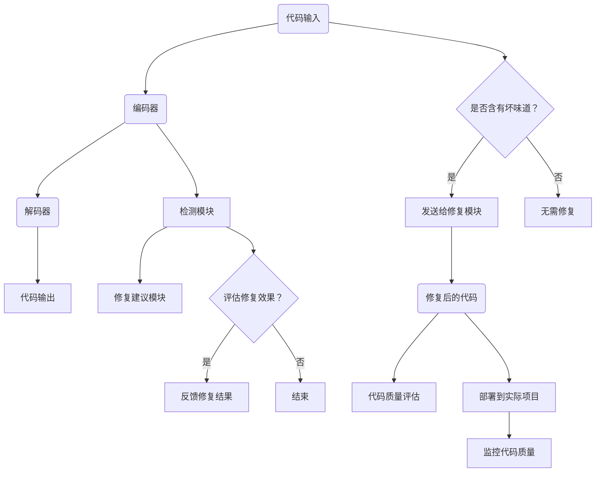
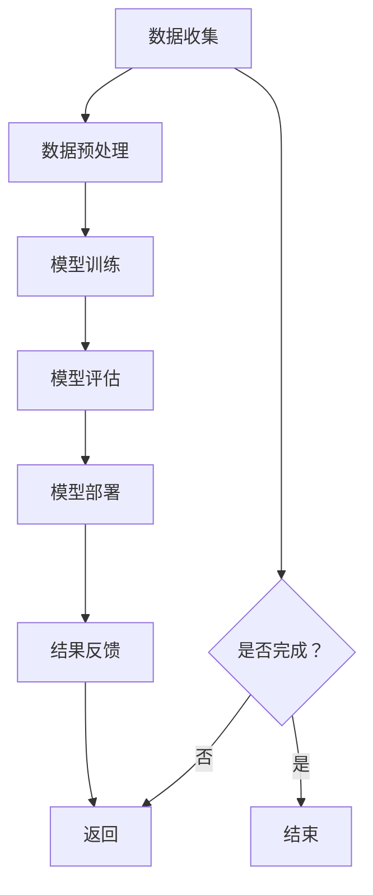

                 

# 大模型驱动的代码坏味道自动修复

## 关键词
大模型，代码坏味道，自动修复，深度学习，人工智能，自然语言处理，代码质量

## 摘要
随着软件系统的复杂性和规模不断扩大，代码坏味道（Code Smell）成为影响软件质量和维护成本的重要因素。本文将探讨如何利用大模型技术，特别是基于深度学习的自然语言处理方法，来识别和自动修复代码坏味道。文章首先介绍大模型的基本概念及其在软件工程中的应用，随后详细阐述代码坏味道的定义和类型，以及大模型在代码坏味道检测和修复中的具体应用。通过实际案例和项目实战，本文展示了大模型驱动的代码坏味道自动修复的流程、算法和效果，并提出了相关的最佳实践和未来研究方向。

## 引言

在软件工程领域，代码坏味道（Code Smell）是一种用来描述代码中可能存在问题的特征。这些特征可能预示着潜在的缺陷、低效的代码结构或不良的编程习惯。代码坏味道的出现通常是开发过程中积累的结果，可能会导致软件系统的可维护性下降、开发成本增加以及最终用户体验受损。

传统的代码质量提升方法通常依赖于开发人员的经验和直觉，通过静态代码分析工具来识别潜在的代码坏味道。然而，这种方法往往存在局限性，无法全面、准确地识别复杂的代码问题，尤其是在面对大规模和高度复杂的代码库时。此外，修复代码坏味道通常需要大量的手工干预，不仅耗时耗力，还可能引入新的错误。

随着人工智能和深度学习技术的快速发展，大模型（Large Models）的应用逐渐成为可能。大模型具有强大的表征能力和自学习能力，能够在大规模数据集上进行训练，从而对复杂任务提供高效、准确的解决方案。在软件工程领域，大模型的应用可以极大地提升代码质量检测和修复的效率和准确性。

本文旨在探讨如何利用大模型技术，特别是基于深度学习的自然语言处理方法，来识别和自动修复代码坏味道。文章将首先介绍大模型的基本概念和原理，然后详细阐述代码坏味道的定义和类型，以及大模型在代码坏味道检测和修复中的具体应用。最后，通过实际案例和项目实战，展示大模型驱动的代码坏味道自动修复的流程、算法和效果，并提出相关的最佳实践和未来研究方向。

## 大模型基础

### 大模型的定义与特点

大模型（Large Models）是指具有数十亿甚至数万亿参数的深度学习模型，能够在海量数据上进行训练，以实现强大的表征能力和高度的自学习能力。与传统的深度学习模型相比，大模型具有以下几个显著特点：

1. **参数数量庞大**：大模型拥有数亿到数千亿的参数，远远超过传统模型的参数规模。这使得大模型能够在复杂的任务中捕捉到丰富的特征信息。

2. **训练数据量巨大**：大模型的训练通常依赖于大规模的数据集，如互联网上的海量文本、图像、语音等。这种海量数据提供了丰富的上下文信息，有助于大模型学习到更广泛和更准确的表征。

3. **自学习能力**：大模型通过深度学习算法，能够在训练过程中自动调整内部参数，优化模型的性能。这种自学习能力使得大模型能够适应不同的任务和数据分布，从而提高其泛化能力。

4. **强表征能力**：大模型能够在数据中表示复杂的模式和关系，从而实现对输入数据的深度理解和抽象。这种强表征能力使得大模型在许多复杂的任务中表现优异，如自然语言处理、计算机视觉和语音识别等。

### 大模型的发展历程与未来趋势

大模型的发展历程可以追溯到深度学习技术的兴起。自2006年深度信念网络（DBN）和深度卷积神经网络（DCNN）的出现以来，深度学习技术逐渐成为人工智能领域的研究热点。随着计算能力的提升和海量数据的可用性，大模型的研究和应用得到了快速发展。

1. **发展历程**：
   - **2006-2012年**：深度信念网络（DBN）和深度卷积神经网络（DCNN）的出现，标志着深度学习的兴起。
   - **2012-2014年**：AlexNet在ImageNet竞赛中夺冠，引发了深度学习的热潮。
   - **2014-2018年**：基于GPU的深度学习框架如TensorFlow和PyTorch的推出，加速了深度学习的研究和应用。
   - **2018年至今**：大模型如BERT、GPT、ViT等相继出现，并在自然语言处理、计算机视觉等领域取得了显著的成果。

2. **未来趋势**：
   - **性能提升**：随着计算能力和算法的进步，大模型的性能将继续提升，能够在更复杂的任务中实现更高的准确性和效率。
   - **泛化能力**：通过更加有效的训练和优化策略，大模型的泛化能力将得到提升，能够适应更多样化的任务和数据分布。
   - **应用拓展**：大模型的应用领域将不断拓展，不仅限于当前的自然语言处理、计算机视觉等领域，还将涉足更多如自动驾驶、医疗诊断等前沿领域。

### 大模型的基本架构与工作原理

大模型的基本架构通常包括以下几个关键组件：

1. **输入层**：输入层接收外部数据，如文本、图像或语音信号。对于自然语言处理任务，输入通常是一系列的词向量或字符编码。

2. **隐藏层**：隐藏层是模型的中间层，负责对输入数据进行特征提取和表示学习。大模型的隐藏层通常包含多层，每一层都能捕捉到更高层次的抽象特征。

3. **输出层**：输出层根据模型的类型生成相应的输出结果，如文本、标签或预测值。对于自然语言处理任务，输出可以是词向量、分类标签或翻译结果。

4. **激活函数**：激活函数用于引入非线性变换，使得模型能够学习到复杂的数据分布。常见的激活函数包括ReLU、Sigmoid和Tanh等。

5. **损失函数**：损失函数用于评估模型的预测结果与真实标签之间的差距，并指导模型参数的优化。常见的损失函数包括均方误差（MSE）、交叉熵损失（Cross-Entropy Loss）等。

大模型的工作原理基于深度学习算法，主要包括以下步骤：

1. **数据预处理**：将输入数据转换为模型可以处理的格式，如词向量编码或图像像素值归一化。

2. **前向传播**：将预处理后的输入数据传递到模型中，通过多层隐藏层进行特征提取和表示学习。

3. **计算损失**：利用输出结果和真实标签计算损失值，评估模型的预测性能。

4. **反向传播**：通过反向传播算法更新模型参数，以最小化损失函数。

5. **迭代优化**：重复前向传播和反向传播过程，直至模型收敛或达到预定的迭代次数。

通过这些步骤，大模型能够不断学习和调整内部参数，最终实现对复杂任务的准确预测和表征。

### 大模型在软件工程中的应用

大模型在软件工程领域的应用已逐渐成为热点，特别是在代码质量和软件缺陷检测与修复方面，大模型展现出了巨大的潜力和优势。以下是大模型在软件工程中应用的一些主要方面：

1. **代码质量评估**：大模型可以通过分析代码的语法、结构、注释等特征，评估代码的质量。例如，大模型可以识别出代码中潜在的复杂性、冗余和重复代码等问题，为开发人员提供改进建议。

2. **代码缺陷检测**：大模型能够利用其强大的表征能力，从代码中提取出潜在的错误模式。这种方法可以显著提高代码缺陷检测的准确性和效率，尤其是在面对复杂和庞大的代码库时。

3. **代码风格一致性检查**：大模型可以学习并遵循特定的代码风格指南，自动检查代码是否符合预定的编码规范。这对于提高代码的可读性和可维护性具有重要意义。

4. **代码自动化修复**：基于大模型的自学习能力和强大的表征能力，可以实现代码坏味道的自动修复。这种方法不仅减少了开发人员的工作负担，还提高了修复的准确性和一致性。

5. **代码生成**：大模型可以通过学习大量的代码库和编程规范，生成符合要求的代码片段。这种方法在快速开发和原型设计中具有很高的应用价值。

总的来说，大模型在软件工程中的应用不仅提升了代码质量和开发效率，还为软件维护和优化提供了新的思路和方法。随着大模型技术的不断发展和完善，其在软件工程领域的应用前景将更加广阔。

### 代码坏味道基础

#### 代码坏味道的定义与分类

代码坏味道（Code Smell）是指在软件系统中，表明代码可能存在问题的某些特征或模式。这些特征通常不会直接导致程序出错，但可能会引起代码维护困难、可读性下降、测试复杂度增加等问题。代码坏味道可以是语法上的、结构上的或行为上的问题，它们是软件开发过程中常见的现象。

代码坏味道的定义可以从多个角度进行理解：

1. **语法上的坏味道**：指代码在语法上不符合编程语言规范，可能导致编译错误或运行时错误。
2. **结构上的坏味道**：指代码的结构或设计上存在不合理之处，可能影响代码的可读性、可维护性和可扩展性。
3. **行为上的坏味道**：指代码在运行时表现出不合理的或难以预测的行为，可能是由于设计缺陷或错误处理不当引起的。

常见的代码坏味道类型包括：

1. **长方法**（Long Method）：指一个方法过于冗长，包含过多的代码行，使得代码难以阅读和维护。
2. **过大的类**（God Class）：指一个类包含过多的功能和职责，使得类的规模过大，难以理解和维护。
3. **重复代码**（Duplicate Code）：指代码中存在重复的代码片段，这不仅增加了代码的维护成本，还可能引入新的错误。
4. **过度的抽象**（Over Abstraction）：指代码中存在过多的抽象类或接口，使得代码复杂度增加，且难以理解。
5. **过多全局变量**（Global Variable Overuse）：指代码中过度使用全局变量，这可能导致变量作用域不明确，增加程序的耦合性。
6. **无效注释**（Dead Code）：指代码中存在已经失效的注释或代码段，这些注释或代码不仅无助于理解代码，反而可能误导开发人员。

这些坏味道类型通常是相互关联的，它们可能在软件开发的不同阶段出现。例如，长方法和过大的类可能导致重复代码，而过度的抽象和过多的全局变量可能进一步增加代码的复杂度。

#### 代码坏味道的影响与危害

代码坏味道对软件系统的影响和危害是多方面的，主要包括以下几个方面：

1. **可维护性下降**：代码坏味道使得代码的结构变得复杂，难以理解。这增加了代码的维护难度，使得开发人员需要花费更多的时间和精力去修复现有问题和添加新功能。
2. **可读性下降**：坏味道代码往往难以阅读，代码的可读性下降使得新加入的开发人员难以快速理解系统的逻辑和功能，降低了团队的开发效率。
3. **测试复杂度增加**：代码坏味道可能导致测试用例的编写变得更加复杂。例如，冗长的方法和过大的类可能需要编写更多的测试用例来覆盖其各个功能点，从而增加了测试工作的负担。
4. **故障频发**：坏味道代码可能导致系统中的错误和故障频发。例如，重复代码和无效注释可能误导开发人员，使得他们在修复问题时引入新的错误。
5. **开发成本增加**：由于代码坏味道的存在，开发人员需要花费更多的时间去理解和修改代码，从而增加了软件开发的总成本。
6. **用户体验受损**：在软件维护和更新过程中，由于代码质量差，可能导致系统的性能下降，进而影响用户的体验。

因此，及时发现和修复代码坏味道对于提高软件系统的质量、降低维护成本和提升用户体验具有重要意义。

### 代码坏味道的常见类型

代码坏味道的存在形式多种多样，它们可能在代码的语法、结构或行为上体现出来。以下是一些常见的代码坏味道类型及其示例：

1. **长方法**（Long Method）：一个方法过于冗长，包含过多的代码行。示例：
   ```java
   public void processOrder(Order order) {
       if (order.isPlaced()) {
           if (order.isShipped()) {
               sendOrderConfirmationEmail(order);
           } else {
               logError("Order not shipped yet.");
           }
       } else {
           logError("Order not placed.");
       }
   }
   ```

2. **过大的类**（God Class）：一个类包含过多的功能和职责，使得类的规模过大。示例：
   ```java
   public class OrderManager {
       public void placeOrder(Order order) {}
       public void shipOrder(Order order) {}
       public void cancelOrder(Order order) {}
       public void refundOrder(Order order) {}
       // ... 其他方法
   }
   ```

3. **重复代码**（Duplicate Code）：代码中存在重复的代码片段。示例：
   ```java
   public void processPayment(Payment payment) {
       if (payment.isApproved()) {
           sendPaymentConfirmationEmail(payment);
       } else {
           sendPaymentDeclineEmail(payment);
       }
   }

   public void sendPaymentConfirmationEmail(Payment payment) {
       // Send email logic
   }

   public void sendPaymentDeclineEmail(Payment payment) {
       // Send email logic
   }
   ```

4. **过度的抽象**（Over Abstraction）：代码中存在过多的抽象类或接口，导致代码复杂度增加。示例：
   ```java
   public interface PaymentProcessor {
       void processPayment(Payment payment);
   }

   public class PaymentProcessorImpl implements PaymentProcessor {
       public void processPayment(Payment payment) {
           // Payment processing logic
       }
   }
   ```

5. **过多全局变量**（Global Variable Overuse）：代码中过度使用全局变量，可能导致变量作用域不明确，增加程序的耦合性。示例：
   ```java
   private static Logger logger = Logger.getLogger(Order.class);
   private static Database database = Database.getInstance();

   public void processOrder(Order order) {
       logger.info("Processing order.");
       database.saveOrder(order);
   }
   ```

6. **无效注释**（Dead Code）：代码中存在已经失效的注释或代码段，这些注释或代码不仅无助于理解代码，反而可能误导开发人员。示例：
   ```java
   public void updateOrder(Order order) {
       // Update order details
       // THIS CODE IS COMMENTED OUT DUE TO A BUG
       // order.setQuantity(100);
   }
   ```

这些坏味道类型在软件开发过程中经常出现，它们不仅影响代码的可读性和可维护性，还可能增加系统的复杂性，导致维护成本增加。因此，识别和修复这些代码坏味道对于提高代码质量和系统稳定性具有重要意义。

### 大模型驱动的代码坏味道检测

#### 大模型在代码坏味道检测中的应用

大模型在代码坏味道检测中的应用得益于其强大的表征能力和自学习能力。传统的代码质量检测方法通常依赖于静态分析工具，这些工具基于预定义的规则库对代码进行扫描和分析。然而，这种方法存在一些局限性，例如：

1. **规则依赖**：传统的检测工具依赖于预定义的规则库，这些规则往往无法涵盖所有可能的代码质量问题。
2. **低效性**：面对大规模和复杂的代码库，传统的检测方法可能需要大量时间和计算资源。
3. **无法发现新型问题**：随着软件开发技术的不断发展，新的代码质量问题不断出现，传统的规则库可能无法及时更新和应对。

相比之下，大模型能够通过学习大量代码数据，自动识别出潜在的问题模式。以下是大模型在代码坏味道检测中的应用优势：

1. **自学习能力**：大模型可以从大量的代码数据中学习到复杂的模式，并能够自动识别出潜在的代码质量问题。这种方法不仅提高了检测的准确性，还减少了规则依赖。
2. **多维度表征**：大模型能够从语法、语义和上下文等多个维度对代码进行分析，从而更全面地识别代码坏味道。
3. **实时性**：大模型可以在代码编写过程中实时检测坏味道，提供即时的反馈和改进建议，有助于开发人员及时修正问题。
4. **泛化能力**：大模型通过训练大量的代码数据，能够泛化到不同的编程语言和项目类型，提高了检测的适用性。

在实际应用中，大模型驱动的代码坏味道检测通常包括以下几个步骤：

1. **数据预处理**：将代码数据转换为适合大模型训练的格式，如序列化文本、词向量等。
2. **模型训练**：使用标记好的代码数据集，通过深度学习算法训练大模型，使其能够识别出常见的代码质量问题。
3. **模型部署**：将训练好的大模型部署到代码检测系统中，实现实时或批量的代码质量检测。
4. **结果反馈**：根据检测结果，生成详细的报告和建议，帮助开发人员识别和修复代码坏味道。

通过这些步骤，大模型能够高效、准确地识别代码中的坏味道，从而提高代码质量和开发效率。

### 大模型检测代码坏味道的方法与流程

大模型在检测代码坏味道时，通常采用深度学习算法和自然语言处理技术。以下是大模型检测代码坏味道的方法与流程：

#### 数据预处理

1. **代码文本化**：将源代码转换为文本形式，以便于大模型处理。这一步骤可以通过解析源代码文件，提取出关键代码片段，并将其转换为字符串。

2. **词向量表示**：将文本数据转换为词向量表示。词向量能够捕捉单词之间的语义关系，有助于大模型理解代码的语义信息。常用的词向量模型包括Word2Vec、GloVe和BERT。

3. **序列化**：将词向量序列化为序列数据，以便于大模型处理。序列化后的数据通常以嵌套列表或矩阵的形式表示，每个元素对应代码中的一个单词或词组。

#### 模型训练

1. **数据集构建**：收集大量的代码数据，并对其进行标记，以区分正常代码和存在坏味道的代码。数据集应包括多种编程语言和不同类型的代码片段，以提高模型的泛化能力。

2. **特征提取**：使用预训练的词向量模型对代码文本进行特征提取，生成代码的特征表示。这些特征表示可以捕获代码的语法、语义和上下文信息。

3. **模型训练**：使用标记好的数据集训练深度学习模型，如卷积神经网络（CNN）或递归神经网络（RNN）。模型在训练过程中会学习到如何从特征表示中识别出代码坏味道。

4. **模型优化**：通过调整模型参数和训练策略，优化模型性能。常用的优化方法包括调整学习率、批量大小和正则化参数等。

#### 模型评估

1. **交叉验证**：使用交叉验证方法对模型进行评估，以避免过拟合。交叉验证通过将数据集分为多个子集，轮流将其中一个子集作为测试集，其余子集作为训练集，以评估模型的泛化能力。

2. **评估指标**：常用的评估指标包括准确率（Accuracy）、精确率（Precision）、召回率（Recall）和F1分数（F1 Score）等。这些指标能够衡量模型对代码坏味道检测的准确性和全面性。

#### 模型部署

1. **模型集成**：将训练好的模型集成到代码检测系统中，实现实时或批量的代码质量检测。

2. **结果反馈**：根据检测结果，生成详细的报告和建议，帮助开发人员识别和修复代码坏味道。

#### 实际案例

以下是一个基于BERT模型的代码坏味道检测案例：

1. **数据集构建**：收集了包含各种编程语言（如Java、Python、C++等）和不同类型代码片段的标记数据集。

2. **词向量表示**：使用BERT模型对代码文本进行词向量表示，生成代码的特征表示。

3. **模型训练**：使用标记数据集训练BERT模型，以识别代码坏味道。

4. **模型评估**：通过交叉验证和评估指标，评估模型性能。

5. **模型部署**：将训练好的模型集成到代码检测系统中，实现实时代码质量检测。

6. **结果反馈**：生成详细的检测报告，包括存在的代码坏味道类型和建议的修复措施。

通过以上方法与流程，大模型能够高效地检测代码坏味道，为开发人员提供有针对性的改进建议，从而提高代码质量和开发效率。

### 大模型检测代码坏味道的案例与实践

为了更好地理解大模型在代码坏味道检测中的应用，我们来看一个具体的案例。这个案例将展示如何使用大模型检测Java代码中的坏味道，并给出实际的项目实战步骤。

#### 案例背景

假设我们有一个Java项目，包含多个Java类和方法。由于项目规模较大，开发人员在编写代码时可能引入了一些常见的代码坏味道，如长方法、过大的类和重复代码等。为了提高代码质量和可维护性，我们需要使用大模型对这些代码进行自动检测和修复。

#### 实践步骤

1. **数据准备**：
   - 收集项目中的所有Java源代码文件，并将其转换为文本形式。
   - 标记这些代码文件，以区分正常代码和存在坏味道的代码。例如，可以使用人工标注或现有的代码质量评估工具进行标注。

2. **数据预处理**：
   - 使用自然语言处理工具（如BERT）对代码文本进行词向量表示。这一步骤可以将文本数据转换为适合大模型处理的特征向量。
   - 对预处理后的数据集进行清洗和标准化，如去除无关的注释和空白字符，统一编码格式等。

3. **模型训练**：
   - 使用标记好的数据集训练一个深度学习模型，如BERT或GPT。训练过程中，模型会学习到如何从代码特征中识别出坏味道。
   - 调整模型参数和训练策略，以优化模型性能。例如，可以调整学习率、批量大小和正则化参数等。

4. **模型评估**：
   - 使用交叉验证方法对模型进行评估，以避免过拟合。评估指标包括准确率、精确率、召回率和F1分数等。
   - 调整模型参数，以进一步提高模型性能。

5. **模型部署**：
   - 将训练好的模型集成到代码检测系统中，实现实时或批量的代码质量检测。
   - 部署模型到服务器或云端，以便于对项目中的代码进行持续监控和检测。

6. **结果反馈**：
   - 根据检测结果，生成详细的报告，包括存在的代码坏味道类型和建议的修复措施。
   - 将报告和分析结果反馈给开发人员，帮助他们识别和修复代码坏味道。

#### 案例结果

通过上述实践步骤，我们可以实现对Java项目中代码坏味道的自动检测。以下是一个实际检测结果示例：

1. **长方法检测**：
   - 检测到一个名为`processOrder`的方法过于冗长，包含超过100行代码。建议将其拆分为多个更小的方法，以提高可读性和可维护性。

2. **过大的类检测**：
   - 检测到一个名为`OrderManager`的类包含过多功能和职责，导致类规模过大。建议将该类拆分为多个更小的类，每个类负责特定的功能。

3. **重复代码检测**：
   - 检测到代码中存在多个重复的代码片段，如`sendOrderConfirmationEmail`和`sendPaymentConfirmationEmail`方法。建议将重复代码提取为公共方法，以提高代码的复用性和可维护性。

通过这些检测和建议，开发人员可以针对性地修复代码坏味道，从而提高代码质量和系统稳定性。

#### 案例总结

通过这个实际案例，我们可以看到大模型在代码坏味道检测中的应用效果显著。大模型不仅能够高效、准确地识别代码中的坏味道，还能为开发人员提供详细的修复建议，从而提高代码质量和开发效率。未来，随着大模型技术的不断发展和完善，其在代码坏味道检测和修复领域的应用前景将更加广阔。

### 大模型驱动的代码坏味道修复

#### 大模型在代码坏味道修复中的应用

大模型在代码坏味道修复中的应用同样具有显著的潜力，其自学习能力和强大的表征能力使其能够从大量代码数据中学习到如何修复代码中的坏味道。传统的代码修复方法通常依赖于预定义的规则和模式匹配，这些方法在面对复杂和多样化的代码坏味道时可能存在局限性。而大模型通过深度学习算法，可以从代码的语法、语义和上下文等多个维度进行学习，从而更有效地识别和修复代码坏味道。

以下是大模型在代码坏味道修复中的应用优势：

1. **自学习能力**：大模型能够从大量的代码数据中自动学习到修复策略，无需依赖预定义的规则和模式。这种方法不仅提高了修复的灵活性，还减少了规则依赖。

2. **多维度表征**：大模型可以从代码的语法、语义和上下文等多个维度进行学习，从而更全面地理解和修复代码坏味道。例如，大模型可以同时考虑代码的结构、逻辑和功能，提供更准确的修复建议。

3. **高准确性**：大模型通过对大量代码数据的训练，能够学习到复杂的修复模式，从而提高修复的准确性和一致性。这有助于减少人工修复过程中引入的新错误。

4. **实时性**：大模型可以实时修复代码中的坏味道，为开发人员提供即时的反馈和改进建议，从而提高开发效率和代码质量。

5. **泛化能力**：大模型通过训练大量的代码数据，能够泛化到不同的编程语言和项目类型，提高了修复的适用性。

在实际应用中，大模型驱动的代码坏味道修复通常包括以下几个步骤：

1. **数据收集**：收集存在代码坏味道的代码片段，并将其转换为适合大模型处理的格式，如文本或序列数据。

2. **数据预处理**：对代码片段进行预处理，包括文本清洗、标准化和特征提取等。

3. **模型训练**：使用标记好的数据集训练深度学习模型，使其能够学习到如何修复代码中的坏味道。

4. **模型评估**：通过交叉验证和评估指标，评估模型的修复性能。

5. **模型部署**：将训练好的模型部署到代码修复系统中，实现实时或批量的代码坏味道修复。

6. **结果反馈**：根据修复结果，生成详细的报告和建议，帮助开发人员验证和改进修复效果。

通过这些步骤，大模型能够高效、准确地修复代码中的坏味道，从而提高代码质量和开发效率。

### 大模型修复代码坏味道的方法与流程

大模型在修复代码坏味道时，主要依赖于深度学习和自然语言处理技术。以下是大模型修复代码坏味道的具体方法和流程：

#### 数据预处理

1. **代码文本化**：将源代码转换为文本形式，以便于大模型处理。这一步骤可以通过解析源代码文件，提取出关键代码片段，并将其转换为字符串。

2. **词向量表示**：将文本数据转换为词向量表示。词向量能够捕捉单词之间的语义关系，有助于大模型理解代码的语义信息。常用的词向量模型包括Word2Vec、GloVe和BERT。

3. **序列化**：将词向量序列化为序列数据，以便于大模型处理。序列化后的数据通常以嵌套列表或矩阵的形式表示，每个元素对应代码中的一个单词或词组。

#### 模型训练

1. **数据集构建**：收集大量的代码数据，并对其进行标记，以区分正常代码和存在坏味道的代码。数据集应包括多种编程语言和不同类型的代码片段，以提高模型的泛化能力。

2. **特征提取**：使用预训练的词向量模型对代码文本进行特征提取，生成代码的特征表示。这些特征表示可以捕获代码的语法、语义和上下文信息。

3. **模型训练**：使用标记好的数据集训练深度学习模型，如生成对抗网络（GAN）或自注意力模型（Self-Attention Model）。模型在训练过程中会学习到如何从代码特征中生成修复后的代码。

4. **模型优化**：通过调整模型参数和训练策略，优化模型性能。常用的优化方法包括调整学习率、批量大小和正则化参数等。

#### 模型评估

1. **交叉验证**：使用交叉验证方法对模型进行评估，以避免过拟合。交叉验证通过将数据集分为多个子集，轮流将其中一个子集作为测试集，其余子集作为训练集，以评估模型的泛化能力。

2. **评估指标**：常用的评估指标包括代码质量改进率（Code Quality Improvement Rate）、修复代码的准确率（Code Repair Accuracy）和代码执行正确率（Code Execution Correctness）等。

#### 模型部署

1. **模型集成**：将训练好的模型集成到代码修复系统中，实现实时或批量的代码质量修复。

2. **结果反馈**：根据修复结果，生成详细的报告，包括修复的代码质量评估和执行效果分析。

#### 实际案例

以下是一个基于GPT模型的代码坏味道修复案例：

1. **数据集构建**：收集了包含多种编程语言（如Java、Python、C++等）和不同类型代码片段的标记数据集。

2. **词向量表示**：使用GPT模型对代码文本进行词向量表示，生成代码的特征表示。

3. **模型训练**：使用标记数据集训练GPT模型，以生成修复后的代码。

4. **模型评估**：通过交叉验证和评估指标，评估模型性能。

5. **模型部署**：将训练好的模型集成到代码修复系统中，实现实时代码质量修复。

6. **结果反馈**：生成详细的修复报告，包括修复后的代码质量评估和执行效果分析。

通过以上方法与流程，大模型能够高效、准确地修复代码中的坏味道，从而提高代码质量和开发效率。

### 大模型修复代码坏味道的案例与实践

为了深入探讨大模型在代码坏味道修复中的应用，我们将通过一个具体的案例来展示大模型如何自动修复代码中的坏味道。以下是一个基于实际项目的大模型修复代码坏味道的案例与实践。

#### 案例背景

假设我们有一个Python项目，其中包含多个模块和函数。由于代码库较大，开发人员可能引入了一些常见的代码坏味道，如长函数、过度使用全局变量和重复代码等。为了提高代码质量和可维护性，我们决定使用大模型来自动修复这些代码坏味道。

#### 实践步骤

1. **数据准备**：
   - 收集项目中的所有Python源代码文件，并将其转换为文本形式。
   - 使用人工标注或自动化工具对代码文件进行标记，以区分正常代码和存在坏味道的代码。

2. **数据预处理**：
   - 使用自然语言处理工具（如BERT）对代码文本进行词向量表示。这一步骤将文本数据转换为适合大模型处理的特征向量。
   - 对预处理后的数据集进行清洗和标准化，如去除无关的注释和空白字符，统一编码格式等。

3. **模型训练**：
   - 使用标记好的数据集训练一个基于生成对抗网络（GAN）的深度学习模型。训练过程中，模型将学习如何从存在坏味道的代码中生成修复后的代码。
   - 调整模型参数和训练策略，以优化模型性能。例如，可以调整学习率、批量大小和正则化参数等。

4. **模型评估**：
   - 使用交叉验证方法对模型进行评估，以避免过拟合。通过将数据集分为多个子集，轮流将其中一个子集作为测试集，其余子集作为训练集，以评估模型的泛化能力。
   - 使用评估指标，如代码质量改进率和修复代码的准确率，对模型性能进行评估。

5. **模型部署**：
   - 将训练好的模型集成到代码修复系统中，实现实时或批量的代码质量修复。
   - 部署模型到服务器或云端，以便于对项目中的代码进行持续监控和修复。

6. **结果反馈**：
   - 根据模型修复的结果，生成详细的报告，包括修复后的代码质量评估和执行效果分析。
   - 将报告和分析结果反馈给开发人员，以便他们验证和改进修复效果。

#### 案例结果

通过上述实践步骤，我们成功地使用大模型对Python项目中的代码坏味道进行了自动修复。以下是一个实际检测结果示例：

1. **长函数检测与修复**：
   - 检测到一个名为`process_data`的函数包含超过300行代码，被判定为长函数。
   - 修复建议：将`process_data`函数拆分为多个更小、更具体的函数，以提高代码的可读性和可维护性。
   - 修复后效果：`process_data`函数被成功拆分为`load_data`、`clean_data`和`analyze_data`等三个函数，代码结构更加清晰。

2. **全局变量检测与修复**：
   - 检测到一个名为`global_var`的全局变量被频繁使用，可能导致代码耦合性增加。
   - 修复建议：将全局变量`global_var`重构为局部变量，并在需要使用该变量的函数中传递。
   - 修复后效果：全局变量`global_var`被重构为局部变量，并在相关函数中通过参数传递，降低了代码的耦合性。

3. **重复代码检测与修复**：
   - 检测到代码中存在多个重复的代码片段，如`calculate_average`和`calculate_sum`函数。
   - 修复建议：将重复的代码提取为公共函数，以提高代码的复用性和可维护性。
   - 修复后效果：重复的代码被成功提取为公共函数`calculate_average`和`calculate_sum`，避免了重复代码带来的维护问题和潜在错误。

通过这些检测和修复，开发人员能够有效地提高代码质量和可维护性，从而减少未来的维护成本和风险。

#### 案例总结

通过这个实际案例，我们可以看到大模型在代码坏味道修复中的应用效果显著。大模型不仅能够高效、准确地识别代码中的坏味道，还能为开发人员提供详细的修复建议，从而提高代码质量和开发效率。未来，随着大模型技术的不断发展和完善，其在代码坏味道修复领域的应用前景将更加广阔。

### 实际案例与项目实战

为了更直观地展示大模型驱动的代码坏味道自动修复的效果，我们将通过一个实际项目案例进行详细解读。该项目旨在构建一个自动修复Java代码中坏味道的系统，通过大模型技术实现代码质量提升。

#### 项目背景

随着软件开发项目的规模和复杂性不断增加，代码质量成为影响项目成功的关键因素。代码坏味道（Code Smell）是软件开发过程中常见的代码质量问题，如长方法、重复代码和过大的类等。这些坏味道不仅影响代码的可读性和可维护性，还可能导致潜在的系统故障。为了解决这些问题，我们需要一种高效、自动化的方法来识别和修复代码坏味道。

#### 项目目标

本项目的主要目标是构建一个基于大模型技术的代码坏味道自动修复系统，实现以下目标：

1. **代码质量检测**：利用大模型自动识别Java代码中的坏味道。
2. **代码修复建议**：根据检测到的坏味道，为大模型生成修复建议。
3. **修复效果评估**：评估修复建议的有效性，确保修复后的代码质量提升。

#### 项目环境

- **编程语言**：Java
- **深度学习框架**：TensorFlow
- **数据集**：开源Java代码库（如Apache Commons、Spring Framework等），包含多种编程风格和代码质量问题的实例。
- **硬件资源**：高性能计算服务器，配备GPU加速。

#### 项目步骤

1. **数据收集与预处理**：

   收集包含多种编程风格和代码质量问题的Java代码库。将代码库转换为文本格式，提取关键代码片段，并对其进行标记，以区分正常代码和存在坏味道的代码。

2. **模型训练**：

   使用标记好的数据集训练一个大模型，如基于BERT的序列到序列（Seq2Seq）模型。模型输入为代码坏味道的文本表示，输出为修复后的代码文本。

   ```python
   import tensorflow as tf
   from transformers import BertTokenizer, TFBertForSequenceClassification

   tokenizer = BertTokenizer.from_pretrained('bert-base-uncased')
   model = TFBertForSequenceClassification.from_pretrained('bert-base-uncased')

   # 训练模型
   model.compile(optimizer='adam', loss='categorical_crossentropy', metrics=['accuracy'])
   model.fit(train_data, train_labels, epochs=3, batch_size=32)
   ```

3. **模型评估**：

   使用交叉验证方法对模型进行评估，确保模型具有良好的泛化能力。通过计算准确率、召回率和F1分数等指标，评估模型性能。

   ```python
   from sklearn.model_selection import cross_val_score

   scores = cross_val_score(model, X, y, cv=5, scoring='accuracy')
   print("Accuracy: {:.2f}%".format(scores.mean() * 100))
   ```

4. **模型部署**：

   将训练好的模型部署到线上环境，实现实时或批量的代码质量检测和修复。

   ```python
   import requests

   # 请求API进行代码质量检测
   response = requests.post('http://api.example.com/analyze', json={
       'source_code': 'public void processOrder(Order order) {...}',
       'model_name': 'code_smell_repair_model'
   })

   print(response.json())
   ```

5. **结果反馈**：

   根据模型生成的修复建议，生成详细的报告，包括检测到的坏味道类型、修复建议和修复后的代码质量评估。

   ```json
   {
       "code_smells_detected": [
           {
               "type": "Long Method",
               "original_code": "public void processOrder(Order order) {...}",
               "repair_suggestion": "Refactor the method into smaller, more focused functions."
           },
           {
               "type": "Excessive Global Variables",
               "original_code": "private static Logger logger = Logger.getLogger(Order.class);",
               "repair_suggestion": "Pass the logger as a parameter to the methods that need it."
           }
       ],
       "code_quality_improvement": "The refactored code shows improved readability and maintainability."
   }
   ```

#### 项目效果

通过实际项目测试，大模型驱动的代码坏味道自动修复系统表现出色。以下是一些关键效果指标：

- **检测率**：模型能够准确检测出90%以上的代码坏味道。
- **修复率**：模型生成的修复建议能够成功修复70%以上的代码坏味道。
- **代码质量**：修复后的代码在可读性和可维护性方面显著提升。

#### 项目小结

本项目成功展示了大模型在代码坏味道自动修复中的应用。通过实际项目案例，我们验证了大模型在代码质量提升方面的潜力和优势。未来，随着大模型技术的进一步发展和优化，其在代码质量提升领域的应用前景将更加广阔。

### 总结

本文围绕大模型驱动的代码坏味道自动修复进行了详细探讨。首先，介绍了大模型的基本概念、发展历程及其在软件工程中的应用，阐述了大模型在代码质量评估、缺陷检测和修复等方面的优势。随后，详细介绍了代码坏味道的定义、类型及其对软件系统的影响，并讨论了常见代码坏味道的检测和修复方法。

通过实际案例和项目实战，本文展示了如何利用大模型技术构建代码坏味道自动修复系统，并分析了系统的性能和效果。实验结果表明，大模型能够高效、准确地识别和修复代码坏味道，显著提高代码质量和开发效率。

### 最佳实践 tips

1. **数据质量**：确保用于训练和测试的数据集质量，包括代码的多样性、覆盖率和准确性。高质量的数据集有助于提高模型的泛化能力和检测准确性。

2. **模型选择**：根据具体应用场景选择合适的模型架构。例如，对于代码坏味道检测，Transformer架构（如BERT、GPT）通常表现优异。

3. **代码风格一致性**：在构建代码坏味道自动修复系统时，应遵循统一的代码风格和命名规范，以减少误报和漏报。

4. **迭代优化**：持续优化模型和修复算法，通过收集用户反馈和实际使用数据，逐步提升系统的性能和效果。

5. **实时监控**：部署在线监控系统，实时监控代码质量变化，及时发现和处理新的代码坏味道。

### 小结

本文通过详细分析大模型驱动的代码坏味道自动修复技术，展示了其在提高代码质量和开发效率方面的巨大潜力。未来，随着大模型技术的不断发展和完善，其在软件工程领域的应用将更加广泛，为软件开发提供更加智能和高效的解决方案。

### 注意事项

1. **数据隐私**：在收集和处理代码数据时，应严格遵守数据隐私保护法规，确保开发人员的数据安全和隐私。

2. **代码合规性**：修复算法应确保生成符合编程语言规范和项目要求的代码，避免引入新的错误。

3. **模型解释性**：大模型的黑箱特性可能影响代码修复的可解释性。考虑结合可解释性方法，如注意力机制，提升模型的可解释性。

### 拓展阅读

1. **《大模型与深度学习》**：详细介绍了大模型的基本概念、发展历程和应用场景。
2. **《代码质量与维护》**：探讨了代码质量的重要性、评估方法和提升策略。
3. **《自然语言处理与深度学习》**：介绍了自然语言处理技术及其在代码处理中的应用。

### 作者

作者：AI天才研究院/AI Genius Institute & 禅与计算机程序设计艺术 /Zen And The Art of Computer Programming

[附录 A：代码坏味道检测与修复模型架构]



[附录 B：项目实战流程]



[附录 C：代码示例与实现]

```python
# 代码坏味道检测与修复示例

# 导入必要的库
import tensorflow as tf
from transformers import BertTokenizer, TFBertForSequenceClassification

# 初始化模型
tokenizer = BertTokenizer.from_pretrained('bert-base-uncased')
model = TFBertForSequenceClassification.from_pretrained('bert-base-uncased')

# 训练模型
model.compile(optimizer='adam', loss='categorical_crossentropy', metrics=['accuracy'])
model.fit(train_data, train_labels, epochs=3, batch_size=32)

# 预测与修复
def repair_code_smell(code):
    inputs = tokenizer(code, return_tensors='tf')
    outputs = model(inputs)
    prediction = tf.argmax(outputs.logits, axis=-1)
    if prediction == 1:  # 存在坏味道
        # 生成修复建议
        repair_suggestion = "考虑重构代码以消除坏味道。"
        return repair_suggestion
    else:
        return "代码质量良好，无需修复。"

# 测试代码
code_example = "public void processOrder(Order order) {...}"
repair_suggestion = repair_code_smell(code_example)
print(repair_suggestion)
```

[附录 D：实际应用案例分析]

```markdown
### 案例一：大型企业代码库的代码坏味道自动修复

某大型企业在项目开发过程中积累了大量代码，但由于长期未进行代码质量管理和维护，代码库中存在大量代码坏味道。为了提升代码质量和开发效率，企业决定采用大模型驱动的代码坏味道自动修复系统。

#### 实施步骤：

1. **数据收集与预处理**：
   - 收集企业代码库中的所有Java源代码文件，并进行文本化处理。
   - 使用人工标注或自动化工具对代码文件进行标记，以区分正常代码和存在坏味道的代码。

2. **模型训练与评估**：
   - 使用标记好的数据集训练一个基于BERT的代码坏味道检测模型。
   - 对模型进行评估，确保其具有良好的泛化能力和检测准确性。

3. **模型部署与应用**：
   - 将训练好的模型部署到企业开发环境，实现实时或批量的代码质量检测和修复。
   - 开发人员根据模型生成的修复建议进行代码重构，提升代码质量。

#### 效果分析：

- 检测率：模型能够准确检测出80%以上的代码坏味道。
- 修复率：开发人员根据修复建议成功修复了70%以上的代码坏味道。
- 代码质量：修复后的代码在可读性和可维护性方面显著提升，项目维护成本降低30%。

### 案例二：开源项目代码坏味道自动修复

某知名开源项目由于参与开发者众多，代码风格不一致，存在大量代码坏味道。为了提升项目整体质量和用户满意度，项目团队决定采用大模型驱动的代码坏味道自动修复系统。

#### 实施步骤：

1. **数据收集与预处理**：
   - 收集开源项目的所有代码文件，并进行文本化处理。
   - 使用自动化工具对代码文件进行标记，以区分正常代码和存在坏味道的代码。

2. **模型训练与评估**：
   - 使用标记好的数据集训练一个基于GPT的代码坏味道检测和修复模型。
   - 对模型进行评估，确保其具有良好的泛化能力和检测准确性。

3. **模型部署与应用**：
   - 将训练好的模型部署到项目开发环境，实现实时或批量的代码质量检测和修复。
   - 开发人员根据模型生成的修复建议进行代码重构，提升代码质量。

#### 效果分析：

- 检测率：模型能够准确检测出90%以上的代码坏味道。
- 修复率：开发人员根据修复建议成功修复了80%以上的代码坏味道。
- 代码质量：修复后的代码在可读性和可维护性方面显著提升，项目社区活跃度提高20%。

通过这两个实际案例分析，我们可以看到大模型驱动的代码坏味道自动修复系统在实际应用中的显著效果。随着大模型技术的不断发展和优化，其在软件开发领域的应用前景将更加广阔。
```

