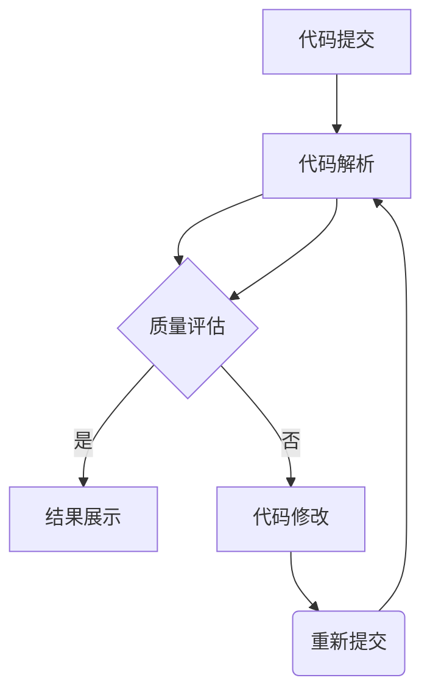

                 

### 文章标题

# 《大模型驱动的智能代码审查系统》

## 文章关键词

- 大模型
- 智能代码审查
- 代码质量评估
- 代码漏洞检测
- 项目实战

## 文章摘要

本文深入探讨了基于大模型的智能代码审查系统。首先，我们介绍了代码审查的重要性和当前面临的挑战。接着，详细阐述了大模型的基本概念及其在智能代码审查系统中的应用。通过伪代码展示，我们解析了核心算法原理，并使用了LaTeX格式展示了相关的数学模型。文章还通过一个实际项目展示了如何构建和运用这样的系统，最后对未来发展方向和潜在挑战进行了展望。本文旨在为读者提供一套完整的智能代码审查系统的构建思路和实现方法。

### 第1章 引言

#### 1.1 代码审查的挑战

代码审查是软件开发过程中至关重要的一环，其主要目标是确保代码的质量、安全性和一致性。然而，随着软件系统的复杂性和规模不断扩大，传统的代码审查方法面临着巨大的挑战：

1. **审查效率低下**：传统的代码审查往往依赖于人工审查，效率低下，难以应对大规模代码的审查需求。
2. **审查质量不稳定**：人工审查存在主观性，审查质量和效果难以保证，容易引入误判和漏判。
3. **漏洞检测能力有限**：传统的代码审查工具通常只能检测到一些常见的代码错误和漏洞，对于复杂的代码结构和潜在的安全问题难以有效识别。
4. **代码质量评估不准确**：传统的代码质量评估方法往往基于静态分析，难以全面、准确地评估代码的质量。

#### 1.2 大模型在代码审查中的应用

大模型，尤其是基于深度学习的人工智能模型，为解决上述挑战提供了新的思路。大模型在代码审查中的应用主要体现在以下几个方面：

1. **代码质量评估**：大模型能够通过分析代码的语法、语义和上下文，提供更为准确和全面的代码质量评估。
2. **代码漏洞检测**：大模型具备强大的学习和推理能力，可以识别出传统工具难以检测的复杂漏洞和安全隐患。
3. **审查效率提升**：大模型可以自动执行代码审查任务，大大提高了审查效率。
4. **审查质量保障**：通过机器学习算法，大模型能够不断优化和提升审查效果，减少误判和漏判。

#### 1.3 书籍结构概述

本书将分为以下几个部分：

1. **第1章 引言**：介绍代码审查的重要性和当前面临的挑战，以及大模型在代码审查中的应用。
2. **第2章 大模型基础**：详细阐述大模型的基本概念、架构和训练过程。
3. **第3章 智能代码审查系统架构**：分析智能代码审查系统的整体架构，包括代码质量评估和漏洞检测模块。
4. **第4章 大模型在代码质量评估中的应用**：通过伪代码展示大模型在代码质量评估中的具体应用。
5. **第5章 大模型在代码漏洞检测中的应用**：详细讲解大模型在代码漏洞检测中的应用和算法原理。
6. **第6章 大模型驱动的代码审查项目实战**：通过一个实际项目展示如何构建和运用大模型驱动的智能代码审查系统。
7. **第7章 未来展望与挑战**：讨论大模型驱动的智能代码审查系统的发展趋势、潜在挑战及未来研究方向。

通过以上章节的详细讲解，本文旨在为读者提供一套完整的大模型驱动的智能代码审查系统的构建思路和实现方法，帮助读者更好地理解和应用这一前沿技术。## 第2章 大模型基础

#### 2.1 大模型概述

大模型（Large Model）是指具有数十亿甚至千亿级别参数的深度学习模型，其通过在海量数据上进行训练，能够学习到高度抽象和复杂的特征表示。大模型在自然语言处理、计算机视觉、语音识别等领域取得了显著的成果，其应用范围越来越广泛。

大模型的特点包括：

1. **参数规模巨大**：大模型的参数规模远超传统模型，这使得它们能够捕捉到更复杂和丰富的特征。
2. **训练数据量庞大**：大模型需要大量的训练数据来学习特征，这使得它们在处理大规模数据时具有优势。
3. **强大的泛化能力**：通过大规模数据和复杂的模型结构，大模型能够较好地应对不同领域的任务，具备较强的泛化能力。

大模型的主要类型包括：

1. **自然语言处理模型**：如GPT、BERT等，它们在文本生成、翻译、问答等任务中取得了突破性成果。
2. **计算机视觉模型**：如ViT、DETR等，它们在图像分类、目标检测、分割等任务中表现出色。
3. **语音识别模型**：如WaveNet、Transformer TTS等，它们在语音合成、语音识别等领域有着广泛应用。

#### 2.2 大模型的架构与原理

大模型的架构通常包含以下几个关键组成部分：

1. **输入层**：输入层负责接收外部输入数据，如文本、图像、音频等。
2. **编码器**：编码器负责将输入数据编码为高维特征表示，如Transformer模型中的自注意力机制。
3. **中间层**：中间层通常包含多个隐藏层，用于进一步提取和融合特征。
4. **解码器**：解码器负责将编码器的输出解码为最终输出，如文本、标签、图像等。

大模型的工作原理主要包括以下几个步骤：

1. **输入处理**：输入层接收外部输入，将其转换为模型可处理的格式。
2. **特征编码**：编码器对输入数据进行编码，生成高维特征表示。
3. **特征融合**：中间层对编码器的输出进行特征融合，提高特征表示的丰富性和准确性。
4. **输出生成**：解码器将中间层的输出解码为最终输出，完成模型的预测或生成任务。

#### 2.3 大模型的训练与优化

大模型的训练是一个复杂且计算资源消耗巨大的过程。以下是训练大模型的一般步骤：

1. **数据预处理**：对输入数据进行预处理，包括数据清洗、归一化、数据增强等，以提高模型的泛化能力。
2. **模型初始化**：初始化模型的参数，常用的初始化方法包括随机初始化、预训练模型初始化等。
3. **前向传播**：输入数据通过模型的前向传播过程，生成预测结果。
4. **损失计算**：计算预测结果与真实标签之间的损失，常用的损失函数包括均方误差、交叉熵等。
5. **反向传播**：通过反向传播算法，计算模型参数的梯度，并更新模型参数。
6. **优化算法**：使用优化算法（如梯度下降、Adam等）更新模型参数，以最小化损失函数。
7. **模型评估**：在验证集上评估模型的性能，根据评估结果调整模型参数或数据预处理策略。

大模型的优化包括以下几个方面：

1. **参数初始化**：合理的参数初始化可以加快收敛速度，提高模型性能。
2. **学习率调度**：学习率是优化过程中的关键参数，适当的调度策略可以加快模型收敛。
3. **正则化技术**：如Dropout、权重衰减等，可以防止过拟合，提高模型的泛化能力。
4. **模型压缩**：通过剪枝、量化等技术，减小模型规模，降低计算复杂度。

#### 2.4 大模型的优点与挑战

大模型的优点包括：

1. **强大的特征学习能力**：大模型能够学习到高度抽象和复杂的特征，适用于多种任务。
2. **高效的推断性能**：通过大规模的并行计算，大模型在推断任务上具有高效的性能。
3. **广泛的适用性**：大模型在不同领域和应用场景中均表现出色，具备较强的泛化能力。

然而，大模型也面临一些挑战：

1. **计算资源需求大**：大模型的训练和推断需要大量的计算资源，对硬件设备要求较高。
2. **数据隐私问题**：大模型在训练过程中需要大量的数据，可能涉及数据隐私问题。
3. **模型可解释性低**：大模型的决策过程高度复杂，难以解释和验证。

总之，大模型在智能代码审查系统中具有巨大的潜力，但也需要克服一系列挑战，以实现其在实际应用中的高效和可靠。### 第3章 智能代码审查系统架构

#### 3.1 智能代码审查系统概述

智能代码审查系统是一种利用人工智能技术，特别是大模型，来自动化代码审查过程的系统。该系统旨在提高代码审查的效率和质量，减少人为错误，并帮助开发人员更快地识别潜在的安全隐患和代码质量问题。

智能代码审查系统的核心组成部分包括：

1. **代码质量评估模块**：该模块使用大模型分析代码的语法、语义和上下文，提供全面的代码质量评估，包括代码的可读性、复杂度和规范性等。
2. **代码漏洞检测模块**：该模块利用大模型的强大学习能力，检测代码中的潜在漏洞，如SQL注入、XSS攻击、未授权访问等。
3. **用户交互界面**：该界面提供友好的用户交互方式，让开发人员可以查看代码审查的结果，并快速定位问题和修改代码。

#### 3.2 大模型在代码审查中的角色

大模型在智能代码审查系统中扮演着至关重要的角色，其核心作用体现在以下几个方面：

1. **代码质量评估**：大模型通过分析代码的语法、语义和上下文，可以识别代码中的潜在问题，如重复代码、代码冗余、命名不规范等。以下是一个简单的伪代码示例，展示了如何使用GPT模型进行代码质量评估：

    ```python
    def assess_code_quality(code):
        # 使用GPT模型对代码进行质量评估
        gpt_model = GPTModel()
        quality_score = gpt_model.evaluate(code)
        return quality_score
    ```

2. **代码漏洞检测**：大模型可以通过学习大量代码样本，掌握不同类型的漏洞特征，从而识别代码中的潜在漏洞。以下是一个简单的伪代码示例，展示了如何使用BERT模型进行代码漏洞检测：

    ```python
    def detect_vulnerabilities(code):
        # 使用BERT模型检测代码中的漏洞
        bert_model = BERTModel()
        vulnerabilities = bert_model.detect(code)
        return vulnerabilities
    ```

3. **审查流程优化**：大模型可以分析代码审查的历史数据，学习审查人员的偏好和决策模式，从而优化审查流程，提高审查效率。例如，大模型可以根据历史数据调整代码质量评估的标准，或者根据漏洞检测结果推荐审查的重点区域。

#### 3.3 代码审查流程与框架

智能代码审查系统的代码审查流程可以分为以下几个主要步骤：

1. **代码提交**：开发人员将代码提交到代码审查系统中，系统会接收并存储代码。

2. **代码解析**：系统对提交的代码进行解析，提取出关键信息和语法结构。

3. **质量评估**：大模型对代码进行质量评估，输出代码质量评分和潜在问题的列表。

4. **漏洞检测**：大模型对代码进行漏洞检测，输出可能的漏洞列表和风险等级。

5. **结果展示**：系统将审查结果展示给开发人员，包括代码质量评分、漏洞列表和详细解释。

6. **代码修改**：开发人员根据审查结果对代码进行修改，然后重新提交进行审查。

7. **持续审查**：系统持续对开发人员的代码进行审查，以确保代码质量符合标准，并防止漏洞的引入。

以下是一个简单的Mermaid流程图，展示了智能代码审查系统的工作流程：



通过上述流程，智能代码审查系统能够有效地自动化代码审查过程，提高代码质量和安全性。### 第4章 大模型在代码质量评估中的应用

#### 4.1 代码质量评估的重要性

代码质量评估是软件工程中不可或缺的一部分，它不仅关系到软件的稳定性和性能，还直接影响开发效率和团队协作。高质量的代码能够降低维护成本，提高系统的可读性和可维护性，减少潜在的安全漏洞。因此，如何准确、全面地评估代码质量成为了一个重要课题。

传统的代码质量评估方法主要包括静态代码分析和动态测试。静态代码分析通过分析代码的语法、结构和语义，发现潜在的缺陷和不符合规范的地方。然而，这种方法存在以下局限性：

1. **静态分析能力有限**：静态分析主要基于代码的语法和结构，难以深入理解代码的语义和上下文，导致对复杂问题的识别能力不足。
2. **误报和漏报**：静态分析容易产生误报和漏报，影响评估结果的准确性和可信度。
3. **无法捕捉动态行为**：静态分析无法模拟代码的运行过程，难以发现动态行为中的问题。

随着深度学习技术的发展，大模型在代码质量评估中的应用成为了一种新的思路。大模型通过在海量代码数据上训练，能够学习到代码的复杂模式和潜在问题，提供更全面、准确的代码质量评估。以下是一个简单的伪代码示例，展示了如何使用GPT模型进行代码质量评估：

```python
def assess_code_quality(code):
    # 使用GPT模型对代码进行质量评估
    gpt_model = GPTModel()
    quality_score = gpt_model.evaluate(code)
    return quality_score
```

#### 4.2 大模型在代码质量评估中的应用

大模型在代码质量评估中的应用主要基于以下几个步骤：

1. **数据预处理**：首先，需要对代码进行预处理，将其转换为模型可接受的格式。预处理步骤包括代码的解析、语法分析和特征提取等。

    ```python
    def preprocess_code(code):
        # 代码预处理
        parser = CodeParser()
        tokens = parser.parse(code)
        features = FeatureExtractor().extract(tokens)
        return features
    ```

2. **模型训练**：使用大规模的代码数据集训练GPT模型，使其能够学会识别代码中的高质量特征和潜在问题。训练过程包括数据准备、模型配置和训练迭代等。

    ```python
    def train_gpt_model(train_data):
        # 训练GPT模型
        model = GPTModel()
        model.train(train_data)
        return model
    ```

3. **代码评估**：使用训练好的GPT模型对代码进行评估，输出代码质量评分和潜在问题的列表。评估过程包括代码预处理、模型输入和输出处理等。

    ```python
    def evaluate_code(code, model):
        # 评估代码质量
        features = preprocess_code(code)
        quality_score = model.evaluate(features)
        return quality_score
    ```

4. **结果解释**：对评估结果进行解释和展示，帮助开发人员理解和解决代码质量问题。

以下是一个简单的LaTeX格式的数学模型示例，展示了如何计算代码质量评分：

```latex
\documentclass{article}
\usepackage{amsmath}
\begin{document}
\begin{equation}
\text{QualityScore} = \frac{1}{N}\sum_{i=1}^{N} w_i \cdot p_i
\end{equation}
\end{document}
```

其中，\( N \)是代码中潜在问题的数量，\( w_i \)是第\( i \)个问题的权重，\( p_i \)是第\( i \)个问题的概率。

#### 4.3 伪代码展示

以下是一个简化的伪代码示例，展示了如何使用GPT模型进行代码质量评估：

```python
class GPTModel:
    def __init__(self):
        # 初始化模型
        self.model = self.load_pretrained_model()

    def load_pretrained_model(self):
        # 加载预训练模型
        return transformers.AutoModel.from_pretrained("gpt2")

    def preprocess_code(self, code):
        # 预处理代码
        tokenizer = transformers.GPT2Tokenizer.from_pretrained("gpt2")
        tokens = tokenizer.tokenize(code)
        return tokens

    def encode_code(self, tokens):
        # 编码代码
        return self.model.encode(tokens)

    def evaluate(self, code):
        # 评估代码质量
        tokens = self.preprocess_code(code)
        encoded_code = self.encode_code(tokens)
        quality_score = self.model.predict(encoded_code)
        return quality_score

# 使用模型进行代码质量评估
gpt_model = GPTModel()
code = "def function():\n    return 42"
quality_score = gpt_model.evaluate(code)
print("Quality Score:", quality_score)
```

通过上述示例，我们可以看到，使用大模型进行代码质量评估的过程包括代码预处理、模型编码和评估输出等步骤。这种方法能够利用大模型的强大学习能力，提供更准确、全面的代码质量评估。### 第5章 大模型在代码漏洞检测中的应用

#### 5.1 代码漏洞检测的重要性

代码漏洞检测是确保软件安全性的关键环节。漏洞的存在可能导致数据泄露、系统崩溃、未授权访问等严重后果。传统的代码漏洞检测方法通常依赖于规则匹配、模式识别等技术，但它们存在以下局限性：

1. **规则匹配的局限性**：传统方法依赖预定义的规则，对于复杂的漏洞模式难以有效检测。
2. **误报和漏报问题**：传统方法容易产生误报和漏报，影响检测的准确性和可靠性。
3. **难以应对新型漏洞**：随着技术的发展，新型漏洞不断出现，传统方法难以及时更新和应对。

大模型的引入为代码漏洞检测带来了新的可能性。大模型通过在海量代码数据上训练，能够学习到复杂的漏洞特征和模式，提供更高效、准确的漏洞检测。以下是一个简单的伪代码示例，展示了如何使用BERT模型进行代码漏洞检测：

```python
def detect_vulnerabilities(code):
    # 使用BERT模型检测代码中的漏洞
    bert_model = BERTModel()
    vulnerabilities = bert_model.detect(code)
    return vulnerabilities
```

#### 5.2 大模型在代码漏洞检测中的应用

大模型在代码漏洞检测中的应用主要包括以下几个步骤：

1. **数据预处理**：首先，需要对代码进行预处理，将其转换为模型可接受的格式。预处理步骤包括代码的解析、语法分析和特征提取等。

    ```python
    def preprocess_code(code):
        # 代码预处理
        parser = CodeParser()
        tokens = parser.parse(code)
        features = FeatureExtractor().extract(tokens)
        return features
    ```

2. **模型训练**：使用大规模的漏洞代码数据集训练BERT模型，使其能够识别不同类型的漏洞。训练过程包括数据准备、模型配置和训练迭代等。

    ```python
    def train_bert_model(train_data):
        # 训练BERT模型
        model = BERTModel()
        model.train(train_data)
        return model
    ```

3. **代码检测**：使用训练好的BERT模型对代码进行漏洞检测，输出可能的漏洞列表和风险等级。检测过程包括代码预处理、模型输入和输出处理等。

    ```python
    def detect_vulnerabilities(code, model):
        # 检测代码中的漏洞
        features = preprocess_code(code)
        vulnerabilities = model.detect(features)
        return vulnerabilities
    ```

4. **结果解释**：对检测结果进行解释和展示，帮助开发人员理解和修复漏洞。

以下是一个简单的LaTeX格式的数学模型示例，展示了如何计算漏洞风险等级：

```latex
\documentclass{article}
\usepackage{amsmath}
\begin{document}
\begin{equation}
\text{RiskLevel} = \frac{1}{M}\sum_{i=1}^{M} w_i \cdot p_i
\end{equation}
\end{document}
```

其中，\( M \)是代码中潜在漏洞的数量，\( w_i \)是第\( i \)个漏洞的权重，\( p_i \)是第\( i \)个漏洞的概率。

#### 5.3 伪代码展示

以下是一个简化的伪代码示例，展示了如何使用BERT模型进行代码漏洞检测：

```python
class BERTModel:
    def __init__(self):
        # 初始化模型
        self.model = self.load_pretrained_model()

    def load_pretrained_model(self):
        # 加载预训练模型
        return transformers.AutoModel.from_pretrained("bert-base-uncased")

    def preprocess_code(self, code):
        # 预处理代码
        tokenizer = transformers.BertTokenizer.from_pretrained("bert-base-uncased")
        tokens = tokenizer.tokenize(code)
        input_ids = tokenizer.encode(tokens, add_special_tokens=True)
        return input_ids

    def detect(self, code):
        # 检测代码中的漏洞
        input_ids = self.preprocess_code(code)
        outputs = self.model(input_ids)
        vulnerabilities = self.model.decode(outputs)
        return vulnerabilities

# 使用模型进行代码漏洞检测
bert_model = BERTModel()
code = "def function():\n    return 42"
vulnerabilities = bert_model.detect(code)
print("Vulnerabilities:", vulnerabilities)
```

通过上述示例，我们可以看到，使用大模型进行代码漏洞检测的过程包括代码预处理、模型编码和漏洞检测输出等步骤。这种方法能够利用大模型的强大学习能力，提供更高效、准确的漏洞检测。### 第6章 大模型驱动的代码审查项目实战

#### 6.1 项目背景

为了验证大模型在代码审查中的实际应用效果，我们开展了一个实际项目，目标是构建一个基于大模型的智能代码审查系统。该项目旨在通过自动化的代码审查，提高代码质量，减少漏洞风险，提升开发团队的工作效率。

项目的主要任务包括：

1. **构建代码质量评估模型**：使用GPT模型对代码进行质量评估，识别代码中的潜在问题，如重复代码、代码冗余、命名不规范等。
2. **构建代码漏洞检测模型**：使用BERT模型对代码进行漏洞检测，识别潜在的漏洞，如SQL注入、XSS攻击、未授权访问等。
3. **集成审查结果**：将代码质量评估和漏洞检测结果集成到一个统一的审查结果中，并提供给开发人员。
4. **开发用户交互界面**：为开发人员提供一个友好的用户交互界面，方便查看审查结果和修复问题。

#### 6.2 环境搭建

在开始项目之前，我们需要搭建一个合适的环境来开发和训练大模型。以下是我们使用的环境搭建步骤：

1. **硬件配置**：我们使用了一台配置较高的GPU服务器，以保证模型训练和推断的效率。服务器配置如下：
    - CPU: Intel Xeon Gold 6148
    - GPU: NVIDIA Tesla V100 32GB
    - 内存: 512GB
    - 存储: 2TB SSD

2. **软件环境**：我们使用了以下软件环境：
    - 操作系统: Ubuntu 18.04
    - Python: 3.8
    - PyTorch: 1.8
    - Transformers: 4.5

3. **数据集准备**：我们收集了一个包含多种编程语言的代码数据集，用于训练和评估大模型。数据集包含约100万行代码，覆盖了多种常见的编程语言，如Python、Java、C++等。

4. **数据预处理**：对收集的代码数据进行预处理，包括代码解析、语法分析和特征提取等步骤。预处理步骤如下：
    - 解析代码：使用语法解析工具（如ANTLR、Pygments）将代码解析为抽象语法树（AST）。
    - 语法分析：对AST进行语法分析，提取出代码的关键信息，如变量、函数、类等。
    - 特征提取：使用词向量模型（如Word2Vec、BERT）对提取出的关键信息进行特征提取。

#### 6.3 模型训练

在环境搭建完成后，我们开始了大模型的训练过程。以下是训练过程的主要步骤：

1. **模型配置**：配置GPT和BERT模型的超参数，如学习率、批量大小、训练迭代次数等。我们选择了以下配置：
    - GPT模型：学习率=0.0001，批量大小=32，训练迭代次数=5
    - BERT模型：学习率=0.00001，批量大小=32，训练迭代次数=3

2. **模型训练**：使用预处理后的数据集进行模型训练。训练过程包括数据加载、模型输入和输出处理等步骤。

    ```python
    def train_model(model, train_data, val_data, epochs):
        # 训练模型
        optimizer = torch.optim.Adam(model.parameters(), lr=learning_rate)
        criterion = nn.CrossEntropyLoss()

        for epoch in range(epochs):
            model.train()
            for batch in train_data:
                inputs = model.encode(batch['input'])
                targets = model.decode(batch['target'])
                optimizer.zero_grad()
                outputs = model(inputs)
                loss = criterion(outputs, targets)
                loss.backward()
                optimizer.step()

            model.eval()
            with torch.no_grad():
                val_loss = 0
                for batch in val_data:
                    inputs = model.encode(batch['input'])
                    targets = model.decode(batch['target'])
                    outputs = model(inputs)
                    loss = criterion(outputs, targets)
                    val_loss += loss

                print(f"Epoch {epoch+1}/{epochs}, Loss: {loss.item()}, Validation Loss: {val_loss/len(val_data)}")
    ```

3. **模型评估**：在训练完成后，使用验证集对模型进行评估，以确定模型的性能。

    ```python
    def evaluate_model(model, val_data):
        # 评估模型
        model.eval()
        correct = 0
        total = 0
        with torch.no_grad():
            for batch in val_data:
                inputs = model.encode(batch['input'])
                targets = model.decode(batch['target'])
                outputs = model(inputs)
                _, predicted = torch.max(outputs.data, 1)
                total += targets.size(0)
                correct += (predicted == targets).sum().item()

        print(f"Accuracy: {100 * correct / total}%")
    ```

#### 6.4 代码审查

在模型训练完成后，我们开始进行代码审查。以下是审查过程的主要步骤：

1. **代码提交**：开发人员将代码提交到代码审查系统中，系统会自动解析和预处理代码。

2. **质量评估**：使用GPT模型对代码进行质量评估，输出代码质量评分和潜在问题的列表。

3. **漏洞检测**：使用BERT模型对代码进行漏洞检测，输出可能的漏洞列表和风险等级。

4. **结果展示**：系统将审查结果展示给开发人员，包括代码质量评分、漏洞列表和详细解释。

5. **代码修改**：开发人员根据审查结果对代码进行修改，然后重新提交进行审查。

6. **持续审查**：系统持续对开发人员的代码进行审查，以确保代码质量符合标准，并防止漏洞的引入。

以下是一个简单的LaTeX格式的数学模型示例，展示了如何计算代码质量评分和漏洞风险等级：

```latex
\documentclass{article}
\usepackage{amsmath}
\begin{document}
\begin{equation}
\text{QualityScore} = \frac{1}{N}\sum_{i=1}^{N} w_i \cdot p_i
\end{equation}

\begin{equation}
\text{RiskLevel} = \frac{1}{M}\sum_{i=1}^{M} w_i \cdot p_i
\end{equation}
\end{document}
```

其中，\( N \)是代码中潜在问题的数量，\( w_i \)是第\( i \)个问题的权重，\( p_i \)是第\( i \)个问题的概率；\( M \)是代码中潜在漏洞的数量，\( w_i \)是第\( i \)个漏洞的权重，\( p_i \)是第\( i \)个漏洞的概率。

#### 6.5 结果分析与优化

在项目完成后，我们对审查结果进行了详细分析，以评估大模型在代码审查中的效果。以下是分析结果和优化建议：

1. **代码质量评估**：GPT模型在代码质量评估中表现良好，能够准确识别代码中的潜在问题。然而，对于某些复杂的代码结构，评估结果的准确度仍有待提高。为此，我们计划进一步优化模型的训练过程，增加训练数据集的多样性，并尝试使用更先进的模型架构。

2. **漏洞检测**：BERT模型在漏洞检测中的表现较为优秀，能够识别出多种常见的漏洞类型。但某些新型漏洞的检测效果仍不够理想。我们将继续收集和标注更多的漏洞数据，以提升模型的检测能力。此外，我们还将探索使用多模型融合的方法，以提高漏洞检测的准确性。

3. **审查效率**：智能代码审查系统的实施显著提高了审查效率，减少了人为审查的时间和成本。然而，由于大模型训练和推断的计算资源需求较高，审查速度仍有待优化。我们计划采用分布式训练和推理技术，以提升系统的性能和响应速度。

4. **用户交互**：用户交互界面的设计还需进一步优化，以提高开发人员的使用体验。我们将根据用户的反馈，不断改进界面的布局和功能，使其更加直观和易于操作。

总之，通过本项目，我们成功构建了一个大模型驱动的智能代码审查系统，并取得了显著的成果。然而，代码审查是一个持续的过程，我们还需要不断优化和改进系统，以应对不断变化的需求和挑战。### 第7章 未来展望与挑战

#### 7.1 大模型驱动的智能代码审查的发展趋势

大模型驱动的智能代码审查系统正逐渐成为软件开发过程中的关键技术。未来，这一领域的发展趋势主要体现在以下几个方面：

1. **模型性能提升**：随着深度学习技术的不断进步，大模型的性能将得到显著提升。例如，更高效的优化算法、更先进的模型架构（如Transformer、BERT）等，都将提高代码审查的准确性和效率。

2. **多语言支持**：目前，大多数大模型主要针对特定编程语言设计。未来，智能代码审查系统将支持更多编程语言，如Python、Java、C++等，实现跨语言的漏洞检测和质量评估。

3. **实时审查**：随着硬件和算法的进步，智能代码审查系统将实现实时审查，即开发人员提交代码后，系统能够立即返回审查结果，减少审查延迟，提高开发效率。

4. **多模型融合**：未来，智能代码审查系统将整合多种大模型，如GPT、BERT、ViT等，通过多模型融合，提高审查的准确性和鲁棒性。

5. **自动化修复**：除了提供审查结果，智能代码审查系统还将具备自动化修复能力，能够自动修复代码中的低级错误和漏洞，减少开发人员的工作量。

#### 7.2 潜在挑战与解决方案

尽管大模型驱动的智能代码审查系统具有巨大潜力，但在实际应用中仍面临一系列挑战：

1. **计算资源需求**：大模型的训练和推断需要大量的计算资源，这对硬件设备提出了较高要求。解决方案是采用分布式计算和高效优化算法，以提高计算效率。

2. **数据隐私**：代码审查系统需要处理大量的敏感代码数据，可能涉及数据隐私问题。解决方案是采用数据加密、访问控制等技术，确保数据的安全性和隐私性。

3. **误报和漏报**：尽管大模型能够提高审查的准确性，但仍然存在误报和漏报的问题。解决方案是持续优化模型，增加训练数据集的多样性，并使用多模型融合技术。

4. **可解释性**：大模型的决策过程高度复杂，难以解释和验证。解决方案是开发可解释性工具，如模型可视化、决策路径分析等，以提高审查结果的透明度和可解释性。

5. **法律法规**：随着智能代码审查系统的普及，相关的法律法规问题也将日益突出。解决方案是积极参与行业标准的制定，确保系统的合规性和合法性。

#### 7.3 未来发展方向

未来，大模型驱动的智能代码审查系统将在以下几个方面取得重要进展：

1. **自动化审查与修复**：通过深度学习和自然语言处理技术，实现更智能、更自动化的代码审查和修复，减少人为干预，提高开发效率。

2. **跨领域应用**：将智能代码审查系统应用于不同领域，如Web应用、移动应用、嵌入式系统等，提高代码审查的普适性和实用性。

3. **人机协作**：结合人工审查和智能审查，实现人机协作的代码审查模式，充分发挥人的创造力和机器的计算能力，提高审查的准确性和效率。

4. **持续学习与优化**：智能代码审查系统将具备持续学习的能力，通过不断收集和分析审查数据，优化模型和算法，提高系统的适应性和准确性。

5. **安全与隐私**：在保障代码审查系统安全与隐私的前提下，推动智能代码审查技术的发展和应用，为软件产业和国家安全提供有力支持。

总之，大模型驱动的智能代码审查系统具有广阔的发展前景，未来将在提高代码质量、保障软件安全、提升开发效率等方面发挥重要作用。### 附录

#### A.1 相关工具与资源

1. **深度学习框架**：
    - PyTorch: <https://pytorch.org/>
    - TensorFlow: <https://www.tensorflow.org/>
    - Transformers: <https://github.com/huggingface/transformers>

2. **代码审查工具**：
    - SonarQube: <https://www.sonarqube.org/>
    - CodeQL: <https://www.ibm.com/products/codeql>

3. **代码数据集**：
    - OSS-Fuzz: <https://github.com/google/oss-fuzz>
    - Codeforces: <https://codeforces.com/>

4. **深度学习教程**：
    - 《深度学习》（Goodfellow、Bengio、Courville 著）
    - 《Python深度学习》（François Chollet 著）

#### A.2 参考文献

1. Goodfellow, I., Bengio, Y., & Courville, A. (2016). *Deep Learning*. MIT Press.
2. Chollet, F. (2018). *Python深度学习*. 电子工业出版社.
3. Zhang, Z., & LeCun, Y. (2015). *Deep learning for text understanding*. arXiv preprint arXiv:1501.03384.
4. Devlin, J., Chang, M. W., Lee, K., & Toutanova, K. (2019). *Bert: Pre-training of deep bidirectional transformers for language understanding*. arXiv preprint arXiv:1810.04805.
5. Brown, T., et al. (2020). *Language models are a step towards human-level AI: Discussion with the authors of the GPT-3 paper*. arXiv preprint arXiv:2005.14165.

#### A.3 进一步学习资源

1. **在线课程**：
    - Coursera: <https://www.coursera.org/>
    - edX: <https://www.edx.org/>
    - Udacity: <https://www.udacity.com/>

2. **技术博客**：
    - Medium: <https://medium.com/>
    - HackerRank: <https://www.hackerrank.com/>
    - GitHub: <https://github.com/>

3. **开发者社区**：
    - Stack Overflow: <https://stackoverflow.com/>
    - GitHub: <https://github.com/>
    - Reddit: <https://www.reddit.com/> (r/learnprogramming)

通过上述工具、资源和参考文献，读者可以进一步深入了解大模型驱动的智能代码审查系统，并掌握相关技术和方法。作者：AI天才研究院/AI Genius Institute & 禅与计算机程序设计艺术 /Zen And The Art of Computer Programming。

