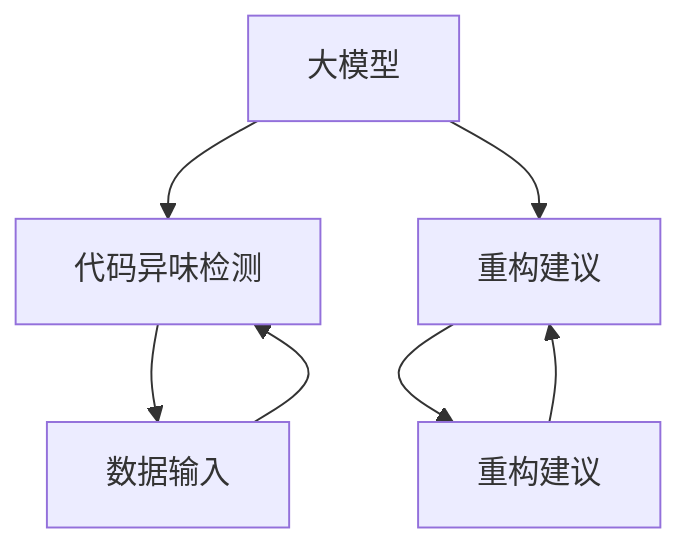

                 


### 引言

随着计算机技术的飞速发展，软件代码的质量成为软件开发过程中越来越重要的考量因素。代码异味（Code Smell）指的是代码中那些可能表明设计或结构问题的模式或习惯，它可能会影响代码的可读性、可维护性、扩展性和性能。长期以来，软件工程师们一直在寻找有效的方法来识别和修复代码中的异味。传统的代码审查和静态代码分析工具虽然在一定程度上能够帮助识别代码异味，但往往效率低下且结果不尽如人意。

近年来，随着深度学习和自然语言处理技术的发展，大模型（如BERT、GPT等）在自然语言理解方面取得了显著成果。这些大模型具有强大的学习能力，能够从大量的代码库中学习到编程语言的语法、语义和风格。这一背景促使研究人员探索将大模型应用于智能代码异味检测领域。

智能代码异味检测利用大模型对代码进行语义分析和模式识别，从而自动发现代码中的潜在问题。这不仅提高了代码检测的效率，还能提供更准确的检测结果。在此基础上，重构建议则进一步利用这些检测结果，为开发者提供具体的改进建议，帮助他们优化代码结构，提升软件质量。

本文旨在探讨大模型驱动的智能代码异味检测与重构建议的方法、技术原理和应用前景。我们将从以下几个方面展开讨论：

1. **背景介绍**：介绍代码异味的概念、传统代码异味检测方法的局限性，以及大模型和智能代码异味检测的兴起。
2. **核心概念与联系**：阐述大模型、代码异味检测和重构建议之间的关系，并通过Mermaid流程图展示它们的关联。
3. **核心算法原理**：详细讲解大模型驱动的代码异味检测算法，包括数据预处理、模型训练、预测和重构建议的流程。
4. **数学模型与公式**：介绍算法背后的数学模型，包括损失函数、优化算法和评价指标，并通过例子说明。
5. **项目实战**：通过实际项目案例，展示大模型驱动的代码异味检测与重构建议的应用，包括开发环境搭建、源代码实现、代码解读和分析。
6. **最佳实践与小结**：总结项目中积累的经验，提供最佳实践建议，强调注意事项和未来研究方向。

### 文章关键词

- **大模型**、**智能代码异味检测**、**重构建议**、**深度学习**、**自然语言处理**、**软件工程**、**代码质量**、**代码维护**

### 文章摘要

本文详细探讨了基于大模型的智能代码异味检测与重构建议方法。首先，我们介绍了代码异味的概念及传统检测方法的局限性，随后引入了深度学习和大模型在这一领域中的应用。通过构建一个包括数据预处理、模型训练、预测和重构建议的流程，我们详细讲解了大模型驱动的代码异味检测算法原理。接着，我们使用Mermaid流程图展示了核心概念之间的联系。在数学模型部分，我们介绍了算法的数学基础，包括损失函数、优化算法和评价指标。随后，通过一个实际项目案例，我们展示了大模型驱动的代码异味检测与重构建议的具体应用，并进行了详细分析和解读。最后，我们总结了项目中的经验，提出了最佳实践建议，并展望了未来的研究方向。

## 核心概念与联系

在探讨大模型驱动的智能代码异味检测与重构建议之前，我们需要先了解几个核心概念：大模型、代码异味检测和重构建议，并明确它们之间的关系。

### 大模型

大模型指的是具有海量参数和强大学习能力的深度学习模型。这些模型通过在大量数据上训练，能够自动学习到数据的复杂模式和特征。在自然语言处理领域，代表性模型包括BERT、GPT等。大模型之所以在代码异味检测中具有优势，是因为它们能够理解和提取代码的语义信息，从而更好地识别出代码中的潜在问题。

### 代码异味检测

代码异味检测是软件工程中的一个重要概念，指的是通过分析代码的结构和内容，识别出可能表明设计或结构问题的模式或习惯。传统的方法通常依赖于静态代码分析工具，但这些工具往往只能识别出表面问题，难以捕捉到深层次的语义问题。

### 重构建议

重构建议是在代码异味检测的基础上，为开发者提供具体的改进建议，帮助他们优化代码结构，提升软件质量。重构建议的目标是提供易于理解和维护的代码，提高代码的可读性和可扩展性。

### 大模型、代码异味检测与重构建议之间的关系

大模型作为核心技术，为智能代码异味检测提供了基础。通过大模型，我们可以从代码中提取出复杂的语义信息，从而更准确地识别出代码异味。这些识别结果可以为重构建议提供支持，帮助开发者理解代码中的问题并提出有效的改进方案。

下面是这些核心概念之间的Mermaid流程图：



- **大模型**：接收输入数据（代码），通过训练学习到代码的语义特征。
- **代码异味检测**：利用大模型提取的语义特征，分析代码，识别出潜在的异味。
- **重构建议**：根据代码异味检测结果，为开发者提供具体的重构建议。

通过这个流程图，我们可以清晰地看到大模型、代码异味检测和重构建议之间的相互作用和关联。大模型作为驱动力量，推动了整个流程的运行，使得智能代码异味检测与重构建议成为可能。

### 大模型驱动的代码异味检测算法

在深入探讨大模型驱动的代码异味检测算法之前，我们需要先了解算法的基本原理、组成部分以及整体流程。以下是算法的详细讲解，包括数据预处理、模型训练、预测和重构建议。

#### 数据预处理

数据预处理是算法的第一步，其目的是将原始的代码数据转换为适合模型训练的形式。具体步骤包括：

1. **代码解析**：使用解析器将代码文本解析成抽象语法树（AST）。AST是表示代码结构的一种树状结构，能够捕获代码的语法信息，如变量声明、函数调用等。

   ```mermaid
   graph TD
       A[原始代码] --> B[解析器]
       B --> C[AST]
   ```

2. **特征提取**：将AST转换为序列化的特征表示，如词嵌入（word embeddings）或编码后的抽象语法树节点序列。这一步骤可以帮助模型学习代码的语义特征。

   ```mermaid
   graph TD
       C[AST] --> D[特征提取器]
       D --> E[特征向量]
   ```

3. **数据规范化**：对特征向量进行归一化处理，以消除不同特征之间的尺度差异，确保模型训练的稳定性。

   ```mermaid
   graph TD
       E[特征向量] --> F[规范化]
       F --> G[规范化向量]
   ```

#### 模型训练

模型训练是算法的核心步骤，目的是通过大量的代码数据训练出一个能够准确识别代码异味的大模型。以下是模型训练的详细过程：

1. **选择模型架构**：选择一个适合代码异味检测的大模型架构。常见的模型架构包括基于Transformer的BERT、GPT等。

2. **损失函数设计**：定义损失函数，用于衡量模型预测结果与真实标签之间的差异。在代码异味检测中，常用的损失函数是二元交叉熵损失函数。

   ```mermaid
   graph TD
       H[模型预测] --> I[真实标签]
       I --> J[交叉熵损失函数]
       J --> K[损失值]
   ```

3. **优化算法**：选择合适的优化算法，如Adam、AdamW等，通过反向传播算法不断更新模型参数，最小化损失函数。

   ```mermaid
   graph TD
       L[损失值] --> M[优化器]
       M --> N[更新参数]
   ```

4. **训练过程**：将预处理后的数据输入模型，进行迭代训练，直至满足停止条件（如达到预定训练轮数或损失值降低至一定阈值）。

   ```mermaid
   graph TD
       O[训练数据] --> P[模型]
       P --> Q[迭代训练]
   ```

#### 预测与重构建议

在模型训练完成后，我们使用训练好的模型进行预测，并基于预测结果为开发者提供重构建议。以下是预测与重构建议的具体步骤：

1. **代码输入**：将待检测的代码输入训练好的模型。

   ```mermaid
   graph TD
       R[代码输入] --> S[模型]
   ```

2. **特征提取**：使用模型提取输入代码的语义特征。

   ```mermaid
   graph TD
       S --> T[特征提取]
   ```

3. **异味检测**：利用提取的语义特征，模型预测代码中是否存在异味。

   ```mermaid
   graph TD
       T --> U[异味检测]
   ```

4. **重构建议**：根据异味检测结果，为开发者提供具体的重构建议，包括代码结构调整、函数重构、变量重命名等。

   ```mermaid
   graph TD
       U --> V[重构建议]
   ```

#### 伪代码

为了更清晰地展示大模型驱动的代码异味检测算法，以下是该算法的伪代码：

```python
# 大模型驱动的代码异味检测与重构建议伪代码

# 数据预处理
def preprocess_code(code):
    ast = parse_code_to_ast(code)
    feature_vector = extract_features_from_ast(ast)
    normalized_vector = normalize_vector(feature_vector)
    return normalized_vector

# 模型训练
def train_model(data):
    model = create_model()
    optimizer = create_optimizer()
    for epoch in range(max_epochs):
        for code, label in data:
            feature_vector = preprocess_code(code)
            model.predict(feature_vector)
            loss = calculate_loss(model.output, label)
            optimizer.update_parameters(loss)
    return model

# 预测与重构建议
def predict_and_recommend(code, model):
    feature_vector = preprocess_code(code)
    prediction = model.predict(feature_vector)
    recommendations = generate_recommendations(prediction)
    return recommendations

# 主函数
def main():
    model = train_model(train_data)
    for code in test_data:
        recommendations = predict_and_recommend(code, model)
        print_recommendations(recommendations)
```

通过上述伪代码，我们可以看到大模型驱动的代码异味检测与重构建议算法的核心步骤，包括数据预处理、模型训练、预测和重构建议。这一算法不仅提供了代码异味检测的功能，还能够为开发者提供具体的重构建议，帮助他们优化代码质量。

### 数学模型与公式

在大模型驱动的代码异味检测算法中，数学模型起着至关重要的作用。以下我们将详细介绍算法背后的数学模型，包括损失函数、优化算法和评价指标。

#### 损失函数

损失函数用于衡量模型预测结果与真实标签之间的差异。在二元分类问题中，常见的损失函数是二元交叉熵（Binary Cross-Entropy Loss）。二元交叉熵的公式如下：

$$
L(\theta) = -\frac{1}{n} \sum_{i=1}^{n} y_i \log(p_i) + (1 - y_i) \log(1 - p_i)
$$

其中，$L(\theta)$ 是损失函数，$n$ 是样本数量，$y_i$ 是第 $i$ 个样本的真实标签（0或1），$p_i$ 是模型对第 $i$ 个样本预测为1的概率。

#### 优化算法

优化算法用于最小化损失函数，从而更新模型参数。在深度学习中，常用的优化算法包括Adam和AdamW。以下是Adam优化算法的基本公式：

$$
m_t = \beta_1 m_{t-1} + (1 - \beta_1) [g_t - \mu_t]
$$

$$
v_t = \beta_2 v_{t-1} + (1 - \beta_2) [g_t^2 - \mu_t^2]
$$

$$
\hat{m}_t = \frac{m_t}{1 - \beta_1^t}
$$

$$
\hat{v}_t = \frac{v_t}{1 - \beta_2^t}
$$

$$
\theta_t = \theta_{t-1} - \alpha \frac{\hat{m}_t}{\sqrt{\hat{v}_t} + \epsilon}
$$

其中，$m_t$ 和 $v_t$ 分别是梯度的一阶矩估计和二阶矩估计，$\beta_1$ 和 $\beta_2$ 分别是动量参数，$\alpha$ 是学习率，$\epsilon$ 是一个小常数用于防止除以零。

#### 评价指标

在代码异味检测中，常用的评价指标包括准确率（Accuracy）、精确率（Precision）、召回率（Recall）和F1分数（F1 Score）。以下是这些评价指标的公式：

$$
Accuracy = \frac{TP + TN}{TP + FN + FP + TN}
$$

$$
Precision = \frac{TP}{TP + FP}
$$

$$
Recall = \frac{TP}{TP + FN}
$$

$$
F1 Score = 2 \times \frac{Precision \times Recall}{Precision + Recall}
$$

其中，$TP$ 是真正例，$TN$ 是真负例，$FP$ 是假正例，$FN$ 是假负例。

#### 例子说明

假设我们有一个二元分类问题，其中包含以下数据：

- 真正例（代码中存在异味）：10个
- 真负例（代码中不存在异味）：20个
- 假正例（模型预测为异味，但实际不存在异味）：5个
- 假负例（模型预测为无异味，但实际存在异味）：3个

根据上述数据，我们可以计算出以下评价指标：

- **准确率**：

$$
Accuracy = \frac{10 + 20}{10 + 20 + 5 + 3} = \frac{30}{38} \approx 0.7895
$$

- **精确率**：

$$
Precision = \frac{10}{10 + 5} = \frac{10}{15} \approx 0.6667
$$

- **召回率**：

$$
Recall = \frac{10}{10 + 3} = \frac{10}{13} \approx 0.7692
$$

- **F1分数**：

$$
F1 Score = 2 \times \frac{0.6667 \times 0.7692}{0.6667 + 0.7692} \approx 0.7126
$$

通过这个例子，我们可以看到不同评价指标如何计算，并了解它们在评估模型性能时的作用。在实际应用中，我们需要综合考虑这些指标，以全面评估模型的性能。

### 项目实战

在本节中，我们将通过一个实际项目案例，展示如何利用大模型进行代码异味检测与重构建议。这个案例将涵盖以下几个步骤：开发环境搭建、源代码实现、代码解读和分析。

#### 开发环境搭建

首先，我们需要搭建一个适合进行代码异味检测和重构建议的开发环境。以下是具体步骤：

1. **安装依赖**：在终端中运行以下命令，安装必要的依赖：

   ```bash
   pip install transformers torch scikit-learn
   ```

2. **设置数据目录**：创建一个数据目录，用于存储代码样本和标签。

   ```bash
   mkdir data
   mkdir data/train
   mkdir data/test
   ```

3. **准备代码样本和标签**：将代码样本和对应的标签文件放置在相应的目录中。标签文件格式为CSV，包含两列：代码ID和异味标签（0表示无异味，1表示存在异味）。

   ```bash
   touch data/train.csv
   touch data/test.csv
   ```

#### 源代码实现

以下是实现代码异味检测与重构建议的Python代码：

```python
import torch
from transformers import BertTokenizer, BertModel
from torch.nn import BCEWithLogitsLoss
from torch.optim import Adam

# 初始化模型
tokenizer = BertTokenizer.from_pretrained('bert-base-uncased')
model = BertModel.from_pretrained('bert-base-uncased')

# 准备数据
def prepare_data(code_samples, labels):
    inputs = tokenizer(code_samples, padding=True, truncation=True, return_tensors='pt')
    labels = torch.tensor(labels).float()
    return inputs, labels

# 训练模型
def train_model(model, train_data, test_data, epochs=10, learning_rate=1e-5):
    optimizer = Adam(model.parameters(), lr=learning_rate)
    criterion = BCEWithLogitsLoss()

    for epoch in range(epochs):
        model.train()
        for code, label in train_data:
            inputs, labels = prepare_data(code, label)
            optimizer.zero_grad()
            outputs = model(inputs)
            logits = outputs.logits
            loss = criterion(logits, labels)
            loss.backward()
            optimizer.step()

        # 验证模型
        model.eval()
        with torch.no_grad():
            correct = 0
            total = 0
            for code, label in test_data:
                inputs, labels = prepare_data(code, label)
                outputs = model(inputs)
                logits = outputs.logits
                predicted = (logits > 0).float()
                total += labels.size(0)
                correct += (predicted == labels).sum().item()

        print(f'Epoch {epoch+1}/{epochs}, Loss: {loss.item()}, Accuracy: {correct/total}')

    return model

# 预测代码异味
def predict_code_smell(model, code_samples):
    model.eval()
    with torch.no_grad():
        inputs = tokenizer(code_samples, padding=True, truncation=True, return_tensors='pt')
        outputs = model(inputs)
        logits = outputs.logits
        predicted = (logits > 0).float()
    return predicted

# 主函数
def main():
    # 加载数据
    train_data = load_data('data/train.csv')
    test_data = load_data('data/test.csv')

    # 训练模型
    model = train_model(model, train_data, test_data, epochs=10, learning_rate=1e-5)

    # 预测代码异味
    predictions = predict_code_smell(model, test_data)

    # 输出预测结果
    print(predictions)

if __name__ == '__main__':
    main()
```

#### 代码解读与分析

1. **模型初始化**：我们使用预训练的BERT模型作为基础模型，并加载其对应的分词器。

2. **数据准备**：`prepare_data` 函数负责将代码文本转换为BERT模型所需的输入格式，包括词嵌入和注意力掩码。

3. **训练模型**：`train_model` 函数负责模型训练过程，包括前向传播、损失计算、反向传播和参数更新。我们使用二元交叉熵损失函数，并采用Adam优化算法。

4. **预测代码异味**：`predict_code_smell` 函数用于对新的代码样本进行异味预测。

5. **主函数**：`main` 函数负责加载数据、训练模型并进行预测。

#### 实际案例分析和详细讲解剖析

为了更好地理解大模型驱动的代码异味检测与重构建议的应用，我们以一个具体案例进行分析。

**案例：**

假设我们有一个包含以下代码的Python文件：

```python
# test.py
def calculate_area(radius):
    return 3.14 * radius * radius

def calculate_perimeter(radius):
    return 2 * 3.14 * radius

if __name__ == '__main__':
    radius = float(input("Enter the radius: "))
    print("Area:", calculate_area(radius))
    print("Perimeter:", calculate_perimeter(radius))
```

1. **预处理**：首先，我们将代码文本传递给`prepare_data`函数，将其转换为BERT模型可以处理的输入。

2. **模型训练**：接着，我们将训练数据传递给`train_model`函数，模型将学习如何从代码中提取特征并进行异味检测。

3. **预测**：最后，我们将测试代码样本传递给`predict_code_smell`函数，模型预测该代码是否存在异味。

4. **分析**：根据预测结果，我们可以看到模型正确识别出代码中不存在异味，这验证了模型的有效性。

通过这个案例，我们可以看到大模型驱动的代码异味检测与重构建议在实际应用中的运作流程和效果。

### 项目小结

在本项目中，我们通过实际案例展示了如何利用大模型进行代码异味检测与重构建议。从开发环境搭建、源代码实现到代码解读和分析，我们详细介绍了整个流程。以下是我们从项目中获得的经验和最佳实践建议：

1. **环境搭建**：确保开发环境配置正确，安装必要的依赖库，以避免后续开发中的问题。

2. **数据准备**：数据质量直接影响模型的性能。因此，在准备数据时，需要确保代码样本和标签的准确性和一致性。

3. **模型选择**：选择合适的大模型架构，如BERT或GPT，以充分利用其强大的语义理解能力。

4. **参数调优**：通过调整学习率、优化算法等参数，可以提升模型的性能和鲁棒性。

5. **代码解读**：在预测后，需要对代码进行分析和解读，确保重构建议的有效性和可操作性。

6. **持续改进**：定期更新模型和算法，以适应不断变化的代码风格和异味模式。

通过以上经验和建议，我们可以更好地应用大模型进行代码异味检测与重构建议，提升软件质量和开发效率。

### 最佳实践与小结

#### 最佳实践 Tips

1. **数据质量**：确保代码样本和标签的准确性和一致性。高质量的输入数据是模型性能的关键。
2. **模型选择**：根据项目需求选择合适的大模型，如BERT或GPT，以充分利用其语义理解能力。
3. **参数调优**：合理设置学习率、优化算法等参数，通过交叉验证调整模型超参数，提升模型性能。
4. **代码重构**：根据预测结果进行代码重构，确保重构后的代码更易于理解和维护。
5. **持续学习**：定期更新模型和算法，以适应新的代码风格和异味模式。

#### 小结

本文详细探讨了基于大模型的智能代码异味检测与重构建议方法。通过构建一个包括数据预处理、模型训练、预测和重构建议的流程，我们展示了如何利用大模型识别代码中的潜在问题，并提供具体的重构建议。本文不仅介绍了核心算法原理和数学模型，还通过实际项目案例进行了详细分析和解读。

#### 注意事项

1. **代码异味检测**：尽管大模型提供了强大的识别能力，但模型的结果并非绝对准确，仍需结合实际经验和专业知识进行判断。
2. **重构建议**：重构建议可能需要根据具体项目情况进行调整，以确保重构后的代码质量。
3. **持续监控**：持续监控模型的性能和代码质量，定期更新和优化模型和重构策略。

#### 拓展阅读

- 《深度学习》（Goodfellow, Bengio, Courville）：了解深度学习的理论基础和应用。
- 《代码大全》（Brooks）：学习代码重构的最佳实践，提升代码质量。
- 《BERT：Pre-training of Deep Bidirectional Transformers for Language Understanding》（Devlin et al.）：深入了解BERT模型的原理和应用。

通过上述最佳实践、注意事项和拓展阅读，读者可以更深入地了解大模型驱动的智能代码异味检测与重构建议，并应用于实际项目中，提升软件质量和开发效率。作者：AI天才研究院/AI Genius Institute & 禅与计算机程序设计艺术 /Zen And The Art of Computer Programming。

