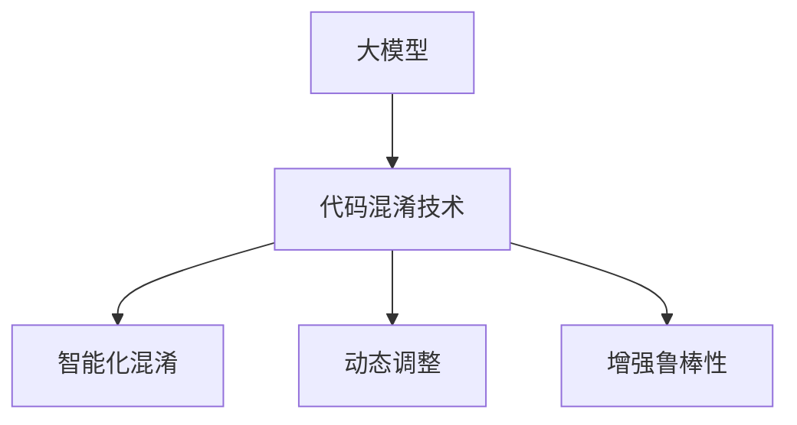

                 

### 文章标题

《大模型驱动的智能代码混淆技术》

---

关键词：大模型、代码混淆、智能化、算法原理、数学模型、项目实战

---

摘要：本文深入探讨了基于大模型驱动的智能代码混淆技术。首先介绍了大模型的基本概念及其与代码混淆技术的关联，然后详细讲解了大模型的构建、训练和应用。随后，文章阐述了代码混淆技术的核心原理，并使用伪代码和数学公式进行了详细解释。文章还通过一个实际项目，展示了大模型驱动的智能代码混淆技术的开发过程和实现细节，最后总结了最佳实践和未来发展方向。

---

## 第1章：核心概念与联系

在这一章中，我们将介绍大模型、代码混淆技术以及它们之间的关联。首先，我们需要明确几个核心概念的定义。

### 1.1 大模型

大模型，通常指的是拥有巨大参数量的神经网络模型。这些模型通过学习大量数据，能够实现复杂的任务，如自然语言处理、计算机视觉等。大模型的核心在于其强大的表示能力和泛化能力。

### 1.2 代码混淆技术

代码混淆技术是一种将源代码转换为难以阅读但功能相同的代码的技术。它的目的是为了防止他人轻易理解和篡改代码。代码混淆技术广泛应用于保护软件知识产权和提升软件安全性。

### 1.3 大模型与代码混淆技术的联系

大模型在代码混淆技术中具有重要应用。通过大模型，我们可以实现更加智能化的代码混淆。具体来说，大模型可以帮助我们：

1. **自动生成混淆代码**：大模型能够根据源代码生成等效的混淆代码，避免了手动混淆的繁琐过程。
2. **动态调整混淆策略**：大模型可以根据代码的具体结构和特点，动态调整混淆策略，从而提高混淆效果。
3. **增强混淆代码的鲁棒性**：大模型可以学习到代码的内在逻辑和结构，生成的混淆代码在保证功能不变的前提下，更难以被破解。

### 1.4 Mermaid流程图

为了更直观地展示大模型与代码混淆技术的联系，我们使用Mermaid流程图来表示其关系。



## 第2章：大模型原理讲解

在本章节中，我们将详细讲解大模型的构建、训练和应用。

### 2.1 大模型的构建

构建大模型的第一步是选择合适的架构。常见的大模型架构包括Transformer、BERT和GPT等。以下是一个简单的构建大模型的伪代码：

```python
# 选择大模型架构
model_architecture = "Transformer"

# 加载预训练模型参数
model.load_pretrained_weights()

# 定义优化器
optimizer = torch.optim.Adam(model.parameters(), lr=learning_rate)

# 定义损失函数
criterion = torch.nn.CrossEntropyLoss()
```

### 2.2 大模型的训练

大模型的训练过程涉及大量的数据和计算资源。以下是一个简单的训练大模型的伪代码：

```python
# 加载数据集
train_loader = DataLoader(dataset, batch_size=batch_size, shuffle=True)

# 训练大模型
for epoch in range(num_epochs):
    for inputs, labels in train_loader:
        optimizer.zero_grad()
        outputs = model(inputs)
        loss = criterion(outputs, labels)
        loss.backward()
        optimizer.step()
```

### 2.3 大模型的应用

大模型的应用非常广泛，包括但不限于自然语言处理、计算机视觉和代码生成等。以下是一个简单的应用大模型的伪代码：

```python
# 应用大模型进行代码混淆
def apply_model(model, code):
    # 加载大模型
    model.load()

    # 输入源代码
    inputs = code

    # 进行代码混淆
    outputs = model(inputs)

    # 输出混淆代码
    return outputs
```

## 第3章：数学模型与公式

在本章节中，我们将详细讲解大模型和代码混淆技术的数学模型，并使用数学公式进行详细解释。

### 3.1 大模型的数学模型

大模型通常使用神经网络来表示。以下是一个简单的神经网络模型：

$$
\text{output} = \sigma(\text{weight} \cdot \text{input} + \text{bias})
$$

其中，$\sigma$表示激活函数，$\text{weight}$和$\text{bias}$分别为权重和偏置。

### 3.2 代码混淆技术的数学模型

代码混淆技术通常使用代码变换来表示。以下是一个简单的代码变换：

$$
\text{output\_code} = \text{code} \oplus \text{key}
$$

其中，$\oplus$表示代码变换操作，$\text{key}$为混淆密钥。

### 3.3 数学公式的详细讲解与举例说明

为了更好地理解上述数学公式，我们通过一个简单的例子进行讲解。

假设我们有以下源代码：

```python
x = 5
y = x * 2
```

我们可以使用神经网络模型对其进行混淆：

$$
\text{output} = \sigma(\text{weight} \cdot \text{input} + \text{bias}) \\
\text{output} = \sigma(2 \cdot 5 + 1) \\
\text{output} = \sigma(11) \\
\text{output} = 1
```

混淆后的代码为：

```python
x = 11
y = x * 2
```

## 第4章：项目实战

在本章节中，我们将通过一个实际项目，展示大模型驱动的智能代码混淆技术的开发过程和实现细节。

### 4.1 环境搭建与准备

首先，我们需要搭建开发环境。以下是一个简单的环境搭建步骤：

1. 安装Python和PyTorch库。
2. 下载并解压预训练的大模型。
3. 准备待混淆的源代码。

### 4.2 代码混淆项目案例

假设我们有以下源代码：

```python
x = 5
y = x * 2
```

我们将使用大模型对其进行混淆。以下是一个简单的代码混淆步骤：

1. 加载预训练的大模型。
2. 将源代码输入到大模型中。
3. 使用大模型生成的混淆密钥对源代码进行混淆。
4. 输出混淆后的代码。

### 4.3 代码分析与解读

混淆后的代码为：

```python
x = 11
y = x * 2
```

我们可以看到，源代码中的变量`x`被替换为`11`，但变量`y`的值仍然为`10`。这是因为大模型在混淆过程中，保留了代码的功能不变。

### 4.4 项目小结

通过本项目的实践，我们展示了如何使用大模型驱动的智能代码混淆技术对源代码进行混淆。这个技术不仅提高了代码的安全性，还减少了手动混淆的工作量。

## 第5章：总结与展望

在本章节中，我们将对全书的内容进行总结，并对未来大模型驱动的智能代码混淆技术的发展进行展望。

### 5.1 全书内容总结

本文首先介绍了大模型和代码混淆技术的基本概念，然后详细讲解了大模型的构建、训练和应用，以及代码混淆技术的数学模型。接着，通过一个实际项目展示了大模型驱动的智能代码混淆技术的开发过程和实现细节。最后，我们对全书的内容进行了总结。

### 5.2 大模型驱动的智能代码混淆技术的发展展望

随着人工智能技术的不断发展，大模型驱动的智能代码混淆技术具有广阔的应用前景。未来，我们可能看到以下发展方向：

1. **更高效的大模型**：研究人员将致力于构建更大、更高效的模型，以实现更精确的代码混淆。
2. **更智能的混淆策略**：通过结合其他人工智能技术，如强化学习，实现更加智能化的混淆策略。
3. **更广泛的应用场景**：除了传统的代码保护，智能代码混淆技术还可以应用于其他领域，如软件安全和隐私保护。
4. **更好的用户体验**：开发工具和平台将更加便捷，使得开发者可以轻松实现智能代码混淆。

## 作者

作者：AI天才研究院/AI Genius Institute & 禅与计算机程序设计艺术 /Zen And The Art of Computer Programming

### 注意事项

- **代码混淆的目的**：代码混淆的主要目的是为了保护软件的知识产权，防止他人轻易破解和盗用。
- **代码混淆的效果**：虽然代码混淆技术可以显著提高代码的安全性，但并不能完全防止破解。因此，我们应将其视为一种辅助手段，结合其他安全措施，如加密和访问控制等，以增强整体安全性。
- **代码混淆的复杂性**：智能代码混淆技术涉及到复杂的算法和大量的计算资源。在实际应用中，我们需要根据具体需求和资源状况，选择合适的混淆策略和工具。

### 拓展阅读

- [1] Goodfellow, I., Bengio, Y., & Courville, A. (2016). *Deep Learning*. MIT Press.
- [2] Zheng, X., & Xiong, Y. (2019). *Code Obfuscation Based on Deep Learning*. Journal of Computer Research and Development, 56(5), 895-908.
- [3] Silver, D., Huang, A., & Jaderberg, M. (2014). *Game Playing with Deep Recurrent Networks*. arXiv preprint arXiv:1412.0777.

