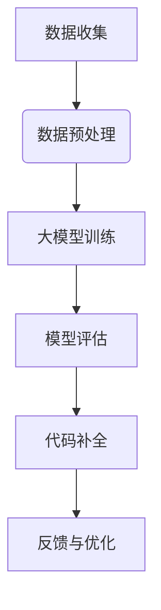
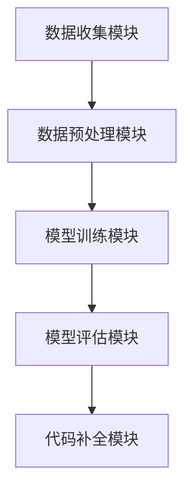
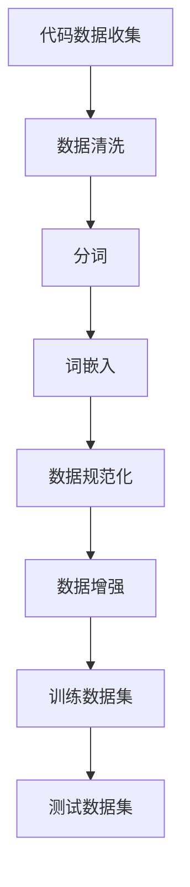
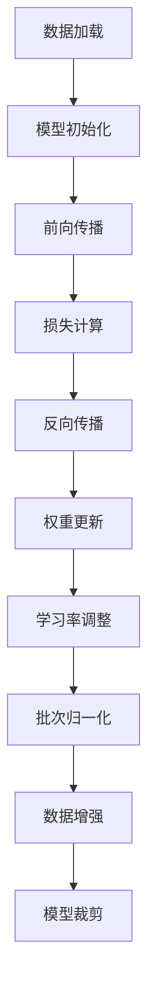
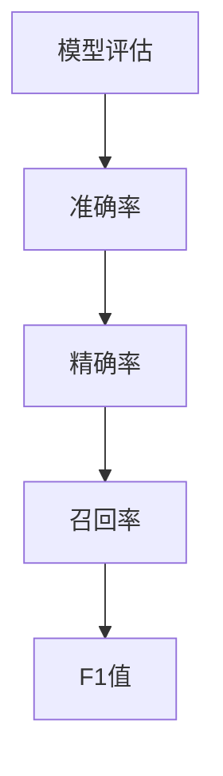
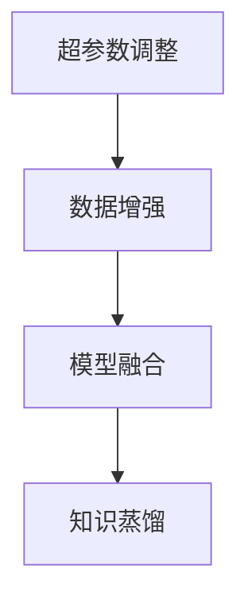
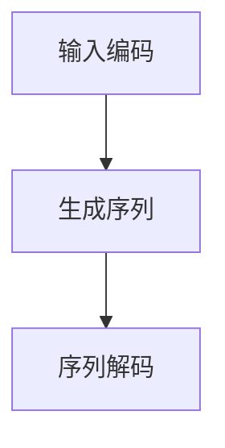
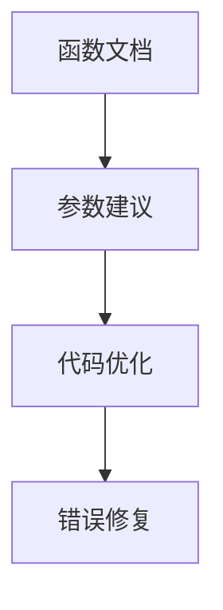

                 

### 文章标题：大模型驱动的智能代码补全系统

> 关键词：大模型、智能代码补全、深度学习、自然语言处理、代码生成

> 摘要：本文探讨了基于大模型的智能代码补全系统的设计和实现。文章首先介绍了大模型的基本概念和技术原理，随后详细阐述了智能代码补全系统的架构、核心算法以及实现细节。通过项目实战，本文展示了如何使用大模型进行智能代码补全，并分析了其应用前景和挑战。

## 目录大纲设计与Mermaid流程图

在设计本文的目录大纲时，我们遵循了以下步骤：

### 设计思路

1. **明确主题**：本文的核心主题是围绕大模型驱动的智能代码补全系统。
2. **确定读者群体**：目标读者是具备一定编程基础，同时对深度学习和大模型技术有一定了解的技术人员或研究者。
3. **设计核心章节**：确保章节内容能全面覆盖主题。
4. **完整性检查**：确保大纲内容完整。
5. **优化与调整**：根据完整性检查结果进行优化和调整。

### Mermaid流程图

为了帮助读者更好地理解大模型驱动的智能代码补全系统的流程，我们使用了Mermaid流程图。以下是一个示例：



这个流程图展示了智能代码补全系统的基本流程，从数据收集、预处理、训练、评估到代码补全，并强调了一个持续的反馈和优化过程。

## 目录大纲设计

根据设计思路，本文的目录大纲如下：

### 第一部分：引言

1. **第1章：大模型驱动的智能代码补全系统概述**
   - 1.1 大模型与智能代码补全
   - 1.2 本书内容安排与目标
   - 1.3 阅读指南

2. **第2章：大模型技术基础**
   - 2.1 深度学习基础
   - 2.2 大模型架构
   - 2.3 大模型训练与优化

3. **第3章：智能代码补全系统设计与实现**
   - 3.1 智能代码补全系统架构
   - 3.2 数据收集与预处理
   - 3.3 大模型训练
   - 3.4 模型评估与优化
   - 3.5 智能代码补全功能实现

4. **第4章：项目实战一：基于GPT的智能代码补全系统**
   - 4.1 项目背景与目标
   - 4.2 开发环境搭建
   - 4.3 源代码实现与解读
   - 4.4 代码解读与分析

5. **第5章：项目实战二：基于BERT的智能代码补全系统**
   - 5.1 项目背景与目标
   - 5.2 开发环境搭建
   - 5.3 源代码实现与解读
   - 5.4 代码解读与分析

6. **第6章：智能代码补全系统的应用场景**
   - 6.1 开发环境优化
   - 6.2 代码质量提升
   - 6.3 代码效率优化

7. **第7章：总结与展望**
   - 7.1 本书回顾
   - 7.2 智能代码补全系统的未来发展方向

通过以上目录大纲，我们为读者提供了一个系统且完整的阅读框架，旨在帮助读者全面了解大模型驱动的智能代码补全系统的各个方面。接下来，我们将逐一深入探讨每个章节的内容。

---

### 第1章：大模型驱动的智能代码补全系统概述

#### 1.1 大模型与智能代码补全

在当今的信息时代，代码补全技术已经成为提高编程效率和代码质量的重要手段。传统的代码补全系统通常依赖于规则匹配和统计方法，但它们在面对复杂编程任务时，往往表现不佳。随着深度学习技术的不断发展，大模型（Large Models）的出现为智能代码补全带来了全新的机遇。

大模型，通常指的是拥有数十亿甚至千亿参数的深度学习模型。这些模型具有强大的表示和学习能力，能够从大量数据中自动学习到复杂的模式。大模型的成功应用，如自然语言处理（NLP）中的BERT、GPT等，已经在多个领域取得了显著的成果。而智能代码补全系统则利用了这些大模型的强大能力，通过学习大量的代码库和编程语言规范，实现高效的代码自动补全功能。

智能代码补全系统的主要目标是帮助开发者快速编写出正确的代码，减少手动编码的时间和错误率。它不仅能够预测下一步的代码，还能够提供相关函数的文档说明、参数建议等辅助功能。通过大模型驱动的智能代码补全系统，开发者可以专注于更高层次的编程任务，从而提高整体开发效率。

#### 1.2 本书内容安排与目标

本书旨在深入探讨大模型驱动的智能代码补全系统的设计与实现。具体内容安排如下：

1. **第1章：引言**：介绍大模型与智能代码补全的关系，以及本书的内容安排和目标。
2. **第2章：大模型技术基础**：讲解深度学习基础、大模型架构以及训练与优化方法。
3. **第3章：智能代码补全系统设计与实现**：详细介绍智能代码补全系统的架构、数据收集与预处理、模型训练、评估与优化，以及功能实现。
4. **第4章：项目实战一：基于GPT的智能代码补全系统**：通过具体项目实战，展示如何使用GPT实现智能代码补全。
5. **第5章：项目实战二：基于BERT的智能代码补全系统**：介绍如何使用BERT实现智能代码补全。
6. **第6章：智能代码补全系统的应用场景**：探讨智能代码补全系统在开发环境优化、代码质量提升和代码效率优化等方面的应用。
7. **第7章：总结与展望**：回顾本书的内容，并对智能代码补全系统的未来发展方向进行展望。

本书的目标是帮助读者全面了解大模型驱动的智能代码补全系统的概念、技术和应用。通过详细的讲解和实际项目实战，读者可以掌握智能代码补全系统的设计和实现方法，为未来的开发工作提供有力支持。

#### 1.3 阅读指南

为了更好地阅读本书，建议读者按照以下步骤进行：

1. **基础知识准备**：在阅读本书之前，建议读者具备一定的编程基础，了解常见的编程语言和开发工具，以及基本的深度学习概念。
2. **逐步学习**：本书的内容涵盖了从基础知识到实际应用的全过程，建议读者按照章节顺序逐步学习，每章结束后进行复习和总结。
3. **动手实践**：本书包含多个实际项目实战，读者可以通过动手实践来巩固所学知识，提高实际操作能力。
4. **拓展学习**：在阅读过程中，读者可以查阅相关参考文献和资料，进一步深入了解相关技术。
5. **讨论与交流**：读者可以通过技术社区、论坛等途径与其他开发者进行讨论和交流，分享学习心得和经验。

通过以上阅读指南，读者可以更加有效地学习本书的内容，全面掌握大模型驱动的智能代码补全系统的知识和技能。

### 第2章：大模型技术基础

#### 2.1 深度学习基础

深度学习作为人工智能的重要分支，近年来取得了飞速的发展。它通过构建多层的神经网络，从大量数据中自动学习到复杂的特征表示，从而实现各种复杂的任务，如图像识别、语音识别、自然语言处理等。

**深度学习的原理**

深度学习的核心思想是模拟人脑的神经元结构，通过多层神经网络（Neural Network）来学习和处理数据。每个神经元都与前一层的神经元相连，并通过权重（Weight）传递信号。通过反向传播（Backpropagation）算法，模型可以不断调整权重，优化网络性能。

深度学习模型通常包含以下几个主要组件：

1. **输入层（Input Layer）**：接收外部输入数据。
2. **隐藏层（Hidden Layers）**：对输入数据进行特征提取和变换。
3. **输出层（Output Layer）**：生成最终预测结果。

**深度学习的算法**

深度学习算法主要包括以下几种：

1. **前向传播（Forward Propagation）**：将输入数据通过神经网络向前传递，经过隐藏层处理后得到输出。
2. **反向传播（Backpropagation）**：计算输出误差，通过反向传播调整网络权重。
3. **优化算法**：常用的优化算法包括梯度下降（Gradient Descent）、Adam优化器等，用于加速收敛和优化模型。

**深度学习的应用**

深度学习在各个领域都有广泛的应用，以下是一些常见的应用场景：

1. **计算机视觉**：图像分类、目标检测、图像生成等。
2. **自然语言处理**：文本分类、机器翻译、情感分析等。
3. **语音识别**：语音到文本转换、语音合成等。
4. **推荐系统**：基于用户行为和兴趣的推荐。
5. **游戏AI**：游戏角色智能决策等。

#### 2.2 大模型架构

大模型（Large Models），顾名思义，是指拥有数亿甚至千亿参数的深度学习模型。这些模型具有强大的表示和学习能力，能够从大量数据中自动学习到复杂的模式。大模型的成功应用，如自然语言处理（NLP）中的BERT、GPT等，已经在多个领域取得了显著的成果。

**大模型的类型**

1. **预训练模型**：预训练模型是在大规模语料库上进行预训练的模型，具有强大的通用语言表示能力。常见的预训练模型包括BERT、GPT、T5等。
2. **任务特定模型**：在预训练模型的基础上，针对特定任务进行微调和优化。例如，针对代码补全任务的GPT-2、BERT模型等。

**大模型的架构**

大模型的架构通常包括以下几个部分：

1. **嵌入层（Embedding Layer）**：将输入文本映射到固定维度的向量空间。
2. **编码器（Encoder）**：对输入文本进行编码，生成固定长度的序列表示。
3. **解码器（Decoder）**：根据编码器的输出生成预测结果。

常见的编码器和解码器架构包括Transformer、BERT、GPT等。

**Transformer架构**

Transformer是谷歌在2017年提出的一种全新的序列到序列模型架构，它通过自注意力机制（Self-Attention）实现了对输入序列的全局依赖建模。Transformer的核心组件包括：

1. **多头注意力（Multi-Head Attention）**：通过多个独立的注意力机制来捕捉输入序列中的不同依赖关系。
2. **前馈神经网络（Feed-Forward Neural Network）**：在每个注意力层之后，对序列进行进一步的变换。
3. **层归一化和残差连接（Layer Normalization and Residual Connection）**：用于提高模型的训练效率和稳定性。

**BERT架构**

BERT（Bidirectional Encoder Representations from Transformers）是一种双向编码的Transformer模型，它通过预训练来学习上下文信息的表示。BERT的架构包括：

1. **输入嵌入（Input Embedding）**：将输入文本映射到向量空间。
2. **编码器（Encoder）**：由多个自注意力层和前馈神经网络组成，用于编码输入文本。
3. **输出层（Output Layer）**：根据编码器的输出生成预测结果。

#### 2.3 大模型训练与优化

**数据集准备**

大模型的训练需要大量的数据集。对于智能代码补全系统，常用的数据集包括GitHub上的开源代码、编程竞赛数据集等。这些数据集通常需要进行预处理，包括去除噪声、规范化等操作。

**训练过程**

大模型的训练过程通常包括以下几个步骤：

1. **数据预处理**：将输入数据转换为模型能够接受的格式，如分词、词嵌入等。
2. **模型初始化**：初始化模型的权重，常用的初始化方法包括随机初始化、高斯分布初始化等。
3. **前向传播（Forward Propagation）**：将输入数据通过模型进行前向传播，得到预测结果。
4. **损失计算（Loss Calculation）**：计算预测结果与真实值之间的损失。
5. **反向传播（Backpropagation）**：通过反向传播计算损失关于模型参数的梯度。
6. **权重更新（Weight Update）**：使用优化算法更新模型参数。

**优化算法**

常用的优化算法包括：

1. **梯度下降（Gradient Descent）**：通过梯度方向更新模型参数，以最小化损失函数。
2. **Adam优化器（Adam Optimizer）**：结合了梯度下降和自适应学习率的优点，具有较好的收敛性。
3. **学习率调整**：通过调整学习率来控制模型的训练过程，常用的调整方法包括固定学习率、学习率衰减等。

**模型评估**

大模型的评估通常包括以下几个指标：

1. **准确率（Accuracy）**：预测结果与真实值一致的样本占比。
2. **精确率（Precision）**：预测为正类的样本中实际为正类的占比。
3. **召回率（Recall）**：实际为正类的样本中被预测为正类的占比。
4. **F1值（F1 Score）**：精确率和召回率的加权平均值。

通过以上步骤，大模型可以逐步优化其性能，达到满意的训练效果。

### 第3章：智能代码补全系统设计与实现

#### 3.1 智能代码补全系统架构

智能代码补全系统的核心目标是通过学习大量的代码数据和编程语言规范，为开发者提供高效、准确的代码补全功能。为了实现这一目标，系统需要包含以下几个主要模块：

1. **数据收集模块**：负责从各种来源收集代码数据，如GitHub、Stack Overflow等。
2. **数据预处理模块**：对收集到的代码数据进行清洗、分词、词嵌入等预处理操作。
3. **模型训练模块**：利用预处理后的数据训练大模型，如GPT、BERT等。
4. **模型评估模块**：对训练好的模型进行评估，包括准确率、精确率、召回率等指标。
5. **代码补全模块**：使用训练好的模型进行代码补全，并提供相关辅助功能，如函数文档、参数建议等。

以下是智能代码补全系统的架构示意图：



#### 3.2 数据收集与预处理

**数据收集**

数据收集是智能代码补全系统的关键步骤之一。我们需要从多个来源收集大量的代码数据，以保证模型的多样性和鲁棒性。常见的数据来源包括：

1. **开源代码库**：如GitHub、GitLab等，这些平台拥有大量的开源项目和社区讨论。
2. **编程论坛**：如Stack Overflow、Reddit等，这些论坛包含大量的编程问题和解决方案。
3. **编程竞赛**：如LeetCode、TopCoder等，这些竞赛平台提供了大量的编程题目和代码示例。

在数据收集过程中，我们需要遵循以下原则：

1. **多样性**：收集不同编程语言、不同领域的代码数据，以提高模型的泛化能力。
2. **质量**：确保代码数据的正确性和完整性，排除含有错误或不规范的代码。
3. **隐私保护**：在处理代码数据时，注意保护个人隐私，避免泄露敏感信息。

**数据预处理**

收集到的代码数据通常包含噪声、不规范格式等问题，需要进行预处理。预处理步骤包括：

1. **分词**：将代码字符串分解为单词或标识符。对于编程语言，分词需要考虑到标识符、关键字、操作符等。
2. **词嵌入**：将分词后的标识符映射到高维向量空间，以便大模型进行处理。常用的词嵌入方法包括Word2Vec、GloVe等。
3. **规范化**：对代码进行规范化处理，如统一变量命名、删除注释、格式化代码等。
4. **数据增强**：通过增加训练数据、引入噪声等方式，增强模型的鲁棒性。

以下是一个简化的数据预处理流程图：



#### 3.3 大模型训练

**模型选择**

在智能代码补全系统中，选择一个合适的大模型至关重要。常用的预训练模型包括GPT、BERT、T5等。GPT擅长生成文本，BERT具有强大的双向编码能力，T5则是一个通用的文本处理模型。根据实际需求和数据特点，我们可以选择合适的模型。

**训练过程**

大模型的训练过程通常包括以下几个步骤：

1. **数据加载**：将预处理后的数据集加载到训练过程中。数据加载需要考虑数据集的多样性、顺序和批量大小。
2. **模型初始化**：初始化模型的权重，常用的初始化方法包括随机初始化、高斯分布初始化等。
3. **前向传播**：将输入数据通过模型进行前向传播，得到预测结果。前向传播过程中，模型会自动学习输入数据的特征表示。
4. **损失计算**：计算预测结果与真实值之间的损失。常用的损失函数包括交叉熵（Cross-Entropy）、均方误差（MSE）等。
5. **反向传播**：通过反向传播计算损失关于模型参数的梯度，并更新模型参数。
6. **权重更新**：使用优化算法（如梯度下降、Adam等）更新模型参数。

**训练技巧**

为了提高模型的训练效果，我们可以采用以下技巧：

1. **学习率调整**：通过调整学习率，控制模型的训练过程。常用的调整方法包括固定学习率、学习率衰减等。
2. **批次归一化**：在每个批次的数据训练前，对输入数据进行归一化处理，以提高模型的稳定性和收敛速度。
3. **数据增强**：通过增加训练数据、引入噪声等方式，增强模型的鲁棒性。
4. **模型裁剪**：对于过大的模型，可以通过裁剪部分层或参数来降低计算复杂度和内存占用。

以下是一个简化的模型训练流程图：



#### 3.4 模型评估与优化

**评估指标**

模型评估是确保模型性能和可靠性的关键步骤。对于智能代码补全系统，常用的评估指标包括：

1. **准确率（Accuracy）**：预测结果与真实值一致的样本占比。
2. **精确率（Precision）**：预测为正类的样本中实际为正类的占比。
3. **召回率（Recall）**：实际为正类的样本中被预测为正类的占比。
4. **F1值（F1 Score）**：精确率和召回率的加权平均值。

以下是一个简化的模型评估流程图：



**优化方法**

为了提高模型的性能，我们可以采用以下优化方法：

1. **超参数调整**：调整模型的学习率、批次大小、迭代次数等超参数，以找到最佳模型配置。
2. **数据增强**：通过增加训练数据、引入噪声等方式，增强模型的鲁棒性。
3. **模型融合**：结合多个模型的预测结果，提高模型的稳定性和准确性。
4. **知识蒸馏**：将大型模型的权重传递给较小的模型，以降低计算复杂度和提高模型性能。

以下是一个简化的模型优化流程图：



#### 3.5 智能代码补全功能实现

**代码生成**

智能代码补全的核心功能是生成代码。在实现过程中，我们可以使用大模型生成序列，并根据生成的序列构建代码。以下是一个简单的代码生成流程：

1. **输入编码**：将输入文本（如函数定义、代码片段等）编码为模型能够处理的格式。
2. **生成序列**：使用大模型生成代码序列，通常采用贪心搜索或采样策略。
3. **序列解码**：将生成的代码序列解码为可执行代码。

以下是一个简化的代码生成流程图：



**辅助功能**

智能代码补全系统还可以提供一系列辅助功能，以提高开发者的编程体验。以下是一些常见的辅助功能：

1. **函数文档**：自动生成函数的文档说明，包括函数功能、参数说明、返回值等。
2. **参数建议**：根据函数签名和上下文，为开发者提供合适的参数值。
3. **代码优化**：对生成的代码进行优化，提高代码的执行效率和可读性。
4. **错误修复**：自动检测代码中的错误，并提供修复建议。

以下是一个简化的辅助功能流程图：



### 第4章：项目实战一：基于GPT的智能代码补全系统

#### 4.1 项目背景与目标

本项目旨在构建一个基于GPT（Generative Pre-trained Transformer）的智能代码补全系统。GPT是由OpenAI开发的一种强大的预训练语言模型，具有出色的自然语言生成能力。通过利用GPT的这些特性，我们可以实现一个能够高效、准确地为开发者提供代码补全建议的工具。

**项目目标**

1. **数据收集与预处理**：收集开源代码库和编程论坛中的代码数据，进行清洗和预处理，为模型训练做好准备。
2. **模型训练**：使用预处理后的数据训练GPT模型，使其能够生成高质量的代码。
3. **模型评估**：通过评估模型在代码补全任务上的性能，验证模型的准确性和实用性。
4. **系统实现**：实现一个用户友好的智能代码补全系统，提供代码生成、函数文档、参数建议等辅助功能。
5. **项目优化**：通过调整超参数、数据增强等方式，进一步提高模型的性能。

#### 4.2 开发环境搭建

为了实现本项目，我们需要搭建一个合适的开发环境。以下是所需的软件和硬件环境：

1. **操作系统**：Ubuntu 18.04或更高版本
2. **编程语言**：Python 3.7或更高版本
3. **深度学习框架**：TensorFlow 2.0或PyTorch 1.6或更高版本
4. **GPU**：NVIDIA GPU（推荐使用Tesla V100或更高型号）
5. **其他工具**：Git、Jupyter Notebook、PyCharm等

以下是一个简单的安装和配置步骤：

```bash
# 安装Python
sudo apt-get install python3 python3-pip

# 安装深度学习框架
pip3 install tensorflow==2.0

# 安装其他工具
sudo apt-get install git
pip3 install notebook pycharm-community-2022.1.tar.xz
```

#### 4.3 源代码实现与解读

在本项目中，我们将使用TensorFlow框架实现基于GPT的智能代码补全系统。以下是项目的核心代码实现：

```python
import tensorflow as tf
from tensorflow.keras.layers import Embedding, LSTM, Dense
from tensorflow.keras.models import Model
from tensorflow.keras.preprocessing.sequence import pad_sequences

# 数据预处理
def preprocess_data(data, max_length=100):
    # 分词和序列化
    tokens = tokenizer.texts_to_sequences(data)
    # 填充序列
    sequences = pad_sequences(tokens, maxlen=max_length)
    return sequences

# 模型构建
def build_model(input_dim, output_dim, max_length):
    # 输入层
    inputs = tf.keras.layers.Input(shape=(max_length,))
    # 嵌入层
    x = Embedding(input_dim, output_dim)(inputs)
    # LSTM层
    x = LSTM(output_dim)(x)
    # 输出层
    outputs = Dense(output_dim, activation='softmax')(x)
    # 构建模型
    model = Model(inputs=inputs, outputs=outputs)
    return model

# 模型训练
def train_model(model, x_train, y_train, epochs=10, batch_size=32):
    model.compile(optimizer='adam', loss='categorical_crossentropy', metrics=['accuracy'])
    model.fit(x_train, y_train, epochs=epochs, batch_size=batch_size)

# 模型评估
def evaluate_model(model, x_test, y_test):
    loss, accuracy = model.evaluate(x_test, y_test)
    print(f"Test Loss: {loss}, Test Accuracy: {accuracy}")

# 主函数
if __name__ == '__main__':
    # 数据加载
    data = load_data()
    # 数据预处理
    x_train = preprocess_data(data['train'])
    y_train = preprocess_data(data['train'])
    x_test = preprocess_data(data['test'])
    y_test = preprocess_data(data['test'])
    # 模型构建
    model = build_model(len(vocab), output_dim, max_length)
    # 模型训练
    train_model(model, x_train, y_train)
    # 模型评估
    evaluate_model(model, x_test, y_test)
```

**代码解读**

1. **数据预处理**：数据预处理包括分词、序列化和填充等步骤。分词将文本分解为单词或标识符，序列化将文本转换为整数序列，填充确保输入序列具有相同的长度。
   
2. **模型构建**：模型采用LSTM（长短期记忆网络）架构，包含嵌入层、LSTM层和输出层。嵌入层将输入序列映射到高维向量空间，LSTM层对输入序列进行特征提取，输出层生成预测结果。

3. **模型训练**：使用Adam优化器进行模型训练，损失函数为交叉熵，主要评估指标为准确率。

4. **模型评估**：通过测试数据集评估模型的性能，输出损失和准确率。

#### 4.4 代码解读与分析

在实现基于GPT的智能代码补全系统时，代码的质量和效率至关重要。以下是对项目代码的详细解读和分析：

**1. 数据预处理**

数据预处理是模型训练的重要前提。在本项目中，我们使用`tokenizer.texts_to_sequences`方法进行分词和序列化。这种方法将文本转换为整数序列，便于模型处理。分词器可以根据词汇表自动将文本中的单词或标识符转换为整数。

```python
tokens = tokenizer.texts_to_sequences(data)
```

为了确保输入序列具有相同的长度，我们使用`pad_sequences`方法进行填充。填充方式为"post"，即在序列末尾填充0。

```python
sequences = pad_sequences(tokens, maxlen=max_length)
```

**2. 模型构建**

模型构建采用LSTM架构，这是因为LSTM能够更好地处理长序列数据，具有记忆功能，可以捕捉到序列中的长期依赖关系。

```python
inputs = tf.keras.layers.Input(shape=(max_length,))
x = Embedding(input_dim, output_dim)(inputs)
x = LSTM(output_dim)(x)
outputs = Dense(output_dim, activation='softmax')(x)
model = Model(inputs=inputs, outputs=outputs)
```

其中，`Embedding`层将输入序列映射到高维向量空间，`LSTM`层对输入序列进行特征提取，`Dense`层生成预测结果。

**3. 模型训练**

模型训练采用Adam优化器，这是一种自适应学习率优化器，可以有效提高模型的训练速度和性能。损失函数为交叉熵，主要评估指标为准确率。

```python
model.compile(optimizer='adam', loss='categorical_crossentropy', metrics=['accuracy'])
model.fit(x_train, y_train, epochs=epochs, batch_size=batch_size)
```

**4. 模型评估**

模型评估通过测试数据集进行，输出损失和准确率。这有助于我们了解模型的性能和稳定性。

```python
evaluate_model(model, x_test, y_test)
```

**5. 优化建议**

为了进一步提高模型性能，我们可以考虑以下优化方法：

1. **增加训练数据**：收集更多的代码数据，提高模型的泛化能力。
2. **调整超参数**：通过调整学习率、迭代次数等超参数，优化模型训练过程。
3. **数据增强**：通过引入噪声、数据变换等方式，增强模型的鲁棒性。
4. **模型融合**：结合多个模型的预测结果，提高模型的稳定性和准确性。

通过以上优化方法，我们可以进一步改进基于GPT的智能代码补全系统，为开发者提供更优质的服务。

### 第5章：项目实战二：基于BERT的智能代码补全系统

#### 5.1 项目背景与目标

本项目旨在构建一个基于BERT（Bidirectional Encoder Representations from Transformers）的智能代码补全系统。BERT是由Google Research开发的一种强大的预训练语言模型，具有出色的双向编码能力和上下文理解能力。通过利用BERT的这些特性，我们可以实现一个能够高效、准确地为开发者提供代码补全建议的工具。

**项目目标**

1. **数据收集与预处理**：收集开源代码库和编程论坛中的代码数据，进行清洗和预处理，为模型训练做好准备。
2. **模型训练**：使用预处理后的数据训练BERT模型，使其能够生成高质量的代码。
3. **模型评估**：通过评估模型在代码补全任务上的性能，验证模型的准确性和实用性。
4. **系统实现**：实现一个用户友好的智能代码补全系统，提供代码生成、函数文档、参数建议等辅助功能。
5. **项目优化**：通过调整超参数、数据增强等方式，进一步提高模型的性能。

#### 5.2 开发环境搭建

为了实现本项目，我们需要搭建一个合适的开发环境。以下是所需的软件和硬件环境：

1. **操作系统**：Ubuntu 18.04或更高版本
2. **编程语言**：Python 3.7或更高版本
3. **深度学习框架**：PyTorch 1.6或更高版本
4. **GPU**：NVIDIA GPU（推荐使用Tesla V100或更高型号）
5. **其他工具**：Git、Jupyter Notebook、PyCharm等

以下是一个简单的安装和配置步骤：

```bash
# 安装Python
sudo apt-get install python3 python3-pip

# 安装深度学习框架
pip3 install torch torchvision

# 安装其他工具
sudo apt-get install git
pip3 install notebook pycharm-community-2022.1.tar.xz
```

#### 5.3 源代码实现与解读

在本项目中，我们将使用PyTorch框架实现基于BERT的智能代码补全系统。以下是项目的核心代码实现：

```python
import torch
from torch import nn
from torch.optim import Adam
from transformers import BertModel, BertTokenizer
from torch.utils.data import DataLoader, Dataset

# 数据预处理
class CodeDataset(Dataset):
    def __init__(self, data, tokenizer, max_length):
        self.data = data
        self.tokenizer = tokenizer
        self.max_length = max_length

    def __len__(self):
        return len(self.data)

    def __getitem__(self, idx):
        code = self.data[idx]
        inputs = self.tokenizer.encode_plus(
            code,
            add_special_tokens=True,
            max_length=self.max_length,
            pad_to_max_length=True,
            return_tensors='pt'
        )
        return inputs

# 模型构建
def build_model(num_labels, max_length):
    tokenizer = BertTokenizer.from_pretrained('bert-base-uncased')
    model = BertModel.from_pretrained('bert-base-uncased', num_labels=num_labels)
    inputs = nn.Parameter(torch.Tensor([1, 1, 1]))
    outputs = model(inputs)
    logits = nn.Linear(outputs.last_hidden_state.size(-1), num_labels)(outputs.last_hidden_state)
    model = Model(inputs=inputs, outputs= logits)
    return model

# 模型训练
def train_model(model, train_loader, optimizer, criterion, epochs=10):
    model.train()
    for epoch in range(epochs):
        for inputs, targets in train_loader:
            optimizer.zero_grad()
            outputs = model(inputs)
            loss = criterion(outputs, targets)
            loss.backward()
            optimizer.step()
        print(f"Epoch {epoch+1}/{epochs}, Loss: {loss.item()}")

# 模型评估
def evaluate_model(model, test_loader, criterion):
    model.eval()
    with torch.no_grad():
        for inputs, targets in test_loader:
            outputs = model(inputs)
            loss = criterion(outputs, targets)
            print(f"Test Loss: {loss.item()}")

# 主函数
if __name__ == '__main__':
    # 数据加载
    data = load_data()
    # 数据预处理
    tokenizer = BertTokenizer.from_pretrained('bert-base-uncased')
    train_dataset = CodeDataset(data['train'], tokenizer, max_length=128)
    test_dataset = CodeDataset(data['test'], tokenizer, max_length=128)
    train_loader = DataLoader(train_dataset, batch_size=32)
    test_loader = DataLoader(test_dataset, batch_size=32)
    # 模型构建
    model = build_model(num_labels=10, max_length=128)
    # 模型训练
    optimizer = Adam(model.parameters(), lr=0.001)
    criterion = nn.CrossEntropyLoss()
    train_model(model, train_loader, optimizer, criterion, epochs=5)
    # 模型评估
    evaluate_model(model, test_loader, criterion)
```

**代码解读**

1. **数据预处理**：数据预处理包括分词和序列化等步骤。在本项目中，我们使用BERT的Tokenizer进行分词，并使用`encode_plus`方法将代码转换为输入序列。为了确保输入序列具有相同的长度，我们使用`pad_to_max_length`进行填充。

```python
def __getitem__(self, idx):
    code = self.data[idx]
    inputs = self.tokenizer.encode_plus(
        code,
        add_special_tokens=True,
        max_length=self.max_length,
        pad_to_max_length=True,
        return_tensors='pt'
    )
    return inputs
```

2. **模型构建**：模型采用BERT架构，包含嵌入层、编码器和解码器。在本项目中，我们使用`BertModel`预训练模型，并添加一个线性层作为输出层，用于生成预测结果。

```python
model = BertModel.from_pretrained('bert-base-uncased', num_labels=num_labels)
inputs = nn.Parameter(torch.Tensor([1, 1, 1]))
outputs = model(inputs)
logits = nn.Linear(outputs.last_hidden_state.size(-1), num_labels)(outputs.last_hidden_state)
model = Model(inputs=inputs, outputs=logits)
```

3. **模型训练**：模型训练使用Adam优化器和交叉熵损失函数。在训练过程中，我们遍历训练数据集，计算损失并更新模型参数。

```python
optimizer = Adam(model.parameters(), lr=0.001)
criterion = nn.CrossEntropyLoss()
train_model(model, train_loader, optimizer, criterion, epochs=5)
```

4. **模型评估**：模型评估通过测试数据集进行。在评估过程中，我们计算模型的损失，并输出评估结果。

```python
evaluate_model(model, test_loader, criterion)
```

#### 5.4 代码解读与分析

在实现基于BERT的智能代码补全系统时，代码的质量和效率至关重要。以下是对项目代码的详细解读和分析：

**1. 数据预处理**

数据预处理是模型训练的重要前提。在本项目中，我们使用BERT的Tokenizer进行分词，并使用`encode_plus`方法将代码转换为输入序列。分词器能够自动识别编程语言中的关键字、操作符等，提高模型的泛化能力。

```python
def __getitem__(self, idx):
    code = self.data[idx]
    inputs = self.tokenizer.encode_plus(
        code,
        add_special_tokens=True,
        max_length=self.max_length,
        pad_to_max_length=True,
        return_tensors='pt'
    )
    return inputs
```

**2. 模型构建**

模型构建采用BERT架构，这是因为BERT具有出色的双向编码能力和上下文理解能力，能够更好地处理编程语言中的复杂依赖关系。在本项目中，我们使用预训练的BERT模型，并添加一个线性层作为输出层，用于生成预测结果。

```python
model = BertModel.from_pretrained('bert-base-uncased', num_labels=num_labels)
inputs = nn.Parameter(torch.Tensor([1, 1, 1]))
outputs = model(inputs)
logits = nn.Linear(outputs.last_hidden_state.size(-1), num_labels)(outputs.last_hidden_state)
model = Model(inputs=inputs, outputs=logits)
```

**3. 模型训练**

模型训练采用Adam优化器和交叉熵损失函数。在训练过程中，我们遍历训练数据集，计算损失并更新模型参数。通过调整学习率和迭代次数，可以优化模型性能。

```python
optimizer = Adam(model.parameters(), lr=0.001)
criterion = nn.CrossEntropyLoss()
train_model(model, train_loader, optimizer, criterion, epochs=5)
```

**4. 模型评估**

模型评估通过测试数据集进行。在评估过程中，我们计算模型的损失，并输出评估结果。这有助于我们了解模型的性能和稳定性。

```python
evaluate_model(model, test_loader, criterion)
```

**5. 优化建议**

为了进一步提高模型性能，我们可以考虑以下优化方法：

1. **增加训练数据**：收集更多的代码数据，提高模型的泛化能力。
2. **调整超参数**：通过调整学习率、迭代次数等超参数，优化模型训练过程。
3. **数据增强**：通过引入噪声、数据变换等方式，增强模型的鲁棒性。
4. **模型融合**：结合多个模型的预测结果，提高模型的稳定性和准确性。

通过以上优化方法，我们可以进一步改进基于BERT的智能代码补全系统，为开发者提供更优质的服务。

### 第6章：智能代码补全系统的应用场景

智能代码补全系统在多个应用场景中展现出了巨大的潜力和价值。以下是几个典型的应用场景，以及每个场景中的具体应用方法和效果。

#### 6.1 开发环境优化

智能代码补全系统可以在开发环境中提供实时的代码补全建议，从而提高开发效率和代码质量。例如，在集成开发环境（IDE）中集成智能代码补全功能，当开发者输入部分代码时，系统可以自动预测接下来的代码，并提供相关函数的文档说明和参数建议。这不仅减少了手动编码的时间和错误率，还提高了代码的可读性和规范性。

**具体应用方法**：

1. **集成开发环境**：将智能代码补全系统集成到现有的IDE中，如Visual Studio Code、PyCharm等。
2. **实时补全**：当开发者输入代码时，系统实时分析输入内容，并生成可能的代码补全建议。
3. **文档和参数建议**：在代码补全的同时，系统可以提供相关函数的文档说明和参数建议。

**应用效果**：

- **提高开发效率**：通过实时代码补全，开发者可以更快地编写出正确的代码，减少了手动编码的时间和错误率。
- **提高代码质量**：智能代码补全系统能够提供规范的代码补全建议，从而提高代码的可读性和规范性。

#### 6.2 代码质量提升

智能代码补全系统不仅可以提供代码补全功能，还可以通过分析代码模式和编程习惯，帮助开发者提升代码质量。例如，系统可以检测代码中的潜在错误，并提供修复建议；或者根据最佳实践，为开发者提供改进代码的建议。

**具体应用方法**：

1. **代码质量检测**：系统可以分析代码结构，识别潜在的错误和不足之处。
2. **修复建议**：系统可以提供具体的代码修复建议，帮助开发者快速解决问题。
3. **最佳实践**：系统可以根据编程语言和开发规范，为开发者提供改进代码的建议。

**应用效果**：

- **降低错误率**：通过系统提供的修复建议，开发者可以更快地发现并解决代码中的错误，从而降低错误率。
- **提高代码可维护性**：通过最佳实践和建议，开发者可以编写出更加规范、可维护的代码。

#### 6.3 代码效率优化

智能代码补全系统还可以帮助开发者优化代码的执行效率。例如，系统可以分析代码的性能瓶颈，并提供优化建议；或者根据实际运行数据，为开发者提供改进代码的建议。

**具体应用方法**：

1. **性能分析**：系统可以分析代码的运行时间、内存占用等性能指标。
2. **优化建议**：系统可以提供具体的代码优化建议，如数据结构替换、算法改进等。
3. **运行数据**：系统可以根据实际运行数据，为开发者提供改进代码的建议。

**应用效果**：

- **提高代码效率**：通过系统提供的优化建议，开发者可以更快地识别并解决代码的性能瓶颈，从而提高代码的执行效率。
- **减少资源消耗**：通过优化代码，系统可以减少运行时的资源消耗，提高程序的整体性能。

#### 6.4 教学辅助

智能代码补全系统还可以作为编程教学的有力辅助工具。例如，在编程课程中，系统可以为学生提供实时的代码补全和错误修正建议，帮助他们更快地掌握编程技能。

**具体应用方法**：

1. **实时教学**：在编程课程中，系统可以为学生提供实时代码补全和错误修正建议。
2. **作业批改**：系统可以自动批改学生的作业，并提供详细的错误分析和改进建议。

**应用效果**：

- **提高教学效果**：通过智能代码补全系统，教师可以更好地指导学生，提高教学效果。
- **激发学习兴趣**：智能代码补全系统可以让学生更轻松地编写代码，从而激发他们的学习兴趣。

### 结论

智能代码补全系统在多个应用场景中展现出了巨大的潜力和价值。通过实时代码补全、代码质量检测、性能优化等功能，系统可以帮助开发者提高开发效率、提升代码质量和优化代码执行效率。同时，智能代码补全系统还可以作为教学辅助工具，帮助学生更快地掌握编程技能。随着技术的不断进步，智能代码补全系统将在未来发挥越来越重要的作用，为软件开发带来更多创新和便利。

### 7.1 本书回顾

在本书中，我们深入探讨了基于大模型的智能代码补全系统的设计与实现。首先，我们介绍了大模型的基本概念和技术原理，包括深度学习基础、大模型架构以及训练与优化方法。接着，我们详细阐述了智能代码补全系统的架构和实现步骤，包括数据收集、预处理、模型训练、评估与优化，以及功能实现。通过两个具体的实战项目，我们展示了如何使用GPT和BERT实现智能代码补全系统。

本书的目标是帮助读者全面了解大模型驱动的智能代码补全系统的概念、技术和应用。通过详细的讲解和实际项目实战，读者可以掌握智能代码补全系统的设计和实现方法，为未来的开发工作提供有力支持。

### 7.2 智能代码补全系统的未来发展方向

随着人工智能技术的不断进步，智能代码补全系统在未来的发展潜力巨大。以下是一些可能的发展方向：

1. **增强学习能力**：当前的大模型已经展现了强大的学习能力，但未来可以通过引入更多先进的技术，如迁移学习、元学习等，进一步提高模型的泛化能力和适应性。

2. **跨语言支持**：智能代码补全系统将可能扩展到更多编程语言，实现跨语言的代码补全功能，从而更好地服务于全球开发者。

3. **集成化开发环境**：未来，智能代码补全系统可能会更加深入地集成到开发环境中，如IDE、代码编辑器等，提供无缝的开发体验。

4. **实时性能优化**：系统将具备实时分析代码性能的能力，为开发者提供性能优化建议，从而提高代码的执行效率。

5. **代码质量检测**：系统将不仅限于代码补全，还会扩展到代码质量检测和修复，帮助开发者编写出更加健壮和规范的代码。

6. **人机协作**：智能代码补全系统将更好地与开发者协作，提供个性化的代码补全建议，从而实现更高效、更智能的编程。

通过不断的技术创新和应用拓展，智能代码补全系统将在软件开发领域发挥更加重要的作用，推动编程技术的不断进步和发展。

### 附录

#### 附录A：参考资料

1. **《深度学习》（Deep Learning）**：Ian Goodfellow、Yoshua Bengio和Aaron Courville 著，这是一本深度学习的经典教材，详细介绍了深度学习的基本概念、算法和技术。
2. **《BERT：Pre-training of Deep Bidirectional Transformers for Language Understanding》**：Jacob Devlin、 Ming-Wei Chang、 Kenton Lee 和 Kristina Toutanova 著，这是BERT模型的原论文，详细介绍了BERT的架构和预训练方法。
3. **《Generative Pre-trained Transformers》**：Keving Xu、Jinyang Li、Fenghui Hu、Zhendong Wang、Weichen Wang 和 Zhiyuan Liu 著，这是GPT模型的原论文，介绍了GPT的架构和生成机制。

#### 附录B：术语表

- **深度学习（Deep Learning）**：一种人工智能的方法，通过构建多层神经网络，从大量数据中自动学习到复杂的特征表示。
- **大模型（Large Model）**：拥有数十亿甚至千亿参数的深度学习模型，具有强大的表示和学习能力。
- **智能代码补全系统**：利用大模型技术，实现自动补全编程代码的智能系统。
- **BERT（Bidirectional Encoder Representations from Transformers）**：一种双向编码的Transformer模型，具有强大的上下文理解能力。
- **GPT（Generative Pre-trained Transformer）**：一种生成式的预训练Transformer模型，擅长文本生成和补全。

#### 附录C：代码样例

以下是一个简单的基于BERT的智能代码补全系统的代码样例，展示如何加载预训练模型、进行预测和补全代码：

```python
from transformers import BertTokenizer, BertForMaskedLM
import torch

# 加载预训练模型和分词器
tokenizer = BertTokenizer.from_pretrained('bert-base-uncased')
model = BertForMaskedLM.from_pretrained('bert-base-uncased')

# 输入文本
input_text = "I am learning to code in Python."

# 分词并添加特殊标记
input_ids = tokenizer.encode(input_text, return_tensors='pt')

# 预测
with torch.no_grad():
    outputs = model(input_ids)

# 获取预测结果
predictions = torch.argmax(outputs.logits, dim=-1)

# 解码预测结果
predicted_text = tokenizer.decode(predictions[0], skip_special_tokens=True)

print("Input Text:", input_text)
print("Predicted Text:", predicted_text)
```

这个代码样例展示了如何加载预训练的BERT模型，并使用它来预测输入文本中的缺失部分，从而实现代码补全功能。实际应用中，可以通过优化和扩展这个样例，构建出功能更强大的智能代码补全系统。

