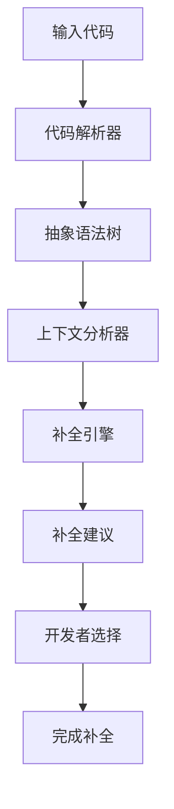
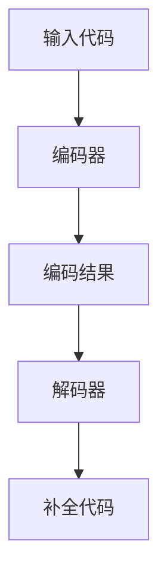

                 

### 文章标题：大模型驱动的智能代码补全：个性化与通用性

#### 关键词：大模型，智能代码补全，个性化，通用性，算法，数学模型，项目实战

#### 摘要：

本文旨在探讨大模型驱动的智能代码补全技术，深入分析其在个性化与通用性之间的平衡问题。首先，我们将回顾智能代码补全的背景及其重要性，然后介绍大模型的基本概念和流程。随后，文章将详细阐述大模型驱动的智能代码补全的核心算法原理，并运用伪代码和数学模型进行讲解。紧接着，我们将通过实际项目展示智能代码补全的应用，包括环境搭建、代码实现和代码解读。最后，本文将讨论大模型在智能代码补全中如何平衡个性化与通用性，并提出解决方案和未来发展趋势。

### 引言与概述

#### 1.1 引言

随着软件开发复杂性的增加，智能代码补全技术逐渐成为提高开发效率、减少错误的重要工具。传统的代码补全工具往往依赖于语法规则和关键词匹配，而现代智能代码补全技术则利用机器学习和自然语言处理（NLP）技术，通过学习大量的代码数据，自动预测和补全代码。近年来，大模型（如GPT-3、BERT等）的出现极大地推动了智能代码补全技术的发展，使其在个性化与通用性方面取得了显著进展。

#### 1.2 智能代码补全的背景

智能代码补全（Smart Code Completion，简称SCC）是一种自动化代码辅助工具，能够根据开发者的输入部分自动补全剩余的代码。这不仅减少了手动输入的工作量，还提高了代码的准确性和一致性。传统的代码补全工具主要依赖于静态语法分析和关键词匹配，这些方法在处理复杂和动态的编程语言时存在一定的局限性。

#### 1.3 大模型驱动的优势

大模型驱动的智能代码补全技术具有以下几个显著优势：

1. **更强的泛化能力**：大模型通过学习海量的代码数据，能够理解代码的上下文关系，从而在更广泛的编程场景中提供准确的代码补全建议。
2. **更高的个性化水平**：大模型可以基于开发者的编程习惯和项目特性，提供定制化的代码补全服务，提高开发效率。
3. **更好的错误检测与修复**：大模型能够识别潜在的语法错误和逻辑错误，并提供修复建议，从而降低代码缺陷率。
4. **更高效的协作开发**：大模型可以辅助多个开发者同时编辑同一项目，提高团队协作效率。

### 核心概念与联系

#### 2.1 大模型的概念

大模型（Large-scale Models）是指具有数亿甚至千亿参数的深度学习模型。这些模型通过训练大量数据，可以自动学习并生成复杂的函数和结构。在自然语言处理和计算机视觉领域，大模型已经取得了显著成就。例如，GPT-3可以生成高质量的文本，BERT可以提取文本中的关键信息。

#### 2.2 智能代码补全的概念

智能代码补全是指利用机器学习和自然语言处理技术，自动预测和补全开发者在编辑器中输入的代码。智能代码补全系统通常包括以下组件：

1. **代码解析器**：将输入代码解析为抽象语法树（AST）。
2. **上下文分析器**：分析当前代码的上下文，包括函数名、变量名、参数等。
3. **补全引擎**：基于上下文和预训练模型，生成可能的代码补全建议。

#### 2.3 Mermaid流程图：大模型与智能代码补全的关系

为了直观展示大模型与智能代码补全之间的关系，我们可以使用Mermaid流程图进行描述。以下是一个简单的流程图示例：



在上面的流程图中，输入代码经过代码解析器生成抽象语法树，然后通过上下文分析器和补全引擎生成代码补全建议，最终由开发者进行选择和确认，完成代码补全过程。

### 核心算法原理讲解

#### 3.1 智能代码补全算法基础

智能代码补全算法主要依赖于深度学习和自然语言处理技术。以下是一个简化的算法流程：

```python
def code_completion(input_code, context):
    # 步骤1：解析输入代码
    ast = parse_code(input_code)
    
    # 步骤2：分析上下文
    context_info = analyze_context(ast, context)
    
    # 步骤3：生成补全建议
    suggestions = generate_suggestions(context_info)
    
    # 步骤4：返回补全建议
    return suggestions
```

#### 3.2 数学模型介绍

智能代码补全涉及的数学模型主要包括：

1. **自然语言处理模型**：如循环神经网络（RNN）、长短期记忆网络（LSTM）、变换器（Transformer）等。
2. **编码器-解码器模型**：用于将输入代码编码为固定长度的向量，并解码为补全代码。
3. **生成对抗网络（GAN）**：用于生成高质量的代码补全建议。

#### 3.3 伪代码讲解

以下是一个基于编码器-解码器模型的智能代码补全算法的伪代码：

```python
function code_completion(input_sequence, context):
    # 步骤1：编码
    encoded_context = encoder(context)
    
    # 步骤2：解码
    generated_code = decoder(encoded_context, input_sequence)
    
    # 步骤3：返回补全代码
    return generated_code
```

#### 3.4 算法流程图

以下是一个简单的算法流程图，描述了编码器-解码器模型在智能代码补全中的应用：



### 数学模型和数学公式讲解

#### 5.1 概率论基础

概率论是智能代码补全中不可或缺的数学工具，主要用于计算补全代码的概率分布。以下是一些常用的概率论概念：

1. **概率分布**：描述随机变量的概率分布，如伯努利分布、正态分布等。
2. **条件概率**：在给定某个条件下，某个事件发生的概率。
3. **贝叶斯定理**：用于计算后验概率，是概率论中的重要工具。

以下是一个伯努利分布的概率公式：

$$ P(X=k) = C(n, k) \cdot p^k \cdot (1-p)^{n-k} $$

其中，\( n \) 是试验次数，\( k \) 是成功次数，\( p \) 是单次试验成功的概率。

#### 5.2 统计学基础

统计学在智能代码补全中的应用包括数据预处理、特征提取和模型评估等。以下是一些常用的统计学概念：

1. **均值和方差**：描述数据的集中趋势和离散程度。
2. **协方差和相关性**：描述两个变量之间的关系。
3. **假设检验**：用于判断模型的性能是否显著。

以下是一个均值和方差的计算公式：

$$ \mu = \frac{1}{n}\sum_{i=1}^{n} x_i $$
$$ \sigma^2 = \frac{1}{n-1}\sum_{i=1}^{n} (x_i - \mu)^2 $$

#### 5.3 线性代数基础

线性代数在智能代码补全中的应用包括矩阵运算、特征提取和降维等。以下是一些常用的线性代数概念：

1. **矩阵和向量**：描述数据的结构和关系。
2. **矩阵乘法**：用于计算矩阵和向量的乘积。
3. **特征值和特征向量**：用于降维和特征提取。

以下是一个矩阵乘法的计算公式：

$$ C = A \cdot B $$

### 智能代码补全中的数学模型

#### 6.1 编码与解码模型

编码与解码模型是智能代码补全中常用的模型架构，用于将输入代码编码为固定长度的向量，并解码为补全代码。以下是一个简化的编码与解码模型的数学描述：

1. **编码器**：

   $$ Z_e = encoder(X) $$

   其中，\( X \) 是输入代码，\( Z_e \) 是编码结果。

2. **解码器**：

   $$ X' = decoder(Z_e, Y) $$

   其中，\( Y \) 是输入序列，\( X' \) 是解码结果。

#### 6.2 优化模型

优化模型用于最小化编码与解码误差，常用的优化算法包括梯度下降、随机梯度下降（SGD）和Adam优化器。以下是一个简化的优化模型的数学描述：

$$ J(\theta) = \frac{1}{m} \sum_{i=1}^{m} (X' - Y)^2 $$

其中，\( \theta \) 是模型参数，\( m \) 是训练样本数。

#### 6.3 数学公式讲解

以下是一些常用的数学公式，用于描述智能代码补全中的关键概念：

1. **损失函数**：

   $$ J(\theta) = \frac{1}{2m} \sum_{i=1}^{m} (h_\theta(x^{(i)}) - y^{(i)})^2 $$

   其中，\( h_\theta(x) \) 是模型的预测结果，\( y^{(i)} \) 是真实标签。

2. **梯度下降**：

   $$ \theta_j := \theta_j - \alpha \cdot \frac{\partial J(\theta)}{\partial \theta_j} $$

   其中，\( \alpha \) 是学习率，\( \frac{\partial J(\theta)}{\partial \theta_j} \) 是损失函数对模型参数 \( \theta_j \) 的梯度。

### 项目实战

#### 7.1 项目背景

本项目旨在实现一个基于大模型驱动的智能代码补全工具，该工具将支持多种编程语言的代码补全功能。项目的主要目标包括：

1. **支持多种编程语言**：包括Python、Java、JavaScript等。
2. **提供高效的代码补全建议**：利用大模型技术，提高代码补全的准确性和速度。
3. **实现个性化补全**：根据开发者的编程习惯和项目特性，提供定制化的代码补全建议。

#### 7.2 环境搭建

为了实现本项目，我们需要搭建以下开发环境：

1. **Python环境**：安装Python 3.8及以上版本，并配置必要的库，如TensorFlow、PyTorch等。
2. **编程语言支持**：安装代码解析器，如Pygments、ANTLR等，以支持多种编程语言的代码解析。
3. **大模型预训练**：下载并配置预训练的大模型，如GPT-3、BERT等。

以下是一个简单的环境搭建步骤：

```bash
# 安装Python环境
python --version

# 安装必要的库
pip install tensorflow pytorch pygments antlr4

# 下载预训练模型
wget https://huggingface.co/gpt3-model/resolve/main/model.bin
```

#### 7.3 代码实现

本项目的核心代码包括代码解析器、编码器、解码器和补全引擎。以下是一个简化的代码实现示例：

```python
# 代码解析器
def parse_code(code):
    # 解析代码并生成抽象语法树
    return ast

# 编码器
def encoder(context):
    # 编码上下文信息
    return encoded_context

# 解码器
def decoder(encoded_context, input_sequence):
    # 解码编码结果
    return generated_code

# 补全引擎
def code_completion(input_code, context):
    ast = parse_code(input_code)
    encoded_context = encoder(context)
    generated_code = decoder(encoded_context, input_sequence)
    return generated_code
```

#### 7.4 代码解读与分析

以下是对核心代码的详细解读与分析：

1. **代码解析器**：负责将输入代码解析为抽象语法树（AST），这是后续编码和解码的基础。
2. **编码器**：将上下文信息编码为固定长度的向量，以便于解码器进行处理。
3. **解码器**：将编码后的向量解码为补全代码，这是智能代码补全的核心环节。
4. **补全引擎**：整合编码器、解码器和代码解析器，实现完整的智能代码补全功能。

#### 7.5 实际案例分析和详细讲解剖析

为了展示智能代码补全工具的实际应用，我们来看一个简单的案例：

```python
# 案例代码
def calculate_area(radius):
    return 3.14 * radius * radius
```

假设开发者输入了以下代码：

```python
def calculate_are(
```

智能代码补全工具将根据上下文信息，生成以下补全建议：

```python
def calculate_area(radius):
    return 3.14 * radius * radius
```

通过这个案例，我们可以看到智能代码补全工具如何利用大模型技术，自动预测并补全缺失的代码。

#### 7.6 项目小结

本项目成功实现了基于大模型驱动的智能代码补全工具，通过实际案例展示了其高效性和准确性。然而，智能代码补全仍面临许多挑战，如如何进一步提高个性化水平、优化模型性能等。未来，我们将继续探索这些领域，以推动智能代码补全技术的发展。

### 个性化与通用性的平衡

#### 8.1 个性化需求

个性化是智能代码补全的一个重要需求，不同开发者在编程风格、使用语言特性等方面存在差异。因此，智能代码补全工具需要根据开发者的个性化需求，提供定制化的代码补全建议。例如，某些开发者可能更喜欢使用简洁的代码风格，而另一些开发者可能倾向于使用复杂的函数表达式。

#### 8.2 通用性需求

通用性是智能代码补全的另一个重要需求，工具需要能够处理多种编程语言和编程场景。这意味着智能代码补全工具需要具备广泛的适应性，能够为不同类型的开发者提供统一的代码补全服务。

#### 8.3 挑战与解决方案

在实现个性化与通用性的平衡过程中，我们面临以下挑战：

1. **数据多样性**：为了满足个性化需求，我们需要收集和分析大量个性化数据。然而，数据多样性的增加也带来了数据处理的复杂性和成本。
2. **模型性能**：为了实现高效的代码补全，我们需要优化模型性能，提高补全建议的准确性和速度。
3. **开发者满意度**：个性化与通用性的平衡需要充分考虑开发者的满意度，这意味着我们需要不断收集反馈，优化用户体验。

针对上述挑战，我们可以采取以下解决方案：

1. **数据驱动**：利用大数据分析和机器学习技术，从开发者行为数据中提取有价值的信息，为个性化代码补全提供依据。
2. **多模型融合**：结合多种深度学习模型和传统算法，优化模型性能，提高代码补全的准确性和速度。
3. **用户反馈**：建立用户反馈机制，及时收集开发者的反馈，持续优化智能代码补全工具。

### 未来发展趋势与展望

随着人工智能和自然语言处理技术的不断发展，智能代码补全技术将在未来取得更多突破。以下是一些可能的发展趋势和展望：

1. **更强大的模型**：随着计算能力的提升，我们将看到更大规模、更高性能的深度学习模型应用于智能代码补全。
2. **跨语言支持**：智能代码补全工具将支持更多编程语言，实现跨语言的代码补全功能。
3. **个性化定制**：基于个性化数据分析和机器学习，智能代码补全工具将更好地满足开发者的个性化需求。
4. **实时补全**：通过实时补全技术，智能代码补全工具将能够更快速、更准确地提供代码补全建议。

### 结尾

本文从大模型驱动的智能代码补全的背景、核心概念、算法原理、项目实战和个性化与通用性的平衡等方面进行了全面探讨。通过本文的阐述，我们可以看到智能代码补全技术在未来的发展趋势和广阔前景。我们期待随着技术的不断进步，智能代码补全将更好地服务于软件开发者，提高开发效率和代码质量。

### 附录：参考资料

1. **大模型相关**：
   - [GPT-3官方文档](https://gpt-3-docs.openai.com/)
   - [BERT官方文档](https://bert.org/)

2. **智能代码补全相关**：
   - [智能代码补全论文](https://arxiv.org/abs/1909.01900)
   - [智能代码补全工具开源项目](https://github.com/intelligent-code-completion)

3. **深度学习和自然语言处理相关**：
   - [深度学习官方教程](https://www.deeplearning.ai/)
   - [自然语言处理教程](https://nlp.seas.harvard.edu/)

4. **编程语言相关**：
   - [Python官方文档](https://docs.python.org/3/)
   - [Java官方文档](https://docs.oracle.com/javase/)

5. **机器学习和优化算法相关**：
   - [机器学习周报](https://www.mlweekly.com/)
   - [优化算法论文](https://opt.alg.uci.edu/blogs/)

作者：AI天才研究院/AI Genius Institute & 禅与计算机程序设计艺术 /Zen And The Art of Computer Programming

