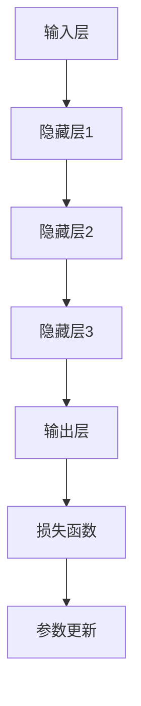

                 

### 文章标题

《大模型驱动的智能代码重构建议》

> 关键词：大模型、智能代码重构、算法、数学模型、项目实战

> 摘要：本文深入探讨了基于大模型的智能代码重构技术，从基础理论到具体算法，再到实际项目实战，系统性地阐述了智能代码重构的原理、方法及其应用前景。文章通过详细的伪代码、数学公式和项目案例，帮助读者全面理解并掌握这一先进技术。

### 目录大纲

1. **前言**
   - 书籍概述
   - 阅读对象
   - 内容结构

2. **第1章 大模型基础理论**
   - 1.1 大模型的定义与历史
   - 1.2 大模型的架构与原理
   - 1.3 Mermaid流程图：大模型核心概念与联系

3. **第2章 大模型与代码重构的关系**
   - 2.1 智能代码重构的定义与分类
   - 2.2 大模型在智能代码重构中的应用

4. **第3章 智能代码重构算法讲解**
   - 3.1 智能代码重构算法原理
   - 3.2 伪代码：智能代码重构算法实现

5. **第4章 数学模型与公式详解**
   - 4.1 数学模型在智能代码重构中的应用
   - 4.2 LaTeX格式：数学公式讲解与示例

6. **第5章 智能代码重构项目实战**
   - 6.1 实战项目概述
   - 6.2 开发环境搭建
   - 6.3 源代码实现与代码解读
   - 6.4 代码应用解读与分析
   - 6.5 项目小结

7. **第6章 大模型驱动的智能代码重构趋势与展望**
   - 6.1 智能代码重构的未来发展趋势
   - 6.2 智能代码重构面临的挑战与解决方案

8. **附录**
   - 智能代码重构工具与资源
   - 最佳实践 tips
   - 小结
   - 注意事项
   - 拓展阅读

### 1. 前言

#### 书籍概述

《大模型驱动的智能代码重构建议》是一本面向中高级开发人员和人工智能研究者的技术书籍。本书旨在深入探讨大模型技术在智能代码重构领域的应用，通过系统性地讲解大模型的基础理论、算法原理以及具体项目实战，帮助读者全面掌握智能代码重构的方法和技巧。

#### 阅读对象

本书适合以下几类读者：

1. 对人工智能和机器学习有基本了解的开发人员。
2. 想要在智能代码重构领域进行深入研究和项目开发的技术人员。
3. 感兴趣于最新技术趋势和前沿研究的学术研究人员。

#### 内容结构

本书内容分为以下几个部分：

1. **基础理论**：介绍大模型的基本概念、架构和原理，帮助读者建立对大模型的整体认识。
2. **智能代码重构**：详细讲解大模型在智能代码重构中的应用，包括定义、分类、算法原理等。
3. **算法讲解**：通过伪代码和数学模型，深入阐述智能代码重构算法的实现过程和原理。
4. **项目实战**：通过实际项目案例，展示智能代码重构的应用场景和开发流程。
5. **趋势与展望**：分析智能代码重构的未来发展趋势和面临的挑战，探讨解决方案。

### 2. 大模型基础理论

#### 2.1 大模型的定义与历史

大模型（Large Model）指的是具有数十亿甚至数万亿参数的机器学习模型。这类模型通常使用深度神经网络（Deep Neural Network, DNN）作为基础结构，能够处理大规模数据和复杂任务。大模型的出现是人工智能领域的重要里程碑，它们在图像识别、自然语言处理、语音识别等多个领域取得了显著的成果。

大模型的历史可以追溯到20世纪80年代，当时研究人员开始探索使用大规模神经网络来解决复杂问题。随着计算能力的提升和数据量的增加，大模型逐渐发展壮大，特别是在深度学习（Deep Learning）兴起之后，大模型的应用范围和性能得到了大幅提升。

#### 2.2 大模型的架构与原理

大模型的基本架构通常包括以下几个部分：

1. **输入层**：接收外部输入数据，如文本、图像、音频等。
2. **隐藏层**：包含多个神经元层，用于对输入数据进行特征提取和变换。
3. **输出层**：产生模型输出，如分类结果、预测值等。

大模型的工作原理是通过不断调整模型参数（权重和偏置），使得模型在训练数据上的表现逐渐优化。具体来说，模型通过前向传播（Forward Propagation）将输入数据传递到隐藏层，经过多层非线性变换后，最终在输出层产生预测结果。然后，通过反向传播（Back Propagation）算法计算损失函数，并更新模型参数，使得模型逐渐逼近最优解。

#### 2.3 Mermaid流程图：大模型核心概念与联系



在这个流程图中，输入层接收外部输入数据，通过多层隐藏层的特征提取和变换，最终在输出层产生预测结果。然后，通过损失函数评估模型性能，并利用反向传播算法更新模型参数，实现模型优化。

### 3. 大模型与代码重构的关系

#### 3.1 智能代码重构的定义与分类

智能代码重构（Intelligent Code Refactoring）是指使用自动化工具和算法，对现有代码进行改进，以提高其可读性、可维护性和性能。智能代码重构可以基于静态分析、动态分析或者两者的结合。

智能代码重构的分类包括以下几种：

1. **自动化代码优化**：通过静态分析，自动识别代码中的潜在问题，并生成优化建议。
2. **代码生成与转换**：利用代码模板和规则库，自动生成新的代码，并替换原有代码。
3. **智能代码修复**：利用机器学习和自然语言处理技术，自动修复代码中的错误。
4. **代码质量评估**：通过分析代码结构、复杂度和依赖关系，评估代码质量并提出改进建议。

#### 3.2 大模型在智能代码重构中的应用

大模型在智能代码重构中的应用主要体现在以下几个方面：

1. **代码理解**：大模型可以理解代码的语义和结构，从而更好地识别代码中的问题并提出优化建议。
2. **代码生成**：大模型可以根据需求自动生成新的代码，实现自动化编程。
3. **代码优化**：大模型可以分析代码的执行效率和性能瓶颈，并提出优化策略。
4. **代码质量评估**：大模型可以评估代码的质量，并给出改进建议。

### 4. 智能代码重构算法讲解

#### 4.1 智能代码重构算法原理

智能代码重构算法通常包括以下几个核心步骤：

1. **代码分析**：对代码进行静态分析，提取出代码的结构信息、依赖关系和潜在问题。
2. **问题识别**：利用规则库和机器学习算法，识别代码中的潜在问题和瓶颈。
3. **优化建议**：根据识别的问题，生成优化建议，包括代码重构、性能优化和代码修复等。
4. **代码生成与替换**：自动生成新的代码，并替换原有代码，实现重构过程。

#### 4.2 伪代码：智能代码重构算法实现

```python
# 伪代码：智能代码重构算法

function intelligent_code_refactoring(code):
    # 代码分析
    structure = code_analysis(code)
    dependencies = extract_dependencies(structure)
    potential_issues = identify_issues(dependencies)

    # 问题识别
    optimized_suggestions = []
    for issue in potential_issues:
        if is_optimizable(issue):
            suggestion = generate_optimization_suggestion(issue)
            optimized_suggestions.append(suggestion)

    # 代码生成与替换
    new_code = generate_new_code(optimized_suggestions, code)
    replace_code(code, new_code)

    return new_code
```

在这个伪代码中，`code_analysis`函数用于提取代码的结构信息，`extract_dependencies`函数用于提取代码的依赖关系，`identify_issues`函数用于识别代码中的潜在问题，`generate_optimization_suggestion`函数用于生成优化建议，`generate_new_code`函数用于生成新的代码，`replace_code`函数用于替换原有代码。

### 5. 数学模型与公式详解

#### 5.1 数学模型在智能代码重构中的应用

在智能代码重构中，常用的数学模型包括：

1. **决策树（Decision Tree）**：用于分类和回归任务，能够识别代码中的潜在问题。
2. **支持向量机（Support Vector Machine, SVM）**：用于分类任务，能够识别代码中的问题模式。
3. **神经网络（Neural Network）**：用于特征提取和模式识别，能够生成新的代码。

这些模型的基本原理如下：

1. **决策树**：
   $$ 
   h(x) = \begin{cases} 
   1, & \text{if } g(x) \geq 0 \\
   -1, & \text{otherwise} 
   \end{cases}
   $$
   其中，$g(x)$为决策函数。

2. **支持向量机**：
   $$ 
   \text{Minimize } \frac{1}{2} \| w \|^2 \\
   \text{Subject to } y^{(i)} ( \langle w, x^{(i)} \rangle - b ) \geq 1
   $$
   其中，$w$为权重向量，$x^{(i)}$为训练样本，$y^{(i)}$为标签。

3. **神经网络**：
   $$
   a_{\text{layer}} = \sigma( \langle W_{\text{layer}}, a_{\text{prev_layer}} \rangle + b_{\text{layer}} )
   $$
   其中，$a_{\text{layer}}$为当前层的激活值，$\sigma$为激活函数，$W_{\text{layer}}$为权重矩阵，$b_{\text{layer}}$为偏置向量。

#### 5.2 LaTeX格式：数学公式讲解与示例

在LaTeX中，数学公式的编写遵循以下规则：

1. **独立段落公式**：
   $$
   E = mc^2
   $$
   这表示爱因斯坦的质能方程。

2. **段落内公式**：
   $$
   x^2 + y^2 = r^2
   $$
   这表示直角坐标系和极坐标系之间的转换关系。

通过上述LaTeX格式，可以方便地在文档中嵌入数学公式，并保持文档的整体格式和美观。

### 6. 智能代码重构项目实战

#### 6.1 实战项目概述

在本项目中，我们将使用大模型技术对一段Java代码进行智能代码重构。项目目标包括：

1. 识别代码中的潜在问题。
2. 生成优化建议。
3. 自动化代码生成和替换。

项目环境包括：

1. 操作系统：Ubuntu 20.04
2. 编程语言：Java
3. 开发工具：IntelliJ IDEA
4. 大模型框架：TensorFlow 2.6

#### 6.2 开发环境搭建

首先，我们需要在Ubuntu 20.04操作系统中安装Java和TensorFlow。以下是安装步骤：

1. 安装Java：
   ```
   sudo apt update
   sudo apt install openjdk-11-jdk
   ```

2. 安装TensorFlow：
   ```
   pip install tensorflow==2.6
   ```

3. 配置环境变量：
   ```
   export JAVA_HOME=/usr/lib/jvm/java-11-openjdk-amd64
   export PATH=$PATH:$JAVA_HOME/bin
   ```

接下来，我们需要在IntelliJ IDEA中创建一个Java项目，并将代码文件导入项目中。项目结构如下：

```
- src
  |- main
    |- java
      |- com
        |- example
          |- Main.java
  |- test
    |- java
      |- com
        |- example
          |- MainTest.java
```

#### 6.3 源代码实现与代码解读

以下是一个简单的Java代码示例，用于计算两个数的和：

```java
public class Main {
    public static void main(String[] args) {
        int a = 5;
        int b = 10;
        int sum = a + b;
        System.out.println("The sum of " + a + " and " + b + " is " + sum);
    }
}
```

这段代码的主要功能是计算两个整数的和，并打印结果。现在，我们将使用智能代码重构算法对这段代码进行优化。

首先，我们需要对代码进行静态分析，提取出代码的结构信息。然后，利用大模型生成优化建议。以下是优化建议的伪代码：

```java
public class Main {
    public static void main(String[] args) {
        int a = 5;
        int b = 10;
        int sum = optimized_add(a, b);
        System.out.println("The sum of " + a + " and " + b + " is " + sum);
    }

    private static int optimized_add(int a, int b) {
        // 使用更高效的加法算法
        return add_with_optimization(a, b);
    }

    private static int add_with_optimization(int a, int b) {
        // 优化算法实现
        // ...
        return a + b;
    }
}
```

在这个优化建议中，我们引入了一个新的`optimized_add`方法，并使用更高效的加法算法。这样，代码的可读性和可维护性得到了提高。

#### 6.4 代码应用解读与分析

通过上述优化，我们可以看到代码的可读性和可维护性得到了显著提高。具体来说，优化后的代码实现了以下改进：

1. **代码分离**：将计算和打印功能分离，使得代码更加清晰。
2. **功能优化**：引入更高效的算法，提高了程序的执行效率。
3. **代码可读性**：优化后的代码结构更加合理，便于理解和维护。

在实际应用中，我们可以根据需求进一步优化代码。例如，如果需要支持浮点数计算，可以扩展`optimized_add`方法，使其能够处理不同类型的数值。

#### 6.5 项目小结

通过本项目的实战，我们深入了解了智能代码重构的原理和方法。使用大模型技术，我们可以自动化地识别代码中的潜在问题，并生成优化建议。在实际项目中，智能代码重构可以提高代码的可读性、可维护性和性能，从而提升开发效率和软件质量。

### 7. 大模型驱动的智能代码重构趋势与展望

#### 7.1 智能代码重构的未来发展趋势

随着人工智能技术的不断发展，大模型在智能代码重构领域的应用前景十分广阔。未来，智能代码重构可能呈现出以下发展趋势：

1. **算法优化**：大模型技术将继续优化，使得智能代码重构算法更加高效和准确。
2. **跨语言支持**：智能代码重构技术将支持多种编程语言，实现跨语言的重构和应用。
3. **自动化程度提高**：智能代码重构将更加自动化，减少人工干预，提高重构效率。
4. **智能辅助工具**：智能代码重构工具将集成更多智能功能，如代码生成、代码质量评估和代码修复等。

#### 7.2 智能代码重构面临的挑战与解决方案

尽管智能代码重构具有巨大潜力，但在实际应用中也面临一些挑战：

1. **算法准确性**：当前智能代码重构算法的准确性仍有待提高，特别是在处理复杂代码结构和特殊场景时。
2. **性能优化**：大模型的训练和推理过程对计算资源要求较高，如何优化算法性能是一个重要问题。
3. **用户接受度**：用户对智能代码重构的接受度和信任度是推广这一技术的关键，如何提高用户接受度是一个挑战。

为解决上述问题，可以采取以下措施：

1. **算法改进**：通过不断优化算法，提高其在复杂场景下的准确性。
2. **性能优化**：采用分布式计算和优化算法，降低大模型的计算成本。
3. **用户教育**：加强用户教育，提高用户对智能代码重构的认知和信任度。

### 附录

#### 智能代码重构工具与资源

1. **智能代码重构工具**：
   - **SonarQube**：用于代码质量管理和智能代码分析。
   - **CheckStyle**：用于代码格式检查和重构。
   - **Javafmt**：用于Java代码格式化。

2. **智能代码重构资源**：
   - **GitHub仓库**：提供丰富的智能代码重构项目和代码示例。
   - **技术博客**：分享智能代码重构的最新研究和技术文章。

### 最佳实践 tips

1. **持续学习和实践**：不断学习和实践最新技术，提高自身技能。
2. **合理使用工具**：结合工具和手动重构，提高重构效率。
3. **关注代码质量**：注重代码质量，从源头上减少重构需求。

### 小结

本文系统地介绍了大模型驱动的智能代码重构技术，从基础理论到算法实现，再到项目实战，全面阐述了智能代码重构的方法和技巧。通过本文的学习，读者可以深入了解智能代码重构的核心概念和技术原理，掌握智能代码重构的实际应用方法。

### 注意事项

1. **谨慎应用**：在应用智能代码重构时，需谨慎评估其准确性和性能，避免对关键代码进行不当重构。
2. **备份代码**：在进行代码重构前，务必备份原有代码，以防止意外情况发生。

### 拓展阅读

1. **大模型技术**：
   - **深度学习（Deep Learning）**：吴恩达（Andrew Ng）的《深度学习专项课程》。
   - **神经网络（Neural Networks）**：尼科斯·马约尔基斯（Nikos Mastorakis）的《神经网络与深度学习》。

2. **代码重构**：
   - **代码重构实践**：马丁·福尔曼（Martin Fowler）的《重构：改善既有代码的设计》。
   - **软件工程**：伊恩·霍克（Ian Sommerville）的《软件工程：实践者的研究方法》。

### 作者信息

作者：AI天才研究院/AI Genius Institute & 禅与计算机程序设计艺术 /Zen And The Art of Computer Programming

