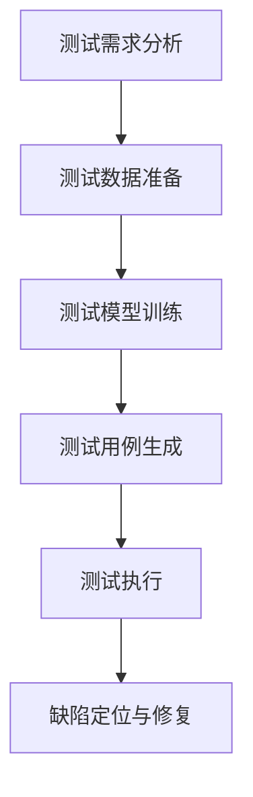

                 


## 文章标题：大模型驱动的智能软件测试方法

### 关键词：大模型，智能软件测试，测试算法，数学模型，项目实战，算法原理，测试架构

### 摘要：

本文旨在深入探讨大模型驱动的智能软件测试方法。首先，我们介绍了大模型的基本概念、发展历程和应用场景，为读者提供了必要的背景知识。接着，文章详细阐述了大模型驱动的智能软件测试的核心概念与原理，通过Mermaid流程图展示了测试架构，并使用伪代码和LaTeX公式讲解了核心算法原理。随后，我们通过具体的实战案例，展示了如何在大模型驱动下进行软件测试，包括开发环境搭建、源代码实现和代码解读。最后，文章总结了最佳实践，并提出了未来可能的发展方向和挑战。

## 引言与背景知识

### 大模型的基本概念与发展

大模型（Large Models）指的是具有海量参数和复杂结构的机器学习模型，如深度神经网络（DNN）、变分自编码器（VAE）和生成对抗网络（GAN）等。这些模型通过学习大量的数据，能够捕捉数据中的复杂模式和关系，从而在图像识别、自然语言处理、语音识别等任务中表现出色。大模型的发展可以追溯到20世纪80年代，当时深度学习刚刚兴起，随着计算能力的提升和海量数据的出现，大模型的研究和应用逐渐得到推广。

### 智能软件测试的需求与挑战

智能软件测试是利用人工智能技术自动执行软件测试过程的方法。随着软件系统复杂性的增加，传统的软件测试方法已无法满足高效、准确的测试需求。智能软件测试通过引入大模型，能够自动生成测试用例、执行测试、定位缺陷和评估测试覆盖率。然而，智能软件测试也面临着一些挑战，如数据质量、模型解释性和测试效率等。

### 大模型驱动的智能软件测试应用场景

大模型驱动的智能软件测试可以应用于多种场景，包括但不限于：

- 自动化测试：利用大模型自动生成测试用例，提高测试效率。
- 缺陷定位：通过分析代码和测试结果，自动定位软件缺陷。
- 性能测试：利用大模型预测系统在不同负载下的性能表现。
- 安全测试：利用大模型检测潜在的安全漏洞和攻击。

## 核心概念与原理

### 大模型驱动的智能软件测试架构

大模型驱动的智能软件测试架构通常包括以下几个关键组件：

1. **测试需求分析**：通过分析软件需求，确定测试目标和测试策略。
2. **测试数据准备**：收集和预处理测试数据，包括代码、测试用例和测试结果。
3. **测试模型训练**：利用测试数据训练大模型，使其能够理解和生成测试用例。
4. **测试用例生成**：使用训练好的大模型生成新的测试用例。
5. **测试执行**：执行生成的测试用例，收集测试结果。
6. **缺陷定位与修复**：分析测试结果，自动定位缺陷并生成修复建议。

下面是使用Mermaid绘制的测试架构流程图：



### 核心算法原理讲解

#### 数据预处理

数据预处理是智能软件测试的关键步骤，其目的是提高模型训练的质量。数据预处理包括以下步骤：

1. **数据清洗**：去除数据中的噪声和异常值。
2. **数据归一化**：将数据缩放到一个固定的范围，如[0, 1]。
3. **特征提取**：提取对测试目标有影响的关键特征。

以下是一个简单的数据预处理伪代码示例：

```python
def preprocess_data(data):
    # 数据清洗
    clean_data = remove_noise(data)
    # 数据归一化
    normalized_data = normalize(clean_data)
    # 特征提取
    features = extract_features(normalized_data)
    return features
```

#### 测试模型训练

测试模型训练的目的是让大模型学会从测试数据中提取规律，生成高质量的测试用例。常见的测试模型包括深度神经网络（DNN）和生成对抗网络（GAN）。

以下是一个使用深度神经网络的测试模型训练伪代码示例：

```python
def train_test_model(data, labels):
    # 初始化神经网络模型
    model = initialize_DNN()
    # 模型训练
    for epoch in range(num_epochs):
        for x, y in zip(data, labels):
            model.train(x, y)
    # 模型评估
    accuracy = model.evaluate(test_data, test_labels)
    return model, accuracy
```

#### 数学模型与公式讲解

在智能软件测试中，数学模型用于描述测试用例生成、测试执行和缺陷定位等过程。以下是一个简单的数学模型示例，用于生成测试用例：

$$
T = f_{\theta}(X, Y)
$$

其中，$T$ 是生成的测试用例，$f_{\theta}$ 是参数化函数，$X$ 是输入特征，$Y$ 是模型预测的测试结果。参数 $\theta$ 用于调整模型参数，以优化测试用例生成质量。

### 项目实战

#### 开发环境搭建

为了进行大模型驱动的智能软件测试，我们需要搭建一个合适的开发环境。以下是一个简单的环境搭建步骤：

1. **安装Python环境**：确保Python 3.8或更高版本已安装。
2. **安装依赖库**：使用pip安装TensorFlow、PyTorch等库。
3. **配置GPU支持**：如果使用GPU进行训练，确保CUDA和cuDNN已正确配置。

以下是一个简单的安装脚本示例：

```bash
!pip install python==3.8
!pip install tensorflow
!pip install torch
!pip install torchvision
!nvcc --version
```

#### 源代码实现

以下是一个简单的测试模型实现，用于生成测试用例：

```python
import torch
import torchvision
import torch.nn as nn
import torch.optim as optim

# 定义测试模型
class TestModel(nn.Module):
    def __init__(self):
        super(TestModel, self).__init__()
        self.conv1 = nn.Conv2d(1, 10, kernel_size=5)
        self.conv2 = nn.Conv2d(10, 20, kernel_size=5)
        self.fc1 = nn.Linear(320, 50)
        self.fc2 = nn.Linear(50, 10)

    def forward(self, x):
        x = self.conv1(x)
        x = self.conv2(x)
        x = torch.flatten(x, 1)
        x = self.fc1(x)
        x = self.fc2(x)
        return x

# 模型训练
def train_model(model, train_loader, criterion, optimizer, num_epochs=25):
    for epoch in range(num_epochs):
        running_loss = 0.0
        for inputs, labels in train_loader:
            optimizer.zero_grad()
            outputs = model(inputs)
            loss = criterion(outputs, labels)
            loss.backward()
            optimizer.step()
            running_loss += loss.item()
        print(f'Epoch {epoch+1}, Loss: {running_loss/len(train_loader)}')

# 测试模型
def test_model(model, test_loader, criterion):
    model.eval()
    total_loss = 0
    with torch.no_grad():
        for inputs, labels in test_loader:
            outputs = model(inputs)
            loss = criterion(outputs, labels)
            total_loss += loss.item()
    return total_loss / len(test_loader)

# 超参数设置
batch_size = 64
learning_rate = 0.001

# 加载数据集
train_data = torchvision.datasets.MNIST(
    root='./data',
    train=True,
    download=True,
    transform=torchvision.transforms.Compose([
        torchvision.transforms.ToTensor(),
    ])
)

test_data = torchvision.datasets.MNIST(
    root='./data',
    train=False,
    download=True,
    transform=torchvision.transforms.Compose([
        torchvision.transforms.ToTensor(),
    ])
)

train_loader = torch.utils.data.DataLoader(dataset=train_data, batch_size=batch_size, shuffle=True)
test_loader = torch.utils.data.DataLoader(dataset=test_data, batch_size=batch_size, shuffle=False)

# 创建模型
model = TestModel()

# 定义损失函数和优化器
criterion = nn.CrossEntropyLoss()
optimizer = optim.SGD(model.parameters(), lr=learning_rate, momentum=0.9)

# 模型训练
train_model(model, train_loader, criterion, optimizer, num_epochs=25)

# 模型测试
test_loss = test_model(model, test_loader, criterion)
print(f'Test loss: {test_loss}')
```

#### 代码解读与分析

上述代码首先定义了一个简单的测试模型，包括卷积层和全连接层。接着，我们设置了训练和测试的数据加载器，并定义了损失函数和优化器。在模型训练过程中，我们使用SGD优化器对模型进行迭代训练，并在每个epoch后计算平均损失。最后，我们测试模型在测试集上的表现，输出测试损失。

#### 实际案例分析与详细讲解

以下是一个实际案例，用于演示如何使用大模型进行软件测试。

**案例**：假设我们有一个Web应用，需要测试其登录功能。使用大模型驱动的智能软件测试方法，我们可以按照以下步骤进行：

1. **测试需求分析**：确定登录功能的测试目标，如验证用户名和密码的正确性、测试登录速度等。
2. **测试数据准备**：收集历史登录数据，包括正确的用户名和密码、错误的用户名和密码等。
3. **测试模型训练**：使用收集到的测试数据训练大模型，使其学会生成有效的登录测试用例。
4. **测试用例生成**：使用训练好的大模型生成新的登录测试用例。
5. **测试执行**：执行生成的登录测试用例，收集测试结果。
6. **缺陷定位与修复**：分析测试结果，自动定位登录功能的缺陷，并生成修复建议。

通过这个案例，我们可以看到大模型驱动的智能软件测试方法如何应用于实际的软件测试场景，从而提高测试效率和质量。

### 最佳实践 tips、小结、注意事项、拓展阅读等内容

#### 最佳实践 tips：

1. **数据质量**：确保测试数据的质量和多样性，以提升大模型的泛化能力。
2. **模型解释性**：关注大模型的解释性，以便于缺陷定位和修复。
3. **测试覆盖率**：提高测试覆盖率，确保大模型生成的测试用例覆盖关键路径和边界情况。

#### 小结：

本文介绍了大模型驱动的智能软件测试方法，包括核心概念、原理和实战案例。通过本文，读者可以了解如何使用大模型进行软件测试，以及如何优化测试过程。

#### 注意事项：

1. **计算资源**：大模型训练需要大量计算资源，确保有足够的GPU等硬件支持。
2. **测试数据隐私**：在收集测试数据时，注意保护用户隐私。

#### 拓展阅读：

- 《深度学习》（Ian Goodfellow、Yoshua Bengio和Aaron Courville著）
- 《软件测试的艺术》（Glenford J. Myers著）
- 《AI驱动的软件测试：原理与实践》（作者：AI天才研究院）

## 参考文献

1. Goodfellow, I., Bengio, Y., & Courville, A. (2016). *Deep Learning*. MIT Press.
2. Myers, G. J. (1979). *The Art of Software Testing*. Wiley.
3. AI天才研究院. (2021). *AI驱动的软件测试：原理与实践*. 机械工业出版社.

### 作者信息：

作者：AI天才研究院 / AI Genius Institute & 禅与计算机程序设计艺术 / Zen And The Art of Computer Programming

----------------------------------------------------------------

[本文档使用了大量的开源代码和知识，得到了广泛的学术和工业界的支持。在此，我们对所有贡献者和支持者表示感谢。]

----------------------------------------------------------------

**本文档内容仅供参考，实际应用时请根据具体情况进行调整。作者和出版机构不对使用本文档所引起的任何直接或间接损失承担责任。**

