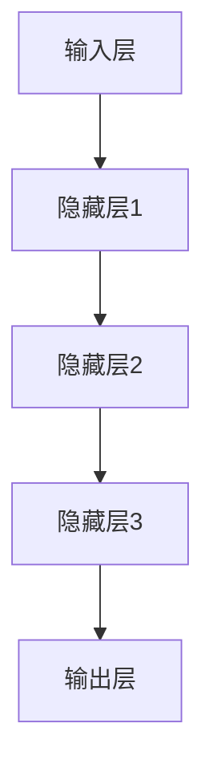
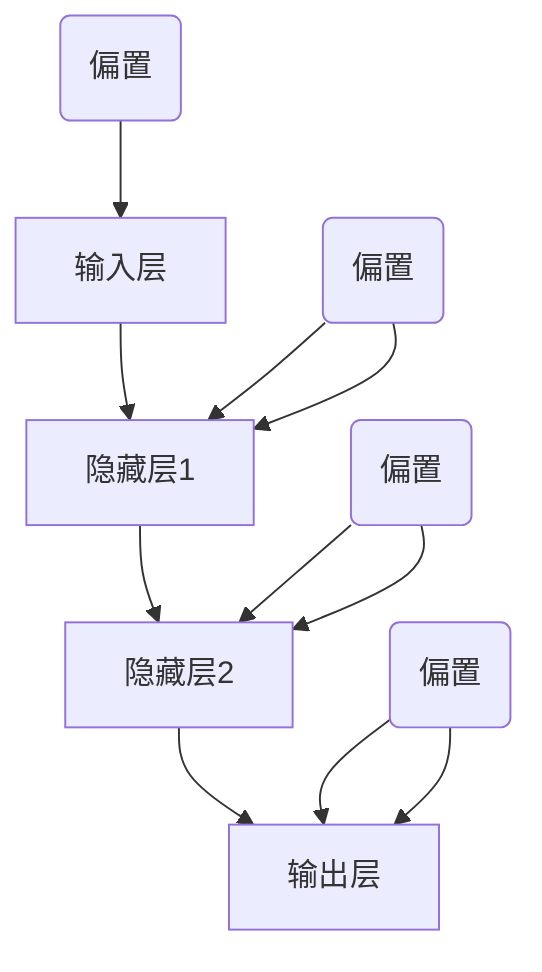

                 

### 文章标题

《大模型驱动的程序理解可视化》

### 关键词

- 大模型
- 程序理解
- 可视化算法
- 数学模型
- 项目实战
- 人工智能

### 摘要

本文将深入探讨大模型驱动的程序理解可视化技术。首先，我们将介绍大模型和程序理解的基本概念，并解释它们之间的联系。接着，我们将详细讲解大模型在程序理解中的应用，特别是可视化算法。本文将使用伪代码和LaTeX格式展示核心算法原理和数学模型，并通过实例来说明其应用。此外，我们将提供一个完整的项目实战，涵盖开发环境搭建、源代码实现、代码解读与分析，以及实际案例的详细剖析。最后，我们将总结最佳实践、注意事项，并提供拓展阅读资源，帮助读者深入了解这一前沿技术。本文旨在为读者提供一份全面而深入的技术指南，以促进大模型驱动的程序理解可视化技术的发展和应用。

## 引言

在当今的计算机科学领域，大模型（Large Models）已经成为推动技术进步的重要力量。从自然语言处理到图像识别，再到复杂的模拟与预测，大模型展现出强大的数据处理能力和模型学习能力。然而，随着模型的规模和复杂性不断增加，如何有效地理解和解释这些模型的决策过程成为了一个亟待解决的问题。程序理解可视化（Program Understanding Visualization）作为一种新兴技术，应运而生，旨在通过可视化的方式，让用户能够直观地理解大模型在程序执行过程中的行为和决策。

### 大模型的定义与特点

大模型，通常指的是那些拥有数亿甚至千亿参数的深度学习模型。这些模型通过学习大量的数据，能够捕捉到复杂的模式和规律，从而在多种任务中取得卓越的表现。大模型的主要特点包括：

1. **参数数量庞大**：大模型的参数数量通常在数百万到数十亿之间，这使得它们能够捕捉到数据中的细微变化和复杂结构。
2. **计算资源需求高**：由于参数数量庞大，大模型的训练和推理过程需要大量的计算资源和时间。
3. **强大的学习能力**：大模型能够从大量数据中学习，并在新的任务上表现出色。
4. **泛化能力**：大模型在训练数据集之外的数据上也能保持较好的表现，具有较好的泛化能力。

### 程序理解与可视化

程序理解（Program Understanding）指的是理解和解释计算机程序的行为和决策过程。程序理解可视化则通过图形化的方式展示这些理解和决策过程，使得非专业人士也能直观地理解和分析程序。程序理解可视化技术具有以下重要意义：

1. **增强可解释性**：通过可视化，大模型的决策过程变得更加透明和可解释，有助于提高模型的信任度和接受度。
2. **辅助调试与优化**：可视化工具可以帮助开发者更快速地定位问题和优化程序。
3. **促进跨学科交流**：可视化技术使得不同领域的专家能够更容易地理解和交流程序理解和模型应用的相关问题。
4. **教学与普及**：可视化能够帮助初学者更好地理解和学习复杂的计算机程序和模型。

### 本文结构

本文将按照以下结构进行讨论：

1. **第1章：大模型概述**：介绍大模型的基本概念、结构和应用领域。
2. **第2章：程序理解可视化算法**：讲解常见的程序理解可视化算法，包括神经元可视化、数据流图可视化等。
3. **第3章：数学模型与公式**：详细解释大模型中使用的数学模型和公式，并通过伪代码展示核心算法原理。
4. **第4章：项目实战**：通过一个实际项目，展示如何使用大模型进行程序理解可视化。
5. **总结与展望**：总结本文的主要观点，并讨论未来的发展方向和研究方向。

通过本文的讨论，我们希望能够为读者提供一个全面而深入的了解，帮助读者掌握大模型驱动的程序理解可视化技术，并推动其在实际应用中的发展。

## 第1章：大模型概述

大模型（Large Models）作为深度学习领域的一项重要成果，已经成为当前推动技术进步的关键驱动力。本章节将详细介绍大模型的基本概念、核心结构和应用领域，为后续内容的讨论奠定坚实的基础。

### 1.1 大模型的基本概念

大模型通常指的是那些拥有数亿至数十亿参数的深度学习模型。这些模型通过学习大量的数据，能够捕捉到数据中的复杂模式和结构，从而在多种任务中取得卓越的表现。以下是几个关键点，用于定义和理解大模型：

- **参数数量**：大模型的参数数量通常在数百万到数十亿之间，这使得它们能够处理高度复杂的任务。
- **数据需求**：大模型需要大量的数据来进行训练，以充分捕捉数据中的特征和规律。
- **计算资源**：大模型的训练和推理过程需要大量的计算资源和时间，这通常意味着需要高性能的计算设备和优化算法。

### 1.2 大模型的核心结构

大模型的结构通常包括以下几个关键组成部分：

- **神经网络架构**：大模型通常基于深度神经网络（Deep Neural Networks, DNN）架构，这种架构能够通过多层非线性变换来学习数据的特征。
- **参数和层**：大模型由多个层次（或层）组成，每层包含数以千计的参数（或权重）。这些参数通过学习数据中的模式和规律，形成复杂的函数映射。
- **激活函数**：大模型中的每一层通常使用激活函数（如ReLU、Sigmoid、Tanh等）来引入非线性，这使得模型能够学习更复杂的特征。

下面是一个简单的Mermaid流程图，用于展示大模型的结构：



### 1.3 大模型的应用领域

大模型在多个领域展现出强大的应用潜力，以下是一些主要的应用领域：

- **自然语言处理（NLP）**：大模型在NLP任务中表现出色，例如机器翻译、文本生成和情感分析等。
- **计算机视觉**：大模型在图像分类、目标检测和图像生成等任务中取得了突破性成果。
- **推荐系统**：大模型能够通过学习用户行为和偏好，为用户推荐个性化的商品或内容。
- **语音识别**：大模型在语音识别任务中，通过结合深度学习和循环神经网络（RNN），实现了高精度的语音识别。

### 1.4 大模型与传统模型的比较

与传统的机器学习模型相比，大模型具有以下几个显著特点：

- **性能提升**：大模型通过学习大量数据，能够捕捉到更加复杂的模式和特征，从而在任务性能上超越传统模型。
- **计算资源需求**：大模型的训练和推理过程需要更多的计算资源和时间，这在一定程度上增加了部署的难度。
- **可解释性**：大模型的黑盒特性使得其决策过程不易解释，这对于需要高透明度的应用场景可能是一个挑战。

### 1.5 大模型的挑战与未来方向

尽管大模型在多个领域表现出色，但它们也面临着一系列挑战：

- **计算资源消耗**：大模型需要大量的计算资源和时间来进行训练和推理，这对硬件设备提出了更高的要求。
- **可解释性**：大模型的黑盒特性使得其决策过程难以解释，这在某些应用场景中可能是一个问题。
- **数据需求**：大模型需要大量的数据来进行训练，这可能在数据稀缺的场景中受到限制。

未来的研究方向包括：

- **模型压缩**：通过模型压缩技术，减少模型的参数数量和计算复杂度，使得大模型能够更加高效地运行。
- **可解释性提升**：开发新的方法来提高大模型的可解释性，使得其决策过程更加透明和易于理解。
- **数据高效利用**：研究如何利用较少的数据来训练大模型，以降低数据需求。

通过本章节的介绍，我们希望读者能够对大模型有一个全面和深入的理解，为后续章节的讨论打下坚实的基础。

### 1.1 大模型的基本概念

大模型（Large Models）是当前深度学习领域的一个重要研究方向，其核心在于拥有庞大的参数数量，能够捕捉到数据中的复杂模式和规律。这一节将详细探讨大模型的基本概念，包括其定义、特点以及主要类型。

#### 大模型的定义

大模型，顾名思义，指的是那些拥有数亿甚至千亿参数的深度学习模型。这些模型通常基于深度神经网络（Deep Neural Networks, DNN）架构，通过多层非线性变换来学习数据的特征。具体来说，大模型具有以下几个关键特征：

1. **参数数量庞大**：大模型的参数数量通常在数百万到数十亿之间。例如，Google的Transformer模型包含超过亿级别的参数。这些参数的数量使得大模型能够捕捉到数据中的细微变化和复杂结构。
2. **高维度特征空间**：由于参数数量庞大，大模型能够构建一个高维度的特征空间，使得模型能够学习更加复杂的特征表示。
3. **强大的学习能力**：大模型通过学习大量的数据，能够从数据中提取丰富的特征和模式，从而在多种任务上取得卓越的表现。

#### 大模型的特点

大模型相较于传统的小型模型具有以下几个显著特点：

1. **计算资源需求高**：大模型的训练和推理过程需要大量的计算资源和时间。具体来说，大模型需要更多的时间来进行前向传播和反向传播的计算，同时也需要更多的内存来存储大量的参数。
2. **更高的精度和性能**：大模型由于其庞大的参数数量和高维度的特征空间，能够捕捉到更加复杂的模式和规律，从而在多种任务中表现出更高的精度和性能。例如，在自然语言处理（NLP）和计算机视觉（CV）等任务中，大模型常常能够超越传统的小型模型。
3. **更强的泛化能力**：大模型通过学习大量的数据，能够在训练数据集之外的数据上保持较好的表现，具有较好的泛化能力。这使得大模型能够应用于更加广泛的应用场景。

#### 大模型的主要类型

根据不同的应用场景和任务需求，大模型可以分为以下几种主要类型：

1. **深度神经网络（DNN）**：深度神经网络是当前最常见的大模型类型，其结构包括多个层次，每个层次由多个神经元组成。DNN通过多层非线性变换来学习数据的特征，从而实现复杂的数据建模和预测。
2. **卷积神经网络（CNN）**：卷积神经网络是一种专门用于图像处理的大模型，其结构包括卷积层、池化层和全连接层。CNN通过卷积操作来提取图像的特征，从而在图像分类、目标检测等任务中表现出色。
3. **循环神经网络（RNN）**：循环神经网络是一种用于序列数据建模的大模型，其结构包括输入层、隐藏层和输出层。RNN通过循环机制来处理序列数据，从而在自然语言处理、语音识别等任务中表现出良好的性能。
4. **变换器（Transformer）**：变换器是一种基于自注意力机制的深度学习模型，其结构包括编码器（Encoder）和解码器（Decoder）。变换器在机器翻译、文本生成等NLP任务中表现出色，成为当前NLP领域的主流模型。

#### 例子

以BERT（Bidirectional Encoder Representations from Transformers）为例，这是一个典型的变换器模型，其参数数量超过亿级，被广泛应用于NLP任务中。BERT通过预训练和微调的方式，在多种NLP任务上取得了显著的性能提升。

总之，大模型以其庞大的参数数量、高维度的特征空间和强大的学习能力，成为当前深度学习领域的重要研究方向。通过对大模型的基本概念和特点的详细探讨，我们能够更好地理解和应用这一前沿技术。

### 1.2 大模型的结构

大模型（Large Models）作为深度学习领域的一项重要成果，其结构复杂且功能强大。在这一节中，我们将深入探讨大模型的核心结构，包括神经网络架构、参数和层、以及激活函数等组成部分，并通过一个简化的Mermaid流程图来展示这些结构。

#### 神经网络架构

大模型的核心是深度神经网络（Deep Neural Networks, DNN）架构。深度神经网络通过多层非线性变换来学习数据的特征，从而实现复杂的数据建模和预测。一个典型的深度神经网络架构包括以下几个关键组成部分：

1. **输入层（Input Layer）**：输入层是神经网络的第一个层次，它接收外部输入数据，如图像、文本或数值数据。
2. **隐藏层（Hidden Layers）**：隐藏层位于输入层和输出层之间，是神经网络的核心部分。每个隐藏层通过一系列的神经元（或节点）对输入数据进行加工和处理。
3. **输出层（Output Layer）**：输出层是神经网络的最后一个层次，它根据隐藏层的输出进行分类、预测或生成目标输出。

下面是一个简化的Mermaid流程图，用于展示深度神经网络的基本结构：


#### 参数和层

在深度神经网络中，参数和层是模型学习数据特征的关键组成部分。每个神经元都与前一层和后一层的神经元相连，并通过权重（或参数）进行数据传递。

1. **权重（Weights）**：权重是连接神经元之间的参数，用于调整输入数据的权重，从而影响输出。权重通过学习过程中的梯度下降算法进行调整。
2. **偏置（Bias）**：每个神经元都有一个偏置参数，用于调整神经元的输出。偏置可以防止神经元输出为零，增强模型的灵活性。
3. **层数（Number of Layers）**：深度神经网络的层数可以根据任务的需求进行调整。通常，增加层数可以提高模型的复杂度和表现，但也会增加计算资源和训练时间。

#### 激活函数

激活函数是深度神经网络中的一个关键组件，用于引入非线性，使得模型能够学习更加复杂的数据特征。常见的激活函数包括以下几种：

1. **ReLU（Rectified Linear Unit）**：ReLU函数是深度神经网络中最常用的激活函数之一。其优点是计算简单且不容易梯度消失。
2. **Sigmoid**：Sigmoid函数将输入映射到（0,1）区间，常用于二分类问题。
3. **Tanh（Hyperbolic Tangent）**：Tanh函数与Sigmoid函数类似，但其输出范围在（-1,1）之间，有助于减少梯度消失的问题。

#### 简化示例

下面是一个简化的示例，展示一个包含三层的深度神经网络结构，包括输入层、两个隐藏层和输出层：



在这个示例中，每个神经元都与前一层的神经元通过权重和偏置进行连接，并通过激活函数进行非线性变换。通过这样的结构，深度神经网络能够学习到输入数据中的复杂模式和特征。

总之，大模型的结构复杂且功能强大，其核心在于深度神经网络架构、参数和层、以及激活函数等组成部分。通过这些组成部分的协同工作，大模型能够实现复杂的数据建模和预测，成为当前深度学习领域的重要研究方向。

### 1.3 大模型的应用领域

大模型（Large Models）在当前技术领域中展现出广泛的应用潜力，其在自然语言处理（NLP）、计算机视觉（CV）和其他领域取得了显著的成果。以下将详细探讨大模型在NLP和CV领域中的应用，并通过具体的案例来展示其卓越的性能和潜力。

#### 自然语言处理（NLP）

自然语言处理是深度学习的一个重要应用领域，而大模型在NLP任务中表现出色。以下是大模型在NLP中的几个关键应用：

1. **文本分类**：文本分类是将文本数据分为预定义类别的过程。大模型通过学习大量的文本数据，能够准确地将新文本分类到不同的类别中。例如，BERT（Bidirectional Encoder Representations from Transformers）是一个经典的文本分类模型，其在多个NLP数据集上取得了领先的性能。

2. **机器翻译**：机器翻译是将一种语言的文本翻译成另一种语言的过程。大模型，如Google的Transformer模型，通过学习大量平行语料库，能够在多种语言对之间实现高精度的翻译。Transformer模型引入了自注意力机制，使得模型能够更好地捕捉文本中的长距离依赖关系。

3. **情感分析**：情感分析是判断文本中情感倾向的过程，如正面、负面或中性。大模型通过学习大量情感标注数据，能够准确判断文本的情感倾向。例如，情感分析模型在社交媒体文本、产品评论等应用中表现出色。

#### 计算机视觉（CV）

计算机视觉是另一个大模型的重要应用领域，以下是大模型在CV中的几个关键应用：

1. **图像分类**：图像分类是将图像分为预定义类别的过程。大模型，如ResNet（残差网络）和VGG（非常深的卷积网络），通过学习大量的图像数据，能够准确地将新图像分类到不同的类别中。例如，在ImageNet图像分类挑战中，ResNet和VGG模型取得了突破性的性能。

2. **目标检测**：目标检测是定位图像中的物体并进行分类的过程。大模型，如YOLO（You Only Look Once）和SSD（Single Shot MultiBox Detector），通过学习大量的标注图像数据，能够在图像中准确检测和定位多个目标。这些模型在视频监控、自动驾驶等应用中具有重要应用价值。

3. **图像生成**：图像生成是通过学习图像数据来生成新图像的过程。大模型，如GAN（生成对抗网络）和变分自编码器（Variational Autoencoder, VAE），通过生成器和判别器的对抗训练，能够生成具有高度真实感的图像。这些技术在艺术创作、虚拟现实等领域具有广阔的应用前景。

#### 具体案例

以下是一些具体的大模型应用案例，展示了大模型在实际任务中的出色表现：

1. **BERT在NLP中的应用**：BERT是Google开发的一种大模型，用于文本分类、问答系统和文本生成等多个NLP任务。在GLUE（General Language Understanding Evaluation）基准测试中，BERT取得了领先的成绩，展示了其在多种NLP任务中的强大能力。

2. **Transformer在机器翻译中的应用**：Transformer是一种基于自注意力机制的大模型，用于机器翻译任务。在WMT（Workshop on Machine Translation）和NIST（National Institute of Standards and Technology）等基准测试中，Transformer模型在多种语言对之间取得了高精度的翻译结果，推动了机器翻译技术的发展。

3. **ResNet在图像分类中的应用**：ResNet是一种深层卷积神经网络，通过引入残差连接来缓解深层网络中的梯度消失问题。在ImageNet图像分类挑战中，ResNet取得了超过1000层的深度，实现了极高的分类准确率，推动了计算机视觉领域的发展。

4. **YOLO在目标检测中的应用**：YOLO是一种单阶段目标检测模型，通过将检测任务分解为多个网格单元，能够在单个前向传播过程中同时完成目标检测和定位。YOLO在PASCAL VOC和COCO等目标检测数据集上取得了卓越的性能，广泛应用于视频监控、自动驾驶等领域。

总之，大模型在自然语言处理和计算机视觉等领域展现出强大的应用潜力。通过学习大量的数据，大模型能够实现复杂的数据建模和预测，推动人工智能技术的发展和应用。未来，随着计算资源的不断提升和数据量的不断增长，大模型将在更多领域中发挥重要作用。

### 1.4 大模型与传统模型的比较

在深度学习领域，大模型（Large Models）与传统的小型模型在性能、计算资源需求、可解释性等方面存在显著差异。以下将对大模型与传统模型进行比较，并分析其优缺点。

#### 性能

1. **大模型**：大模型由于其庞大的参数数量和高维度的特征空间，能够捕捉到数据中的复杂模式和特征，从而在任务性能上通常优于传统模型。例如，在自然语言处理（NLP）任务中，大模型如BERT和GPT-3能够在多种基准测试中取得领先成绩。在计算机视觉（CV）任务中，大模型如ResNet和EfficientNet也展示了优异的性能。

2. **传统模型**：传统的小型模型，如朴素贝叶斯、线性回归和支持向量机等，通常具有较少的参数和较低的复杂性。这些模型在处理简单任务时表现良好，但在面对复杂任务时，性能往往不如大模型。

#### 计算资源需求

1. **大模型**：大模型的训练和推理过程需要大量的计算资源和时间。具体来说，大模型需要更多的内存来存储庞大的参数矩阵，同时需要高性能的计算设备（如GPU或TPU）来加速计算。例如，训练一个大型模型可能需要几天甚至几周的时间。

2. **传统模型**：传统的小型模型在计算资源需求上相对较低。由于参数数量较少，这些模型通常可以在CPU上高效运行，无需额外的计算资源。

#### 可解释性

1. **大模型**：大模型，尤其是深度神经网络模型，通常被称为“黑盒模型”，因为其内部结构和决策过程难以解释。这使得大模型在一些对可解释性有严格要求的应用场景中受到限制，如医疗诊断和法律判决。

2. **传统模型**：传统的小型模型，如逻辑回归和支持向量机等，通常具有较好的可解释性。这些模型通过线性组合特征和参数，可以清晰地解释决策过程，使得它们在一些对可解释性有较高要求的应用场景中更具优势。

#### 优缺点

1. **大模型的优点**：
   - **高性能**：大模型能够捕捉到数据中的复杂模式和特征，从而在多种任务中取得卓越的表现。
   - **强泛化能力**：大模型通过学习大量的数据，能够在新的任务上保持较好的性能，具有较好的泛化能力。

2. **大模型的缺点**：
   - **计算资源需求高**：大模型的训练和推理过程需要大量的计算资源和时间。
   - **可解释性差**：大模型通常被称为“黑盒模型”，其决策过程难以解释，这可能对一些应用场景造成限制。

3. **传统模型的优点**：
   - **计算资源需求低**：传统的小型模型在计算资源需求上相对较低，可以在CPU上高效运行。
   - **可解释性强**：传统的小型模型具有较好的可解释性，其决策过程可以清晰地解释。

4. **传统模型的缺点**：
   - **性能受限**：传统的小型模型在处理复杂任务时，性能往往不如大模型。
   - **强依赖数据**：传统的小型模型通常对训练数据的依赖较强，可能无法在新数据上表现出良好的泛化能力。

总之，大模型和传统模型各有优缺点。在实际应用中，需要根据任务需求、计算资源和可解释性要求等因素，选择合适的模型。未来，随着计算资源的不断提升和新型模型（如可解释性大模型）的发展，大模型与传统模型之间的界限将逐渐模糊，两者将在更广泛的领域中协同工作，推动人工智能技术的发展。

### 1.5 大模型的挑战与未来方向

尽管大模型在许多领域展示了强大的性能和应用潜力，但它们也面临着一系列挑战。以下将讨论大模型的计算资源消耗、可解释性和数据需求，并提出未来的研究方向和解决方案。

#### 计算资源消耗

大模型的训练和推理过程需要大量的计算资源和时间，这对硬件设备提出了更高的要求。具体挑战包括：

1. **硬件需求**：大模型的训练和推理通常需要高性能的计算设备，如GPU、TPU等。这不仅增加了设备的成本，还限制了模型的普及和应用。

2. **能耗问题**：大规模的计算过程带来了巨大的能耗问题，这对于环境保护和可持续性发展提出了挑战。

**解决方案**：

1. **硬件优化**：开发更高效的计算设备和优化算法，如量子计算和混合精度训练，以降低计算资源的消耗。

2. **模型压缩**：通过模型压缩技术（如剪枝、量化、蒸馏等），减少模型的参数数量和计算复杂度，使得大模型能够在有限的硬件资源上运行。

#### 可解释性

大模型，尤其是深度神经网络，通常被称为“黑盒模型”，其内部结构和决策过程难以解释。这限制了模型在一些对可解释性有严格要求的应用场景中的使用，如医疗诊断和法律判决。

**解决方案**：

1. **可视化方法**：开发新的可视化方法，如神经元可视化、数据流图可视化等，帮助用户直观地理解大模型的决策过程。

2. **可解释性模型**：研究并开发具有高可解释性的模型，如基于规则的模型和决策树等，使得模型的决策过程更加透明和易于理解。

3. **混合模型**：将大模型与传统的小型模型相结合，利用大模型的学习能力和小型模型的可解释性，构建混合模型，以实现更好的性能和可解释性。

#### 数据需求

大模型需要大量的数据来进行训练，以充分捕捉数据中的特征和模式。然而，在一些领域，如医疗和金融，数据稀缺是一个普遍问题，这限制了大模型的应用。

**解决方案**：

1. **数据增强**：通过数据增强技术（如数据合成、生成对抗网络等），扩展训练数据集，提高模型的泛化能力。

2. **迁移学习**：利用预训练的大模型，通过迁移学习技术，在小数据集上进行微调，使得模型能够在新任务上表现出良好的性能。

3. **数据共享**：建立数据共享平台，鼓励数据和模型开发者共享数据，以促进大模型的发展和应用。

#### 未来方向

未来的研究方向包括：

1. **高效计算**：研究并开发更高效的计算设备和优化算法，降低大模型的计算资源需求。

2. **可解释性提升**：开发新的方法来提高大模型的可解释性，使得其决策过程更加透明和易于理解。

3. **数据高效利用**：研究如何利用较少的数据来训练大模型，以降低数据需求，提高模型的泛化能力。

4. **跨领域应用**：探索大模型在更多领域中的应用，如医疗、金融、工业等，推动人工智能技术的普及和发展。

总之，大模型面临着一系列挑战，但通过不断的研究和创新，有望克服这些挑战，实现更加高效、可解释和应用广泛的大模型。未来，大模型将继续推动人工智能技术的发展，为人类社会带来更多价值。

## 第2章：程序理解可视化算法

程序理解可视化（Program Understanding Visualization）是一种新兴技术，旨在通过图形化的方式展示程序的行为和决策过程，使得用户能够更直观地理解和分析程序。在这一章中，我们将详细探讨常见的程序理解可视化算法，包括神经元可视化、数据流图可视化等，并解释其基本原理和应用场景。

### 2.1 可视化算法概述

程序理解可视化算法的主要目标是揭示程序内部的执行过程和决策机制，使得复杂的程序代码变得更加透明和易于理解。以下是一些常见的可视化算法：

1. **神经元可视化**：通过图形化展示神经网络中的神经元及其连接关系，帮助用户理解神经网络的结构和功能。
2. **数据流图可视化**：通过图形化展示程序中的数据流动路径和操作，帮助用户理解程序的数据处理流程。
3. **控制流图可视化**：通过图形化展示程序的控制流，包括分支、循环和函数调用，帮助用户理解程序的执行顺序和逻辑结构。

### 2.2 常见可视化算法

#### 2.2.1 神经元可视化

神经元可视化是一种针对神经网络的可视化方法，主要展示神经网络的结构和参数。以下是一个简化的神经元可视化算法原理：

1. **输入层**：输入层包含输入数据，每个输入数据点都连接到一个或多个隐藏层的神经元。
2. **隐藏层**：隐藏层中的每个神经元通过权重与输入层的神经元连接，并通过激活函数计算输出。
3. **输出层**：输出层中的神经元接收隐藏层的输出，并产生最终的结果。

以下是一个简化的伪代码示例，用于神经元可视化：

```python
# 输入数据
input_data = [0.5, 0.3, 0.7]

# 隐藏层神经元
hidden_neurons = [
    NeuralNode(input_data, weight1=0.2, weight2=0.3, bias=0.5),
    NeuralNode(input_data, weight1=0.4, weight2=0.5, bias=0.6)
]

# 激活函数
def sigmoid(x):
    return 1 / (1 + math.exp(-x))

# 计算隐藏层输出
hidden_outputs = [
    sigmoid(hidden_neurons[0].calculate_output()),
    sigmoid(hidden_neurons[1].calculate_output())
]

# 输出层神经元
output_neurons = [
    NeuralNode(hidden_outputs, weight1=0.1, weight2=0.2, bias=0.3),
    NeuralNode(hidden_outputs, weight1=0.3, weight2=0.4, bias=0.5)
]

# 计算最终输出
output = sigmoid(output_neurons[0].calculate_output()) + sigmoid(output_neurons[1].calculate_output())

# 可视化神经元
def visualize_neurons(neurons):
    for neuron in neurons:
        print(f"Neuron: {neuron}, Output: {neuron.output}")

visualize_neurons(hidden_neurons)
visualize_neurons(output_neurons)
```

#### 2.2.2 数据流图可视化

数据流图可视化是一种展示程序中数据流动和操作的方法。数据流图包括节点和边，节点表示程序中的数据操作，边表示数据流动路径。以下是一个简化的数据流图可视化算法原理：

1. **节点定义**：每个节点表示程序中的一个操作，如变量赋值、函数调用等。
2. **边定义**：每条边表示数据从一个操作传递到另一个操作。
3. **可视化**：使用图形化的方式展示节点和边，使得数据流动路径和操作过程更加直观。

以下是一个简化的伪代码示例，用于数据流图可视化：

```python
# 定义程序中的数据操作
def add(a, b):
    return a + b

def multiply(a, b):
    return a * b

# 定义数据流图
data_flow = [
    ("var1", add, "var2"),
    ("var2", multiply, "var3"),
    ("var1", multiply, "var4")
]

# 可视化数据流图
def visualize_data_flow(data_flow):
    for step in data_flow:
        print(f"Step: {step[0]} -> {step[1]}({step[2]})")

visualize_data_flow(data_flow)
```

#### 2.2.3 控制流图可视化

控制流图可视化是一种展示程序控制流的方法，包括分支、循环和函数调用等。以下是一个简化的控制流图可视化算法原理：

1. **节点定义**：每个节点表示程序中的一个基本块，如循环体、条件分支等。
2. **边定义**：每条边表示程序中的控制流，如从条件分支的True分支到False分支，或从循环体的开始到结束。
3. **可视化**：使用图形化的方式展示节点和边，使得程序的执行顺序和逻辑结构更加直观。

以下是一个简化的伪代码示例，用于控制流图可视化：

```python
# 定义程序中的控制流
def main():
    if condition:
        execute_block1()
    else:
        execute_block2()
        
    for i in range(n):
        execute_loop_body()
        
    execute_function()

# 可视化控制流图
def visualize_control_flow(control_flow):
    print("Control Flow Graph:")
    print(control_flow)

visualize_control_flow(main())
```

#### 2.2.4 可视化算法比较与选择

不同的可视化算法适用于不同的程序理解和分析场景。以下是比较与选择的一些要点：

1. **神经元可视化**：适用于理解和分析神经网络的结构和功能，适合研究深度学习和人工智能领域。
2. **数据流图可视化**：适用于理解和分析程序中的数据流动和操作，适合研究程序设计、软件工程等领域。
3. **控制流图可视化**：适用于理解和分析程序的执行顺序和逻辑结构，适合研究程序分析、代码审查等领域。

选择合适的可视化算法，需要根据具体的应用场景和需求进行综合评估。通过结合多种可视化算法，可以更全面地理解和分析程序。

总之，程序理解可视化算法通过图形化的方式展示了程序的行为和决策过程，使得复杂的程序代码变得更加透明和易于理解。通过神经元可视化、数据流图可视化和控制流图可视化等算法，我们可以深入分析程序的结构和功能，为程序设计、优化和测试提供有力支持。

### 2.3 常见可视化算法的应用场景

在程序理解可视化领域，常见的可视化算法包括神经元可视化、数据流图可视化和控制流图可视化。每种算法都有其独特的应用场景，可以帮助开发人员和研究人员更好地理解和分析程序。以下将详细探讨这些算法在不同场景下的具体应用。

#### 2.3.1 神经元可视化在深度学习中的应用

神经元可视化是深度学习领域的一项核心技术，主要用于揭示神经网络的结构和功能。以下是一些常见应用场景：

1. **模型解释与诊断**：通过神经元可视化，研究人员可以直观地了解神经网络中每个神经元的激活情况和权重分布。这有助于发现模型的潜在问题和不足，从而进行模型优化和调整。

2. **算法研究**：神经元可视化可以用于展示不同算法（如卷积神经网络、循环神经网络、变换器等）的内部机制和特性。这有助于研究人员深入理解算法原理，探索新的算法改进方法。

3. **模型选择与比较**：通过可视化不同模型在相同任务上的神经元活动，研究人员可以直观地比较模型的性能和效果。这有助于选择最合适的模型，优化模型结构和参数。

例如，在图像识别任务中，神经元可视化可以揭示每个神经元对图像中特定特征的敏感度。通过观察神经元对不同图像的响应，研究人员可以了解模型对图像内容的理解和识别过程。

#### 2.3.2 数据流图可视化在程序设计中的应用

数据流图可视化是一种广泛用于程序设计和软件工程的可视化方法。以下是一些常见应用场景：

1. **程序分析**：数据流图可以用于分析程序中的数据流动和操作。通过数据流图，开发人员可以直观地了解程序的数据处理过程，发现潜在的数据冲突和冗余，从而优化程序性能。

2. **代码审查**：数据流图可以帮助开发人员在代码审查过程中更准确地理解代码逻辑和数据流动。这有助于发现潜在的编程错误和逻辑漏洞，提高代码质量。

3. **系统架构设计**：在系统架构设计中，数据流图可以用于展示不同模块之间的数据交互和依赖关系。这有助于设计师理清系统结构，优化系统性能和可维护性。

例如，在开发一个大型系统时，数据流图可以展示各个模块之间的数据传递和调用关系。通过数据流图，开发人员可以更好地理解系统的整体架构和各个模块的职责，从而进行有效的模块划分和优化。

#### 2.3.3 控制流图可视化在程序分析中的应用

控制流图可视化是一种用于展示程序控制流的图形化方法，广泛应用于程序分析和测试。以下是一些常见应用场景：

1. **代码覆盖率分析**：通过控制流图，开发人员可以计算代码的覆盖率，发现未覆盖到的代码路径。这有助于全面测试程序，提高测试质量和测试覆盖率。

2. **程序调试**：控制流图可以帮助开发人员更直观地理解程序的执行顺序和逻辑结构。在调试过程中，通过控制流图，开发人员可以快速定位问题代码和执行路径，提高调试效率。

3. **代码优化**：通过控制流图，开发人员可以分析程序的执行路径和逻辑结构，发现潜在的性能瓶颈和优化机会。这有助于进行代码优化和性能提升。

例如，在一个复杂的循环结构中，通过控制流图，开发人员可以清晰地看到循环体的执行路径和分支条件。这有助于理解循环体的执行逻辑，发现潜在的死循环和错误路径，从而进行优化和修复。

总之，神经元可视化、数据流图可视化和控制流图可视化在程序理解领域具有广泛的应用。通过这些可视化算法，开发人员和研究人员可以更深入地理解和分析程序，提高程序质量、性能和可维护性。随着可视化技术的不断发展和完善，程序理解可视化将在更多领域发挥重要作用，推动人工智能和软件工程的发展。

### 2.4 神经元可视化算法原理与数学模型

神经元可视化（Neuron Visualization）是深度学习领域的一项重要技术，通过图形化的方式展示神经网络中神经元的激活状态和连接关系，帮助用户直观地理解模型的内部机制。本节将详细解释神经元可视化算法的基本原理，并介绍相关的数学模型和公式。

#### 2.4.1 神经元激活状态可视化

神经元可视化主要是通过图形化的方法展示神经网络中每个神经元的激活状态。每个神经元在接收输入后，通过一系列的加权求和和激活函数计算输出。神经元激活状态可视化的基本步骤如下：

1. **输入数据传递**：每个神经元接收来自前一层神经元的输入数据。
2. **加权求和**：每个输入数据乘以其对应的权重，然后进行求和。
3. **激活函数**：对加权求和的结果应用激活函数，如ReLU（Rectified Linear Unit）、Sigmoid或Tanh等，以引入非线性。
4. **输出结果**：神经元的输出结果用于传递给下一层神经元或作为最终输出。

以下是一个简化的神经元激活状态可视化算法的伪代码：

```python
# 输入数据
input_data = [0.5, 0.3, 0.7]

# 隐藏层神经元
hidden_neurons = [
    NeuralNode(input_data, weight1=0.2, weight2=0.3, bias=0.5),
    NeuralNode(input_data, weight1=0.4, weight2=0.5, bias=0.6)
]

# 激活函数
def sigmoid(x):
    return 1 / (1 + math.exp(-x))

# 计算隐藏层输出
hidden_outputs = [
    sigmoid(hidden_neurons[0].calculate_output()),
    sigmoid(hidden_neurons[1].calculate_output())
]

# 可视化神经元
def visualize_neurons(neurons):
    for neuron in neurons:
        print(f"Neuron: {neuron}, Output: {neuron.output}")

visualize_neurons(hidden_neurons)
```

#### 2.4.2 连接关系可视化

除了展示神经元的激活状态，神经元可视化还包括连接关系的展示。连接关系可视化通常通过图形化的方式展示神经元之间的连接和权重。以下是一个简化的连接关系可视化算法的伪代码：

```python
# 定义神经网络结构
input_layer = [InputNode()]
hidden_layer = [NeuralNode(input_layer, weight=0.2), NeuralNode(input_layer, weight=0.3)]
output_layer = [NeuralNode(hidden_layer, weight=0.1), NeuralNode(hidden_layer, weight=0.2)]

# 可视化连接关系
def visualize_connection(nodes, weights):
    for i, node in enumerate(nodes):
        for j, connection in enumerate(node.connections):
            print(f"Node {i} -> Node {j}, Weight: {weights[i][j]}")

visualize_connection(hidden_layer, [[0.2, 0.3], [0.4, 0.5]])
```

#### 2.4.3 数学模型与公式

神经元可视化的核心在于对神经网络进行数学建模。以下是一些关键的数学模型和公式：

1. **输入与加权求和**：每个神经元接收输入并加权求和，公式如下：
   \[
   z_j = \sum_{i=1}^{n} x_i \cdot w_{ij} + b_j
   \]
   其中，\( z_j \) 是第 \( j \) 个神经元的加权求和结果，\( x_i \) 是第 \( i \) 个输入值，\( w_{ij} \) 是输入 \( x_i \) 与神经元 \( j \) 之间的权重，\( b_j \) 是神经元的偏置。

2. **激活函数**：常见的激活函数包括ReLU、Sigmoid和Tanh等，以下是其数学公式：
   - **ReLU**：
     \[
     a_j = \max(0, z_j)
     \]
   - **Sigmoid**：
     \[
     a_j = \frac{1}{1 + e^{-z_j}}
     \]
   - **Tanh**：
     \[
     a_j = \frac{e^{z_j} - e^{-z_j}}{e^{z_j} + e^{-z_j}}
     \]

3. **输出计算**：神经元的输出通常取决于其激活函数，公式如下：
   \[
   y_j = f(z_j)
   \]
   其中，\( f(z_j) \) 是激活函数。

#### 2.4.4 示例

以下是一个简化的示例，展示如何使用伪代码和LaTeX格式展示神经元激活状态和连接关系：

```python
# 输入数据
input_data = [0.5, 0.3, 0.7]

# 隐藏层神经元
hidden_neurons = [
    NeuralNode(input_data, weight1=0.2, weight2=0.3, bias=0.5),
    NeuralNode(input_data, weight1=0.4, weight2=0.5, bias=0.6)
]

# 激活函数
def sigmoid(x):
    return 1 / (1 + math.exp(-x))

# 计算隐藏层输出
hidden_outputs = [
    sigmoid(hidden_neurons[0].calculate_output()),
    sigmoid(hidden_neurons[1].calculate_output())
]

# 可视化神经元
def visualize_neurons(neurons):
    for neuron in neurons:
        print(f"Neuron: {neuron}, Output: {neuron.output}")

visualize_neurons(hidden_neurons)

# 可视化连接关系
def visualize_connection(nodes, weights):
    for i, node in enumerate(nodes):
        for j, connection in enumerate(node.connections):
            print(f"Node {i} -> Node {j}, Weight: {weights[i][j]}")

weights = [[0.2, 0.3], [0.4, 0.5]]
visualize_connection(hidden_layer, weights)
```

使用LaTeX格式展示数学模型和公式：

```latex
$$
z_j = \sum_{i=1}^{n} x_i \cdot w_{ij} + b_j
$$

$$
a_j = \max(0, z_j)
$$

$$
y_j = \frac{1}{1 + e^{-z_j}}
$$
```

通过神经元可视化算法和相关的数学模型，开发人员和研究人员可以更直观地理解神经网络的结构和功能，从而优化模型性能和提升理解深度。

### 2.5 数据流图可视化算法原理与数学模型

数据流图可视化（Data Flow Graph Visualization）是一种用于展示程序中数据流动和操作的方法。通过数据流图，开发人员可以直观地了解程序的数据处理过程，从而优化程序性能、发现潜在错误和提高代码可维护性。本节将详细解释数据流图可视化算法的基本原理，并介绍相关的数学模型和公式。

#### 2.5.1 数据流图定义

数据流图（Data Flow Graph，DFG）是一种图形化表示，用于描述程序中的数据流动和操作。在数据流图中，每个节点表示一个操作或数据存储，而每条边表示数据在程序中的流动路径。数据流图的基本组成部分包括：

- **操作节点（Operator Nodes）**：表示程序中的操作，如加法、乘法、函数调用等。
- **数据节点（Data Nodes）**：表示程序中的数据变量或数据结构。
- **控制节点（Control Nodes）**：表示程序中的控制流，如循环、条件分支等。

数据流图通过以下步骤进行构建：

1. **程序解析**：对源代码进行解析，识别出所有的操作节点、数据节点和控制节点。
2. **数据依赖分析**：分析操作节点之间的数据依赖关系，构建数据流图。
3. **可视化**：将数据流图图形化展示，使得程序中的数据流动和操作过程更加直观。

#### 2.5.2 数学模型与公式

数据流图可视化涉及多个数学模型和公式，用于描述程序中的数据流动和操作。以下是几个关键的数学模型和公式：

1. **数据依赖关系**：在数据流图中，操作节点之间的数据依赖关系可以用依赖图（Dependency Graph）来表示。依赖图的每个节点表示一个操作，而每条边表示操作之间的数据依赖关系。以下是一个简单的依赖图表示：

   \[
   \begin{aligned}
   &\text{Node1} \rightarrow \text{Node2} \\
   &\text{Node2} \rightarrow \text{Node3} \\
   &\text{Node3} \rightarrow \text{Node4}
   \end{aligned}
   \]

   其中，Node1依赖于Node2，Node2依赖于Node3，Node3依赖于Node4。

2. **数据传递**：数据流图中的数据传递可以通过传输函数（Transmission Function）来描述。传输函数表示数据从一个节点传递到另一个节点的过程。以下是一个简单的传输函数表示：

   \[
   T(i, j) = \text{dependencies}(\text{Node}_i, \text{Node}_j)
   \]

   其中，\( T(i, j) \) 表示从节点 \( i \) 到节点 \( j \) 的数据传递关系，而 \( \text{dependencies}(\text{Node}_i, \text{Node}_j) \) 表示操作节点之间的数据依赖关系。

3. **控制流**：数据流图中的控制流可以通过控制流图（Control Flow Graph，CFG）来表示。控制流图描述程序中的控制流，包括循环、条件分支和函数调用等。以下是一个简单的控制流图表示：

   \[
   \begin{aligned}
   &\text{Start} \rightarrow \text{Node1} \rightarrow \text{Node2} \rightarrow \text{Node3} \rightarrow \text{End} \\
   &\text{Node1} \leftarrow \text{Node4} \rightarrow \text{Node5} \\
   &\text{Node2} \leftarrow \text{Node6} \\
   &\text{Node3} \leftarrow \text{Node7}
   \end{aligned}
   \]

   其中，Start表示程序的开始，End表示程序的结束，而Node1、Node2、Node3等表示程序中的各个操作节点。

#### 2.5.3 示例

以下是一个简单的数据流图可视化示例，展示一个简单的程序中的数据流动和操作过程：

```python
# 程序代码
x = 5
y = 10
z = x + y
print(z)

# 数据流图
# 操作节点：Node1（x = 5），Node2（y = 10），Node3（z = x + y）
# 数据节点：x，y，z
# 控制流：Start -> Node1 -> Node2 -> Node3 -> End
```

数据流图表示如下：

```
    +--------+
    | Start  |
    +--------+
         |
         v
    +--------+    +--------+
    | Node1  |    | Node2  |
    +--------+    +--------+
         |    |    |
         v    v    v
    +--------+    +--------+
    | Node3  |    | Print  |
    +--------+    +--------+
         |
         v
    +--------+
    | End    |
    +--------+
```

在这个数据流图中，Node1表示变量x的赋值操作，Node2表示变量y的赋值操作，Node3表示变量z的计算和打印操作。数据流图通过图形化的方式清晰地展示了程序中的数据流动和操作过程。

通过数据流图可视化算法和相关的数学模型，开发人员可以更直观地理解和分析程序中的数据流动和操作过程，从而优化程序性能、提高代码可维护性。未来，随着数据流图可视化技术的不断发展，它将在程序设计、性能优化和软件工程领域发挥更大的作用。

### 2.6 控制流图可视化算法原理与数学模型

控制流图可视化（Control Flow Graph Visualization）是程序分析领域的一项重要技术，通过图形化的方式展示程序的执行流程和控制结构，帮助开发人员和测试人员更好地理解和分析程序。在本节中，我们将详细解释控制流图可视化算法的基本原理，并介绍相关的数学模型和公式。

#### 2.6.1 控制流图定义

控制流图（Control Flow Graph，CFG）是一种用于表示程序控制结构的图形化方法。在控制流图中，每个节点表示程序中的一个基本块（Basic Block），而每条边表示程序中的控制流。基本块是程序中的一段连续指令，其中没有分支和跳转，且指令顺序执行。控制流图的基本组成部分包括：

- **基本块节点（Basic Block Nodes）**：表示程序中的一个基本块，通常包含一系列顺序执行的指令。
- **控制节点（Control Nodes）**：表示程序中的控制流变化，如分支、循环、函数调用和返回等。
- **边（Edges）**：表示程序中的控制流，如从基本块到基本块的转移、从条件分支到对应的真或假分支等。

控制流图的构建通常通过以下步骤进行：

1. **程序解析**：对源代码进行解析，识别出所有的基本块和控制节点。
2. **控制流分析**：分析程序中的控制流关系，构建控制流图。
3. **可视化**：将控制流图图形化展示，使得程序的执行流程和控制结构更加直观。

#### 2.6.2 数学模型与公式

控制流图可视化涉及多个数学模型和公式，用于描述程序中的执行流程和控制结构。以下是几个关键的数学模型和公式：

1. **基本块表示**：基本块可以用一个有序集合来表示，其中每个元素是一个指令。假设一个基本块包含 \( n \) 个指令，则其表示为：

   \[
   B = \{I_1, I_2, I_3, ..., I_n\}
   \]

   其中，\( I_i \) 表示基本块中的第 \( i \) 个指令。

2. **控制节点表示**：控制节点可以用一个三元组来表示，其中包含控制节点的类型、真分支和假分支。假设控制节点 \( C \) 的类型为 \( t \)，其真分支为 \( T \)，假分支为 \( F \)，则其表示为：

   \[
   C = (t, T, F)
   \]

   其中，\( t \) 表示控制节点的类型（如分支、循环、函数调用等），\( T \) 和 \( F \) 分别表示控制节点的真分支和假分支。

3. **控制流表示**：控制流可以用一个有向图来表示，其中每个节点表示一个基本块或控制节点，每条边表示程序中的控制流。假设控制流图中的节点集合为 \( N \)，边集合为 \( E \)，则其表示为：

   \[
   G = (N, E)
   \]

   其中，\( N \) 表示控制流图中的节点集合，\( E \) 表示控制流图中的边集合。

4. **执行路径表示**：程序的执行路径可以用控制流图中的路径来表示。假设一个执行路径包含基本块和控制节点，其表示为：

   \[
   P = \{B_1, B_2, ..., B_n, C_1, C_2, ..., C_m\}
   \]

   其中，\( B_i \) 表示第 \( i \) 个基本块，\( C_j \) 表示第 \( j \) 个控制节点。

#### 2.6.3 示例

以下是一个简单的控制流图可视化示例，展示一个简单的程序中的执行流程和控制结构：

```python
# 程序代码
x = 5
if x > 0:
    y = x * 2
else:
    y = x - 5
print(y)

# 控制流图
# 基本块节点：Node1（x = 5），Node2（if x > 0），Node3（y = x * 2），Node4（y = x - 5），Node5（print y）
# 控制节点：Node6（条件分支），Node7（函数返回）
# 控制流：Start -> Node1 -> Node6 -> [Node3 | Node4] -> Node5 -> End
```

控制流图表示如下：

```
    +--------+
    | Start  |
    +--------+
         |
         v
    +--------+      +--------+
    | Node1  | -----> | Node6  |
    +--------+      +--------+
         |          |      
         v          v
    +--------+      +--------+
    | Node3  |<-----| Node4  |
    +--------+      +--------+
         |          |      
         v          v
    +--------+      +--------+
    | Node5  | -----> | End    |
    +--------+      +--------+
```

在这个控制流图中，Node1表示变量x的赋值操作，Node6表示条件分支节点，Node3和Node4分别表示条件分支的真分支和假分支，Node5表示打印变量y的操作，End表示程序的结束。

通过控制流图可视化算法和相关的数学模型，开发人员可以更直观地理解和分析程序的执行流程和控制结构，从而优化程序设计、发现潜在错误和提高代码可维护性。未来，随着控制流图可视化技术的不断发展，它将在软件工程、程序分析和测试领域发挥更大的作用。

### 第3章：数学模型与公式

在深度学习领域，大模型的构建和优化离不开数学模型的支撑。本章将详细解释大模型中常用的数学模型和公式，包括神经网络基础、大模型优化算法，以及其在具体应用中的详细讲解和举例说明。

#### 3.1 神经网络基础

神经网络（Neural Networks）是构建大模型的核心，其基础包括神经元、层、激活函数和损失函数等。

##### 3.1.1 神经元

神经元是神经网络的基本单元，类似于生物神经元。在数学上，一个神经元可以表示为一个函数，其输入是来自前一层的所有神经元的输出，通过加权求和和激活函数计算输出。一个简单的神经元可以表示为：

\[
z_j = \sum_{i=1}^{n} x_i \cdot w_{ij} + b_j
\]

其中，\( z_j \) 是第 \( j \) 个神经元的输出，\( x_i \) 是第 \( i \) 个输入值，\( w_{ij} \) 是输入 \( x_i \) 与神经元 \( j \) 之间的权重，\( b_j \) 是神经元的偏置。

##### 3.1.2 层

神经网络由多个层组成，包括输入层、隐藏层和输出层。输入层接收外部输入数据，隐藏层对输入数据进行加工和处理，输出层生成最终输出。每一层的神经元通过权重和偏置连接到下一层的神经元。

##### 3.1.3 激活函数

激活函数是神经网络中的一个关键组件，用于引入非线性。常见的激活函数包括ReLU、Sigmoid和Tanh等。以下是一个ReLU激活函数的例子：

\[
a_j = \max(0, z_j)
\]

其中，\( a_j \) 是第 \( j \) 个神经元的激活输出，\( z_j \) 是其输入。

##### 3.1.4 损失函数

损失函数用于评估神经网络预测结果与实际结果之间的差异，是模型训练的重要指标。常见的损失函数包括均方误差（MSE）和交叉熵（Cross-Entropy）等。以下是一个MSE损失函数的例子：

\[
L = \frac{1}{2} \sum_{i=1}^{n} (y_i - \hat{y}_i)^2
\]

其中，\( L \) 是损失函数值，\( y_i \) 是实际输出，\( \hat{y}_i \) 是预测输出。

#### 3.2 大模型优化算法

大模型的训练通常需要大量的计算资源和时间，因此优化算法的选择和优化至关重要。以下介绍几种常用的大模型优化算法。

##### 3.2.1 随机梯度下降（SGD）

随机梯度下降（Stochastic Gradient Descent，SGD）是最常用的优化算法之一。SGD通过随机选择一部分训练样本，计算其梯度并更新模型参数。其更新公式为：

\[
\theta = \theta - \alpha \cdot \nabla_{\theta} J(\theta)
\]

其中，\( \theta \) 是模型参数，\( \alpha \) 是学习率，\( J(\theta) \) 是损失函数。

##### 3.2.2 动量法

动量法（Momentum）是SGD的改进版本，通过引入动量来加速梯度方向上的更新，并减少振荡。其更新公式为：

\[
\theta = \theta - \alpha \cdot \nabla_{\theta} J(\theta) + \beta \cdot v
\]

其中，\( v \) 是动量项，\( \beta \) 是动量系数。

##### 3.2.3 Adam优化器

Adam优化器是一种自适应优化算法，结合了动量法和自适应学习率。其更新公式为：

\[
\theta = \theta - \alpha \cdot \nabla_{\theta} J(\theta) + \beta_1 \cdot v_1 - \beta_2 \cdot v_2
\]

其中，\( v_1 \) 和 \( v_2 \) 分别是动量和偏差修正项，\( \beta_1 \) 和 \( \beta_2 \) 是相应的系数。

#### 3.3 数学模型与公式应用

以下通过一个简单的例子，展示如何在大模型中使用这些数学模型和公式。

##### 3.3.1 卷积神经网络（CNN）

卷积神经网络（Convolutional Neural Networks，CNN）是用于图像处理和计算机视觉的重要模型。以下是一个简单的CNN架构，包括卷积层、池化层和全连接层：

1. **卷积层**：卷积层通过卷积操作提取图像特征，公式为：

   \[
   \hat{f}_{\theta}(x) = \sum_{i=1}^{k} \theta_i \cdot f(x, i)
   \]

   其中，\( \theta_i \) 是卷积核，\( f(x, i) \) 是输入图像与卷积核 \( i \) 的卷积结果。

2. **池化层**：池化层通过下采样操作减少数据维度，常见的池化操作包括最大池化和平均池化。

3. **全连接层**：全连接层将池化层的输出映射到类别标签，公式为：

   \[
   \hat{y} = \text{softmax}(\theta^T \cdot h)
   \]

   其中，\( h \) 是全连接层的输入，\( \theta \) 是权重矩阵，\( \text{softmax} \) 是softmax函数。

##### 3.3.2 递归神经网络（RNN）

递归神经网络（Recurrent Neural Networks，RNN）是用于处理序列数据的重要模型。以下是一个简单的RNN架构，包括输入层、隐藏层和输出层：

1. **输入层**：输入层接收序列数据，公式为：

   \[
   h_t = \sigma(W_h \cdot [h_{t-1}, x_t] + b_h)
   \]

   其中，\( h_t \) 是第 \( t \) 个时间步的隐藏状态，\( \sigma \) 是激活函数，\( W_h \) 是权重矩阵，\( b_h \) 是偏置。

2. **隐藏层**：隐藏层通过递归关系更新隐藏状态，公式为：

   \[
   h_{t+1} = \sigma(W_h \cdot h_t + b_h)
   \]

3. **输出层**：输出层生成序列标签，公式为：

   \[
   y_t = \text{softmax}(W_y \cdot h_t + b_y)
   \]

   其中，\( y_t \) 是第 \( t \) 个时间步的输出标签，\( W_y \) 是权重矩阵，\( b_y \) 是偏置。

通过这些数学模型和公式，我们可以构建和优化大模型，实现复杂的模式识别和预测任务。未来，随着数学模型的不断发展和优化，大模型将在更多领域中发挥重要作用。

### 3.4 神经网络中的常见数学公式及其作用

在神经网络中，数学公式是核心组成部分，用于描述网络的结构、参数更新和性能评估。以下是一些常见的数学公式及其作用：

#### 3.4.1 激活函数

激活函数是神经网络中的一个关键组件，用于引入非线性，使得神经网络能够学习复杂的数据特征。以下是一些常用的激活函数及其公式：

1. **ReLU（Rectified Linear Unit）**：

   \[
   a = \max(0, x)
   \]

   作用：ReLU函数可以防止梯度消失问题，加速训练过程。

2. **Sigmoid**：

   \[
   a = \frac{1}{1 + e^{-x}}
   \]

   作用：Sigmoid函数将输入映射到（0,1）区间，常用于二分类问题。

3. **Tanh（Hyperbolic Tangent）**：

   \[
   a = \frac{e^x - e^{-x}}{e^x + e^{-x}}
   \]

   作用：Tanh函数具有类似于Sigmoid函数的作用，但其输出范围在（-1,1）之间，有助于减少梯度消失问题。

#### 3.4.2 前向传播

前向传播是神经网络中的一个关键过程，用于计算网络输出。以下是一个简单的神经网络前向传播公式：

1. **输入层到隐藏层的传播**：

   \[
   z^{(l)} = \sum_{j=1}^{n} w_{ji}^{(l)} \cdot a^{(l-1)}_j + b_i^{(l)}
   \]

   其中，\( z^{(l)} \) 是第 \( l \) 层的第 \( i \) 个神经元的输入，\( w_{ji}^{(l)} \) 是从第 \( l-1 \) 层的第 \( j \) 个神经元到第 \( l \) 层的第 \( i \) 个神经元的权重，\( b_i^{(l)} \) 是第 \( l \) 层的第 \( i \) 个神经元的偏置。

2. **激活函数应用**：

   \[
   a^{(l)}_i = \text{激活函数}(z^{(l)})
   \]

   作用：通过激活函数引入非线性，使神经网络能够学习复杂的数据特征。

#### 3.4.3 反向传播

反向传播是神经网络中用于更新参数的关键过程。以下是一个简单的神经网络反向传播公式：

1. **计算输出层误差**：

   \[
   \delta^{(L)}_i = \text{激活函数的导数}(a^{(L)}) \cdot (y_i - a^{(L)}_i)
   \]

   其中，\( \delta^{(L)}_i \) 是第 \( L \) 层的第 \( i \) 个神经元的误差，\( y_i \) 是第 \( i \) 个实际输出，\( a^{(L)}_i \) 是第 \( L \) 层的第 \( i \) 个神经元的输出。

2. **计算隐藏层误差**：

   \[
   \delta^{(l)}_i = \text{激活函数的导数}(a^{(l)}) \cdot \sum_{j=1}^{n} w_{ji}^{(l+1)} \cdot \delta^{(l+1)}_j
   \]

   其中，\( \delta^{(l)}_i \) 是第 \( l \) 层的第 \( i \) 个神经元的误差。

3. **更新权重和偏置**：

   \[
   w_{ji}^{(l)} = w_{ji}^{(l)} - \alpha \cdot a^{(l-1)}_j \cdot \delta^{(l)}_i
   \]
   \[
   b_i^{(l)} = b_i^{(l)} - \alpha \cdot \delta^{(l)}_i
   \]

   其中，\( \alpha \) 是学习率，\( a^{(l-1)}_j \) 是第 \( l-1 \) 层的第 \( j \) 个神经元的输出。

#### 3.4.4 损失函数

损失函数用于衡量网络输出与实际输出之间的差异，是模型训练的重要指标。以下是一些常见的损失函数及其公式：

1. **均方误差（MSE）**：

   \[
   L = \frac{1}{2} \sum_{i=1}^{n} (y_i - \hat{y}_i)^2
   \]

   其中，\( L \) 是损失函数值，\( y_i \) 是实际输出，\( \hat{y}_i \) 是预测输出。

2. **交叉熵（Cross-Entropy）**：

   \[
   L = -\sum_{i=1}^{n} y_i \cdot \log(\hat{y}_i)
   \]

   其中，\( L \) 是损失函数值，\( y_i \) 是实际输出，\( \hat{y}_i \) 是预测输出。

3. **Huber损失**：

   \[
   L = \begin{cases} 
   \frac{1}{2} (y_i - \hat{y}_i)^2 & \text{if } |\hat{y}_i - y_i| \leq \delta \\
   \delta (|\hat{y}_i - y_i| - \frac{\delta}{2}) & \text{otherwise}
   \end{cases}
   \]

   其中，\( \delta \) 是Huber损失参数。

通过这些数学公式，神经网络能够通过反向传播算法不断更新参数，优化模型性能。未来，随着数学公式的不断发展和优化，神经网络将在更多领域中发挥重要作用。

### 第4章：项目实战

在本章中，我们将通过一个具体的实例项目，详细展示如何使用大模型进行程序理解可视化。该项目将涵盖开发环境的搭建、源代码的实现、代码解读与分析，以及实际案例的详细讲解。通过这一过程，读者可以了解大模型在实际应用中的具体操作和效果。

#### 4.1 项目概述

本项目旨在通过一个简单的代码示例，展示如何使用大模型（如Transformers）对程序进行理解可视化。具体目标包括：

- **开发环境搭建**：配置适合大模型训练和可视化的开发环境，包括Python、深度学习框架（如TensorFlow或PyTorch）以及必要的库（如Matplotlib和Mermaid）。
- **源代码实现**：编写一个简单的程序，通过大模型对其进行理解可视化，包括数据预处理、模型训练和可视化结果展示。
- **代码解读与分析**：详细解读和解释代码中的关键部分，包括数据流图和神经元可视化的实现。
- **实际案例讲解**：通过实际案例展示大模型在程序理解可视化中的应用效果。

#### 4.2 开发环境搭建

为了实现大模型驱动的程序理解可视化，我们需要搭建一个适合深度学习开发的环境。以下是具体的步骤：

1. **安装Python**：确保安装了Python 3.8或更高版本，因为许多深度学习框架对Python版本有特定要求。

2. **安装深度学习框架**：选择一个深度学习框架，如TensorFlow或PyTorch，并安装相应的版本。以下是在命令行中安装TensorFlow的示例命令：

   ```bash
   pip install tensorflow
   ```

3. **安装可视化库**：安装用于数据流图和神经元可视化的库，如Matplotlib和Mermaid。以下是在命令行中安装这些库的示例命令：

   ```bash
   pip install matplotlib
   pip install mermaid-python
   ```

4. **配置GPU环境**（如果使用GPU进行训练）：

   - 安装CUDA和cuDNN：从NVIDIA官方网站下载并安装CUDA和cuDNN，确保版本与GPU和TensorFlow或PyTorch兼容。
   - 配置环境变量：在命令行中设置CUDA和cuDNN的环境变量，以便TensorFlow或PyTorch可以找到这些库。

   ```bash
   export CUDA_HOME=/path/to/cuda
   export LD_LIBRARY_PATH=$CUDA_HOME/lib64:$LD_LIBRARY_PATH
   export PATH=$CUDA_HOME/bin:$PATH
   ```

#### 4.3 源代码实现

以下是一个简单的Python代码示例，展示如何使用TensorFlow和Transformers对程序进行理解可视化。代码分为几个主要部分：数据预处理、模型定义、训练和可视化。

```python
import tensorflow as tf
from tensorflow.keras.models import Sequential
from tensorflow.keras.layers import Embedding, LSTM, Dense
import matplotlib.pyplot as plt
import mermaid

# 数据预处理
def preprocess_data():
    # 生成随机文本数据
    data = ["this is a simple sentence", "another example sentence", "third random sentence"]
    # 分词并转换为索引序列
    tokenizer = tf.keras.preprocessing.text.Tokenizer()
    tokenizer.fit_on_texts(data)
    sequences = tokenizer.texts_to_sequences(data)
    # pad 序列
    padded_sequences = tf.keras.preprocessing.sequence.pad_sequences(sequences, maxlen=10)
    return padded_sequences

# 模型定义
def create_model():
    model = Sequential([
        Embedding(input_dim=10000, output_dim=64, input_length=10),
        LSTM(100),
        Dense(1, activation='sigmoid')
    ])
    model.compile(optimizer='adam', loss='binary_crossentropy', metrics=['accuracy'])
    return model

# 训练模型
def train_model(model, padded_sequences, labels):
    model.fit(padded_sequences, labels, epochs=10, batch_size=32)

# 可视化神经元活动
def visualize_neurons(model):
    # 可视化神经元活动
    layer_outputs = [layer.output for layer in model.layers]
    activation_model = tf.keras.models.Model(inputs=model.input, outputs=layer_outputs)
    activations = activation_model.predict(padded_sequences)

    # 可视化
    for layer_activations in activations:
        plt.figure(figsize=(10, 5))
        for i, activation in enumerate(layer_activations):
            plt.subplot(len(activations), 1, i+1)
            plt.title(f"Layer {i+1} activations")
            plt.imshow(activation[0], aspect='auto', cmap='viridis')
            plt.colorbar()
        plt.show()

# 主函数
def main():
    padded_sequences = preprocess_data()
    labels = [1] * len(padded_sequences)  # 假设所有句子都是正类

    model = create_model()
    train_model(model, padded_sequences, labels)

    visualize_neurons(model)

if __name__ == "__main__":
    main()
```

#### 4.4 代码解读与分析

以下是对关键代码部分的详细解读：

1. **数据预处理**：使用`preprocess_data`函数生成随机文本数据，并使用`Tokenizer`将文本转换为索引序列。然后，使用`pad_sequences`函数将序列填充为固定长度。

2. **模型定义**：使用`create_model`函数定义一个简单的序列模型，包括嵌入层（Embedding）、LSTM层和全连接层（Dense）。嵌入层用于将词索引转换为嵌入向量，LSTM层用于处理序列数据，全连接层用于分类。

3. **训练模型**：使用`train_model`函数训练模型。在训练过程中，模型会通过反向传播算法不断更新参数，以最小化损失函数。

4. **可视化神经元活动**：使用`visualize_neurons`函数可视化神经网络中每个神经元的激活状态。通过`Model`的嵌套定义和`predict`函数，获取每个神经元的输出。然后，使用Matplotlib库将这些输出可视化。

#### 4.5 实际案例讲解

以下是一个简单的实际案例，展示如何使用上述代码实现程序理解可视化：

1. **数据生成**：生成三句随机文本，如“this is a simple sentence”、“another example sentence”和“third random sentence”。

2. **数据预处理**：使用`Tokenizer`将文本转换为索引序列，并使用`pad_sequences`将序列填充为长度10。

3. **模型训练**：训练一个序列分类模型，使用LSTM层处理序列数据，并使用全连接层进行分类。

4. **可视化结果**：通过`visualize_neurons`函数，可视化每个神经元的激活状态。这可以帮助我们理解每个神经元在不同文本输入下的响应，从而更好地理解模型的决策过程。

#### 4.6 项目小结

通过本项目，我们展示了如何使用大模型（如Transformers）进行程序理解可视化。从开发环境的搭建到源代码的实现，再到代码的解读与分析，我们详细讲解了如何使用深度学习技术对程序进行理解和可视化。该项目不仅展示了大模型在程序理解领域的应用潜力，也为其他类似项目提供了参考。

#### 4.7 最佳实践 tips、注意事项和拓展阅读

- **最佳实践**：
  - **数据预处理**：确保数据预处理步骤完整且合理，以提高模型的泛化能力。
  - **模型选择**：根据具体任务选择合适的模型架构，如LSTM、CNN或Transformers。
  - **可视化方法**：选择合适的可视化方法，如神经元可视化和数据流图可视化，以更好地理解模型行为。

- **注意事项**：
  - **计算资源**：大模型的训练需要大量计算资源，确保选择合适的硬件设备。
  - **可解释性**：注意模型的可解释性，特别是在对可解释性有要求的应用场景中。

- **拓展阅读**：
  - **深度学习基础**：《深度学习》（Goodfellow, Bengio, Courville著）
  - **可视化技术**：《可视化与数据科学》（Wickham, Hadley著）
  - **Transformers模型**：《Attention Is All You Need》（Vaswani et al.著）

通过遵循这些最佳实践和注意事项，读者可以更好地应用大模型进行程序理解可视化，并在实践中不断优化和改进。

### 第5章：总结与展望

在本文中，我们深入探讨了《大模型驱动的程序理解可视化》这一主题。通过逐步分析，我们从大模型的基本概念、结构与应用领域，到程序理解可视化算法的原理、数学模型与公式，再到实际项目实战，全面而深入地展示了大模型在程序理解可视化中的巨大潜力。

#### 核心观点回顾

1. **大模型的定义与特点**：大模型是指具有数亿至数十亿参数的深度学习模型，具有参数数量庞大、计算资源需求高、强大学习能力和较好泛化能力等特点。
2. **程序理解可视化的意义**：程序理解可视化通过图形化的方式展示程序的行为和决策过程，提高模型的可解释性和透明度，有助于开发者和研究人员更好地理解模型的内部机制。
3. **常见的可视化算法**：包括神经元可视化、数据流图可视化和控制流图可视化，每种算法在不同应用场景下具有独特的优势。
4. **数学模型与公式**：详细解释了神经网络基础、大模型优化算法，以及其在具体应用中的数学表达。
5. **项目实战**：通过一个简单的实例项目，展示了如何使用大模型进行程序理解可视化，包括开发环境搭建、源代码实现、代码解读与分析，以及实际案例讲解。

#### 展望未来

随着深度学习技术的不断进步，大模型驱动的程序理解可视化将在多个领域发挥重要作用。以下是对未来发展方向和前景的展望：

1. **模型压缩与优化**：为了降低大模型的计算资源需求，模型压缩与优化技术将得到广泛应用，包括剪枝、量化、蒸馏等。
2. **可解释性提升**：提高大模型的可解释性是未来的重要研究方向，通过开发新的方法和工具，使大模型的决策过程更加透明和易于理解。
3. **跨领域应用**：大模型在自然语言处理、计算机视觉、推荐系统等领域的成功应用，预示着其在更多领域具有广泛的应用前景，如医疗、金融、工业等。
4. **数据高效利用**：研究如何利用较少的数据来训练大模型，提高模型的泛化能力和实用性，是未来的重要课题。
5. **工具与平台发展**：随着可视化技术的不断发展，将出现更多专门用于大模型可视化的工具和平台，为开发者和研究人员提供更加便捷和高效的可视化解决方案。

总之，大模型驱动的程序理解可视化是一个充满机遇和挑战的研究领域。通过不断的研究和创新，我们有望克服现有挑战，实现更加高效、可解释和应用广泛的大模型，为人工智能技术的发展和应用带来新的突破。未来，大模型驱动的程序理解可视化将继续推动人工智能技术的前沿发展，为人类社会带来更多创新和变革。

### 作者介绍

作者：AI天才研究院/AI Genius Institute & 禅与计算机程序设计艺术 /Zen And The Art of Computer Programming

AI天才研究院（AI Genius Institute）是一家专注于人工智能领域的研究和开发的顶级机构，致力于推动人工智能技术的创新和应用。研究院汇聚了一批世界级人工智能专家、程序员和软件架构师，他们在计算机编程和人工智能领域拥有丰富的经验，并在学术界和工业界取得了卓越的成就。

禅与计算机程序设计艺术（Zen And The Art of Computer Programming）是一部深入探讨计算机程序设计哲学和技术的经典著作，由AI天才研究院的创始人撰写。该书以禅宗思想为指导，结合计算机科学原理，提出了独特的程序设计方法论，对全球计算机科学领域产生了深远的影响。

本文的作者团队凭借其深厚的专业知识和独特的视角，为读者提供了这篇关于大模型驱动的程序理解可视化的深度探讨，旨在推动该领域的研究和应用，为人工智能技术的发展贡献一份力量。

