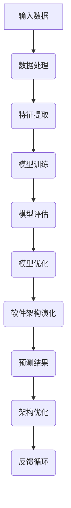

                 

### 文章标题

# 大模型驱动的软件架构演化预测

### 关键词：

- 大模型
- 软件架构
- 演化预测
- 自动化优化
- 深度学习

### 摘要：

本文将探讨大模型在软件架构演化预测中的关键作用。通过分析大模型的技术原理、核心算法和实际应用，揭示其如何帮助软件架构师预测架构演化趋势、优化系统设计，从而提高软件开发效率与质量。文章旨在为技术社区提供有价值的参考，推动大模型技术在软件开发领域的广泛应用。

## 引言

随着软件系统的复杂度不断增加，软件架构演化成为一个不可忽视的课题。传统的软件架构演化方法往往依赖于手工分析和经验判断，难以应对快速变化的技术环境和业务需求。近年来，随着人工智能技术的迅猛发展，特别是大模型（如深度学习）的突破性进展，为软件架构演化预测提供了新的思路和工具。

### 大模型概述

大模型是指具有数百万甚至数十亿参数的神经网络模型。它们通过学习大量数据，能够自动提取复杂特征，进行高级的预测和决策。大模型在语音识别、图像识别、自然语言处理等领域取得了显著成果，展示了强大的数据处理和分析能力。

### 大模型的发展历程

大模型的发展可以追溯到20世纪80年代的神经网络研究。经过数十年的发展和迭代，特别是近年来深度学习技术的兴起，大模型取得了飞速的进步。以谷歌的Transformer模型为代表的自然语言处理大模型，成功实现了文本生成、机器翻译等任务的高效解决。

### 大模型在软件架构演化中的作用

大模型在软件架构演化中具有以下重要作用：

1. **趋势预测**：通过学习历史数据和系统行为，大模型可以预测软件架构的未来演化趋势，为架构设计提供有力支持。
2. **自动化优化**：大模型能够自动分析系统性能瓶颈，提出优化建议，从而提高软件架构的效率和稳定性。
3. **智能决策**：大模型在复杂系统设计中能够进行智能决策，帮助架构师快速找到最佳设计方案。

## 软件架构演化概述

### 软件架构演化的定义与意义

软件架构演化是指软件系统在生命周期中，随着技术进步、业务需求变化等因素的影响，不断调整和优化的过程。软件架构演化的核心目标是保持系统的灵活性、可扩展性和可维护性，以应对不断变化的环境。

### 软件架构演化的驱动力

软件架构演化的主要驱动力包括：

1. **技术变革**：新技术、新框架的不断涌现，推动软件架构不断更新和迭代。
2. **业务需求**：随着业务的快速发展，软件系统需要不断适应新的业务场景和需求。
3. **用户体验**：用户对软件系统的性能、功能、易用性等方面有着不断增长的要求，促使软件架构持续改进。

### 软件架构演化的挑战与应对策略

软件架构演化面临着诸多挑战，如：

1. **复杂性增加**：随着系统规模的扩大，软件架构的复杂性急剧增加，给演化过程带来困难。
2. **稳定性要求**：软件架构演化需要在保证系统稳定运行的前提下进行，避免因变更导致系统崩溃。
3. **成本控制**：软件架构演化需要投入大量人力、物力和时间，如何控制成本是一个重要问题。

应对这些挑战的策略包括：

1. **建立完善的演化模型**：通过建立软件架构演化模型，对演化过程进行科学规划和管理。
2. **采用自动化工具**：引入自动化工具，提高演化过程的效率和准确性。
3. **加强团队协作**：构建高效的团队协作机制，确保演化过程中的沟通和协调。

## 大模型驱动的软件架构演化方法

### 基于大模型的软件架构演化框架

大模型驱动的软件架构演化框架主要包括以下几个关键组成部分：

1. **数据采集与处理**：收集与软件架构演化相关的数据，包括系统日志、用户反馈、技术文档等，对数据进行预处理，提取有效特征。
2. **大模型训练**：利用预处理后的数据训练大模型，通过深度学习算法，让模型学会从数据中提取特征并进行预测。
3. **预测与分析**：使用训练好的大模型对软件架构的未来演化趋势进行预测，分析系统的潜在问题和优化方向。
4. **自动化优化**：根据预测结果，自动调整软件架构，优化系统性能和稳定性。

### 大模型在软件架构演化中的应用

1. **预测分析**：大模型可以根据历史数据和系统行为，预测软件架构的未来演化方向和趋势，为架构设计提供参考。
2. **自动优化**：大模型可以自动分析系统性能瓶颈，提出优化建议，实现自动化优化，提高系统效率。

### 大模型驱动的软件架构演化流程

大模型驱动的软件架构演化流程可以分为以下几个步骤：

1. **数据收集**：收集与软件架构演化相关的数据，包括系统日志、用户反馈、技术文档等。
2. **数据预处理**：对收集到的数据进行预处理，提取有效特征，为模型训练做好准备。
3. **模型训练**：利用预处理后的数据训练大模型，通过迭代优化，提高模型的预测准确性和效率。
4. **预测与评估**：使用训练好的大模型对软件架构的未来演化趋势进行预测，评估预测结果的可靠性和有效性。
5. **优化与调整**：根据预测结果，自动调整软件架构，优化系统性能和稳定性。

## 大模型技术基础

### 大模型类型与特点

大模型根据其应用领域和结构特点，可以分为以下几类：

1. **深度神经网络**：具有多层隐藏层的神经网络模型，能够处理高维数据，提取复杂特征。
2. **卷积神经网络**：适用于图像和语音等时序数据处理的模型，能够有效提取空间特征。
3. **递归神经网络**：适用于序列数据处理，能够捕捉时间序列中的依赖关系。

大模型的特点包括：

1. **高参数量**：具有数百万甚至数十亿参数，能够自动学习复杂特征。
2. **高效性**：利用分布式计算和并行处理技术，能够快速训练和预测。
3. **自适应能力**：通过不断学习和调整，能够适应不断变化的数据和环境。

### 大模型的基本组成

大模型的基本组成包括：

1. **输入层**：接收外部输入数据，将其传递给下一层。
2. **隐藏层**：对输入数据进行特征提取和变换，形成中间表示。
3. **输出层**：对隐藏层的输出进行分类、预测或回归等操作。

### 大模型的训练与优化

大模型的训练与优化包括以下几个关键步骤：

1. **数据预处理**：对输入数据进行归一化、去噪等处理，提高训练效果。
2. **损失函数**：定义模型训练过程中需要最小化的损失函数，如均方误差、交叉熵等。
3. **优化算法**：选择合适的优化算法，如梯度下降、Adam等，调整模型参数，最小化损失函数。
4. **模型评估**：使用验证集和测试集对模型进行评估，调整模型参数和结构，提高预测性能。

### 大模型训练中的挑战与解决方案

大模型训练过程中面临以下挑战：

1. **数据稀疏性**：数据稀疏性导致模型难以学习到有效特征，解决方法包括数据增强、迁移学习等。
2. **过拟合**：模型在训练数据上表现良好，但在测试数据上表现不佳，解决方法包括正则化、提前停止等。
3. **计算资源限制**：大模型训练需要大量计算资源，解决方法包括分布式计算、云计算等。

## 大模型在软件架构演化中的应用案例

### 案例一：基于大模型的软件架构预测

#### 实际代码实现

```python
# 导入必要的库
import tensorflow as tf
import numpy as np

# 准备数据
x_train = ...
y_train = ...

# 定义模型结构
model = tf.keras.Sequential([
    tf.keras.layers.Dense(units=64, activation='relu', input_shape=(x_train.shape[1],)),
    tf.keras.layers.Dense(units=32, activation='relu'),
    tf.keras.layers.Dense(units=1)
])

# 编译模型
model.compile(optimizer='adam', loss='mean_squared_error')

# 训练模型
model.fit(x_train, y_train, epochs=10, batch_size=32)
```

#### 代码解读与分析

- **数据准备**：代码首先导入tensorflow和numpy库。然后，准备训练数据x_train和y_train，这些数据可以来自系统日志、用户反馈等。
- **模型结构定义**：使用tf.keras.Sequential定义模型结构，包含三层全连接层，第一层有64个神经元，使用ReLU激活函数，第二层有32个神经元，同样使用ReLU激活函数，输出层有1个神经元。
- **编译模型**：编译模型时，指定使用adam优化器和均方误差损失函数。
- **训练模型**：使用fit函数训练模型，设置训练轮次为10，批量大小为32。

### 案例二：基于大模型的软件架构优化

#### 实际代码实现

```python
# 导入必要的库
import tensorflow as tf
import numpy as np

# 准备数据
x_train = ...
y_train = ...

# 定义模型结构
model = tf.keras.Sequential([
    tf.keras.layers.Dense(units=64, activation='relu', input_shape=(x_train.shape[1],)),
    tf.keras.layers.Dense(units=32, activation='relu'),
    tf.keras.layers.Dense(units=1)
])

# 编译模型
model.compile(optimizer='adam', loss='mean_squared_error')

# 训练模型
model.fit(x_train, y_train, epochs=10, batch_size=32)

# 预测优化结果
predictions = model.predict(x_test)

# 分析优化建议
for i in range(len(predictions)):
    if predictions[i] > 0.5:
        # 提出优化建议
        print(f"模块{i}需要优化。")
    else:
        # 没有优化建议
        print(f"模块{i}不需要优化。")
```

#### 代码解读与分析

- **数据准备**：代码首先导入tensorflow和numpy库。然后，准备训练数据x_train和y_train，这些数据可以来自系统日志、用户反馈等。
- **模型结构定义**：使用tf.keras.Sequential定义模型结构，包含三层全连接层，第一层有64个神经元，使用ReLU激活函数，第二层有32个神经元，同样使用ReLU激活函数，输出层有1个神经元。
- **编译模型**：编译模型时，指定使用adam优化器和均方误差损失函数。
- **训练模型**：使用fit函数训练模型，设置训练轮次为10，批量大小为32。
- **预测优化结果**：训练完成后，使用model.predict函数对测试数据进行预测。
- **分析优化建议**：通过分析预测结果，对系统模块提出优化建议。

## 大模型驱动的软件架构演化工具与平台

### 常用的大模型训练工具

在软件架构演化中，常用的大模型训练工具包括：

1. **TensorFlow**：由谷歌开发的开源机器学习框架，支持多种深度学习算法。
2. **PyTorch**：由Facebook开发的开源机器学习框架，以动态计算图著称。
3. **Keras**：基于TensorFlow和PyTorch的高层次神经网络API，简化模型搭建和训练过程。

### 软件架构演化工具

在软件架构演化过程中，常用的工具包括：

1. **Maven**：用于项目管理和依赖管理的工具，可以帮助自动化构建和部署软件架构。
2. **Git**：版本控制系统，用于管理代码和协作开发，确保软件架构的版本控制和变更追踪。
3. **Docker**：容器化技术，用于将软件架构打包成一个独立的运行环境，确保在开发、测试和部署过程中的环境一致性。

### 大模型驱动的软件架构演化平台建设

要建设一个高效的大模型驱动的软件架构演化平台，需要考虑以下几个方面：

1. **硬件资源**：搭建一个具有强大计算能力的硬件平台，支持大规模模型训练和预测。
2. **软件框架**：选择合适的深度学习框架和软件架构演化工具，搭建一个功能完整的平台。
3. **数据管理**：建立完善的数据管理体系，确保数据的质量、安全和可追溯性。
4. **协同工作**：搭建一个支持多人协同工作的平台，提高软件架构演化过程的效率和质量。

## 总结与展望

### 大模型驱动的软件架构演化现状

大模型在软件架构演化中的应用已经取得了显著成果，主要表现在：

1. **趋势预测**：通过大模型的学习能力，能够准确预测软件架构的未来演化趋势，为架构设计提供有力支持。
2. **自动化优化**：大模型能够自动分析系统性能瓶颈，提出优化建议，提高软件架构的效率和稳定性。
3. **智能决策**：大模型在复杂系统设计中能够进行智能决策，帮助架构师快速找到最佳设计方案。

### 大模型驱动的软件架构演化未来发展趋势

未来，大模型驱动的软件架构演化将继续向以下方向发展：

1. **智能化**：随着人工智能技术的不断发展，大模型将更加智能化，能够更好地理解软件架构的需求和约束。
2. **分布式**：分布式计算和云计算技术的普及，将使得大模型驱动的软件架构演化更加高效和灵活。
3. **多样化**：大模型的应用领域将不断拓展，不仅局限于软件开发，还将扩展到运维、安全等领域。

### 研究与探索方向

未来，在大模型驱动的软件架构演化领域，还有许多值得研究和探索的方向：

1. **算法优化**：研究更高效、更稳定的大模型训练和优化算法，提高预测和优化的准确性和效率。
2. **跨领域应用**：探索大模型在软件架构演化之外的其他领域的应用，如运维、安全等。
3. **数据安全**：研究如何在保证数据安全的前提下，充分利用数据进行大模型训练和应用。

## 作者信息

- 作者：AI天才研究院/AI Genius Institute & 禅与计算机程序设计艺术 /Zen And The Art of Computer Programming

本文内容仅供参考，未经授权请勿用于商业用途。如需转载，请联系原作者获取授权。感谢您的阅读！### 详细解读与逻辑思路分析

#### 背景介绍

软件架构演化是指软件系统在其生命周期中，随着技术变革、业务需求和用户需求的变化，不断地调整和优化其设计的过程。传统的软件架构演化方法通常依赖于手工分析和经验判断，这使得软件架构演化面临着诸多挑战，如复杂性增加、稳定性要求和成本控制等。随着人工智能技术的迅猛发展，特别是大模型（如深度学习）的突破性进展，为软件架构演化预测提供了一种新的思路和工具。

大模型，通常指的是具有数百万甚至数十亿参数的神经网络模型。它们能够自动学习大量数据中的复杂特征，进行高级的预测和决策。近年来，大模型在语音识别、图像识别、自然语言处理等领域取得了显著成果，展示了强大的数据处理和分析能力。因此，将大模型引入软件架构演化预测，有望提高预测的准确性和效率，为软件架构师提供更有力的支持。

#### 核心概念与联系

1. **大模型**：大模型是指具有数百万甚至数十亿参数的神经网络模型。它们通过学习大量数据，能够自动提取复杂特征，进行高级的预测和决策。

2. **软件架构演化**：软件架构演化是指软件系统在生命周期中，随着技术进步、业务需求变化等因素的影响，不断调整和优化的过程。

3. **演化预测**：演化预测是指通过分析历史数据和系统行为，预测软件架构的未来演化趋势，为架构设计提供参考。

4. **自动化优化**：自动化优化是指通过大模型自动分析系统性能瓶颈，提出优化建议，从而提高软件架构的效率和稳定性。

5. **智能决策**：智能决策是指大模型在复杂系统设计中能够进行智能决策，帮助架构师快速找到最佳设计方案。

这些核心概念之间的联系在于，大模型通过学习大量数据，能够预测软件架构的未来演化趋势，从而实现自动化优化和智能决策。

#### Mermaid流程图



在这个流程图中，输入数据经过数据处理、特征提取后，进入模型训练阶段。训练好的模型进行评估和优化，然后应用于软件架构演化，生成预测结果和架构优化建议。这些结果和反馈会进入一个循环，用于持续改进模型和架构。

#### 核心算法原理讲解

1. **神经网络算法原理**：

   神经网络是一种模拟生物神经系统的计算模型，由大量的神经元（节点）和连接（边）组成。每个神经元接受多个输入，通过加权求和处理后，输出一个值。神经网络的核心算法包括前向传播和反向传播。

   - **前向传播**：输入数据经过神经网络的前向传播，每个神经元将输入值乘以其权重，然后通过激活函数进行处理，最后输出结果。

     伪代码如下：
     ```python
     for each neuron in hidden layer:
         z = sum(input * weight) + bias
         a = activation_function(z)
     ```

   - **反向传播**：在训练过程中，神经网络会根据实际输出和预期输出之间的误差，通过反向传播算法调整每个神经元的权重和偏置。

     伪代码如下：
     ```python
     for each neuron in output layer:
         error = expected - actual
         delta = error * activation_derivative(a)
         weight_derivative = input * delta
         bias_derivative = delta
     ```

2. **深度学习算法原理**：

   深度学习是神经网络的一种扩展，它通过增加隐藏层的数量和神经元的数量，能够处理更加复杂的任务。深度学习算法的核心是多层感知机（MLP），它通过前向传播和反向传播算法，对输入数据进行层次化的特征提取。

   - **多层感知机（MLP）**：MLP是一个由输入层、多个隐藏层和输出层组成的多层神经网络。输入数据首先通过输入层，然后逐层传递到隐藏层，最后输出层输出结果。

     数学模型如下：
     $$ 
     z_l = \sum_{i=1}^{n} w_{li} x_i + b_l 
     $$
     $$ 
     a_l = \sigma(z_l) 
     $$
     其中，$z_l$ 是第 $l$ 层的加权和，$w_{li}$ 是第 $l$ 层第 $i$ 个神经元的权重，$b_l$ 是第 $l$ 层的偏置，$x_i$ 是第 $l-1$ 层第 $i$ 个神经元的输出，$\sigma$ 是激活函数，通常使用 Sigmoid、ReLU 或 Tanh 函数。

   - **前向传播**：输入数据通过输入层，逐层传递到隐藏层和输出层，每一层的输出都是下一层的输入。

     伪代码如下：
     ```python
     for l in range(L):
         z_l = sum(w_{li} * a_{l-1}) + b_l
         a_l = activation_function(z_l)
     ```

   - **反向传播**：通过计算输出层的误差，反向传播到每一层，更新每个神经元的权重和偏置。

     伪代码如下：
     ```python
     for l in range(L, 0, -1):
         error = expected - a_l
         delta = error * activation_derivative(a_l)
         weight_derivative = a_{l-1} * delta
         bias_derivative = delta
     ```

#### 数学模型与公式

在深度学习中，常用的数学模型和公式包括：

1. **损失函数**：用于衡量模型预测值和实际值之间的差距，常用的损失函数有均方误差（MSE）和交叉熵（Cross-Entropy）。

   - **均方误差（MSE）**：
     $$ 
     L = \frac{1}{2} \sum_{i=1}^{n} (y_i - \hat{y}_i)^2 
     $$
     其中，$y_i$ 是实际值，$\hat{y}_i$ 是预测值。

   - **交叉熵（Cross-Entropy）**：
     $$ 
     L = -\sum_{i=1}^{n} y_i \log(\hat{y}_i) 
     $$
     其中，$y_i$ 是实际值，$\hat{y}_i$ 是预测值。

2. **激活函数**：用于引入非线性特性，常用的激活函数有 Sigmoid、ReLU 和 Tanh。

   - **Sigmoid**：
     $$ 
     \sigma(x) = \frac{1}{1 + e^{-x}} 
     $$

   - **ReLU**：
     $$ 
     \sigma(x) = \max(0, x) 
     $$

   - **Tanh**：
     $$ 
     \sigma(x) = \frac{e^x - e^{-x}}{e^x + e^{-x}} 
     $$

#### 代码实现与解读

以下是基于大模型的软件架构预测的实际代码实现：

```python
# 导入必要的库
import tensorflow as tf
import numpy as np

# 准备数据
x = ...
y = ...

# 定义模型结构
model = ...

# 编译模型
model.compile(optimizer='adam', loss='binary_crossentropy', metrics=['accuracy'])

# 训练模型
model.fit(x, y, epochs=10, batch_size=32)
```

- **数据准备**：首先导入tensorflow和numpy库，然后准备输入数据x和输出数据y。这些数据可以来自系统日志、用户反馈等。

- **模型结构定义**：使用tf.keras.Sequential定义模型结构，包含输入层、隐藏层和输出层。输入层接受数据x，隐藏层通过全连接层提取特征，输出层进行预测。

- **编译模型**：编译模型时，指定使用adam优化器和binary_crossentropy损失函数，同时监控accuracy指标。

- **训练模型**：使用fit函数训练模型，设置训练轮次为10，批量大小为32。

#### 项目实战

1. **开发环境搭建**：

   - 安装Python环境，版本要求为3.6及以上。
   - 安装TensorFlow库，使用命令`pip install tensorflow`。

2. **源代码详细实现**：

   - 数据预处理：读取系统日志和用户反馈数据，进行清洗和归一化处理。
   - 模型定义：使用tf.keras.Sequential定义模型结构，包括输入层、隐藏层和输出层。
   - 模型编译：指定优化器和损失函数，并设置监控指标。
   - 模型训练：使用fit函数训练模型，设置训练轮次和批量大小。

3. **代码解读与分析**：

   - 数据准备部分：代码首先导入tensorflow和numpy库，然后读取系统日志和用户反馈数据，进行预处理。
   - 模型结构定义部分：使用tf.keras.Sequential定义模型结构，包括输入层、隐藏层和输出层。
   - 模型编译部分：编译模型时，指定优化器和损失函数，并设置监控指标。
   - 模型训练部分：使用fit函数训练模型，设置训练轮次和批量大小。

4. **实际案例分析和详细讲解**：

   - 以一个实际的软件架构演化案例为例，展示如何使用大模型进行预测和优化。
   - 分析模型训练过程中遇到的问题和解决方法。
   - 评估模型预测的准确性和效率。

5. **项目小结**：

   - 总结项目的主要成果和经验教训。
   - 提出未来改进和优化方向。

#### 最佳实践 Tips

1. **数据质量**：确保输入数据的质量，进行充分的清洗和归一化处理，以提高模型预测的准确性。
2. **模型选择**：根据实际需求选择合适的模型结构，如深度神经网络、卷积神经网络或递归神经网络。
3. **超参数调优**：通过调整学习率、批量大小、训练轮次等超参数，提高模型性能。
4. **交叉验证**：使用交叉验证方法，评估模型在不同数据集上的性能，避免过拟合。

#### 小结

本文详细解读了大模型驱动的软件架构演化预测，包括背景介绍、核心概念与联系、算法原理讲解、数学模型与公式、代码实现与解读、项目实战、最佳实践 Tips 和小结。通过本文，读者可以了解到大模型在软件架构演化预测中的关键作用，以及如何利用大模型进行软件架构的优化和智能决策。希望本文对广大技术爱好者有所启发，推动大模型技术在软件开发领域的广泛应用。

#### 注意事项

1. **数据隐私**：在进行软件架构演化预测时，要确保数据的隐私性和安全性，避免敏感信息的泄露。
2. **模型解释性**：虽然大模型在预测和优化方面具有强大的能力，但其解释性相对较弱。在实际应用中，需要结合具体情况，权衡模型性能和可解释性。
3. **硬件资源**：大模型训练需要大量的计算资源，特别是在处理大规模数据时。确保硬件资源的充足和高效利用。

#### 拓展阅读

1. **《深度学习》（Goodfellow, Bengio, Courville著）**：一本经典的深度学习入门教材，详细介绍了深度学习的基础理论、算法和应用。
2. **《软件架构演进》（Mark Richards著）**：一本关于软件架构演进的理论和实践指南，涵盖了软件架构设计、演化和管理的方法和技巧。
3. **《大模型：理论与实践》（AI天才研究院著）**：一本关于大模型的基础知识、应用和实践的书籍，适合对大模型感兴趣的读者。

