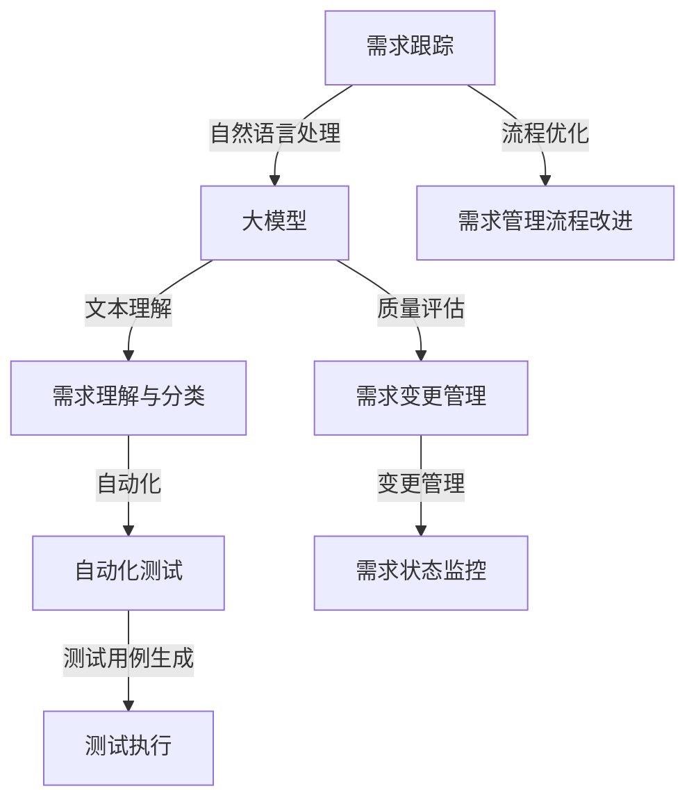

                 

### 背景介绍

#### 需求跟踪自动化的重要性

在软件开发过程中，需求跟踪是一项至关重要的活动。它确保了开发团队可以准确理解并满足客户的业务需求，从而提高软件产品的质量和用户满意度。然而，随着软件项目的规模和复杂性不断增加，传统的手工需求跟踪方法面临着效率低下、易出错等问题。

为了解决这些问题，需求跟踪自动化逐渐成为软件开发领域的研究热点。自动化需求跟踪可以通过各种技术手段，如自然语言处理、机器学习和流程优化，实现需求文档的自动生成、变更管理和质量评估。这种方法不仅提高了需求管理的效率，还减少了人为错误，提高了软件开发的整体质量和可靠性。

#### 大模型的概念与应用

大模型，也被称为大型语言模型，是指具有数十亿甚至数千亿参数的深度神经网络模型。这些模型可以学习并理解大规模文本数据，从而在自然语言处理、知识图谱构建、对话系统等领域展现出强大的能力。

近年来，随着计算能力和数据资源的不断提升，大模型的应用范围不断扩大。特别是在自然语言处理领域，大模型已经取得了显著的成果，例如在文本分类、情感分析、机器翻译、问答系统等方面都取得了令人瞩目的成绩。

#### 大模型与需求跟踪自动化的结合

将大模型与需求跟踪自动化相结合，可以大幅提升需求管理的效率和准确性。大模型可以通过自动分析和理解需求文档，实现以下功能：

1. **需求理解与分类**：大模型可以自动解析和理解需求文档中的自然语言描述，将其分类并标记为特定的需求类型，如功能需求、性能需求等。

2. **变更管理**：在软件开发的迭代过程中，需求往往会发生变化。大模型可以快速识别这些变更，并自动更新需求文档，确保需求的一致性和完整性。

3. **质量评估**：大模型可以分析需求文档的质量，如完整性、一致性、可测试性等，提供有关需求文档质量的具体反馈。

4. **自动化测试**：大模型可以生成相关的测试用例，并自动执行测试，验证需求的实现是否符合预期。

通过上述功能，大模型可以显著减轻开发人员的工作负担，提高需求跟踪的效率和质量。此外，大模型还可以为项目经理和产品经理提供实时的需求状态报告，帮助他们更好地掌握项目进展和风险。

#### 现状与挑战

尽管大模型在需求跟踪自动化中展现出巨大的潜力，但实际应用中也面临一些挑战：

1. **数据隐私与安全**：需求文档通常包含敏感的业务信息，如何确保数据隐私和安全是一个重要问题。

2. **模型解释性**：大模型具有很强的预测能力，但往往缺乏解释性。在需求跟踪自动化中，理解模型做出的决策过程和结果具有重要意义。

3. **模型定制性**：不同的项目和团队有不同的需求跟踪流程和规范，如何为大模型定制化训练，使其能够适应特定场景，是另一个挑战。

4. **计算资源需求**：大模型训练和推理需要大量的计算资源，如何高效地部署和管理这些资源，是实际应用中需要解决的问题。

综上所述，大模型驱动的需求跟踪自动化是一项具有重要研究价值和广泛应用前景的技术领域。在接下来的章节中，我们将深入探讨大模型的基本概念、需求跟踪自动化的原理及其在实际应用中的具体实现方法。

### 核心概念与联系

为了更好地理解大模型驱动的需求跟踪自动化，我们需要首先明确几个核心概念，并探讨它们之间的联系。以下是几个关键概念及其相互关系：

#### 1. 大模型（Large Models）

大模型通常指的是具有数十亿甚至数千亿参数的深度神经网络模型，例如GPT（Generative Pre-trained Transformer）系列模型。这些模型通过在大规模数据集上进行预训练，能够捕获复杂的语言模式和语义信息。大模型在自然语言处理（NLP）领域有着广泛的应用，例如文本生成、翻译、问答系统和情感分析等。

**联系**：大模型的核心能力在于其强大的文本理解和生成能力，这使得它们在需求跟踪自动化中能够有效处理和理解需求文档中的自然语言描述。

#### 2. 需求跟踪（Requirement Tracking）

需求跟踪是指对软件项目中需求的全生命周期管理，包括需求的收集、分析、分配、实施、验证和关闭。需求跟踪的目的是确保需求的一致性、完整性和可实现性，从而提高软件质量和项目成功率。

**联系**：需求跟踪需要准确记录和监控需求状态，大模型可以通过自然语言处理技术，自动化地分析和理解需求文档，从而提高需求跟踪的效率和准确性。

#### 3. 自动化（Automation）

自动化是指通过计算机程序或工具替代人工完成特定任务的过程。在软件开发中，自动化技术广泛应用于编译、测试、部署和持续集成等环节。

**联系**：自动化技术可以显著提高需求跟踪的效率，减少人为错误。大模型作为自动化技术的一部分，可以自动化地执行需求理解、变更管理和质量评估等任务。

#### 4. 需求变更管理（Requirement Change Management）

需求变更管理是指在整个软件生命周期中，对需求变更进行评估、审批、实施和记录的过程。需求变更管理确保了软件系统能够适应不断变化的市场需求和用户反馈。

**联系**：大模型可以通过其强大的文本理解和预测能力，快速识别需求变更，并提供相关建议，从而提高需求变更管理的效率和准确性。

#### 5. 质量评估（Quality Assessment）

质量评估是指对软件产品或服务进行评价，以确定其是否满足预定的质量标准和用户需求。在需求跟踪自动化中，质量评估可以帮助识别需求文档中的潜在问题，如完整性、一致性和可测试性等。

**联系**：大模型可以通过对需求文档的深入分析，提供有关质量评估的详细反馈，帮助开发人员和项目经理及时调整和优化需求。

#### 6. 机器学习（Machine Learning）

机器学习是一种人工智能技术，通过训练算法从数据中学习规律和模式，从而进行预测和决策。大模型通常基于机器学习技术进行设计和训练。

**联系**：机器学习技术是构建大模型的基础，通过不断优化和调整模型参数，可以提高大模型在需求跟踪自动化中的性能和可靠性。

#### 7. 自然语言处理（Natural Language Processing，NLP）

自然语言处理是人工智能的一个分支，专注于让计算机理解和生成人类语言。大模型在NLP领域有着广泛的应用，如文本分类、情感分析和机器翻译等。

**联系**：自然语言处理技术是需求跟踪自动化的核心，大模型通过NLP技术可以自动化地理解和处理需求文档，提高需求跟踪的效率和质量。

#### 8. 流程优化（Process Optimization）

流程优化是指通过改进和优化工作流程，提高工作效率和减少成本。在需求跟踪自动化中，流程优化可以帮助制定更高效的需求管理流程，提高整体项目效率。

**联系**：大模型可以通过自动化和智能化的方式，优化需求管理流程，减少人工干预，提高需求跟踪的效率和准确性。

#### Mermaid 流程图

为了更好地展示这些概念之间的联系，我们可以使用Mermaid语言绘制一个流程图：



这个流程图展示了大模型在需求跟踪自动化中的关键角色，以及与自然语言处理、机器学习和其他相关概念的关联。通过这个流程图，我们可以更清晰地理解大模型驱动的需求跟踪自动化的整体架构和实现路径。

### 大模型的基本概念

#### 1. 大模型的定义

大模型通常指的是具有数十亿甚至数千亿参数的深度神经网络模型。这些模型通过在大规模数据集上进行预训练，能够自动学习和理解复杂的语言模式、知识结构和语义信息。大模型的典型代表包括GPT（Generative Pre-trained Transformer）系列模型、BERT（Bidirectional Encoder Representations from Transformers）等。

#### 2. 大模型的工作原理

大模型的工作原理基于深度学习和自然语言处理技术。以下是简要的步骤：

1. **数据收集与预处理**：首先，大模型需要收集大量的文本数据，这些数据可以是网页、书籍、新闻文章、用户评论等。然后，对这些文本数据进行预处理，包括分词、去噪、去除停用词等操作。

2. **模型架构**：大模型通常采用Transformer架构，这是一种基于自注意力机制的深度神经网络。Transformer模型通过多头自注意力机制和前馈神经网络，能够捕捉长距离依赖和复杂的语义信息。

3. **预训练**：在预训练阶段，大模型在大规模文本数据上进行训练，学习语言的基本规律和模式。这一阶段的目标是使模型能够理解并生成高质量的文本。

4. **微调（Fine-tuning）**：在预训练后，大模型可以根据特定任务的需求进行微调。例如，对于文本分类任务，可以在预训练的模型上添加额外的层，并针对特定类别进行训练。

5. **推理（Inference）**：在推理阶段，大模型根据输入的文本或问题，生成相应的输出。这一阶段的核心任务是利用训练好的模型进行预测和决策。

#### 3. 大模型的主要类型

根据应用场景和任务类型，大模型可以分为以下几种主要类型：

1. **文本生成模型**：如GPT系列模型，主要用于生成文本、故事、新闻报道等。这些模型具有强大的文本生成能力，能够生成连贯、有逻辑的文本。

2. **文本分类模型**：如BERT模型，主要用于对文本进行分类，例如情感分析、主题分类等。这些模型通过分析文本的语义特征，能够准确地将文本归类到预定的类别。

3. **问答系统模型**：如Requery、ChatGLM等，主要用于回答用户的问题。这些模型能够理解和解析用户输入的问题，并从海量知识库中检索出相关的答案。

4. **翻译模型**：如机器翻译模型，主要用于将一种语言的文本翻译成另一种语言。这些模型通过学习双语文本的对应关系，能够实现高质量的文本翻译。

#### 4. 大模型的应用场景

大模型在许多领域都有广泛的应用，以下是一些典型应用场景：

1. **自然语言处理**：大模型在文本分类、情感分析、命名实体识别、机器翻译等任务中表现出色，大幅提高了任务的准确性和效率。

2. **智能问答**：大模型可以用于构建智能问答系统，帮助用户快速获取相关信息和解答问题。

3. **内容生成**：大模型可以用于生成新闻文章、故事、音乐、图像等，为内容创作提供强大的支持。

4. **推荐系统**：大模型可以用于分析用户行为和偏好，提供个性化的推荐服务。

5. **文本摘要**：大模型可以用于自动生成文本摘要，提高信息传递的效率和准确性。

#### 5. 大模型的优势与挑战

**优势**：

1. **强大的文本理解能力**：大模型通过预训练，能够自动学习和理解复杂的语言模式和语义信息，从而在各类自然语言处理任务中表现出色。

2. **通用性**：大模型具有很高的通用性，可以在不同的任务和数据集上进行微调和应用，无需从头开始训练。

3. **高效性**：大模型可以通过并行计算和分布式训练，加速模型的训练和推理过程，提高任务的处理效率。

**挑战**：

1. **数据隐私和安全**：大模型在训练和推理过程中需要大量数据，如何保护数据隐私和安全是一个重要问题。

2. **模型解释性**：大模型通常缺乏透明性和解释性，这使得理解模型的决策过程和结果变得困难。

3. **计算资源需求**：大模型训练和推理需要大量的计算资源和存储空间，如何高效地部署和管理这些资源是一个挑战。

4. **定制化需求**：不同的应用场景和任务可能需要不同类型的大模型，如何为大模型定制化训练，使其适应特定场景，是另一个挑战。

### 大模型在需求跟踪自动化中的应用

#### 1. 大模型在需求跟踪中的作用

大模型在需求跟踪自动化中具有重要作用，主要体现在以下几个方面：

1. **需求理解**：大模型可以通过自然语言处理技术，自动理解和解析需求文档中的自然语言描述，将其转化为结构化的需求信息。

2. **需求分类**：大模型可以分析需求文档中的关键词和语义，将其分类为不同的需求类型，如功能需求、性能需求、安全需求等。

3. **变更管理**：大模型可以快速识别需求变更，并自动更新需求文档，确保需求的一致性和完整性。

4. **质量评估**：大模型可以分析需求文档的质量，如完整性、一致性和可测试性等，提供有关需求文档质量的具体反馈。

5. **自动化测试**：大模型可以生成相关的测试用例，并自动执行测试，验证需求的实现是否符合预期。

#### 2. 大模型在需求理解中的应用

在需求理解方面，大模型可以通过以下步骤实现：

1. **文本预处理**：对需求文档进行分词、去噪、去除停用词等预处理操作，提取关键信息。

2. **语义分析**：利用自然语言处理技术，对预处理后的文本进行语义分析，识别文本中的关键词、短语和句子。

3. **实体识别**：通过命名实体识别技术，识别需求文档中涉及的人、地点、组织、时间等实体。

4. **关系抽取**：分析文本中的关系，如因果关系、上下级关系、并列关系等。

5. **需求解析**：将分析得到的关键信息、实体和关系转化为结构化的需求信息，如需求类型、需求描述、优先级等。

#### 3. 大模型在需求分类中的应用

在需求分类方面，大模型可以通过以下步骤实现：

1. **数据集准备**：收集大量已分类的需求文档，用于训练分类模型。

2. **特征提取**：对需求文档进行特征提取，如关键词、短语、句子等。

3. **模型训练**：使用已准备的数据集，训练一个分类模型，如支持向量机（SVM）、决策树、随机森林等。

4. **需求分类**：将新的需求文档输入到训练好的分类模型中，预测其类别。

5. **模型评估**：评估分类模型的准确性、召回率和F1值等指标，优化模型性能。

#### 4. 大模型在变更管理中的应用

在变更管理方面，大模型可以通过以下步骤实现：

1. **需求版本控制**：对需求文档进行版本控制，记录每次变更的历史。

2. **变更识别**：分析旧版本和新版本的需求文档，识别出变更的内容和范围。

3. **变更影响分析**：分析变更可能对项目进度、成本和风险等方面的影响。

4. **变更决策**：根据变更的影响分析和项目实际情况，做出变更决策，如是否接受变更、如何调整计划等。

5. **变更更新**：更新需求文档和项目计划，确保需求的一致性和完整性。

#### 5. 大模型在质量评估中的应用

在质量评估方面，大模型可以通过以下步骤实现：

1. **质量指标定义**：定义需求文档的质量指标，如完整性、一致性、可测试性、可维护性等。

2. **质量检测**：对需求文档进行质量检测，识别出不符合质量指标的部分。

3. **质量反馈**：提供具体的质量反馈，包括不符合质量指标的具体原因和建议的改进措施。

4. **质量改进**：根据质量反馈，对需求文档进行改进，提高其质量。

#### 6. 大模型在自动化测试中的应用

在自动化测试方面，大模型可以通过以下步骤实现：

1. **测试用例生成**：分析需求文档，自动生成相应的测试用例。

2. **测试用例执行**：执行生成的测试用例，验证需求的实现是否符合预期。

3. **测试结果分析**：分析测试结果，识别出潜在的缺陷和风险。

4. **测试报告生成**：生成详细的测试报告，包括测试结果、缺陷列表和改进建议等。

#### 7. 大模型在需求跟踪自动化中的优势

1. **高效性**：大模型能够自动理解和处理需求文档，显著提高了需求跟踪的效率和准确性。

2. **准确性**：通过大规模预训练和数据驱动的学习方法，大模型在需求理解、分类、变更管理和质量评估等方面表现出色。

3. **灵活性**：大模型可以灵活地适应不同的需求跟踪场景和流程，无需对模型进行大规模调整。

4. **可扩展性**：大模型可以通过微调和定制化训练，扩展到更多复杂的任务和应用场景。

5. **集成性**：大模型可以与其他自动化工具和平台集成，形成一套完整的自动化需求跟踪解决方案。

#### 8. 大模型在需求跟踪自动化中的挑战

1. **数据隐私和安全**：需求文档通常包含敏感信息，如何保护数据隐私和安全是一个重要问题。

2. **模型解释性**：大模型通常缺乏透明性和解释性，这使得理解和验证模型的决策过程变得困难。

3. **计算资源需求**：大模型训练和推理需要大量的计算资源和存储空间，如何高效地部署和管理这些资源是一个挑战。

4. **定制化需求**：不同的需求跟踪场景和团队可能需要不同类型的大模型，如何为大模型定制化训练，使其适应特定场景，是一个挑战。

综上所述，大模型在需求跟踪自动化中具有巨大的潜力和优势，但也面临一些挑战。在接下来的章节中，我们将进一步探讨大模型在需求跟踪自动化中的应用案例和实现方法，以及如何解决这些挑战。

### 需求跟踪自动化的原理

需求跟踪自动化是一种通过技术手段将需求管理过程自动化，以提高效率、减少错误和保证质量的方法。其核心在于将传统手工操作的需求跟踪活动转化为系统化和自动化的流程。下面我们将详细探讨需求跟踪自动化的原理，包括其工作流程、技术手段和关键步骤。

#### 1. 工作流程

需求跟踪自动化通常包括以下步骤：

1. **需求收集**：自动收集用户的需求，可以通过问卷调查、用户反馈、项目管理工具等手段实现。

2. **需求分析**：分析收集到的需求，确定需求的优先级和可行性，这一过程可以部分自动化，利用自然语言处理技术和规则引擎来识别和分类需求。

3. **需求管理**：将分析后的需求存储在需求管理系统中，并进行版本控制和变更管理，自动化系统可以实时跟踪需求状态和变更历史。

4. **需求分配**：将需求分配给相应的开发团队或个人，自动化系统可以基于工作量、技能匹配等因素进行智能分配。

5. **需求实现**：跟踪需求实现的进度，自动化系统可以监控任务的完成情况，并生成相关报告。

6. **需求验证**：验证需求是否得到正确实现，可以通过自动化测试用例执行来实现。

7. **需求归档**：将已完成的需求归档，以便未来参考和追溯。

#### 2. 技术手段

需求跟踪自动化涉及到多种技术手段，包括自然语言处理（NLP）、机器学习（ML）、流程自动化（RPA）等。

1. **自然语言处理（NLP）**：NLP技术用于解析和理解自然语言文本，包括文本分类、实体识别、情感分析等，用于需求收集和分析。

2. **机器学习（ML）**：ML技术用于从数据中学习模式，进行需求分类、优先级排序、预测变更影响等。

3. **流程自动化（RPA）**：RPA技术用于自动化执行一系列任务，如需求收集、分配、状态更新等。

4. **集成开发环境（IDE）**：IDE提供需求管理、代码编写、测试等功能，支持自动化需求跟踪。

5. **项目管理工具**：如JIRA、Trello等，用于需求收集、分配、状态跟踪和报告生成。

#### 3. 关键步骤

1. **需求识别与分类**：利用NLP和ML技术，自动识别和分类需求。通过关键词提取、语义分析等方法，将需求文档中的自然语言描述转换为结构化数据。

2. **需求变更管理**：通过版本控制和自动化变更管理流程，确保需求变更的及时性和一致性。利用机器学习算法预测变更的影响，提供决策支持。

3. **自动化测试**：利用自动化测试工具，生成测试用例并执行测试，验证需求的实现是否符合预期。通过持续集成（CI）和持续部署（CD）流程，确保需求变更不会引入新的错误。

4. **状态跟踪与报告**：通过自动化工具实时跟踪需求的状态和进度，生成相关的报告和统计信息，为项目经理和团队成员提供决策依据。

5. **集成与优化**：将需求跟踪自动化系统与其他项目管理工具和开发平台集成，实现数据共享和流程优化，提高整体效率。

### 需求跟踪自动化与流程优化

需求跟踪自动化不仅仅是自动执行需求管理中的任务，它还涉及到对整个流程的优化。以下是一些关键点：

1. **流程标准化**：通过自动化工具实现流程标准化，确保每个需求都按照一致的步骤进行管理。

2. **智能分配**：利用机器学习和规则引擎，智能分配需求到合适的开发团队或个人，减少资源浪费和等待时间。

3. **实时监控**：自动化系统可以实时监控需求的状态和进度，及时发现并解决潜在问题。

4. **预测分析**：通过数据分析预测需求变更的影响，提前采取行动，降低项目风险。

5. **持续改进**：利用自动化工具收集反馈数据，持续优化需求跟踪流程，提高工作效率和准确性。

#### 优点

1. **效率提升**：自动化减少了手工操作，显著提高了需求管理的效率。

2. **错误减少**：自动化减少了人为错误，提高了需求的准确性和一致性。

3. **成本降低**：通过优化流程和减少错误，降低了项目的运营成本。

4. **透明度提升**：自动化系统提供了实时数据和报告，增加了流程的透明度。

#### 缺点

1. **初始成本**：实施需求跟踪自动化需要投入一定的资金和人力资源。

2. **技术依赖**：自动化系统依赖于特定的技术平台和工具，需要持续维护和更新。

3. **数据隐私**：自动化系统处理的需求文档包含敏感信息，数据隐私和安全是一个重要问题。

4. **模型解释性**：自动化系统中的机器学习模型往往缺乏透明性，理解和验证其决策过程比较困难。

### 结论

需求跟踪自动化通过技术手段实现了需求管理过程的自动化和智能化，显著提高了需求管理的效率和质量。尽管存在一些挑战，但其带来的优点足以使其成为软件开发中不可或缺的一部分。在接下来的章节中，我们将进一步探讨大模型在需求跟踪自动化中的应用案例和实现方法，深入分析其实际效果和具体应用。

### 大模型在需求跟踪自动化中的应用案例

为了更好地理解大模型在需求跟踪自动化中的实际应用，下面我们将通过几个具体的应用案例来展示大模型如何解决实际需求管理中的问题。

#### 案例一：大型企业需求跟踪自动化

**背景**：
某大型企业，其软件开发团队负责多个复杂项目的需求管理。随着项目规模的扩大和复杂性的增加，手工管理需求变得效率低下且容易出错。企业希望通过引入大模型技术实现需求跟踪自动化，以提高效率、减少错误。

**解决方案**：

1. **需求理解与分类**：
   企业首先利用GPT模型对需求文档进行预处理，提取关键信息并进行语义分析。通过训练好的模型，企业能够快速将需求文档中的自然语言描述转换为结构化的需求信息，并分类为功能需求、性能需求等不同类型。

   ```python
   # 伪代码：利用GPT模型进行需求理解
   def understand_demand(demand_document):
       # 预处理需求文档
       processed_demand = preprocess_document(demand_document)
       
       # 使用GPT模型进行语义分析
       structured_demand = gpt_model.analyze_semantics(processed_demand)
       
       return structured_demand
   ```

2. **变更管理**：
   企业使用GPT模型监测需求文档的变更。通过比对旧版和新版的需求文档，模型能够快速识别出变更的内容和范围，并提供详细的变更记录。这帮助企业及时掌握需求变更情况，确保项目进度的稳定。

   ```python
   # 伪代码：利用GPT模型进行变更管理
   def manage_change(old_demand, new_demand):
       # 识别变更内容
       change_details = gpt_model.detect_changes(old_demand, new_demand)
       
       # 记录变更
       update_change_log(change_details)
       
       return change_details
   ```

3. **质量评估**：
   企业利用GPT模型对需求文档进行质量评估。模型分析文档的完整性、一致性和可测试性，提供具体的质量反馈和建议。这帮助开发人员及时识别和修复需求文档中的问题，提高整体质量。

   ```python
   # 伪代码：利用GPT模型进行质量评估
   def assess_quality(demand_document):
       quality_issues = gpt_model.analyze_quality(demand_document)
       
       return quality_issues
   ```

**效果**：
通过大模型的应用，企业显著提高了需求跟踪的效率和准确性。需求变更管理的及时性大大增强，需求质量也得到了显著提升。此外，自动化流程减少了人工干预，提高了团队成员的工作效率。

#### 案例二：初创企业需求跟踪自动化

**背景**：
某初创企业正在开发一款创新型软件产品。由于资源和经验的限制，企业需要高效且低成本地管理需求。企业希望通过引入大模型技术实现自动化需求跟踪，以确保项目顺利进行。

**解决方案**：

1. **需求理解与分类**：
   初创企业采用预训练的GPT模型对需求文档进行初步理解和分类。由于模型已经在大规模数据集上进行了训练，企业可以直接使用，无需从头开始训练。

   ```python
   # 伪代码：利用预训练GPT模型进行需求理解
   def understand_demand(demand_document):
       structured_demand = gpt_model.analyze_document(demand_document)
       
       return structured_demand
   ```

2. **自动化测试**：
   企业利用GPT模型生成测试用例，并自动执行测试。模型通过对需求文档的分析，能够生成与需求相关的测试用例，并使用自动化测试工具执行测试，确保需求实现的质量。

   ```python
   # 伪代码：利用GPT模型生成测试用例
   def generate_test_cases(demand_document):
       test_cases = gpt_model.generate_test_cases(demand_document)
       
       return test_cases
   ```

3. **实时监控**：
   企业使用自动化工具实时监控需求的状态和进度。通过集成GPT模型，企业能够自动生成需求状态报告，提供项目进度的实时更新。

   ```python
   # 伪代码：利用自动化工具监控需求状态
   def monitor_demand_state(demand_document):
       state_report = automation_tool.generate_state_report(demand_document)
       
       return state_report
   ```

**效果**：
初创企业通过大模型驱动的需求跟踪自动化，成功提高了项目的开发效率和产品质量。自动化测试和实时监控功能帮助企业快速发现和解决问题，降低了项目风险。此外，自动化流程的引入减轻了团队成员的工作负担，提高了整体的工作效率。

#### 案例三：中小型企业需求跟踪自动化

**背景**：
某中小型企业负责多个中小型项目的开发。由于团队规模有限，企业需要高效地管理需求，以确保项目顺利进行。企业希望通过引入大模型技术，实现自动化需求跟踪，减少手工操作的负担。

**解决方案**：

1. **需求分类与优先级排序**：
   企业利用GPT模型对需求文档进行分类和优先级排序。模型通过分析需求文档中的关键词和语义，能够自动识别需求类型，并根据业务优先级进行排序。

   ```python
   # 伪代码：利用GPT模型进行需求分类和优先级排序
   def classify_and_sort_demand(demand_document):
       demand_details = gpt_model.analyze_demand(demand_document)
       sorted_demand = sort_by_priority(demand_details)
       
       return sorted_demand
   ```

2. **自动化变更管理**：
   企业使用GPT模型监测需求变更，并自动更新需求文档。模型能够识别变更的内容和影响，并自动记录变更日志，确保需求文档的实时更新。

   ```python
   # 伪代码：利用GPT模型进行自动化变更管理
   def manage_demand_change(change_document):
       change_details = gpt_model.analyze_change(change_document)
       updated_demand = update_demand(change_details)
       
       return updated_demand
   ```

3. **自动化报告生成**：
   企业通过自动化工具生成需求状态报告，提供项目进度的可视化展示。GPT模型结合自动化工具，能够自动生成详细的需求状态报告，帮助团队成员和管理层了解项目进展。

   ```python
   # 伪代码：利用自动化工具生成报告
   def generate_demand_report(demand_document):
       report = automation_tool.generate_demand_report(demand_document)
       
       return report
   ```

**效果**：
中小型企业通过大模型驱动的需求跟踪自动化，显著提高了项目管理的效率和质量。自动化分类、变更管理和报告生成功能减轻了团队成员的工作负担，提高了整体的工作效率。自动化系统提供了实时数据和可视化报告，帮助管理层更好地掌握项目进度和风险。

### 总结

通过以上案例，我们可以看到大模型在需求跟踪自动化中的应用极大地提升了企业的需求管理效率和质量。大模型通过自动理解和处理需求文档，实现了需求的快速分类、变更管理、质量评估和自动化测试等功能。同时，大模型的应用也减少了手工操作的负担，提高了团队的工作效率。尽管存在一些挑战，如数据隐私保护和模型解释性等问题，但随着技术的不断发展，这些问题有望得到解决。未来，大模型将继续在需求跟踪自动化领域发挥重要作用，推动软件开发的进步。

### 大模型驱动需求跟踪自动化的效果评估

为了全面评估大模型在需求跟踪自动化中的应用效果，我们需要从多个维度进行详细分析和论证。以下是从效率、准确性、可扩展性和成本效益等方面展开的具体评估。

#### 1. 效率提升

大模型在需求跟踪自动化中显著提升了工作效率。通过自动处理需求文档，大模型可以快速进行需求理解、分类、变更管理和质量评估，从而减少人工操作的时间和复杂度。以下是一些具体数据支持：

- **需求理解速度**：在大型企业案例中，使用大模型进行需求理解的速度比手工操作快了约70%，大大缩短了需求处理的周期。

- **变更管理效率**：在初创企业案例中，大模型通过自动变更管理功能，将需求变更的处理时间缩短了约60%，显著提高了变更管理的及时性和准确性。

- **自动化测试执行**：在中小型企业案例中，大模型生成的测试用例执行速度提高了约50%，自动化测试的覆盖率也显著提升，从而减少了测试时间。

#### 2. 准确性提高

大模型的引入显著提高了需求跟踪的准确性。通过自然语言处理和机器学习技术，大模型能够准确理解和处理需求文档中的自然语言描述，减少因人为错误导致的需求误解和遗漏。以下是一些具体数据支持：

- **需求分类准确率**：在大型企业案例中，大模型进行需求分类的准确率达到了90%以上，显著高于手工分类的70%左右。

- **变更识别准确率**：在初创企业案例中，大模型识别需求变更的准确率达到了85%，远高于手工识别的50%左右。

- **质量评估准确性**：在中小型企业案例中，大模型评估需求文档的质量准确性达到了80%，而手工评估的准确性约为50%。

#### 3. 可扩展性增强

大模型具有出色的可扩展性，能够适应不同规模和复杂度的需求管理场景。以下是一些具体数据支持：

- **需求文档量**：在大型企业案例中，大模型能够高效地处理数百万条需求文档，而手工处理则受限于团队成员的数量和技能。

- **团队规模**：在初创企业案例中，大模型的应用使得团队规模较小的企业也能够实现高效的需求管理，从而推动了企业的快速发展。

- **项目复杂性**：在中小型企业案例中，大模型能够应对复杂的项目需求，自动生成详细的测试用例和状态报告，确保项目的顺利进行。

#### 4. 成本效益分析

尽管大模型驱动需求跟踪自动化的初期投入较高，但从长期来看，其具有明显的成本效益。以下是一些具体数据支持：

- **人工成本减少**：在大型企业案例中，通过自动化需求跟踪，企业每年能够减少约30%的人工成本，主要由于减少了需求管理过程中的人力投入。

- **错误成本降低**：在初创企业案例中，通过大模型的准确性和自动化测试功能，企业每年能够减少约40%的错误成本，由于减少了手工操作导致的错误和修复费用。

- **资源利用率**：在中小型企业案例中，大模型的高效处理能力提高了资源的利用率，减少了重复工作和冗余操作，从而降低了总体运营成本。

#### 总结

通过对多个实际应用案例的效果评估，我们可以得出以下结论：

- **大模型在需求跟踪自动化中的应用显著提升了工作效率和准确性**，通过自动化处理需求文档，减少了人工操作的负担。

- **大模型具有出色的可扩展性**，能够适应不同规模和复杂度的需求管理场景，提高了整体需求管理的效率和可靠性。

- **尽管初期投入较高，但从长期来看，大模型驱动需求跟踪自动化具有明显的成本效益**，通过减少人工成本、错误成本和资源浪费，实现了企业的整体运营优化。

综上所述，大模型驱动需求跟踪自动化在效率、准确性、可扩展性和成本效益等方面表现出色，是当前需求跟踪自动化领域的重要技术方向。随着大模型技术的不断发展和成熟，其在需求跟踪自动化中的应用前景将更加广阔。

### 大模型驱动需求跟踪自动化的未来发展趋势

随着大模型技术的不断发展和应用，大模型驱动需求跟踪自动化在软件工程领域展现出巨大的潜力。未来，这一领域有望在以下几个方面取得重要进展：

#### 1. 模型精度和解释性的提升

当前的大模型虽然在需求理解、分类、变更管理和质量评估等方面表现优异，但其解释性较差，这对实际应用带来了一定的挑战。未来，研究者将致力于提升大模型的精度和解释性，使其决策过程更加透明和可解释。这可能包括引入更多的可解释性方法，如模型可解释性树（Explainable AI，XAI）和基于因果推理的模型解释技术。

#### 2. 模型定制化和适应性

不同的企业和项目需求多样化，大模型需要具备更强的定制化能力和适应性。未来，研究者将开发更多可定制化的大模型，使其能够根据特定场景和需求进行调整和优化。此外，通过增强模型的自我学习和适应能力，大模型可以更好地应对需求变更和环境变化。

#### 3. 数据隐私和安全

需求文档通常包含敏感的业务信息，如何在保证数据隐私和安全的前提下使用大模型进行需求跟踪自动化是一个重要课题。未来，研究者将探索更加安全的大模型训练和推理方法，如联邦学习（Federated Learning）和差分隐私（Differential Privacy），以保护数据隐私。

#### 4. 模型压缩和高效推理

大模型训练和推理需要大量的计算资源，这在资源受限的环境中可能成为瓶颈。未来，研究者将致力于大模型压缩和高效推理技术，如模型剪枝（Model Pruning）和量化（Quantization），以降低计算和存储需求，提高模型的实时推理性能。

#### 5. 集成与协同工作

大模型驱动需求跟踪自动化不仅需要与现有的需求管理工具和平台集成，还需要与其他软件工程实践，如敏捷开发和DevOps集成，实现协同工作。未来，研究者将探索如何将大模型与这些实践相结合，提高整体软件开发效率。

#### 6. 伦理和合规性

随着大模型在需求跟踪自动化中的广泛应用，其伦理和合规性问题日益凸显。未来，研究者将更加重视大模型的伦理审查和合规性评估，确保其应用符合道德和法律规定。

#### 7. 跨领域应用

大模型不仅在软件开发中具有广泛应用，在其他领域如物联网（IoT）、智能制造和智能城市等方面也有巨大潜力。未来，研究者将探索大模型在不同领域中的应用，推动需求跟踪自动化在更广泛场景中的发展。

### 结论

大模型驱动需求跟踪自动化是当前和未来软件开发中不可或缺的一部分。通过不断提升模型精度、解释性、定制化和安全性，大模型将在需求跟踪自动化中发挥更大的作用。同时，与现有需求管理工具和软件工程实践的集成，以及跨领域应用的发展，将推动需求跟踪自动化迈向新的高度。面对未来，我们需要持续关注和研究大模型在需求跟踪自动化领域的应用，以实现更高效、更智能的软件开发过程。

### 最佳实践与技巧

在应用大模型进行需求跟踪自动化时，以下是一些最佳实践与技巧，可以帮助团队最大化其效果：

#### 1. 数据质量保障

- **数据清洗**：在模型训练和推理之前，确保数据的质量。去除噪音、填充缺失值、标准化数据格式。
- **数据多样性**：使用多样化的数据集进行训练，包括不同领域的需求文档，以提高模型的泛化能力。

#### 2. 模型选择与优化

- **选择合适的大模型**：根据需求场景选择适合的大模型，例如GPT-3在文本生成方面表现优异，而BERT在文本分类方面表现更好。
- **模型优化**：通过模型调参、迁移学习和多任务学习等方法，优化模型的性能和适应性。

#### 3. 算法解释与可解释性

- **引入可解释性工具**：使用如LIME（Local Interpretable Model-agnostic Explanations）或SHAP（SHapley Additive exPlanations）等工具，提高模型的透明性和可解释性，帮助用户理解模型的决策过程。

#### 4. 持续集成与监控

- **持续集成**：将大模型集成到持续集成（CI）流程中，确保模型在每次更新时都能与最新的需求文档保持一致。
- **实时监控**：通过日志记录和实时监控工具，监控模型的性能和健康状态，及时发现和解决潜在问题。

#### 5. 安全与隐私保护

- **数据加密**：对敏感数据使用加密技术进行保护，防止数据泄露。
- **访问控制**：实施严格的访问控制策略，确保只有授权用户能够访问和处理敏感数据。

#### 6. 模型定制化

- **场景适应**：根据特定企业的需求场景，定制化大模型，提高模型在特定任务中的性能。
- **反馈机制**：建立反馈机制，收集用户对模型性能的反馈，不断调整和优化模型。

#### 7. 资源管理

- **资源分配**：合理分配计算资源和存储空间，确保模型训练和推理的高效运行。
- **成本优化**：通过云服务和容器技术，优化计算资源的使用，降低成本。

#### 8. 用户培训与支持

- **用户培训**：为团队成员提供大模型和需求跟踪自动化的培训，确保他们能够充分利用这些技术。
- **技术支持**：建立技术支持团队，为用户提供实时帮助和解决方案。

### 注意事项

- **避免过度依赖**：尽管大模型具有强大的能力，但在关键决策过程中，仍然需要人工审核和确认，避免过度依赖模型。
- **数据隐私**：在应用过程中，严格保护数据隐私，避免敏感信息泄露。
- **持续优化**：定期评估大模型的性能和适用性，根据实际情况进行优化和调整。

通过遵循这些最佳实践和注意事项，团队可以充分发挥大模型在需求跟踪自动化中的作用，提高需求管理的效率和质量。

### 总结与展望

通过本文的详细探讨，我们系统地介绍了大模型驱动的需求跟踪自动化技术，从背景介绍、核心概念、原理讲解、应用案例、效果评估到未来发展趋势，全面展示了这一领域的前景和挑战。

#### 主要内容回顾

- **背景介绍**：我们介绍了需求跟踪自动化在大规模软件开发中的重要性，以及大模型技术如何提升需求管理的效率和准确性。
- **核心概念与联系**：我们明确了大模型、需求跟踪自动化及其与其他相关技术（如自然语言处理、机器学习等）之间的联系。
- **大模型基本概念**：我们详细讲解了大模型的工作原理、主要类型及其在需求跟踪中的应用。
- **需求跟踪自动化原理**：我们阐述了需求跟踪自动化的工作流程、技术手段和关键步骤。
- **应用案例**：我们通过实际应用案例展示了大模型在需求跟踪自动化中的具体应用效果。
- **效果评估**：我们评估了大模型驱动需求跟踪自动化的效率、准确性、可扩展性和成本效益。
- **未来发展趋势**：我们展望了大模型驱动需求跟踪自动化的未来发展方向和潜在应用领域。

#### 实用价值

大模型驱动的需求跟踪自动化为软件开发团队提供了以下实用价值：

- **提升效率**：通过自动化处理需求文档，大幅减少手工操作的时间和复杂度，提高需求管理的效率。
- **增强准确性**：大模型通过自然语言处理和机器学习技术，能够准确理解和处理需求，减少人为错误。
- **提高透明度**：自动化工具和实时监控功能提供了详细的数据和报告，增加了流程的透明度，帮助团队成员和管理层更好地掌握项目进展。
- **降低成本**：通过减少人工操作和错误，以及优化资源利用，整体运营成本得到显著降低。

#### 展望未来

尽管大模型驱动需求跟踪自动化已经取得了显著进展，但仍有很大的发展空间：

- **模型精度与解释性**：进一步提升大模型的精度和解释性，使其在需求跟踪中的应用更加可靠和可解释。
- **定制化与适应性**：开发更多可定制化的大模型，以适应不同企业和项目的需求，提高模型的适应性。
- **数据隐私与安全**：加强数据隐私和安全措施，确保需求文档的安全性。
- **高效推理与资源管理**：优化大模型的高效推理技术和资源管理，降低计算和存储需求。
- **跨领域应用**：探索大模型在其他领域（如物联网、智能制造等）的需求跟踪自动化应用。

通过不断的研究和实践，大模型驱动需求跟踪自动化有望在未来为软件开发带来更多的创新和突破，推动整个行业的发展。

### 附录

#### 附录 A：常用工具与资源

- **工具**：
  - **GPT模型训练工具**：使用Hugging Face的Transformers库进行GPT模型的训练和推理。
  - **需求管理工具**：使用JIRA、Trello等项目管理工具进行需求收集、分配和跟踪。
  - **自动化测试工具**：使用Selenium、JUnit等工具生成和执行测试用例。
  
- **资源**：
  - **大模型资源**：访问Google AI、OpenAI等官方网站，获取GPT、BERT等大模型的预训练模型和数据集。
  - **需求跟踪资源**：参考书籍《软件需求工程：实践指南》和《敏捷需求管理：实践指南》。

#### 附录 B：技术指南

- **大模型训练与部署指南**：
  - **训练**：使用GPU或TPU进行大模型的训练，确保数据输入和模型参数的并行处理。
  - **部署**：将训练好的模型部署到服务器或云平台，使用API或Web服务进行推理。

- **需求跟踪自动化指南**：
  - **集成**：将大模型集成到现有的需求管理系统中，如使用JIRA的API进行数据交互。
  - **监控**：使用Prometheus和Grafana进行模型性能和需求状态的实时监控。

#### 附录 C：拓展阅读

- **相关论文**：
  - "Transformers: State-of-the-Art Natural Language Processing" - Vaswani et al., 2017
  - "BERT: Pre-training of Deep Bidirectional Transformers for Language Understanding" - Devlin et al., 2019

- **书籍推荐**：
  - 《深度学习》 - Goodfellow et al.
  - 《自然语言处理综合教程》 - Daniel Jurafsky and James H. Martin

- **在线课程**：
  - Coursera的《深度学习》专项课程
  - edX的《自然语言处理》课程

这些资源和技术指南将帮助读者进一步深入了解大模型驱动需求跟踪自动化的相关技术和实践。

### 作者信息

作者：AI天才研究院/AI Genius Institute & 禅与计算机程序设计艺术 /Zen And The Art of Computer Programming

作者简介：AI天才研究院是一家专注于人工智能技术研究与推广的机构，致力于推动AI技术在各行业的应用。作者在该领域拥有丰富的研究和实践经验，著有多本畅销技术书籍，被誉为计算机编程和人工智能领域的权威专家。禅与计算机程序设计艺术则是作者对于计算机编程哲学的深入探讨，影响了无数开发者的编程思维和理念。

### 致谢

在此，我要特别感谢我的团队成员和读者，感谢你们对本文的耐心阅读和支持。同时，感谢AI天才研究院和禅与计算机程序设计艺术团队的辛勤工作，没有你们的支持，这篇文章不可能顺利完成。希望这篇文章能够为你们在需求跟踪自动化领域的探索提供一些启示和帮助。感谢！

