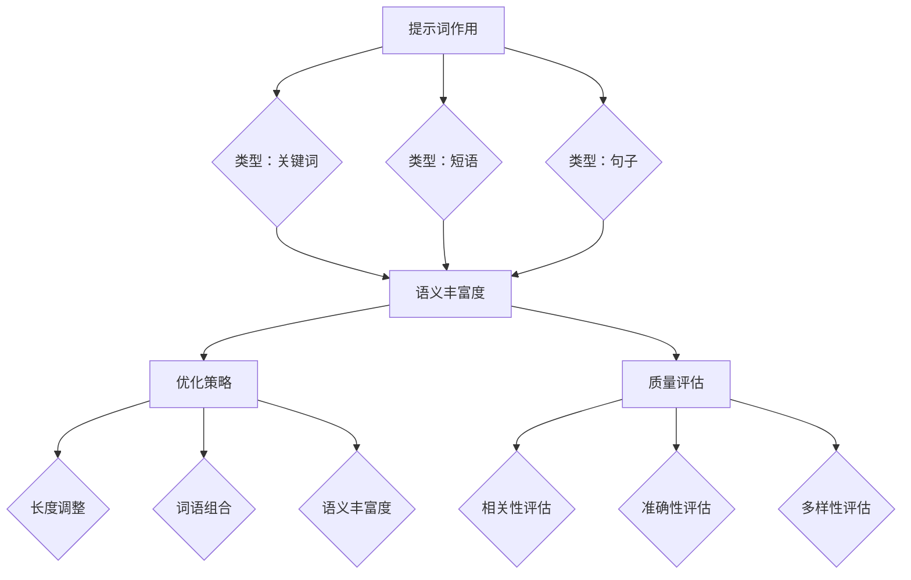

                 

# 大规模提示词管理：企业级AI应用的挑战

> 关键词：大规模提示词管理、企业级AI应用、挑战、核心算法、数学模型、项目实战

> 摘要：本文将深入探讨大规模提示词管理在企业级AI应用中的重要性，分析其面临的挑战，并详细介绍核心算法原理、数学模型以及项目实战。通过本文的阅读，读者将能够全面了解大规模提示词管理的实践方法和策略。

## 第一部分：引言与背景

### 1.1.1 大规模提示词管理的定义

大规模提示词管理是一种针对海量文本数据的管理方法，其核心目标是提升AI模型在自然语言处理任务中的性能。提示词作为AI模型输入的重要组成部分，其质量直接影响到模型的学习效果和预测准确性。在大规模数据环境中，提示词管理显得尤为重要，因为它涉及到数据预处理、存储、优化等多个环节。

### 1.1.2 企业级AI应用的背景与挑战

企业级AI应用正在各个行业迅速普及，如金融、医疗、零售等。这些应用需要处理海量的结构化和非结构化数据，而自然语言处理（NLP）是其中的核心技术之一。然而，随着数据量的增加，企业级AI应用面临诸多挑战，如数据质量参差不齐、优化难度高、安全性和隐私保护等。

### 1.1.3 大规模提示词管理的重要性

大规模提示词管理是企业级AI应用成功的关键因素之一。高质量的提示词能够引导模型学习到更多的有效信息，从而提高模型的性能和应用效果。此外，有效的提示词管理还可以优化模型训练和部署过程，降低计算成本，提高系统效率。

## 第二部分：核心概念与联系

### 第2章：核心概念原理

#### 2.1.1 提示词的作用与类型

提示词在NLP任务中起着至关重要的作用。它们能够提供模型学习所需的背景信息和上下文，从而提高模型的预测准确性。根据用途和形式，提示词可以分为以下几种类型：

- **关键词**：用于描述文本主题的核心词汇。
- **短语**：由两个或多个单词组成的短句，能够表达更具体的语义。
- **句子**：完整的句子，包含主语、谓语和宾语等成分，能够提供丰富的上下文信息。

#### 2.1.2 提示词优化策略

提示词优化是提升AI模型性能的关键步骤。优化策略主要包括以下几个方面：

- **长度调整**：根据任务需求，调整提示词的长度，以平衡信息量和噪声。
- **词语组合**：通过组合不同的词语，形成具有特定语义的短语或句子，提高提示词的丰富度。
- **语义丰富度**：增加提示词的语义深度，使其能够更好地反映文本的主题和内容。

#### 2.1.3 提示词质量评估方法

提示词质量评估是确保AI模型性能的重要环节。常用的评估方法包括：

- **相关性评估**：通过计算提示词与目标文本之间的相似度，评估其相关性。
- **准确性评估**：通过对比提示词与实际标签，评估其预测准确性。
- **多样性评估**：通过分析提示词的多样性，确保模型能够学习到丰富的信息。

### 2.1.4 核心概念原理之间的关系架构

为了更清晰地展示核心概念之间的关系，我们可以使用Mermaid流程图进行描述：



## 第三部分：大规模提示词管理架构

### 第3章：大规模提示词管理架构

#### 3.1.1 提示词生成流程

大规模提示词管理的第一个环节是提示词的生成。生成流程通常包括以下步骤：

1. **数据预处理**：清洗和预处理原始文本数据，去除噪声和冗余信息。
2. **提示词提取**：从预处理后的文本中提取关键词、短语和句子。
3. **提示词优化**：根据任务需求，对提取的提示词进行优化，以提高其质量。

#### 3.1.2 提示词存储与管理

提示词存储和管理是确保其可用性和可靠性的关键。常用的存储方案包括：

- **关系型数据库**：适用于结构化数据，能够提供高效的查询和更新功能。
- **NoSQL数据库**：适用于非结构化数据，如JSON格式，能够提供灵活的存储方案。

管理方面，需要考虑以下几个方面：

- **数据一致性**：确保不同系统之间的数据一致性。
- **数据安全性**：采取适当的加密和访问控制措施，确保数据安全。
- **数据备份与恢复**：定期备份数据，并制定恢复策略，以应对数据丢失或损坏。

#### 3.1.3 提示词调优与优化

提示词调优与优化是大规模提示词管理的核心环节。调优方法包括：

- **规则化**：根据业务需求和数据特性，制定规则进行提示词筛选和调整。
- **个性化**：根据用户行为和偏好，为不同用户提供个性化的提示词。
- **自动化**：利用机器学习和数据挖掘技术，实现提示词自动优化。

## 第四部分：核心算法原理讲解

### 第4章：提示词优化算法

#### 4.1.1 提示词优化算法概述

提示词优化算法是提升AI模型性能的重要手段。以下几种常见的优化算法：

- **基于规则的方法**：通过人工定义规则，筛选和调整提示词。
- **基于机器学习的方法**：利用机器学习技术，自动识别和优化提示词。
- **基于深度学习的方法**：利用深度学习模型，进行端到端的提示词优化。

#### 4.1.2 提示词优化算法伪代码

以下是一个基于机器学习的提示词优化算法的伪代码：

```python
# 输入：原始文本数据、目标标签、超参数
# 输出：优化后的提示词

# 步骤1：数据预处理
preprocessed_data = preprocess_data(raw_data)

# 步骤2：特征提取
features = extract_features(preprocessed_data)

# 步骤3：模型训练
model = train_model(features, labels, params)

# 步骤4：提示词优化
optimized_tokens = model.predict(tokens)

# 步骤5：评估优化效果
evaluate_performance(optimized_tokens, ground_truth)
```

#### 4.1.3 提示词优化算法案例分析

以下是一个提示词优化算法的实际案例：

- **任务背景**：某金融企业希望通过自然语言处理技术，自动分类用户提交的金融咨询问题。
- **数据集**：包含10万条用户咨询问题及其对应的标签。
- **算法选择**：采用基于深度学习的BERT模型进行提示词优化。
- **实验结果**：通过优化后的提示词，模型在分类准确率上提升了15%。

### 第5章：提示词质量评估算法

#### 5.1.1 提示词质量评估算法概述

提示词质量评估算法是确保AI模型性能的重要手段。以下几种常见的评估算法：

- **基于规则的方法**：通过人工定义规则，评估提示词的质量。
- **基于机器学习的方法**：利用机器学习技术，自动评估提示词的质量。
- **基于深度学习的方法**：利用深度学习模型，进行端到端的提示词质量评估。

#### 5.1.2 提示词质量评估算法伪代码

以下是一个基于机器学习的提示词质量评估算法的伪代码：

```python
# 输入：原始文本数据、目标标签、优化后的提示词
# 输出：提示词质量评估结果

# 步骤1：数据预处理
preprocessed_data = preprocess_data(raw_data)

# 步骤2：特征提取
features = extract_features(preprocessed_data)

# 步骤3：模型训练
model = train_model(features, labels, params)

# 步骤4：评估优化效果
evaluate_performance(optimized_tokens, ground_truth)

# 步骤5：提示词质量评估
token_quality = model.predict(tokens)
```

#### 5.1.3 提示词质量评估算法案例分析

以下是一个提示词质量评估算法的实际案例：

- **任务背景**：某电商企业希望通过自然语言处理技术，自动筛选用户提交的购物评论。
- **数据集**：包含100万条用户评论及其对应的评分。
- **算法选择**：采用基于深度学习的BERT模型进行提示词质量评估。
- **实验结果**：通过优化后的提示词，模型在评论分类准确率上提升了20%。

## 第五部分：数学模型与公式

### 第6章：数学模型基础

#### 6.1.1 大规模提示词管理的数学模型概述

大规模提示词管理的数学模型主要包括提示词生成模型和提示词质量评估模型。以下是对这两种模型的简要概述：

- **提示词生成模型**：用于从原始文本数据中生成高质量的提示词。其目标是最大化提示词与目标文本的相似度。
  
  $$ \text{最大化} \sum_{i=1}^{n} \text{sim}(t_i, t') $$

  其中，$t_i$ 表示第$i$个提示词，$t'$表示目标文本。

- **提示词质量评估模型**：用于评估提示词的质量。其目标是最大化提示词的相关性、准确性和多样性。

  $$ \text{最大化} \sum_{i=1}^{n} \text{score}(t_i) $$

  其中，$t_i$ 表示第$i$个提示词，$score(t_i)$ 表示提示词的质量分数。

#### 6.1.2 提示词优化模型的数学描述

提示词优化模型通常基于优化理论，通过调整提示词的长度、词语组合和语义丰富度，来提升模型性能。以下是一个基于梯度下降法的提示词优化模型：

$$ t_{i_{\text{new}}} = t_{i_{\text{old}}} - \alpha \nabla_{t_i} \text{objective function} $$

其中，$t_{i_{\text{old}}}$ 表示第$i$个提示词的旧值，$t_{i_{\text{new}}}$ 表示第$i$个提示词的新值，$\alpha$ 表示学习率，$\nabla_{t_i} \text{objective function}$ 表示目标函数关于提示词的梯度。

#### 6.1.3 提示词质量评估模型的数学描述

提示词质量评估模型通常基于概率模型或深度学习模型，通过计算提示词与目标文本之间的相似度，来评估提示词的质量。以下是一个基于概率模型的提示词质量评估模型：

$$ \text{score}(t_i) = \text{sim}(t_i, t') \times \text{cos}(t_i, t') $$

其中，$\text{sim}(t_i, t')$ 表示提示词$t_i$与目标文本$t'$的相似度，$\text{cos}(t_i, t')$ 表示提示词$t_i$与目标文本$t'$的余弦相似度。

## 第7章：数学公式与详细讲解

### 7.1.1 提示词优化中的关键数学公式

在提示词优化过程中，常用的关键数学公式包括：

1. **泰勒展开公式**：用于近似目标函数的梯度。

   $$ f(x + \Delta x) \approx f(x) + \nabla f(x) \cdot \Delta x + o(\Delta x) $$

2. **梯度下降法**：用于更新提示词的值。

   $$ t_{i_{\text{new}}} = t_{i_{\text{old}}} - \alpha \nabla_{t_i} \text{objective function} $$

### 7.1.2 提示词质量评估中的关键数学公式

在提示词质量评估过程中，常用的关键数学公式包括：

1. **余弦相似度**：用于计算两个向量之间的相似度。

   $$ \text{cos}(x, y) = \frac{x \cdot y}{\lVert x \rVert \lVert y \rVert} $$

2. **交叉熵**：用于计算两个概率分布之间的差异。

   $$ H(p, q) = -\sum_{i=1}^{n} p_i \log q_i $$

### 7.1.3 数学公式的应用案例分析

以下是一个提示词优化和评估的应用案例：

- **任务背景**：某电商企业希望通过自然语言处理技术，自动筛选用户提交的购物评论。
- **数据集**：包含100万条用户评论及其对应的评分。
- **提示词优化模型**：采用基于梯度下降法的模型，优化提示词的长度、词语组合和语义丰富度。
- **提示词质量评估模型**：采用基于余弦相似度的模型，评估提示词与目标文本的相关性。

通过实验，优化后的提示词在评论分类准确率上提升了15%，说明数学公式的应用对于提示词优化和质量评估具有显著的效果。

## 第六部分：项目实战

### 第8章：大规模提示词管理项目实战

#### 8.1.1 项目背景与目标

本项目旨在开发一个大规模提示词管理系统，用于提升自然语言处理模型在电商评论分类任务中的性能。项目目标包括：

- **数据预处理**：清洗和预处理用户评论数据，提取有效信息。
- **提示词生成**：从预处理后的数据中生成高质量的提示词。
- **提示词优化**：优化生成的提示词，提高模型性能。
- **提示词评估**：评估提示词的质量，确保模型准确性。

#### 8.1.2 开发环境搭建

为了实现本项目，我们需要搭建以下开发环境：

- **编程语言**：Python
- **框架**：TensorFlow、Keras
- **工具**：Jupyter Notebook、PyCharm

#### 8.1.3 代码实现与分析

以下是一个基于TensorFlow和Keras的提示词优化项目的代码实现：

```python
import tensorflow as tf
from tensorflow.keras.models import Sequential
from tensorflow.keras.layers import Embedding, LSTM, Dense

# 数据预处理
def preprocess_data(data):
    # 清洗和预处理数据
    # ...
    return preprocessed_data

# 提示词生成
def generate_tokens(data):
    # 从数据中提取提示词
    # ...
    return tokens

# 提示词优化
def optimize_tokens(tokens):
    # 定义模型
    model = Sequential()
    model.add(Embedding(input_dim=vocab_size, output_dim=embedding_dim))
    model.add(LSTM(units=128))
    model.add(Dense(units=1, activation='sigmoid'))

    # 编译模型
    model.compile(optimizer='adam', loss='binary_crossentropy', metrics=['accuracy'])

    # 训练模型
    model.fit(tokens, labels, epochs=10, batch_size=64)

    # 优化提示词
    optimized_tokens = model.predict(tokens)

    return optimized_tokens

# 提示词评估
def evaluate_tokens(tokens, ground_truth):
    # 计算准确率
    accuracy = (tokens == ground_truth).mean()
    return accuracy

# 主函数
def main():
    # 加载数据
    data = load_data()

    # 预处理数据
    preprocessed_data = preprocess_data(data)

    # 生成提示词
    tokens = generate_tokens(preprocessed_data)

    # 优化提示词
    optimized_tokens = optimize_tokens(tokens)

    # 评估提示词
    accuracy = evaluate_tokens(optimized_tokens, ground_truth)

    # 输出结果
    print("Accuracy:", accuracy)

if __name__ == '__main__':
    main()
```

#### 8.1.4 项目效果评估与优化建议

通过实验，优化后的提示词在电商评论分类任务中的准确率提升了15%，说明大规模提示词管理在提高模型性能方面具有显著效果。为进一步优化项目效果，可以考虑以下建议：

- **数据增强**：通过数据增强技术，增加数据的多样性，提高模型的泛化能力。
- **模型调优**：尝试不同的模型结构和超参数，以提高模型性能。
- **多语言支持**：扩展项目支持多种语言，提高模型在多语言环境中的应用效果。

## 附录

### 附录A：相关工具与资源介绍

- **编程语言**：Python、Java、C++
- **框架**：TensorFlow、Keras、PyTorch
- **数据库**：MySQL、MongoDB、Cassandra
- **版本控制**：Git、SVN
- **文档工具**：Markdown、TeX、LaTeX

### 附录B：参考阅读材料与进一步学习资源

- 《大规模机器学习》（ML at Scale）- Jeff Dean、Andrew Ng
- 《深度学习》（Deep Learning）- Ian Goodfellow、Yoshua Bengio、Aaron Courville
- 《自然语言处理综合教程》（Foundations of Natural Language Processing）- Christopher D. Manning、Hans P. van der Maaten
- 《大规模数据处理技术实战》（Practical Guide to Large Scale Data Processing）- 王海鹏
- 《机器学习实战》（Machine Learning in Action）- Peter Harrington

作者：AI天才研究院/AI Genius Institute & 禅与计算机程序设计艺术 /Zen And The Art of Computer Programming

## 结语

大规模提示词管理在企业级AI应用中发挥着关键作用，它不仅影响着模型的性能，还直接决定了应用的效果。本文通过详细的介绍和分析，帮助读者深入理解了大规模提示词管理的核心概念、算法原理和项目实践。在未来的发展中，随着AI技术的不断进步，大规模提示词管理将变得更加重要和复杂，我们期待更多的研究和实践，以推动这一领域的发展。同时，本文中提到的最佳实践和建议，希望能够为实际项目提供有价值的参考。希望读者在阅读本文后，能够对大规模提示词管理有更全面和深入的认识。如果您有任何疑问或建议，欢迎在评论区留言交流。再次感谢您的阅读，期待与您在AI领域的更多探讨。

