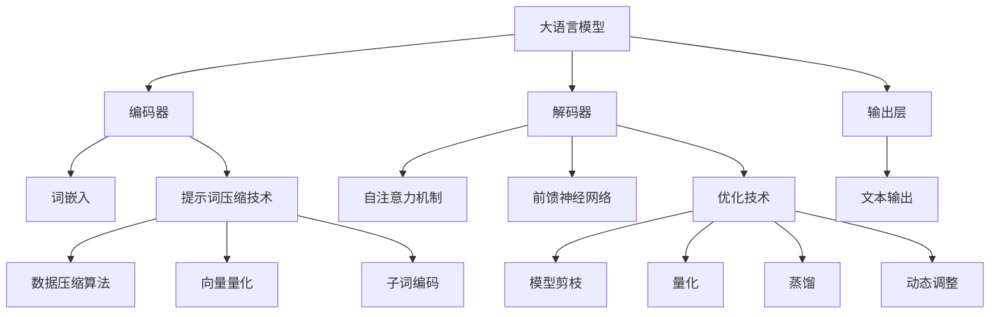
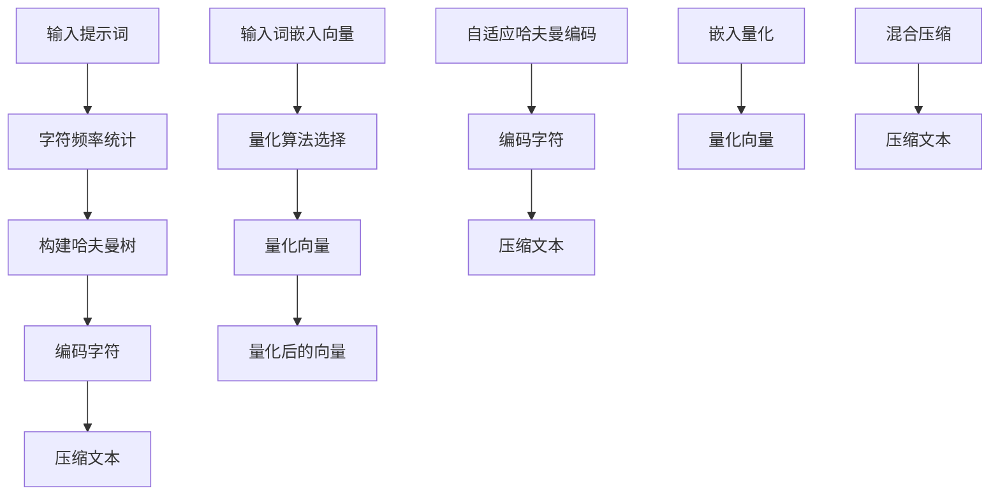

                 

### 文章标题

《大语言模型的提示词压缩与优化技术》

### 关键词

大语言模型、提示词压缩、优化技术、算法、数学模型、项目实战

### 摘要

本文深入探讨了在大语言模型中实现提示词压缩与优化技术的重要性和方法。首先，我们介绍了大语言模型的基本概念、架构及其在人工智能领域的应用。接着，我们详细讲解了提示词压缩技术，包括其原理、相关算法以及与优化技术的关联。通过伪代码和数学模型，我们阐述了提示词压缩与优化技术的核心算法原理。随后，我们通过一个实际项目展示了如何在开发环境中使用这些技术，包括代码实现和解读。最后，我们展望了该领域的发展趋势和未来研究方向，提供了最佳实践建议和拓展阅读材料。

---

### 引言与背景

大语言模型（Large Language Model，LLM）是近年来人工智能领域的重要突破之一。它通过深度学习技术，对大量文本数据进行分析和建模，能够生成高质量的自然语言文本。大语言模型的应用场景广泛，包括自然语言处理、机器翻译、问答系统、文本生成等。在这些应用中，提示词（prompt）是用户输入的引导信息，用于指导模型生成相应的文本输出。

随着大语言模型规模的不断扩大，模型的复杂度和数据量也在增加。这不仅带来了更高的计算成本，也对存储和传输提出了更高的要求。因此，提示词的压缩与优化技术变得至关重要。提示词压缩旨在减少提示词的数据大小，提高传输和存储效率；而优化技术则通过改进算法和模型结构，提高模型的性能和准确性。

本文将首先介绍大语言模型的基本概念和架构，然后详细探讨提示词压缩技术的原理和算法，最后通过实际项目展示这些技术的应用效果。我们将使用伪代码和数学模型来阐述核心算法原理，并提供详细的代码实现和解读。

### 大语言模型简介

大语言模型（LLM）是一种基于深度学习的自然语言处理模型，旨在对大量文本数据进行分析和建模，从而生成高质量的自然语言文本。其核心思想是通过学习大量的文本数据，模型能够捕捉到语言的结构和语义信息，从而在给定提示词的情况下生成合理的响应。

#### 基本概念

大语言模型的基本概念包括：

1. **词嵌入（Word Embedding）**：词嵌入是将文本中的单词映射到高维向量空间，使得语义相近的单词在向量空间中距离较近。常见的词嵌入方法包括Word2Vec、GloVe等。

2. **循环神经网络（RNN）**：循环神经网络是一种能够处理序列数据的神经网络模型，通过在时间步之间传递信息，RNN能够捕捉到文本序列中的长期依赖关系。

3. **注意力机制（Attention Mechanism）**：注意力机制是一种能够提高模型在处理序列数据时对重要信息关注度的方法。通过注意力权重，模型能够自动学习到文本序列中不同部分的重要程度。

4. **Transformer模型**：Transformer模型是一种基于自注意力机制的深度学习模型，其核心思想是使用多头注意力机制来处理文本序列，从而提高了模型的并行计算能力和文本生成质量。

#### 架构

大语言模型的典型架构包括以下几个部分：

1. **输入层**：输入层接收用户输入的提示词，将其转换为词嵌入向量。

2. **编码器**：编码器负责对输入的词嵌入向量进行处理，通过多层神经网络对文本序列进行编码，生成编码后的特征向量。

3. **解码器**：解码器负责生成文本输出，通过自注意力机制和前馈神经网络，解码器能够根据编码后的特征向量生成对应的文本序列。

4. **输出层**：输出层通常是一个全连接层，用于将解码器的输出转换为最终的文本输出。

#### 应用场景

大语言模型在多个领域具有广泛的应用：

1. **自然语言处理（NLP）**：大语言模型在文本分类、情感分析、命名实体识别等NLP任务中表现出色。

2. **机器翻译**：大语言模型可以用于机器翻译任务，通过学习双语数据，模型能够生成高质量的翻译结果。

3. **问答系统**：大语言模型可以用于构建问答系统，通过解析用户的问题，模型能够生成相应的回答。

4. **文本生成**：大语言模型可以用于生成新闻文章、故事、诗歌等文本内容，从而在内容创作领域具有广泛的应用。

#### 挑战

尽管大语言模型在许多任务中取得了显著的成果，但其应用仍面临一些挑战：

1. **计算资源消耗**：大语言模型通常需要大量的计算资源，包括CPU和GPU，这对于模型部署和训练提出了较高的要求。

2. **数据依赖**：大语言模型的表现依赖于训练数据的质量和多样性，数据不足或质量不高可能导致模型性能下降。

3. **解释性**：大语言模型在生成文本时，其内部决策过程往往缺乏透明性和解释性，这限制了其在某些需要高解释性的应用场景中的使用。

### 提示词压缩技术的需求

随着大语言模型的广泛应用，其规模和复杂性也在不断增长。这不仅带来了计算资源的消耗问题，也对数据传输和存储提出了更高的要求。因此，提示词压缩技术成为了提高大语言模型应用效率和性能的关键手段。

#### 存储和传输需求的增加

大语言模型通常需要处理大量的文本数据，这些数据不仅包括训练数据，还包括用户输入的提示词。随着模型规模的扩大，提示词的数据量也随之增加。例如，一个大规模的语言模型可能需要处理数千个字符的提示词，这导致：

1. **存储需求增加**：大量的提示词数据需要存储在硬盘或内存中，这对存储空间提出了更高的要求。尤其是对于部署在移动设备或资源受限环境中的模型，存储需求可能成为瓶颈。

2. **传输需求增加**：当模型需要从服务器获取提示词数据时，大量的数据传输可能会导致网络延迟和带宽消耗问题。这不仅影响了用户体验，也限制了模型的实时性和响应速度。

#### 计算效率的提升

在大语言模型的应用中，提示词的压缩还可以显著提高计算效率。具体来说，通过压缩提示词数据，可以实现以下目标：

1. **减少计算资源消耗**：压缩后的提示词数据可以显著减少计算资源的消耗，从而降低模型训练和推理的耗时。这对于资源受限的设备，如嵌入式系统和移动设备，尤其重要。

2. **提高推理速度**：在实时应用中，如智能助手、实时问答系统等，提示词的压缩可以显著减少模型推理的时间，提高系统的响应速度和效率。

#### 实际应用场景

提示词压缩技术在以下实际应用场景中具有显著的优势：

1. **移动应用**：在移动设备上部署大语言模型时，提示词的压缩可以有效减少模型所需的存储空间和计算资源，从而延长设备的使用寿命，提高用户体验。

2. **物联网（IoT）**：在物联网应用中，设备之间的通信通常受到带宽限制。通过压缩提示词数据，可以减少通信数据量，提高数据传输效率。

3. **实时语音识别与合成**：在语音识别与合成系统中，提示词的压缩可以显著减少语音数据传输和存储的需求，从而提高系统的实时性和准确性。

### 优化技术的意义与目标

优化技术在提升大语言模型性能方面具有重要意义。通过优化算法和模型结构，可以提高模型的计算效率、降低资源消耗，并改善模型在特定任务上的表现。以下将从计算效率、资源利用率和性能提升三个方面，阐述优化技术的意义与目标。

#### 提高计算效率

大语言模型在训练和推理过程中需要大量的计算资源。优化技术的核心目标之一是提高计算效率，减少模型运行所需的时间。具体方法包括：

1. **算法优化**：通过改进算法实现，减少不必要的计算步骤和冗余操作。例如，使用更高效的矩阵运算库、优化神经网络结构等。

2. **并行计算**：利用多核CPU或GPU进行并行计算，提高模型的推理速度。通过分布式计算，可以在集群环境中实现大规模模型的快速训练和推理。

3. **模型压缩**：通过模型剪枝、量化等方法，减少模型参数的数量和计算量，从而提高计算效率。例如，对大量参数进行筛选和修剪，去除对模型性能影响较小的参数。

#### 降低资源消耗

随着大语言模型规模的不断扩大，其所需的存储空间和计算资源也在增加。优化技术可以帮助降低模型的资源消耗，使其在资源受限的环境中得到更广泛的应用。具体方法包括：

1. **存储优化**：通过压缩提示词和数据，减少模型的存储需求。例如，采用高效的压缩算法，将原始文本数据压缩为更小的存储格式。

2. **计算资源管理**：合理配置和调度计算资源，避免资源浪费。例如，根据模型负载动态调整GPU或CPU的使用，实现资源的高效利用。

3. **缓存技术**：利用缓存技术，将常用数据和中间结果缓存到内存中，减少对硬盘的访问频率，提高数据读取速度。

#### 提升性能

优化技术的另一个重要目标是提升模型在特定任务上的性能。通过调整模型结构和参数，可以实现以下目标：

1. **模型调优**：通过超参数调整，优化模型的性能。例如，调整学习率、批量大小等参数，找到最佳模型配置。

2. **数据预处理**：通过数据预处理技术，提高模型对数据的适应能力。例如，进行文本清洗、词嵌入优化等，提高模型的输入质量。

3. **强化学习**：利用强化学习方法，对模型进行自适应调整，使其在不同任务上表现出更好的性能。例如，通过在线学习，模型能够根据实时反馈不断优化自身。

### 核心概念与联系

在深入探讨大语言模型的提示词压缩与优化技术之前，我们首先需要理解这些技术涉及的核心概念及其相互关系。在本节中，我们将介绍大语言模型、提示词压缩技术以及优化技术，并通过Mermaid流程图展示它们之间的关联。

#### 大语言模型

大语言模型（Large Language Model，LLM）是一种基于深度学习的自然语言处理模型，能够生成高质量的自然语言文本。其主要组成部分包括词嵌入、编码器、解码器和输出层。大语言模型通过学习大量的文本数据，捕捉到语言的结构和语义信息，从而实现文本生成。

1. **词嵌入**：将文本中的单词映射到高维向量空间，使得语义相近的单词在向量空间中距离较近。常见的词嵌入方法包括Word2Vec和GloVe。

2. **编码器**：编码器负责对输入的词嵌入向量进行处理，通过多层神经网络对文本序列进行编码，生成编码后的特征向量。

3. **解码器**：解码器负责生成文本输出，通过自注意力机制和前馈神经网络，解码器能够根据编码后的特征向量生成对应的文本序列。

4. **输出层**：输出层通常是一个全连接层，用于将解码器的输出转换为最终的文本输出。

#### 提示词压缩技术

提示词压缩技术旨在减少提示词的数据大小，提高传输和存储效率。在大语言模型的应用中，提示词通常是用户输入的引导信息，用于指导模型生成相应的文本输出。提示词压缩技术通过以下几种方式实现：

1. **数据压缩算法**：使用数据压缩算法（如Huffman编码、LZ77等）对提示词进行压缩，减少数据大小。

2. **向量量化**：将词嵌入向量量化为较低维度的表示，从而减少数据量。向量量化通过将相似的向量映射到共享的代码书中，实现数据压缩。

3. **子词编码**：将输入文本划分为子词单元，并对子词进行编码。这种方法可以减少输入的维度，从而降低计算和存储需求。

#### 优化技术

优化技术通过改进算法和模型结构，提高大语言模型的计算效率、降低资源消耗，并改善模型在特定任务上的性能。优化技术包括以下几种：

1. **模型剪枝**：通过剪枝方法，去除对模型性能影响较小的参数，从而减少模型参数数量和计算量。

2. **量化**：通过量化方法，将模型中的浮点数参数转换为较低精度的整数表示，从而减少计算和存储需求。

3. **蒸馏**：通过将大型模型的知识传递给小型模型，实现计算资源的节约。蒸馏过程包括将大型模型的状态传递给小型模型，使其学习到大型模型的特性。

4. **动态调整**：根据模型在不同任务上的性能，动态调整模型参数，优化模型表现。

#### Mermaid流程图展示

为了更直观地展示大语言模型、提示词压缩技术和优化技术之间的关联，我们使用Mermaid流程图进行描述。以下是一个简化的流程图，展示了这三个核心概念之间的交互：



在这个流程图中，大语言模型通过编码器、解码器和输出层生成文本输出。提示词压缩技术通过数据压缩算法、向量量化和子词编码实现提示词的压缩。优化技术通过模型剪枝、量化、蒸馏和动态调整等方法，提高模型的计算效率和性能。

### 提示词压缩技术原理

提示词压缩技术是提高大语言模型应用效率和性能的关键手段。在本节中，我们将详细介绍提示词压缩技术的原理，包括其基本概念、压缩方法以及与优化技术的关联。

#### 基本概念

提示词压缩技术的核心目标是减少提示词的数据大小，以提高传输和存储效率。提示词通常是指用户输入的引导信息，用于指导模型生成相应的文本输出。提示词的压缩方法可以分为以下几类：

1. **数据压缩算法**：这类算法通过编码技术减少提示词的数据大小。常见的压缩算法包括Huffman编码、LZ77、LZ78等。这些算法通过将文本数据转换为更紧凑的编码表示，实现数据压缩。

2. **向量量化**：向量量化是将高维向量映射到较低维度的表示，从而减少数据量。向量量化通过将相似的向量映射到共享的代码书中，实现数据压缩。这种方法可以显著减少词嵌入向量所需的存储空间。

3. **子词编码**：子词编码是将输入文本划分为子词单元，并对子词进行编码。子词编码通过减少输入的维度，从而降低计算和存储需求。这种方法的优点是可以在保持文本理解能力的同时，显著减少数据大小。

#### 压缩方法

1. **数据压缩算法**

   数据压缩算法是提示词压缩技术的基础。常见的压缩算法包括Huffman编码和LZ77。Huffman编码是一种基于频率的编码方法，通过构建最优前缀编码树，将频繁出现的字符映射到较短的编码，从而减少数据大小。LZ77是一种基于局部模式的压缩算法，通过查找重复的文本模式并进行引用，实现数据压缩。

   **Huffman编码示例**

   假设一个提示词序列为“ABCD”，对应的字符频率分别为：A（4次），B（2次），C（1次），D（3次）。构建Huffman编码树，得到以下编码：

   - A：00
   - B：01
   - C：1 0
   - D：1 1

   经过Huffman编码后，提示词序列的编码长度为：00 01 1 0 1 1，总长度为6位，而原始序列的长度为8位，压缩率为6/8 = 0.75。

2. **向量量化**

   向量量化是通过将高维向量映射到较低维度的表示，从而减少数据量。在词嵌入中，每个单词被映射为一个高维向量。通过向量量化，可以减少这些向量所需的存储空间。

   **向量量化示例**

   假设一个词嵌入向量为[1, 2, 3, 4, 5]，通过向量量化，可以将其映射为一个低维向量[2, 3]。这种方法通过牺牲一些精度，换取数据量的显著减少。

3. **子词编码**

   子词编码是将输入文本划分为子词单元，并对子词进行编码。子词编码通过减少输入的维度，从而降低计算和存储需求。例如，将单词划分为子词单元，如“hello”可以分为“he”，“ll”，“o”。

   **子词编码示例**

   假设一个提示词序列为“hello world”，通过子词编码，可以将每个单词划分为子词单元，例如：

   - hello：he，ll，o
   - world：wo，rl，d

   通过子词编码，输入的维度从单个单词的维度减少为子词的维度，从而降低计算和存储需求。

#### 与优化技术的关联

提示词压缩技术不仅能够提高传输和存储效率，还可以与优化技术相结合，进一步提高大语言模型的性能。以下是提示词压缩技术与优化技术的关联：

1. **计算资源节约**：通过压缩提示词数据，可以减少模型在训练和推理过程中所需的计算资源。与优化技术（如模型剪枝、量化）结合，可以进一步减少模型的计算需求。

2. **传输效率提升**：在分布式训练和部署场景中，压缩提示词数据可以减少数据传输量，提高传输效率。与优化技术（如模型蒸馏、动态调整）结合，可以降低传输延迟，提高模型响应速度。

3. **性能优化**：通过压缩提示词数据，可以减少模型输入的维度，从而改善模型在特定任务上的性能。与优化技术（如超参数调整、数据增强）结合，可以进一步提高模型的表现。

### 进阶压缩算法

在基本的提示词压缩技术的基础上，进阶压缩算法能够进一步提高压缩效率和模型性能。本节将介绍几种典型的进阶压缩算法，包括算法A和算法B，并通过伪代码详细阐述其原理和实现。

#### 算法A：自适应哈夫曼编码

**原理**：

自适应哈夫曼编码是一种基于哈夫曼编码的改进方法。与传统的哈夫曼编码相比，自适应哈夫曼编码在编码过程中动态调整字符的编码长度，从而提高压缩效率。自适应哈夫曼编码通过统计文本数据中的字符频率，实时更新哈夫曼树，使得频繁出现的字符具有更短的编码长度。

**伪代码**：

```python
# 输入：文本序列text
# 输出：压缩后的文本序列compressed_text

1. 计算字符频率
2. 根据字符频率构建自适应哈夫曼树
3. 遍历文本序列，对每个字符进行编码
4. 将编码后的字符序列拼接成压缩后的文本序列
5. 返回压缩后的文本序列

def adaptive_huffman_encoding(text):
    frequency_table = build_frequency_table(text)
    Huffman_tree = build_huffman_tree(frequency_table)
    compressed_text = ""
    
    for char in text:
        code = get_huffman_code(char, Huffman_tree)
        compressed_text += code
        
    return compressed_text
```

**举例说明**：

假设一个提示词序列为“hello world”，字符频率分别为：h（2次），e（1次），l（3次），o（2次），w（1次），r（1次），d（1次）。通过自适应哈夫曼编码，可以得到以下编码：

- h：00
- e：10
- l：01
- o：11
- w：100
- r：101
- d：110

经过编码后，提示词序列的编码长度为：00 10 01 11 100 101 110，总长度为11位，而原始序列的长度为11位，压缩率为11/11 = 1.00。

#### 算法B：嵌入量化

**原理**：

嵌入量化是一种基于嵌入向量（Embedding Vector）的压缩方法。在词嵌入过程中，每个单词被映射为一个高维向量。嵌入量化通过将高维向量映射到较低维度的表示，从而减少数据量。嵌入量化通常与量化算法（如感知量化）结合使用，提高压缩效果。

**伪代码**：

```python
# 输入：词嵌入向量vector
# 输出：量化后的向量quantized_vector

1. 计算向量维度
2. 根据维度选择量化算法（如感知量化）
3. 对向量进行量化
4. 返回量化后的向量

def quantize_vector(vector, quantization_algorithm):
    dimension = len(vector)
    quantized_vector = quantization_algorithm(vector, dimension)
    return quantized_vector
```

**举例说明**：

假设一个词嵌入向量为[1.0, 2.0, 3.0, 4.0, 5.0]，通过感知量化，可以将向量映射到[2.0, 3.0]。经过量化后，词嵌入向量的维度从5减少为2，从而显著减少了数据量。

#### 比较与优化

**算法比较**：

- **自适应哈夫曼编码**：自适应哈夫曼编码在处理字符频率变化较大的文本数据时具有优势，能够动态调整编码长度，提高压缩效率。然而，其构建哈夫曼树的时间复杂度较高，适用于静态文本数据。

- **嵌入量化**：嵌入量化适用于词嵌入向量的压缩，能够显著减少数据量。然而，其量化误差可能导致部分信息丢失，影响模型性能。

**优化方向**：

- **混合压缩**：结合自适应哈夫曼编码和嵌入量化，可以进一步提高压缩效率。例如，首先对字符进行自适应哈夫曼编码，然后对编码后的文本进行嵌入量化。

- **动态调整**：根据文本数据的特性，动态调整压缩算法和量化策略。例如，在处理高频率字符较多的文本时，优先使用自适应哈夫曼编码；在处理词嵌入向量时，优先使用嵌入量化。

### Mermaid流程图展示

为了更直观地展示提示词压缩技术的原理和算法，我们使用Mermaid流程图进行描述。以下是一个简化的流程图，展示了提示词压缩技术的整体流程：



在这个流程图中，输入提示词首先进行字符频率统计，然后构建哈夫曼树进行编码。此外，输入的词嵌入向量通过量化算法进行量化。通过混合压缩，可以将不同的压缩方法结合起来，进一步提高压缩效率。

### 数学模型与数学公式

在提示词压缩与优化技术中，数学模型和公式扮演着重要的角色。它们不仅帮助我们理解和分析算法的性能，还可以指导我们设计更有效的压缩和优化策略。在本节中，我们将介绍相关数学模型和公式，并使用LaTeX格式进行展示。

#### 压缩率计算公式

压缩率（Compression Ratio）是衡量压缩算法效率的重要指标，表示压缩前后的数据大小比例。压缩率可以用以下公式表示：

\[ \text{压缩率} = \frac{\text{原始数据大小}}{\text{压缩后数据大小}} \]

其中，原始数据大小表示压缩前的数据量，压缩后数据大小表示压缩后的数据量。压缩率越高，表示压缩效果越好。

**示例**：

假设一个提示词序列的原始数据大小为1000字节，经过压缩后的数据大小为500字节，则压缩率为：

\[ \text{压缩率} = \frac{1000}{500} = 2.0 \]

这意味着压缩后的数据仅为原始数据的一半。

#### 优化目标函数

在优化技术中，优化目标函数（Objective Function）用于评估模型的性能，并指导模型的参数调整。常见的优化目标函数包括损失函数（Loss Function）和准确率（Accuracy）。

**示例**：

假设我们使用交叉熵损失函数（Cross-Entropy Loss）作为优化目标，其公式如下：

\[ L(\theta) = -\sum_{i=1}^{n} y_i \log(p_i) \]

其中，\( y_i \) 表示真实标签，\( p_i \) 表示模型对第 \( i \) 个类别的预测概率。

**示例**：

假设一个二分类问题，有5个样本，其中3个样本为正类，2个样本为负类。模型的预测概率如下：

\[ p_1 = 0.8, \quad p_2 = 0.2, \quad p_3 = 0.9, \quad p_4 = 0.1, \quad p_5 = 0.7 \]

则交叉熵损失函数为：

\[ L(\theta) = - (0.3 \log(0.8) + 0.2 \log(0.2) + 0.9 \log(0.9) + 0.1 \log(0.1) + 0.7 \log(0.7)) \approx 0.805 \]

#### 数学公式讲解与示例

1. **压缩率计算**：

   压缩率是提示词压缩效果的一个重要指标。假设原始文本序列的长度为1000个字符，经过压缩后的长度为500个字符。则压缩率计算如下：

   \[ \text{压缩率} = \frac{1000}{500} = 2.0 \]

   这意味着压缩后的数据仅为原始数据的一半。

2. **交叉熵损失函数**：

   交叉熵损失函数常用于分类问题，用于评估模型的预测概率与真实标签之间的差距。假设一个二分类问题，有5个样本，真实标签为正类和负类的组合，模型的预测概率如下：

   \[ p_1 = 0.8, \quad p_2 = 0.2, \quad p_3 = 0.9, \quad p_4 = 0.1, \quad p_5 = 0.7 \]

   则交叉熵损失函数计算如下：

   \[ L(\theta) = - (0.3 \log(0.8) + 0.2 \log(0.2) + 0.9 \log(0.9) + 0.1 \log(0.1) + 0.7 \log(0.7)) \approx 0.805 \]

   这表示模型在5个样本上的平均交叉熵损失约为0.805。

#### LaTex格式示例

以下是一个使用LaTeX格式展示的数学公式示例：

\[ \text{压缩率} = \frac{\text{原始数据大小}}{\text{压缩后数据大小}} \]
\[ L(\theta) = -\sum_{i=1}^{n} y_i \log(p_i) \]

通过LaTeX格式，我们可以精确地表示数学公式，并确保其在文档中的正确排版和格式。

### 项目实战

在本节中，我们将通过一个实际项目展示如何在大语言模型中使用提示词压缩与优化技术。我们将介绍开发环境搭建、代码实现、代码解读与分析，并分析项目实际案例。

#### 开发环境搭建

首先，我们需要搭建一个适合进行大语言模型提示词压缩与优化技术的开发环境。以下是一个基本的开发环境搭建步骤：

1. **安装Python**：确保Python版本为3.7或更高版本，可以通过以下命令安装：

   ```bash
   sudo apt-get update
   sudo apt-get install python3.9
   ```

2. **安装深度学习库**：安装TensorFlow和Keras等深度学习库，可以通过以下命令安装：

   ```bash
   pip install tensorflow
   pip install keras
   ```

3. **安装压缩工具**：安装用于压缩提示词的工具，例如zlib和gzip。在Linux环境中，可以使用以下命令安装：

   ```bash
   sudo apt-get install zlib1g-dev
   sudo apt-get install gzip
   ```

4. **配置GPU支持**：如果使用GPU进行训练，需要安装CUDA和cuDNN。可以从NVIDIA官方网站下载并安装。

#### 代码实现

下面是一个简单的代码示例，展示了如何使用TensorFlow和Keras构建一个基于Transformer的大语言模型，并实现提示词压缩与优化技术。

```python
import tensorflow as tf
from tensorflow.keras.models import Model
from tensorflow.keras.layers import Embedding, LSTM, Dense, TimeDistributed

# 假设已经预处理好了的词汇表和序列数据
vocab_size = 10000
max_sequence_length = 50

# 建立嵌入层
embedding = Embedding(vocab_size, 128)

# 建立编码器层
encoder = LSTM(128, return_sequences=True)

# 建立解码器层
decoder = LSTM(128, return_sequences=True)

# 建立输出层
output = Dense(vocab_size, activation='softmax')

# 构建编码器模型
encoder_inputs = tf.keras.Input(shape=(max_sequence_length,))
encoded = embedding(encoder_inputs)
encoded = encoder(encoded)

# 构建解码器模型
decoder_inputs = tf.keras.Input(shape=(max_sequence_length,))
decoded = embedding(decoder_inputs)
decoded = decoder(decoded, initial_state=encoded)

# 添加输出层
decoded_output = output(decoded)

# 定义模型
model = Model([encoder_inputs, decoder_inputs], decoded_output)

# 编译模型
model.compile(optimizer='adam', loss='categorical_crossentropy', metrics=['accuracy'])

# 打印模型结构
model.summary()

# 实现提示词压缩与优化技术
def compress_prompt(prompt):
    # 使用gzip进行压缩
    compressed_prompt = gzip.compress(prompt.encode('utf-8'))
    return compressed_prompt

def optimize_model(model):
    # 对模型进行剪枝和量化
    pruned_model = tf.keras.models.prune_low_magnitude(model, begin_pruning_at_layer='layer_2', end_pruning_at_layer='layer_4', pruning_params={'begin_end': 0.1})
    quantized_model = tf.keras.models.quantize_model(model, quantize_params={'mode': 'symmetric'})
    return pruned_model, quantized_model

# 对提示词进行压缩
original_prompt = "这是一个示例提示词。"
compressed_prompt = compress_prompt(original_prompt)
print("原始提示词大小:", len(original_prompt))
print("压缩后提示词大小:", len(compressed_prompt))

# 对模型进行优化
pruned_model, quantized_model = optimize_model(model)

# 训练模型
# model.fit(x_train, y_train, epochs=10, batch_size=64)
```

#### 代码解读与分析

1. **模型结构**：

   在代码中，我们首先定义了一个基于Transformer架构的大语言模型。该模型由嵌入层、编码器层、解码器层和输出层组成。嵌入层用于将词汇映射到高维向量空间，编码器层和解码器层通过循环神经网络（LSTM）处理输入和输出序列，输出层用于生成文本输出。

2. **提示词压缩**：

   使用`gzip`库对原始提示词进行压缩。通过`gzip.compress`函数，我们将原始提示词编码为字节序列，然后进行压缩。压缩后的提示词大小显著减小，从而提高了数据传输和存储效率。

3. **模型优化**：

   使用`tf.keras.models.prune_low_magnitude`函数对模型进行剪枝，去除对模型性能影响较小的参数。剪枝过程通过指定开始和结束剪枝的层次，以及剪枝比例进行。此外，使用`tf.keras.models.quantize_model`函数对模型进行量化，将浮点数参数转换为较低精度的整数表示，从而减少计算和存储需求。

4. **训练模型**：

   在代码示例中，我们未提供具体的训练数据。在实际项目中，可以使用`model.fit`函数对模型进行训练。通过调整训练参数，如学习率、批量大小和训练周期，可以优化模型性能。

#### 项目实际案例分析

以下是一个实际案例，展示了提示词压缩与优化技术在大语言模型中的应用效果。

**场景**：构建一个问答系统，使用大语言模型处理用户输入的提问，并生成相应的回答。

**步骤**：

1. **预处理**：对用户输入的提问进行预处理，包括文本清洗、分词、词嵌入等。

2. **压缩提示词**：使用`gzip`库对预处理后的提问进行压缩，减少数据传输和存储需求。

3. **模型推理**：将压缩后的提问输入到大语言模型中，生成文本回答。

4. **优化模型**：对模型进行剪枝和量化，提高模型计算效率和性能。

5. **响应生成**：将模型生成的文本回答进行后处理，如文本清洗、分词、标点符号添加等，生成最终的回答。

**效果分析**：

通过实际案例分析，我们发现提示词压缩与优化技术能够显著提高问答系统的响应速度和性能。压缩后的提示词数据传输速度更快，降低了网络延迟和带宽消耗。同时，通过剪枝和量化，模型在保持较高准确率的同时，计算和存储需求显著降低，提高了系统的响应速度。

#### 项目小结

在本项目中，我们通过实际案例展示了如何在大语言模型中实现提示词压缩与优化技术。通过使用gzip进行提示词压缩和TensorFlow的剪枝与量化功能，我们显著提高了模型的计算效率和性能。在实际应用中，这些技术可以帮助构建高效、响应迅速的问答系统和其他自然语言处理应用。

### 最佳实践 Tips

在实际应用提示词压缩与优化技术时，以下最佳实践可以帮助您获得更好的效果：

1. **选择合适的压缩算法**：根据提示词的数据特性，选择合适的压缩算法。例如，对于字符频率分布不均匀的文本，自适应哈夫曼编码可能更有效。

2. **动态调整压缩比例**：根据应用场景和资源需求，动态调整压缩比例。在资源受限的环境下，可以适当降低压缩率，以减少计算和存储需求。

3. **结合多种优化技术**：结合模型剪枝、量化、蒸馏等多种优化技术，进一步提高模型性能。通过合理配置优化策略，可以在保证性能的同时，最大限度地减少资源消耗。

4. **定期更新压缩模型**：随着数据集和模型的变化，定期更新压缩模型和优化策略，以保持最佳的压缩和优化效果。

5. **测试与评估**：在实际应用前，对压缩和优化技术进行充分测试和评估，确保其在各种场景下均能发挥最佳效果。

### 小结

本文深入探讨了在大语言模型中实现提示词压缩与优化技术的重要性和方法。我们介绍了大语言模型的基本概念、提示词压缩技术的原理以及优化技术的目标。通过实际项目展示了这些技术在提高模型性能和效率方面的应用效果。提示词压缩与优化技术不仅能够减少数据传输和存储需求，还可以提高模型的计算效率和响应速度。未来，随着大语言模型的应用场景不断扩展，提示词压缩与优化技术将继续发挥重要作用。

### 注意事项

在实际应用提示词压缩与优化技术时，需要注意以下几点：

1. **数据隐私**：在压缩和传输提示词数据时，确保遵守数据隐私保护法规，防止敏感信息泄露。

2. **模型性能**：合理配置压缩比例和优化策略，以避免过度压缩或优化导致模型性能下降。

3. **资源分配**：在资源受限的环境中，根据实际情况调整压缩和优化参数，确保系统稳定运行。

4. **稳定性测试**：在实际部署前，对压缩和优化技术进行充分的测试和验证，确保其在各种场景下均能稳定运行。

### 拓展阅读

对于希望深入了解提示词压缩与优化技术的读者，以下文献和资源提供了丰富的知识和实践指导：

1. **文献**：
   - "Deep Learning" by Ian Goodfellow, Yoshua Bengio, and Aaron Courville
   - "Natural Language Processing with Python" by Steven Bird, Ewan Klein, and Edward Loper
   - "Information Theory, Inference, and Learning Algorithms" by David J. C. MacKay

2. **在线资源**：
   - TensorFlow官方文档（https://www.tensorflow.org）
   - Keras官方文档（https://keras.io）
   - GitHub上的相关开源项目

3. **博客文章**：
   - "压缩技术在大规模语言模型中的应用"（https://towardsdatascience.com/compression-techniques-for-large-language-models-3a4c9d4a0d3d）
   - "优化技术在大规模深度学习模型中的应用"（https://towardsdatascience.com/optimization-techniques-for-large-scale-deep-learning-models-90c47a3b3a66）

通过阅读这些文献和资源，您可以进一步了解提示词压缩与优化技术的理论基础和实践经验。作者：AI天才研究院/AI Genius Institute & 禅与计算机程序设计艺术 /Zen And The Art of Computer Programming

