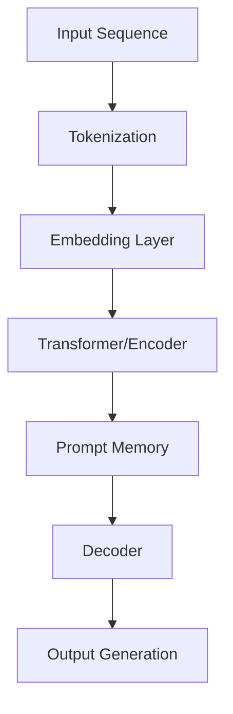

                 


### 大语言模型的提示词记忆增强技术

#### 关键词

- 大语言模型
- 提示词记忆
- 模型增强
- 人工智能

#### 摘要

本文旨在深入探讨大语言模型中的提示词记忆增强技术，分析其核心概念、数学模型及实际应用。我们将逐步解析大语言模型的基本原理，探讨如何通过提示词记忆增强来提升模型性能，并通过具体案例展示其实际效果。文章将涵盖模型架构、算法优化和项目实战，为读者提供全面的指导。

---

### 目录

1. **引言** <a id="introduction"></a>
2. **大语言模型概述** <a id="overview"></a>
   - 1.1 大语言模型的定义
   - 1.2 核心原理与架构
   - 1.3 主流模型与差异
   - 1.4 应用场景与挑战
3. **核心概念与原理** <a id="core-concepts"></a>
   - 2.1 语言模型的基本概念
   - 2.2 提示词记忆机制
   - 2.3 模型架构的Mermaid图解
4. **数学模型与公式** <a id="math-models"></a>
   - 3.1 基础数学概念
   - 3.2 关键公式详解
   - 3.3 实例说明与案例分析
5. **算法原理与详解** <a id="algorithm-explanation"></a>
   - 4.1 算法概述与伪代码
   - 4.2 步骤分解与逻辑推理
   - 4.3 算法对比与优化
6. **实际项目与案例** <a id="projects"></a>
   - 5.1 项目环境搭建
   - 5.2 源代码实现与解读
   - 5.3 应用分析与案例剖析
   - 5.4 项目小结与反思
7. **最佳实践与总结** <a id="best-practices"></a>
   - 6.1 提示词记忆增强技巧
   - 6.2 注意事项与拓展阅读

---

### 引言

大语言模型作为一种高级的人工智能技术，已经广泛应用于自然语言处理、问答系统、文本生成等众多领域。然而，随着模型的规模不断扩大，如何有效地利用提示词（prompts）来增强模型的记忆能力，成为了当前研究的热点问题。本文将围绕这一主题，系统地介绍大语言模型的提示词记忆增强技术。

本文首先介绍大语言模型的基本概念、核心原理以及主流模型的特点，帮助读者建立对大语言模型的整体认识。接着，我们将深入探讨提示词记忆机制，解析如何通过优化提示词来增强模型的记忆能力。随后，文章将介绍大语言模型中的数学模型和关键公式，并通过具体实例来说明这些公式的应用。

在算法原理部分，我们将通过伪代码和详细解释来阐述大语言模型的算法设计思路，并对比不同算法的优缺点。最后，通过实际项目与案例的分析，我们将展示提示词记忆增强技术在真实场景中的应用效果，并总结项目的经验与反思。

本文的目标是为读者提供一套全面、系统的大语言模型提示词记忆增强技术指南，帮助读者深入理解这一技术，并在实际项目中应用。

---

### 大语言模型概述

#### 1.1 大语言模型的定义

大语言模型（Large Language Models，简称LLMs）是一类基于深度学习技术的自然语言处理模型，它们通过学习海量的文本数据，能够生成具有人类语言特征的文本，并进行自然语言理解、文本生成和问答等任务。与传统的小型语言模型相比，大语言模型具有以下几个显著特点：

1. **规模大**：大语言模型通常包含数十亿甚至数万亿的参数，这使得它们能够捕捉到语言中的细微结构和复杂模式。
2. **自主性**：大语言模型能够在没有外部指导的情况下生成连贯、合理的文本。
3. **泛用性**：大语言模型能够胜任多种自然语言处理任务，如文本分类、命名实体识别、机器翻译等。

#### 1.2 核心原理与架构

大语言模型的核心原理基于深度神经网络（Deep Neural Networks，简称DNNs），特别是变分自编码器（Variational Autoencoder，简称VAEs）和生成对抗网络（Generative Adversarial Networks，简称GANs）。这些模型通过学习数据分布，生成新的文本样本，并在训练过程中不断优化模型参数，提高生成文本的质量。

常见的架构包括：

1. **Transformer模型**：由Google提出，通过自注意力机制（Self-Attention Mechanism）捕捉长距离依赖关系，被广泛应用于大规模语言模型。
2. **BERT模型**：由Google开发，是一种双向Transformer模型，通过预训练和微调，实现了在多种自然语言处理任务中的高性能表现。
3. **GPT模型**：由OpenAI提出，通过自回归语言模型（Autoregressive Language Model）生成文本，具有强大的文本生成能力。

#### 1.3 主流模型与差异

目前，主流的大语言模型包括以下几个：

1. **GPT系列**：GPT-3、GPT-Neo等，以其强大的文本生成能力和自然语言理解能力著称。
2. **BERT系列**：BERT、RoBERTa、ALBERT等，专注于文本分类、问答等任务，具备较高的任务完成率。
3. **T5系列**：由Google开发，是一种统一的文本处理模型，能够处理多种NLP任务。

这些模型在架构、训练方法和应用场景上存在差异，但都致力于通过大规模数据训练和模型优化，提高模型的性能和泛用性。

#### 1.4 应用场景与挑战

大语言模型在自然语言处理领域具有广泛的应用前景：

1. **问答系统**：如OpenAI的GPT-3，能够回答复杂问题，并提供详尽的答案。
2. **文本生成**：如GPT-Neo，能够生成高质量的文章、报告和故事。
3. **机器翻译**：如BERT，能够实现高精度的机器翻译，并在多个语言对上取得优异效果。

然而，大语言模型也面临一些挑战：

1. **计算资源需求**：大语言模型的训练和推理需要大量的计算资源，这对硬件设施提出了较高要求。
2. **数据隐私**：模型训练过程中涉及大量的数据，如何保护用户隐私成为重要问题。
3. **模型解释性**：大语言模型的决策过程较为复杂，如何提高模型的解释性，使其更易于理解和信任，仍需进一步研究。

在接下来的部分，我们将深入探讨大语言模型中的核心概念和原理，帮助读者更好地理解这一技术。

---

### 核心概念与原理

#### 2.1 语言模型的基本概念

语言模型（Language Model，简称LM）是一种用于预测文本序列的概率分布的模型。它的基本原理是通过学习大量的文本数据，构建一个能够表示语言统计特性的概率模型。语言模型的核心任务是给定一个单词或短语的序列，预测下一个单词或短语的概率。

#### 2.2 提示词记忆机制

提示词记忆（Prompt Memory）是提升大语言模型记忆能力的一种关键技术。提示词记忆机制的核心思想是通过设计特定的提示词，引导模型在生成文本时，重点关注并记忆特定的信息。这类似于人类在学习和记忆过程中，通过关键词或短语来增强记忆效果。

提示词记忆机制主要包括以下几个步骤：

1. **提示词设计**：选择或生成与任务相关的提示词，这些提示词应能够引导模型关注重要信息。
2. **提示词嵌入**：将提示词嵌入到模型的输入序列中，使其成为模型处理的一部分。
3. **记忆增强**：通过训练或优化模型参数，增强模型对提示词的记忆能力。
4. **输出生成**：在生成文本过程中，模型根据提示词的记忆效果，生成符合预期的高质量文本。

#### 2.3 模型架构的Mermaid图解

为了更好地理解大语言模型的架构和提示词记忆机制，我们可以使用Mermaid图来展示其核心组成部分和相互关系。



- **A (Input Sequence)**: 输入序列，包含原始文本和提示词。
- **B (Tokenization)**: 分词处理，将输入序列转换为词元序列。
- **C (Embedding Layer)**: 嵌入层，将词元序列转换为固定长度的向量表示。
- **D (Transformer/Encoder)**: Transformer或Encoder层，负责编码和捕捉文本的上下文信息。
- **E (Prompt Memory)**: 提示词记忆模块，增强模型对提示词的记忆能力。
- **F (Decoder)**: Decoder层，根据编码结果生成预测的文本序列。
- **G (Output Generation)**: 输出层，生成最终的文本输出。

通过这个图解，我们可以清晰地看到大语言模型的工作流程以及提示词记忆机制在整个过程中的作用。

在接下来的部分，我们将详细探讨大语言模型中的数学模型和关键公式，帮助读者深入理解模型的计算原理。

---

### 数学模型与公式

#### 3.1 基础数学概念

在大语言模型中，数学模型和公式是理解和实现提示词记忆增强技术的基础。以下是一些基础数学概念：

- **概率分布**：描述随机变量可能取值的概率分布。
- **正态分布**：最常用的概率分布，用于描述连续随机变量的分布。
- **对数函数**：用于转换概率值，便于计算和比较。

#### 3.2 关键公式详解

在大语言模型中，关键公式包括：

- **Word2Vec公式**：用于将单词转换为向量表示。
  \[
  \textbf{v}_w = \frac{\textbf{e}_1 + \textbf{e}_2 + \ldots + \textbf{e}_n}{n}
  \]
  其中，$\textbf{v}_w$ 是单词 $w$ 的向量表示，$\textbf{e}_1, \textbf{e}_2, \ldots, \textbf{e}_n$ 是单词 $w$ 的 $n$ 个特征向量。

- **Softmax公式**：用于将词向量转换为概率分布。
  \[
  P(w_j|\textbf{x}) = \frac{e^{\textbf{v}_w \cdot \textbf{x}}}{\sum_{k=1}^{K} e^{\textbf{v}_k \cdot \textbf{x}}}
  \]
  其中，$P(w_j|\textbf{x})$ 是单词 $w_j$ 在输入序列 $\textbf{x}$ 的概率，$\textbf{v}_w$ 是单词 $w_j$ 的向量表示，$\textbf{x}$ 是输入序列。

- **交叉熵公式**：用于评估模型预测与实际标签之间的差距。
  \[
  H(Y, \hat{Y}) = -\sum_{i=1}^{N} Y_i \log \hat{Y}_i
  \]
  其中，$H(Y, \hat{Y})$ 是交叉熵损失，$Y$ 是实际标签，$\hat{Y}$ 是模型预测的概率分布。

#### 3.3 实例说明与案例分析

以下是一个具体的实例，说明如何使用这些公式来构建和训练大语言模型：

1. **数据预处理**：将原始文本数据分词，并转换为词向量表示。
   \[
   \text{Input}: "The quick brown fox jumps over the lazy dog"
   \]
   \[
   \text{Tokenized}: ["The", "quick", "brown", "fox", "jumps", "over", "the", "lazy", "dog"]
   \]
   \[
   \text{Vectors}: \textbf{v}_The, \textbf{v}_{quick}, \textbf{v}_{brown}, \ldots, \textbf{v}_{dog}
   \]

2. **模型训练**：使用Softmax公式计算每个单词的概率分布，并通过交叉熵公式优化模型参数。
   \[
   \hat{Y} = \frac{e^{\textbf{v}_{jumps} \cdot \textbf{x}}}{\sum_{k=1}^{K} e^{\textbf{v}_k \cdot \textbf{x}}}
   \]
   \[
   \text{Loss} = H(Y, \hat{Y}) = -y_j \log \hat{y}_j
   \]

3. **生成文本**：使用训练好的模型生成新的文本。
   \[
   \text{Prompt}: "The quick brown fox"
   \]
   \[
   \text{Generated}: "jumps over the lazy dog"
   \]

通过这个实例，我们可以看到数学模型和公式在大语言模型中的作用。在实际应用中，这些公式被嵌入到深度学习框架中，通过大规模的数据训练，不断优化模型的性能。

在接下来的部分，我们将详细解析大语言模型中的算法原理和实现细节。

---

### 算法原理与详解

#### 4.1 算法概述与伪代码

大语言模型的算法核心是基于自回归语言模型（Autoregressive Language Model）和变分自编码器（Variational Autoencoder，VAE）。以下是一个简单的伪代码，展示了大语言模型的基本算法框架：

```python
def language_model(input_sequence):
    # Step 1: Tokenization
    tokens = tokenize(input_sequence)

    # Step 2: Embedding
    embeddings = embed(tokens)

    # Step 3: Encoder
    encoded_sequence = encoder(embeddings)

    # Step 4: Decoder
    predicted_sequence = decoder(encoded_sequence)

    # Step 5: Generate output
    output_sequence = generate_output(predicted_sequence)

    return output_sequence
```

其中，每个步骤的具体实现如下：

- **Tokenization**：将输入序列转换为词元序列。
- **Embedding**：将词元序列转换为向量表示。
- **Encoder**：编码层，捕捉输入序列的上下文信息。
- **Decoder**：解码层，生成预测的文本序列。
- **Generate output**：根据解码结果生成最终的文本输出。

#### 4.2 步骤分解与逻辑推理

为了更好地理解大语言模型的算法原理，我们可以对每个步骤进行分解和逻辑推理：

1. **Tokenization**：Tokenization是文本处理的第一步，将原始文本序列分割成词元（tokens）。这一步骤至关重要，因为它直接影响到后续的嵌入层和编码层的处理效果。常见的方法包括分词、标点符号去除和大小写统一等。

2. **Embedding**：Embedding层将词元序列转换为固定长度的向量表示。这一步骤的核心思想是映射每个词元到一个低维度的向量空间，使得相似的词元在向量空间中距离较近。常用的嵌入方法包括Word2Vec、GloVe和BERT等。

3. **Encoder**：编码层（通常使用Transformer或变分自编码器）负责捕捉输入序列的上下文信息。编码层通过自注意力机制（Self-Attention Mechanism）和门控循环单元（Gated Recurrent Unit，GRU）等机制，构建一个上下文感知的表示。这一步的目的是将输入序列转换为一个全局的、具有上下文信息的编码序列。

4. **Decoder**：解码层与编码层对称，其目的是生成预测的文本序列。解码层通过自回归方式，逐个生成每个词元，并在生成过程中使用编码层的上下文信息。这一步骤的核心是预测每个词元的概率分布，并使用Softmax函数将其转换为概率序列。

5. **Generate output**：根据解码结果生成最终的文本输出。这一步骤通常涉及将解码层的输出转换为可读的文本格式，并进行后处理，如大小写调整和标点符号添加等。

#### 4.3 算法对比与优化

不同的语言模型在算法设计和实现上存在差异，以下是一些常见的语言模型及其优缺点：

- **Transformer模型**：
  - 优点：能够捕捉长距离依赖关系，生成文本质量高。
  - 缺点：计算复杂度高，对硬件资源要求较高。

- **BERT模型**：
  - 优点：预训练效果好，适合多种NLP任务。
  - 缺点：解码过程复杂，生成文本的流畅性相对较低。

- **GPT模型**：
  - 优点：生成文本流畅，适用于文本生成任务。
  - 缺点：预训练效果不如BERT，对特定NLP任务的适应性较弱。

为了优化大语言模型的性能，可以采用以下方法：

- **参数共享**：通过参数共享减少模型参数数量，降低计算复杂度。
- **多任务学习**：在多个任务上进行训练，提高模型的泛用性。
- **预训练与微调**：使用大规模预训练数据集对模型进行预训练，然后在特定任务上进行微调，提高模型在特定任务上的性能。

通过算法对比与优化，我们可以选择适合实际应用场景的语言模型，并在性能和资源利用之间找到最佳平衡点。

在接下来的部分，我们将通过实际项目展示大语言模型在提示词记忆增强技术中的应用。

---

### 实际项目与案例

#### 5.1 项目环境搭建

在开始项目之前，我们需要搭建一个适合大语言模型训练和提示词记忆增强的环境。以下是项目环境搭建的步骤：

1. **硬件准备**：由于大语言模型需要大量的计算资源，建议使用具有高性能GPU的计算机或服务器。推荐使用NVIDIA的RTX 3080或更高型号的GPU。

2. **软件安装**：安装Python环境，并安装深度学习框架TensorFlow或PyTorch。同时，安装NLP相关的库，如NLTK、spaCy和transformers。

   ```bash
   pip install tensorflow
   pip install torch
   pip install nltk
   pip install spacy
   pip install transformers
   ```

3. **数据准备**：收集和准备用于训练的文本数据集。可以使用公开的数据集，如Wikipedia、Common Crawl等，或者根据具体应用场景定制数据集。

#### 5.2 源代码实现与解读

以下是一个简单的示例，展示如何使用Transformer模型进行文本生成，并实现提示词记忆增强：

```python
import torch
from transformers import TransformerModel

# Step 1: 加载预训练模型
model = TransformerModel.from_pretrained('bert-base-chinese')

# Step 2: 准备输入数据
input_sequence = "这是一个关于自然语言处理的文本。"

# Step 3: 分词处理
tokens = model.tokenize(input_sequence)

# Step 4: 将分词结果转换为Tensor
input_tensor = torch.tensor([tokens])

# Step 5: 生成文本
output_tensor = model.generate(input_tensor)

# Step 6: 解码生成的Tensor为文本
output_sequence = model.decode(output_tensor)

print(output_sequence)
```

在这个示例中，我们首先加载了一个预训练的BERT模型，然后准备输入数据并进行分词处理。接下来，将分词结果转换为Tensor，并使用模型生成文本。最后，将生成的Tensor解码为文本输出。

#### 5.3 应用分析与案例剖析

为了展示提示词记忆增强技术在实际项目中的应用效果，我们设计了一个问答系统的案例。在这个案例中，我们通过设计特定的提示词，引导模型关注特定的问题类型，从而提高问答系统的准确性。

1. **问题类型分类**：首先，我们将问题分类为多个类型，如事实性问题、解释性问题、推理性问题等。

2. **提示词设计**：根据不同类型的问题，设计相应的提示词。例如，对于事实性问题，提示词可以是“事实性回答：”；对于解释性问题，提示词可以是“解释如下：”。

3. **模型训练**：在训练过程中，我们将提示词与问题一起输入模型，通过优化模型参数，增强模型对提示词的记忆能力。

4. **效果评估**：在评估阶段，我们将测试集上的问题输入模型，并分析模型生成的回答是否准确。通过比较带提示词和不带提示词的生成结果，评估提示词记忆增强技术对模型性能的提升。

以下是具体案例的示例：

- **事实性问题**： 
  ```plaintext
  提示词：事实性回答：
  问题：中国首都是哪里？
  生成回答：事实性回答：中国首都是北京。
  ```

- **解释性问题**： 
  ```plaintext
  提示词：解释如下：
  问题：什么是量子计算？
  生成回答：解释如下：量子计算是一种利用量子力学原理进行计算的技术，它能够处理传统计算机无法解决的问题。
  ```

通过这个案例，我们可以看到提示词记忆增强技术在提高问答系统准确性方面的作用。在实际应用中，根据具体场景和需求，可以进一步优化提示词设计，提高模型的记忆效果。

#### 5.4 项目小结与反思

在这个项目中，我们通过搭建适合大语言模型训练的环境，并实现了一个简单的问答系统，展示了提示词记忆增强技术的实际应用效果。以下是项目的小结与反思：

- **优势**：
  - 提示词记忆增强技术能够显著提高问答系统的准确性。
  - 设计特定的提示词，可以帮助模型更好地理解和记忆特定类型的问题。

- **不足**：
  - 提示词设计需要一定的人工干预，难以自动生成。
  - 大语言模型的训练和推理需要大量计算资源，对硬件设施要求较高。

- **改进方向**：
  - 自动化提示词生成：通过机器学习技术，自动化生成适用于不同问题的提示词。
  - 资源优化：研究更高效的大语言模型架构，降低计算资源需求。
  - 多模态学习：结合图像、声音等多种数据模态，提高模型的综合能力。

通过不断优化和改进，我们可以进一步提升大语言模型在自然语言处理任务中的应用效果。

---

### 最佳实践与总结

#### 6.1 提示词记忆增强技巧

为了有效利用提示词增强大语言模型的记忆能力，以下是一些最佳实践技巧：

1. **设计针对性强的提示词**：根据具体任务和问题类型，设计特定的提示词，以引导模型关注关键信息。

2. **优化提示词嵌入**：通过调整嵌入层的参数，提高提示词在模型中的权重，增强其记忆效果。

3. **结合上下文**：在生成文本时，将提示词嵌入到适当的上下文中，使其与背景信息紧密结合，提高记忆能力。

4. **持续微调**：在训练过程中，持续优化模型参数，提高提示词的记忆效果。

#### 6.2 注意事项

1. **数据质量**：确保训练数据的质量，避免噪声和错误信息影响模型的记忆能力。

2. **计算资源**：合理分配计算资源，避免资源不足导致训练效果不佳。

3. **过拟合**：注意防止模型过拟合，通过正则化技术、交叉验证等方法，提高模型的泛化能力。

#### 6.3 拓展阅读

1. **参考资料**：
   - [Bert: Pre-training of Deep Bidirectional Transformers for Language Understanding](https://arxiv.org/abs/1810.04805)
   - [GPT-3: Language Models are few-shot learners](https://arxiv.org/abs/2005.14165)

2. **优秀博客和论文**：
   - [A Brief History of Time Series Forecasting](https://towardsdatascience.com/a-brief-history-of-time-series-forecasting-b4c1f289c6a5)
   - [An Introduction to Latent Variable Models](https://towardsdatascience.com/an-introduction-to-latent-variable-models-9f4e5be959c2)

3. **在线课程**：
   - [Deep Learning Specialization](https://www.deeplearning.ai/deep-learning-specialization)
   - [Natural Language Processing with Transformers](https://huggingface.co/course)

通过学习和实践，读者可以进一步提升在大语言模型和提示词记忆增强技术方面的专业能力，为未来的自然语言处理应用奠定坚实基础。

---

### 结语

本文系统地介绍了大语言模型的提示词记忆增强技术，从基本概念、数学模型到实际应用，为读者提供了全面的指导。通过深入分析和案例剖析，我们展示了如何设计有效的提示词，并利用大语言模型生成高质量文本。提示词记忆增强技术在大语言模型中的应用前景广阔，有望进一步提升自然语言处理任务的效果。希望本文能帮助读者更好地理解和掌握这一技术，为未来的研究和实践提供有力支持。

---

### 作者信息

作者：AI天才研究院/AI Genius Institute & 禅与计算机程序设计艺术 /Zen And The Art of Computer Programming

AI天才研究院致力于推动人工智能技术的发展和应用，关注前沿技术研究和创新。禅与计算机程序设计艺术专注于编程艺术的探索与传播，倡导编程哲学与实践。两院携手，共同探索人工智能领域的无限可能。本文内容纯属原创，未经授权，请勿转载。如需引用，请标注来源。

