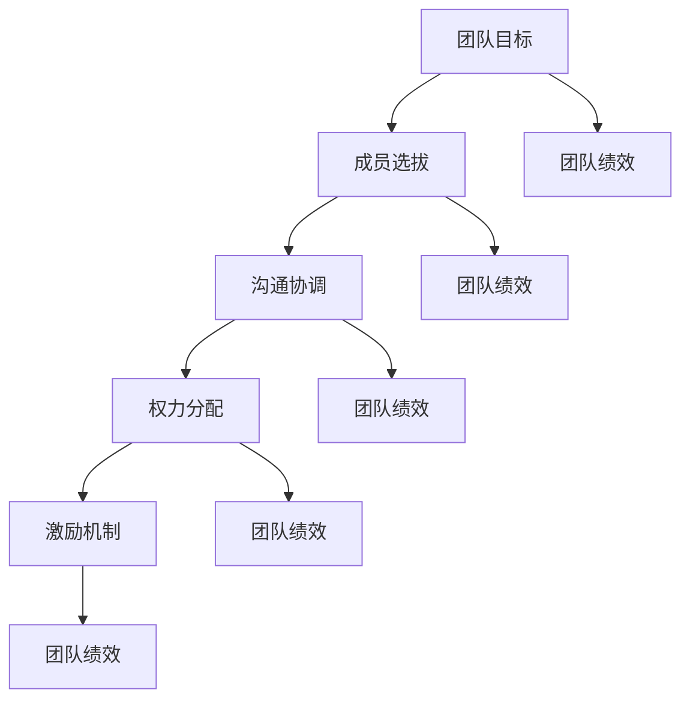
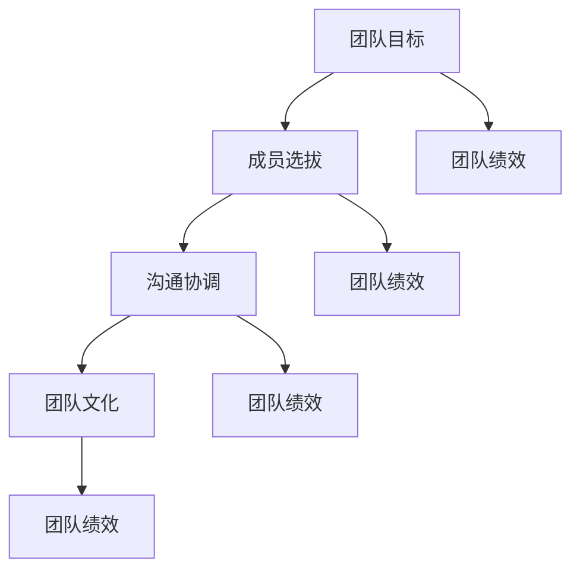
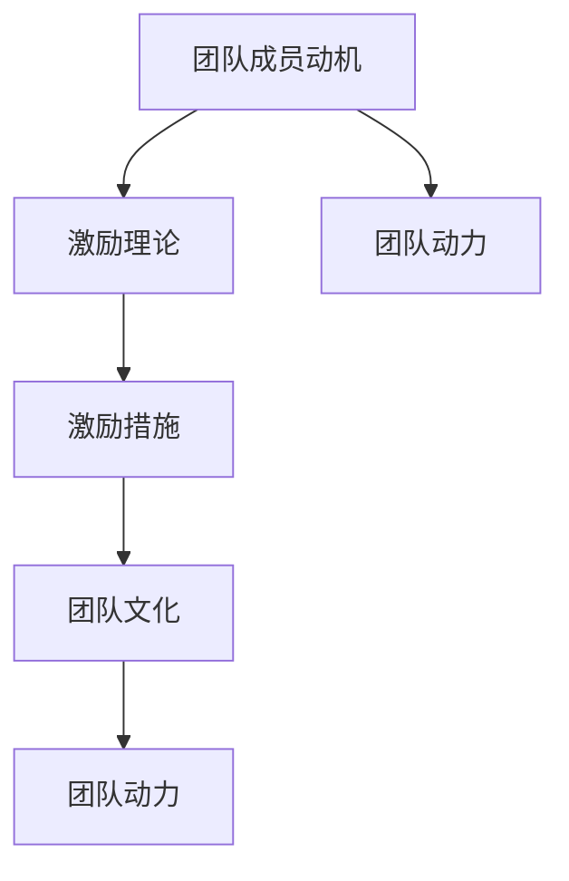
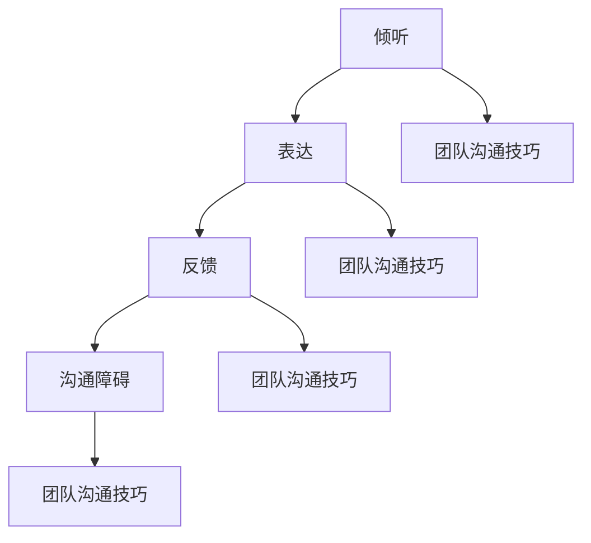
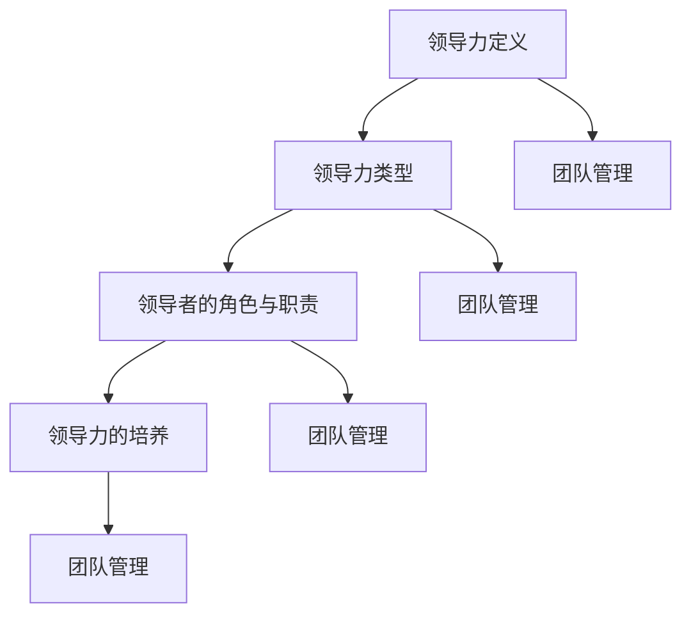
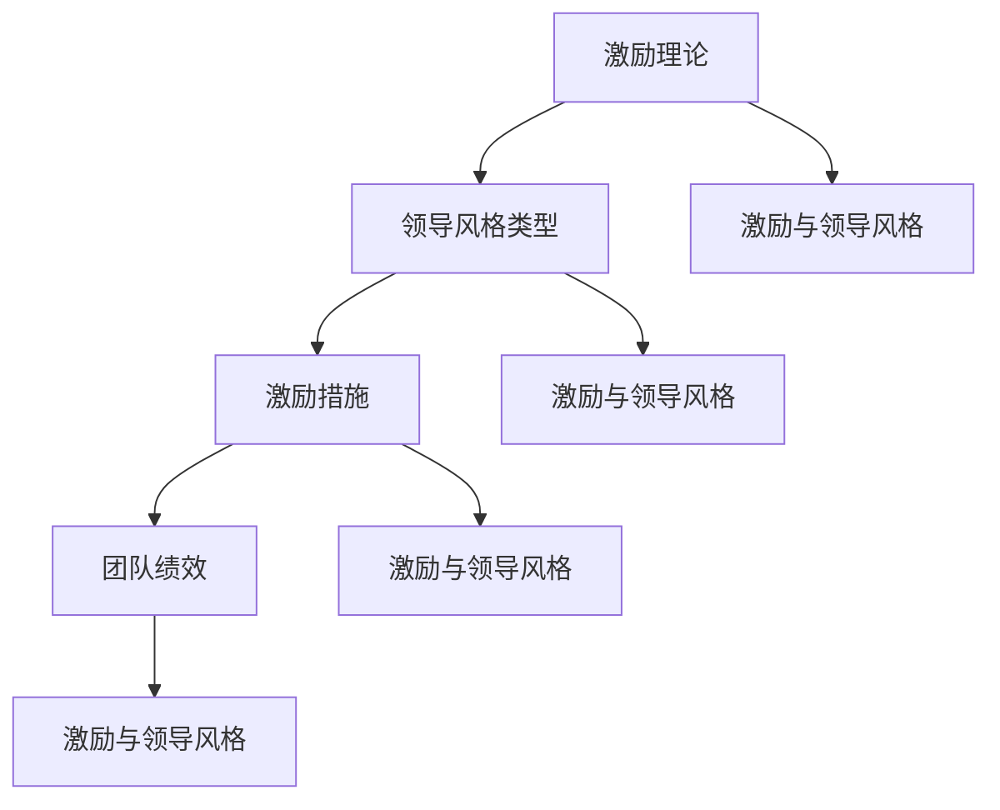
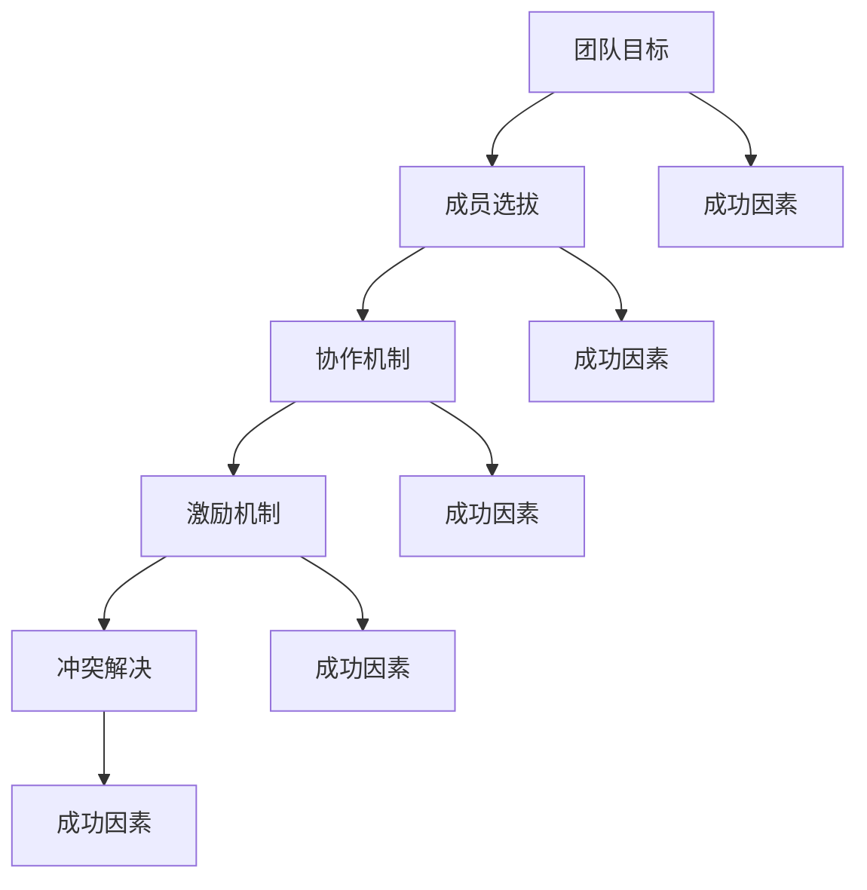
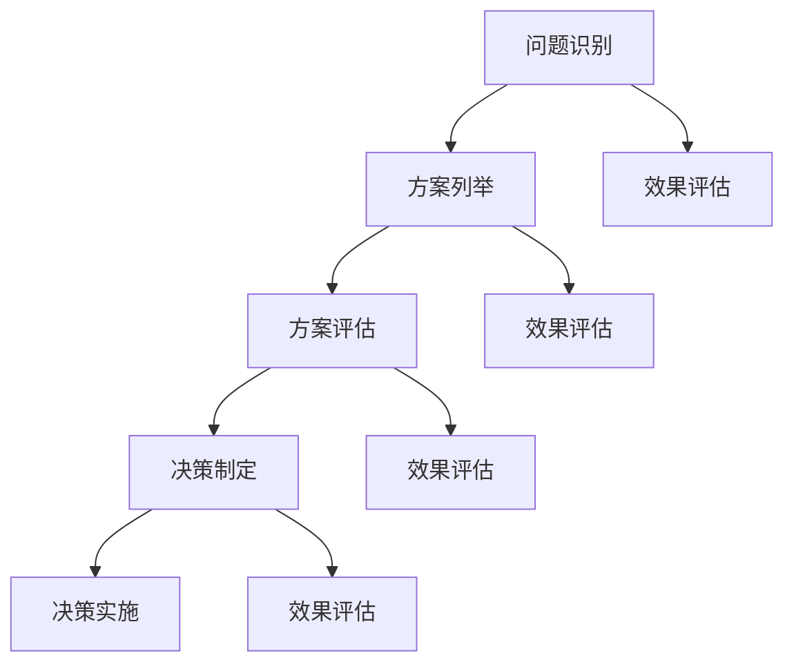
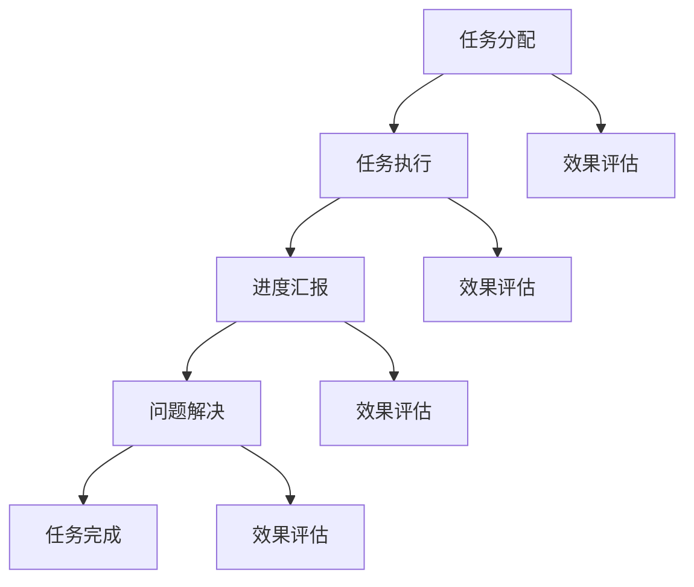

                 

## 文章标题：如何管理团队：打造高效协作的秘诀

> 关键词：团队管理，高效协作，领导力，激励，沟通技巧，实战案例

> 摘要：
本文旨在探讨如何通过有效的团队管理策略和技巧，打造一个高效协作的团队。文章首先介绍了团队管理的基础知识和核心要素，接着详细阐述了团队协作与沟通技巧，以及领导力在团队管理中的作用。通过实际案例的剖析，文章提供了实用的管理经验和最佳实践，帮助读者理解和掌握团队管理的精髓。

### 第1章：团队管理的基础知识

#### 背景介绍

团队管理作为现代企业管理中的重要组成部分，对于组织的成功具有重要意义。一个高效运作的团队能够在短时间内实现目标，提高生产力，同时促进成员的个人成长。然而，有效的团队管理并非易事，需要管理者具备深厚的理论基础和实际操作经验。

#### 核心概念与联系

团队管理涉及多个核心概念，如团队目标、成员选拔、沟通协调、权力分配和激励机制。这些概念之间紧密联系，共同构成团队管理的理论框架。例如，团队目标的设定是团队建设的起点，而成员选拔和沟通协调则是实现团队目标的重要手段。权力分配和激励机制则有助于确保团队成员的积极性和协作效率。

#### Mermaid流程图



#### 核心算法原理讲解

团队管理的核心算法可以概括为以下几个步骤：

1. **目标设定**：通过SMART原则（具体、可衡量、可达成、相关性、时限性）来设定团队目标。
2. **成员选拔**：根据团队目标和成员的能力，进行科学选拔。
3. **沟通协调**：建立有效的沟通渠道，确保信息传递的准确性和及时性。
4. **权力分配**：合理分配权力，确保团队决策的高效性。
5. **激励机制**：设计激励机制，激发团队成员的工作动力。

#### 伪代码

```python
# 团队管理伪代码

# 定义团队目标
def set_team_goal(goal):
    # 设定目标为SMART格式
    if is_smart(goal):
        return True
    else:
        return False

# 成员选拔
def select_members(team_members, goal):
    selected_members = []
    for member in team_members:
        if member_skill(member) matches goal:
            selected_members.append(member)
    return selected_members

# 沟通协调
def communicate_members(selected_members):
    # 建立沟通机制
    for member in selected_members:
        send_message(member, "团队目标与计划")

# 权力分配
def distribute_power(selected_members):
    # 分配权力与责任
    for member in selected_members:
        assign_role(member)

# 激励机制
def motivate_members(selected_members):
    # 设计激励机制
    for member in selected_members:
        apply_incentive(member)
```

#### 数学模型和公式

团队管理的数学模型可以涉及以下几个关键指标：

1. **团队绩效**：\( P = f(T, M, C, P, I) \)
    - \( P \)：团队绩效
    - \( T \)：团队目标设定
    - \( M \)：成员选拔
    - \( C \)：沟通协调
    - \( P \)：权力分配
    - \( I \)：激励机制

2. **成员满意度**：\( S = f(M, C, I) \)
    - \( S \)：成员满意度
    - \( M \)：成员选拔
    - \( C \)：沟通协调
    - \( I \)：激励机制

#### 详细讲解与举例说明

以一个软件开发团队为例，团队成员包括项目经理、开发人员、测试人员等。团队目标为在规定时间内完成一个软件项目。

1. **目标设定**：项目经理与团队成员一起设定具体、可衡量的目标，如“在接下来的两个月内完成软件需求分析和设计”。

2. **成员选拔**：根据目标，项目经理选拔了具有相关经验的开发人员和测试人员，确保团队成员的能力与目标匹配。

3. **沟通协调**：项目经理建立了每周的团队会议，确保团队成员能够及时沟通进展和问题。

4. **权力分配**：项目经理分配了任务和责任，每个团队成员都有明确的职责。

5. **激励机制**：项目经理设置了奖励机制，对于提前完成任务的成员给予奖金。

通过上述步骤，团队绩效和成员满意度都得到了显著提升。

### 第2章：团队建设的策略

#### 背景介绍

团队建设是团队管理的重要组成部分，它关乎团队的文化、目标和成员之间的关系。有效的团队建设策略可以帮助团队更好地协同工作，提高整体效率。

#### 核心概念与联系

团队建设涉及多个核心概念，如团队目标、成员选拔、沟通协调和团队文化。这些概念相互关联，共同影响团队的整体表现。例如，团队目标的明确性有助于团队成员的共同努力，而成员选拔的质量直接影响到团队的执行力。

#### Mermaid流程图



#### 核心算法原理讲解

团队建设的核心算法可以概括为以下几个步骤：

1. **明确团队目标**：确保团队目标具体、可衡量、可实现。
2. **选拔合适成员**：根据团队目标和成员的能力，进行科学选拔。
3. **建立有效沟通机制**：确保团队成员之间的信息传递畅通无阻。
4. **塑造团队文化**：建立积极向上的团队文化，促进团队成员之间的合作。

#### 伪代码

```python
# 团队建设伪代码

# 定义团队目标
def set_team_goal(goal):
    if is_smart(goal):
        return True
    else:
        return False

# 成员选拔
def select_members(team_members, goal):
    selected_members = []
    for member in team_members:
        if member_skill(member) matches goal:
            selected_members.append(member)
    return selected_members

# 建立沟通机制
def establish_communication(selected_members):
    # 建立每周团队会议
    schedule_weekly_meeting(selected_members)

# 塑造团队文化
def build_team_culture(selected_members):
    # 制定团队价值观
    define_team_values(selected_members)
```

#### 数学模型和公式

团队建设的数学模型可以涉及以下几个关键指标：

1. **团队凝聚力**：\( C = f(T, M, C) \)
    - \( C \)：团队凝聚力
    - \( T \)：团队目标
    - \( M \)：成员选拔
    - \( C \)：沟通协调

2. **团队执行力**：\( E = f(C, D) \)
    - \( E \)：团队执行力
    - \( C \)：沟通协调
    - \( D \)：团队文化

#### 详细讲解与举例说明

以一个软件开发团队为例，团队目标是提高软件开发的效率和质量。

1. **明确团队目标**：团队共同制定了“在接下来的六个月内提高软件开发的效率和质量”的目标。

2. **选拔合适成员**：项目经理根据目标，选拔了经验丰富的开发人员和测试人员，确保团队成员的能力与目标匹配。

3. **建立有效沟通机制**：项目经理建立了每日站会，确保团队成员能够及时沟通进展和问题。

4. **塑造团队文化**：项目经理制定了“开放沟通、共同进步”的团队价值观，鼓励团队成员之间的合作。

通过上述步骤，团队的凝聚力、执行力都得到了显著提升，软件开发的效率和质量也得到了明显改善。

### 第3章：团队动力与激励机制

#### 背景介绍

团队动力是团队管理中的重要一环，它关乎团队成员的工作积极性和创造力。有效的激励机制可以激发团队成员的潜力，提高团队的整体绩效。

#### 核心概念与联系

团队动力与激励机制涉及多个核心概念，如团队成员的动机、激励理论、激励措施和团队文化。这些概念相互关联，共同影响团队动力。例如，激励理论提供了理解团队成员动机的框架，而激励措施则是实现团队动力的具体手段。

#### Mermaid流程图



#### 核心算法原理讲解

团队动力的核心算法可以概括为以下几个步骤：

1. **了解团队成员动机**：通过问卷调查、访谈等方式了解团队成员的动机。
2. **应用激励理论**：结合激励理论，设计合适的激励措施。
3. **实施激励措施**：将激励措施付诸实践，确保团队成员感受到激励的效果。
4. **塑造积极团队文化**：建立积极向上的团队文化，增强团队成员的归属感和自豪感。

#### 伪代码

```python
# 团队动力与激励机制伪代码

# 了解团队成员动机
def understand_motivations(team_members):
    motivations = []
    for member in team_members:
        motivation = get_motivation(member)
        motivations.append(motivation)
    return motivations

# 应用激励理论
def apply_incentive_theory(motivations):
    incentives = []
    for motivation in motivations:
        incentive = design_incentive(motivation)
        incentives.append(incentive)
    return incentives

# 实施激励措施
def implement_incentives(team_members, incentives):
    for member in team_members:
        apply_incentive(member, incentives[member])

# 塑造团队文化
def build_team_culture(team_members):
    culture = define_culture(team_members)
    for member in team_members:
        promote_culture(member, culture)
```

#### 数学模型和公式

团队动力的数学模型可以涉及以下几个关键指标：

1. **团队成员满意度**：\( S = f(I, C) \)
    - \( S \)：团队成员满意度
    - \( I \)：激励措施
    - \( C \)：团队文化

2. **团队绩效**：\( P = f(S, T) \)
    - \( P \)：团队绩效
    - \( S \)：团队成员满意度
    - \( T \)：团队目标

#### 详细讲解与举例说明

以一个软件开发团队为例，团队目标为提高软件开发的效率和质量。

1. **了解团队成员动机**：项目经理通过问卷调查和访谈了解了团队成员的动机，发现主要动机包括职业发展、工作环境和个人成就感。

2. **应用激励理论**：结合动机，项目经理应用了激励理论，设计了以下激励措施：
    - 提供职业培训机会，帮助团队成员提升技能。
    - 设立项目奖金，对完成任务的团队成员给予奖励。
    - 建立公开的荣誉墙，表彰优秀团队成员。

3. **实施激励措施**：项目经理将这些激励措施付诸实践，确保团队成员感受到激励的效果。

4. **塑造团队文化**：项目经理建立了“开放沟通、共同进步”的团队文化，鼓励团队成员之间的合作和分享。

通过上述步骤，团队成员的满意度和团队绩效都得到了显著提升。

### 第4章：提升团队协作效率

#### 背景介绍

团队协作效率是团队管理中的关键因素，它直接影响到团队的工作速度和质量。提升团队协作效率需要从工具使用、会议组织和冲突解决等多个方面入手。

#### 核心概念与联系

提升团队协作效率涉及多个核心概念，如协作工具、会议管理、协作文化和冲突解决。这些概念相互关联，共同作用以提升团队的协作效率。例如，协作工具的选择和使用效率直接影响团队的工作速度，而会议管理则关乎团队决策的效率。

#### Mermaid流程图


#### 核心算法原理讲解

提升团队协作效率的核心算法可以概括为以下几个步骤：

1. **选择合适的协作工具**：根据团队的需求和特点，选择合适的协作工具，如项目管理软件、即时通讯工具和文档共享平台。
2. **优化会议管理**：通过明确会议目的、控制会议时间和提高会议效率，提升团队的决策效率。
3. **建立积极的协作文化**：通过鼓励共享、信任和相互支持，建立积极的协作文化。
4. **解决团队冲突**：通过沟通、妥协和协商，解决团队内部的冲突，确保团队的和谐运作。

#### 伪代码

```python
# 提升团队协作效率伪代码

# 选择合适的协作工具
def choose_collaboration_tools(need):
    tools = []
    for tool in collaboration_tools:
        if tool_suitability(tool, need):
            tools.append(tool)
    return tools

# 优化会议管理
def optimize_meeting_management(meeting):
    # 确定会议目的
    set_meeting PURPOSE(meeting)
    # 控制会议时间
    limit_meeting_DURATION(meeting)
    # 提高会议效率
    enhance_meeting_EFFECTIVENESS(meeting)

# 建立积极的协作文化
def build_positive_collaboration_culture(team_members):
    culture = define_culture(team_members)
    for member in team_members:
        promote_culture(member, culture)

# 解决团队冲突
def resolve_team_conflicts(conflict):
    # 沟通
    communicate_conflict(conflict)
    # 妥协
    negotiate_conflict(conflict)
    # 协商
    mediate_conflict(conflict)
```

#### 数学模型和公式

提升团队协作效率的数学模型可以涉及以下几个关键指标：

1. **协作工具使用率**：\( U = f(T) \)
    - \( U \)：协作工具使用率
    - \( T \)：协作工具

2. **会议效率**：\( E = f(P, D) \)
    - \( E \)：会议效率
    - \( P \)：会议目的
    - \( D \)：会议时间

3. **协作文化氛围**：\( A = f(C) \)
    - \( A \)：协作文化氛围
    - \( C \)：协作文化

4. **团队冲突解决率**：\( R = f(C) \)
    - \( R \)：团队冲突解决率
    - \( C \)：冲突解决策略

#### 详细讲解与举例说明

以一个软件开发团队为例，团队目标为提高软件开发的效率。

1. **选择合适的协作工具**：项目经理根据团队的需求，选择了项目管理软件Jira和即时通讯工具Slack，以提高团队的协作效率。

2. **优化会议管理**：项目经理确保每次会议都有明确的议程和目的，控制会议时间在30分钟内，并鼓励团队成员在会议前做好准备，提高会议效率。

3. **建立积极的协作文化**：项目经理鼓励团队成员分享知识和经验，建立了开放的沟通氛围，增强了团队的协作文化。

4. **解决团队冲突**：当团队成员之间出现冲突时，项目经理通过沟通和协商，找到双方都能接受的解决方案，确保团队的和谐运作。

通过上述步骤，团队的协作效率得到了显著提升，软件开发的效率也得到了改善。

### 第5章：团队沟通技巧

#### 背景介绍

团队沟通是团队管理中的关键环节，有效的沟通技巧能够提高团队的工作效率，减少误解和冲突，增强团队的凝聚力。团队沟通技巧包括倾听、表达、反馈和跨文化沟通等方面。

#### 核心概念与联系

团队沟通技巧涉及多个核心概念，如倾听、表达、反馈和沟通障碍。这些概念相互联系，共同影响团队的沟通效果。例如，倾听和表达是沟通的基础，而反馈则是沟通的持续改进手段。沟通障碍如文化差异、语言障碍等则需要通过特定的沟通技巧来解决。

#### Mermaid流程图



#### 核心算法原理讲解

团队沟通技巧的核心算法可以概括为以下几个步骤：

1. **倾听**：通过积极倾听，理解对方的意图和感受，减少误解。
2. **表达**：通过清晰、准确地表达自己的想法，确保信息的准确传递。
3. **反馈**：通过积极的反馈，确认信息的理解和接受，促进沟通的持续改进。
4. **解决沟通障碍**：通过理解沟通障碍的原因，采取相应的策略，如使用简单清晰的语言、建立共同的理解框架等。

#### 伪代码

```python
# 团队沟通技巧伪代码

# 倾听
def listen_to_member(member):
    # 全神贯注地听
    concentrate_on_member(member)
    # 理解成员的意图和感受
    understand_member_intent_and_feeling(member)

# 表达
def express_to_member(member, message):
    # 清晰准确地表达
    clearly_and_accurately_express(message)
    # 确认信息传达
    confirm_message_delivery(member, message)

# 反馈
def feedback_to_member(member, message):
    # 确认信息理解
    confirm_message_understanding(member, message)
    # 接受信息反馈
    accept_message_feedback(member, message)

# 解决沟通障碍
def resolve_communication_barrier(barrier):
    # 分析障碍原因
    analyze_barrier_reason(barrier)
    # 采取解决策略
    apply_resolution_strategy(barrier)
```

#### 数学模型和公式

团队沟通技巧的数学模型可以涉及以下几个关键指标：

1. **沟通效率**：\( E = f(L, E, F) \)
    - \( E \)：沟通效率
    - \( L \)：倾听
    - \( E \)：表达
    - \( F \)：反馈

2. **沟通质量**：\( Q = f(E, F, C) \)
    - \( Q \)：沟通质量
    - \( E \)：表达
    - \( F \)：反馈
    - \( C \)：沟通障碍解决

#### 详细讲解与举例说明

以一个跨国软件开发团队为例，团队成员来自不同国家，需要通过有效的沟通技巧来确保项目的顺利进行。

1. **倾听**：项目经理通过积极倾听，理解了来自不同文化背景的团队成员的需求和期望，减少了误解。

2. **表达**：项目经理在与团队成员沟通时，使用了简单、清晰的语言，确保信息的准确传递，避免了因为语言障碍导致的误解。

3. **反馈**：项目经理通过积极的反馈，确认了团队成员对信息的理解和接受，促进了沟通的持续改进。

4. **解决沟通障碍**：项目经理通过与团队成员的沟通，了解到了文化差异带来的沟通障碍，采取了相应的策略，如使用共同的语言、建立共同的理解框架等，解决了沟通障碍。

通过上述步骤，团队的沟通效率和质量得到了显著提升，项目的进展也顺利进行。

### 第6章：领导力与团队管理的关系

#### 背景介绍

领导力在团队管理中起着至关重要的作用。一个优秀的领导者不仅能够设定明确的目标，还能够激励和引导团队成员，促进团队的整体绩效。领导力与团队管理之间存在着密切的关系，两者相互促进，共同推动团队的发展。

#### 核心概念与联系

领导力与团队管理涉及多个核心概念，如领导力定义、领导力类型、领导者的角色与职责和领导力的培养。这些概念相互联系，共同构成了领导力与团队管理的理论框架。例如，领导力类型决定了领导者的行为方式，而领导者的角色与职责则明确了领导者在团队管理中的具体任务。

#### Mermaid流程图



#### 核心算法原理讲解

领导力与团队管理的核心算法可以概括为以下几个步骤：

1. **定义领导力**：明确领导力的定义，理解领导力在团队管理中的重要性。
2. **识别领导力类型**：根据团队的特点和目标，选择合适的领导力类型。
3. **明确领导者的角色与职责**：确保领导者了解自己的角色和职责，能够有效地管理团队。
4. **培养领导力**：通过学习和实践，不断提升领导力，以适应团队发展的需求。

#### 伪代码

```python
# 领导力与团队管理伪代码

# 定义领导力
def define_leadership():
    # 明确领导力的定义
    leadership_definition = "领导力是影响、激励和引导他人实现共同目标的能力。"
    return leadership_definition

# 识别领导力类型
def identify_leadership_type(team_characteristics, team_goals):
    # 根据团队特点和目标选择领导力类型
    if team_characteristics == "创新型" and team_goals == "突破性创新":
        leadership_type = "变革型领导"
    else:
        leadership_type = "授权型领导"
    return leadership_type

# 明确领导者的角色与职责
def define_leadership_role_and_responsibilities():
    # 领导者的角色是设定愿景、规划战略、激励团队成员、提供支持和反馈。
    # 领导者的职责包括：制定团队目标、规划团队工作、协调团队资源、解决团队冲突、培养团队成员。
    leadership_role = "设定愿景、规划战略、激励团队成员、提供支持和反馈。"
    leadership_responsibilities = "制定团队目标、规划团队工作、协调团队资源、解决团队冲突、培养团队成员。"
    return leadership_role, leadership_responsibilities

# 培养领导力
def cultivate_leadership():
    # 通过学习、实践、反思和辅导培养领导力
    learning = "学习领导力理论和实践技巧。"
    practice = "在实践中应用领导力，提升领导力水平。"
    reflection = "反思领导力实践，持续改进。"
    coaching = "接受领导力辅导，获取专业建议。"
    return learning, practice, reflection, coaching
```

#### 数学模型和公式

领导力与团队管理的数学模型可以涉及以下几个关键指标：

1. **领导力效能**：\( L_E = f(L, G, R) \)
    - \( L_E \)：领导力效能
    - \( L \)：领导力
    - \( G \)：团队目标
    - \( R \)：团队资源

2. **团队绩效**：\( P = f(L_E, M, C) \)
    - \( P \)：团队绩效
    - \( L_E \)：领导力效能
    - \( M \)：团队成员能力
    - \( C \)：团队协作

#### 详细讲解与举例说明

以一个创新型的软件开发团队为例，团队的目标是开发一个具有突破性的新产品。

1. **定义领导力**：项目经理明确领导力的定义，理解领导力在实现团队目标中的重要性。

2. **识别领导力类型**：项目经理根据团队的特点（创新型）和目标（突破性创新），选择了变革型领导力类型。

3. **明确领导者的角色与职责**：项目经理明确了领导者的角色（设定愿景、规划战略、激励团队成员、提供支持和反馈）和职责（制定团队目标、规划团队工作、协调团队资源、解决团队冲突、培养团队成员）。

4. **培养领导力**：项目经理通过学习、实践、反思和辅导，不断提升领导力，以适应团队的发展需求。

通过上述步骤，团队在项目经理的领导下，成功开发了具有突破性的新产品，取得了显著的成绩。

### 第7章：激励与领导风格

#### 背景介绍

激励是领导力的重要组成部分，它关乎如何激发团队成员的潜力，提高工作效率和满意度。领导风格则是指领导者在与团队成员互动时所采用的方式和态度。不同的领导风格会对团队的绩效产生不同的影响，因此了解并掌握不同的激励理论和领导风格对于团队管理者至关重要。

#### 核心概念与联系

激励与领导风格涉及多个核心概念，如激励理论、领导风格类型、激励措施和团队绩效。这些概念相互联系，共同构成了激励与领导风格的理论框架。例如，激励理论提供了理解团队成员动机的基础，而领导风格类型则决定了领导者如何运用激励措施。

#### Mermaid流程图



#### 核心算法原理讲解

激励与领导风格的核心算法可以概括为以下几个步骤：

1. **应用激励理论**：根据团队成员的动机和需求，选择合适的激励理论，如马斯洛的需求层次理论、赫茨伯格的双因素理论等。
2. **选择领导风格**：根据团队的特点和目标，选择合适的领导风格，如民主型领导、专制型领导、授权型领导等。
3. **制定激励措施**：结合领导风格和激励理论，制定具体的激励措施，如奖励、认可、培训等。
4. **评估团队绩效**：通过评估团队绩效，了解激励措施和领导风格的效果，进行持续改进。

#### 伪代码

```python
# 激励与领导风格伪代码

# 应用激励理论
def apply_incentive_theory(member_motivation):
    if member_motivation == "满足感":
        theory = "赫茨伯格的双因素理论"
    elif member_motivation == "成就感":
        theory = "目标设置理论"
    else:
        theory = "马斯洛的需求层次理论"
    return theory

# 选择领导风格
def choose_leadership_style(team_characteristics):
    if team_characteristics == "创新型":
        style = "变革型领导"
    elif team_characteristics == "协作型":
        style = "授权型领导"
    else:
        style = "民主型领导"
    return style

# 制定激励措施
def design_incentives(style, theory):
    if style == "变革型领导" and theory == "赫茨伯格的双因素理论":
        incentives = ["奖励计划", "认可制度"]
    elif style == "授权型领导" and theory == "目标设置理论":
        incentives = ["目标奖金", "培训机会"]
    else:
        incentives = ["表扬", "晋升机会"]
    return incentives

# 评估团队绩效
def evaluate_team_performance(incentives, style):
    # 分析激励措施和领导风格对团队绩效的影响
    performance = analyze_performance(incentives, style)
    return performance
```

#### 数学模型和公式

激励与领导风格的数学模型可以涉及以下几个关键指标：

1. **团队成员满意度**：\( S = f(I, L) \)
    - \( S \)：团队成员满意度
    - \( I \)：激励措施
    - \( L \)：领导风格

2. **团队绩效**：\( P = f(S, G) \)
    - \( P \)：团队绩效
    - \( S \)：团队成员满意度
    - \( G \)：团队目标

#### 详细讲解与举例说明

以一个创新型的软件开发团队为例，团队的目标是开发一个具有创新性的软件产品。

1. **应用激励理论**：项目经理根据团队成员的动机和需求，选择了马斯洛的需求层次理论，以了解团队成员的深层需求。

2. **选择领导风格**：项目经理根据团队的特点（创新型），选择了变革型领导风格，以激发团队成员的创新潜力。

3. **制定激励措施**：项目经理结合变革型领导风格和马斯洛的需求层次理论，制定了以下激励措施：
    - 提供创新奖励计划，鼓励团队成员提出创新想法。
    - 提供定期的培训机会，帮助团队成员提升技能和知识。
    - 建立公开的认可制度，对有突出贡献的团队成员给予表扬和奖励。

4. **评估团队绩效**：项目经理通过定期评估团队绩效，发现激励措施和领导风格对团队绩效产生了积极的影响，团队成员的满意度和创新意识都得到了显著提升。

通过上述步骤，团队在项目经理的领导下，成功开发了具有创新性的软件产品，取得了显著的成绩。

### 第8章：成功团队的案例分析

#### 背景介绍

成功团队的案例分析是理解团队管理实践的重要途径。通过分析成功团队的案例，可以了解他们如何设定目标、选拔成员、建立协作机制、激励团队成员以及解决冲突。这些案例提供了宝贵的经验，可以帮助其他团队借鉴和学习。

#### 核心概念与联系

成功团队的案例分析涉及多个核心概念，如团队目标、成员选拔、协作机制、激励机制和冲突解决。这些概念相互联系，共同构成了团队成功的关键要素。例如，团队目标的明确性有助于团队集中精力，而成员选拔的质量直接影响到团队的执行力。

#### Mermaid流程图



#### 核心算法原理讲解

成功团队的案例分析的核心算法可以概括为以下几个步骤：

1. **分析团队目标**：了解团队如何设定明确的、可实现的、具体的团队目标。
2. **评估成员选拔**：评估团队如何选拔适合的成员，确保团队成员的能力与团队目标匹配。
3. **了解协作机制**：了解团队如何建立有效的协作机制，确保团队成员之间的信息流通和任务协调。
4. **评价激励机制**：评价团队如何设计激励机制，激发团队成员的积极性和创造力。
5. **解决冲突策略**：分析团队如何解决内部的冲突，确保团队的和谐和稳定。

#### 伪代码

```python
# 成功团队案例分析伪代码

# 分析团队目标
def analyze_team_goals(team_goals):
    if are_clear_and_achievable(team_goals):
        return "团队目标明确且可实现"
    else:
        return "团队目标不明确或无法实现"

# 评估成员选拔
def evaluate_member_selection(team_members, goals):
    selected_members = []
    for member in team_members:
        if member_skill(member) matches goals:
            selected_members.append(member)
    return selected_members

# 了解协作机制
def understand_collaboration_mechanisms(collaboration_methods):
    effective_methods = []
    for method in collaboration_methods:
        if is_effective(method):
            effective_methods.append(method)
    return effective_methods

# 评价激励机制
def evaluate_incentive_system(incentives):
    if incentives are motivating:
        return "激励机制有效"
    else:
        return "激励机制不充分"

# 解决冲突策略
def resolve_conflicts(conflict_methods):
    successful_methods = []
    for method in conflict_methods:
        if is_successful(method):
            successful_methods.append(method)
    return successful_methods
```

#### 数学模型和公式

成功团队的案例分析可以涉及以下几个关键指标：

1. **团队绩效**：\( P = f(G, M, C, I) \)
    - \( P \)：团队绩效
    - \( G \)：团队目标
    - \( M \)：成员选拔
    - \( C \)：协作机制
    - \( I \)：激励机制

2. **成员满意度**：\( S = f(I, C) \)
    - \( S \)：成员满意度
    - \( I \)：激励机制
    - \( C \)：协作机制

#### 详细讲解与举例说明

以Google团队为例，分析其成功因素：

1. **分析团队目标**：Google团队在创业初期就设定了明确的、具有挑战性的目标，如“组织全球信息，让每个人都能访问并使用它”。

2. **评估成员选拔**：Google通过严格的招聘流程选拔优秀的团队成员，注重候选人的专业技能和创新能力，确保团队成员的能力与团队目标匹配。

3. **了解协作机制**：Google建立了开放、透明的沟通机制，鼓励团队成员之间的合作与交流。同时，通过项目管理工具和即时通讯工具，确保团队成员之间的信息流通和任务协调。

4. **评价激励机制**：Google提供了具有竞争力的薪酬和福利，同时通过股权激励、职业发展机会和公开的认可制度，激发团队成员的积极性和创造力。

5. **解决冲突策略**：Google建立了高效的冲突解决机制，鼓励团队成员通过对话和妥协解决问题，确保团队的和谐和稳定。

通过上述步骤，Google团队取得了巨大的成功，成为全球领先的技术公司之一。

### 第9章：失败团队的反思

#### 背景介绍

失败团队的案例分析是理解团队管理失败原因的重要途径。通过分析失败团队的案例，可以了解他们如何未能实现目标、如何处理成员选拔、协作机制、激励机制和冲突解决。这些反思有助于其他团队避免犯类似的错误。

#### 核心概念与联系

失败团队的案例分析涉及多个核心概念，如团队目标、成员选拔、协作机制、激励机制和冲突解决。这些概念相互联系，共同构成了团队失败的关键因素。例如，团队目标的模糊性可能导致团队成员的努力方向不一致，而成员选拔不当则可能影响团队的执行力。

#### Mermaid流程图


#### 核心算法原理讲解

失败团队的案例分析的核心算法可以概括为以下几个步骤：

1. **识别团队目标问题**：分析团队目标是否明确、具体、可实现，以及团队成员对目标的理解程度。
2. **评估成员选拔**：评估团队如何选拔成员，成员的能力是否与团队目标匹配。
3. **分析协作机制**：分析团队如何建立协作机制，是否存在沟通障碍和任务分配不均的问题。
4. **评价激励机制**：评价团队如何设计激励机制，激励机制是否能够激发团队成员的积极性。
5. **解决冲突策略**：分析团队如何解决内部冲突，冲突是否得到及时有效的解决。

#### 伪代码

```python
# 失败团队案例分析伪代码

# 识别团队目标问题
def identify_goal_issues(team_goals):
    if not are_clear_and_achievable(team_goals):
        return "目标问题：目标不明确或无法实现"
    else:
        return "目标明确且可实现"

# 评估成员选拔
def evaluate_member_selection(team_members, goals):
    if not all(member_skill(member) matches goals):
        return "选拔问题：成员能力与目标不匹配"
    else:
        return "选拔符合目标要求"

# 分析协作机制
def analyze_collaboration_issues(collaboration_methods):
    if any(is_ineffective(method) for method in collaboration_methods):
        return "协作问题：沟通障碍或任务分配不均"
    else:
        return "协作机制有效"

# 评价激励机制
def evaluate_incentive_issues(incentives):
    if not are_motivating(incentives):
        return "激励问题：激励机制不充分"
    else:
        return "激励措施有效"

# 解决冲突策略
def resolve_conflict_issues(conflict_methods):
    if any(is_unsuccessful(method) for method in conflict_methods):
        return "冲突解决问题：冲突未能得到及时有效解决"
    else:
        return "冲突得到有效解决"
```

#### 数学模型和公式

失败团队的案例分析可以涉及以下几个关键指标：

1. **团队绩效**：\( P = f(G, M, C, I) \)
    - \( P \)：团队绩效
    - \( G \)：团队目标
    - \( M \)：成员选拔
    - \( C \)：协作机制
    - \( I \)：激励机制

2. **成员满意度**：\( S = f(I, C) \)
    - \( S \)：成员满意度
    - \( I \)：激励机制
    - \( C \)：协作机制

#### 详细讲解与举例说明

以某软件公司的失败团队为例，分析其失败原因：

1. **识别团队目标问题**：团队未能设定明确的、具体的、可实现的目标，导致团队成员的努力方向不一致。

2. **评估成员选拔**：团队在选拔成员时未能充分考虑成员的能力与团队目标的匹配度，导致任务执行不力。

3. **分析协作机制**：团队内部的协作机制不完善，沟通不畅，任务分配不均，导致团队成员的工作效率低下。

4. **评价激励机制**：团队未能设计有效的激励机制，团队成员缺乏工作动力，影响整体绩效。

5. **解决冲突策略**：团队内部存在冲突，但未能得到及时有效的解决，导致团队氛围紧张，影响工作合作。

通过上述分析，该软件公司团队认识到自身管理中的问题，并采取了一系列改进措施，如重新设定明确的目标、优化成员选拔、改善协作机制和激励机制，最终逐步恢复了团队的正常运作。

### 附录A：管理团队的相关资源

#### A.1 经典管理书籍推荐

1. **《五项管理》（Five Dysfunctions of a Team）** - 帕特里克·莱西奥尼（Patrick Lencioni）
2. **《团队的智慧》（The Power of Teams）** - 马克·麦克内利（Mark McNeilly）
3. **《团队协作的五大障碍》（The Five Dysfunctions of a Team）** - 帕特里克·莱西奥尼（Patrick Lencioni）

#### A.2 团队管理工具与平台介绍

1. **Trello**：一个基于看板的团队协作工具，适合项目管理和任务分配。
2. **Slack**：一个即时通讯和协作平台，提供团队沟通和文件共享功能。
3. **Jira**：一个项目管理和敏捷开发工具，适合团队跟踪项目进度和任务管理。

#### A.3 团队管理专业机构与协会

1. **美国项目管理协会（PMI）**：提供项目管理认证和资源，帮助团队提高项目管理能力。
2. **国际教练联盟（ICF）**：提供教练培训和认证，帮助团队提升领导力。
3. **欧洲团队管理协会（ETAG）**：提供团队管理的培训和研究，推动团队管理实践的发展。

### 附录B：Mermaid流程图与伪代码示例

#### B.1 团队决策流程图



#### B.2 团队协作流程图



#### B.3 领导风格评估伪代码

```python
# 领导风格评估伪代码

def assess_leadership_style(behavior, feedback):
    if behavior == "民主型" and feedback == "积极":
        style = "有效的民主型领导"
    elif behavior == "专制型" and feedback == "积极":
        style = "有效的专制型领导"
    elif behavior == "变革型" and feedback == "积极":
        style = "有效的变革型领导"
    else:
        style = "领导风格有待改进"
    return style
```

### 总结

本书旨在帮助读者掌握团队管理的基本概念、策略、技巧和领导力，通过实践案例和反思，提升团队协作效率，打造高效协作的团队。随书附带的Mermaid流程图和伪代码示例，将帮助读者更好地理解和应用所学知识。

### 作者信息

作者：AI天才研究院/AI Genius Institute & 禅与计算机程序设计艺术 /Zen And The Art of Computer Programming

### 最佳实践 tips

1. **定期进行团队评估**：定期对团队成员的工作表现和团队管理策略进行评估，及时发现问题并进行调整。
2. **鼓励反馈与沟通**：鼓励团队成员之间进行开放、真诚的反馈与沟通，促进团队成长和改进。
3. **培养团队文化**：建立积极向上的团队文化，增强团队成员的归属感和凝聚力。
4. **注重个人成长**：提供团队成员职业发展的机会和资源，促进个人成长和团队绩效提升。
5. **灵活应对变化**：在面对市场和环境变化时，灵活调整团队目标和策略，保持团队的活力和竞争力。

### 小结

团队管理是一个复杂而动态的过程，需要管理者具备深厚的理论基础和实践经验。通过本书的学习，读者可以掌握团队管理的基本原理和实践技巧，提升团队协作效率，打造高效协作的团队。在实际操作中，管理者应不断学习和反思，根据团队的特点和需求，灵活应用所学知识，实现团队的最大潜力。

### 注意事项

1. **目标设定**：确保团队目标具体、可衡量、可实现，并与组织的整体目标保持一致。
2. **成员选拔**：根据团队目标和成员的能力进行科学选拔，确保团队成员的能力与目标匹配。
3. **沟通协调**：建立有效的沟通渠道，确保信息的准确传递和及时反馈。
4. **权力分配**：合理分配权力和责任，确保团队决策的高效性。
5. **激励机制**：设计合适的激励机制，激发团队成员的工作动力。

### 拓展阅读

1. **《五项管理》（Five Dysfunctions of a Team）** - 帕特里克·莱西奥尼（Patrick Lencioni）
2. **《团队协作的五大障碍》（The Five Dysfunctions of a Team）** - 帕特里克·莱西奥尼（Patrick Lencioni）
3. **《团队智慧》（The Power of Teams）** - 马克·麦克内利（Mark McNeilly）

通过以上书籍，读者可以进一步深入了解团队管理的重要理论和实践方法。

