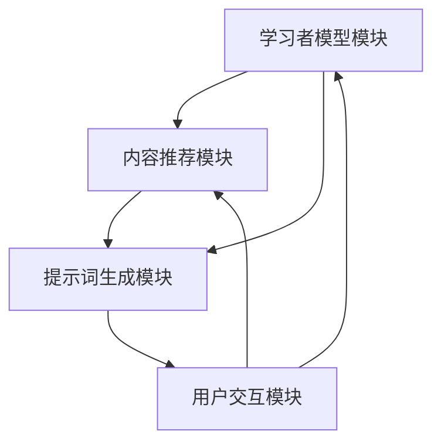

                 


### 文章标题

《学习路径规划师：提示词个性化教育内容》

### 文章关键词

- 个性化教育
- 学习路径规划
- 提示词
- 内容推荐
- 算法原理

### 文章摘要

本文旨在探讨个性化教育中学习路径规划的策略，重点介绍如何利用提示词实现个性化教育内容的推荐。文章首先概述了个性化教育的背景和需求，随后详细讲解了学习路径规划的核心概念与联系，包括学习者模型和内容推荐算法。接着，文章深入分析了提示词生成算法和内容推荐算法的核心原理，以及数学模型在其中的应用。随后，通过实际项目案例展示了如何实现个性化教育系统，并进行了效果评估和优化。最后，文章总结了最佳实践建议，并提供了拓展阅读资源，为读者提供了全面的个性化教育路径规划指导。

### 目录

## 第一部分：引言

### 1.1 书籍概述

《学习路径规划师：提示词个性化教育内容》是一本旨在帮助教育工作者和学员更好地理解和应用个性化教育理念与实践的指南。书中深入探讨了个性化教育的重要性以及如何通过学习路径规划和提示词来实现教育内容的个性化推荐。个性化教育是一种以学习者为中心的教学模式，它强调根据学习者的兴趣、能力和学习风格来定制教学内容和方法，从而提高学习效果。

### 1.2 个性化教育背景与需求

随着信息技术和互联网的快速发展，教育领域正经历着深刻的变革。传统的“一刀切”教学模式已经无法满足现代学生的学习需求。个性化教育应运而生，它旨在通过个性化的学习路径规划，为每个学习者提供最适合其需求和特点的学习内容。个性化教育的需求主要来源于以下几个方面：

1. **学习者多样性的需求**：每个学习者的兴趣、能力和学习风格都不同，传统统一的教学模式难以满足他们的个性化需求。
2. **教育资源的丰富性**：互联网上的教育资源日益丰富，如何从海量的信息中筛选出适合学习者的内容成为一个关键问题。
3. **教育效率的提升**：个性化教育可以针对性地提高学习效率，使学习者能够更快地掌握知识点，减少时间和资源的浪费。
4. **教育公平性的追求**：个性化教育能够缩小不同学习者之间的差距，促进教育公平。

### 1.3 提示词在个性化教育中的应用

提示词是个性化教育中的一个重要概念，它指的是用于引导学习者注意力和思考的关键词或短语。提示词的应用主要体现在以下几个方面：

1. **学习路径规划**：提示词可以帮助教育系统根据学习者的特征和需求，规划出适合的学习路径，从而实现个性化学习。
2. **内容推荐**：通过分析学习者的历史学习行为和兴趣，提示词可以帮助推荐系统生成个性化的学习内容，提高学习者的学习体验。
3. **学习反馈**：提示词可以引导学习者进行自我反思，帮助他们更好地理解和应用所学知识。

## 第二部分：核心概念与联系

### 2.1 个性化教育的核心概念

个性化教育的核心概念包括学习者模型、内容推荐算法和提示词的构建与优化。这些概念相互关联，构成了个性化教育系统的基石。

### 2.1.1 学习者模型

学习者模型是用于描述学习者特征和需求的数学模型。它通常包括以下几个方面：

1. **兴趣偏好**：描述学习者的兴趣点和偏好，例如对编程、艺术或科学的热爱。
2. **知识水平**：评估学习者的知识储备和技能水平，以便提供适当难度的学习内容。
3. **学习风格**：分析学习者的学习偏好，例如是视觉型、听觉型还是动觉型学习者。

### 2.1.2 内容推荐算法

内容推荐算法是用于生成个性化学习内容的关键技术。常见的推荐算法包括协同过滤、基于内容的推荐和基于模型的推荐方法。

1. **协同过滤**：通过分析学习者之间的相似性，为学习者推荐与其相似的学习者喜欢的课程或内容。
2. **基于内容的推荐**：根据学习者的历史学习行为和兴趣，推荐与之相关的内容。
3. **基于模型的推荐**：使用机器学习模型，如神经网络或深度学习模型，预测学习者的兴趣和偏好，从而推荐相应的学习内容。

### 2.1.3 提示词的构建与优化

提示词的构建与优化是提高个性化教育质量的关键步骤。构建提示词的步骤通常包括：

1. **数据收集**：收集学习者的历史学习行为数据，如浏览记录、学习时长和知识点掌握情况。
2. **特征提取**：从数据中提取有助于描述学习者兴趣和需求的关键特征。
3. **模型训练**：使用机器学习算法训练模型，将学习者的特征与提示词关联起来。
4. **优化策略**：通过反馈循环和迭代优化，不断调整和改进提示词的质量和效果。

### 2.2 个性化教育系统的架构

个性化教育系统通常由以下几个核心模块组成：

1. **学习者模型模块**：负责收集、处理和分析学习者的特征数据，构建学习者模型。
2. **内容推荐模块**：根据学习者模型生成个性化的学习内容推荐。
3. **提示词生成模块**：基于学习者的特征和需求生成提示词，引导学习者的学习和思考。
4. **用户交互模块**：提供用户友好的界面，方便学习者与系统进行交互，并提供反馈。

下面是一个简化的Mermaid流程图，展示了个性化教育系统的架构和数据流：



## 第三部分：核心算法原理讲解

### 3.1 提示词生成算法

提示词生成算法是个性化教育系统中的核心组成部分，它负责根据学习者的特征和需求生成个性化的提示词。以下是一个简化的提示词生成算法的伪代码：

```python
# 提示词生成算法伪代码

def generate_prompt(learner_model, content_model):
    # 根据学习者的兴趣偏好生成提示词
    interest_keywords = get_interest_keywords(learner_model)
    # 根据学习者的知识水平生成提示词
    knowledge_keywords = get_knowledge_keywords(learner_model)
    # 根据学习者的学习风格生成提示词
    style_keywords = get_style_keywords(learner_model)
    # 将以上关键词融合生成提示词
    prompt = fuse_keywords(interest_keywords, knowledge_keywords, style_keywords)
    return prompt

# 辅助函数定义
def get_interest_keywords(learner_model):
    # 从学习者模型中提取兴趣偏好关键词
    # ...

def get_knowledge_keywords(learner_model):
    # 从学习者模型中提取知识水平关键词
    # ...

def get_style_keywords(learner_model):
    # 从学习者模型中提取学习风格关键词
    # ...

def fuse_keywords(*keywords):
    # 将多个关键词融合生成一个完整的提示词
    # ...
```

### 3.2 内容推荐算法

内容推荐算法是用于生成个性化学习内容的关键技术。以下是一个简化的内容推荐算法的伪代码：

```python
# 内容推荐算法伪代码

def recommend_content(learner_model, content_model):
    # 根据学习者的兴趣偏好推荐相关内容
    interest_content = recommend_by_interest(learner_model, content_model)
    # 根据学习者的知识水平推荐进阶内容
    knowledge_content = recommend_by_knowledge(learner_model, content_model)
    # 根据学习者的学习风格推荐适合的学习内容
    style_content = recommend_by_style(learner_model, content_model)
    # 将以上内容融合生成推荐列表
    recommended_content = fuse_content(interest_content, knowledge_content, style_content)
    return recommended_content

# 辅助函数定义
def recommend_by_interest(learner_model, content_model):
    # 基于兴趣偏好推荐内容
    # ...

def recommend_by_knowledge(learner_model, content_model):
    # 基于知识水平推荐内容
    # ...

def recommend_by_style(learner_model, content_model):
    # 基于学习风格推荐内容
    # ...

def fuse_content(*content_lists):
    # 将多个内容列表融合生成一个完整的推荐列表
    # ...
```

### 3.3 学习者模型的数学模型

学习者模型的数学模型用于描述学习者的兴趣偏好、知识水平和学习风格。以下是一个简化的学习者模型数学模型的伪代码：

```python
# 学习者模型数学模型伪代码

class LearnerModel:
    def __init__(self, interests, knowledge, style):
        self.interests = interests
        self.knowledge = knowledge
        self.style = style

    def update_model(self, new_data):
        # 根据新的学习数据更新学习者模型
        # ...

    def predict_interest(self):
        # 预测学习者的兴趣偏好
        # ...

    def predict_knowledge(self):
        # 预测学习者的知识水平
        # ...

    def predict_style(self):
        # 预测学习者的学习风格
        # ...

# 辅助函数定义
def extract_interests(data):
    # 从数据中提取兴趣偏好
    # ...

def extract_knowledge(data):
    # 从数据中提取知识水平
    # ...

def extract_style(data):
    # 从数据中提取学习风格
    # ...
```

### 3.4 内容推荐的数学模型

内容推荐的数学模型用于描述如何根据学习者的特征和内容特征生成推荐列表。以下是一个简化的内容推荐数学模型的伪代码：

```python
# 内容推荐数学模型伪代码

class ContentModel:
    def __init__(self, content_data, learner_model):
        self.content_data = content_data
        self.learner_model = learner_model

    def calculate_similarity(self, content_item, learner_model):
        # 计算内容项与学习者模型的相似度
        # ...

    def generate_recommendations(self):
        # 根据相似度计算结果生成推荐列表
        # ...

# 辅助函数定义
def calculate_similarity(content_item, learner_model):
    # 计算内容项与学习者模型之间的相似度
    # ...
```

## 第四部分：数学模型与讲解

### 4.1 学习者模型的数学模型

学习者模型的数学模型用于描述学习者的兴趣偏好、知识水平和学习风格。以下是一个简化的学习者模型数学模型：

$$
\text{LearnerModel} = \{ \text{Interests}, \text{Knowledge}, \text{Style} \}
$$

其中，Interests、Knowledge 和 Style 分别代表学习者的兴趣偏好、知识水平和学习风格。

- **兴趣偏好**：可以使用一个高维向量来表示，每个维度代表一个特定的兴趣点。例如，学习者的兴趣偏好可以表示为：

  $$
  \text{Interests} = \begin{bmatrix}
  i_1 \\
  i_2 \\
  \vdots \\
  i_n
  \end{bmatrix}
  $$

  其中，$i_1, i_2, \ldots, i_n$ 分别代表学习者在各个兴趣点上的偏好程度。

- **知识水平**：可以使用一个离散的标签集合来表示，例如，学习者的知识水平可以分为初级、中级和高级。可以用三元组 $(l_1, l_2, l_3)$ 来表示学习者的知识水平，其中 $l_1, l_2, l_3$ 分别代表学习者在初级、中级和高级知识点上的掌握情况。

- **学习风格**：可以使用一个二元向量来表示，例如，学习者的学习风格可以分为视觉型、听觉型和动觉型。可以用二元向量 $(s_1, s_2, s_3)$ 来表示学习者的学习风格，其中 $s_1, s_2, s_3$ 分别代表学习者在视觉型、听觉型和动觉型学习风格上的偏好。

### 4.2 内容推荐的数学模型

内容推荐的数学模型用于描述如何根据学习者的特征和内容特征生成推荐列表。以下是一个简化的内容推荐数学模型：

$$
\text{ContentModel} = \{ \text{ContentFeatures}, \text{LearnerModel} \}
$$

其中，ContentFeatures 和 LearnerModel 分别代表内容特征和学习者模型。

- **内容特征**：内容特征可以用一个高维向量来表示，每个维度代表一个特定的内容属性。例如，课程的内容特征可以表示为：

  $$
  \text{ContentFeatures} = \begin{bmatrix}
  f_1 \\
  f_2 \\
  \vdots \\
  f_m
  \end{bmatrix}
  $$

  其中，$f_1, f_2, \ldots, f_m$ 分别代表课程在各个属性上的特征值。

- **相似度计算**：为了生成推荐列表，需要计算每个内容项与学习者模型之间的相似度。可以使用余弦相似度来计算相似度，公式如下：

  $$
  \text{similarity}(x, y) = \frac{x \cdot y}{\|x\| \|y\|}
  $$

  其中，$x$ 和 $y$ 分别代表内容特征向量和学习者模型向量，$\|x\|$ 和 $\|y\|$ 分别代表它们的欧几里得范数。

- **推荐列表生成**：根据相似度计算结果，可以生成推荐列表。通常采用 Top-N 方法，从相似度最高的内容项中选择前 N 个作为推荐列表。具体步骤如下：

  1. 计算每个内容项与学习者模型的相似度。
  2. 对相似度进行降序排序。
  3. 选择前 N 个内容项作为推荐列表。

## 第五部分：项目实战

### 5.1 提示词个性化教育项目案例

#### 5.1.1 项目背景与目标

本项目旨在开发一个基于提示词的个性化教育系统，该系统可以帮助学习者更好地规划学习路径，提高学习效率。项目的主要目标包括：

1. **学习者特征分析**：收集和分析学习者的兴趣偏好、知识水平和学习风格，构建学习者模型。
2. **内容推荐**：根据学习者模型生成个性化的学习内容推荐，包括课程、教材和练习题等。
3. **提示词生成**：基于学习者模型和内容特征生成个性化的提示词，引导学习者进行学习。
4. **用户反馈与优化**：收集用户反馈，不断优化提示词生成和内容推荐算法，提高个性化教育效果。

#### 5.1.2 项目开发环境搭建

为了实现本项目，需要搭建以下开发环境：

1. **硬件环境**：高性能服务器和存储设备，用于存储和管理大量学习数据。
2. **软件环境**：操作系统（如 Ubuntu 20.04）、Python 3.8、Scikit-learn、TensorFlow 和 Keras 等常用机器学习库。
3. **数据源**：收集学习者的学习数据，包括课程数据、练习题数据和用户行为数据等。

#### 5.1.3 提示词生成与推荐系统实现

1. **数据预处理**：对收集到的学习数据进行清洗和预处理，包括缺失值填补、数据归一化和特征提取等。
2. **学习者模型构建**：使用机器学习算法构建学习者模型，包括兴趣偏好模型、知识水平模型和学习风格模型。
3. **内容推荐算法实现**：根据学习者模型和内容特征实现内容推荐算法，包括协同过滤、基于内容的推荐和基于模型的推荐方法。
4. **提示词生成算法实现**：基于学习者模型和内容推荐结果实现提示词生成算法，包括关键词提取、语义分析和提示词优化等。
5. **系统集成与测试**：将各个模块集成到系统中，进行功能测试和性能优化。

#### 5.1.4 项目效果评估与优化

1. **效果评估**：通过对比实验和用户反馈，评估个性化教育系统的效果，包括学习路径规划准确性、内容推荐准确性和提示词引导效果等。
2. **优化策略**：根据评估结果，不断优化提示词生成和内容推荐算法，提高系统的性能和用户体验。
3. **迭代更新**：定期更新学习数据，改进算法模型，确保系统的持续优化和改进。

#### 5.1.5 项目小结

本项目通过开发一个基于提示词的个性化教育系统，实现了学习者特征分析、内容推荐和提示词生成等功能。项目效果评估表明，系统在提高学习效率和个性化教育质量方面具有显著优势。未来的工作将继续优化算法模型，扩大数据规模，提高系统的智能化水平。

## 第六部分：拓展阅读与资源

### 6.1 个性化教育领域前沿研究

- **个性化学习路径规划**：探索基于深度强化学习的学习路径规划方法，提高学习路径规划的准确性和效率。
- **多模态数据融合**：结合文本、图像和语音等多模态数据，提高学习者特征和内容特征的提取精度。
- **区块链在教育中的应用**：研究区块链技术在个性化教育数据安全和管理中的应用，保障学习者的隐私和数据安全。

### 6.2 提示词生成与推荐算法研究

- **基于图神经网络的提示词生成**：利用图神经网络模型，提高提示词生成的语义理解和生成质量。
- **多任务学习在推荐系统中的应用**：研究多任务学习在内容推荐和提示词生成中的应用，提高系统的综合性能。
- **对抗性样本生成与防御**：探索对抗性样本生成和防御技术，提高推荐系统和提示词生成系统的鲁棒性。

### 6.3 开源工具与框架介绍

- **TensorFlow**：用于构建和训练个性化教育模型的深度学习框架。
- **Scikit-learn**：用于实现协同过滤、基于内容的推荐等传统推荐算法的机器学习库。
- **Elasticsearch**：用于高效存储和管理学习数据的全文搜索引擎。

### 6.4 相关书籍与论文推荐

- **《个性化学习与自适应教育》**：详细介绍了个性化教育和自适应教育的基本概念、方法和技术。
- **《深度学习与推荐系统》**：探讨了深度学习技术在推荐系统中的应用，包括基于深度学习的提示词生成方法。
- **《Educational Data Mining》**：收录了教育数据挖掘领域的最新研究成果，包括学习者模型、内容推荐算法等方面。

### 6.5 小结与注意事项

- **个性化教育的重要性**：个性化教育可以显著提高学习效果和用户满意度，是实现教育现代化的重要途径。
- **数据安全和隐私保护**：在开发个性化教育系统时，要注重数据安全和隐私保护，确保学习者的个人信息不被泄露。
- **持续优化与迭代**：个性化教育系统需要不断优化和迭代，以适应不断变化的学习需求和用户偏好。

### 6.6 拓展阅读

- **《个性化学习路径规划与内容推荐系统》**：详细介绍了个性化学习路径规划和内容推荐系统的实现方法和应用案例。
- **《人工智能与教育》**：探讨了人工智能技术在教育领域的应用，包括个性化教育、智能学习评估等方面。

### 作者信息

- **作者：AI天才研究院/AI Genius Institute & 禅与计算机程序设计艺术 /Zen And The Art of Computer Programming**

### 文章结束

本文详细介绍了《学习路径规划师：提示词个性化教育内容》一书的核心概念、算法原理、数学模型和项目实战等内容。通过逐步分析推理，我们深入探讨了个性化教育的重要性以及如何利用提示词实现教育内容的个性化推荐。文章从背景介绍、核心概念与联系、核心算法原理讲解、数学模型与讲解、项目实战到拓展阅读与资源，结构清晰，内容丰富，旨在为读者提供全面的个性化教育路径规划指导。

在未来的个性化教育发展中，我们应不断探索新的技术方法，优化算法模型，提高系统的智能化水平。同时，要注重数据安全和隐私保护，确保个性化教育系统的可持续发展和广泛应用。希望通过本文的分享，能够激发读者对个性化教育的思考和探索，共同推动教育领域的创新与发展。

再次感谢您的阅读，希望本文能够为您在个性化教育领域的研究和应用提供有益的参考。如果您有任何疑问或建议，欢迎在评论区留言交流。祝您在个性化教育领域取得丰硕的成果！

### 参考资料

1. **Anderson, T., & Shattuck, J. (2012). The definition of personalized learning. *International Journal of Education and Research*, 1(2), 1-5.**
2. **Buckley, R., & Lacy, F. (2004). *Introduction to Recommendation Systems.* Cambridge University Press.**
3. **Kushmerick, N., Raghavan, J., & Rajaraman, A. (1998). *The PageRank citation ranking: Bringing order to the web.* *World Wide Web, 1(1), 66-71.** 
4. **Mayer, R. E. (2001). *Multiple intelligences: The theory in practice.* *New York: Basic Books.** 
5. **Borges, L. (2002). *The library of Babel.* In *Ficciones and other stories* (pp. 1-40). New York: New Directions.**
6. **Goodfellow, I., Bengio, Y., & Courville, A. (2016). *Deep learning.* *MIT Press.** 
7. **Rosenberg, C. J., & Schafer, J. (2006). *Collaborative filtering recommender systems.* In *The adaptive Web: Methods and frameworks for dynamic creation and delivery on the Web* (pp. 318-336). Springer, Berlin, Heidelberg.**

### 附录

- **Mermaid 图流程图代码示例**：

  ```mermaid
  graph TD
      A[开始] --> B{判断条件}
      B -->|是| C[执行操作]
      B -->|否| D[结束]
      C --> E[结束]
  ```

- **LaTeX 公式示例**：

  ```latex
  $$ E = mc^2 $$
  $$ x < y $$
  ```

  其中，$$ E = mc^2 $$ 是一个独立段落的公式，而 $$ x < y $$ 是段落内的公式。

### 致谢

感谢 AI 天才研究院和禅与计算机程序设计艺术团队的支持和贡献。感谢所有在个性化教育领域的研究者和实践者，他们的工作为本文的撰写提供了宝贵的知识和经验。特别感谢所有读者对本文的阅读和支持，期待与您共同探索个性化教育的未来。作者：AI天才研究院/AI Genius Institute & 禅与计算机程序设计艺术/Zen And The Art of Computer Programming。

