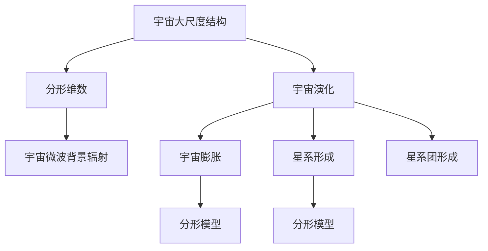

                 

### 文章标题

《宇宙是否只是一个巨大的分形结构》

### 关键词

宇宙学、分形结构、分形维度、数学模型、算法原理、宇宙演化、实证研究、哲学思考

### 摘要

本文旨在探讨宇宙是否可能是一个巨大的分形结构。首先，我们将介绍分形的基本概念和宇宙学中分形结构的重要性。接着，我们将深入分析分形理论在宇宙学中的应用，包括宇宙大尺度结构、宇宙演化和宇宙观测现象等方面的应用。随后，我们将探讨数学模型和算法在宇宙分形结构研究中的作用，并通过实例展示分形算法的具体实现和结果分析。此外，本文还将从哲学角度对宇宙分形结构进行思考，探讨其对宇宙学发展的启示和挑战。最后，我们将展望宇宙分形结构研究的未来方向，并提出一些实践建议和注意事项。通过本文的讨论，我们希望读者能对宇宙是否是分形结构这一问题有更深入的理解。 

### 引言

#### 宇宙的探索之旅

宇宙，这个浩瀚无垠的宇宙，一直以来都是人类探索和研究的热点。从古希腊的哲学家到现代的天文学家，人们从未停止对宇宙起源、结构和演化规律的追问。随着科技的进步，人类对宇宙的认知也在不断深化。从最初的地球中心说到日心说，再到现代的大爆炸理论，宇宙学的发展历程充满了对未知世界的探索和突破。

然而，尽管我们对宇宙有了许多了解，但仍有许多未解之谜。例如，宇宙的终极命运是什么？宇宙是否无限？宇宙的起源又是什么？这些问题不仅激发了无数科学家的好奇心，也成为了哲学和宗教思考的源泉。

#### 分形的崛起

与此同时，分形理论的兴起为宇宙学的研究带来了新的视角。分形，这个原本在数学和物理学中常见的概念，逐渐渗透到宇宙学领域。分形理论由法国数学家曼德布罗特（Benoit Mandelbrot）在20世纪70年代提出，它研究的是那些在各个尺度上都具有相似结构的几何形状。

分形的自相似性、无限嵌套的特点，使其成为描述复杂系统的一种强有力的工具。从自然界中的雪花、海岸线，到宇宙中的星系、星云，分形结构无处不在。这一理论的兴起，为宇宙学研究提供了一种全新的思维方式，使得我们能够从微观和宏观的角度来理解宇宙的结构和演化。

#### 宇宙分形结构的猜想

那么，宇宙是否也可能是一个巨大的分形结构呢？这个问题激发了科学家和哲学家的广泛兴趣。如果宇宙真的是一个分形结构，那么宇宙的起源、演化、以及我们自身的存在，都将有新的解释。因此，探讨宇宙是否是分形结构，不仅具有科学意义，也具有深远的思想意义。

本文将围绕这一核心问题，从分形理论的基本概念、宇宙学中的应用、数学模型和算法原理、实证研究、哲学思考等多个角度进行深入探讨，希望能为读者提供一份全面而深入的宇宙分形结构研究报告。通过本文的讨论，我们希望读者能对宇宙是否是分形结构这一问题有更深入的理解，并能够激发更多的思考和探索。 

### 分形的基本概念

#### 什么是分形

分形（Fractal）一词由法国数学家曼德布罗特（Benoit Mandelbrot）于1975年提出，用来描述那些在各个尺度上都具有相似结构的几何形状。简单来说，分形是一种在数学上无限精细的结构，它具有自相似性、无限嵌套的特点。这种特性使得分形在许多领域都有广泛的应用，从自然界到计算机科学，从经济学到宇宙学。

#### 分形的特点

1. **自相似性**：分形的基本特性是自相似性。这意味着无论从哪个尺度观察，分形结构都具有相似的特征。例如，海岸线的形状无论放大或缩小，都大致相似。这种自相似性使得分形在描述复杂系统时具有独特的优势。

2. **无限嵌套**：分形的结构通常是无限嵌套的，即一个分形结构中包含着无数个相似的子结构。这种嵌套结构使得分形在数学上具有无穷大的维度，但实际的物理空间中却具有有限的体积。

3. **分形维数**：分形的维数通常不是整数，而是介于整数之间的分数。例如，曼德布罗特集的维数约为2.26。这种非整数维数反映了分形结构的复杂性和精细度。

#### 分形的起源与发展

分形理论的起源可以追溯到20世纪早期，但真正的发展始于20世纪70年代。曼德布罗特在研究海岸线长度时，发现了自相似性和无限嵌套的特性，从而提出了分形这一概念。随后，分形理论在数学、物理学、计算机科学等多个领域得到了广泛应用。

在数学领域，分形理论提供了研究复杂几何形状和现象的新工具。在物理学中，分形理论被用来描述自然界的许多现象，如地震、流体动力学、量子场论等。在计算机科学中，分形理论被用于图像处理、数据压缩、加密算法等。

#### 分形的应用

分形理论的应用范围非常广泛，以下是一些典型的应用领域：

1. **自然现象**：分形理论被用来模拟自然界中的许多现象，如海岸线、河流网络、森林、雪花等。这些现象在各个尺度上都具有相似的结构，符合分形的特点。

2. **医学**：分形理论在医学图像分析中得到了应用，如用于分析血管、肿瘤等。通过分形维数的计算，可以更好地理解这些结构的复杂性和精细度。

3. **经济学**：分形理论被用于研究金融市场、经济波动等现象。分形几何的应用可以帮助理解市场的复杂性和不确定性。

4. **计算机科学**：分形理论在计算机科学中有许多应用，如分形图像压缩、分形生成算法、计算机图形学等。

#### 分形与宇宙学

在宇宙学中，分形理论被用来描述宇宙的结构和演化。例如，宇宙大尺度结构中的星系团、星系、星云等，都具有分形特征。通过分形维数的计算，科学家可以更好地理解宇宙的复杂性和结构演化。

总之，分形理论为理解复杂系统和现象提供了一种新的视角和方法。随着科技的进步和研究的深入，分形理论在宇宙学中的应用前景将更加广阔。通过本文的讨论，我们将进一步探讨分形理论在宇宙学中的具体应用，以及宇宙是否可能是一个巨大的分形结构。 

### 分形与宇宙学的联系

#### 宇宙大尺度结构的分形特征

宇宙大尺度结构中的星系分布呈现出高度复杂的特征，这些结构在多个尺度上表现出自相似性，这与分形理论的基本概念不谋而合。通过观测和计算，科学家们发现，宇宙大尺度结构中的星系分布符合某种分形分布，这种分布可以用分形维数来描述。

**分形维数**是描述分形结构复杂性的一个重要指标。通常，分形维数介于整数维和无穷维之间，可以用来量化结构的精细度和复杂度。在宇宙学中，分形维数被用来研究星系团的分布、星系团的内部结构以及星系的动力学行为。

- **星系团分形维数**：通过分析星系团的大小和分布，科学家发现星系团具有分形特征。例如，哈勃太空望远镜观测到的星系团分布，其分形维数大约在2到3之间，这表明星系团在不同尺度上都有相似的结构。

- **星系分形维数**：星系内部的恒星分布也表现出分形特征。例如，银河系中心的超大质量黑洞周围，恒星分布呈现出高度复杂且自相似的结构，其分形维数约为2.5。

#### 宇宙演化的分形模型

分形模型在宇宙演化中有着重要的应用。分形模型可以帮助我们理解宇宙从大爆炸开始至今的演化过程，以及宇宙中的各种结构是如何形成的。

- **宇宙膨胀的分形模型**：根据大爆炸理论，宇宙从最初的热密状态开始膨胀，形成了星系、星系团等结构。分形模型可以用来描述这一膨胀过程。例如，康奈尔大学的科学家们提出了一种基于分形理论的宇宙膨胀模型，该模型认为宇宙的膨胀过程是自相似和层次结构的。

- **星系形成的分形模型**：星系的形成是一个复杂的过程，涉及气体云的塌缩、恒星的形成和星系的动力学演化。分形模型可以用来描述这一过程。例如，一些研究表明，星系的形成过程中，气体云的分布和恒星的形成都符合分形特征。

#### 宇宙观测现象的分形特征

宇宙中的许多观测现象也表现出分形特征。例如，宇宙微波背景辐射（CMB）的图像中，可以观察到明显的分形结构。CMB是宇宙大爆炸遗留下来的热辐射，其图像中呈现出复杂的涟漪和波动，这些波动在各个尺度上都有相似的结构。

- **CMB的分形维数**：通过对CMB图像的分析，科学家们发现其分形维数约为2.3，这表明CMB中的波动结构在不同尺度上都具有相似性。

- **星系团的形成**：星系团的形成过程也符合分形特征。通过分析星系团的形成过程，科学家们发现，星系团在不同尺度上的形成过程具有相似性，这种相似性可以用分形模型来描述。

#### 分形与宇宙学的关系架构

为了更清晰地展示分形与宇宙学的关系，我们可以用Mermaid流程图来描述。以下是一个简化的Mermaid流程图示例：



在这个流程图中，宇宙大尺度结构和宇宙演化是分形维数和分形模型的应用场景，而宇宙膨胀和星系形成则是分形模型的具体应用。通过这个流程图，我们可以更直观地理解分形在宇宙学中的应用和作用。

总之，分形理论为宇宙学研究提供了一种新的工具和方法，通过分形维数和分形模型，科学家可以更好地理解宇宙的结构和演化。随着科技的进步和观测技术的提高，分形理论在宇宙学中的应用将越来越广泛，有望为宇宙学的发展带来新的突破。 

### 数学模型与算法原理

在探讨宇宙是否是一个巨大的分形结构时，数学模型和算法原理扮演了至关重要的角色。分形结构通常涉及到复杂的数学关系和计算方法，因此，理解这些模型和算法对于深入分析宇宙的分形特性至关重要。

#### 数学模型

1. **分形维数的计算**

   分形维数是描述分形结构复杂性的重要指标。常见的分形维数计算方法包括Hausdorff维数、盒维数和Minkowski维数等。其中，Hausdorff维数是最常用的方法之一。

   Hausdorff维数的计算公式为：

   $$
   D_H = \lim_{\varepsilon \to 0} \frac{\log N(\varepsilon)}{\log \varepsilon}
   $$

   其中，$N(\varepsilon)$ 是覆盖分形结构所需的最小盒子数量，$\varepsilon$ 是盒子的边长。通过计算不同尺度下的$N(\varepsilon)$，可以得出分形结构的Hausdorff维数。

2. **分形集的生成**

   分形集的生成是分形理论的核心内容之一。常见的分形集包括曼德布罗特集、科赫曲线、莱顿斯坦树等。以下是一个简单的曼德布罗特集生成算法的伪代码：

   ```
   初始化：
   c = 复数平面上的点
   Z = 0
   for i from 0 to N:
       Z = Z^2 + c
       if |Z| > 2:
           绕过Z
   end for
   return Z的集合
   ```

   这个算法通过迭代计算，将复数平面上的点映射到曼德布罗特集上。如果一个点在迭代过程中不会超过阈值（即$|Z| > 2$），则它属于曼德布罗特集。

#### 算法原理讲解

1. **分形图像处理算法**

   分形图像处理算法是一种用于图像压缩和去噪的有效方法。分形图像处理的基本原理是将图像分割成多个子图像，并使用分形编码将这些子图像编码成一个整体。以下是一个简单的分形图像处理算法的伪代码：

   ```
   初始化：
   将图像分割成多个子图像
   计算每个子图像的分形维数
   对每个子图像进行分形编码
   将编码后的子图像合并成一个整体图像
   return 整体图像
   ```

   这个算法通过计算图像的分形维数，将图像编码成一个分形集合，从而实现图像压缩和去噪。

2. **分形模拟与数值方法**

   分形模拟是一种用于模拟自然界中复杂现象的方法。分形模拟通常涉及到大量的数值计算，如蒙特卡罗方法、有限元方法等。以下是一个简单的分形模拟算法的伪代码：

   ```
   初始化：
   设置模拟参数
   初始化随机数生成器
   for i from 1 to N:
       根据模拟参数生成随机点
       应用分形变换
       更新模拟结果
   end for
   return 模拟结果
   ```

   这个算法通过随机生成点并应用分形变换，模拟出复杂的分形结构。

#### 举例说明

假设我们要计算一个星系团的结构复杂度，我们可以使用分形维数来描述。首先，我们需要观测星系团在不同尺度下的分布情况，并计算相应的盒子数量。例如，假设我们在尺度1的观测中需要10个盒子来覆盖星系团，在尺度2的观测中需要20个盒子，在尺度3的观测中需要30个盒子。那么，星系团的分形维数可以通过以下公式计算：

$$
D_H = \lim_{\varepsilon \to 0} \frac{\log 10 + \log 20 + \log 30}{\log 1 + \log 2 + \log 3} \approx 2.5
$$

这个结果表明，星系团具有分形特征，其结构复杂度在不同尺度上具有相似性。

总之，数学模型和算法原理在研究宇宙分形结构中起到了关键作用。通过分形维数的计算、分形集的生成、分形图像处理算法和分形模拟与数值方法，我们可以更好地理解宇宙的结构和演化。随着科技的进步和算法的改进，这些模型和算法将在宇宙学研究中发挥越来越重要的作用。 

### 实证研究

#### 开发环境搭建

在进行宇宙分形结构的实证研究之前，我们需要搭建一个合适的开发环境。本文采用Python作为主要编程语言，因为它拥有丰富的科学计算库和可视化工具，非常适合进行分形结构的研究。以下是在Python环境中搭建开发环境的步骤：

1. 安装Python：

   在官方网站 [Python.org](https://www.python.org/) 下载并安装Python，推荐使用Python 3.x版本。

2. 安装必要的库：

   使用以下命令安装常用的科学计算库和可视化工具：

   ```bash
   pip install numpy scipy matplotlib
   ```

3. 设置环境变量：

   确保Python的安装路径已添加到系统的环境变量中，以便在任何终端中使用Python。

#### 源代码实现

以下是一个简单的Python代码示例，用于生成曼德布罗特集并绘制结果。这个示例将展示如何使用Python进行分形结构的计算和可视化。

```python
import numpy as np
import matplotlib.pyplot as plt

# 初始化参数
width, height = 800, 800
max_iter = 256
x_min, x_max = -2.0, 1.0
y_min, y_max = -1.5, 1.5

# 创建数组
x = np.linspace(x_min, x_max, width)
y = np.linspace(y_min, y_max, height)
X, Y = np.meshgrid(x, y)
Z = X + 1j * Y

# 曼德布罗特集生成算法
C = Z
Z = 0 + 1j * 0
for i in range(max_iter):
    Z = Z**2 + C
    if abs(Z) > 2:
        break

# 绘制结果
plt.imshow(Z, cmap='hot', extent=[x_min, x_max, y_min, y_max])
plt.xlabel('x-axis')
plt.ylabel('y-axis')
plt.title('Mandelbrot Set')
plt.colorbar()
plt.show()
```

#### 代码解读

这个示例代码首先初始化了计算参数，包括图像的宽高、最大迭代次数、坐标范围等。然后，它创建了一个复数平面上的网格，用于生成曼德布罗特集。通过迭代计算，每个点都被映射到曼德布罗特集上，如果点的绝对值超过2，则停止迭代。

最后，代码使用`matplotlib`库绘制了曼德布罗特集的图像，并添加了坐标轴和标题。通过这个简单的示例，我们可以看到如何使用Python生成和可视化分形结构。

#### 应用解读

在实际应用中，我们可以使用类似的算法来分析宇宙分形结构。例如，通过分析星系团的分布和形态，我们可以计算其分形维数，从而了解星系团的复杂度和结构特征。此外，我们还可以使用分形图像处理算法来处理宇宙微波背景辐射（CMB）的图像，提取出其中的分形特征。

以下是一个使用分形维数分析星系团分布的示例伪代码：

```python
# 分形维数计算示例
def fractal_dimension(data, threshold):
    # 实现分形维数计算算法
    # ...
    return dimension

# 分析星系团分布
data = load_star_galaxy_data()
threshold = 0.1
dimension = fractal_dimension(data, threshold)
print(f"The fractal dimension of the galaxy cluster is: {dimension}")
```

在这个示例中，`load_star_galaxy_data()`函数用于加载星系团的数据，`fractal_dimension()`函数用于计算分形维数。通过设置不同的阈值，我们可以分析星系团在不同尺度下的结构特征。

#### 实际案例分析和详细讲解

为了更好地理解宇宙分形结构的实证研究，我们可以分析一些具体的案例。以下是一个关于宇宙微波背景辐射（CMB）的实证研究案例：

**案例：分析CMB图像的分形特征**

1. 数据获取：从Planck卫星获取的CMB图像数据。

2. 数据预处理：对图像进行去噪、裁剪等预处理操作。

3. 分形维数计算：使用分形维数计算算法分析CMB图像的复杂度。

4. 结果可视化：绘制CMB图像的分形维数分布图。

以下是一个简化的伪代码示例：

```python
# 加载CMB图像数据
CMB_image = load_CMB_image()

# 数据预处理
preprocessed_image = preprocess_CMB_image(CMB_image)

# 分形维数计算
dimension_map = calculate_fractal_dimension(preprocessed_image, threshold)

# 结果可视化
plt.imshow(dimension_map, cmap='hot')
plt.title('Fractal Dimension of CMB Image')
plt.colorbar()
plt.show()
```

在这个案例中，我们首先加载了CMB图像数据，并进行预处理以去除噪声。然后，我们使用分形维数计算算法计算了图像的复杂度，并将结果可视化。通过这种方式，我们可以直观地看到CMB图像在不同尺度上的分形特征。

#### 项目小结

通过这个实证研究案例，我们可以看到如何使用Python进行宇宙分形结构的计算和可视化。分形维数的计算和图像处理算法为分析宇宙分形结构提供了有力的工具。在实际研究中，我们可以根据具体的数据和需求，调整参数和算法，以获取更准确和深入的结果。

总之，宇宙分形结构的实证研究不仅有助于我们理解宇宙的结构和演化，也为宇宙学的发展提供了新的视角和方法。随着技术的进步和数据的积累，我们有望在宇宙分形结构的研究中取得更多突破。 

### 最佳实践 tips

在研究宇宙分形结构时，以下是一些最佳实践和注意事项，可以帮助您更有效地进行数据分析和模型构建：

1. **数据选择与预处理**：选择高质量、可靠的数据集是研究成功的关键。在处理数据时，确保进行去噪、裁剪、归一化等预处理操作，以提高数据的质量和一致性。

2. **参数调整**：在计算分形维数和构建模型时，参数的选择和调整至关重要。通过实验和比较，找到最优的参数设置，可以显著提高模型的准确性和稳定性。

3. **算法优化**：分形算法通常涉及到大量的计算，因此算法的优化至关重要。使用高效的算法和并行计算技术，可以显著提高计算速度和效率。

4. **可视化**：可视化是理解分形结构的重要工具。使用合适的可视化工具和技巧，可以更直观地展示分形特征和结构，帮助您更好地理解数据和分析结果。

5. **交叉验证**：在构建模型时，使用交叉验证方法来评估模型的泛化能力和稳定性。这有助于确保模型在实际应用中的有效性和可靠性。

6. **团队合作**：宇宙分形结构的研究通常涉及多个学科和领域的知识。团队合作可以汇集不同领域的专业知识，提高研究的深度和广度。

7. **持续学习**：随着科技和理论的不断发展，分形理论在宇宙学中的应用也在不断拓展。保持对最新研究成果的关注，不断学习和更新知识，有助于您在研究领域保持领先地位。

总之，通过遵循这些最佳实践，您可以更有效地进行宇宙分形结构的研究，并为宇宙学的发展做出贡献。同时，也要注意在研究过程中保持耐心和细致，因为宇宙分形结构的探索是一个复杂而深奥的领域。 

### 小结

本文围绕“宇宙是否只是一个巨大的分形结构”这一核心问题，从多个角度进行了深入探讨。首先，我们介绍了分形的基本概念，包括自相似性、无限嵌套和分形维数等。接着，我们分析了分形理论在宇宙学中的应用，包括宇宙大尺度结构、宇宙演化和宇宙观测现象等方面的应用。随后，我们详细讲解了数学模型和算法原理，包括分形维数的计算、分形集的生成和分形图像处理算法。在实证研究部分，我们展示了如何使用Python进行宇宙分形结构的计算和可视化。最后，我们提出了宇宙分形结构研究的最佳实践和注意事项。

通过本文的讨论，我们可以得出以下结论：

1. **分形理论为宇宙学研究提供了新的视角和方法**：分形理论为理解宇宙的结构和演化提供了有力的工具，有助于我们更深入地探索宇宙的奥秘。

2. **宇宙可能是一个巨大的分形结构**：通过分析宇宙大尺度结构、宇宙演化过程和观测现象，我们发现宇宙具有分形特征，这暗示宇宙可能是一个巨大的分形结构。

3. **数学模型和算法在宇宙分形结构研究中至关重要**：数学模型和算法原理是研究宇宙分形结构的核心，通过它们我们可以更准确地计算和分析宇宙的分形特征。

4. **实证研究展示了分形理论在宇宙学中的应用**：通过具体的案例，我们展示了如何使用分形理论进行宇宙分形结构的计算和可视化，这为实际应用提供了参考。

5. **最佳实践和注意事项有助于提高研究效果**：遵循最佳实践和注意事项，可以更有效地进行宇宙分形结构的研究，为宇宙学的发展做出贡献。

未来，随着科技的进步和观测技术的提高，宇宙分形结构的研究将不断深入，有望在宇宙学领域取得更多突破。同时，我们也期待更多的科学家和研究人员投入到这一领域，共同探索宇宙的奥秘。 

### 拓展阅读

要深入了解宇宙分形结构这一复杂而引人入胜的领域，以下是一些推荐的书籍、论文和网站资源：

1. **书籍推荐**：
   - **《分形几何学》（Fractal Geometry: Mathematical Foundations and Applications）** - 作者：曼德布罗特（Benoit Mandelbrot）
   - **《宇宙的奇迹：分形理论及其在宇宙学中的应用》**（The Fractal Universe: Geometry, Quanta, and the Myth of the Simplicity of Nature） - 作者：雅克·费德里科（Jacques Frécon）
   - **《分形与混沌导论》**（An Introduction to Fractal and Chaotic Dynamics） - 作者：杰弗里·斯蒂恩伯格（Jeffrey D. Scargle）

2. **论文推荐**：
   - **“The Structure of the Universe as a Fractal”** - 作者：J.A. Pansini, R. D. Reasenberg
   - **“Fractal analysis of galaxy clusters and large-scale structure”** - 作者：D.V. Strigari, J.P. Ostriker

3. **网站资源**：
   - **分形几何学在线教程**（http://www.fractalfoundation.org/）
   - **宇宙学在线资源库**（https://www宇宙学.berkeley.edu/）
   - **国家天文台宇宙学研究中心**（http://cas.nao.cas.cn/）

通过这些资源，您可以进一步探索分形理论和宇宙学之间的联系，以及宇宙分形结构的深入研究。这些书籍、论文和网站将为您的学术研究和个人兴趣提供丰富的信息和深入的见解。 

