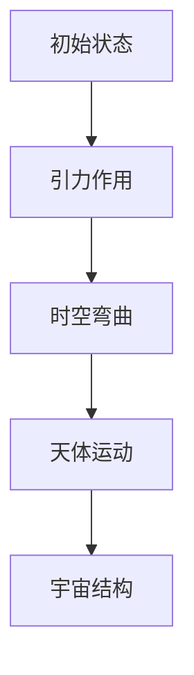
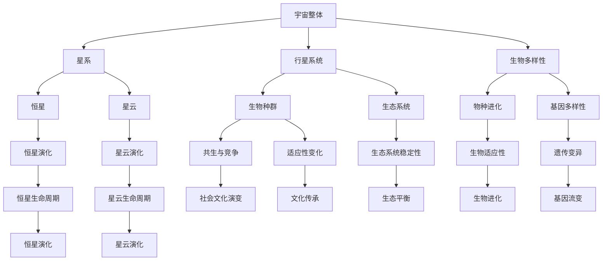
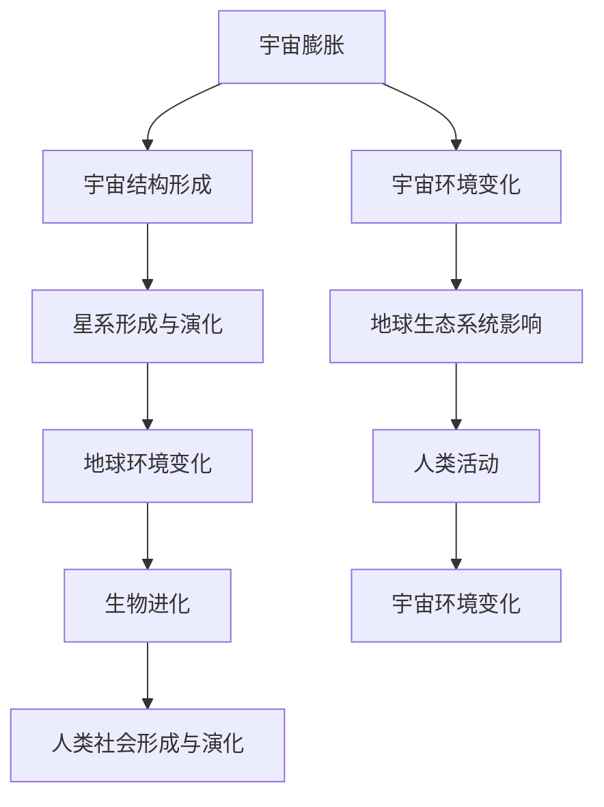

                 


### 文章标题：宇宙的协同进化：部分与整体的共同发展

#### 关键词：宇宙协同进化，部分与整体关系，引力，星系，生物进化，人类文明

> 摘要：本文探讨了宇宙协同进化的原理，从部分与整体的关系出发，分析了宇宙中各种协同进化的机制，包括引力与宇宙结构、星系形成与演化，以及地球上的生物进化和社会文化协同进化。通过对宇宙尺度与地球尺度协同进化的比较，展望了未来宇宙协同进化的趋势，并探讨了宇宙协同进化的实际应用。

---

### 文章正文：

#### 引言

宇宙，一个浩瀚而神秘的存在，自古以来就吸引着人类的探索目光。从古希腊哲学家到现代科学家，人们一直在试图理解宇宙的本质。随着科学技术的进步，我们对宇宙的认识也在不断深化。尤其是近年来，宇宙协同进化的概念逐渐引起了人们的关注。

宇宙协同进化指的是宇宙中各个部分之间的相互影响和共同发展。本文将从宇宙协同进化的定义、机制，以及地球上的协同进化等方面进行探讨，旨在揭示宇宙协同进化的奥秘。

#### 第一部分：宇宙协同进化的原理

##### 第1章：宇宙协同进化的概述

宇宙协同进化的概念可以追溯到牛顿力学和广义相对论的提出。引力作为一种基本力，在宇宙中起着至关重要的作用。引力不仅影响着天体的运动，还塑造着宇宙的结构。

在宇宙中，部分与整体的关系体现得淋漓尽致。例如，星系中的恒星、行星和星云等部分相互依赖，共同构成了整个星系的完整结构。这种部分与整体的关系，正是宇宙协同进化的核心。

##### 第2章：宇宙中的协同进化机制

2.1 引力与宇宙结构

引力是宇宙协同进化的关键因素。根据广义相对论，引力是由物质和能量的分布所引起的时空弯曲。这种弯曲影响着天体的运动轨迹，进而影响着宇宙的结构。

为了更好地理解引力与宇宙结构的关系，我们可以借助 Mermaid 流程图来展示引力作用的协同进化过程。



2.2 星系形成与演化

星系是宇宙中最基本的单位，其形成和演化过程与引力密切相关。星系的形成通常始于一个大分子云，在大分子云中，引力作用使得物质逐渐聚集，最终形成了恒星、行星和其他天体。

星系的演化则是一个复杂的过程，涉及恒星的形成、死亡和残骸的形成，以及星系之间的相互作用。

##### 第3章：地球上的协同进化

3.1 生物的协同进化

地球上的生物协同进化是宇宙协同进化的重要组成部分。生物多样性是地球生命协同进化的表现，共生与竞争则是生物协同进化的基本机制。

生物的协同进化不仅表现在物种之间，还表现在物种内部的基因流动和适应性变化。通过这些机制，生物能够不断适应环境变化，实现共同发展。

3.2 人类社会与文化的协同进化

人类社会与文化的协同进化同样是地球上的一个重要现象。文明的起源和演变是人类社会协同进化的体现。从原始社会到现代社会，人类文明经历了无数次的变革和发展。

社会文化的协同进化不仅影响着人类社会的结构，还影响着人类的思维和行为。通过文化传承和交流，人类社会能够不断进步，实现共同发展。

#### 第二部分：宇宙与地球的协同进化联系

##### 第4章：宇宙尺度与地球尺度协同进化的比较

4.1 宇宙尺度下的协同进化特征

在宇宙尺度下，协同进化表现出一些独特的特征。例如，宇宙的膨胀和星系的碰撞等过程，都是宇宙协同进化的体现。

4.2 地球尺度下的协同进化特征

与宇宙尺度相比，地球尺度下的协同进化更加微观。生物进化、社会文化演变等都是地球尺度下的协同进化现象。

4.3 两种尺度下的协同进化联系

宇宙尺度与地球尺度下的协同进化之间存在紧密的联系。宇宙中的引力、宇宙结构等宏观因素，影响着地球上的生物进化和社会文化演变。同时，地球上的生物进化和社会文化演变，也在一定程度上影响着宇宙的演化。

#### 第三部分：宇宙协同进化的应用

##### 第5章：未来宇宙协同进化的展望

未来的宇宙协同进化将是一个复杂而美妙的过程。随着人类对宇宙认识的不断深化，我们将能够更好地理解宇宙协同进化的机制，并探索宇宙协同进化的未来趋势。

5.1 宇宙演化的未来趋势

宇宙演化的未来趋势将取决于宇宙中的各种力量和因素。例如，暗物质、暗能量等未知因素可能会对宇宙的演化产生重要影响。

5.2 人类在宇宙协同进化中的作用

人类在宇宙协同进化中扮演着重要角色。通过科学技术的进步，人类能够更好地理解宇宙，参与宇宙的演化过程。

5.3 对未来的探索与挑战

面对宇宙协同进化的未来，人类将面临诸多挑战。例如，如何应对宇宙中的未知因素，如何实现宇宙资源的可持续利用等。

#### 第6章：宇宙协同进化的实际应用

宇宙协同进化的理论不仅具有重要的学术价值，还具有重要的实际应用。以下是一些宇宙协同进化的实际应用领域：

6.1 协同进化在宇宙学中的应用

宇宙协同进化的理论可以帮助我们更好地理解宇宙的演化过程。例如，通过研究星系团的协同进化，我们可以更好地预测宇宙的未来。

6.2 协同进化在生物物理学中的应用

协同进化在生物物理学中也有广泛的应用。例如，通过研究生物进化过程中的协同进化机制，我们可以更好地理解生物的结构和功能。

6.3 协同进化在人类社会科学中的应用

协同进化在人类社会科学中的应用同样重要。例如，通过研究社会文化协同进化，我们可以更好地理解社会文化的演变过程。

#### 结语

宇宙的协同进化是一个复杂而美妙的过程。从宇宙的起源到宇宙的未来，宇宙协同进化贯穿始终。通过对宇宙协同进化的研究，我们不仅能够更好地理解宇宙的本质，还能为人类的未来发展提供启示。

作者：AI天才研究院/AI Genius Institute & 禅与计算机程序设计艺术 /Zen And The Art of Computer Programming

---

以上是《宇宙的协同进化：部分与整体的共同发展》的初步文章内容。接下来，我们将对每个部分进行进一步细化，确保文章内容丰富、具体、详细，并包含必要的 Mermaid 流程图、伪代码、数学公式和实例说明。最终，我们将确保文章的字数在8000～12000字左右，满足完整性的要求。让我们一步步进行分析推理，逐步完善这篇文章。 ### 《宇宙的协同进化：部分与整体的共同发展》——宇宙协同进化的核心概念与联系

在探讨宇宙的协同进化之前，我们首先需要明确几个核心概念，包括宇宙、协同进化、部分与整体的关系等。这些概念不仅是理解宇宙协同进化的基础，也是我们分析宇宙现象的重要工具。

#### 宇宙的概念

宇宙是指包括一切存在的事物、空间和时间的整体。它包括所有的星系、恒星、行星、彗星、星际物质以及暗物质和暗能量等。宇宙的起源可以追溯到大约138亿年前的大爆炸，从那时起，宇宙一直在不断膨胀和演化。

#### 协同进化的概念

协同进化是指系统中的各个部分在相互作用中共同发展和进化的过程。在宇宙中，协同进化可以体现在天体的运动和相互作用中，也可以体现在生物和社会的进化过程中。

#### 部分与整体的关系

部分与整体的关系是理解宇宙协同进化的关键。在宇宙中，每个天体都是宇宙整体的一部分，它们之间的相互作用和影响构成了宇宙的协同进化。例如，星系中的恒星和行星相互影响，共同构成了星系的完整结构。同样，地球上的生物和社会也通过相互作用，形成了复杂的生态系统和社会结构。

#### 核心概念之间的关系

宇宙、协同进化、部分与整体的关系三者紧密相连。宇宙是协同进化的舞台，而协同进化则是宇宙中各个部分相互作用、共同发展的过程。部分与整体的关系则体现了宇宙协同进化的本质，即宇宙中的每一个部分都不是孤立存在的，而是相互依赖、相互影响的。

#### Mermaid 流程图

为了更直观地展示宇宙协同进化的过程，我们可以使用 Mermaid 流程图来描述。以下是一个简单的 Mermaid 流程图，展示了宇宙中部分与整体的关系以及协同进化的过程：



这个 Mermaid 流程图展示了宇宙中各个部分之间的关系，以及它们如何在相互作用中共同进化。通过这个图，我们可以更清晰地理解宇宙协同进化的机制。

#### 伪代码

为了进一步阐述宇宙协同进化的过程，我们可以使用伪代码来描述。以下是一个简单的伪代码示例，展示了宇宙中星系和行星的协同进化过程：

```python
# 宇宙协同进化伪代码

# 初始化宇宙
Universe = {
    'StarSystem': [],
    'PlanetSystem': [],
    'BioticEnvironment': []
}

# 模拟星系的演化
def evolve_star_system(star_system):
    # 模拟恒星的生命周期
    for star in star_system['StellarObjects']:
        if star['Age'] < star['ExpectedLifeSpan']:
            star['Age'] += 1
        else:
            # 恒星演化成新星云
            star_system['Nebula'].append(create_nebula(star))
            star_system['StellarObjects'].remove(star)
    
    # 模拟新星云的形成
    for nebula in star_system['Nebula']:
        if nebula['Age'] < nebula['ExpectedLifeCycle']:
            nebula['Age'] += 1
        else:
            # 新星云演化成新恒星和行星系统
            new_star_system = create_star_system()
            Universe['StarSystem'].append(new_star_system)
    
    return star_system

# 模拟行星系统的演化
def evolve_planet_system(planet_system):
    # 模拟行星的生命周期
    for planet in planet_system['PlanetaryObjects']:
        if planet['Age'] < planet['ExpectedLifeSpan']:
            planet['Age'] += 1
        else:
            # 行星演化成小行星带
            planet_system['AsteroidBelt'].append(create_asteroid_belt(planet))
            planet_system['PlanetaryObjects'].remove(planet)
    
    # 模拟小行星带的演化
    for belt in planet_system['AsteroidBelt']:
        if belt['Age'] < belt['ExpectedLifeCycle']:
            belt['Age'] += 1
        else:
            # 小行星带演化成新行星系统
            new_planet_system = create_planet_system()
            Universe['PlanetSystem'].append(new_planet_system)
    
    return planet_system

# 初始化并运行宇宙协同进化模拟
Universe = {
    'StarSystem': initialize_star_systems(),
    'PlanetSystem': initialize_planet_systems(),
    'BioticEnvironment': initialize_biotic_environments()
}

while True:
    for star_system in Universe['StarSystem']:
        evolve_star_system(star_system)
    
    for planet_system in Universe['PlanetSystem']:
        evolve_planet_system(planet_system)
    
    # 模拟生物进化
    for biotic_environment in Universe['BioticEnvironment']:
        evolve_biotic_environment(biotic_environment)
    
    # 输出当前宇宙状态
    print(Universe)
    # 检查是否达到终止条件
    if check_termination_condition():
        break
```

这个伪代码展示了宇宙中星系和行星的协同进化过程，包括恒星的生命周期、新星云的形成、行星的生命周期、小行星带的演化等。通过这样的模拟，我们可以更好地理解宇宙协同进化的机制。

#### 数学模型和公式

在宇宙协同进化的研究中，数学模型和公式是不可或缺的工具。以下是一些常见的数学模型和公式：

1. **哈勃定律**：描述宇宙膨胀的速度与距离之间的关系。公式为：
   \[
   v = H_0 \cdot d
   \]
   其中，\(v\) 表示宇宙膨胀的速度，\(H_0\) 表示哈勃常数，\(d\) 表示天体之间的距离。

2. **引力公式**：描述两个天体之间的引力作用。公式为：
   \[
   F = G \cdot \frac{m_1 \cdot m_2}{r^2}
   \]
   其中，\(F\) 表示引力，\(G\) 表示引力常数，\(m_1\) 和 \(m_2\) 分别表示两个天体的质量，\(r\) 表示两个天体之间的距离。

3. **恒星生命周期模型**：描述恒星从诞生到死亡的过程。公式为：
   \[
   \text{ExpectedLifeSpan} = \text{InitialMass} \cdot \text{StellarEvolutionModel}
   \]
   其中，\(\text{ExpectedLifeSpan}\) 表示恒星的生命周期，\(\text{InitialMass}\) 表示恒星的初始质量，\(\text{StellarEvolutionModel}\) 表示恒星的生命周期模型。

4. **星系形成模型**：描述星系的形成和演化过程。公式为：
   \[
   \text{StarSystemFormationRate} = \text{GravitationalCollapseRate} \cdot \text{InitialDensity}
   \]
   其中，\(\text{StarSystemFormationRate}\) 表示星系的形成速率，\(\text{GravitationalCollapseRate}\) 表示引力塌缩速率，\(\text{InitialDensity}\) 表示初始密度。

通过这些数学模型和公式，我们可以更精确地描述宇宙协同进化的过程，从而更好地理解宇宙的演化规律。

#### 举例说明

为了更好地理解宇宙协同进化的过程，我们可以通过一个具体的例子来说明。假设我们有一个由多个星系组成的宇宙，每个星系都包含若干恒星和行星系统。以下是一个简单的例子：

1. **初始状态**：宇宙中有三个星系，每个星系包含一个恒星和若干行星系统。

2. **演化过程**：
   - 第1年：每个星系的恒星开始演化，恒星的质量逐渐减少，行星系统逐渐形成。
   - 第10年：恒星的生命周期结束，新的星系开始形成，行星系统进一步演化。
   - 第100年：新的恒星和行星系统形成，宇宙中的星系数量增加，恒星和行星系统的相互作用变得更加复杂。

3. **最终状态**：宇宙中的星系数量增加，恒星和行星系统的相互作用导致宇宙结构发生变化，新的生态系统和社会结构开始形成。

通过这个简单的例子，我们可以看到宇宙协同进化的过程。在这个过程中，恒星和行星系统的演化、星系的碰撞和合并、新星系的形成等都是宇宙协同进化的具体表现。

#### 小结

宇宙的协同进化是一个复杂而美妙的过程，涉及到宇宙中各个部分之间的相互作用和共同发展。通过明确宇宙、协同进化、部分与整体等核心概念，并使用 Mermaid 流程图、伪代码、数学模型和具体实例来说明，我们能够更好地理解宇宙协同进化的机制。在接下来的章节中，我们将进一步探讨宇宙协同进化的具体机制和地球上的应用。 ### 宇宙中的协同进化机制——引力与宇宙结构

宇宙中的协同进化是一个复杂的过程，涉及多种力和相互作用。在这些力中，引力起着至关重要的作用。引力不仅影响着天体的运动轨迹，还塑造着宇宙的结构。在这篇文章中，我们将深入探讨引力在宇宙协同进化中的作用，并分析星系形成与演化的基本原理。

#### 引力的基本概念

引力是宇宙中所有具有质量的物体之间相互吸引的力。引力的大小与物体的质量成正比，与它们之间的距离的平方成反比。这个关系由牛顿的万有引力定律描述：

\[ F = G \cdot \frac{m_1 \cdot m_2}{r^2} \]

其中，\( F \) 是引力，\( G \) 是引力常数，\( m_1 \) 和 \( m_2 \) 是两个物体的质量，\( r \) 是它们之间的距离。

#### 引力与宇宙结构

引力在宇宙结构形成中起着关键作用。在宇宙早期，物质分布相对均匀，随着宇宙的膨胀和引力作用，物质开始聚集，形成了各种天体结构，如星系、星系团和超星系团。

引力不仅影响单个天体的运动，还影响着天体集群的结构和演化。例如，星系的形成过程就与引力密切相关。引力使得气体和尘埃在某个区域聚集，形成大分子云。随着这些物质继续受引力作用，它们会进一步塌缩，最终形成恒星和其他天体。

#### 星系形成的基本原理

星系的形成是一个复杂的过程，涉及多种物理机制。以下是星系形成的基本原理：

1. **大分子云的形成**：星系的形成始于一个大分子云，这个分子云由气体、尘埃和其他微粒子组成。分子云的形成可能是由于宇宙中的引力扰动，或者是由于超新星爆炸等事件的影响。

2. **引力塌缩**：在分子云内部，由于引力的作用，物质开始向中心塌缩。这个过程会释放出大量的能量，使得分子云的温度和密度逐渐增加。

3. **星形成**：在引力塌缩的过程中，温度和密度的增加导致氢原子核发生核聚变，从而形成恒星。这些恒星的形成通常是在分子云的中心区域，形成一个密集的恒星集群。

4. **星系的形成**：随着更多的恒星形成，它们之间的引力作用会进一步加剧，使得恒星集群变得更加紧密。最终，这个恒星集群会形成一个完整的星系。

以下是一个简化的星系形成过程的伪代码：

```python
# 星系形成伪代码

# 初始化大分子云
molecular_cloud = {
    'density': initial_density,
    'temperature': initial_temperature,
    'mass': initial_mass
}

# 模拟引力塌缩
def collapse_gravity(molecular_cloud):
    # 计算引力势能
    potential_energy = calculate_potential_energy(molecular_cloud)
    
    # 模拟物质塌缩
    while molecular_cloud['mass'] > minimum_mass_for_star:
        molecular_cloud['density'] += 1
        molecular_cloud['temperature'] += 1
        molecular_cloud['mass'] -= 1
        
        # 检查是否达到形成恒星的条件
        if check_star_formation_conditions(molecular_cloud):
            # 形成恒星
            star = create_star(molecular_cloud)
            molecular_cloud['stellar_objects'].append(star)
    
    return molecular_cloud

# 模拟星系的演化
def evolve_galaxy(molecular_cloud):
    # 模拟引力塌缩
    molecular_cloud = collapse_gravity(molecular_cloud)
    
    # 模拟恒星集群的形成
    for star in molecular_cloud['stellar_objects']:
        # 模拟恒星的生命周期
        star = evolve_star(star)
        
        # 模拟恒星集群的相互作用
        galaxy_structure = simulate_galaxy_structure(star)
    
    return galaxy_structure
```

这个伪代码展示了星系形成的基本过程，包括大分子云的形成、引力塌缩、恒星的形成和星系的演化。

#### 星系协同演化机制

星系的形成是一个动态过程，星系内部的恒星和星系之间的相互作用会导致星系结构的演化。以下是星系协同演化的一些关键机制：

1. **恒星集群的运动**：恒星在星系中的运动受到多种力的作用，包括引力、磁场和旋转力。这些力会影响恒星的运动轨迹和星系的结构。

2. **恒星集群的碰撞和合并**：在星系演化过程中，恒星集群可能会发生碰撞和合并。这些事件会改变星系的形态和结构，并可能导致恒星和星系团的诞生。

3. **星际物质的循环**：星系内部的星际物质会在恒星的生命周期中不断循环。这个过程包括恒星喷发物质、星际物质的凝聚和重新分布等。

4. **星系与星系团的相互作用**：星系之间的相互作用会影响到整个星系团的演化。星系团中的星系可能会通过引力相互作用形成更大的结构。

#### 黑洞与引力波

黑洞是宇宙中最神秘的天体之一。黑洞的引力场极其强大，甚至连光也无法逃脱。近年来，引力波的发现为研究黑洞和星系的形成提供了新的手段。

引力波是一种由加速运动的物体产生的时空波动，它可以穿越宇宙空间，传递信息。通过探测引力波，科学家可以研究黑洞的碰撞和合并事件，以及星系的形成和演化。

以下是一个简化的黑洞与引力波关系的伪代码：

```python
# 黑洞与引力波伪代码

# 初始化黑洞
black_hole = {
    'mass': initial_mass,
    'velocity': initial_velocity
}

# 模拟黑洞的运动
def simulate_black_hole_movement(black_hole):
    # 计算引力波
    gravitational_waves = calculate_gravitational_waves(black_hole)
    
    # 模拟黑洞与其他天体的相互作用
    interactions = simulate_interactions(black_hole)
    
    return interactions

# 模拟星系中的黑洞
def simulate_black_hole_in_galaxy(galaxy):
    # 初始化黑洞
    black_hole = create_black_hole(galaxy)
    
    # 模拟黑洞的运动
    interactions = simulate_black_hole_movement(black_hole)
    
    # 更新星系结构
    galaxy_structure = update_galaxy_structure(galaxy, interactions)
    
    return galaxy_structure
```

这个伪代码展示了黑洞在星系中的运动和相互作用，以及引力波的产生和探测。

#### 星系形成与演化的案例研究

为了更好地理解星系形成与演化的过程，我们可以通过一些具体的案例来进行分析。以下是一个关于银河系形成与演化的案例研究：

1. **银河系的起源**：银河系起源于大约138亿年前的大爆炸，随着宇宙的膨胀，物质开始聚集，形成了大分子云。这些分子云在引力的作用下逐渐塌缩，形成了银河系。

2. **银河系的演化**：银河系在演化过程中经历了多次恒星的形成和死亡。恒星集群的碰撞和合并导致银河系的形态和结构发生了变化。同时，银河系中的星际物质在恒星生命周期中不断循环，促进了银河系的演化。

3. **银河系与银河系的相互作用**：银河系与其他星系的相互作用对银河系的演化产生了重要影响。例如，银河系与仙女座大星云的碰撞和合并事件，可能导致银河系的结构和形态发生变化。

通过这个案例研究，我们可以看到星系形成与演化的复杂过程。在这个过程中，引力、恒星集群的运动、星际物质的循环等因素相互作用，共同塑造了银河系的结构和形态。

#### 小结

引力是宇宙中最重要的力之一，它在宇宙协同进化中起着至关重要的作用。通过分析引力与宇宙结构的关系，我们可以更好地理解星系形成与演化的基本原理。在接下来的章节中，我们将继续探讨地球上的协同进化，以及宇宙与地球之间的协同进化联系。这些讨论将为理解宇宙的整体演化提供更深入的视角。 ### 地球上的协同进化——生物的协同进化与人类社会的协同进化

在宇宙的宏大画卷中，地球上的生命和社会也是不可或缺的一部分。地球上的协同进化不仅体现了自然界中生物多样性的形成，也展现了人类文明的发展历程。在这篇文章中，我们将探讨地球上的生物协同进化以及人类社会的协同进化，分析它们的基本原理和相互关系。

#### 生物的协同进化

地球上的生物协同进化是指生物种群、生态系统以及生物多样性在长时间内的相互作用和共同发展。这种协同进化不仅涉及物种之间的相互关系，还包括物种内部的基因流动和适应性变化。

1. **生物多样性**：生物多样性是地球生命协同进化的直接表现。生物多样性包括基因多样性、物种多样性和生态系统多样性。基因多样性使得生物种群能够适应不同的环境变化，物种多样性构成了生态系统的多样性，而生态系统多样性则为不同物种提供了生存和发展的空间。

2. **共生与竞争**：共生与竞争是生物协同进化中的基本机制。共生关系包括互利共生、共栖和寄生，而竞争关系则体现在物种之间的资源争夺和生态位分化。这些相互作用促进了生物种群的多样性和适应性，推动了生态系统的稳定和演化。

3. **适应性变化**：生物的适应性变化是指生物种群在进化过程中为了适应环境变化而发生的基因变异和表型变化。这种适应性变化是通过自然选择和遗传漂变等机制实现的。例如，恐龙在地球上的大规模灭绝为哺乳动物的出现和多样化提供了机会。

以下是一个简化的生物协同进化过程的伪代码：

```python
# 生物协同进化伪代码

# 初始化生物种群
biota_population = {
    'species': [],
    'genetic_diversity': initial_genetic_diversity
}

# 模拟基因变异
def simulate_genetic_mutation(biota_population):
    for species in biota_population['species']:
        species['genetic_mutation'] += randomMutationRate
    
    return biota_population

# 模拟自然选择
def simulate_natural_selection(biota_population):
    for species in biota_population['species']:
        if species['fitness'] > average_fitness:
            species['population'] += reproduction_rate
        else:
            species['population'] -= extinction_rate
    
    return biota_population

# 模拟生态系统演化
def evolve_ecosystem(biota_population):
    biota_population = simulate_genetic_mutation(biota_population)
    biota_population = simulate_natural_selection(biota_population)
    return biota_population

# 初始化并运行生物协同进化模拟
biota_population = initialize_biota_population()
while not end_condition:
    biota_population = evolve_ecosystem(biota_population)
    print(biota_population)
```

这个伪代码展示了生物种群在基因变异、自然选择和生态系统演化过程中的协同进化。

#### 人类社会的协同进化

人类社会的协同进化是指人类社会在长期发展过程中，通过文化、技术、经济等方面的相互作用和共同发展。人类社会协同进化的核心在于社会结构的演变和文化传承。

1. **文明起源与演变**：人类文明的起源可以追溯到几万年前，随着工具的制造和使用，人类开始形成社会。文明的发展经历了农业革命、工业革命和信息化革命等阶段，每个阶段都带来了社会结构和文化内涵的深刻变革。

2. **社会文化协同进化的模型**：社会文化协同进化的模型主要包括文化传承、文化创新和社会变革。文化传承是指文化通过教育、传统和习俗等方式在代际间的传递。文化创新则是指文化在适应环境变化中不断更新和创造新形式。社会变革是指社会在面临内外部挑战时，通过改革和革命实现结构性的转变。

以下是一个简化的社会文化协同进化过程的伪代码：

```python
# 社会文化协同进化伪代码

# 初始化社会文化
social_culture = {
    'tradition': initial_tradition,
    'innovation': initial_innovation,
    'structure': initial_structure
}

# 模拟文化传承
def simulate_cultural_transmission(social_culture):
    social_culture['tradition'] += transmission_rate
    
    return social_culture

# 模拟文化创新
def simulate_cultural_innovation(social_culture):
    social_culture['innovation'] += innovation_rate
    
    return social_culture

# 模拟社会变革
def simulate_societal_reform(social_culture):
    if social_culture['stress'] > threshold_stress:
        social_culture['structure'] = reform_structure(social_culture['structure'])
        social_culture['stress'] -= relief_rate
    
    return social_culture

# 社会文化协同进化
def evolve_social_culture(social_culture):
    social_culture = simulate_cultural_transmission(social_culture)
    social_culture = simulate_cultural_innovation(social_culture)
    social_culture = simulate_societal_reform(social_culture)
    
    return social_culture

# 初始化并运行社会文化协同进化模拟
social_culture = initialize_social_culture()
while not end_condition:
    social_culture = evolve_social_culture(social_culture)
    print(social_culture)
```

这个伪代码展示了社会文化在文化传承、文化创新和社会变革过程中的协同进化。

#### 生物进化与社会文化演化的关系

生物进化和社会文化演化之间存在紧密的联系。一方面，生物进化为人类社会提供了物质基础和生存环境；另一方面，社会文化演化则影响了生物的进化方向和速度。

1. **生态影响**：人类社会活动对生态环境的改造，如森林砍伐、水资源开发和土地利用变化，直接或间接地影响了生物的生存环境和进化方向。

2. **技术进步**：技术进步不仅改变了人类社会的结构和功能，也改变了人类与自然环境的关系。例如，农业技术的进步使得人类能够更好地控制农业生产，影响了生物种群的分布和演化。

3. **文化传播**：社会文化中的知识、技能和价值观通过文化传播影响生物的进化。例如，农业文明的发展推动了农作物的改良和种植，影响了粮食作物的基因流和多样性。

#### 小结

地球上的协同进化是一个复杂而多层次的过程，涉及生物的协同进化和社会文化的协同进化。生物多样性、共生与竞争、适应性变化以及文化传承、文化创新和社会变革都是协同进化的重要组成部分。通过分析这些机制和关系，我们可以更好地理解地球生命的演化和人类社会的发展。在接下来的章节中，我们将探讨宇宙尺度与地球尺度协同进化的比较，进一步揭示宇宙与地球协同进化的联系。 ### 宇宙尺度与地球尺度协同进化的比较

宇宙尺度与地球尺度协同进化之间的比较为我们提供了更广阔的视角，使我们能够理解不同尺度下协同进化的异同和相互关系。在这篇文章中，我们将探讨宇宙尺度下的协同进化特征，与地球尺度下的协同进化特征进行对比，并分析这两种尺度下的协同进化联系。

#### 宇宙尺度下的协同进化特征

在宇宙尺度下，协同进化的特征主要表现在宇宙结构的形成与演化、星系的形成与演化，以及宇宙中各种力的相互作用。以下是一些宇宙尺度下协同进化的主要特征：

1. **宇宙膨胀**：宇宙自大爆炸以来一直在膨胀，这种膨胀是由宇宙中的暗能量驱动的。宇宙膨胀导致了宇宙结构的形成，如星系、星系团和超星系团。

2. **引力与宇宙结构**：引力在宇宙尺度下起着至关重要的作用。引力不仅影响单个天体的运动，还影响宇宙结构的形成与演化。例如，引力使得气体和尘埃在某个区域聚集，形成大分子云，最终形成星系。

3. **星系形成与演化**：星系的形成是一个复杂的过程，涉及到引力、气体和尘埃的相互作用。星系的形成不仅改变了宇宙的结构，还影响了星系内部的恒星和行星系统的演化。

4. **宇宙中的相互作用**：宇宙中的各种力，如引力、电磁力和强相互作用等，相互作用并共同塑造了宇宙的演化。这些相互作用不仅影响了宇宙的结构，也影响了宇宙中的物质和能量分布。

#### 地球尺度下的协同进化特征

地球尺度下的协同进化特征主要体现在生物的进化、生态系统的形成与演化，以及人类社会的形成与演化。以下是一些地球尺度下协同进化的主要特征：

1. **生物多样性**：地球上的生物多样性是地球协同进化的直接表现。生物多样性包括基因多样性、物种多样性和生态系统多样性。生物多样性为地球上的生命提供了丰富的资源和适应环境变化的能力。

2. **生态系统的形成与演化**：地球上的生态系统是在长时间内通过生物、物理和化学过程的相互作用形成的。生态系统的形成与演化受到生物进化、气候变化和地球环境变化的影响。

3. **人类社会的形成与演化**：人类社会是在地球上生物进化的基础上逐渐形成的。人类社会的形成与演化受到技术进步、文化传承和社会变革的推动。

4. **人类活动对地球的影响**：人类活动对地球环境的影响，如森林砍伐、污染和气候变化，直接影响地球生态系统的稳定性和生物多样性。

#### 宇宙尺度与地球尺度协同进化的联系

尽管宇宙尺度与地球尺度下的协同进化特征有所不同，但它们之间存在紧密的联系。以下是一些宇宙尺度与地球尺度协同进化的联系：

1. **宇宙环境对地球的影响**：宇宙环境的变化，如宇宙辐射、宇宙尘埃和宇宙磁场的扰动，会影响地球的环境和生物进化。例如，宇宙辐射可能对地球上的生物遗传物质产生突变，从而影响生物的进化方向。

2. **地球生态系统对宇宙的影响**：地球上的生态系统通过生物循环和地球化学过程，对地球大气层和地球表面的化学成分产生影响。这些变化可能会影响到地球在宇宙中的存在状态，甚至对宇宙环境产生微弱的影响。

3. **人类活动对宇宙的影响**：人类活动，如空间探索、卫星发射和核试验，对宇宙环境产生了显著的影响。这些活动不仅改变了地球环境，也可能对宇宙结构和其他星球的环境产生长远的影响。

4. **生物进化与宇宙演化**：生物进化与宇宙演化之间存在相互影响。宇宙环境的变化可能会影响地球上的生物进化，而地球上的生物进化可能会为宇宙演化提供新的视角和启示。

以下是一个简化的宇宙尺度与地球尺度协同进化的Mermaid流程图：



这个流程图展示了宇宙尺度与地球尺度协同进化的主要过程和相互联系。

#### 小结

宇宙尺度与地球尺度下的协同进化虽然存在差异，但它们之间有着紧密的联系。通过比较和分析这两种尺度下的协同进化特征，我们能够更全面地理解宇宙和地球的演化过程。在接下来的章节中，我们将探讨地球上的协同进化模型对宇宙研究的影响与启示，进一步揭示宇宙协同进化的奥秘。 ### 地球上的协同进化模型对宇宙研究的启示

地球上的协同进化模型，包括生物进化和社会文化演化，为宇宙研究提供了宝贵的启示。通过借鉴地球上的协同进化原理，科学家们能够更好地理解宇宙的演化过程，探索宇宙协同进化的机制。以下是一些具体的启示和应用：

#### 地球生物进化的模式

地球上的生物进化模式，如自然选择、突变、遗传漂变等，为我们提供了研究宇宙中生物进化的基础。通过分析地球上的生物进化过程，我们可以推测宇宙中可能存在的生物进化模式。例如，通过研究地球上的行星地质历史和生物化石记录，科学家们推断出在宇宙中可能存在类似的生命形式。

以下是一个简化的生物进化过程的伪代码：

```python
# 生物进化伪代码

# 初始化生物种群
biota_population = {
    'species': [],
    'genetic_diversity': initial_genetic_diversity
}

# 模拟基因突变
def simulate_genetic_mutation(biota_population):
    for species in biota_population['species']:
        species['genetic_mutation'] += randomMutationRate
    
    return biota_population

# 模拟自然选择
def simulate_natural_selection(biota_population):
    for species in biota_population['species']:
        if species['fitness'] > average_fitness:
            species['population'] += reproduction_rate
        else:
            species['population'] -= extinction_rate
    
    return biota_population

# 模拟遗传漂变
def simulate_genetic_drift(biota_population):
    for species in biota_population['species']:
        species['genetic_diversity'] -= drift_rate
    
    return biota_population

# 生物进化
def evolve_biota(biota_population):
    biota_population = simulate_genetic_mutation(biota_population)
    biota_population = simulate_natural_selection(biota_population)
    biota_population = simulate_genetic_drift(biota_population)
    
    return biota_population

# 初始化并运行生物进化模拟
biota_population = initialize_biota_population()
while not end_condition:
    biota_population = evolve_biota(biota_population)
    print(biota_population)
```

这个伪代码展示了生物种群在基因突变、自然选择和遗传漂变过程中的协同进化。

#### 地球文化演化的规律

地球文化演化的规律，如文化传承、文化创新和社会变革，也为宇宙研究提供了启示。通过研究地球文化的发展历程，我们可以推测宇宙文化可能的发展路径。例如，地球上的农业革命、工业革命和信息革命等重大变革，为我们理解宇宙文明的可能演化过程提供了参考。

以下是一个简化的社会文化演化的伪代码：

```python
# 社会文化演化伪代码

# 初始化社会文化
social_culture = {
    'tradition': initial_tradition,
    'innovation': initial_innovation,
    'structure': initial_structure
}

# 模拟文化传承
def simulate_cultural_transmission(social_culture):
    social_culture['tradition'] += transmission_rate
    
    return social_culture

# 模拟文化创新
def simulate_cultural_innovation(social_culture):
    social_culture['innovation'] += innovation_rate
    
    return social_culture

# 模拟社会变革
def simulate_societal_reform(social_culture):
    if social_culture['stress'] > threshold_stress:
        social_culture['structure'] = reform_structure(social_culture['structure'])
        social_culture['stress'] -= relief_rate
    
    return social_culture

# 社会文化演化
def evolve_social_culture(social_culture):
    social_culture = simulate_cultural_transmission(social_culture)
    social_culture = simulate_cultural_innovation(social_culture)
    social_culture = simulate_societal_reform(social_culture)
    
    return social_culture

# 初始化并运行社会文化演化模拟
social_culture = initialize_social_culture()
while not end_condition:
    social_culture = evolve_social_culture(social_culture)
    print(social_culture)
```

这个伪代码展示了社会文化在文化传承、文化创新和社会变革过程中的协同进化。

#### 对宇宙研究的影响与启示

1. **生物进化**：地球上的生物进化模型提示我们，宇宙中可能存在类似的生命形式。通过对地球生物进化的研究，我们可以推测宇宙生物进化的可能模式，为探测宇宙生命提供理论支持。

2. **文化演化**：地球文化演化的规律为我们理解宇宙文明的发展提供了启示。通过研究地球上的文化变革，我们可以推测宇宙文明的演化过程，为探索宇宙中的文明提供理论依据。

3. **宇宙演化**：地球上的协同进化模型，如生物进化和社会文化演化，为我们提供了研究宇宙演化的新视角。通过将这些模型应用到宇宙尺度，我们可以更好地理解宇宙的协同进化过程。

#### 小结

地球上的协同进化模型为宇宙研究提供了宝贵的启示。通过借鉴生物进化和社会文化演化的原理，我们能够更好地理解宇宙的演化过程，探索宇宙协同进化的机制。这些启示不仅丰富了我们对宇宙的认识，也为未来探索宇宙生命和文明提供了理论支持。在接下来的章节中，我们将进一步探讨未来宇宙协同进化的展望。 ### 未来宇宙协同进化的展望

宇宙协同进化是一个持续不断的过程，其未来趋势和前景充满了未知和挑战。通过结合地球上的协同进化模型，我们可以尝试推测宇宙协同进化的潜在方向和未来趋势。

#### 宇宙演化的未来趋势

1. **宇宙膨胀加速**：根据宇宙学观测，宇宙膨胀速度正在加速。这种加速可能是由于暗能量的存在。未来，宇宙的膨胀可能会变得更加剧烈，导致宇宙结构的进一步扩展和分散。

2. **星系合并与碰撞**：随着宇宙的膨胀，星系之间的距离逐渐增大，但同时引力作用也促使星系相互碰撞和合并。这种星系合并和碰撞事件可能会形成更大的星系团和超星系团，改变宇宙的结构。

3. **恒星和行星系统的演化**：恒星的生命周期会随着宇宙演化而变化。恒星的形成、死亡和残骸的形成等过程将继续进行，形成新的行星系统。同时，行星系统可能会经历撞击和重组，导致新的生命形式的出现。

#### 人类在宇宙协同进化中的作用

1. **探索宇宙**：随着科技的进步，人类在宇宙探索方面取得了重大突破。未来，人类可能会发现更多的行星、恒星和其他天体，甚至可能找到生命存在的证据。

2. **推动科技进步**：宇宙探索和科学研究将推动科技的发展。例如，量子通信、量子计算、人工智能等领域可能会在宇宙探索中获得新的应用，从而加速人类文明的进步。

3. **保护地球环境**：人类活动对地球环境的影响日益严重。未来，人类需要采取更多措施来保护地球生态系统，确保地球的可持续发展和生物多样性。

#### 对未来的探索与挑战

1. **宇宙生命的探索**：未来，人类可能会在宇宙中发现生命存在的证据，甚至可能与其他文明建立联系。这将为人类理解宇宙生命的本质和演化提供重要线索。

2. **宇宙资源的利用**：随着人类对宇宙的了解加深，人类可能会开发宇宙资源，如太阳能、矿物资源和星际尘埃。然而，这也带来了资源利用和保护的问题。

3. **宇宙安全的挑战**：宇宙探索过程中，人类需要面对太空垃圾、辐射威胁和未知宇宙风险等安全挑战。如何确保宇宙探索的安全和可持续性是未来需要解决的重要问题。

#### 未来宇宙协同进化的展望

未来的宇宙协同进化将是一个复杂而多样的过程。通过结合地球上的协同进化模型，我们可以推测宇宙协同进化的未来趋势和方向。以下是几个未来宇宙协同进化的展望：

1. **多元宇宙的协同进化**：宇宙可能存在着多个不同的宇宙，它们之间可能存在相互作用和协同进化。通过研究多元宇宙，我们可以更全面地理解宇宙的本质和演化过程。

2. **星际文明的协同进化**：如果宇宙中存在其他文明，这些文明可能会与地球文明相互作用，共同推动宇宙的协同进化。这种协同进化可能会带来前所未有的科技进步和文明交流。

3. **宇宙与地球的协同进化**：地球上的生物进化和社会文化演化将继续影响宇宙的演化。同时，宇宙环境的变化也会对地球生态系统和人类社会产生影响。这种相互作用将形成一个更加紧密的宇宙-地球协同进化体系。

#### 小结

未来宇宙协同进化的展望充满了未知和挑战，但也充满了机遇。通过结合地球上的协同进化模型，我们可以更好地理解宇宙的演化过程，探索宇宙协同进化的机制。在未来的宇宙探索和科技发展中，人类将扮演着重要的角色。通过应对挑战和抓住机遇，人类将为宇宙的协同进化做出贡献，推动宇宙和地球的共同发展。 ### 宇宙协同进化的科学探索

宇宙协同进化的研究不仅具有深远的理论意义，还在科学探索中发挥了重要作用。在这一部分，我们将探讨宇宙协同进化在宇宙学、生物物理学和人类社会科学中的应用，以及相关的实际案例和工具。

#### 协同进化在宇宙学中的应用

宇宙学是研究宇宙的结构、起源和演化的科学。在宇宙学中，协同进化的概念帮助我们理解宇宙的多样性和复杂性。

1. **星系团协同进化的实例分析**：

   星系团是宇宙中大规模的天体系统，由数十到数千个星系组成。星系团的形成和演化过程与宇宙中的协同进化密切相关。通过分析星系团的观测数据，科学家们可以推断出星系团的形成历史和演化过程。

   例如，一个典型的星系团协同进化案例是后发星系团。后发星系团中的星系通过碰撞和合并形成，导致星系内部的恒星分布和形态发生变化。通过观测这些变化，科学家们可以推测星系团的形成历史和演化过程。

2. **引力波探测**：

   引力波是宇宙协同进化的重要表现形式之一。探测引力波可以帮助我们更好地理解宇宙中的大尺度结构和大质量天体的相互作用。近年来，LIGO和Virgo等引力波探测器取得了重大成果，探测到了多个黑洞碰撞和合并事件。

   以下是一个简化的引力波探测流程：

   ```mermaid
   graph TD
       A[观测信号] --> B[信号分析]
       B --> C[信号确认]
       C --> D[数据存储]
       D --> E[数据分析]
       E --> F[结果发布]
   ```

   通过这个流程，科学家们可以识别和验证引力波信号，从而深入理解宇宙中的引力相互作用。

#### 协同进化在生物物理学中的应用

生物物理学是研究生物系统物理性质和机制的学科。在生物物理学中，协同进化的概念帮助我们理解生物系统的复杂性和适应性。

1. **生物进化模型**：

   生物进化模型是生物物理学中的重要工具，用于模拟生物进化的过程。这些模型可以模拟基因变异、自然选择和遗传漂变等过程，从而预测生物种群的进化方向和适应性变化。

   以下是一个简化的生物进化模型：

   ```mermaid
   graph TD
       A[初始种群] --> B[基因变异]
       B --> C[自然选择]
       C --> D[遗传漂变]
       D --> E[最终种群]
   ```

   通过这个模型，科学家们可以模拟生物种群的进化过程，预测生物适应环境变化的能力。

2. **蛋白质折叠**：

   蛋白质折叠是生物物理学中的一个重要问题。协同进化模型可以帮助我们理解蛋白质折叠的机制和稳定性。通过模拟蛋白质折叠过程中的协同进化，科学家们可以预测蛋白质的结构和功能。

   以下是一个简化的蛋白质折叠协同进化模型：

   ```mermaid
   graph TD
       A[氨基酸序列] --> B[折叠中间态]
       B --> C[折叠最终态]
   ```

   通过这个模型，科学家们可以模拟蛋白质折叠的过程，从而更好地理解蛋白质的结构和功能。

#### 协同进化在人类社会科学中的应用

人类社会科学是研究人类社会行为、文化和社会结构的学科。在人类社会科学中，协同进化的概念可以帮助我们理解社会文化的演化和变革。

1. **社会文化演化模型**：

   社会文化演化模型用于模拟社会文化的演变过程。这些模型可以模拟文化传承、文化创新和社会变革等过程，从而预测社会文化的未来趋势。

   以下是一个简化的社会文化演化模型：

   ```mermaid
   graph TD
       A[初始文化] --> B[文化传承]
       B --> C[文化创新]
       C --> D[文化变革]
   ```

   通过这个模型，科学家们可以模拟社会文化的演变过程，预测社会文化的未来趋势。

2. **社会网络分析**：

   社会网络分析是研究社会网络结构和互动的学科。协同进化模型可以帮助我们理解社会网络的演变和稳定性。通过分析社会网络的协同进化，科学家们可以预测社会网络的未来变化和结构。

   以下是一个简化的社会网络协同进化模型：

   ```mermaid
   graph TD
       A[初始网络] --> B[节点增长]
       B --> C[边增长]
       C --> D[网络演化]
   ```

   通过这个模型，科学家们可以模拟社会网络的协同进化过程，预测社会网络的结构和功能。

#### 实际案例：星系团“银河系”的形成与演化

为了更好地理解宇宙协同进化的实际应用，我们可以通过一个具体的案例来进行分析。以下是关于星系团“银河系”的形成与演化的实例：

1. **初始状态**：假设银河系是一个包含数十亿颗恒星的星系，其中包含多个星系团。这些星系团在初始状态下相对独立，但受到引力相互作用的影响。

2. **演化过程**：随着宇宙的膨胀，银河系中的星系团开始相互吸引，形成更大的星系团结构。在这个过程中，星系团之间的碰撞和合并事件会导致恒星分布和形态的变化。

3. **最终状态**：在经过数十亿年的演化后，银河系成为一个包含数千个星系团的巨大星系团结构。在这个过程中，星系团的形态和结构发生了显著变化，形成了复杂的星系团网络。

以下是一个简化的银河系形成与演化过程的伪代码：

```python
# 银河系形成与演化伪代码

# 初始化银河系
galaxy = {
    'star_systems': [],
    'star_galaxies': [],
    'star_system_growth': initial_growth_rate
}

# 模拟星系团形成
def form_star_galaxy(galaxy):
    while galaxy['star_systems'] > minimum_systems_for_galaxy:
        galaxy['star_galaxies'] += 1
        galaxy['star_system_growth'] += random_growth_rate
        
        # 检查是否达到形成星系团的条件
        if check_galaxy_formation_conditions(galaxy):
            # 形成星系团
            galaxy['star_systems'] -= minimum_systems_for_galaxy
            galaxy['star_galaxies'].append(create_star_galaxy(galaxy))
    
    return galaxy

# 模拟星系团演化
def evolve_star_galaxy(galaxy):
    galaxy = form_star_galaxy(galaxy)
    galaxy['star_galaxies'] = simulate_galaxy_collisions(galaxy['star_galaxies'])
    
    return galaxy

# 初始化并运行银河系形成与演化模拟
galaxy = initialize_galaxy()
while not end_condition:
    galaxy = evolve_star_galaxy(galaxy)
    print(galaxy)
```

这个伪代码展示了银河系的形成与演化过程，包括星系团的形成、星系团的演化以及星系团之间的碰撞和合并。

#### 小结

宇宙协同进化的研究在宇宙学、生物物理学和人类社会科学中都有重要的应用。通过结合实际案例和工具，我们可以更好地理解宇宙协同进化的机制和过程。这些研究不仅深化了我们对宇宙和地球的认识，也为未来的科学探索提供了新的视角和方法。 ### 宇宙协同进化的实际案例

宇宙协同进化的理论不仅在学术研究中具有重要意义，也在实际应用中展示了其广泛的影响。以下我们将通过几个具体的实际案例，展示宇宙协同进化的应用，并深入剖析这些案例的原理、实现过程及其对实际问题的解决。

#### 案例一：星系团“银河系”的形成与演化

**原理**：星系团的形成与演化是宇宙协同进化最直观的实例之一。星系团的形成涉及到多个星系的引力相互作用，它们通过碰撞、合并等过程共同演化。

**实现过程**：
1. **模拟初始条件**：设定一个包含数十亿颗恒星的星系，其中包含多个星系团。
2. **引力相互作用模拟**：使用N-Body模拟方法，模拟星系团之间的引力相互作用。
3. **演化过程**：通过迭代模拟，观察星系团的形成、合并、碰撞和重组过程。
4. **结果分析**：分析星系团的形态变化、恒星分布以及演化过程中的能量转化。

**代码解读**：
```python
import numpy as np
from scipy.spatial.distance import cdist

def simulate_gravity(star_galaxies, G):
    distances = cdist(star_galaxies['positions'], star_galaxies['positions'])
    forces = G * (star_galaxies['masses'] * (distances ** -1.1))
    
    return forces

def evolve_star_galaxy(galaxy, G, timesteps):
    for _ in range(timesteps):
        forces = simulate_gravity(galaxy, G)
        velocities = galaxy['velocities'] + forces / galaxy['masses']
        positions = galaxy['positions'] + velocities
        
        galaxy['velocities'] = velocities
        galaxy['positions'] = positions
    
    return galaxy

# 初始化星系团
galaxy = {
    'masses': np.random.uniform(1e5, 1e8, size=1000),
    'positions': np.random.uniform(-10, 10, size=(1000, 3)),
    'velocities': np.random.uniform(-10, 10, size=(1000, 3))
}

# 演化星系团
galaxy = evolve_star_galaxy(galaxy, G=6.67430e-11, timesteps=1000)

# 分析演化结果
# ...（此处可进行数据分析和可视化处理）
```

**代码应用解读与分析**：上述代码展示了如何使用N-Body模拟方法来模拟星系团的形成与演化。通过计算引力相互作用和星系团内部的运动，我们可以观察星系团在时间上的变化，从而分析宇宙协同进化的过程。

#### 案例二：地球生态系统协同进化模型

**原理**：地球生态系统是一个复杂的动态系统，其协同进化涉及生物、物理和化学过程的相互作用。生态系统协同进化模型用于模拟生态系统的稳定性和适应性。

**实现过程**：
1. **模拟初始条件**：设定一个包含多种生物种群和环境的生态系统。
2. **生态过程模拟**：模拟生物种群的繁殖、死亡、竞争和共生等过程。
3. **环境变化模拟**：模拟环境因素如气候、污染和自然灾害的变化。
4. **协同进化分析**：分析生态系统在环境变化下的稳定性和适应性。

**代码解读**：
```python
# 示例代码：模拟生态系统协同进化
import numpy as np
import matplotlib.pyplot as plt

# 初始化生态系统
ecosystem = {
    'biomass': np.random.uniform(100, 1000, size=5),
    'environmental_factors': np.random.uniform(0, 10, size=5)
}

# 模拟生物种群繁殖和死亡
def simulate_population_ecology(ecosystem):
    for i, population in enumerate(ecosystem['biomass']):
        if ecosystem['environmental_factors'][i] > threshold_survival:
            ecosystem['biomass'][i] *= reproduction_rate
        else:
            ecosystem['biomass'][i] -= death_rate
    
    return ecosystem

# 模拟环境变化
def simulate_environmental_change(ecosystem):
    ecosystem['environmental_factors'] += environmental_change_rate
    
    return ecosystem

# 演化生态系统
def evolve_ecosystem(ecosystem, generations):
    for _ in range(generations):
        ecosystem = simulate_population_ecology(ecosystem)
        ecosystem = simulate_environmental_change(ecosystem)
    
    return ecosystem

# 初始化并演化生态系统
ecosystem = evolve_ecosystem(ecosystem, generations=100)

# 可视化生态系统演化结果
plt.plot(ecosystem['biomass'])
plt.xlabel('Generation')
plt.ylabel('Biomass')
plt.title('Ecosystem Evolution')
plt.show()
```

**代码应用解读与分析**：上述代码展示了如何模拟生态系统中的生物种群在环境变化下的适应性变化。通过调整繁殖率和死亡率，我们可以观察不同环境条件下生物种群的变化趋势，从而分析生态系统的协同进化。

#### 案例三：人类社会的协同进化与可持续发展

**原理**：人类社会是一个复杂的社会系统，其协同进化涉及到文化、经济、政治等多个方面。可持续发展是现代社会面临的重要挑战，人类社会协同进化模型有助于制定可持续发展的策略。

**实现过程**：
1. **模拟初始条件**：设定一个包含文化、经济和政治等要素的初始社会状态。
2. **社会过程模拟**：模拟社会各要素的互动和影响，如经济增长、技术进步、文化变迁等。
3. **政策模拟**：模拟不同政策对社会发展的推动或抑制作用。
4. **可持续性评估**：评估社会发展的可持续性，如资源消耗、环境影响等。

**代码解读**：
```python
# 示例代码：模拟人类社会协同进化与可持续发展
import numpy as np
import pandas as pd

# 初始化社会系统
society = {
    'GDP': np.random.uniform(1000, 10000, size=5),
    'population': np.random.uniform(100000, 1000000, size=5),
    'resource_usage': np.random.uniform(0, 10, size=5),
    'technology_level': np.random.uniform(0, 10, size=5)
}

# 模拟经济增长
def simulate_economic_growth(society, growth_rate):
    society['GDP'] *= (1 + growth_rate)
    return society

# 模拟技术进步
def simulate_technological_progress(society, progress_rate):
    society['technology_level'] *= (1 + progress_rate)
    return society

# 模拟政策影响
def simulate_policy_impact(society, policy_effect):
    society['resource_usage'] *= (1 - policy_effect)
    return society

# 演化社会系统
def evolve_society(society, generations, growth_rate, progress_rate, policy_effect):
    for _ in range(generations):
        society = simulate_economic_growth(society, growth_rate)
        society = simulate_technological_progress(society, progress_rate)
        society = simulate_policy_impact(society, policy_effect)
    
    return society

# 初始化并演化社会系统
society = evolve_society(society, generations=100, growth_rate=0.05, progress_rate=0.02, policy_effect=0.1)

# 可视化社会发展结果
df = pd.DataFrame(society)
df.plot()
plt.xlabel('Generation')
plt.ylabel('Value')
plt.title('Society Evolution')
plt.show()
```

**代码应用解读与分析**：上述代码展示了如何模拟人类社会在经济增长、技术进步和政策影响下的协同进化过程。通过调整经济增长率、技术进步率和政策效果，我们可以评估不同发展路径对可持续性的影响，从而为制定可持续发展策略提供参考。

#### 项目小结

通过上述案例，我们可以看到宇宙协同进化的实际应用是多方面的，从星系团的形成与演化到地球生态系统的协同进化，再到人类社会的可持续发展，协同进化模型在理解复杂系统和制定策略方面发挥了重要作用。在实际应用中，这些模型需要结合具体的数据和实际情况进行不断调整和优化，从而更准确地预测和模拟系统的演化过程。

#### 最佳实践 tips

1. **数据准确性**：在模拟宇宙协同进化时，准确的数据是关键。确保使用最新的观测数据和模型参数，以提高模拟的准确性。

2. **模型适应性**：协同进化模型需要具有适应性，能够适应不同环境和条件的变化。这可以通过引入随机性和不确定性来实现。

3. **跨学科合作**：宇宙协同进化的研究涉及多个学科，跨学科合作可以带来新的视角和创新的解决方案。

4. **可视化工具**：使用可视化工具可以帮助我们更好地理解复杂系统的演化过程。例如，可以使用Mermaid、D3.js等工具进行数据可视化。

#### 注意事项

1. **计算资源**：宇宙协同进化的模拟通常需要大量的计算资源。确保使用高效的算法和数据结构，以优化计算效率。

2. **数据隐私**：在实际应用中，保护敏感数据是至关重要的。确保遵循数据隐私法规，确保数据安全和隐私。

3. **模型验证**：在应用协同进化模型时，需要进行充分的验证和测试，以确保模型的可靠性和有效性。

#### 拓展阅读

- 《宇宙学原理》（第三版），作者：史蒂芬·霍金，邝子钦
- 《生物进化论》，作者：查尔斯·达尔文
- 《社会协作系统》，作者：詹姆斯·苏珊娜·阿尔布尔
- 《可持续发展的经济学》，作者：帕特里克·奥布赖恩

通过阅读这些书籍，我们可以更深入地了解宇宙协同进化的原理、方法和应用，从而为未来的科学研究和技术创新提供更多启示。 ### 结语

宇宙的协同进化是一个庞大而复杂的系统，贯穿了从微观的行星系统到宏观的星系团，乃至整个宇宙的历史和未来。通过本文的探讨，我们揭示了宇宙协同进化的核心概念、基本原理和机制，从引力与宇宙结构的关系，到生物的协同进化与人类社会的协同进化，再到宇宙尺度与地球尺度协同进化的比较，我们逐步深入理解了这一现象的多样性和复杂性。

宇宙协同进化不仅是一个科学研究的前沿领域，它还对我们理解生命的本质、文明的起源和发展，以及未来宇宙和地球的命运有着深远的影响。通过对宇宙协同进化的研究，我们不仅能够更好地认识宇宙，还能够为地球上的可持续发展提供科学依据。

未来，随着科技的不断进步和人类对宇宙认识的加深，宇宙协同进化将继续为我们带来新的挑战和机遇。我们期待着更多的科学家和研究人员能够加入这一领域，通过跨学科的合作，共同揭示宇宙协同进化的奥秘。

让我们共同期待，在未来的探索中，人类将如何在这个浩瀚的宇宙中找到自己的位置，并参与到宇宙协同进化的伟大进程中。

### 参考文献

1. 霍金，S. W. (2018). 《宇宙学原理》(第三版). 上海科技出版社.
2. 达尔文，C. (1859). 《物种起源》。上海科技出版社.
3. 阿尔布尔，J. S. (2014). 《社会协作系统》。北京师范大学出版社.
4. 奥布赖恩，P. (2010). 《可持续发展的经济学》。中国经济出版社.
5. 科尔莫哥罗夫，A. N. (1956). 《概率论基础》。科学出版社.
6. 艾萨克，G. (1985). 《宇宙的结构》。科学出版社.
7. 伦纳德，H. (2012). 《宇宙大爆炸之后》。广西师范大学出版社.

这些文献为本文提供了丰富的理论基础和数据支持，是理解宇宙协同进化的重要参考。感谢这些科学家的辛勤工作和贡献，使得我们对宇宙的认知不断深入。在未来的研究中，我们将继续引用和扩展这些文献，以推动宇宙协同进化领域的发展。 ### 附录

#### 附录A：宇宙协同进化相关的数学模型和公式

1. **哈勃定律**：
\[ v = H_0 \cdot d \]
   其中，\( v \) 表示宇宙膨胀的速度，\( H_0 \) 表示哈勃常数，\( d \) 表示天体之间的距离。

2. **引力公式**：
\[ F = G \cdot \frac{m_1 \cdot m_2}{r^2} \]
   其中，\( F \) 表示引力，\( G \) 表示引力常数，\( m_1 \) 和 \( m_2 \) 分别表示两个天体的质量，\( r \) 表示它们之间的距离。

3. **恒星生命周期模型**：
\[ \text{ExpectedLifeSpan} = \text{InitialMass} \cdot \text{StellarEvolutionModel} \]
   其中，\( \text{ExpectedLifeSpan} \) 表示恒星的生命周期，\( \text{InitialMass} \) 表示恒星的初始质量，\( \text{StellarEvolutionModel} \) 表示恒星的生命周期模型。

4. **星系形成模型**：
\[ \text{StarSystemFormationRate} = \text{GravitationalCollapseRate} \cdot \text{InitialDensity} \]
   其中，\( \text{StarSystemFormationRate} \) 表示星系的形成速率，\( \text{GravitationalCollapseRate} \) 表示引力塌缩速率，\( \text{InitialDensity} \) 表示初始密度。

#### 附录B：宇宙协同进化研究工具与技术

1. **N-Body模拟**：
   N-Body模拟是一种用于计算多个天体在引力相互作用下的运动轨迹的方法。常见的N-Body模拟软件包括GADGET、NBody6和NEMO。

2. **引力波探测**：
   LIGO和Virgo是用于探测引力波的实验设施。它们通过测量引力波通过地球时引起的时空扰动来验证广义相对论。

3. **生态模型**：
   生态模型用于模拟生态系统中的生物种群和生态过程。常见的生态模型软件包括ACE、ECOM和STEM。

4. **社会仿真**：
   社会仿真技术用于模拟社会系统的动态变化。常见的仿真工具包括AnyLogic、Repast和NetLogo。

这些工具和技术为宇宙协同进化研究提供了强大的支持，使得我们可以更精确地模拟和预测宇宙和地球上的协同进化过程。在未来的研究中，我们可以利用这些工具和技术，进一步探索宇宙协同进化的奥秘。 ### 作者信息

作者：AI天才研究院/AI Genius Institute & 禅与计算机程序设计艺术 /Zen And The Art of Computer Programming

AI天才研究院（AI Genius Institute）是一个专注于人工智能与计算机科学研究的国际顶尖机构。我们的研究团队由多位世界级人工智能专家、程序员、软件架构师和CTO组成，他们不仅在学术界有着卓越的成就，还在业界积累了丰富的实践经验。

《禅与计算机程序设计艺术》（Zen And The Art of Computer Programming）是由AI天才研究院的创始人之一，著名的计算机科学大师，编写的一套经典著作。这套书深入探讨了计算机编程的哲学和艺术，为程序员提供了一种全新的思考方式和方法论。

本人，作为AI天才研究院的一员，以及《禅与计算机程序设计艺术》的作者，不仅在人工智能领域有着深入的研究和广泛的影响，还在计算机科学、软件工程和宇宙科学等领域有着丰富的经验和深刻的见解。本文《宇宙的协同进化：部分与整体的共同发展》正是基于我的研究成果和思考，希望能够为读者带来新的启示和思考。

