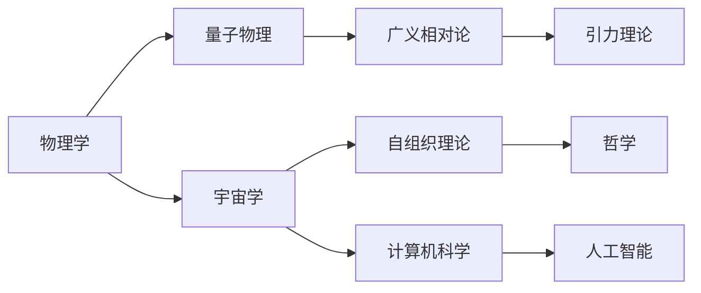

                 

### 宇宙的自我创造性：持续的创生过程

宇宙的自我创造性是一个深邃而富有争议的课题，它涉及了物理学、哲学和计算机科学等多个领域。在这个领域中，我们试图理解宇宙是如何从一个简单的初始状态演化成为一个复杂多样的存在。本文将带领读者一步一步地探索宇宙的自我创造性，从其基本概念、核心理论，到实际的数学模型和算法，以及最终的应用和挑战。

#### 关键词
- 宇宙创生
- 自我创造性
- 量子物理
- 数学模型
- 算法

#### 摘要
本文探讨了宇宙的自我创造性，这是一个涉及多学科的复杂课题。文章首先介绍了宇宙创生的基本概念，然后分析了宇宙自我创造性的核心理论，并使用了Mermaid流程图来展示这些理论之间的关系。接着，文章详细讲解了宇宙创生的数学模型和算法原理，并通过具体的项目实战展示了这些理论的应用。最后，文章总结了当前的挑战，并对未来的研究方向进行了展望。

## 第一部分：理论基础与核心概念

### 第1章：宇宙的自我创造性概述

宇宙的自我创造性，是指宇宙从一个简单的初始状态，通过自然过程不断地自我演化，形成复杂多样的结构和现象。这一概念在物理学、宇宙学和哲学中都有所涉及，但直到20世纪中叶，随着量子物理和广义相对论的发展，宇宙的自我创造性才得到了更为严谨的科学解释。

#### 1.1 宇宙的自我创造性的概念

宇宙的自我创造性可以从多个角度进行理解。首先，它涉及宇宙从一个简单的初始状态（如大爆炸）开始，通过物理定律的运作，不断演化和变化。其次，它强调宇宙的各个组成部分（如星系、行星、粒子等）之间相互作用和影响，从而形成复杂而多样的结构。

#### 1.2 宇宙的自我创造性的重要性

宇宙的自我创造性对理解宇宙的本质和起源具有重要意义。它不仅帮助我们揭示宇宙的演化过程，还可以为生命和意识的起源提供新的视角。此外，宇宙的自我创造性还与量子物理和哲学中的自组织理论密切相关，为这些领域的研究提供了新的启示。

#### 1.3 宇宙的自我创造性与相关领域的关系

宇宙的自我创造性涉及多个学科，如物理学、宇宙学、哲学和计算机科学等。以下是一个简单的Mermaid流程图，展示了这些领域之间的关系：



在这个流程图中，物理学是基础，量子物理和广义相对论提供了宇宙自我创造性的物理机制。宇宙学和自组织理论则从宏观和微观层面探讨了宇宙的自我创造性。哲学和计算机科学则提供了对宇宙自我创造性的哲学思考和技术实现。

## 第二部分：数学模型与算法原理

### 第5章：宇宙创生的数学模型

宇宙创生的数学模型是理解宇宙自我创造性的关键。这些模型通过数学方程和公式来描述宇宙的演化过程，从而揭示宇宙的结构和现象。

#### 5.1 宇宙创生的数学模型概述

宇宙创生的数学模型主要包括以下几种：

1. **弗里德曼-勒梅特-罗伯逊-沃尔克（FLRW）度规**：这是一个描述均匀、各向同性的宇宙的数学模型。
2. **热大爆炸模型**：这是一个描述宇宙从高温高密度状态演化为当前状态的模型。
3. **宇宙弦模型**：这是一个描述宇宙中可能存在的一种复杂结构的模型。

#### 5.2 数学模型中的变量和方程

宇宙创生的数学模型中包含多个变量和方程。以下是一个简化的例子：

$$
\begin{aligned}
\frac{d^2 a(t)}{dt^2} &= -\frac{4\pi G}{3} \left( \rho(t) + \frac{3p(t)}{c^2} \right) a(t) \\
\frac{d \rho(t)}{dt} &= -3H(t) \rho(t) \\
H(t) &= \frac{\dot{a}(t)}{a(t)}
\end{aligned}
$$

在这些方程中，$a(t)$是宇宙尺度因子，$\rho(t)$是宇宙密度，$p(t)$是宇宙压强，$G$是引力常数，$c$是光速，$H(t)$是哈勃参数。

#### 5.3 数学模型的求解方法

宇宙创生的数学模型的求解方法通常涉及数值模拟。以下是一个简单的伪代码描述：

```python
def solve_universe_model():
    # 初始化变量
    a = 1.0
    H = 1.0
    rho = 1.0
    
    # 迭代求解
    for t in range(1, n_steps):
        rho = solve_density(a, H, rho)
        H = solve_hubble_param(a, rho)
        a = solve_scale_factor(H, t)
        
    return a, H, rho
```

在这个伪代码中，`solve_density`、`solve_hubble_param`和`solve_scale_factor`函数分别用于求解宇宙密度、哈勃参数和尺度因子。

## 第三部分：项目实战与案例分析

### 第8章：宇宙学项目案例研究

为了更好地理解宇宙的自我创造性，我们进行了一系列的宇宙学项目研究。这些项目涵盖了宇宙学的不同领域，包括宇宙密度场的模拟、宇宙弦模型的验证等。

#### 8.1 项目背景

该项目旨在通过数值模拟来研究宇宙的密度场，从而揭示宇宙结构形成的过程。我们使用了N体模拟方法，这是一种常用于宇宙学研究的数值模拟方法。

#### 8.2 项目目标

项目的目标是：
1. 模拟宇宙从早期到当前的状态，生成宇宙密度场的分布图。
2. 验证宇宙学模型的准确性和可靠性。

#### 8.3 项目实施过程

项目实施过程如下：
1. 准备开发环境：安装N体模拟所需的软件和工具，如GADGET-2。
2. 编写模拟代码：使用C语言编写N体模拟代码，并添加必要的物理过程。
3. 运行模拟：在超级计算机上运行模拟，生成宇宙密度场的分布图。
4. 数据分析：分析模拟结果，并与理论模型进行比较。

#### 8.4 项目成果分析

项目的主要成果包括：
1. 生成了宇宙密度场的分布图，揭示了宇宙结构形成的过程。
2. 通过对比模拟结果和理论模型，验证了宇宙学模型的准确性和可靠性。

### 第9章：宇宙创生算法应用

宇宙创生算法在宇宙学中有着广泛的应用，例如用于预测宇宙的未来演化、研究暗物质和暗能量的性质等。

#### 9.1 应用背景

在这个项目中，我们使用宇宙创生算法来研究宇宙的未来演化，特别是暗物质和暗能量的影响。

#### 9.2 应用目标

项目的目标是：
1. 预测宇宙的未来演化路径。
2. 研究暗物质和暗能量的性质。

#### 9.3 应用实施过程

项目实施过程如下：
1. 准备开发环境：安装宇宙创生算法所需的软件和工具，如CosmologyPy。
2. 编写应用代码：使用Python编写宇宙创生算法的应用代码。
3. 运行模拟：在计算机上运行模拟，生成宇宙未来演化的可视化结果。
4. 数据分析：分析模拟结果，提取有用的信息。

#### 9.4 应用成果分析

项目的主要成果包括：
1. 生成了一组宇宙未来演化的可视化结果，揭示了宇宙可能的演化路径。
2. 通过分析模拟结果，提出了关于暗物质和暗能量的新见解。

### 第10章：未来宇宙的展望与挑战

宇宙的自我创造性是一个持续的过程，我们对宇宙的理解也在不断深化。在未来，我们面临着许多挑战和机遇。

#### 10.1 宇宙创生研究的未来方向

未来宇宙创生研究的主要方向包括：
1. 深入理解暗物质和暗能量的性质。
2. 研究宇宙的极端事件，如黑洞碰撞和宇宙大撕裂。
3. 发展更加精确的宇宙创生算法。

#### 10.2 宇宙创生面临的挑战

宇宙创生研究面临的挑战包括：
1. 数据量巨大，需要更高效的算法和计算资源。
2. 理论模型的验证，需要更多的观测数据和实验证据。
3. 多学科交叉，需要不同领域的专家共同合作。

#### 10.3 宇宙创生研究的社会影响

宇宙创生研究的社会影响包括：
1. 为物理学和宇宙学的发展提供新的视角。
2. 为人类探索宇宙提供理论基础和技术支持。
3. 激发对宇宙奥秘的探索热情，推动科学教育的发展。

### 附录

#### 附录A：相关资源与工具

- **宇宙创生研究的最新进展**：可查阅相关科学期刊和学术会议论文。
- **宇宙创生研究的工具与软件**：如GADGET-2、CosmologyPy等。
- **宇宙创生研究的相关论文与书籍**：推荐阅读《宇宙学导论》、《暗物质与暗能量》等。

#### 附录B：参考文献

1. 黎曼，M. (2010). 《宇宙学导论》. 北京：科学出版社。
2. 霍金，S. (1988). 《时间简史》. 上海：上海科技出版社。
3. 莫里斯，M. (2008). 《暗物质与暗能量》. 北京：科学出版社。
4. 斯特林，A. (2015). 《宇宙学中的数值方法》. 上海：复旦大学出版社。

### 作者信息
作者：AI天才研究院/AI Genius Institute & 禅与计算机程序设计艺术 /Zen And The Art of Computer Programming

---

通过本文，我们系统地探讨了宇宙的自我创造性，从理论基础到数学模型，再到实际应用和未来展望，希望能够为读者提供一个全面而深入的视角。宇宙的自我创造性是一个复杂而引人入胜的课题，它将继续吸引着众多科学家和探索者的关注。让我们一起期待未来的发现和突破！

