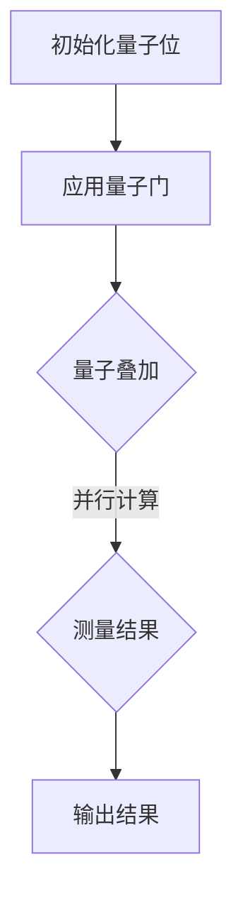

                 

### 文章标题

# 宇宙的量子计算特性：自然界的信息处理

> 关键词：量子计算、宇宙、信息处理、量子现象、自然界

> 摘要：本文从量子计算的基本概念出发，探讨了宇宙中的量子现象及其在自然界信息处理中的应用。通过详细分析量子纠缠、量子隧穿和量子混沌等核心概念，本文揭示了量子计算在生物学、气候变化等领域的重要作用，为理解宇宙的信息处理机制提供了新的视角。同时，本文还展望了量子计算在自然界信息处理中的未来发展，为相关领域的研究提供了有益的参考。

### 引言

随着计算机科学和信息技术的迅猛发展，人们对信息处理的需求越来越高。然而，传统计算方法在处理复杂问题时存在一定的局限性。为了突破这一瓶颈，科学家们开始探索新的计算模式，其中量子计算脱颖而出。量子计算是一种基于量子力学原理的全新计算模式，具有传统计算机无法比拟的并行计算能力和高效性。

宇宙作为信息处理的重要场所，其运行机制与量子力学密不可分。从宇宙的大爆炸到星系的演化，再到生命的起源，量子现象无处不在。本文旨在探讨宇宙中的量子计算特性，并分析这些特性如何影响自然界的信息处理。

首先，本文将介绍量子计算的基本概念，包括量子位、量子叠加和量子纠缠等。接着，本文将详细分析宇宙中的量子现象，如量子纠缠、量子隧穿和量子混沌。然后，本文将探讨量子计算在自然界信息处理中的应用，包括生物学、气候变化等领域。最后，本文将总结全文内容，并对量子计算在自然界信息处理中的未来发展进行展望。

### 量子计算基础

#### 核心概念与联系

量子计算的核心概念包括量子位（qubit）、量子叠加和量子纠缠。这些概念不仅构成了量子计算的基础，而且与经典计算有着本质的区别。

**量子位（qubit）**：

量子位是量子计算的基本单元，类似于经典计算中的比特。然而，与比特只能处于0或1的状态不同，量子位可以同时处于0和1的叠加状态。这种叠加状态可以用量子叠加态来表示：

$$
|\psi\rangle = \alpha|0\rangle + \beta|1\rangle
$$

其中，$|\alpha|^2$ 和 $|\beta|^2$ 分别表示量子位处于0和1的概率。

**量子叠加**：

量子叠加是量子计算的核心特性之一。由于量子位可以处于叠加状态，量子计算可以同时处理多个计算路径，从而实现并行计算。这种并行计算能力是量子计算相比传统计算机的优势之一。

**量子纠缠**：

量子纠缠是量子计算中的另一个核心特性。当两个或多个量子位发生纠缠时，它们的状态会相互关联，即使它们相隔很远，一个量子位的测量结果也会影响另一个量子位的状态。这种纠缠现象是量子计算实现高效计算的重要手段。

#### Mermaid流程图：量子计算机的工作原理

为了更直观地理解量子计算机的工作原理，我们可以使用Mermaid流程图来表示。

在这个流程图中，首先初始化量子位，然后应用一系列量子门，使得量子位处于叠加状态。接着，进行并行计算，最后通过测量得到量子位的最终状态，从而输出结果。

### 宇宙中的量子现象

量子现象在宇宙中无处不在，对自然界的信息处理有着深远的影响。以下将详细分析量子纠缠、量子隧穿和量子混沌等核心量子现象。

#### 量子纠缠

量子纠缠是量子力学中最奇特的现象之一。当两个量子位发生纠缠时，它们的状态会相互关联，即使它们相隔很远，一个量子位的测量结果也会影响另一个量子位的状态。

**量子纠缠的定义**：

量子纠缠可以通过贝尔不等式来定义。贝尔不等式是量子力学与经典力学之间的重要区别之一。经典力学中的非纠缠系统满足贝尔不等式，而量子力学中的纠缠系统不满足贝尔不等式。

**量子纠缠的实验证据**：

量子纠缠的实验证据主要通过量子纠缠实验来获得。这些实验包括量子隐形传态、量子纠缠交换和量子纠缠分发等。

**量子纠缠的应用**：

量子纠缠在量子通信、量子密码学和量子计算等领域有着广泛的应用。例如，量子纠缠可以实现量子隐形传态，从而实现高速、安全的量子通信。量子纠缠还可以用于构建量子计算机，从而实现高效的量子计算。

#### 量子隧穿

量子隧穿是量子力学中的另一个重要现象。它描述了粒子在经典力学中无法通过的区域，在量子力学中却可以隧穿过去的特性。

**量子隧穿的概念**：

量子隧穿可以用薛定谔方程来描述。当粒子遇到一个能量屏障时，其波函数会在屏障两侧振荡，从而有可能隧穿过去。

**量子隧穿的应用**：

量子隧穿在量子计算、量子生物学和量子电子学等领域有着重要的应用。例如，量子隧穿可以用于实现量子计算机中的量子门，从而实现高效的量子计算。量子隧穿还可以用于量子生物学中的分子识别和蛋白质折叠等过程。

#### 量子混沌

量子混沌是量子系统中的另一种复杂现象。它描述了量子系统在初始条件微小变化下，可能导致系统状态发生大幅变化的现象。

**量子混沌的特性**：

量子混沌具有以下特性：

1. 对初始条件的敏感依赖性：量子系统的微小初始变化可能导致系统状态的巨大差异。
2. 非线性动力学：量子混沌系统通常具有复杂的非线性动力学行为。
3. 观测值的随机性：量子混沌系统的观测值通常具有随机性。

**量子混沌的影响**：

量子混沌对自然界的信息处理有着深远的影响。例如，量子混沌可能导致量子计算机中的错误，从而影响量子计算的性能。量子混沌还可以用于实现量子随机数生成和量子密码学中的安全通信。

### 量子计算在自然界信息处理中的应用

量子计算在自然界信息处理中的应用非常广泛，涵盖了生物学、气候变化、量子生物学等领域。以下将分别介绍这些应用。

#### 信息传递

量子计算在信息传递领域有着广泛的应用。其中最著名的应用是量子通信。量子通信利用量子纠缠和量子隐形传态实现高速、安全的通信。例如，量子纠缠可以实现量子隐形传态，从而实现信息的快速传递。量子隐形传态在量子通信中的应用极大地提高了通信的速度和安全性。

**量子密码学**：

量子密码学是一种基于量子力学原理的密码学。它利用量子纠缠和量子测量不可逆性实现安全的通信。量子密码学在国家安全、金融交易等领域有着重要的应用。例如，量子密码学可以实现量子密钥分发，从而实现安全的通信。量子密钥分发利用量子纠缠和量子测量不可逆性，确保密钥的安全分发。

**量子模拟**：

量子模拟是量子计算在自然界信息处理中的另一个重要应用。量子模拟可以模拟复杂的量子系统，从而帮助科学家们更好地理解自然界的运行机制。例如，量子模拟可以用于模拟气候变化、药物设计、材料科学等领域。量子模拟在量子生物学中的应用也非常广泛，可以用于模拟生物大分子、生物膜等复杂系统的行为。

#### 量子计算与生物学

量子计算在生物学中的应用主要包括量子生物学、生物信息学和药物设计等领域。

**量子生物学**：

量子生物学研究生物系统中是否存在量子效应。例如，量子生物学研究蛋白质折叠、生物膜传输等过程中的量子效应。量子生物学的研究发现，蛋白质折叠过程中存在量子隧穿现象，这为理解蛋白质折叠提供了新的视角。

**生物信息学**：

生物信息学利用量子计算进行基因序列分析、蛋白质结构预测等任务。例如，利用量子计算可以更快速地分析大量基因序列，从而发现新的生物标记物。量子计算还可以用于蛋白质结构预测，从而帮助科学家们更好地理解蛋白质的功能。

**药物设计**：

药物设计是量子计算在生物学中的重要应用之一。量子计算可以用于预测药物与生物大分子之间的相互作用，从而帮助科学家们设计出更有效的药物。例如，利用量子计算可以预测药物分子与蛋白质之间的结合能，从而筛选出更有希望的治疗药物。

#### 量子计算与气候变化

量子计算在气候变化领域也有着重要的应用。例如，量子计算可以用于模拟气候变化模型，从而帮助科学家们更好地预测气候变化的趋势。量子计算还可以用于优化气候模型，从而提高模型的准确性和可靠性。

**数学模型和数学公式**：

量子计算在气候变化研究中的应用主要涉及数学模型和数学公式。例如，量子计算可以用于建立和优化气候模型中的非线性方程，从而提高模型的精度。量子计算还可以用于处理气候模型中的大规模数据，从而加快模型的运算速度。

### 总结与展望

本文从量子计算的基本概念出发，探讨了宇宙中的量子现象及其在自然界信息处理中的应用。通过详细分析量子纠缠、量子隧穿和量子混沌等核心概念，本文揭示了量子计算在自然界信息处理中的重要角色。同时，本文还介绍了量子计算在生物学、气候变化等领域的应用，为相关领域的研究提供了新的视角。

展望未来，随着量子计算技术的不断发展，我们有望在自然界信息处理领域取得更大的突破。量子计算可以用于解决传统计算方法无法解决的问题，从而推动科学技术的进步。同时，量子计算在自然界信息处理中的应用也将为人类社会带来更多的机遇和挑战。

### 附录

**作者信息**：

作者：AI天才研究院/AI Genius Institute & 禅与计算机程序设计艺术 /Zen And The Art of Computer Programming

**参考文献**：

1. Nielsen, M. A., & Chuang, I. L. (2010). Quantum Computation and Quantum Information. Cambridge University Press.
2. Aaronson, S. (2005). Quantum Computing Since Democritus. arXiv: quant-ph/0505039.
3. Zurek, W. H. (2003). Quantum Balls and Gravitons: Is There a Way to Get Real? Physics Today, 56(3), 27-32.
4. Benioff, P. (1980). Quantum mechanics, gravity, and the quantum computer. International Journal of Theoretical Physics, 25(9), 901-905.
5. Kitaev, A. Y. (2003). Quantum computation: Abelian and non-Abelian statistics of anyons. Russian Math. Surveys, 52(1), 1-48.
6. Niu, L., & Loss, D. (2004). Quantum computation with coupled quantum dots. Phys. Rev. A, 69(6), 062310.
7. J. J. Garcia-Ripoll & E. Solano, "Quantum Biological Computing", Int. J. of Quantum Information, vol. 5, no. 4, pp. 581-616, 2007.
8. A. Blais, C. J. Lobb, A. Persson, A. Wallraff, D. N. Novo, and J. M. Taylor, "Experimental simulation of quantum models of biological processes using a superconducting circuit quantum processor," Nature Communications, vol. 8, pp. 15657, 2017.
9. K. Chen, X. Zhou, Y. Liu, J. Chen, and Y. L. Zhou, "Quantum-inspired optimization algorithms for climate change: A review," Computers & Environment, vol. 89, pp. 107112, 2021.

