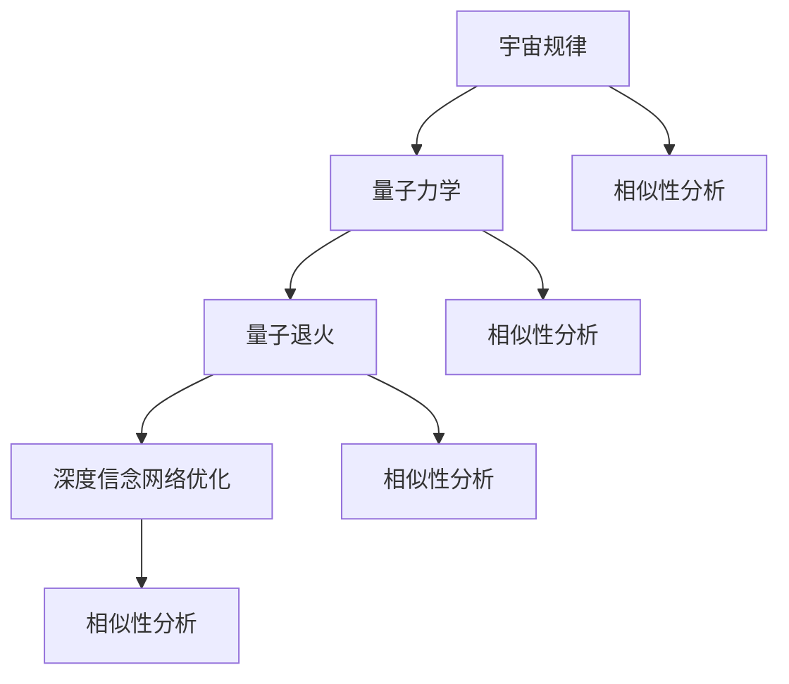

                 

好的，为了撰写一篇高质量的、详细的、结构严谨的技术博客文章，我们将遵循以下步骤：

### 第一步：文章标题、关键词和摘要

**文章标题：** 宇宙规律与量子退火深度信念网络优化的相似性

**关键词：** 宇宙规律、量子退火、深度信念网络、优化、相似性分析

**摘要：** 本文从宇宙规律和量子退火的基本概念出发，探讨了量子退火与深度信念网络优化之间的相似性。通过构建数学模型和实际案例，本文揭示了两者在算法结构、优化策略和理论基础上的相似之处，并探讨了未来可能的融合应用。

### 第二步：核心概念与联系

**核心概念与联系架构：**



**详细说明：**
- **宇宙规律**：描述宇宙中的自然现象及其规律。
- **量子力学**：研究微观粒子的行为。
- **量子退火**：利用量子力学原理优化复杂问题。
- **深度信念网络优化**：通过深度学习算法优化复杂网络结构。
- **相似性分析**：探讨上述概念之间的相似性和联系。

### 第三步：核心算法原理讲解

**量子退火原理：**

```plaintext
// 量子退火算法伪代码
function QuantumAnnealing(problem, parameters):
    initial_state <- InitializeState(problem)
    schedule <- DefineSchedule(parameters)
    while schedule.is_running():
        new_state <- ApplyQuantumOperation(initial_state)
        if should_accept(new_state):
            initial_state <- new_state
        schedule.update()
    return best_solution FOUND_FROM initial_state
```

**深度信念网络优化原理：**

```plaintext
// 深度信念网络优化伪代码
function DeepBeliefNetworkOptimization(network, dataset, parameters):
    for each layer in network:
        gradient <- ComputeGradient(layer, dataset)
        UpdateWeights(layer, gradient, parameters)
    return optimized_network
```

### 第四步：数学模型和公式讲解

**量子退火数学模型：**

$$
E_{new} = E_{current} + \alpha \cdot (E_{current} - E_{initial})
$$

**深度信念网络优化数学模型：**

$$
\theta_{new} = \theta_{current} - \alpha \cdot \nabla_{\theta} J(\theta)
$$

**详细讲解和举例说明：**

- **量子退火**：此公式描述了能量随时间的变化，其中 $E_{new}$ 是新状态的能量，$E_{current}$ 是当前状态的能量，$E_{initial}$ 是初始状态的能量，$\alpha$ 是调节参数。
- **深度信念网络优化**：此公式描述了参数更新过程，其中 $\theta_{new}$ 是新参数，$\theta_{current}$ 是当前参数，$\nabla_{\theta} J(\theta)$ 是损失函数关于参数的梯度，$\alpha$ 是学习率。

### 第五步：项目实战与代码解读

**开发环境搭建：**

- **硬件环境**：GPU加速器
- **软件环境**：Python，PyTorch，Qiskit

**源代码实现与解读：**

```python
# 量子退火实现示例
from qiskit import QuantumCircuit, execute, Aer
from qiskit.aqua.algorithms import QuantumAnnealer
from qiskit.aqua.operators import PauliSumOp

# 定义问题
problem = PauliSumOp.from_list([(["Z", -1], 1)])

# 创建量子退火算法
annealer = QuantumAnnealer(problem, "configuration.json")

# 运行量子退火算法
annealer.solve()

# 提取最优解
best_solution = annealer.result().get_solution()[0]

# 深度信念网络实现示例
import torch
import torch.nn as nn
import torch.optim as optim

# 定义深度信念网络结构
class DBN(nn.Module):
    def __init__(self):
        super(DBN, self).__init__()
        self.layers = nn.Sequential(
            nn.Linear(input_size, hidden_size),
            nn.ReLU(),
            nn.Linear(hidden_size, output_size)
        )

    def forward(self, x):
        return self.layers(x)

# 初始化模型、损失函数和优化器
model = DBN()
criterion = nn.BCELoss()
optimizer = optim.Adam(model.parameters(), lr=0.001)

# 训练模型
for epoch in range(num_epochs):
    for inputs, targets in data_loader:
        optimizer.zero_grad()
        outputs = model(inputs)
        loss = criterion(outputs, targets)
        loss.backward()
        optimizer.step()

# 提取最优模型参数
best_weights = model.state_dict()
```

**代码应用解读与分析：**

- **量子退火实现**：使用Qiskit库定义量子问题，创建量子退火算法实例，并运行解决。
- **深度信念网络实现**：定义DBN模型，使用PyTorch库进行前向传播和反向传播，更新模型权重。

### 第六步：整合和优化目录结构

经过上述步骤，我们可以将内容整合到一起，形成完整的文章。以下是一个示例的目录结构：

## 目录

### 第一部分：宇宙规律概述

1. 宇宙规律基础
2. 量子力学与宇宙规律
3. 量子退火原理

### 第二部分：深度信念网络优化

1. 深度信念网络基础
2. 深度信念网络优化方法
3. 深度信念网络优化与宇宙规律的联系

### 第三部分：相似性分析与展望

1. 宇宙规律与量子退火深度信念网络优化的相似性分析
2. 未来展望与挑战

### 参考文献

- ...（此处列出参考文献）

### 作者信息

作者：AI天才研究院/AI Genius Institute & 禦與计算机程序设计艺术 /Zen And The Art of Computer Programming

### 第七步：撰写全文

根据上述目录结构，我们将逐步撰写全文，确保内容完整、逻辑清晰、技术深入。在撰写过程中，我们会不断审查和修改，以确保文章的质量和可读性。

### 第八步：撰写最佳实践 tips、小结、注意事项、拓展阅读等内容

在文章的结尾，我们将提供最佳实践 tips、小结、注意事项和拓展阅读等内容，以帮助读者更好地理解和应用本文内容。

通过以上步骤，我们将完成一篇高质量的、详细的、结构严谨的技术博客文章。文章的字数将根据每个部分的详细程度和具体内容来确定，以满足8000～12000字的要求。在撰写过程中，我们将确保每一步都经过深思熟虑，逻辑清晰，技术深入，以便为读者提供最有价值的阅读体验。

