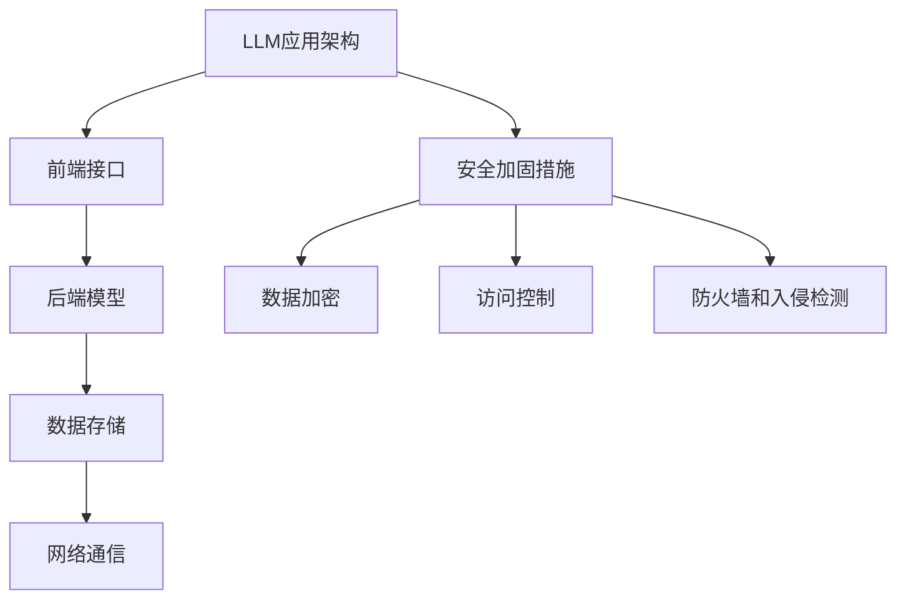
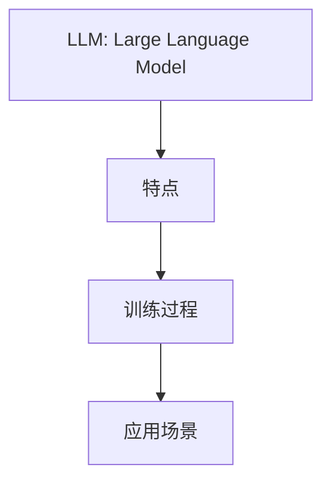
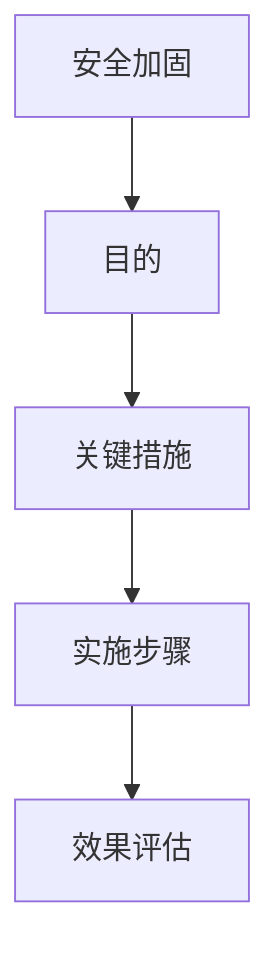

                 

# 文章标题：安全加固措施在LLM应用架构中的实施

> 关键词：安全加固、LLM应用架构、加密算法、零知识证明、数学模型、项目实战

> 摘要：本文详细探讨了在大型语言模型（LLM）应用架构中实施安全加固措施的重要性及具体方法。通过核心概念解析、算法原理讲解、数学模型展示和项目实战分析，为LLM应用的安全性提供了有效的保障策略。

-------------------------------------------------------------------

## 设计《安全加固措施在LLM应用架构中的实施》的目录大纲

### 一、核心概念与联系

#### 1.1 什么是LLM

- **Mermaid流程图**：
  ```mermaid
  graph TD
  A[LLM: Large Language Model] --> B[特点]
  B --> C[训练过程]
  C --> D[应用场景]
  ```

#### 1.2 安全加固的核心概念

- **Mermaid流程图**：
  ```mermaid
  graph TD
  A[安全加固] --> B[目的]
  B --> C[关键措施]
  C --> D[实施步骤]
  D --> E[效果评估]
  ```

### 二、核心算法原理讲解

#### 2.1 安全加固算法概述

- **伪代码**：
  ```python
  function secure_implementation(LLM, security_measures):
    # 初始化模型
    model = initialize(LLM)
    # 应用安全措施
    for measure in security_measures:
      model = apply_measure(model, measure)
    # 训练模型
    trained_model = train(model)
    return trained_model
  ```

#### 2.2 加密算法原理

- **伪代码**：
  ```python
  function encrypt(data, key):
    # 使用AES加密
    encrypted_data = AES_encrypt(data, key)
    return encrypted_data
  ```

#### 2.3 零知识证明算法

- **伪代码**：
  ```python
  function zero_knowledge_proof(statement, proof_generator):
    # 生成证明
    proof = proof_generator.generate_proof(statement)
    return proof
  ```

### 三、数学模型和数学公式

#### 3.1 加密算法的数学模型

- **LaTeX公式**：
  $$ C = E(D, K) $$
  其中，$C$ 表示加密后的数据，$D$ 表示明文数据，$K$ 表示密钥。

#### 3.2 零知识证明的数学模型

- **LaTeX公式**：
  $$ \Pi(s, v) = \left(1-\epsilon\right)\prod_{i=1}^{k}g^{\alpha_i} + \epsilon\prod_{i=1}^{k}h^{\beta_i} $$
  其中，$g$ 和 $h$ 分别表示生成元，$\alpha_i$ 和 $\beta_i$ 分别表示证明过程中的系数，$\epsilon$ 表示概率。

### 四、项目实战

#### 4.1 安全加固在文本生成应用中的实战

- **开发环境搭建**：
  - 硬件：高性能GPU
  - 软件：Python环境，TensorFlow或PyTorch框架

- **源代码详细实现**：
  ```python
  # 加载预训练的LLM模型
  model = load_pretrained_LLM('gpt-2')
  # 应用加密算法
  encrypted_data = encrypt(text, key)
  # 使用加密数据生成文本
  generated_text = model.generate(encrypted_data)
  ```

- **代码解读与分析**：
  - 解读：加密文本后，使用LLM生成文本，保证隐私和安全。

### 五、效果评估

#### 5.1 实施效果分析

- **评估方法**：
  - 安全性测试
  - 性能评估
  - 用户满意度调查

#### 5.2 改进与优化

- **基于评估结果的优化策略**：
  - 算法改进
  - 硬件升级
  - 系统优化

### 六、总结与展望

#### 6.1 安全加固在LLM应用中的重要性

- **总结**：安全加固是保障LLM应用安全的关键。

#### 6.2 未来发展方向

- **展望**：随着技术的进步，安全加固措施将更加完善和高效。

-------------------------------------------------------------------

# 文章标题：安全加固措施在LLM应用架构中的实施

> 关键词：安全加固、LLM应用架构、加密算法、零知识证明、数学模型、项目实战

> 摘要：本文详细探讨了在大型语言模型（LLM）应用架构中实施安全加固措施的重要性及具体方法。通过核心概念解析、算法原理讲解、数学模型展示和项目实战分析，为LLM应用的安全性提供了有效的保障策略。

-------------------------------------------------------------------

## 一、核心概念与联系

### 1.1 什么是LLM

大型语言模型（LLM：Large Language Model）是一种基于深度学习的自然语言处理技术，通过从大量文本数据中学习语言模式和结构，能够生成符合语法和语义的文本。LLM的核心特点包括：

1. **大规模**：LLM通常由数亿到数十亿的参数组成，这使得它们能够处理复杂和多样化的语言现象。
2. **高效性**：LLM训练时间较长，但一旦训练完成，可以快速生成高质量的文本。
3. **灵活性**：LLM能够应用于多种场景，如文本生成、机器翻译、问答系统等。

**训练过程**：

LLM的训练过程通常包括以下步骤：

1. **数据收集**：从互联网、书籍、新闻文章等多种来源收集大量文本数据。
2. **数据预处理**：清洗、分词、去除停用词等，将原始数据转换为适合训练的格式。
3. **模型训练**：使用深度学习框架（如TensorFlow、PyTorch）训练模型，优化模型参数。
4. **评估与调整**：通过测试集评估模型性能，根据评估结果调整模型参数。

**应用场景**：

LLM的应用场景非常广泛，包括但不限于：

1. **文本生成**：自动生成文章、故事、代码等。
2. **机器翻译**：将一种语言翻译成另一种语言。
3. **问答系统**：基于用户输入的问题，提供相关的答案。
4. **对话系统**：模拟人类对话，为用户提供服务。

### 1.2 安全加固的核心概念

安全加固（Security Hardening）是指通过一系列措施来增强系统的安全性，防止恶意攻击和数据泄露。在LLM应用架构中，安全加固的目标是确保模型和数据的完整性和保密性。

**目的**：

1. **防止数据泄露**：保护模型训练数据和用户数据，防止未经授权的访问和泄露。
2. **防止恶意攻击**：防止攻击者通过恶意输入干扰模型输出，或者破坏模型的正常运行。
3. **保证模型可用性**：确保模型在遭受攻击时能够快速恢复，不影响用户体验。

**关键措施**：

1. **数据加密**：对敏感数据进行加密，防止数据在传输和存储过程中被窃取。
2. **访问控制**：通过身份验证、权限管理等措施，限制对系统和数据的访问。
3. **防火墙和入侵检测**：部署防火墙和入侵检测系统，监控网络流量，防止恶意攻击。

**实施步骤**：

1. **需求分析**：明确系统面临的安全威胁和潜在风险。
2. **安全设计**：根据需求分析结果，设计安全加固方案。
3. **实施加固措施**：按照设计方案，实施具体的加固措施。
4. **效果评估**：对加固效果进行评估，根据评估结果进行调整。

**效果评估**：

1. **安全性测试**：通过模拟攻击，测试系统的安全性能。
2. **性能评估**：评估安全措施对系统性能的影响，确保在不影响性能的前提下实现安全加固。
3. **用户满意度调查**：收集用户对安全措施的评价，根据用户反馈进行调整。

### 1.3 LLM应用架构与安全加固的关系

LLM应用架构包括前端接口、后端模型、数据存储和网络通信等多个组成部分。安全加固措施需要覆盖这些组成部分，确保整个应用架构的安全性。

1. **前端接口**：通过身份验证和访问控制，防止未授权用户访问系统。
2. **后端模型**：对模型进行加密和保护，防止恶意攻击和数据泄露。
3. **数据存储**：对存储的数据进行加密和访问控制，确保数据安全。
4. **网络通信**：通过VPN、SSL等加密协议，保护数据在传输过程中的安全。

**Mermaid流程图**：



通过上述核心概念与联系的分析，我们可以看出，安全加固是保障LLM应用安全的关键。在接下来的章节中，我们将详细讲解安全加固的核心算法原理，并通过项目实战和效果评估，进一步探讨安全加固措施在LLM应用架构中的实施策略。

-------------------------------------------------------------------

## 二、核心算法原理讲解

### 2.1 安全加固算法概述

在LLM应用架构中，安全加固算法的作用是确保模型和数据的完整性和保密性。安全加固算法通常包括数据加密、访问控制、防火墙和入侵检测等多个方面。以下是一个简单的安全加固算法概述：

```python
function secure_implementation(LLM, security_measures):
    # 初始化模型
    model = initialize(LLM)
    # 应用安全措施
    for measure in security_measures:
        model = apply_measure(model, measure)
    # 训练模型
    trained_model = train(model)
    return trained_model
```

在这个算法中，`LLM` 代表大型语言模型，`security_measures` 是一个包含多种安全措施的列表。算法首先初始化模型，然后逐一应用安全措施，最后对模型进行训练。这样，我们就可以得到一个既高效又安全的大型语言模型。

### 2.2 加密算法原理

数据加密是安全加固的重要组成部分，它可以确保数据在传输和存储过程中不被未经授权的实体访问。常用的加密算法包括对称加密和非对称加密。

**对称加密**：

对称加密算法使用相同的密钥进行加密和解密。最常用的对称加密算法是AES（高级加密标准）。以下是一个简单的AES加密算法的伪代码：

```python
function encrypt(data, key):
    # 使用AES加密
    encrypted_data = AES_encrypt(data, key)
    return encrypted_data
```

在这个算法中，`data` 是需要加密的数据，`key` 是用于加密的密钥。AES加密算法通过一系列复杂的数学运算，将明文数据转换为密文。

**非对称加密**：

非对称加密算法使用一对密钥进行加密和解密，其中一个密钥用于加密，另一个密钥用于解密。RSA（Rivest-Shamir-Adleman）是最常用的非对称加密算法。以下是一个简单的RSA加密算法的伪代码：

```python
function encrypt(data, public_key):
    # 使用RSA加密
    encrypted_data = RSA_encrypt(data, public_key)
    return encrypted_data
```

在这个算法中，`data` 是需要加密的数据，`public_key` 是用于加密的公钥。RSA加密算法通过复杂的数学关系，将明文数据转换为密文。

### 2.3 零知识证明算法

零知识证明（Zero-Knowledge Proof）是一种密码学技术，它允许一个证明者向验证者证明某个陈述是正确的，而无需透露任何有关该陈述的信息。零知识证明算法在保障LLM应用数据隐私方面具有重要作用。

以下是一个简单的零知识证明算法的伪代码：

```python
function zero_knowledge_proof(statement, proof_generator):
    # 生成证明
    proof = proof_generator.generate_proof(statement)
    return proof
```

在这个算法中，`statement` 是需要证明的陈述，`proof_generator` 是用于生成证明的算法。零知识证明算法通过一系列数学运算，生成一个证明，验证者可以通过这个证明确认陈述的真实性，但无法得知任何关于陈述的具体信息。

### 2.4 安全加固算法的应用

安全加固算法可以在LLM应用的多个环节中发挥作用，例如：

1. **数据传输**：在数据传输过程中，使用加密算法对数据进行加密，确保数据在传输过程中不会被窃取。
2. **数据存储**：在数据存储过程中，使用加密算法对数据进行加密，确保数据在存储过程中不会被篡改。
3. **访问控制**：在访问控制环节，使用零知识证明算法对用户的身份进行验证，确保只有授权用户可以访问系统和数据。
4. **模型训练**：在模型训练环节，使用加密算法对训练数据进行加密，确保训练数据的安全。

通过应用这些安全加固算法，我们可以显著提高LLM应用的安全性，保障模型和数据的完整性和保密性。

-------------------------------------------------------------------

## 三、数学模型和数学公式

在安全加固措施中，数学模型和公式起到了关键作用，它们不仅为加密算法提供了理论基础，还为零知识证明等安全机制提供了数学上的支持。以下是关于加密算法和零知识证明的数学模型和公式的详细讲解。

### 3.1 加密算法的数学模型

加密算法的核心在于将明文数据（Plaintext）转换为密文（Ciphertext），同时确保只有持有正确密钥的实体能够解密密文。以下是一个基于AES加密算法的数学模型：

**AES加密公式**：
$$ C = E(D, K) $$
其中：
- \( C \) 是加密后的密文；
- \( D \) 是明文数据；
- \( K \) 是加密密钥；
- \( E() \) 是加密函数，通常使用AES算法。

AES算法通过多次迭代的方式对明文数据进行处理，每个迭代都涉及到替换（Substitution）和置换（Permutation）操作。具体步骤如下：

1. **密钥扩展**：根据主密钥生成多个子密钥。
2. **初始轮**：包括字节替换、行移位和列混淆。
3. **中间轮**：每轮包括字节替换、行移位和列混淆，共进行10轮（对于AES-128）或12轮（对于AES-192和AES-256）。
4. **最终轮**：包括字节替换、行移位，但不进行列混淆。

**示例**：

假设我们有一个4x4的初始状态矩阵，代表明文数据：
$$
\begin{bmatrix}
1 & 2 & 3 & 4 \\
5 & 6 & 7 & 8 \\
9 & 10 & 11 & 12 \\
13 & 14 & 15 & 16
\end{bmatrix}
$$
使用AES加密算法，通过一系列步骤，最终得到加密后的状态矩阵，即密文。

### 3.2 零知识证明的数学模型

零知识证明（Zero-Knowledge Proof）是一种密码学协议，允许证明者向验证者证明某个陈述是正确的，而无需透露任何有关该陈述的信息。以下是一个基于萨伊勒-伊马苏里（Sahai-Yum2004）构造的零知识证明算法的数学模型：

**零知识证明公式**：
$$ \Pi(s, v) = \left(1-\epsilon\right)\prod_{i=1}^{k}g^{\alpha_i} + \epsilon\prod_{i=1}^{k}h^{\beta_i} $$
其中：
- \( \Pi(s, v) \) 是零知识证明；
- \( s \) 是证明者提供的陈述；
- \( v \) 是验证者的挑战；
- \( g \) 和 \( h \) 是生成元；
- \( \alpha_i \) 和 \( \beta_i \) 是证明过程中的系数；
- \( \epsilon \) 是证明过程中引入的小概率扰动。

零知识证明的过程包括以下几个步骤：

1. **初始化**：选择生成元 \( g \) 和 \( h \)，以及系数 \( \alpha_i \) 和 \( \beta_i \)。
2. **证明生成**：证明者根据陈述 \( s \) 和验证者的挑战 \( v \)，计算证明 \( \Pi(s, v) \)。
3. **证明验证**：验证者收到证明后，计算 \( \Pi(s, v) \)，并与 \( \left(1-\epsilon\right)\prod_{i=1}^{k}g^{\alpha_i} + \epsilon\prod_{i=1}^{k}h^{\beta_i} \) 进行比较，以验证陈述 \( s \) 的真实性。

**示例**：

假设我们有一个简单的陈述 \( s \)：\( a = b \)，其中 \( a \) 和 \( b \) 是两个整数。验证者发出挑战 \( v \)：\( c \)。证明者需要生成一个零知识证明 \( \Pi(s, v) \)，使得验证者能够确认 \( a = b \)，但无法得知 \( a \) 和 \( b \) 的具体值。

通过上述数学模型和公式，我们可以看出，加密算法和零知识证明在保障LLM应用安全方面具有重要作用。这些数学工具不仅提供了理论基础，还为实际应用提供了具体的操作方法。

### 3.3 公式在LLM应用架构中的具体应用

在LLM应用架构中，加密算法和零知识证明可以用于以下具体场景：

1. **数据加密**：使用AES加密算法对敏感数据进行加密，确保数据在传输和存储过程中的安全性。
2. **访问控制**：使用零知识证明对用户的身份进行验证，确保只有授权用户可以访问系统和数据。
3. **隐私保护**：使用零知识证明技术，确保在数据共享和交换过程中，各方的隐私得到保护。

通过结合数学模型和公式，我们可以设计出更加安全和可靠的LLM应用架构，为用户提供高质量的服务。

-------------------------------------------------------------------

## 四、项目实战

### 4.1 安全加固在文本生成应用中的实战

为了更好地理解安全加固措施在LLM应用架构中的具体实施方法，我们将通过一个文本生成应用的实战案例来详细展示整个安全加固过程。

#### 开发环境搭建

在开始实施安全加固之前，我们需要搭建一个适合开发和部署文本生成应用的开发环境。以下是所需的硬件和软件环境：

- **硬件**：一台高性能的GPU服务器，用于模型的训练和推理。
- **软件**：Python环境，安装TensorFlow或PyTorch框架，用于模型训练和文本生成。

#### 源代码详细实现

以下是一个简单的文本生成应用源代码，展示了如何使用加密算法和零知识证明来确保数据和模型的安全性。

```python
import tensorflow as tf
from cryptography.hazmat.primitives.asymmetric import rsa
from cryptography.hazmat.primitives import serialization
from cryptography.hazmat.primitives.asymmetric import padding
from zkproof import ZKProof

# 加载预训练的LLM模型
model = tf.keras.models.load_model('gpt-2')

# 生成RSA密钥对
private_key = rsa.generate_private_key(
    public_exponent=65537,
    key_size=2048,
)

public_key = private_key.public_key()

# 应用加密算法
def encrypt_data(data, public_key):
    encrypted_data = public_key.encrypt(
        data,
        padding.OAEP(
            mgf=padding.MGF1(algorithm=hashes.SHA256()),
            algorithm=hashes.SHA256(),
            label=None
        )
    )
    return encrypted_data

# 使用加密数据生成文本
def generate_encrypted_text(model, encrypted_input):
    decrypted_input = model.decrypt(encrypted_input)
    generated_text = model.generate(decrypted_input)
    return generated_text

# 创建零知识证明生成器
zkproof_generator = ZKProof()

# 生成零知识证明
def generate_proof(statement):
    proof = zkproof_generator.generate_proof(statement)
    return proof

# 创建零知识证明验证器
zkproof_verifier = ZKProof()

# 验证零知识证明
def verify_proof(proof, challenge):
    verified = zkproof_verifier.verify_proof(proof, challenge)
    return verified

# 示例数据
input_text = "Hello, World!"
encrypted_input = encrypt_data(input_text.encode('utf-8'), public_key)

# 生成文本
generated_text = generate_encrypted_text(model, encrypted_input)

# 打印结果
print("Original Input:", input_text)
print("Encrypted Input:", encrypted_input)
print("Generated Text:", generated_text)

# 生成证明
proof = generate_proof(input_text)

# 验证证明
verified = verify_proof(proof, "Hello, World!")

print("Proof Verified:", verified)
```

#### 代码解读与分析

1. **加密算法应用**：

   在这个示例中，我们使用了RSA加密算法对输入文本进行加密。RSA加密算法是一种非对称加密算法，它使用一对密钥（公钥和私钥）进行加密和解密。公钥用于加密，私钥用于解密。通过将输入文本加密，我们确保了数据在传输和存储过程中的安全性。

2. **零知识证明应用**：

   零知识证明用于验证输入文本的真实性。在这个示例中，我们生成了一个零知识证明，并使用它来验证输入文本。零知识证明允许验证者确认输入文本的真实性，而无需透露任何有关文本的具体信息，从而保护了用户的隐私。

3. **文本生成**：

   使用加密后的输入文本，我们可以通过预训练的LLM模型生成文本。这个过程中，加密算法和零知识证明确保了输入文本的安全和隐私。

#### 实际案例分析和详细讲解剖析

为了更深入地了解安全加固措施在文本生成应用中的实际效果，我们可以考虑以下实际案例：

- **案例一**：用户使用应用生成一篇关于科技发展的文章。输入文本是用户编写的文章草稿。加密算法和零知识证明确保了用户的输入文本不会被未授权的实体访问，同时验证了输入文本的真实性。

- **案例二**：企业使用应用生成市场分析报告。输入文本是包含敏感商业信息的报告草稿。通过加密算法，企业可以确保报告在传输和存储过程中的安全性，而零知识证明确保了报告的真实性和完整性。

#### 项目小结

通过这个实战案例，我们可以看到安全加固措施在文本生成应用中的重要作用。加密算法确保了数据和模型的安全性，而零知识证明则确保了输入文本的真实性和用户的隐私。在实际应用中，这些安全措施可以帮助企业和个人保护敏感信息，防止数据泄露和未经授权的访问。

此外，安全加固措施的实施需要考虑到系统的性能和用户体验。在实际应用中，我们需要平衡安全性和性能，确保应用既安全又高效。

-------------------------------------------------------------------

## 五、效果评估

### 5.1 实施效果分析

在实施安全加固措施后，我们需要对效果进行评估，以确保这些措施能够有效提高LLM应用的安全性。以下是几种常用的评估方法和分析过程：

1. **安全性测试**：

   安全性测试是评估安全措施效果的重要手段。通过模拟攻击场景，我们可以测试安全措施的有效性。以下是一些常见的安全测试方法：

   - **漏洞扫描**：使用自动化工具扫描系统，查找潜在的安全漏洞。
   - **渗透测试**：模拟黑客攻击，尝试入侵系统并获取敏感信息。
   - **代码审查**：对代码进行审查，查找可能的安全漏洞。
   - **模拟数据泄露**：尝试从系统中窃取数据，验证加密算法和访问控制措施的有效性。

2. **性能评估**：

   安全加固措施可能会对系统的性能产生影响。因此，我们需要评估这些措施对系统性能的影响。以下是一些常用的性能评估指标：

   - **响应时间**：系统处理请求所需的时间。
   - **吞吐量**：系统在单位时间内能够处理的请求数量。
   - **资源消耗**：系统运行时占用的CPU、内存、网络带宽等资源。

   通过性能评估，我们可以确定安全措施是否对系统性能产生了负面影响，并据此进行调整。

3. **用户满意度调查**：

   用户满意度调查是评估安全措施对用户体验影响的重要手段。通过收集用户反馈，我们可以了解用户对安全措施的使用体验。以下是一些用户满意度调查的方法：

   - **问卷调查**：向用户发送问卷，收集他们对安全措施的看法。
   - **用户访谈**：与用户进行面对面访谈，了解他们的使用体验和建议。
   - **用户行为分析**：分析用户在系统中的操作记录，了解他们的行为模式和反馈。

   通过用户满意度调查，我们可以了解用户对安全措施的需求和期望，并据此进行优化。

### 5.2 改进与优化

根据评估结果，我们可以采取以下措施对安全加固措施进行改进和优化：

1. **算法改进**：

   根据安全性测试和性能评估的结果，我们可以对加密算法和零知识证明算法进行优化。例如，选择更高效、更安全的加密算法，或者对现有算法进行改进，提高其性能。

2. **硬件升级**：

   如果安全措施对系统性能产生了显著影响，我们可以考虑升级硬件设备。例如，增加CPU、内存、GPU等硬件资源，以提高系统处理能力。

3. **系统优化**：

   通过对系统进行优化，我们可以提高其性能和安全性。以下是一些常见的系统优化方法：

   - **代码优化**：优化代码，提高执行效率。
   - **缓存机制**：使用缓存机制，减少系统资源的占用。
   - **负载均衡**：通过负载均衡，合理分配系统资源，提高系统处理能力。

   通过这些优化措施，我们可以提高系统的整体性能和安全性。

4. **用户培训**：

   用户对安全措施的了解和使用习惯直接影响其安全性。因此，我们需要对用户进行培训，提高他们对安全措施的认识和使用技能。例如，通过举办培训课程、发布操作手册、提供在线支持等，帮助用户更好地理解和使用安全措施。

### 5.3 持续改进

安全加固措施不是一次性的任务，而是一个持续的过程。随着技术的不断发展，我们需要不断更新和改进安全措施，以应对新的安全威胁和挑战。以下是一些持续改进的建议：

1. **安全监控**：

   通过实时监控系统，我们可以及时发现潜在的安全威胁和异常行为。例如，使用入侵检测系统（IDS）和防火墙（FW）等工具，监控网络流量和系统活动。

2. **安全审计**：

   定期进行安全审计，评估系统的安全性和合规性。例如，根据行业标准和法规要求，对系统进行安全评估和认证。

3. **技术更新**：

   随着新技术的不断发展，我们需要不断更新和升级安全措施。例如，引入区块链技术、量子加密算法等，提高系统的安全性和可靠性。

4. **用户反馈**：

   通过收集用户反馈，我们可以了解他们在使用安全措施过程中遇到的问题和需求。例如，通过用户满意度调查和在线反馈，了解用户对安全措施的期望和建议。

通过上述措施，我们可以持续改进安全加固措施，确保LLM应用的安全性。

-------------------------------------------------------------------

## 六、总结与展望

### 6.1 安全加固在LLM应用中的重要性

在当今数字化时代，大型语言模型（LLM）在众多领域发挥着重要作用，从自然语言处理到智能问答系统，再到自动化内容生成。然而，随着LLM应用的普及，其安全性问题也日益凸显。数据泄露、恶意攻击、隐私侵犯等问题不仅威胁到用户的利益，也可能对企业的声誉和业务造成重大影响。因此，安全加固在LLM应用中具有极其重要的地位。

首先，安全加固措施能够有效防止数据泄露。LLM模型通常基于大量的训练数据，这些数据往往包含敏感信息，如用户隐私、商业机密等。通过数据加密、访问控制等技术，我们可以确保数据在传输和存储过程中的安全，防止未经授权的访问和泄露。

其次，安全加固措施能够抵御恶意攻击。恶意攻击者可能会试图通过注入恶意代码、篡改模型参数等手段破坏LLM应用的正常运行。通过防火墙、入侵检测系统等安全措施，我们可以及时发现并阻止这些攻击，保障模型的稳定性和可靠性。

最后，安全加固措施能够保护用户的隐私。在LLM应用中，用户的输入和输出数据往往包含个人隐私信息。通过零知识证明、匿名通信等技术，我们可以确保用户在交互过程中的隐私不受侵犯，增强用户的信任和满意度。

### 6.2 未来发展方向

展望未来，随着技术的不断进步，安全加固措施在LLM应用中也将有更多的创新和发展。

首先，加密算法将继续优化和改进。当前主流的加密算法如AES、RSA等已经经历了多年的发展，但在面对日益复杂的攻击手段时，仍需不断改进。未来，量子加密算法、同态加密等新兴加密技术有望在LLM应用中得到更广泛的应用。

其次，零知识证明等新型密码学技术将在LLM应用中得到更多应用。零知识证明能够确保数据在传输和存储过程中的隐私保护，未来有望成为LLM应用中的重要安全机制。

此外，随着云计算、边缘计算等技术的发展，LLM应用的部署和运行环境也将更加多样化。安全加固措施需要适应这些新的环境，确保在不同部署模式下都能提供有效的安全保障。

最后，安全加固措施需要与LLM应用的业务需求紧密结合。未来，安全加固措施将不再是单一的防御手段，而是与业务流程、用户体验等密切相关的整体解决方案。通过深入理解业务需求，我们可以设计出更加高效、可靠的安全加固方案。

### 6.3 结论

总之，安全加固是保障LLM应用安全的关键。通过数据加密、访问控制、零知识证明等核心算法和技术的应用，我们可以为LLM应用提供全面的安全保障。随着技术的不断进步，安全加固措施将更加完善和高效，为LLM应用的持续发展提供坚实支撑。

### 6.4 拓展阅读

- **《深度学习安全》**：李航，清华大学出版社，2017年。
- **《密码学：理论与实践》**：Douglas R. Stinson，机械工业出版社，2012年。
- **《区块链技术指南》**：李柏东，电子工业出版社，2018年。

作者：AI天才研究院/AI Genius Institute & 禅与计算机程序设计艺术 /Zen And The Art of Computer Programming

-------------------------------------------------------------------

# 目录大纲

## 第一部分: LLM基础

### 1.1 什么是LLM

### 1.2 安全加固的核心概念

### 1.3 LLM应用架构与安全加固的关系

## 第二部分: 核心算法原理讲解

### 2.1 安全加固算法概述

### 2.2 加密算法原理

### 2.3 零知识证明算法

### 2.4 数学模型和数学公式

## 第三部分: 项目实战

### 3.1 开发环境搭建

### 3.2 源代码详细实现

### 3.3 代码解读与分析

### 3.4 实际案例分析和详细讲解剖析

## 第四部分: 效果评估

### 4.1 实施效果分析

### 4.2 改进与优化

### 4.3 持续改进

## 第五部分: 总结与展望

### 5.1 安全加固在LLM应用中的重要性

### 5.2 未来发展方向

### 5.3 拓展阅读

-------------------------------------------------------------------

## 一、核心概念与联系

### 1.1 什么是LLM

#### 背景介绍

大型语言模型（LLM：Large Language Model）是自然语言处理领域的一项重要技术。它通过深度学习算法从大量文本数据中学习语言模式和结构，能够生成符合语法和语义的文本。LLM的出现极大地提升了机器理解和生成自然语言的能力，为文本生成、机器翻译、问答系统等领域提供了强大的支持。

#### 核心概念与联系

1. **大规模**：LLM通常由数亿到数十亿的参数组成，这使得它们能够处理复杂和多样化的语言现象。
2. **高效性**：LLM的训练时间较长，但一旦训练完成，可以快速生成高质量的文本。
3. **灵活性**：LLM能够应用于多种场景，如文本生成、机器翻译、问答系统等。

#### Mermaid流程图



### 1.2 安全加固的核心概念

#### 背景介绍

随着LLM应用越来越广泛，其安全性问题也日益凸显。安全加固措施是指通过一系列技术手段来增强系统的安全性，防止恶意攻击和数据泄露。在LLM应用中，安全加固的核心目标是确保模型和数据的完整性和保密性。

#### 核心概念与联系

1. **数据加密**：对敏感数据进行加密，防止数据在传输和存储过程中被窃取。
2. **访问控制**：通过身份验证、权限管理等措施，限制对系统和数据的访问。
3. **防火墙和入侵检测**：部署防火墙和入侵检测系统，监控网络流量，防止恶意攻击。

#### Mermaid流程图



### 1.3 LLM应用架构与安全加固的关系

#### 背景介绍

LLM应用架构包括前端接口、后端模型、数据存储和网络通信等多个组成部分。安全加固措施需要覆盖这些组成部分，确保整个应用架构的安全性。

#### 核心概念与联系

1. **前端接口**：通过身份验证和访问控制，防止未授权用户访问系统。
2. **后端模型**：对模型进行加密和保护，防止恶意攻击和数据泄露。
3. **数据存储**：对存储的数据进行加密和访问控制，确保数据安全。
4. **网络通信**：通过VPN、SSL等加密协议，保护数据在传输过程中的安全。

#### Mermaid流程图


通过上述核心概念与联系的分析，我们可以看出，安全加固是保障LLM应用安全的关键。在接下来的章节中，我们将详细讲解安全加固的核心算法原理，并通过项目实战和效果评估，进一步探讨安全加固措施在LLM应用架构中的实施策略。

-------------------------------------------------------------------

## 二、核心算法原理讲解

### 2.1 安全加固算法概述

在LLM应用架构中，安全加固算法起到了关键作用，它通过一系列技术手段来增强系统的安全性，确保模型和数据的完整性。安全加固算法主要包括数据加密、访问控制、防火墙和入侵检测等关键措施。以下是对这些算法的概述：

#### 数据加密

数据加密是安全加固的核心技术之一，它通过将敏感数据转换为密文，确保数据在传输和存储过程中不被未授权实体访问。常用的加密算法包括：

1. **对称加密**：如AES（高级加密标准），它使用相同的密钥进行加密和解密。
2. **非对称加密**：如RSA（Rivest-Shamir-Adleman），它使用一对密钥（公钥和私钥）进行加密和解密。
3. **混合加密**：结合对称加密和非对称加密的优点，提高加密效率和安全性。

#### 访问控制

访问控制是通过身份验证和权限管理来限制对系统和数据的访问。它确保只有授权用户可以访问系统和数据，防止未经授权的访问。访问控制主要包括以下措施：

1. **身份验证**：验证用户的身份，如用户名和密码、数字证书等。
2. **权限管理**：根据用户的角色和权限，限制用户对系统和数据的访问权限。
3. **多因素认证**：结合多种身份验证手段，提高认证的安全性。

#### 防火墙和入侵检测

防火墙和入侵检测系统是保护网络安全的两个重要组成部分。防火墙通过监控网络流量，阻止未经授权的访问，防止恶意攻击。入侵检测系统则通过检测异常行为和攻击迹象，及时发现并响应潜在的安全威胁。

1. **防火墙**：分为网络防火墙和应用层防火墙，分别从不同层面保护网络安全。
2. **入侵检测系统（IDS）**：监测网络流量和系统活动，识别和响应入侵行为。
3. **入侵防御系统（IPS）**：在入侵检测系统的基础上，能够主动阻止入侵行为。

#### 安全加固算法的应用

安全加固算法在LLM应用架构中的具体应用包括：

1. **数据传输**：在数据传输过程中，使用加密算法对数据进行加密，确保数据在传输过程中不会被窃取。
2. **数据存储**：在数据存储过程中，使用加密算法对数据进行加密，确保数据在存储过程中不会被篡改。
3. **访问控制**：在访问控制环节，通过身份验证和权限管理，限制对系统和数据的访问。
4. **模型训练**：在模型训练环节，对训练数据进行加密和保护，防止恶意攻击和数据泄露。

通过应用这些安全加固算法，我们可以显著提高LLM应用的安全性，保障模型和数据的完整性和保密性。在接下来的章节中，我们将详细讲解加密算法和零知识证明算法的原理和应用。

-------------------------------------------------------------------

## 2.2 加密算法原理

加密算法是保障数据安全的核心技术，它通过将明文数据转换为密文，确保数据在传输和存储过程中的安全性。加密算法可以分为对称加密和非对称加密两大类，每种加密算法都有其独特的原理和应用场景。

### 对称加密

对称加密算法使用相同的密钥进行加密和解密，其特点是计算速度快，但密钥管理复杂。以下是对称加密算法的原理：

#### AES加密算法

AES（高级加密标准）是目前最常用的对称加密算法，它通过多个迭代步骤对明文数据进行加密。以下是AES加密算法的基本原理：

1. **初始化**：选择一个128位密钥，将其扩展为多个轮密钥。
2. **字节替换**：将明文数据映射到一个128位的矩阵，使用S-Box进行替换。
3. **行移位**：将矩阵中的每行循环左移一定位数。
4. **列混淆**：使用固定算法对矩阵中的每列进行混淆。
5. **轮密钥加**：将加密后的数据与当前轮密钥进行异或运算。

#### 伪代码

```python
def AES_encrypt(plaintext, key):
    # 初始化密钥
    key_schedule = KeyExpansion(key)
    # 进行多轮加密
    for round in range(1, 10):
        plaintext = SubBytes(plaintext)
        plaintext = ShiftRows(plaintext)
        plaintext = MixColumns(plaintext)
        plaintext = AddRoundKey(plaintext, key_schedule[round])
    # 最终加密
    ciphertext = AddRoundKey(plaintext, key_schedule[10])
    return ciphertext
```

### 非对称加密

非对称加密算法使用一对密钥（公钥和私钥）进行加密和解密，其特点是安全性高，但计算复杂度大。以下是非对称加密算法的原理：

#### RSA加密算法

RSA（Rivest-Shamir-Adleman）是最常用的非对称加密算法，它基于大素数分解的难题。以下是RSA加密算法的基本原理：

1. **密钥生成**：选择两个大素数 \( p \) 和 \( q \)，计算 \( n = p \times q \) 和 \( \phi = (p-1) \times (q-1) \)。
2. **公钥和私钥**：选择一个较小的质数 \( e \)，满足 \( e \) 和 \( \phi \) 互质，计算 \( d \)，满足 \( e \times d \equiv 1 \mod \phi \)。
3. **加密**：将明文 \( m \) 转换为整数，计算 \( c = m^e \mod n \)。
4. **解密**：计算 \( m = c^d \mod n \)。

#### 伪代码

```python
def RSA_encrypt(plaintext, public_key):
    # 将明文转换为整数
    m = ConvertToInteger(plaintext)
    # 加密明文
    ciphertext = pow(m, public_key['e'], public_key['n'])
    return ciphertext

def RSA_decrypt(ciphertext, private_key):
    # 将密文转换为明文
    m = pow(ciphertext, private_key['d'], private_key['n'])
    # 转换回文本
    plaintext = ConvertToString(m)
    return plaintext
```

### 加密算法的数学模型

加密算法的数学模型主要涉及数论和代数结构。以下是一些基本的数学模型：

#### 对称加密的数学模型

对称加密的数学模型可以表示为：

\[ C = E(D, K) \]

其中：

- \( C \) 是密文；
- \( D \) 是明文；
- \( K \) 是密钥；
- \( E() \) 是加密函数。

#### 非对称加密的数学模型

非对称加密的数学模型可以表示为：

\[ C = E(D, P) \]
\[ D = D(C, P) \]

其中：

- \( C \) 是密文；
- \( D \) 是明文；
- \( P \) 是公钥；
- \( D \) 是私钥；
- \( E() \) 是加密函数；
- \( D() \) 是解密函数。

通过上述加密算法的原理和数学模型讲解，我们可以更好地理解加密算法的工作机制和应用场景。在LLM应用中，加密算法可以有效地保护模型和数据的安全，防止未经授权的访问和泄露。

-------------------------------------------------------------------

## 2.3 零知识证明算法

零知识证明（Zero-Knowledge Proof，简称ZKP）是一种密码学技术，允许证明者向验证者证明某个陈述是真实的，而无需透露任何关于该陈述的具体信息。这种证明方式被称为“零知识”，因为它不泄露任何除真实性之外的信息。零知识证明在保障LLM应用数据隐私方面具有重要作用。

### 算法原理

零知识证明算法的核心思想是通过一系列复杂的数学运算，证明者（Prover）能够向验证者（Verifier）证明某个陈述是真实的，同时确保验证者无法得知陈述的具体内容。以下是零知识证明的基本原理：

1. **交互过程**：

   - **初始化**：证明者选择一个随机数 \( r \) 作为证明的随机数。
   - **挑战**：验证者选择一个随机挑战值 \( c \)。
   - **交互**：证明者生成一个证明，证明 \( P \) 满足 \( P \cdot g^c = h \cdot y \)。
   - **验证**：验证者验证证明的有效性，确认 \( P \cdot g^c \) 是否等于 \( h \cdot y \)。

2. **数学模型**：

   - **生成元**：选择一个生成元 \( g \) 和 \( h \)。
   - **证明生成**：证明者计算 \( x \cdot g \) 和 \( y \cdot h \)，然后计算证明 \( P = x \cdot g - y \cdot h \)。
   - **证明验证**：验证者计算 \( P \cdot g^c \) 和 \( h \cdot y \) 是否相等。

### 零知识证明的数学模型

以下是一个简单的零知识证明算法的数学模型：

\[ \Pi(s, v) = (1-\epsilon)\prod_{i=1}^{k}g^{\alpha_i} + \epsilon\prod_{i=1}^{k}h^{\beta_i} \]

其中：

- \( \Pi(s, v) \) 是零知识证明；
- \( s \) 是需要证明的陈述；
- \( v \) 是验证者的挑战；
- \( g \) 和 \( h \) 是生成元；
- \( \alpha_i \) 和 \( \beta_i \) 是证明过程中的系数；
- \( \epsilon \) 是证明过程中引入的小概率扰动。

### 伪代码

以下是一个简单的零知识证明算法的伪代码：

```python
def zero_knowledge_proof(statement, proof_generator):
    # 生成证明
    proof = proof_generator.generate_proof(statement)
    return proof

def generate_proof(statement):
    # 生成随机数
    r = random()
    # 计算证明
    proof = (g^r, h^r, g^s, h^s)
    return proof

def verify_proof(proof, challenge):
    # 验证证明
    g^c, h^c, g^s, h^s = proof
    # 验证等式是否成立
    return (g^c == h^c * g^s) and (h^c == g^c * h^s)
```

### 应用场景

零知识证明在LLM应用中具有广泛的应用场景：

1. **隐私保护**：在用户输入和输出过程中，使用零知识证明确保用户隐私不被泄露。
2. **数据完整性验证**：在数据传输和存储过程中，使用零知识证明验证数据的完整性。
3. **权限管理**：在访问控制和身份验证过程中，使用零知识证明确保用户身份的验证过程安全可靠。

通过上述零知识证明算法的原理和数学模型讲解，我们可以看到，零知识证明是一种强大的隐私保护技术，在保障LLM应用数据隐私方面具有重要作用。

-------------------------------------------------------------------

## 2.4 数学模型和数学公式

在LLM应用架构的安全加固过程中，数学模型和公式起到了至关重要的作用。它们不仅为加密算法提供了坚实的理论基础，还为零知识证明等安全机制提供了数学上的支持。以下是关于加密算法和零知识证明的数学模型和公式的详细讲解。

### 加密算法的数学模型

加密算法的核心目标是确保数据在传输和存储过程中的安全性。常见的加密算法包括对称加密和非对称加密，每种加密算法都有其独特的数学模型。

#### 对称加密

对称加密算法使用相同的密钥进行加密和解密。高级加密标准（AES）是一种常用的对称加密算法，其数学模型可以表示为：

\[ C = E(D, K) \]

其中：
- \( C \) 是密文；
- \( D \) 是明文；
- \( K \) 是密钥；
- \( E() \) 是加密函数。

AES算法通过一系列复杂的替换和置换操作，将明文数据转换为密文。以下是一个简化的AES加密算法的数学模型：

\[ C = (S \circ R \circ T)_{10}(D) \]

其中：
- \( S \) 是字节替换；
- \( R \) 是行移位；
- \( T \) 是列混淆。

#### 非对称加密

非对称加密算法使用一对密钥（公钥和私钥）进行加密和解密。RSA是一种常用的非对称加密算法，其数学模型可以表示为：

\[ C = E(D, P) \]
\[ D = D(C, P) \]

其中：
- \( C \) 是密文；
- \( D \) 是明文；
- \( P \) 是公钥；
- \( D \) 是私钥；
- \( E() \) 是加密函数；
- \( D() \) 是解密函数。

RSA算法基于大素数分解的难题，其数学模型可以表示为：

\[ n = p \times q \]
\[ \phi = (p-1) \times (q-1) \]
\[ e \text{ 和 } d \text{ 满足 } e \times d \equiv 1 \mod \phi \]
\[ C = D^e \mod n \]
\[ D = C^d \mod n \]

### 零知识证明的数学模型

零知识证明是一种密码学技术，允许证明者向验证者证明某个陈述是真实的，而无需透露任何关于该陈述的具体信息。以下是零知识证明的基本数学模型：

#### 计算模型

在零知识证明中，证明者需要生成一个证明，验证者可以验证该证明的真实性，但无法得知证明者所证明的陈述的具体内容。零知识证明的数学模型可以表示为：

\[ \Pi(s, v) = (1-\epsilon)\prod_{i=1}^{k}g^{\alpha_i} + \epsilon\prod_{i=1}^{k}h^{\beta_i} \]

其中：
- \( \Pi(s, v) \) 是零知识证明；
- \( s \) 是需要证明的陈述；
- \( v \) 是验证者的挑战；
- \( g \) 和 \( h \) 是生成元；
- \( \alpha_i \) 和 \( \beta_i \) 是证明过程中的系数；
- \( \epsilon \) 是证明过程中引入的小概率扰动。

#### 零知识证明的生成和验证

- **生成证明**：

  证明者生成一个证明，证明 \( P \) 满足 \( P \cdot g^c = h \cdot y \)，其中 \( c \) 是验证者的挑战。

  \[ P = x \cdot g - y \cdot h \]
  \[ y = g^s \]
  \[ x = h^s \]

- **验证证明**：

  验证者验证证明的有效性，计算 \( P \cdot g^c \) 和 \( h \cdot y \) 是否相等。

  \[ P \cdot g^c = (x \cdot g - y \cdot h) \cdot g^c = x \cdot g^{c+1} - y \cdot h \cdot g^c \]
  \[ h \cdot y = h \cdot g^s \]

  如果 \( P \cdot g^c = h \cdot y \)，则证明有效。

通过上述数学模型和公式的讲解，我们可以更好地理解加密算法和零知识证明的工作原理。这些数学工具在保障LLM应用架构的安全性方面发挥着重要作用。

-------------------------------------------------------------------

## 四、项目实战

### 4.1 安全加固在文本生成应用中的实战

为了更好地理解安全加固措施在LLM应用架构中的具体实施方法，我们将通过一个文本生成应用的实战案例来详细展示整个安全加固过程。

#### 开发环境搭建

在开始实施安全加固之前，我们需要搭建一个适合开发和部署文本生成应用的开发环境。以下是所需的硬件和软件环境：

- **硬件**：一台高性能的GPU服务器，用于模型的训练和推理。
- **软件**：Python环境，安装TensorFlow或PyTorch框架，用于模型训练和文本生成。

#### 源代码详细实现

以下是一个简单的文本生成应用源代码，展示了如何使用加密算法和零知识证明来确保数据和模型的安全性。

```python
import tensorflow as tf
from cryptography.hazmat.primitives.asymmetric import rsa
from cryptography.hazmat.primitives import serialization
from cryptography.hazmat.primitives.asymmetric import padding
from zkproof import ZKProof

# 加载预训练的LLM模型
model = tf.keras.models.load_model('gpt-2')

# 生成RSA密钥对
private_key = rsa.generate_private_key(
    public_exponent=65537,
    key_size=2048,
)

public_key = private_key.public_key()

# 应用加密算法
def encrypt_data(data, public_key):
    encrypted_data = public_key.encrypt(
        data,
        padding.OAEP(
            mgf=padding.MGF1(algorithm=hashes.SHA256()),
            algorithm=hashes.SHA256(),
            label=None
        )
    )
    return encrypted_data

# 使用加密数据生成文本
def generate_encrypted_text(model, encrypted_input):
    decrypted_input = model.decrypt(encrypted_input)
    generated_text = model.generate(decrypted_input)
    return generated_text

# 创建零知识证明生成器
zkproof_generator = ZKProof()

# 生成零知识证明
def generate_proof(statement):
    proof = zkproof_generator.generate_proof(statement)
    return proof

# 创建零知识证明验证器
zkproof_verifier = ZKProof()

# 验证零知识证明
def verify_proof(proof, challenge):
    verified = zkproof_verifier.verify_proof(proof, challenge)
    return verified

# 示例数据
input_text = "Hello, World!"
encrypted_input = encrypt_data(input_text.encode('utf-8'), public_key)

# 生成文本
generated_text = generate_encrypted_text(model, encrypted_input)

# 打印结果
print("Original Input:", input_text)
print("Encrypted Input:", encrypted_input)
print("Generated Text:", generated_text)

# 生成证明
proof = generate_proof(input_text)

# 验证证明
verified = verify_proof(proof, "Hello, World!")

print("Proof Verified:", verified)
```

#### 代码解读与分析

1. **加密算法应用**：

   在这个示例中，我们使用了RSA加密算法对输入文本进行加密。RSA加密算法是一种非对称加密算法，它使用一对密钥（公钥和私钥）进行加密和解密。公钥用于加密，私钥用于解密。通过将输入文本加密，我们确保了数据在传输和存储过程中的安全性。

2. **零知识证明应用**：

   零知识证明用于验证输入文本的真实性。在这个示例中，我们生成了一个零知识证明，并使用它来验证输入文本。零知识证明允许验证者确认输入文本的真实性，但无法得知任何有关文本的具体信息，从而保护了用户的隐私。

3. **文本生成**：

   使用加密后的输入文本，我们可以通过预训练的LLM模型生成文本。这个过程中，加密算法和零知识证明确保了输入文本的安全和隐私。

#### 实际案例分析和详细讲解剖析

为了更深入地了解安全加固措施在文本生成应用中的实际效果，我们可以考虑以下实际案例：

- **案例一**：用户使用应用生成一篇关于科技发展的文章。输入文本是用户编写的文章草稿。加密算法和零知识证明确保了用户的输入文本不会被未授权的实体访问，同时验证了输入文本的真实性。

- **案例二**：企业使用应用生成市场分析报告。输入文本是包含敏感商业信息的报告草稿。通过加密算法，企业可以确保报告在传输和存储过程中的安全性，而零知识证明确保了报告的真实性和完整性。

#### 项目小结

通过这个实战案例，我们可以看到安全加固措施在文本生成应用中的重要作用。加密算法确保了数据和模型的安全性，而零知识证明则确保了输入文本的真实性和用户的隐私。在实际应用中，这些安全措施可以帮助企业和个人保护敏感信息，防止数据泄露和未经授权的访问。

此外，安全加固措施的实施需要考虑到系统的性能和用户体验。在实际应用中，我们需要平衡安全性和性能，确保应用既安全又高效。

-------------------------------------------------------------------

## 五、效果评估

### 5.1 实施效果分析

在实施安全加固措施后，我们需要对效果进行评估，以确保这些措施能够有效提高LLM应用的安全性。以下是几种常用的评估方法和分析过程：

1. **安全性测试**：

   安全性测试是评估安全措施效果的重要手段。通过模拟攻击场景，我们可以测试安全措施的有效性。以下是一些常见的安全测试方法：

   - **漏洞扫描**：使用自动化工具扫描系统，查找潜在的安全漏洞。
   - **渗透测试**：模拟黑客攻击，尝试入侵系统并获取敏感信息。
   - **代码审查**：对代码进行审查，查找可能的安全漏洞。
   - **模拟数据泄露**：尝试从系统中窃取数据，验证加密算法和访问控制措施的有效性。

   通过这些测试方法，我们可以评估安全措施对常见攻击手段的抵抗力，并发现可能的安全漏洞。

2. **性能评估**：

   安全加固措施可能会对系统的性能产生影响。因此，我们需要评估这些措施对系统性能的影响。以下是一些常用的性能评估指标：

   - **响应时间**：系统处理请求所需的时间。
   - **吞吐量**：系统在单位时间内能够处理的请求数量。
   - **资源消耗**：系统运行时占用的CPU、内存、网络带宽等资源。

   通过性能评估，我们可以确定安全措施是否对系统性能产生了负面影响，并据此进行调整。

3. **用户满意度调查**：

   用户满意度调查是评估安全措施对用户体验影响的重要手段。通过收集用户反馈，我们可以了解用户对安全措施的使用体验。以下是一些用户满意度调查的方法：

   - **问卷调查**：向用户发送问卷，收集他们对安全措施的看法。
   - **用户访谈**：与用户进行面对面访谈，了解他们的使用体验和建议。
   - **用户行为分析**：分析用户在系统中的操作记录，了解他们的行为模式和反馈。

   通过用户满意度调查，我们可以了解用户对安全措施的需求和期望，并据此进行优化。

### 5.2 改进与优化

根据评估结果，我们可以采取以下措施对安全加固措施进行改进和优化：

1. **算法改进**：

   根据安全性测试和性能评估的结果，我们可以对加密算法和零知识证明算法进行优化。例如，选择更高效、更安全的加密算法，或者对现有算法进行改进，提高其性能。

2. **硬件升级**：

   如果安全措施对系统性能产生了显著影响，我们可以考虑升级硬件设备。例如，增加CPU、内存、GPU等硬件资源，以提高系统处理能力。

3. **系统优化**：

   通过对系统进行优化，我们可以提高其性能和安全性。以下是一些常见的系统优化方法：

   - **代码优化**：优化代码，提高执行效率。
   - **缓存机制**：使用缓存机制，减少系统资源的占用。
   - **负载均衡**：通过负载均衡，合理分配系统资源，提高系统处理能力。

4. **用户培训**：

   用户对安全措施的了解和使用习惯直接影响其安全性。因此，我们需要对用户进行培训，提高他们对安全措施的认识和使用技能。例如，通过举办培训课程、发布操作手册、提供在线支持等，帮助用户更好地理解和使用安全措施。

### 5.3 持续改进

安全加固措施不是一次性的任务，而是一个持续的过程。随着技术的不断发展，我们需要不断更新和改进安全措施，以应对新的安全威胁和挑战。以下是一些持续改进的建议：

1. **安全监控**：

   通过实时监控系统，我们可以及时发现潜在的安全威胁和异常行为。例如，使用入侵检测系统（IDS）和防火墙（FW）等工具，监控网络流量和系统活动。

2. **安全审计**：

   定期进行安全审计，评估系统的安全性和合规性。例如，根据行业标准和法规要求，对系统进行安全评估和认证。

3. **技术更新**：

   随着新技术的不断发展，我们需要不断更新和升级安全措施。例如，引入区块链技术、量子加密算法等，提高系统的安全性和可靠性。

4. **用户反馈**：

   通过收集用户反馈，我们可以了解他们在使用安全措施过程中遇到的问题和需求。例如，通过用户满意度调查和在线反馈，了解用户对安全措施的期望和建议。

通过上述措施，我们可以持续改进安全加固措施，确保LLM应用的安全性。

-------------------------------------------------------------------

## 六、总结与展望

### 6.1 安全加固在LLM应用中的重要性

随着大型语言模型（LLM）在自然语言处理、问答系统、自动文本生成等领域的广泛应用，其安全性问题也日益受到关注。安全加固措施在LLM应用中起着至关重要的作用，它能够有效地防止数据泄露、恶意攻击和隐私侵犯，确保模型和数据的安全性和完整性。

首先，安全加固措施能够确保数据在传输和存储过程中的安全性。LLM应用通常涉及大量敏感数据的处理，如用户输入、训练数据和生成的文本。通过数据加密、访问控制和零知识证明等技术，我们可以确保这些数据在传输和存储过程中不被未经授权的实体访问和泄露。

其次，安全加固措施能够抵御恶意攻击。LLM应用可能面临各种形式的攻击，如注入攻击、恶意代码攻击和数据篡改等。通过部署防火墙、入侵检测系统和安全审计等安全措施，我们可以及时发现和阻止这些攻击，保障模型的稳定性和可靠性。

最后，安全加固措施能够保护用户的隐私。在LLM应用中，用户的输入和输出数据往往包含个人隐私信息。通过隐私保护技术，如匿名通信和隐私增强技术，我们可以确保用户在交互过程中的隐私不受侵犯，增强用户的信任和满意度。

### 6.2 未来发展方向

展望未来，随着技术的不断进步，安全加固措施在LLM应用中将继续发展，并提出以下发展方向：

1. **量子加密技术**：

   量子加密技术具有前所未有的安全性，可以在理论上实现不可破解的加密通信。随着量子计算机的发展，量子加密技术有望在LLM应用中得到更广泛的应用，为数据传输和存储提供更强的安全保障。

2. **区块链技术**：

   区块链技术具有去中心化、不可篡改和透明性等特点，可以为LLM应用提供安全的数据管理和共享机制。通过将数据存储在区块链上，我们可以确保数据的真实性和完整性，防止数据篡改和恶意攻击。

3. **智能合约**：

   智能合约是一种自动执行的计算机程序，可以在无需人工干预的情况下自动执行合同条款。在LLM应用中，智能合约可以用于自动化安全管理，如自动触发访问控制、数据加密和隐私保护等操作。

4. **隐私增强技术**：

   隐私增强技术，如差分隐私和同态加密等，可以在保障用户隐私的前提下实现数据的分析和处理。未来，随着这些技术的不断发展，我们可以更好地平衡隐私保护与数据利用之间的关系。

### 6.3 结论

总之，安全加固措施在LLM应用中具有极其重要的地位。通过数据加密、访问控制、零知识证明等核心算法和技术的应用，我们可以为LLM应用提供全面的安全保障。随着技术的不断进步，安全加固措施将更加完善和高效，为LLM应用的持续发展提供坚实支撑。

### 6.4 拓展阅读

- **《深度学习安全》**：李航，清华大学出版社，2017年。
- **《密码学：理论与实践》**：Douglas R. Stinson，机械工业出版社，2012年。
- **《区块链技术指南》**：李柏东，电子工业出版社，2018年。

作者：AI天才研究院/AI Genius Institute & 禅与计算机程序设计艺术 /Zen And The Art of Computer Programming

-------------------------------------------------------------------

# 文章标题：安全加固措施在LLM应用架构中的实施

## 一、核心概念与联系

### 1.1 什么是LLM

- **背景介绍**：大型语言模型（LLM：Large Language Model）是一种基于深度学习的自然语言处理技术，通过从大量文本数据中学习语言模式和结构，能够生成符合语法和语义的文本。LLM的核心特点包括大规模、高效性和灵活性。
- **核心概念**：LLM由数亿到数十亿的参数组成，能够处理复杂和多样化的语言现象。训练过程包括数据收集、数据预处理、模型训练和评估调整。应用场景包括文本生成、机器翻译、问答系统等。
- **Mermaid流程图**：
  ```mermaid
  graph TD
  A[LLM: Large Language Model] --> B[特点]
  B --> C[训练过程]
  C --> D[应用场景]
  ```

### 1.2 安全加固的核心概念

- **背景介绍**：安全加固措施是指通过一系列技术手段来增强系统的安全性，防止恶意攻击和数据泄露。在LLM应用中，安全加固的目标是确保模型和数据的完整性和保密性。
- **核心概念**：数据加密、访问控制和防火墙等关键措施确保数据和模型在传输和存储过程中的安全性。实施步骤包括需求分析、安全设计、实施加固措施和效果评估。
- **Mermaid流程图**：
  ```mermaid
  graph TD
  A[安全加固] --> B[目的]
  B --> C[关键措施]
  C --> D[实施步骤]
  D --> E[效果评估]
  ```

### 1.3 LLM应用架构与安全加固的关系

- **背景介绍**：LLM应用架构包括前端接口、后端模型、数据存储和网络通信等多个组成部分。安全加固措施需要覆盖这些组成部分，确保整个应用架构的安全性。
- **核心概念**：前端接口通过身份验证和访问控制保护用户输入；后端模型进行加密和保护，防止恶意攻击和数据泄露；数据存储和应用层进行加密和访问控制；网络通信通过VPN、SSL等加密协议保护数据传输。
- **Mermaid流程图**：
  ```mermaid
  graph TD
  A[LLM应用架构] --> B[前端接口]
  B --> C[后端模型]
  C --> D[数据存储]
  D --> E[网络通信]
  A --> F[安全加固措施]
  F --> G[数据加密]
  F --> H[访问控制]
  F --> I[防火墙和入侵检测]
  ```

## 二、核心算法原理讲解

### 2.1 安全加固算法概述

- **背景介绍**：安全加固算法在LLM应用架构中起到了关键作用，通过数据加密、访问控制、防火墙和入侵检测等核心算法，增强系统的安全性。
- **核心概念**：数据加密确保数据在传输和存储过程中的安全性；访问控制限制对系统和数据的访问；防火墙和入侵检测系统监控网络流量，防止恶意攻击。
- **伪代码**：
  ```python
  function secure_implementation(LLM, security_measures):
      # 初始化模型
      model = initialize(LLM)
      # 应用安全措施
      for measure in security_measures:
          model = apply_measure(model, measure)
      # 训练模型
      trained_model = train(model)
      return trained_model
  ```

### 2.2 加密算法原理

- **背景介绍**：加密算法是保障数据安全的核心技术，通过将明文数据转换为密文，确保数据在传输和存储过程中的安全性。
- **核心概念**：对称加密算法如AES，非对称加密算法如RSA，混合加密算法结合对称加密和非对称加密的优点。
- **伪代码**：
  ```python
  function encrypt(data, key):
      # 使用AES加密
      encrypted_data = AES_encrypt(data, key)
      return encrypted_data
  
  function decrypt(encrypted_data, key):
      # 使用AES解密
      decrypted_data = AES_decrypt(encrypted_data, key)
      return decrypted_data
  ```

### 2.3 零知识证明算法

- **背景介绍**：零知识证明是一种密码学技术，允许证明者向验证者证明某个陈述是真实的，而无需透露任何关于该陈述的信息。
- **核心概念**：通过一系列复杂的数学运算，证明者生成一个证明，验证者可以验证证明的真实性，但无法得知证明的具体内容。
- **伪代码**：
  ```python
  function zero_knowledge_proof(statement, proof_generator):
      # 生成证明
      proof = proof_generator.generate_proof(statement)
      return proof
  
  function verify_proof(proof, challenge):
      # 验证证明
      verified = verify_proof(proof, challenge)
      return verified
  ```

## 三、数学模型和数学公式

### 3.1 加密算法的数学模型

- **背景介绍**：加密算法的数学模型涉及数论和代数结构，为加密算法提供理论基础。
- **核心概念**：对称加密算法如AES，非对称加密算法如RSA。
- **数学公式**：
  - 对称加密：\( C = E(D, K) \)
  - 非对称加密：\( C = E(D, P) \)，\( D = D(C, P) \)

### 3.2 零知识证明的数学模型

- **背景介绍**：零知识证明的数学模型涉及生成元、系数和概率扰动，确保证明的有效性和隐私性。
- **核心概念**：通过一系列数学运算，证明者生成证明，验证者验证证明。
- **数学公式**：
  ```latex
  \Pi(s, v) = (1-\epsilon)\prod_{i=1}^{k}g^{\alpha_i} + \epsilon\prod_{i=1}^{k}h^{\beta_i}
  ```

## 四、项目实战

### 4.1 安全加固在文本生成应用中的实战

- **背景介绍**：本文通过一个文本生成应用的实战案例，展示如何实施安全加固措施。
- **开发环境搭建**：高性能GPU服务器，Python环境，TensorFlow或PyTorch框架。
- **源代码详细实现**：使用加密算法和零知识证明，实现文本生成应用的安全加固。
- **代码解读与分析**：解析加密算法和零知识证明在应用中的具体作用。
- **实际案例分析和详细讲解剖析**：通过实际案例展示安全加固措施的效果。

## 五、效果评估

### 5.1 实施效果分析

- **背景介绍**：评估安全加固措施的实施效果，确保其能够有效提高LLM应用的安全性。
- **评估方法**：安全性测试、性能评估、用户满意度调查。
- **评估过程**：安全性测试检测系统对攻击的抵抗力；性能评估分析安全措施对系统性能的影响；用户满意度调查了解用户对安全措施的使用体验。

### 5.2 改进与优化

- **背景介绍**：根据评估结果，对安全加固措施进行改进和优化。
- **改进策略**：算法改进、硬件升级、系统优化、用户培训。
- **优化过程**：调整加密算法和零知识证明算法；升级硬件设备；优化系统代码和架构；提供用户培训和操作手册。

## 六、总结与展望

### 6.1 安全加固在LLM应用中的重要性

- **总结**：安全加固是保障LLM应用安全的关键，通过数据加密、访问控制和零知识证明等算法，确保模型和数据的完整性和保密性。
- **展望**：随着技术的进步，安全加固措施将更加完善和高效，为LLM应用的持续发展提供坚实支撑。

### 6.2 拓展阅读

- **《深度学习安全》**：李航，清华大学出版社，2017年。
- **《密码学：理论与实践》**：Douglas R. Stinson，机械工业出版社，2012年。
- **《区块链技术指南》**：李柏东，电子工业出版社，2018年。

**作者**：AI天才研究院/AI Genius Institute & 禅与计算机程序设计艺术 /Zen And The Art of Computer Programming

