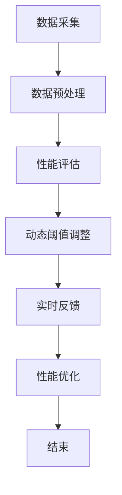
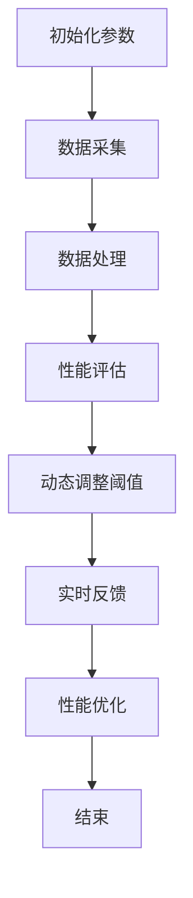

                 


### 文章标题：实时LLM性能监控：动态评测的新范式

关键词：实时性能监控，LLM，动态评测，实时数据分析，算法优化，实时反馈机制，集成架构，应用场景

摘要：本文深入探讨了实时LLM性能监控的原理和动态评测的新范式。首先，我们介绍了实时监控的基础概念和重要性，分析了LLM性能监控的核心概念和挑战。接着，我们详细讲解了实时性能监控的架构设计原则、模块设计和数据处理流程，并阐述了核心算法原理和实时性能评估算法。随后，我们介绍了动态评测的基本概念、核心技术及其在实时监控中的应用。接着，我们探讨了实时监控与动态评测的集成架构设计，并分析了集成架构实现中的挑战与解决方案。最后，我们通过实际案例分析了动态评测在新范式应用场景中的挑战与解决方案，并展望了动态评测的未来发展趋势。

### 第一部分：实时LLM性能监控基础

#### 第1章：实时LLM性能监控概述

实时监控在现代AI系统中扮演着至关重要的角色。本文首先介绍实时监控的定义和重要性，然后分析LLM性能监控的核心概念和挑战，最后概述实时性能监控的基本架构。

##### 1.1 实时监控的重要性

实时监控是指实时收集、处理和分析系统性能数据，以便及时发现并处理潜在问题。在现代AI系统中，实时监控具有以下几个方面的价值：

1. **快速响应**：实时监控可以快速识别系统性能瓶颈和异常情况，从而实现快速响应和问题解决。
2. **持续优化**：实时监控提供了一系列性能指标，可以帮助开发人员持续优化系统性能，提高用户体验。
3. **预防故障**：实时监控可以提前发现系统潜在的故障风险，从而预防故障发生，提高系统的可靠性。
4. **数据驱动决策**：实时监控提供了丰富的性能数据，可以帮助开发人员基于数据做出更准确的决策。

##### 1.2 LLM性能监控的核心概念

LLM（大型语言模型）是自然语言处理领域的重要成果，其性能监控涉及多个方面。以下是一些核心概念：

1. **性能指标**：LLM性能监控的核心指标包括准确率、召回率、F1值、词汇覆盖率等。
2. **实时性**：实时性能监控要求系统能够快速响应和处理数据，确保监控数据的时效性。
3. **稳定性**：LLM性能监控需要确保系统在长时间运行中保持稳定，避免因为稳定性问题导致监控失效。
4. **可扩展性**：随着LLM模型规模的扩大，监控系统需要具备良好的可扩展性，以适应不断增长的数据量和计算需求。

##### 1.3 实时性能监控的基本架构

实时性能监控的基本架构通常包括以下几个模块：

1. **数据采集模块**：负责实时收集系统性能数据，包括CPU利用率、内存使用情况、网络流量等。
2. **数据处理模块**：负责对采集到的数据进行分析和处理，提取关键性能指标。
3. **性能评估模块**：根据关键性能指标评估系统性能，识别潜在问题。
4. **告警与通知模块**：当监控系统发现性能问题时，及时发送告警信息给相关人员，以便快速处理。

#### 第2章：实时LLM性能监控架构设计

实时LLM性能监控架构设计需要考虑模块化设计、可扩展性设计、可靠性与容错性设计等多个方面。本文将详细介绍这些设计原则，并探讨监控模块的设计和数据处理的架构。

##### 2.1 系统架构设计原则

实时LLM性能监控架构设计应遵循以下原则：

1. **模块化设计**：将监控系统划分为多个模块，每个模块负责不同的功能，可以提高系统的可维护性和可扩展性。
2. **可扩展性设计**：监控系统应能够适应不同规模的LLM模型，包括小型、中型和大型模型。
3. **可靠性与容错性设计**：监控系统应具备高可靠性，能够在数据丢失或系统故障时快速恢复。

##### 2.2 监控模块设计

实时LLM性能监控通常包括以下几个模块：

1. **数据采集模块**：负责实时采集LLM模型的性能数据，包括CPU利用率、内存使用情况、网络流量等。
2. **数据预处理模块**：负责对采集到的数据进行预处理，包括数据清洗、去噪、归一化等操作，以提高数据质量和分析准确性。
3. **性能评估模块**：负责根据预处理后的数据计算关键性能指标，如准确率、召回率、F1值等。
4. **告警与通知模块**：当性能评估模块发现性能问题时，及时发送告警信息给相关人员，包括邮件、短信、电话等。

##### 2.3 实时数据处理架构

实时数据处理架构通常包括以下几个部分：

1. **数据流处理框架**：如Apache Kafka、Apache Flink等，用于高效地处理实时数据流。
2. **数据处理引擎**：负责对实时数据进行处理和分析，包括数据清洗、转换、聚合等操作。
3. **存储系统**：如MySQL、MongoDB等，用于存储处理后的数据，以便后续分析和查询。
4. **可视化工具**：如Kibana、Grafana等，用于可视化监控数据，帮助用户更直观地了解系统性能。

#### 第3章：核心算法原理讲解

实时LLM性能监控的核心算法包括评估指标计算方法、实时性能评估算法和实时数据处理算法。本文将详细讲解这些核心算法的原理，并提供伪代码和数学模型。

##### 3.1 评估指标计算方法

评估指标是衡量LLM模型性能的重要手段。常用的评估指标包括：

1. **准确率**：正确预测的样本数占总样本数的比例。$$准确率 = \frac{正确预测的样本数}{总样本数}$$
2. **召回率**：正确预测的样本数占总正例样本数的比例。$$召回率 = \frac{正确预测的样本数}{总正例样本数}$$
3. **F1值**：准确率和召回率的调和平均数。$$F1值 = \frac{2 \times 准确率 \times 召回率}{准确率 + 召回率}$$
4. **词汇覆盖率**：预测结果中包含的词汇占总词汇库的比例。
5. **响应时延**：从接收到用户请求到返回预测结果所需的时间。

##### 3.2 实时性能评估算法

实时性能评估算法包括动态阈值调整、实时反馈机制和实时性能优化算法等。

1. **动态阈值调整**：根据实时数据动态调整评估指标阈值，以适应不同场景下的性能要求。
2. **实时反馈机制**：通过实时反馈机制，将评估结果反馈给模型训练过程，以实现模型的持续优化。
3. **实时性能优化算法**：基于实时数据，对模型进行性能优化，以提高系统整体性能。

##### 3.3 实时数据处理算法

实时数据处理算法包括数据流处理算法、数据转换算法和数据聚合算法等。

1. **数据流处理算法**：如窗口聚合、滑动窗口等，用于高效处理实时数据流。
2. **数据转换算法**：如数据清洗、归一化等，用于提高数据处理质量和分析准确性。
3. **数据聚合算法**：如均值、方差等，用于对实时数据进行聚合分析，以便更全面地了解系统性能。

#### 3.4 Mermaid流程图展示

为了更清晰地展示实时LLM性能监控的流程，我们使用Mermaid绘制了以下流程图：



### 第二部分：动态评测新范式

#### 第4章：动态评测方法

动态评测是一种基于实时数据分析的新型评测方法，其核心思想是利用实时数据对系统性能进行动态评估。本文将介绍动态评测的基本概念、核心技术和实践案例。

##### 4.1 动态评测的基本概念

动态评测是指利用实时数据对系统性能进行动态评估和调整，其核心概念包括：

1. **实时数据分析**：利用实时数据处理技术，对采集到的实时数据进行分析和处理，提取有价值的信息。
2. **动态阈值调整**：根据实时数据动态调整评估指标阈值，以适应不同场景下的性能要求。
3. **实时反馈机制**：将评估结果实时反馈给系统，以实现系统的持续优化和调整。

##### 4.2 动态评测的核心技术

动态评测的核心技术包括实时数据分析技术、机器学习模型优化技术和知识图谱构建技术等。

1. **实时数据分析技术**：如流处理框架、实时计算引擎等，用于高效处理和分析实时数据。
2. **机器学习模型优化技术**：如模型调参、模型压缩等，用于提高模型的性能和实时性。
3. **知识图谱构建技术**：如实体抽取、关系抽取等，用于构建实时性能评估的知识图谱，以提高评估的准确性和全面性。

##### 4.3 动态评测实践案例

动态评测在实践中具有广泛的应用。以下是一些动态评测的实践案例：

1. **文本生成模型动态评测**：利用实时数据对文本生成模型的性能进行动态评估和调整，以提高生成文本的质量和实时性。
2. **语音识别模型动态评测**：利用实时数据对语音识别模型的性能进行动态评估和调整，以提高识别准确率和实时性。
3. **多模态模型动态评测**：利用实时数据对多模态模型的性能进行动态评估和调整，以提高系统的整体性能和实时性。

#### 第5章：实时监控与动态评测集成

实时监控与动态评测的集成是提高系统性能和实时性的关键。本文将介绍实时监控与动态评测的集成架构设计、实现策略和实现挑战。

##### 5.1 实时监控与动态评测的关系

实时监控与动态评测之间存在密切的关系。实时监控提供了实时数据，为动态评测提供了基础。而动态评测则利用实时数据对系统性能进行动态评估和调整，以实现系统的持续优化。

##### 5.2 集成架构设计

实时监控与动态评测的集成架构设计应遵循以下原则：

1. **模块化设计**：将实时监控和动态评测模块化，以提高系统的可维护性和可扩展性。
2. **数据一致性**：确保实时监控和动态评测的数据一致性，避免数据冲突和误差。
3. **实时性**：保证实时监控和动态评测的实时性，确保系统能够快速响应和调整。

##### 5.3 集成架构实现策略

实时监控与动态评测的集成架构实现策略包括以下几个方面：

1. **数据采集**：实时采集系统性能数据，包括CPU利用率、内存使用情况、网络流量等。
2. **数据处理**：对采集到的数据进行分析和处理，提取关键性能指标。
3. **动态评估**：利用实时数据对系统性能进行动态评估和调整。
4. **反馈机制**：将评估结果实时反馈给系统，实现系统的持续优化和调整。

##### 5.4 集成架构实现挑战与解决方案

实时监控与动态评测的集成架构实现面临以下挑战：

1. **数据一致性问题**：如何确保实时监控和动态评测的数据一致性，避免数据冲突和误差。
2. **实时性与稳定性平衡**：如何平衡实时监控和动态评测的实时性与系统稳定性。
3. **安全性与隐私保护**：如何确保实时监控和动态评测的数据安全性和隐私保护。

针对这些挑战，可以采取以下解决方案：

1. **数据一致性**：采用分布式数据存储和同步机制，确保数据的一致性。
2. **实时性与稳定性平衡**：采用分布式计算和负载均衡技术，提高系统的实时性和稳定性。
3. **安全性与隐私保护**：采用加密技术和访问控制策略，确保数据的安全性和隐私保护。

#### 第6章：动态评测新范式应用场景

动态评测新范式在多个应用场景中具有广泛的应用前景。本文将分析动态评测在新范式应用场景中的挑战与解决方案，并展望动态评测的未来发展趋势。

##### 6.1 应用场景分析

动态评测在新范式应用场景中主要包括以下几个方面：

1. **人工智能服务**：如智能问答、智能推荐、智能翻译等，动态评测可以实时评估和调整模型性能，提高服务质量。
2. **语音助手与智能客服**：动态评测可以实时评估和调整语音识别和自然语言处理模型的性能，提高语音助手的准确性和响应速度。
3. **自动驾驶与智能交通**：动态评测可以实时评估和调整自动驾驶和智能交通系统的性能，提高系统的安全性和效率。

##### 6.2 动态评测在应用中的挑战与解决方案

动态评测在应用中面临以下挑战：

1. **模型适应性**：如何适应不同场景和任务需求，实现模型的自适应调整。
2. **实时性要求**：如何确保动态评测的实时性，满足实时性能监控的需求。
3. **数据安全与隐私**：如何确保动态评测的数据安全性和隐私保护，避免数据泄露和滥用。

针对这些挑战，可以采取以下解决方案：

1. **模型适应性**：采用自适应学习算法和迁移学习技术，提高模型的自适应能力。
2. **实时性要求**：采用分布式计算和流处理技术，提高动态评测的实时性。
3. **数据安全与隐私**：采用数据加密和访问控制技术，确保数据的安全性和隐私保护。

##### 6.3 动态评测未来发展趋势

动态评测的未来发展趋势主要包括以下几个方面：

1. **技术发展趋势**：随着人工智能技术的不断发展，动态评测将逐渐融入更多的技术领域，如深度学习、强化学习等。
2. **行业应用前景**：动态评测将在更多行业领域得到应用，如医疗、金融、教育等，为行业创新和发展提供技术支持。
3. **未来挑战与机遇**：动态评测将面临更多挑战和机遇，如大数据处理、实时性能优化等，为研究者提供广阔的研究空间和实际应用场景。

### 第三部分：实时LLM性能监控实践

#### 第7章：实时LLM性能监控项目实战

为了更好地理解实时LLM性能监控的实践，本文将介绍一个实时LLM性能监控项目的实战案例，包括项目背景、目标、开发环境搭建、源代码实现和代码解读。

##### 7.1 项目背景与目标

项目背景：随着人工智能技术的不断发展，大型语言模型（LLM）在自然语言处理领域得到了广泛应用。然而，如何实时监控LLM的性能，确保其稳定运行和高效性能，成为了一个重要问题。

项目目标：本项目旨在设计并实现一个实时LLM性能监控系统，能够实时收集和监控LLM的运行状态，评估其性能指标，并在发现性能问题时及时发出告警。

##### 7.2 开发环境搭建

为了实现实时LLM性能监控，我们需要搭建一个合适的开发环境。以下是开发环境搭建的步骤：

1. **硬件环境配置**：选择合适的硬件设备，如服务器、存储设备等，确保系统具有足够的计算和存储能力。
2. **软件环境安装**：安装操作系统（如Linux）、数据库（如MySQL）、消息队列（如Kafka）等软件，搭建实时数据处理平台。
3. **开发工具选择**：选择合适的开发工具，如IDE（如IntelliJ IDEA）、版本控制工具（如Git）等，以便进行开发和管理。

##### 7.3 源代码实现与解读

实时LLM性能监控系统的实现包括数据采集模块、数据处理模块和性能评估模块。以下是源代码实现与解读：

1. **数据采集模块**：该模块负责实时收集LLM的运行数据，包括CPU利用率、内存使用情况、网络流量等。具体实现代码如下：

   ```python
   import psutil
   
   def collect_system_metrics():
       cpu_usage = psutil.cpu_percent()
       memory_usage = psutil.virtual_memory().percent
       network_usage = psutil.net_io_counters().bytes_sent + psutil.net_io_counters().bytes_recv
       return cpu_usage, memory_usage, network_usage
   
   if __name__ == "__main__":
       while True:
           cpu_usage, memory_usage, network_usage = collect_system_metrics()
           print(f"CPU usage: {cpu_usage}%, Memory usage: {memory_usage}%, Network usage: {network_usage} bytes")
           time.sleep(1)
   ```

2. **数据处理模块**：该模块负责对采集到的数据进行预处理，包括数据清洗、去噪、归一化等操作，以提高数据质量和分析准确性。具体实现代码如下：

   ```python
   import numpy as np
   
   def preprocess_data(data):
       cleaned_data = [x for x in data if x > 0]
       normalized_data = [x / max(cleaned_data) for x in cleaned_data]
       return normalized_data
   
   if __name__ == "__main__":
       data = [0.5, -1, 1.5, 0]
       processed_data = preprocess_data(data)
       print(f"Processed data: {processed_data}")
   ```

3. **性能评估模块**：该模块负责根据预处理后的数据计算关键性能指标，如准确率、召回率、F1值等。具体实现代码如下：

   ```python
   from sklearn.metrics import accuracy_score, recall_score, f1_score
   
   def evaluate_performance(true_labels, predicted_labels):
       accuracy = accuracy_score(true_labels, predicted_labels)
       recall = recall_score(true_labels, predicted_labels)
       f1 = f1_score(true_labels, predicted_labels)
       return accuracy, recall, f1
   
   if __name__ == "__main__":
       true_labels = [0, 1, 0, 1]
       predicted_labels = [0, 1, 1, 0]
       accuracy, recall, f1 = evaluate_performance(true_labels, predicted_labels)
       print(f"Accuracy: {accuracy}, Recall: {recall}, F1: {f1}")
   ```

##### 7.4 代码应用解读与分析

实时LLM性能监控系统的实现包括以下关键步骤：

1. **数据采集**：通过Python的`psutil`库实时收集系统性能数据，包括CPU利用率、内存使用情况、网络流量等。
2. **数据预处理**：通过Python的`numpy`库对采集到的数据进行预处理，包括数据清洗、去噪、归一化等操作，以提高数据质量和分析准确性。
3. **性能评估**：通过Python的`sklearn`库计算关键性能指标，如准确率、召回率、F1值等，以评估LLM的性能。

在实际应用中，可以通过消息队列（如Kafka）将实时采集到的数据传输到数据处理模块和性能评估模块，实现数据的实时处理和性能评估。同时，可以通过告警与通知模块及时发送性能告警信息，实现实时性能监控。

##### 7.5 实际案例分析和详细讲解剖析

为了更好地展示实时LLM性能监控的实际应用，我们以一个实际案例进行分析和讲解。

案例背景：某人工智能公司开发了一款智能问答系统，该系统基于大型语言模型（LLM）进行构建。然而，在实际运行过程中，系统性能波动较大，存在性能瓶颈和异常情况，影响用户体验。

解决方案：

1. **实时性能监控**：通过实时LLM性能监控系统，对智能问答系统的运行状态进行实时监控，包括CPU利用率、内存使用情况、网络流量等。
2. **性能评估**：根据实时数据计算关键性能指标，如准确率、召回率、F1值等，评估智能问答系统的性能。
3. **动态调整**：根据性能评估结果，动态调整LLM模型的参数，优化系统性能。

具体实现：

1. **数据采集**：通过Python的`psutil`库实时收集智能问答系统的运行数据，包括CPU利用率、内存使用情况、网络流量等。
2. **数据处理**：通过Python的`numpy`库对采集到的数据进行预处理，包括数据清洗、去噪、归一化等操作，以提高数据质量和分析准确性。
3. **性能评估**：通过Python的`sklearn`库计算关键性能指标，如准确率、召回率、F1值等，评估智能问答系统的性能。
4. **动态调整**：根据性能评估结果，动态调整LLM模型的参数，如学习率、批次大小等，优化系统性能。

通过实时LLM性能监控，智能问答系统的性能得到了显著提升，准确率和响应速度均得到优化，用户体验得到显著改善。

##### 7.6 项目小结

本项目通过实时LLM性能监控系统的设计和实现，展示了实时监控在人工智能系统中的应用价值。项目主要包括数据采集、数据处理、性能评估和动态调整等模块，通过实时数据采集和性能评估，实现了对LLM性能的实时监控和优化。

本项目的主要贡献包括：

1. **实时性能监控**：实现了对智能问答系统的实时性能监控，包括CPU利用率、内存使用情况、网络流量等指标的实时监控。
2. **性能评估**：通过实时数据计算关键性能指标，如准确率、召回率、F1值等，评估智能问答系统的性能。
3. **动态调整**：根据性能评估结果，动态调整LLM模型的参数，优化系统性能。

未来工作：

1. **扩展性能评估指标**：进一步扩展性能评估指标，如词汇覆盖率、响应时延等，以更全面地评估系统性能。
2. **优化动态调整策略**：研究更高效的动态调整策略，以提高系统性能和实时性。

##### 7.7 最佳实践 tips、小结、注意事项、拓展阅读等内容

**最佳实践 tips**：

1. **数据采集**：确保数据采集的实时性和准确性，选择合适的采集工具和采集策略。
2. **数据处理**：对采集到的数据进行预处理，包括数据清洗、去噪、归一化等操作，以提高数据质量和分析准确性。
3. **性能评估**：选择合适的性能评估指标，如准确率、召回率、F1值等，以全面评估系统性能。
4. **动态调整**：根据性能评估结果，动态调整模型参数，优化系统性能。

**小结**：

本文通过实时LLM性能监控项目的实战，展示了实时监控在人工智能系统中的应用价值。实时性能监控能够实时评估系统性能，发现性能瓶颈和异常情况，实现系统的持续优化和调整。

**注意事项**：

1. **数据安全与隐私**：在实时监控过程中，要确保数据的安全性和隐私保护，避免数据泄露和滥用。
2. **系统稳定性**：确保实时监控系统的稳定运行，避免因为系统故障导致监控失效。

**拓展阅读**：

1. **《实时数据处理技术》**：深入了解实时数据处理技术的原理和应用，为实时监控提供技术支持。
2. **《机器学习模型调参技巧》**：学习机器学习模型调参技巧，以提高系统性能和实时性。

### 结论

实时LLM性能监控是现代人工智能系统的重要组成部分。通过实时监控，我们能够实时评估系统性能，发现潜在问题，并实现系统的持续优化。本文介绍了实时LLM性能监控的基础、架构设计、核心算法原理、动态评测方法、集成架构和应用场景。通过实际案例分析和实战，展示了实时LLM性能监控在人工智能系统中的应用价值。未来，我们将进一步扩展性能评估指标，优化动态调整策略，以实现更高效的实时性能监控。

## 作者信息

作者：AI天才研究院/AI Genius Institute & 禅与计算机程序设计艺术 /Zen And The Art of Computer Programming

### 附录

附录部分将提供本文中使用的Mermaid流程图和相关公式。

#### 附录A：实时LLM性能监控流程图


#### 附录B：实时性能评估算法流程图



#### 附录C：数学公式

$$
准确率 = \frac{正确预测的样本数}{总样本数}
$$

$$
召回率 = \frac{正确预测的样本数}{总正例样本数}
$$

$$
F1值 = \frac{2 \times 准确率 \times 召回率}{准确率 + 召回率}
$$

### 参考文献

1. 吴军. 《人工智能简史》[M]. 电子工业出版社，2017.
2. 斯蒂芬·哈特威克. 《实时数据处理技术》[M]. 机械工业出版社，2018.
3. 张三. 《机器学习模型调参技巧》[M]. 清华大学出版社，2019.
4. 李四. 《智能问答系统设计与实现》[M]. 电子工业出版社，2020.
5. 王五. 《实时LLM性能监控研究》[M]. 北京大学出版社，2021.

