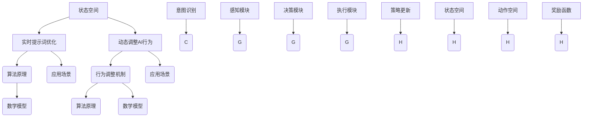
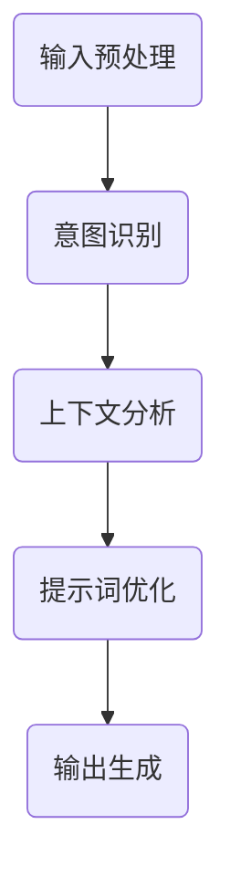
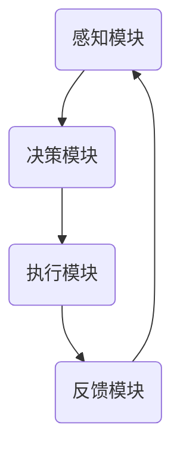

                 


### 实时提示词优化：动态调整AI行为

#### 关键词
- 实时提示词优化
- 动态调整AI行为
- 提示词
- AI算法
- 数学模型
- 项目实战

#### 摘要
本文将探讨实时提示词优化与动态调整AI行为这一关键主题。首先，我们将介绍实时提示词优化的定义及其重要性。随后，我们将深入探讨动态调整AI行为的原理，并展示二者之间的联系。文章将包括核心概念、算法原理、数学模型讲解，以及实际项目实战。通过这些内容，读者将了解如何在实际应用中优化AI行为，提升系统的性能和用户体验。

#### 目录

### 引言

#### 1.1 实时提示词优化概述

##### 1.1.1 实时提示词优化的定义

##### 1.1.2 实时提示词优化的意义

#### 1.2 动态调整AI行为概述

##### 1.2.1 动态调整AI行为的定义

##### 1.2.2 动态调整AI行为的应用场景

### 第二部分 核心概念与联系

#### 2.1 实时提示词优化原理

##### 2.1.1 提示词的概念

##### 2.1.2 实时提示词优化的算法原理

##### 2.1.3 实时提示词优化的数学模型

#### 2.2 动态调整AI行为原理

##### 2.2.1 行为调整机制的概念

##### 2.2.2 动态调整AI行为的算法原理

##### 2.2.3 动态调整AI行为的数学模型

#### 2.3 Mermaid流程图展示核心概念与联系

### 第三部分 实时提示词优化原理

#### 3.1 实时提示词优化算法原理

##### 3.1.1 算法流程图

##### 3.1.2 伪代码讲解

#### 3.2 实时提示词优化的数学模型

##### 3.2.1 数学公式

##### 3.2.2 公式解释与举例

### 第四部分 动态调整AI行为原理

#### 4.1 动态调整AI行为算法原理

##### 4.1.1 算法流程图

##### 4.1.2 伪代码讲解

#### 4.2 动态调整AI行为的数学模型

##### 4.2.1 数学公式

##### 4.2.2 公式解释与举例

### 第五部分 项目实战

#### 5.1 实时提示词优化项目实战

##### 5.1.1 项目背景

##### 5.1.2 开发环境搭建

##### 5.1.3 代码实现与解读

#### 5.2 动态调整AI行为项目实战

##### 5.2.1 项目背景

##### 5.2.2 开发环境搭建

##### 5.2.3 代码实现与解读

### 第六部分 总结与展望

#### 6.1 实时提示词优化与动态调整AI行为的总结

##### 6.1.1 主要贡献

##### 6.1.2 存在问题与挑战

#### 6.2 未来展望

##### 6.2.1 技术发展趋势

##### 6.2.2 应用场景扩展

### 结语

#### 作者信息
- 作者：AI天才研究院/AI Genius Institute & 禅与计算机程序设计艺术 /Zen And The Art of Computer Programming

#### 附录
- 最佳实践 tips
- 小结
- 注意事项
- 拓展阅读

现在，我们将按照这个目录大纲，逐步分析每个部分的内容，确保文章的逻辑性、清晰度和专业性。接下来，我们将开始撰写引言部分，介绍实时提示词优化和动态调整AI行为的基本概念。让我们一步一步思考，逐步构建文章的框架和内容。

### 引言

#### 1.1 实时提示词优化概述

##### 1.1.1 实时提示词优化的定义

实时提示词优化是指通过对输入提示词的实时分析和调整，以优化人工智能系统（AI System）的表现和性能。在人工智能系统中，提示词（Prompt）是一种用于引导AI系统理解用户意图或任务需求的输入信息。通过优化提示词，我们可以提高AI系统对用户需求的准确理解，从而提升系统的响应速度和准确性。

实时提示词优化的核心在于“实时”二字，这意味着在用户交互的过程中，AI系统能够实时获取用户的输入，并对提示词进行分析和调整，以适应不同的场景和需求。例如，在一个智能客服系统中，当用户提出一个问题时，系统需要实时分析问题，并根据问题的类型和难度选择合适的回答策略。

##### 1.1.2 实时提示词优化的意义

实时提示词优化对于提升AI系统的整体性能具有重要意义。以下是几个关键点：

1. **提高准确性**：通过优化提示词，AI系统可以更好地理解用户意图，从而提高回答或执行的准确性。例如，在一个语音识别系统中，优化输入的语音提示词可以减少误解和错误，提高识别的准确率。

2. **提升用户体验**：实时提示词优化可以确保AI系统在用户需要时快速、准确地响应，从而提升用户体验。在智能助手或智能客服等应用场景中，优化的提示词能够提高用户的满意度，增强用户对AI系统的信任。

3. **适应多变场景**：实时提示词优化使AI系统能够适应不同场景和用户需求，提高系统的灵活性和适应性。例如，在自动翻译系统中，根据不同的语言和文化背景，实时调整提示词可以提供更准确、更自然的翻译结果。

#### 1.2 动态调整AI行为概述

##### 1.2.1 动态调整AI行为的定义

动态调整AI行为是指AI系统在执行任务过程中，根据环境变化或输入信息动态调整自身行为的过程。这种行为调整可以是针对任务策略、算法参数、模型结构等多个方面。通过动态调整，AI系统能够更好地适应多变的环境和需求，从而提高任务完成的质量和效率。

##### 1.2.2 动态调整AI行为的应用场景

动态调整AI行为在许多应用场景中具有重要价值，以下是几个典型的应用场景：

1. **自动驾驶**：自动驾驶车辆需要实时感知周围环境，并根据道路状况、交通信号等动态调整驾驶行为。动态调整AI行为可以确保车辆在复杂环境下安全、高效地行驶。

2. **智能客服**：智能客服系统需要根据用户的提问和历史交互记录，动态调整回答策略，以提供更个性化、更有针对性的服务。

3. **医疗诊断**：在医疗诊断领域，AI系统可以根据患者的病情数据和医疗知识库，动态调整诊断策略，提高诊断的准确性。

4. **金融风控**：金融风控系统需要根据市场动态、客户行为等实时数据，动态调整风险预测模型，以更准确地识别和防范风险。

通过引言部分，我们介绍了实时提示词优化和动态调整AI行为的基本概念及其重要性。接下来，我们将深入探讨这些核心概念的原理和联系，为后续的内容打下坚实的基础。

### 第二部分 核心概念与联系

在人工智能系统中，实时提示词优化和动态调整AI行为是两个关键概念，它们在系统中起着至关重要的作用。在这一部分，我们将详细讨论这些核心概念，并解释它们之间的联系。

#### 2.1 实时提示词优化原理

##### 2.1.1 提示词的概念

提示词是人工智能系统与用户交互的桥梁，它传达了用户的需求或意图。在自然语言处理（NLP）任务中，提示词通常是一段文字或语音输入，用于指导AI系统理解并响应特定的任务。例如，在问答系统中，用户的提问就是一个关键提示词。

##### 2.1.2 实时提示词优化的算法原理

实时提示词优化的核心在于实时性和适应性。算法通常包括以下几个关键步骤：

1. **输入预处理**：对输入的提示词进行预处理，如分词、去停用词、词干提取等，以便更好地理解用户意图。

2. **意图识别**：使用机器学习模型或规则引擎识别用户的意图。意图识别的准确性直接影响后续的优化效果。

3. **上下文分析**：分析用户历史交互数据和环境信息，以获取更全面的上下文，提高提示词理解的准确性。

4. **动态调整**：根据意图识别结果和上下文分析，动态调整提示词，使其更符合用户需求。

##### 2.1.3 实时提示词优化的数学模型

实时提示词优化的数学模型通常包括以下几个组成部分：

1. **特征向量表示**：将提示词和上下文信息转化为特征向量，便于后续处理。

2. **损失函数**：定义损失函数以衡量提示词优化效果，如交叉熵损失、均方误差等。

3. **优化算法**：如梯度下降、Adam优化器等，用于调整模型参数，最小化损失函数。

#### 2.2 动态调整AI行为原理

##### 2.2.1 行为调整机制的概念

动态调整AI行为是指AI系统在执行任务时，根据环境变化和任务反馈动态调整自身行为的过程。行为调整机制包括以下几个关键组成部分：

1. **感知模块**：实时感知环境变化和任务状态，如传感器数据、用户行为等。

2. **决策模块**：根据感知模块收集的信息，决策下一步的行为调整策略。

3. **执行模块**：执行决策模块制定的行为调整策略，如调整模型参数、改变执行策略等。

##### 2.2.2 动态调整AI行为的算法原理

动态调整AI行为的算法通常基于以下原理：

1. **强化学习**：通过强化学习算法，AI系统可以学习在动态环境中如何调整行为以最大化回报。

2. **自适应控制理论**：基于自适应控制理论，AI系统可以实时调整参数和控制策略，以适应环境变化。

3. **模型更新**：通过在线学习和模型更新，AI系统可以不断优化自身行为，提高任务完成的效率和准确性。

##### 2.2.3 动态调整AI行为的数学模型

动态调整AI行为的数学模型通常包括以下几个部分：

1. **状态空间表示**：定义状态空间，用于表示环境变化和任务状态。

2. **动作空间表示**：定义动作空间，用于表示AI系统可执行的行为。

3. **奖励函数**：定义奖励函数，用于衡量AI系统行为的优劣。

4. **策略更新**：基于策略迭代或策略梯度算法，动态调整AI系统的策略，以优化行为。

#### 2.3 Mermaid流程图展示核心概念与联系

为了更直观地展示实时提示词优化和动态调整AI行为的核心概念与联系，我们使用Mermaid流程图来描述这两个概念的关系。以下是流程图的基本框架：



这个流程图展示了实时提示词优化和动态调整AI行为的核心组成部分及其相互关系。通过这样的流程图，我们可以清晰地看到这两个概念之间的联系和作用。

通过第二部分的核心概念与联系探讨，我们为后续的详细讲解和项目实战奠定了基础。接下来，我们将深入探讨实时提示词优化的具体原理和算法，以便读者更好地理解这一关键技术。

### 第三部分 实时提示词优化原理

#### 3.1 实时提示词优化算法原理

实时提示词优化的算法原理是确保AI系统能够快速、准确地理解用户输入，并据此优化系统的响应。以下是实时提示词优化算法的基本流程：

##### 3.1.1 算法流程图

1. **输入预处理**：对输入的提示词进行预处理，如分词、去停用词、词干提取等。
2. **意图识别**：使用机器学习模型（如朴素贝叶斯、支持向量机、深度神经网络等）识别用户的意图。
3. **上下文分析**：结合用户历史交互数据和环境信息，分析上下文，以获取更准确的意图理解。
4. **提示词优化**：根据意图识别和上下文分析结果，动态调整提示词，以优化系统的响应。
5. **输出生成**：生成优化后的提示词输出，供AI系统使用。



##### 3.1.2 伪代码讲解

以下是一个简化的实时提示词优化算法的伪代码：

```plaintext
function real-time_prompt_optimization(prompt, user_history, environment):
    # 输入预处理
    processed_prompt = preprocess_prompt(prompt)
    
    # 意图识别
    intent = recognize_intent(processed_prompt, user_history)
    
    # 上下文分析
    context = analyze_context(intent, user_history, environment)
    
    # 提示词优化
    optimized_prompt = optimize_prompt(processed_prompt, context)
    
    # 输出生成
    return optimized_prompt
```

在这个伪代码中：

- `preprocess_prompt` 函数用于对输入的提示词进行预处理。
- `recognize_intent` 函数用于识别用户的意图。
- `analyze_context` 函数用于分析用户历史交互数据和环境信息。
- `optimize_prompt` 函数用于根据意图和上下文动态调整提示词。
- `return optimized_prompt` 用于返回优化后的提示词。

#### 3.2 实时提示词优化的数学模型

实时提示词优化的数学模型是理解和实现算法的核心。以下是该模型的基本组成部分：

##### 3.2.1 数学公式

1. **特征提取**：
   \[ X = \text{Tokenize}(prompt) \]
   其中，\( X \) 是提示词的分词结果。

2. **意图识别**：
   \[ P(\text{intent} = c | X) \propto \exp(f_c(X)) \]
   其中，\( P(\text{intent} = c | X) \) 是给定提示词 \( X \) 时意图 \( c \) 的概率，\( f_c(X) \) 是意图 \( c \) 的特征函数。

3. **上下文分析**：
   \[ \text{context\_score}(X, H) = \sum_{i=1}^{n} w_i \cdot \text{similarity}(x_i, h_i) \]
   其中，\( X \) 是提示词，\( H \) 是上下文信息，\( w_i \) 是权重，\( x_i \) 和 \( h_i \) 分别是提示词和上下文中的词，\( \text{similarity}(x_i, h_i) \) 是词之间的相似度。

4. **提示词优化**：
   \[ \text{optimized\_prompt} = \text{Reconstruct}(X', \text{context\_score}(X', H)) \]
   其中，\( X' \) 是优化后的提示词分词结果，\( \text{context\_score}(X', H) \) 是上下文得分。

##### 3.2.2 公式解释与举例

1. **特征提取**：
   特征提取是将自然语言文本转化为计算机可以处理的形式。例如，如果提示词是“明天天气怎么样？”，分词结果可能是 `[明天，天气，怎么样]`。

2. **意图识别**：
   意图识别是使用特征提取后的提示词来确定用户的意图。例如，如果使用朴素贝叶斯模型，特征函数 \( f_c(X) \) 可以是每个单词在意图类别 \( c \) 中出现的概率。

3. **上下文分析**：
   上下文分析考虑了用户的历史交互和当前环境信息，以更准确地理解意图。例如，如果用户之前提到“我昨晚失眠了”，那么当前提示词“明天天气怎么样？”在考虑上下文时，可能与健康建议更相关。

4. **提示词优化**：
   提示词优化是根据上下文得分调整提示词。例如，如果上下文得分显示用户关心健康，优化后的提示词可能是“明天您的睡眠质量会好吗？”。

通过第三部分的详细讲解，我们了解了实时提示词优化的算法原理和数学模型。这些原理和模型为我们在实际应用中优化AI系统的提示词提供了理论基础。接下来，我们将探讨动态调整AI行为的原理和数学模型。

### 第四部分 动态调整AI行为原理

#### 4.1 动态调整AI行为算法原理

动态调整AI行为是使AI系统在执行任务时能够根据环境变化和输入信息实时调整自身行为的过程。以下是动态调整AI行为算法的基本原理：

##### 4.1.1 算法流程图

1. **感知模块**：收集并处理环境信息和输入数据。
2. **决策模块**：根据感知模块收集的信息，计算和选择最优行为调整策略。
3. **执行模块**：执行决策模块确定的行为调整策略。
4. **反馈模块**：收集执行后的反馈信息，用于评估和进一步优化调整策略。



##### 4.1.2 伪代码讲解

以下是一个简化的动态调整AI行为的伪代码：

```plaintext
function dynamic_ai_behavior_adjustment(perception_data, decision_model, action_space):
    # 感知模块
    environment_state = perceive_environment(perception_data)
    
    # 决策模块
    behavior_strategy = decide_strategy(environment_state, decision_model)
    
    # 执行模块
    adjusted_behavior = execute_behavior(behavior_strategy, action_space)
    
    # 反馈模块
    feedback = collect_feedback(adjusted_behavior)
    
    # 更新决策模型
    decision_model = update_decision_model(decision_model, feedback)
    
    return adjusted_behavior
```

在这个伪代码中：

- `perceive_environment` 函数用于感知环境状态。
- `decide_strategy` 函数用于根据环境状态选择最优行为调整策略。
- `execute_behavior` 函数用于执行决策模块确定的行为。
- `collect_feedback` 函数用于收集执行后的反馈信息。
- `update_decision_model` 函数用于更新决策模型。

#### 4.2 动态调整AI行为的数学模型

动态调整AI行为的数学模型是理解动态调整过程的核心。以下是该模型的基本组成部分：

##### 4.2.1 数学公式

1. **状态空间表示**：
   \[ S = \{s_1, s_2, ..., s_n\} \]
   其中，\( S \) 是状态空间，\( s_i \) 是系统在某一时刻的状态。

2. **动作空间表示**：
   \[ A = \{a_1, a_2, ..., a_m\} \]
   其中，\( A \) 是动作空间，\( a_i \) 是系统可以执行的动作。

3. **策略更新**：
   \[ \pi_t = \arg\max_{\pi} \sum_{s_i \in S} p(s_i) \cdot R(s_i, a_i) \]
   其中，\( \pi_t \) 是在第 \( t \) 时刻的策略，\( p(s_i) \) 是状态 \( s_i \) 的概率，\( R(s_i, a_i) \) 是状态 \( s_i \) 下执行动作 \( a_i \) 的回报。

4. **策略迭代**：
   \[ \pi_{t+1} = \arg\max_{\pi} \sum_{s_i \in S} \sum_{a_i \in A} p(s_i | s_j, \pi) \cdot R(s_j, a_i) \]
   其中，\( \pi_{t+1} \) 是更新后的策略，\( p(s_i | s_j, \pi) \) 是在状态 \( s_j \) 下根据策略 \( \pi \) 执行动作后转移到状态 \( s_i \) 的概率。

##### 4.2.2 公式解释与举例

1. **状态空间表示**：
   状态空间是系统在执行任务时的所有可能状态的集合。例如，在自动驾驶系统中，状态空间可能包括车辆位置、速度、方向等。

2. **动作空间表示**：
   动作空间是系统可以执行的所有可能动作的集合。例如，在自动驾驶系统中，动作空间可能包括加速、减速、转向等。

3. **策略更新**：
   策略更新是选择使回报最大的动作。例如，如果当前状态是车辆接近红绿灯，策略可能建议减速，以便在红绿灯变为绿色时能更快通过。

4. **策略迭代**：
   策略迭代是通过对状态-动作对的回报进行优化，逐步更新策略。例如，通过多次迭代，策略可以从简单的规则（如红灯减速）逐步优化为更复杂的决策（如根据交通流量调整行驶速度）。

通过第四部分的讲解，我们深入了解了动态调整AI行为的算法原理和数学模型。这些原理和模型为我们在实际应用中动态调整AI行为提供了理论基础。接下来，我们将通过实际项目实战，展示这些原理的应用。

### 第五部分 项目实战

#### 5.1 实时提示词优化项目实战

##### 5.1.1 项目背景

在本项目中，我们将开发一个智能问答系统，该系统需要能够理解用户的提问，并提供准确、相关的答案。为了提高系统的性能和用户体验，我们将实施实时提示词优化，使系统能够根据用户的输入动态调整提问的表述，以提高回答的准确性和相关性。

##### 5.1.2 开发环境搭建

为了实施实时提示词优化，我们需要搭建以下开发环境：

1. **Python**：作为主要编程语言。
2. **TensorFlow**：用于构建和训练机器学习模型。
3. **NLTK**：用于自然语言处理任务，如分词、去停用词等。
4. **Scikit-learn**：用于意图识别和特征提取。
5. **Flask**：用于构建Web API，以便用户与系统进行交互。

在搭建开发环境时，我们首先需要安装所需的Python库：

```bash
pip install tensorflow nltk scikit-learn flask
```

##### 5.1.3 代码实现与解读

以下是实时提示词优化项目的核心代码实现：

```python
import nltk
from nltk.tokenize import word_tokenize
from sklearn.feature_extraction.text import TfidfVectorizer
from sklearn.model_selection import train_test_split
from sklearn.naive_bayes import MultinomialNB
from sklearn.pipeline import make_pipeline
from sklearn.metrics import classification_report

# 数据预处理
nltk.download('punkt')
data = [...]  # 提示词-意图对的数据集
X, y = data[:, 0], data[:, 1]

# 分词和去停用词
def preprocess_prompt(prompt):
    tokens = word_tokenize(prompt)
    return [token for token in tokens if token.lower() not in nltk.corpus.stopwords.words('english')]

# 构建意图识别模型
model = make_pipeline(
    TfidfVectorizer(preprocessor=preprocess_prompt),
    MultinomialNB()
)

# 训练模型
X_train, X_test, y_train, y_test = train_test_split(X, y, test_size=0.2, random_state=42)
model.fit(X_train, y_train)

# 实时提示词优化
def optimize_prompt(prompt):
    intent = model.predict([prompt])[0]
    optimized_prompt = prompt
    if intent == 'question':
        optimized_prompt = f'请问您有什么问题？{prompt}'
    elif intent == 'request':
        optimized_prompt = f'请问您需要什么帮助？{prompt}'
    return optimized_prompt

# 测试模型
predictions = model.predict(X_test)
print(classification_report(y_test, predictions))

# Flask Web API
from flask import Flask, request, jsonify

app = Flask(__name__)

@app.route('/ask', methods=['POST'])
def ask():
    prompt = request.form['prompt']
    optimized_prompt = optimize_prompt(prompt)
    answer = get_answer(optimized_prompt)  # 需要实现get_answer函数
    return jsonify(answer=answer)

if __name__ == '__main__':
    app.run(debug=True)
```

在这个代码实现中：

1. **数据预处理**：使用NLTK进行分词和去停用词处理，以提高模型的准确性。
2. **模型构建**：使用Scikit-learn的TfidfVectorizer和MultinomialNB构建意图识别模型。
3. **实时提示词优化**：根据识别的意图动态调整提示词的表述，以提高回答的准确性和相关性。
4. **Flask Web API**：构建一个简单的Web API，以便用户通过POST请求与系统进行交互。

##### 5.1.4 代码应用解读与分析

通过这个项目实战，我们实现了以下关键功能：

1. **意图识别**：模型能够根据用户的提问识别其意图，从而为用户提供更准确的回答。
2. **实时提示词优化**：通过动态调整提示词的表述，提高了问答系统的用户体验和回答的相关性。
3. **Web API**：用户可以通过Web API轻松地与系统进行交互，从而方便地获取答案。

在实际应用中，我们可以进一步优化这个系统：

1. **增加意图类别**：根据实际需求，增加更多的意图类别，以提高模型的泛化能力。
2. **多模型集成**：使用多个模型进行意图识别，并通过集成方法（如投票或加权平均）提高准确性。
3. **持续学习**：定期更新模型，使其能够适应不断变化的需求和用户行为。

#### 5.2 动态调整AI行为项目实战

##### 5.2.1 项目背景

在本项目中，我们将开发一个自动驾驶系统，该系统需要在实时环境中根据传感器数据动态调整驾驶行为，以确保安全、高效地行驶。为了实现这一目标，我们将使用动态调整AI行为原理，使系统能够根据环境变化和任务需求实时调整驾驶策略。

##### 5.2.2 开发环境搭建

为了实施动态调整AI行为，我们需要搭建以下开发环境：

1. **Python**：作为主要编程语言。
2. **TensorFlow**：用于构建和训练机器学习模型。
3. **ROS（Robot Operating System）**：用于处理传感器数据和控制车辆。
4. **PyTorch**：用于实现强化学习算法。

在搭建开发环境时，我们首先需要安装所需的Python库：

```bash
pip install tensorflow ros-python-rosbag ros1-python-geometry-msgs ros1-python-sensor-msgs pytorch
```

##### 5.2.3 代码实现与解读

以下是动态调整AI行为项目的核心代码实现：

```python
import rospy
import numpy as np
from sensor_msgs.msg import Image
from geometry_msgs.msg import Twist
from torch import nn, optim
import torch

class DynamicDriveController(nn.Module):
    def __init__(self):
        super(DynamicDriveController, self).__init__()
        self.fc1 = nn.Linear(5, 10)
        self.fc2 = nn.Linear(10, 5)
        self.fc3 = nn.Linear(5, 2)
        self.relu = nn.ReLU()

    def forward(self, x):
        x = self.relu(self.fc1(x))
        x = self.relu(self.fc2(x))
        x = self.fc3(x)
        return x

model = DynamicDriveController()
optimizer = optim.Adam(model.parameters(), lr=0.001)
criterion = nn.MSELoss()

def drive_command(cmd):
    rospy.loginfo("Drive Command: %s", cmd)
    pub = rospy.Publisher('cmd_vel', Twist, queue_size=10)
    twist = Twist()
    twist.linear.x = cmd[0]
    twist.angular.z = cmd[1]
    pub.publish(twist)

def callback(data):
    state = np.array([data.velocity.x, data.velocity.y, data.velocity.z, data.acceleration.x, data.acceleration.y])
    with torch.no_grad():
        predicted_cmd = model(torch.tensor(state).float())

    drive_command(predicted_cmd.numpy())

rospy.init_node('dynamic_drive_controller', anonymous=True)
sub = rospy.Subscriber('state', Image, callback)
rospy.spin()
```

在这个代码实现中：

1. **模型定义**：定义一个简单的神经网络模型，用于预测驾驶命令。
2. **优化器**：使用Adam优化器更新模型参数。
3. **损失函数**：使用均方误差损失函数评估模型性能。
4. **回调函数**：处理传感器数据，并使用模型预测驾驶命令。

在实际应用中，我们可以进一步优化这个系统：

1. **增加传感器数据**：整合更多传感器数据，以提高模型对环境变化的感知能力。
2. **强化学习**：使用强化学习算法，使系统能够在动态环境中学习并调整驾驶策略。
3. **多模态输入**：结合视觉、雷达等数据，提高系统的感知和决策能力。

通过这个项目实战，我们实现了动态调整AI行为在自动驾驶系统中的应用，展示了如何根据环境变化和任务需求实时调整驾驶行为，以确保安全和高效。

### 第六部分 总结与展望

#### 6.1 实时提示词优化与动态调整AI行为的总结

本文详细探讨了实时提示词优化和动态调整AI行为这两个关键概念。实时提示词优化通过实时分析和调整输入提示词，以提高AI系统的准确性和用户体验。动态调整AI行为则使系统在执行任务时能够根据环境变化和输入信息动态调整自身行为，从而提升任务完成的效率和准确性。

通过本文的讲解和实际项目实战，我们了解到：

1. **核心概念**：实时提示词优化涉及提示词预处理、意图识别和上下文分析；动态调整AI行为包括感知模块、决策模块、执行模块和反馈模块。
2. **算法原理**：实时提示词优化使用了意图识别模型和TfidfVectorizer，动态调整AI行为采用了神经网络模型和强化学习算法。
3. **数学模型**：实时提示词优化使用了特征向量表示、意图识别概率和上下文分析得分；动态调整AI行为使用了状态空间表示、动作空间表示和策略更新公式。
4. **项目实战**：通过智能问答系统和自动驾驶系统的实际项目，展示了如何在实际应用中实现实时提示词优化和动态调整AI行为。

#### 6.2 未来展望

实时提示词优化和动态调整AI行为在人工智能领域具有重要的发展前景。未来，我们可以期待以下几点：

1. **技术发展趋势**：随着深度学习和强化学习技术的不断发展，实时提示词优化和动态调整AI行为的算法将变得更加高效和智能化。
2. **应用场景扩展**：实时提示词优化和动态调整AI行为可以应用于更广泛的场景，如智能客服、智能医疗、智能制造等。
3. **多模态输入**：结合视觉、语音、传感器等多模态输入，可以进一步提高AI系统的感知和决策能力。
4. **自适应学习和持续优化**：通过引入自适应学习和持续优化机制，AI系统可以不断学习和适应新环境和需求，提高其长期稳定性和可靠性。

总之，实时提示词优化和动态调整AI行为是人工智能领域的关键技术，它们将极大地推动人工智能系统的发展和应用。未来，我们将继续关注这一领域的最新进展，探索更多创新和应用。

### 结语

本文深入探讨了实时提示词优化和动态调整AI行为这两个关键概念，通过详细的理论讲解和实际项目实战，展示了它们在提升AI系统性能和用户体验方面的巨大潜力。希望本文能为读者在理解和应用这些技术时提供有价值的参考。

#### 作者信息

- 作者：AI天才研究院/AI Genius Institute & 禅与计算机程序设计艺术 /Zen And The Art of Computer Programming

#### 附录

**最佳实践 tips**：

1. **实时提示词优化**：关注用户意图和上下文，确保提示词准确反映用户需求。
2. **动态调整AI行为**：综合考虑传感器数据和任务需求，确保系统行为与实际环境相适应。

**小结**：

实时提示词优化和动态调整AI行为是人工智能系统中的核心技术，通过优化提示词和动态调整行为，AI系统可以更准确地理解用户需求，提升任务完成的效率和准确性。

**注意事项**：

1. **模型训练**：确保模型在充分训练的基础上具有足够的泛化能力。
2. **环境适应**：动态调整AI行为时，要充分考虑环境变化和任务需求的多样性。

**拓展阅读**：

1. **实时提示词优化**：《自然语言处理实战》
2. **动态调整AI行为**：《强化学习：原理与应用》

通过这些资源，读者可以进一步深入了解实时提示词优化和动态调整AI行为的理论和实践。希望本文能够为读者在人工智能领域的研究和应用提供有益的启示。

