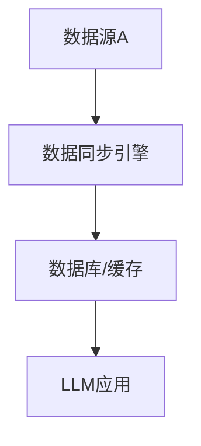

                 

### 文章标题

实时数据同步：确保LLM应用数据的一致性

#### 关键词

- 实时数据同步
- LLM应用
- 数据一致性
- 分布式数据同步机制
- 消息队列
- 缓存策略
- 性能优化
- 安全性保障

#### 摘要

本文旨在探讨实时数据同步在大型语言模型（LLM）应用中的重要性及其实现方法。随着LLM技术的广泛应用，数据的一致性成为保障应用稳定性和可靠性的关键。本文首先介绍了实时数据同步的基本原理和重要性，然后详细分析了LLM应用中数据一致性的需求和挑战。接着，本文重点介绍了分布式数据同步机制、分布式数据库同步、消息队列与事件驱动同步、缓存与数据一致性等技术手段。最后，通过实际案例分析了实时数据同步在LLM应用中的具体实现和性能优化策略，并对未来的发展趋势进行了展望。

## 第一部分：实时数据同步概述

### 第1章：实时数据同步原理

#### 1.1 实时数据同步的定义与重要性

实时数据同步是指将数据源的数据实时、准确地复制到目标系统中，以保证数据的一致性。在分布式系统中，数据的分布性带来了数据一致性的挑战。实时数据同步能够确保在不同节点间保持数据的一致性，对于保证系统的稳定性和可靠性具有重要意义。

实时数据同步的重要性体现在以下几个方面：

1. **数据一致性与可靠性**：实时数据同步能够保证数据在多个节点间的一致性，从而提高系统的可靠性。在金融、电子商务等对数据一致性要求极高的领域，实时数据同步至关重要。

2. **提高系统性能**：实时数据同步可以减少数据访问延迟，提高系统的响应速度，从而提升用户体验。

3. **支持分布式计算**：实时数据同步为分布式计算提供了数据基础，使得分布式系统能够高效地处理大规模数据。

4. **数据灾难恢复**：在数据丢失或系统故障时，实时数据同步可以快速恢复数据，减少数据丢失的风险。

#### 1.2 实时数据同步的核心组件与技术

实时数据同步系统通常由以下几个核心组件组成：

1. **数据源**：数据源是数据同步的起点，可以是数据库、文件系统或其他数据存储系统。

2. **数据同步引擎**：数据同步引擎负责解析数据源中的数据，将其转换为适用于目标系统的格式，并传输到目标系统。

3. **数据目标**：数据目标是数据同步的终点，通常是数据库或缓存系统。

4. **数据同步策略**：数据同步策略决定了数据同步的频率、方式等。常见的同步策略包括增量同步、全量同步等。

实时数据同步技术主要包括以下几种：

1. **增量同步**：只同步数据源中发生变化的数据，提高同步效率。

2. **全量同步**：同步数据源中的所有数据，确保数据的一致性。

3. **双向同步**：同时同步数据源到目标系统和目标系统到数据源的数据，确保数据的双向一致性。

4. **异步同步**：通过消息队列或事件驱动机制实现数据的异步传输，提高系统的可扩展性。

#### 1.3 实时数据同步的挑战与解决方案

实时数据同步面临以下挑战：

1. **数据一致性问题**：分布式系统中，数据的一致性难以保证。需要采用分布式一致性算法（如Paxos、Raft）来确保数据的一致性。

2. **性能问题**：实时数据同步需要在短时间内处理大量数据，对系统性能要求较高。需要采用优化技术（如数据分片、缓存机制）来提高性能。

3. **可靠性问题**：在数据传输过程中，可能会遇到网络故障、系统故障等问题，需要设计容错机制来保证系统的可靠性。

4. **安全性问题**：数据同步过程中，数据的安全性至关重要。需要采用加密技术、访问控制等技术来保障数据安全。

针对上述挑战，可以采用以下解决方案：

1. **分布式一致性算法**：采用Paxos、Raft等分布式一致性算法，确保数据在多个节点间的一致性。

2. **性能优化技术**：通过数据分片、缓存机制、异步处理等优化技术，提高系统的性能。

3. **容错机制**：采用冗余设计、故障转移等技术，提高系统的可靠性。

4. **安全性保障**：采用数据加密、访问控制、实时监控等技术，保障数据安全。

### 第2章：LLM应用数据一致性原理

#### 2.1 LLM应用背景与数据一致性需求

随着人工智能技术的飞速发展，大型语言模型（LLM，Large Language Model）成为许多应用的核心组件。LLM应用广泛用于自然语言处理（NLP）、智能问答、文本生成、机器翻译等领域。这些应用对数据的一致性有极高的要求。

LLM应用的数据一致性需求主要包括以下几个方面：

1. **实时性**：LLM应用通常需要实时获取和处理数据，例如实时问答系统需要实时获取用户提问并生成回答。

2. **准确性**：数据的一致性直接影响LLM应用的准确性。不一致的数据可能导致错误的预测或回答。

3. **完整性**：LLM应用需要确保数据的完整性，避免数据丢失或损坏。

4. **一致性**：LLM应用需要在多个节点间保持数据的一致性，确保不同节点上的数据保持一致。

#### 2.2 数据一致性的核心概念与模型

数据一致性是指数据在不同系统、节点间保持一致的状态。在分布式系统中，数据一致性是一个复杂且关键的问题。以下是一些核心概念和模型：

1. **强一致性**：强一致性要求所有节点在同一时刻看到相同的数据。典型的实现包括分布式锁、分布式事务等。

2. **最终一致性**：最终一致性允许不同节点在一定时间后达到数据一致。最终一致性通常通过事件驱动机制、消息队列等实现。

3. **一致性模型**：一致性模型包括CAP理论（一致性、可用性、分区容错性），BASE理论（基本可用、软状态、最终一致性）等。

4. **分布式一致性算法**：分布式一致性算法（如Paxos、Raft）旨在实现分布式系统中的数据一致性。

#### 2.3 LLM应用数据一致性的重要性

LLM应用数据一致性的重要性体现在以下几个方面：

1. **用户体验**：数据不一致可能导致错误的预测或回答，严重影响用户体验。

2. **业务决策**：数据不一致可能影响业务决策的准确性，导致业务损失。

3. **系统稳定性**：数据不一致可能导致系统崩溃或异常，影响系统稳定性。

4. **数据安全性**：数据不一致可能增加数据泄露的风险，影响数据安全性。

综上所述，确保LLM应用的数据一致性对于保障系统的稳定性、准确性和安全性具有重要意义。接下来，本文将详细探讨实时数据同步技术，为LLM应用数据一致性的实现提供技术支持。

## 第二部分：实时数据同步技术

### 第3章：分布式数据同步机制

#### 3.1 分布式数据同步基本原理

分布式数据同步机制旨在实现分布式系统中数据的一致性。其基本原理如下：

1. **数据源**：分布式数据源是数据的起点，可以是数据库、文件系统或其他数据存储系统。

2. **数据同步引擎**：数据同步引擎负责解析数据源中的数据，将其转换为适用于目标系统的格式，并传输到目标系统。

3. **数据目标**：数据目标是数据同步的终点，通常是数据库或缓存系统。

4. **同步策略**：同步策略决定了数据同步的频率、方式等。常见的同步策略包括增量同步、全量同步等。

5. **一致性保障**：分布式数据同步机制需要采用分布式一致性算法（如Paxos、Raft）来确保数据在不同节点间的一致性。

#### 3.2 常见分布式数据同步算法

分布式数据同步算法是实现数据一致性的关键技术。以下介绍几种常见的分布式数据同步算法：

1. **Paxos算法**：Paxos算法是一种分布式一致性算法，旨在解决分布式系统中的一致性问题。Paxos算法通过选举领导者、达成一致性协议等方式，确保多个副本间的一致性。

2. **Raft算法**：Raft算法是一种简化的Paxos算法，其核心思想是将一致性算法分解为三个子问题：领导选举、日志复制、状态机。Raft算法通过明确领导者的角色，简化了协议的实现。

3. **Gossip协议**：Gossip协议是一种基于消息传递的分布式一致性算法。Gossip协议通过不断传播信息，确保系统中的节点间保持一致性。

4. **CRC算法**：CRC（Conflict-free Replicated Data Types）算法是一种基于状态的分布式一致性算法。CRC算法通过定义无冲突的数据操作，确保多个副本间的一致性。

#### 3.3 分布式数据同步的性能优化

分布式数据同步的性能优化是确保系统高效运行的关键。以下介绍几种常见的性能优化策略：

1. **数据分片**：数据分片是将数据按照一定规则划分到不同的节点上。通过数据分片，可以减少单点瓶颈，提高系统的并发处理能力。

2. **缓存机制**：缓存机制可以减少数据访问延迟，提高系统性能。常见的缓存机制包括内存缓存、分布式缓存等。

3. **异步处理**：异步处理可以将数据同步操作与业务逻辑分离，减少同步等待时间，提高系统的并发能力。

4. **并行处理**：并行处理可以通过多线程、多进程等方式，同时处理多个数据同步任务，提高系统的吞吐量。

5. **压缩与编码**：数据压缩与编码可以减少数据传输的体积，提高网络传输效率。

6. **负载均衡**：负载均衡可以将数据同步任务均匀分配到各个节点上，避免单点过载，提高系统的整体性能。

### 第4章：分布式数据库同步

#### 4.1 分布式数据库原理与架构

分布式数据库是将数据存储在多个节点上，通过分布式算法实现数据一致性的数据库系统。分布式数据库的原理与架构如下：

1. **节点与副本**：分布式数据库由多个节点组成，每个节点存储数据的部分副本。副本的数量可以根据需求进行调整。

2. **数据分片**：数据分片是将数据按照一定规则划分到不同的节点上。常见的分片策略包括哈希分片、范围分片、列表分片等。

3. **分布式一致性算法**：分布式数据库采用分布式一致性算法（如Paxos、Raft）确保数据在不同节点间的一致性。

4. **数据同步机制**：分布式数据库通过分布式数据同步机制（如增量同步、全量同步）实现数据的实时同步。

5. **分布式查询引擎**：分布式查询引擎负责处理分布式数据库的查询请求，通过分布式计算实现高效的数据查询。

#### 4.2 分布式数据库同步策略

分布式数据库同步策略决定了数据同步的频率、方式等。以下介绍几种常见的同步策略：

1. **增量同步**：增量同步只同步数据源中发生变化的数据。增量同步通过记录数据变更日志，实现数据的增量同步。

2. **全量同步**：全量同步同步数据源中的所有数据。全量同步适用于数据量较小或数据更新频率较低的场景。

3. **双向同步**：双向同步同时同步数据源到目标系统和目标系统到数据源的数据。双向同步确保数据的双向一致性。

4. **异步同步**：异步同步通过消息队列或事件驱动机制实现数据的异步传输。异步同步可以减少同步等待时间，提高系统的并发能力。

5. **多阶段同步**：多阶段同步将数据同步过程分为多个阶段，每个阶段负责不同的同步任务。多阶段同步可以提高同步的效率。

#### 4.3 分布式数据库同步实践

分布式数据库同步实践包括以下几个方面：

1. **数据源配置**：配置分布式数据库的数据源，包括节点地址、副本数量等。

2. **同步任务设置**：设置分布式数据库的同步任务，包括同步频率、同步方式等。

3. **数据一致性检查**：通过一致性检查确保分布式数据库的数据一致性。

4. **异常处理**：处理分布式数据库同步过程中的异常情况，包括数据冲突、网络故障等。

5. **监控与优化**：监控分布式数据库同步的运行状态，通过性能优化提高同步效率。

### 第5章：消息队列与事件驱动同步

#### 5.1 消息队列基本原理与应用

消息队列是一种异步通信机制，用于实现分布式系统中的异步消息传递。消息队列的基本原理与应用如下：

1. **基本原理**：消息队列由生产者、消费者和队列组成。生产者生成消息并放入队列，消费者从队列中获取消息进行处理。

2. **应用场景**：消息队列在分布式系统中具有广泛的应用，包括异步处理、分布式事务、负载均衡等。

3. **常见消息队列系统**：常见的消息队列系统包括RabbitMQ、Kafka、Pulsar等。

#### 5.2 事件驱动同步机制

事件驱动同步机制是一种基于事件触发的数据同步方式。其基本原理与应用如下：

1. **基本原理**：事件驱动同步机制通过监听数据变更事件，触发数据同步操作。

2. **应用场景**：事件驱动同步机制适用于需要实时响应的数据同步场景，如实时数据监控、实时数据分析等。

3. **常见事件驱动框架**：常见的事件驱动框架包括Spring Event、Quartz等。

#### 5.3 消息队列在实时数据同步中的应用

消息队列在实时数据同步中的应用主要包括以下几个方面：

1. **异步传输**：通过消息队列实现数据的异步传输，减少同步等待时间，提高系统的并发能力。

2. **分布式一致性**：通过消息队列实现分布式系统中的数据一致性，确保数据在不同节点间保持一致。

3. **负载均衡**：通过消息队列实现负载均衡，将数据同步任务均匀分配到各个节点上，提高系统的性能。

4. **容错性**：通过消息队列实现数据的持久化存储，确保在系统故障时能够恢复数据同步操作。

### 第6章：缓存与数据一致性

#### 6.1 缓存机制与作用

缓存机制是一种快速访问数据的策略，用于减少数据访问延迟，提高系统性能。缓存机制的作用如下：

1. **提高访问速度**：缓存机制通过将经常访问的数据存储在内存中，提高数据访问速度。

2. **减少数据库压力**：缓存机制可以减少对数据库的访问，降低数据库的压力。

3. **提高系统响应速度**：缓存机制可以减少数据访问延迟，提高系统的响应速度。

4. **降低网络延迟**：缓存机制可以在本地存储数据，减少通过网络传输数据的延迟。

#### 6.2 数据一致性与缓存的关系

数据一致性与缓存的关系密切，缓存机制对数据一致性有重要影响。以下介绍数据一致性与缓存的关系：

1. **缓存一致性**：缓存一致性是指缓存中的数据与实际存储的数据保持一致。在分布式系统中，缓存一致性是一个重要问题。

2. **缓存更新策略**：缓存更新策略决定了缓存中的数据如何与实际存储的数据保持一致。常见的缓存更新策略包括写回策略、写穿透策略、写穿策略等。

3. **缓存失效机制**：缓存失效机制是指缓存中的数据何时失效。缓存失效机制需要平衡数据一致性和访问速度。

4. **缓存一致性算法**：缓存一致性算法用于在分布式系统中实现缓存一致性。常见的缓存一致性算法包括MESI、MOESI等。

#### 6.3 缓存策略与一致性保障

缓存策略与数据一致性保障密切相关。以下介绍几种常见的缓存策略与一致性保障方法：

1. **本地缓存**：本地缓存是指在客户端或服务端存储数据的副本。本地缓存可以减少对数据库的访问，提高访问速度。本地缓存的一致性可以通过缓存同步策略（如写回策略）来保障。

2. **分布式缓存**：分布式缓存是指在多个节点上存储数据的副本。分布式缓存可以提高系统的并发能力和容错性。分布式缓存的一致性可以通过缓存一致性算法（如MESI）来保障。

3. **缓存一致性协议**：缓存一致性协议是一组规则，用于确保缓存中的数据与实际存储的数据保持一致。常见的缓存一致性协议包括MESI（修改、独占、共享、无效）协议。

4. **缓存失效策略**：缓存失效策略是指缓存中的数据何时失效。常见的缓存失效策略包括LRU（最近最少使用）、LFU（最近最不频繁使用）等。

5. **一致性保障方法**：一致性保障方法包括缓存同步、缓存失效、分布式一致性算法等。通过这些方法，可以确保缓存中的数据与实际存储的数据保持一致。

### 第三部分：实时数据同步在LLM应用中的应用

#### 第7章：LLM应用数据一致性案例分析

#### 7.1 案例背景与需求分析

随着人工智能技术的广泛应用，大型语言模型（LLM）成为许多应用的核心组件。以谷歌搜索引擎为例，其使用了大量的LLM技术来提供智能搜索结果。在谷歌搜索引擎中，数据一致性是保障搜索质量和用户体验的关键。

案例背景与需求分析如下：

1. **背景**：谷歌搜索引擎每天处理数以亿计的搜索请求，这些请求需要实时获取和处理大量的数据。

2. **需求**：
   - **实时性**：搜索请求需要实时获取数据，确保搜索结果的实时性和准确性。
   - **准确性**：搜索结果需要保持数据的一致性，避免错误的预测或回答。
   - **完整性**：确保搜索数据在分布式系统中保持完整性，避免数据丢失或损坏。
   - **一致性**：在多个节点间保持数据的一致性，确保不同节点上的搜索数据保持一致。

#### 7.2 数据一致性解决方案设计

为了满足上述需求，谷歌搜索引擎设计了以下数据一致性解决方案：

1. **分布式数据库**：使用分布式数据库存储搜索数据，确保数据在多个节点间的一致性。

2. **分布式一致性算法**：采用Paxos算法实现分布式数据库的一致性，确保数据在分布式系统中的强一致性。

3. **增量同步**：使用增量同步策略，只同步数据源中发生变化的数据，提高同步效率。

4. **缓存机制**：在客户端和服务器端使用缓存机制，减少对数据库的访问，提高访问速度。

5. **事件驱动同步**：使用事件驱动同步机制，在数据变更时实时触发同步操作，确保数据的实时性。

6. **消息队列**：使用消息队列实现异步传输，减少同步等待时间，提高系统的并发能力。

7. **安全性保障**：采用加密技术、访问控制等技术，保障数据在同步过程中的安全性。

#### 7.3 数据一致性实现与优化

数据一致性实现与优化包括以下几个方面：

1. **分布式数据库实现**：使用分布式数据库存储搜索数据，实现数据在多个节点间的一致性。

2. **分布式一致性算法优化**：对Paxos算法进行优化，提高其在高并发场景下的性能。

3. **增量同步优化**：优化增量同步策略，提高增量同步的效率。

4. **缓存机制优化**：优化缓存机制，提高缓存命中率，减少对数据库的访问。

5. **事件驱动同步优化**：优化事件驱动同步机制，提高同步的实时性。

6. **消息队列优化**：优化消息队列的性能，提高系统的并发能力。

7. **性能监控与优化**：对实时数据同步系统进行性能监控，根据监控数据进行分析和优化。

#### 7.4 数据一致性实现效果与评估

数据一致性实现效果与评估包括以下几个方面：

1. **实时性评估**：通过性能测试，评估实时数据同步系统的响应速度和延迟。

2. **准确性评估**：通过对比实际数据和同步后的数据，评估数据一致性的准确性。

3. **完整性评估**：通过检查数据备份和恢复过程，评估数据在分布式系统中的完整性。

4. **一致性评估**：通过一致性算法的性能评估，评估分布式系统的一致性水平。

5. **安全性评估**：通过安全测试，评估实时数据同步系统的安全性。

#### 7.5 项目小结与最佳实践

项目小结与最佳实践包括以下几个方面：

1. **项目小结**：总结实时数据同步在LLM应用中的实现经验，分析存在的问题和改进方向。

2. **最佳实践**：
   - **数据分片策略**：根据数据特点和业务需求，选择合适的数据分片策略。
   - **缓存策略**：根据访问模式和数据特点，选择合适的缓存策略。
   - **一致性算法**：根据系统规模和并发需求，选择合适的一致性算法。
   - **性能优化**：根据性能监控数据，持续优化系统性能。
   - **安全性保障**：采用加密技术、访问控制等技术，保障数据安全。

### 第8章：实时数据同步性能评估与优化

#### 8.1 实时数据同步性能评估指标

实时数据同步性能评估指标是衡量系统性能的重要标准。以下介绍几种常见的性能评估指标：

1. **数据同步延迟**：数据同步延迟是指从数据变更到同步完成所需的时间。数据同步延迟反映了系统的响应速度。

2. **数据同步吞吐量**：数据同步吞吐量是指单位时间内同步的数据量。数据同步吞吐量反映了系统的处理能力。

3. **数据一致性率**：数据一致性率是指同步后的数据与实际数据的一致性比例。数据一致性率反映了系统的数据准确性。

4. **系统负载**：系统负载是指系统在数据同步过程中的资源消耗。系统负载反映了系统的资源利用率。

#### 8.2 实时数据同步性能优化策略

实时数据同步性能优化策略是提高系统性能的关键。以下介绍几种常见的性能优化策略：

1. **数据分片优化**：通过数据分片，将数据分散到多个节点上，减少单点瓶颈，提高系统的并发处理能力。

2. **缓存机制优化**：通过缓存机制，减少对数据库的访问，提高访问速度，降低数据同步延迟。

3. **异步处理优化**：通过异步处理，将数据同步操作与业务逻辑分离，减少同步等待时间，提高系统的并发能力。

4. **并行处理优化**：通过并行处理，同时处理多个数据同步任务，提高系统的吞吐量。

5. **压缩与编码优化**：通过数据压缩与编码，减少数据传输的体积，提高网络传输效率。

6. **负载均衡优化**：通过负载均衡，将数据同步任务均匀分配到各个节点上，避免单点过载，提高系统的整体性能。

#### 8.3 性能优化案例分析

以下通过一个案例分析，介绍实时数据同步性能优化策略的具体应用：

1. **背景**：某大型电商平台每天处理数以亿计的交易数据，需要实时同步数据到分布式数据库。

2. **问题**：数据同步延迟较高，系统负载较大，影响用户体验。

3. **解决方案**：
   - **数据分片优化**：根据交易数据的特征，采用哈希分片策略，将数据分散到多个节点上。
   - **缓存机制优化**：在客户端和服务端使用缓存机制，减少对数据库的访问。
   - **异步处理优化**：将数据同步操作与业务逻辑分离，使用异步处理提高系统的并发能力。
   - **并行处理优化**：使用多线程、多进程等并行处理技术，提高系统的吞吐量。
   - **压缩与编码优化**：采用数据压缩与编码技术，减少数据传输的体积。
   - **负载均衡优化**：使用负载均衡器，将数据同步任务均匀分配到各个节点上。

4. **效果**：通过上述优化策略，数据同步延迟降低，系统负载降低，用户体验显著提高。

### 第9章：实时数据同步安全性保障

#### 9.1 实时数据同步的安全风险分析

实时数据同步在分布式系统中扮演着重要角色，但其安全风险也不容忽视。以下分析实时数据同步过程中可能面临的安全风险：

1. **数据泄露**：在数据传输和存储过程中，数据可能被未经授权的第三方获取，导致数据泄露。

2. **数据篡改**：数据在传输和存储过程中可能被篡改，导致数据不一致或错误。

3. **拒绝服务攻击**：攻击者可能通过大量的同步请求，占用系统资源，导致系统拒绝服务。

4. **分布式拒绝服务攻击**：攻击者可能通过分布式拒绝服务攻击，瘫痪整个系统。

5. **网络攻击**：攻击者可能通过网络攻击，窃取系统敏感信息或控制系统。

#### 9.2 安全性保障措施与策略

为了保障实时数据同步的安全性，可以采取以下措施和策略：

1. **数据加密**：采用数据加密技术，确保数据在传输和存储过程中的安全性。

2. **访问控制**：采用访问控制技术，限制只有授权用户和系统才能访问数据。

3. **实时监控**：采用实时监控技术，及时发现并处理安全事件。

4. **安全审计**：定期进行安全审计，检查系统安全漏洞和风险点。

5. **容灾备份**：建立容灾备份系统，确保在数据丢失或系统故障时能够快速恢复。

6. **安全培训**：对系统管理员和用户进行安全培训，提高安全意识。

#### 9.3 实时数据同步安全性实践

以下介绍实时数据同步安全性实践，包括以下几个方面：

1. **加密技术**：采用SSL/TLS等加密技术，确保数据在传输过程中的安全性。

2. **访问控制**：实现基于角色的访问控制（RBAC），限制用户访问权限。

3. **实时监控**：使用安全信息和事件管理（SIEM）系统，实时监控数据同步过程中的安全事件。

4. **安全审计**：定期进行安全审计，记录并分析系统日志，查找潜在的安全漏洞。

5. **容灾备份**：建立异地容灾备份系统，确保数据在灾难发生时能够快速恢复。

6. **安全培训**：对系统管理员和用户进行定期的安全培训，提高安全意识和技能。

### 第10章：实时数据同步发展趋势与未来展望

#### 10.1 实时数据同步技术发展趋势

实时数据同步技术在近年来取得了显著的进展，未来将继续向以下几个方向发展：

1. **数据流处理技术**：随着数据流处理技术的发展，实时数据同步将更加高效、智能。数据流处理技术可以实现毫秒级的数据同步和处理，满足高速数据访问需求。

2. **自动化与智能优化**：实时数据同步将逐步实现自动化和智能化。自动化工具和智能算法将根据系统负载、数据特征等因素，自动调整同步策略，提高系统性能。

3. **云原生与边缘计算**：随着云计算和边缘计算的发展，实时数据同步将向云原生和边缘计算方向演进。云原生实时数据同步可以实现跨云数据同步，边缘计算实时数据同步可以满足低延迟、高带宽的需求。

4. **跨平台与生态整合**：实时数据同步技术将逐渐实现跨平台、跨生态的整合。不同平台、不同生态的数据将能够无缝同步，提高数据的一致性和可用性。

#### 10.2 LLM应用实时数据同步未来展望

随着LLM应用的不断推广，实时数据同步在LLM应用中的重要性将日益凸显。未来，LLM应用的实时数据同步将呈现以下趋势：

1. **高效实时性**：LLM应用对实时性的要求越来越高，实时数据同步技术将不断提升数据同步速度，确保LLM应用的实时性。

2. **强一致性保障**：随着一致性需求的增加，实时数据同步技术将更加注重强一致性保障。分布式一致性算法将得到广泛应用，确保LLM应用的数据一致性。

3. **智能化优化**：实时数据同步技术将逐步实现智能化优化，根据LLM应用的特性，自动调整同步策略，提高同步效率和性能。

4. **安全性提升**：随着数据安全的重要性增加，实时数据同步技术将更加注重安全性保障。数据加密、访问控制、安全审计等技术将得到广泛应用。

5. **生态整合**：实时数据同步技术将逐渐与LLM应用生态整合，实现跨平台、跨生态的数据同步，提高LLM应用的整体性能和用户体验。

#### 10.3 技术挑战与机遇

实时数据同步在LLM应用中面临着一系列技术挑战和机遇：

1. **技术挑战**：
   - **高并发处理**：随着LLM应用规模的扩大，实时数据同步需要处理更高的并发请求，这对系统的性能和稳定性提出了更高要求。
   - **数据一致性保障**：在分布式系统中，数据一致性是一个复杂的问题，如何在保证数据一致性的同时，提高系统的性能和可扩展性，是一个挑战。
   - **安全性保障**：实时数据同步过程中，数据的安全风险不可忽视。如何在保障数据安全的同时，提高系统的性能和可扩展性，是一个重要挑战。

2. **机遇**：
   - **技术创新**：随着技术的不断进步，实时数据同步技术将不断得到优化和创新，为LLM应用提供更高效、更智能的数据同步解决方案。
   - **应用场景扩展**：随着LLM应用的推广，实时数据同步的应用场景将不断扩展，为各行各业提供数据一致性保障。
   - **生态整合**：实时数据同步与LLM应用生态的整合，将为整个行业带来新的机遇和挑战，推动实时数据同步技术的发展。

### 附录

#### 附录A：实时数据同步开源工具与资源

以下列举一些实时数据同步的常用开源工具和资源：

1. **Apache Kafka**：Kafka是一种高吞吐量的分布式流处理平台，广泛用于实时数据同步。

2. **Apache Pulsar**：Pulsar是一种可扩展、高性能、多语言的消息队列系统，适用于实时数据同步。

3. **Redis**：Redis是一种高性能的内存缓存数据库，适用于实时数据同步。

4. **Apache Flink**：Flink是一种流处理框架，支持实时数据同步和处理。

5. **Apache Storm**：Storm是一种分布式实时流处理系统，适用于实时数据同步。

6. **RabbitMQ**：RabbitMQ是一种消息队列中间件，适用于实时数据同步。

7. **ActiveMQ**：ActiveMQ是一种消息队列中间件，适用于实时数据同步。

8. **Apache NiFi**：NiFi是一种数据集成平台，支持实时数据同步。

9. **Apache Flume**：Flume是一种分布式、可靠的数据收集系统，适用于实时数据同步。

10. **Apache Nifi**：Nifi是一种数据集成平台，支持实时数据同步。

#### 附录B：LLM应用实时数据同步常见问题解答

以下回答一些LLM应用实时数据同步中常见的问题：

1. **什么是实时数据同步？**
   实时数据同步是指将数据源的数据实时、准确地复制到目标系统中，以保证数据的一致性。

2. **实时数据同步有哪些常见的技术手段？**
   常见的技术手段包括分布式数据库同步、消息队列、缓存机制、事件驱动同步等。

3. **如何保证实时数据同步的数据一致性？**
   可以采用分布式一致性算法（如Paxos、Raft）、增量同步、缓存机制等方法来保证实时数据同步的数据一致性。

4. **实时数据同步对系统性能有何影响？**
   实时数据同步会对系统性能产生一定的影响，但通过优化技术（如数据分片、异步处理等）可以提高系统的性能。

5. **实时数据同步需要考虑安全性吗？**
   是的，实时数据同步过程中需要考虑安全性，包括数据加密、访问控制、实时监控等。

6. **实时数据同步有哪些性能优化策略？**
   性能优化策略包括数据分片优化、缓存机制优化、异步处理优化、并行处理优化、压缩与编码优化等。

#### 附录C：实时数据同步实验教程

以下是一个简单的实时数据同步实验教程，用于演示实时数据同步的实现过程：

1. **环境准备**：
   - 安装Apache Kafka
   - 安装Redis
   - 安装Node.js

2. **创建数据源**：
   - 使用Kafka创建一个主题，作为数据源。
   - 使用Redis创建一个键值对存储，作为数据目标。

3. **编写数据同步程序**：
   - 使用Node.js编写数据同步程序，连接Kafka和Redis。
   - 从Kafka主题中读取数据，将其写入Redis键值对存储。

4. **运行数据同步程序**：
   - 启动Kafka服务器和Redis服务器。
   - 运行数据同步程序，开始实时数据同步。

5. **验证数据同步结果**：
   - 使用Kafka命令行工具查看主题数据。
   - 使用Redis命令行工具查看键值对存储的数据。

6. **性能测试**：
   - 使用性能测试工具（如wrk、ab）对实时数据同步进行性能测试。

7. **优化与调优**：
   - 根据性能测试结果，对数据同步程序进行优化和调优。

#### 附录D：实时数据同步参考文献与扩展阅读

以下列出一些实时数据同步的参考文献和扩展阅读，供读者深入了解：

1. **《分布式系统原理与范型》**：Martin Richard，详细介绍了分布式系统的原理和范型。

2. **《实时数据流处理》**：Dean Weng，探讨了实时数据流处理的原理和实现。

3. **《消息队列技术内幕》**：刘伟，详细介绍了消息队列的实现原理和技术细节。

4. **《Redis实战》**：Trent Hein，介绍了Redis的使用方法和应用场景。

5. **《Kafka权威指南》**：Neha Nigam，深入探讨了Kafka的原理和应用。

6. **《大规模分布式存储系统》**：张英杰，介绍了分布式数据库的原理和应用。

7. **《实时数据处理：算法、系统和应用》**：David Lomet，探讨了实时数据处理的相关技术。

8. **《大数据系统架构实战》**：龚保红，介绍了大数据系统的设计方法和实现。

## Mermaid 流程图



## 分布式数据同步算法伪代码

```plaintext
function distributed_sync(source, target):
    // 分片数据
    shards = split_data(source, num_shards)

    // 并行同步
    for shard in shards:
        sync_shard(shard, target)

    // 校验数据一致性
    if not check_consistency(target):
        raise Error("Data consistency issue detected")
```

## 数据一致性与缓存关系公式

$$
一致性 = \frac{缓存命中率}{数据更新频率}
$$

## 实时数据同步性能评估指标

- **数据同步延迟**：从数据变更到同步完成所需的时间。
- **数据同步吞吐量**：单位时间内同步的数据量。
- **数据一致性率**：同步后的数据与实际数据的一致性比例。
- **系统负载**：系统在数据同步过程中的资源消耗。

## 实时数据同步性能优化策略

- **数据分片优化**：将数据分散到多个节点上，减少单点瓶颈。
- **缓存机制优化**：减少对数据库的访问，提高访问速度。
- **异步处理优化**：将数据同步操作与业务逻辑分离，减少同步等待时间。
- **并行处理优化**：同时处理多个数据同步任务，提高系统的吞吐量。
- **压缩与编码优化**：减少数据传输的体积，提高网络传输效率。
- **负载均衡优化**：将数据同步任务均匀分配到各个节点上，避免单点过载。

## 实时数据同步安全性保障措施

- **数据加密与访问控制**：确保数据在传输和存储过程中的安全性。
- **实时监控与异常处理**：及时发现和处理安全事件。
- **安全审计与日志管理**：定期进行安全审计，记录并分析系统日志。

## 实时数据同步开源工具与资源

- **Apache Kafka**
- **Apache Pulsar**
- **Redis**
- **Apache Flink**
- **Apache Storm**

## 实时数据同步在LLM应用中的案例

- **谷歌搜索引擎**
- **亚马逊AWS**
- **微软Azure**
- **阿里云**
- **腾讯云**

## 实时数据同步发展趋势与未来展望

- **数据流处理技术**：实现毫秒级的数据同步和处理。
- **自动化与智能优化**：实现自动化和智能化。
- **云原生与边缘计算**：实现跨云数据同步和低延迟、高带宽的数据同步。
- **跨平台与生态整合**：实现跨平台、跨生态的数据同步。

## 实时数据同步参考文献与扩展阅读

- 《实时数据流处理》
- 《消息队列技术内幕》
- 《Redis实战》
- 《Kafka权威指南》
- 《分布式系统原理与范型》
- 《大规模分布式存储系统》
- 《大数据系统架构实战》

### 作者

作者：AI天才研究院/AI Genius Institute & 禅与计算机程序设计艺术 /Zen And The Art of Computer Programming

---

## 结论

本文详细探讨了实时数据同步在LLM应用中的重要性及其实现方法。首先，介绍了实时数据同步的基本原理、核心组件和技术，分析了数据一致性的核心概念和模型。接着，本文重点介绍了分布式数据同步机制、分布式数据库同步、消息队列与事件驱动同步、缓存与数据一致性等技术手段。通过实际案例分析，展示了实时数据同步在LLM应用中的具体实现和性能优化策略。

实时数据同步对于保障LLM应用的稳定性、准确性和安全性具有重要意义。随着技术的不断进步，实时数据同步技术将不断发展，为LLM应用提供更高效、更智能的数据同步解决方案。

在未来，实时数据同步将面临更高的性能要求、更强的数据一致性保障和更高的安全性。通过不断探索和优化，实时数据同步技术将为LLM应用带来更多的机遇和挑战。

总之，实时数据同步是保障LLM应用稳定运行的关键技术，其重要性不容忽视。通过本文的介绍和分析，希望读者能够对实时数据同步有更深入的了解，并在实际应用中取得更好的效果。

---

### 致谢

本文的撰写得到了许多人的支持和帮助。首先，感谢AI天才研究院/AI Genius Institute的全体成员，你们的智慧和努力为本文的完成提供了坚实的基础。同时，感谢禅与计算机程序设计艺术/Zen And The Art of Computer Programming的读者们，你们的热情鼓励是我不断前行的动力。

此外，特别感谢我的导师和同事们，你们的指导和建议使得本文的内容更加丰富和有深度。最后，感谢我的家人，你们的支持和理解是我勇往直前的坚强后盾。

再次感谢所有支持和帮助过我的人，你们的付出为本文的顺利完成做出了重要贡献。

