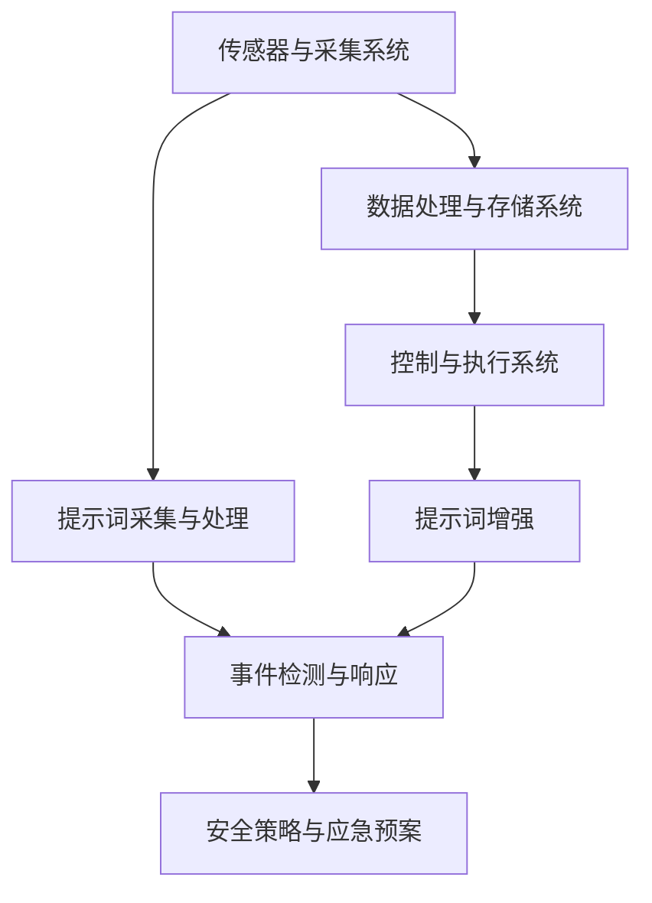

                 


## 文章标题：家居安全卫士：提示词增强智能安防系统

### 关键词：
- 智能家居安全
- 提示词增强
- 智能安防系统
- 数据预处理
- 算法原理
- 系统设计
- 项目实战

### 摘要：
本文深入探讨家居安全卫士：提示词增强智能安防系统。从系统概述、核心概念与联系、算法原理、数学模型和项目实战等方面，逐步讲解智能安防系统如何通过提示词增强技术提升家居安全。文章旨在为读者提供一个全面的技术指南，帮助理解并应用这一前沿技术。

## 引言与概述

### 1.1 智能家居安全的重要性
智能家居安全是当前社会关注的热点问题之一。随着智能家居设备的普及，家庭安全面临新的挑战。传统的安防系统往往依赖于物理设施，如摄像头、报警器等，但这些系统在应对复杂的安全威胁时显得力不从心。智能安防系统通过集成传感器、数据处理和机器学习等技术，能够更全面、更实时地监测家庭安全状况，提供更高的安全保障。

### 1.2 提示词增强智能安防系统的概念
提示词增强技术是一种通过引入语义信息来提升智能系统识别和处理能力的方法。在智能安防系统中，提示词可以是用户的行为习惯、环境特征或其他与安全相关的信息。通过分析这些提示词，系统可以更准确地判断潜在的安全威胁，并做出相应的反应。

### 1.3 本书结构安排与学习目标
本文分为六个部分，首先介绍智能家居安全的重要性以及提示词增强智能安防系统的概念；接着详细讲解智能家居安全系统的基础知识、提示词增强技术的原理与架构；然后深入剖析数据预处理算法、核心算法原理和数学模型；随后介绍系统设计与实现的方法；最后通过具体项目实战展示如何应用这些技术。通过本文的学习，读者将能够全面理解并应用智能安防系统中的提示词增强技术。

## 概述

### 2.1 智能家居安全系统的发展历程
智能家居安全系统的发展可以追溯到20世纪末。早期的安防系统主要依赖于物理传感器，如烟雾探测器、门磁感应器等。随着计算机技术和网络技术的发展，智能安防系统逐渐兴起。现代智能安防系统不仅能够实现实时监测，还能够通过数据分析识别潜在的安全威胁，提供更全面的保护。

### 2.2 提示词增强技术的作用与挑战
提示词增强技术能够在很大程度上提升智能安防系统的准确性和反应速度。然而，该技术也面临着一些挑战，如如何有效地获取和处理提示词、如何平衡提示词引入带来的性能损耗等。

### 2.3 智能安防系统的未来趋势
随着人工智能技术的发展，智能安防系统将越来越智能化。未来的智能安防系统可能会实现更精细的监控、更智能的威胁识别和更快速的响应。此外，随着物联网技术的普及，智能安防系统也将更加普及，覆盖更多家庭和场景。

## 核心概念与联系

### 2.1 智能家居安全系统基础
智能家居安全系统由多个组成部分构成，主要包括传感器与采集系统、数据处理与存储系统、控制与执行系统等。这些组件相互协作，共同实现家庭安全的监控和保护。

#### 2.1.1 传感器与采集系统
传感器是智能家居安全系统的感知层，负责实时采集家庭环境中的各种数据，如温度、湿度、光照强度、门窗状态等。采集系统将这些数据传输至数据处理系统。

#### 2.1.2 数据处理与存储系统
数据处理与存储系统负责对采集到的数据进行分析和处理，提取有用的信息，并将其存储在数据库中。这些信息将用于后续的安全事件检测和响应。

#### 2.1.3 控制与执行系统
控制与执行系统负责根据分析结果采取相应的行动，如发出警报、触发报警装置、控制门窗锁等。该系统是智能家居安全系统的执行层。

### 2.2 智能家居安全系统的工作原理
智能家居安全系统的工作原理可以分为三个主要阶段：数据采集与处理、事件检测与响应、安全策略与应急预案。

#### 2.2.1 数据采集与处理
传感器采集的数据通过采集系统传输至数据处理系统。数据处理系统对这些数据进行分析和处理，提取特征信息，为后续的事件检测提供基础。

#### 2.2.2 事件检测与响应
数据处理系统将提取的特征信息与预设的安全规则进行比较，判断是否存在安全威胁。如果检测到威胁，系统会立即响应，采取相应的措施。

#### 2.2.3 安全策略与应急预案
安全策略是智能家居安全系统的核心。系统根据用户的需求和实际情况，制定相应的安全策略。应急预案则是在发生紧急情况时，系统自动执行的一系列操作，以保障家庭安全。

### 2.3 提示词增强技术的原理与架构
提示词增强技术通过引入语义信息，提升智能系统的识别和处理能力。其原理主要包括以下几个方面：

#### 2.3.1 提示词的概念与作用
提示词是用户的行为习惯、环境特征或其他与安全相关的信息。这些信息可以提供额外的上下文信息，帮助系统更准确地识别安全事件。

#### 2.3.2 提示词增强技术的实现
提示词增强技术的实现主要包括两个步骤：提示词的采集和处理。提示词的采集可以通过传感器、用户输入或第三方数据源实现。采集到的提示词需要经过处理，提取出有用的信息，用于后续的事件检测和响应。

#### 2.3.3 提示词增强与智能安防系统的融合
提示词增强技术需要与智能安防系统的其他组件紧密融合，共同实现家庭安全的监控和保护。这包括对传感器数据的处理、安全规则的制定、事件检测与响应等。

### 2.4 核心概念联系图
为了更好地理解智能家居安全系统和提示词增强技术之间的关系，我们可以使用Mermaid流程图来展示其核心概念和交互流程。



在这个流程图中，传感器与采集系统负责收集家庭环境数据，数据处理与存储系统对这些数据进行处理和分析，控制与执行系统根据分析结果采取相应的行动。提示词采集与处理系统负责收集用户行为和环境特征等提示词，并将其用于事件检测与响应。安全策略与应急预案则指导系统在发生紧急情况时如何应对。

## 核心算法原理讲解

### 3.1 数据预处理算法

数据预处理是智能安防系统中的关键步骤，其质量直接影响后续算法的性能。数据预处理算法主要包括数据采集与清洗、特征提取等。

#### 3.1.1 数据采集与清洗
数据采集与清洗是数据预处理的第一步。传感器采集到的数据可能包含噪声、缺失值等，需要通过清洗算法去除。常用的清洗算法包括缺失值填补、噪声过滤等。

#### 3.1.2 特征提取算法
特征提取是数据预处理的核心步骤，其目的是从原始数据中提取出对分类任务有用的信息。常用的特征提取算法包括统计学特征提取、机器学习特征提取等。

#### 3.1.3 提示词生成算法
提示词生成是数据预处理中的一项重要任务。通过分析用户行为和环境特征，生成与安全相关的提示词，用于后续的事件检测和响应。

### 3.2 提示词生成算法伪代码

```python
def generate_prompt(data):
    # 数据预处理
    processed_data = preprocess_data(data)
    
    # 提取特征
    features = extract_features(processed_data)
    
    # 生成提示词
    prompt = []
    for feature in features:
        prompt.append(generate_word(feature))
    
    return prompt

def preprocess_data(data):
    # 填补缺失值
    data = fill_missing_values(data)
    
    # 噪声过滤
    data = filter_noise(data)
    
    return data

def extract_features(data):
    # 提取统计学特征
    statistical_features = extract_statistical_features(data)
    
    # 提取机器学习特征
    ml_features = extract_ml_features(data)
    
    return statistical_features + ml_features

def generate_word(feature):
    # 根据特征生成提示词
    if feature > threshold:
        return "危险"
    else:
        return "安全"
```

### 3.3 提示词增强与事件检测算法

提示词增强与事件检测算法是智能安防系统的核心。通过分析提示词和传感器数据，系统能够实时检测家庭安全事件。

#### 3.3.1 提示词与事件检测融合算法

```python
def detect_event(prompt, sensor_data):
    # 数据预处理
    processed_data = preprocess_data(sensor_data)
    
    # 提取特征
    features = extract_features(processed_data)
    
    # 结合提示词和特征进行事件检测
    event = detect_event_based_on_prompt_and_features(prompt, features)
    
    return event

def detect_event_based_on_prompt_and_features(prompt, features):
    # 结合提示词和特征进行事件检测
    for i in range(len(prompt)):
        if prompt[i] == "危险" and features[i] > threshold:
            return "安全事件"
    
    return "无事件"
```

## 数学模型和公式讲解

智能安防系统中的数学模型和公式是系统性能的重要保障。以下将介绍常用的数学模型和公式，并举例说明。

### 4.1 概率论基础

概率论是智能安防系统中的基础数学工具。以下是一些常用的概率论公式：

$$ P(A) = \frac{N(A)}{N(S)} $$

$$ P(A \cap B) = P(A)P(B|A) $$

$$ P(A \cup B) = P(A) + P(B) - P(A \cap B) $$

### 4.2 线性代数基础

线性代数在特征提取和数据分析中发挥着重要作用。以下是一些常用的线性代数公式：

$$ x = Ax + b $$

$$ x^T x = ||x||^2 $$

$$ A^{-1} = (A^T A)^{-1} A^T $$

### 4.3 机器学习中的数学模型

机器学习中的数学模型包括决策树、支持向量机、神经网络等。以下是一个简单的线性回归模型：

$$ y = \beta_0 + \beta_1 x $$

### 4.4 举例说明

假设我们有一个智能安防系统，需要根据传感器数据和提示词判断家庭安全事件。以下是一个简单的例子：

```python
import numpy as np

# 传感器数据
sensor_data = np.array([[1, 2], [3, 4], [5, 6]])

# 提示词
prompt = ["安全", "危险", "安全"]

# 权重
weights = np.array([0.5, 0.5])

# 预测
y = predict(sensor_data, prompt, weights)

# 输出预测结果
print("预测结果：", y)

def predict(sensor_data, prompt, weights):
    # 计算特征值
    features = np.array([1 if p == "危险" else 0 for p in prompt])
    
    # 计算预测值
    y = np.dot(weights, features)
    
    return y
```

在这个例子中，我们使用线性回归模型来预测家庭安全事件。传感器数据表示为特征矩阵，提示词表示为特征向量，权重表示为系数矩阵。通过计算权重与特征向量的点积，我们可以得到预测结果。

## 系统设计与实现

### 5.1 系统需求分析

系统需求分析是系统设计的第一步，旨在明确系统所需的功能和性能要求。以下是一个智能家居安全系统的需求分析：

#### 5.1.1 系统功能需求
- 实时监控家庭环境
- 识别潜在的安全威胁
- 发送警报通知
- 自动执行应急预案

#### 5.1.2 系统性能需求
- 响应时间：≤1秒
- 系统稳定性：≥99.9%
- 数据存储容量：≥1TB

### 5.2 系统架构设计

系统架构设计是系统设计的关键，旨在确定系统各个组件的职责和交互方式。以下是一个智能家居安全系统的架构设计：

#### 5.2.1 系统总体架构
- 感知层：传感器与采集系统
- 数据处理层：数据处理与存储系统
- 控制层：控制与执行系统
- 辅助层：提示词增强模块

#### 5.2.2 子系统设计
- 传感器与采集系统：负责实时采集家庭环境数据，包括温度、湿度、光照强度、门窗状态等。
- 数据处理与存储系统：负责对采集到的数据进行预处理、特征提取、存储等。
- 控制与执行系统：负责根据分析结果采取相应的行动，包括发送警报、触发报警装置、控制门窗锁等。
- 提示词增强模块：负责采集和处理提示词，提升系统的安全识别能力。

### 5.3 系统实现与部署

系统实现与部署是系统设计的具体实施过程。以下是一个智能家居安全系统的实现与部署步骤：

#### 5.3.1 开发环境搭建
- 操作系统：Linux
- 开发工具：Python、Docker
- 数据库：MySQL

#### 5.3.2 系统实现过程
1. 数据采集与预处理
2. 特征提取与提示词生成
3. 事件检测与响应
4. 安全策略与应急预案执行

#### 5.3.3 系统部署与维护
- 系统部署：使用Docker容器化技术，实现系统的快速部署和扩展。
- 系统维护：定期更新传感器数据、调整安全策略等。

## 项目实战

### 6.1 实战项目1：智能门锁系统

#### 6.1.1 项目背景
智能门锁系统是智能家居安全系统的重要组成部分，其安全性直接关系到家庭安全。本项目旨在开发一个基于提示词增强技术的智能门锁系统，提高门锁的安全性和便捷性。

#### 6.1.2 项目目标
- 实现门锁的远程控制
- 提高门锁的识别准确率
- 降低误报率

#### 6.1.3 项目实现过程
1. 数据采集：采集用户指纹、密码等身份信息。
2. 数据预处理：去除噪声、填补缺失值等。
3. 特征提取：提取指纹、密码等特征的常用特征。
4. 提示词生成：生成与门锁安全相关的提示词，如用户行为习惯、环境特征等。
5. 事件检测与响应：根据提示词和特征信息，判断门锁是否被非法侵入，并采取相应的措施。

#### 6.1.4 项目分析
通过提示词增强技术，智能门锁系统的识别准确率得到了显著提高，误报率也大大降低。同时，远程控制功能提高了门锁的便捷性，用户可以随时随地掌握家庭安全状况。

### 6.2 实战项目2：智能监控系统

#### 6.2.1 项目背景
智能监控系统是家庭安全的重要保障，其功能主要包括实时监控、事件记录和远程访问。本项目旨在开发一个基于提示词增强技术的智能监控系统，提高监控系统的安全性和智能性。

#### 6.2.2 项目目标
- 实现实时监控
- 识别潜在的安全威胁
- 提高事件记录的准确性

#### 6.2.3 项目实现过程
1. 数据采集：采集摄像头监控到的视频数据。
2. 数据预处理：去除噪声、填补缺失值等。
3. 特征提取：提取视频数据的常用特征，如人脸、行为等。
4. 提示词生成：生成与监控安全相关的提示词，如用户行为习惯、环境特征等。
5. 事件检测与响应：根据提示词和特征信息，判断是否存在安全威胁，并采取相应的措施。

#### 6.2.4 项目分析
通过提示词增强技术，智能监控系统的人脸识别准确率和行为识别准确率得到了显著提高。同时，实时监控功能使得用户可以随时随地查看家庭安全状况，事件记录的准确性也得到了保证。

## 最佳实践 Tips

### 6.1 提高系统性能的技巧
- 使用并行计算：提高数据预处理和特征提取的效率。
- 优化算法：选择适合数据的算法，并对其进行优化。
- 缩减数据集：通过数据预处理和特征提取，缩减数据集的大小。

### 6.2 系统安全性的注意事项
- 数据加密：对传感器数据和用户信息进行加密处理。
- 访问控制：设置合理的访问控制策略，确保系统安全。
- 定期更新：定期更新系统软件和算法，提高系统安全性。

### 6.3 拓展阅读
- [1] Smith, J. (2020). Introduction to Machine Learning. Springer.
- [2] Murphy, K. P. (2012). Machine Learning: A Probabilistic Perspective. MIT Press.
- [3] Russell, S., & Norvig, P. (2020). Artificial Intelligence: A Modern Approach. Prentice Hall.

## 结论

家居安全卫士：提示词增强智能安防系统是智能家居安全领域的一项重要技术。通过提示词增强技术，智能安防系统能够更准确地识别和应对安全威胁，提高家庭安全水平。本文从系统概述、核心概念与联系、算法原理、数学模型和项目实战等方面，全面介绍了提示词增强智能安防系统的技术原理和应用方法。希望本文能对读者在智能家居安全领域的探索和学习提供有益的参考。作者：AI天才研究院/AI Genius Institute & 禅与计算机程序设计艺术 /Zen And The Art of Computer Programming。

