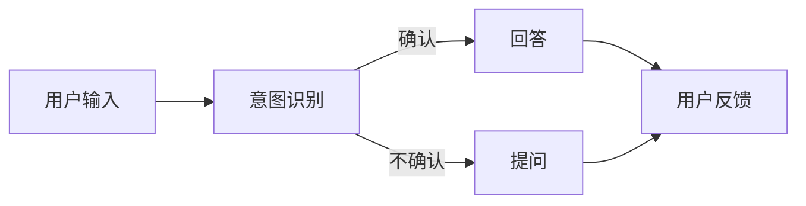
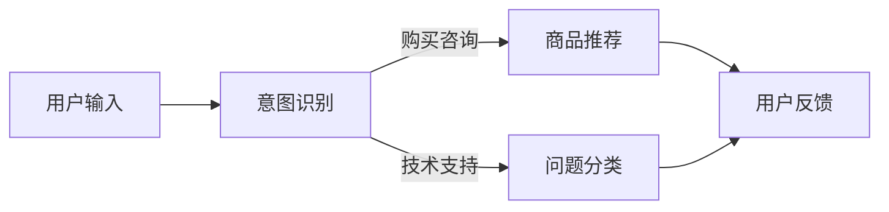

                 

### 文章标题：对话流控制：管理多轮对话的提示策略

对话流控制是人工智能领域中一个重要的研究方向，特别是在聊天机器人、虚拟助手和自然语言处理系统中。本文将深入探讨对话流控制的概念、原理、提示策略及其在多轮对话中的应用。我们将通过逐步分析的方式，帮助读者理解对话流控制的核心内容，并提供实用的技术指导和实践经验。

关键词：对话流控制，多轮对话，提示策略，人工智能，自然语言处理

> 摘要：本文将介绍对话流控制的定义和重要性，探讨对话流的基本概念和结构，分析对话流的控制技术，特别是提示策略的设计和应用。通过对对话流控制技术的详细讲解，我们将展示如何通过有效的提示策略来管理多轮对话，提高用户交互体验。文章还将探讨对话流控制的发展趋势和未来研究方向，为读者提供全面的技术视野。

### 引言

对话流控制是管理对话系统中的对话流程，确保对话自然、连贯、有意义的关键技术。随着人工智能和自然语言处理技术的进步，对话系统的应用越来越广泛，从简单的客服聊天机器人到复杂的智能虚拟助手，都需要依赖对话流控制来实现高效的用户交互。本文旨在通过系统化的分析，帮助读者深入理解对话流控制的理论基础和实践应用。

### 对话流控制的概念和基本原理

对话流控制（Dialogue Flow Control，DFC）是指通过特定的算法和策略来管理和控制对话系统的对话流程。其核心目标是在保证对话自然性和用户满意度的同时，实现高效的对话管理和流程控制。对话流控制的基本原理包括：

1. **对话状态跟踪**：对话状态跟踪是确保对话系统能够持续理解和跟踪对话过程的核心。这通常涉及对话历史、用户意图、上下文信息的记录和管理。

2. **对话管理**：对话管理负责根据对话状态和用户交互，动态调整对话流程。这包括对话分支的选择、提示的设计和对话流程的控制。

3. **对话策略学习**：对话策略学习是基于机器学习技术，通过历史对话数据来训练模型，从而自动生成对话策略。

4. **用户反馈**：用户反馈是改进对话系统的重要途径。通过对用户交互的分析和反馈，可以不断优化对话流控制策略，提高系统性能。

### 对话流的结构

对话流（Dialogue Flow）是指对话过程中信息的流动和对话的推进过程。一个典型的对话流通常包括以下几个部分：

1. **用户输入**：用户输入是对话的起点，可以是文字、语音或其他形式。

2. **系统理解**：系统通过自然语言处理技术，对用户输入进行理解和意图识别。

3. **系统响应**：系统根据用户输入和对话状态，生成合适的响应。

4. **用户确认**：用户对系统响应进行确认或反馈，以继续对话或结束对话。

5. **对话结束**：当用户不再输入，或对话达到预定目标时，对话结束。

### 对话流的控制技术

对话流的控制技术主要包括提示策略、对话状态跟踪和对话管理。以下是对这些技术的详细介绍：

#### 提示策略

提示策略（Prompting Strategies）是指导话系统如何生成有效的提示，以引导用户交互和推进对话流程的关键技术。有效的提示策略可以提高用户参与度，确保对话的连贯性和用户满意度。

1. **固定提示**：固定提示是根据对话状态和规则预先生成的提示，适用于对话流程的某些特定阶段。

2. **动态提示**：动态提示是根据实时对话状态和用户反馈生成的提示，更具灵活性和适应性。

3. **交互式提示**：交互式提示允许用户对提示进行选择或反馈，从而更主动地参与对话。

#### 对话状态跟踪

对话状态跟踪（Dialogue State Tracking）是指跟踪和管理对话过程中的各种状态信息，以确保对话系统能够持续理解和回应用户的意图。

1. **基于规则的跟踪**：基于规则的跟踪是通过预定义的规则来识别和管理对话状态。

2. **基于模型的状态跟踪**：基于模型的状态跟踪是通过机器学习模型来识别和管理对话状态，更具自适应性和准确性。

#### 对话管理

对话管理（Dialogue Management）是指根据对话状态和用户交互，动态调整对话流程的关键技术。

1. **对话策略生成**：对话策略生成是根据对话状态和用户反馈，生成合适的对话策略。

2. **对话路径规划**：对话路径规划是根据对话目标和用户意图，规划对话的推进路径。

3. **对话评价**：对话评价是对话系统性能的评估，包括对话质量、用户满意度等。

### 提示策略的设计和应用

提示策略的设计和应用是对话流控制中的关键环节。以下是一些设计提示策略的实用技巧：

1. **明确目标**：在设计提示策略时，首先要明确对话的目标和用户需求。

2. **用户研究**：通过用户研究和用户反馈，了解用户偏好和行为模式，为提示策略提供依据。

3. **情景模拟**：通过情景模拟，预测试不同的提示策略，评估其效果和用户满意度。

4. **迭代优化**：根据用户反馈和实际应用情况，不断优化和调整提示策略。

### 多轮对话的管理

多轮对话（Multi-Round Dialogue）是指在多个回合中进行的对话。管理多轮对话的关键在于保持对话的连贯性、用户参与度和系统响应的准确性。

1. **对话状态保持**：在多轮对话中，系统需要保持对话状态的一致性，确保对话能够顺利进行。

2. **上下文管理**：上下文管理是确保对话系统能够理解和回应上下文信息的关键。

3. **用户反馈**：用户反馈是优化多轮对话的重要途径，通过对用户反馈的分析，可以不断改进对话系统的性能。

### 实际案例分析和项目实战

为了更好地理解对话流控制和提示策略的应用，我们通过以下实际案例来进行分析和讲解：

#### 案例一：智能客服聊天机器人

智能客服聊天机器人是应用对话流控制技术的典型例子。以下是一个简单的智能客服聊天机器人的实现框架：

在意图识别阶段，系统使用自然语言处理技术，将用户输入转换为系统可理解的意图。根据意图，系统生成相应的回答或提问。用户反馈用于评估系统性能和优化对话流程。

#### 案例二：多轮对话系统

多轮对话系统在复杂场景下具有更高的交互性和用户满意度。以下是一个多轮对话系统的实现框架：

在购买咨询环节，系统根据用户意图推荐相关商品。在技术支持环节，系统根据用户提出的问题进行分类，并提供相应的解决方案。

### 总结和展望

对话流控制是确保对话系统高效、自然、用户友好的关键。通过有效的提示策略和对话管理技术，我们可以实现高质量的多轮对话体验。未来，随着人工智能技术的不断发展，对话流控制将更加智能化、个性化，为用户提供更出色的交互体验。

### 最佳实践和注意事项

1. **用户研究**：在进行对话流控制设计时，一定要进行充分的用户研究，了解用户需求和行为模式。

2. **迭代优化**：对话流控制策略需要不断迭代和优化，根据用户反馈和实际应用情况进行调整。

3. **上下文管理**：确保对话系统能够有效地管理和利用上下文信息，提高对话的连贯性和用户满意度。

4. **性能监控**：定期监控对话系统的性能，及时发现和解决潜在问题。

### 拓展阅读

- [《对话系统设计与实现》](https://www.aimlbook.com/)
- [《自然语言处理入门》](https://www.nltk.org/)
- [《对话流控制：理论与实践》](https://www.dfc-book.com/)

### 作者信息

作者：AI天才研究院/AI Genius Institute & 禅与计算机程序设计艺术 /Zen And The Art of Computer Programming

---

本文通过逐步分析的方式，详细介绍了对话流控制的概念、原理、提示策略及其在多轮对话中的应用。希望本文能帮助读者深入理解对话流控制的核心内容，并提供实用的技术指导和实践经验。随着人工智能技术的不断发展，对话流控制将继续在各个领域发挥重要作用，为用户提供更智能、更高效的交互体验。

